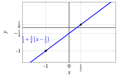
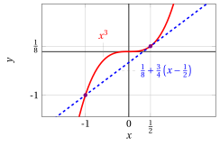
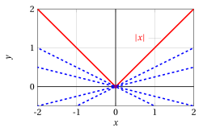
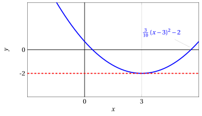
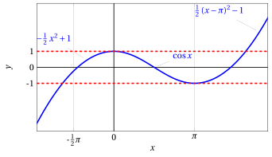
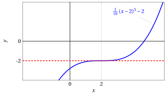
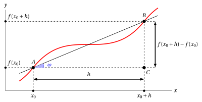
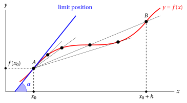

# The derivative function

**Part 4 · Derivatives · Chapter 1** · lecture notes by Fabio Furini · [:material-file-pdf-box: Lecture notes, volume (PDF)](../pdf/lecture-notes-4-derivatives.pdf) · [:material-presentation: Slides (PDF)](../pdf/slides-derivatives-01-the-derivative.pdf)

## 1. Line through two points

- Starting from two points

    $$
    (x_1,y_1) {\rm ~~and ~~} (x_2,y_2)
    $$

    it is possible to compute the function

    $$
    y = m \: x + q
    $$

    whose graph is the line through the two points (equation of the line in explicit form).  The <strong>slope</strong> of the line is the value $m$ and the <strong>$y$-intercept</strong> of the line is the value $q$.

- Requiring the line to pass through the two points we have:

    $$
    \begin{cases}
    y_1 = m \: x_1 + q \\[1ex]
    y_2 = m \: x_2 + q
    \end{cases}
    $$

    and we can determine $m$ and $q$ as follows (two equations in two unknowns):

    $$
    \begin{cases}
    q =    y_1 - m \: x_1\\[1ex]
    q =    y_2 - m \: x_2
    \end{cases}
    \qquad
    \begin{cases}
    q = y_1 - m \: x_1\\[1ex]
    y_1 - m \: x_1 = y_2 - m \: x_2  {\rm ~~~which~becomes~~~} m \: x_2 - m \: x_1 = y_2 - y_1
    \end{cases}
    $$

    $$
    \begin{cases}
    q =    y_1 - m \: x_1\\[1ex]
    m =   \frac{y_2 -y_1}{x_2 - x_1}
    \end{cases}
    \qquad
    \begin{cases}
    q =    y_1 - \frac{y_2 -y_1}{x_2 - x_1} \: x_1\\[1ex]
    m =   \frac{y_2 -y_1}{x_2 - x_1}
    \end{cases}
    $$

    And we obtain the line:

    $$
    y = \underbrace{\frac{y_2 -y_1}{x_2 - x_1}}_{m} \: x + \underbrace{y_1 - \frac{y_2 -y_1}{x_2 - x_1} \: x_1}_{q} {\rm ~~~~~clearly~~~~~} \frac{y_2 -y_1}{x_2 - x_1} = \frac{y_1 -y_2}{x_1 - x_2}
    $$

!!! chiave ""

    The line through two points $(x_1,y_1)$ and $(x_2,y_2)$:

    $$
    y = \underbrace{\frac{y_2 -y_1}{x_2 - x_1}}_{m} \: x + y_1 - \underbrace{\frac{y_2 -y_1}{x_2 - x_1}}_{m} \: x_1 {\rm ~~can~be~rewritten~as~~} y = m \: x + y_1 - m \: x_1.
    $$

    Hence the line can be written only in terms of the slope $m$ and the point $(x_1,y_1)$ as follows:

    $$
    y = y_1 + m \;(x-x_1) {\rm ~~~~with~~~~} m= \frac{y_1 - y_2}{x_1-x_2}
    $$

    The same holds for any point $(\tilde{x},\tilde{y})$ of the line; in this case we would have:

    $$
    y = \tilde{y} + m (x-\tilde{x})
    $$

!!! esempio "Example 1: Line through two points"

    We compute the line through the points: $(x_1,y_1)=(-1, -1)$ and  $(x_2,y_2)=\left(\frac{1}{2},\frac{1}{8}\right)$. We compute the slope:

    $$
    m = \frac{y_2 -y_1}{x_2 - x_1} = \frac{\frac{1}{8}+1}{\frac{1}{2}+1}=\frac{3}{4}
    $$

    Using the point $(x_2,y_2)=\left(\frac{1}{2},\frac{1}{8}\right)$  we obtain:

    $$
    y = \frac{1}{8} + \frac{3}{4} \left(x -\frac{1}{2}\right) = \frac{3}{4} \; x - \frac{1}{4}
    $$

    { .fig .ovale loading=lazy style="width:70%" }

    Now using the point $(x_1,y_1)=\left(-1,-1\right)$  we obtain the  same line:

    $$
    y = -1 + \frac{3}{4} \left(x +1\right) = \frac{3}{4} \; x - \frac{1}{4}
    $$

## 2. Tangent line

!!! chiave ""

    What is the <strong>tangent</strong> line to the graph of a function at a point?

- The intuitive definition of a line tangent to the graph is that of a line that “touches” the graph without “cutting” or “crossing” it (imagining the curve as if it were an impenetrable physical object)

- This intuitive definition works, for example, for parabolas or hyperbolas. However, take for example the function $f(x)=x^3$

    $$
    {\rm the~graph~~} y = x^3 {\rm ~~~~and~the~line~~~~}  y= \frac{1}{8} + \frac{3}{4} \left(x -\frac{1}{2}\right)
    $$

    { .fig .ovale loading=lazy style="width:70%" }

    the intuitive definition works at the point $\left(\frac{1}{2},\frac{1}{8}\right)$, but the line also intersects the graph of the function at the point $(-1,-1)$.

- Conversely, there are functions, such as $f(x)=|x|$, whose graph is

    $$
    y = |x|
    $$

    { .fig .ovale loading=lazy style="width:70%" }

    This graph has a point (the origin) at which there are infinitely many lines satisfying the intuitive definition, but clearly none of them can be called tangent.

!!! chiave ""

    Geometrically, the tangent line can be approximated by the <strong>line through two points</strong> very close to each other on the curve, the first one <strong>fixed</strong> (the point of tangency) and the other one “<strong>moving</strong>” (and chosen closer and closer to the point of tangency).

- Two points determine a line; the closer the two points get, the closer this line gets to the tangent. We therefore need to understand what happens to the line through the two points when the second, moving point gets closer and closer to the first one, without ever coinciding with it. The “<strong>limit line</strong>” - if it exists - will be called the <strong>tangent</strong> line.

!!! chiave ""

    A further way of looking at the concept of tangency is to think of the tangent (to a curve at a point) as the line that <strong>best approximates</strong> the curve in a neighborhood of the point.

### 2.1 Practical use of the tangent line

!!! chiave ""

    Computing the tangent is important to determine the points where the graph of a function has a <strong>horizontal tangent</strong> (local or global maximum and minimum points, and possibly other points as well).

- It is therefore useful to be able to write analytically the equation of the tangent line to the curve at a generic point, and then see at which points it is horizontal. This idea is due first to Fermat, who developed it around 1630.

!!! esempio "Example 2: Graph of a function – point with horizontal tangent"

    Consider the function:

    $$
    f(x) = \frac{3}{10} \: (x-3)^2 - 2
    $$

    { .fig .ovale loading=lazy style="width:70%" }

    The function has a point with horizontal tangent, which is a global minimum point.

!!! esempio "Example 3: Graph of a function – points with horizontal tangent"

    Consider the (piecewise-defined) function:

    $$
    f(x) =
    \begin{cases}
    - \frac{1}{2} \: x^2 + 1 & x \le  0\\[1ex]
    \cos x & 0 < x \le \pi\\[1ex]
    \frac{1}{2} \: (x-\pi)^2 - 1 &  x > \pi
    \end{cases}
    $$

    { .fig .ovale loading=lazy style="width:70%" }

    The function has two points with horizontal tangent, which are local minimum and maximum points, for  example in the interval $\left[-\frac{1}{2}\;\pi,\pi\right]$.

    Now consider the function:

    $$
    f(x) = \frac{1}{10} \: (x-2)^3 - 2
    $$

    { .fig .ovale loading=lazy style="width:70%" }

    The function has a point with horizontal tangent which, however, is neither a maximum nor a minimum point.

<strong>Try it</strong> — the interactive graph below shows what you have just read: move the sliders.

## 3. Derivative of a function at a point and derivative function

- <strong>Differential calculus</strong> is the study of the notion of derivative, and it is part of infinitesimal calculus.

### 3.1 Derivative and tangent line

!!! chiave ""

    We look for the <strong>equation of the tangent line</strong> to the graph of the function at a <strong>generic point</strong> $A$ of its graph.

- Consider  the graph of a generic function $y = f(x)$;  the coordinates of the points $A$ and $B$ in the figure are respectively:

    $$
    \big(x_0, f(x_0)\big) {\rm ~~~~and~~~~} \big(x_0 + h, f(x_0 + h)\big)
    $$

{ .fig .ovale loading=lazy style="width:80%" }

- The <strong>slope</strong> of the line through the point $A$ and the point $B$ is:

    $$
    \frac{f(x_0 + h) - f(x_0)}{h}
    $$

    Note that a positive slope indicates (on average) a rise, while a negative one indicates a fall (on average).

    !!! chiave ""

        This ratio is called the <strong>difference quotient</strong> of the function $f$ relative to the interval $[x_0, x_0 + h]$.

- Geometrically, since the triangle $ABC$ is a right triangle, we have:

    $$
    \frac{f(x_0 + h) - f(x_0)}{h} ~=~ \tan \omega \quad ({\rm \textbf{slope}~of~the~line~~through~} A {\rm ~and~} B)
    $$

- Consider the difference quotient and take the limit (assuming it exists) as $h \rr 0$. Geometrically we have:

    1. the point $A$, with coordinates $\big(x_0, f (x_0)\big)$, stays fixed

    2. while the point $B$, with coordinates $\big(x_0 + h, f (x_0 + h)\big)$, moves towards $A$ (staying on the graph of $f$).

{ .fig .ovale loading=lazy style="width:80%" }

- Moving $B$ towards $A$ along the graph of the function, the line $AB$ changes its slope and settles into a <strong>limit position</strong>.

!!! chiave ""

    1. the <strong>limit line</strong> is called the <strong>tangent line to the graph</strong> of the function $f$ at the point with abscissa $x_0$;

    2. its <strong>slope</strong> is given by $\tan \alpha$ and is called the <strong>first derivative</strong> of the function $f$ at the point $x_0$.

    3. The angle $\alpha$ is the angle  between the tangent line and the $x$-axis.

!!! definizione "Definition 1: of derivative"

    Let $f: (a, b) \rr \R$;  $f$ is said to be differentiable at $x_0  \in (a, b)$ if the following limit exists and is finite

    $$
    \lim_{h \rr 0} \frac{f(x_0 + h) - f(x_0)}{h} = \lim_{x \rr x_0} \frac{f(x) - f(x_0)}{x - x_0}
    $$

    this limit is called the first derivative (or simply the derivative) of $f$ at $x_0$.

!!! chiave ""

    With $h=x-x_0$, we have $h \rr 0 \Leftrightarrow x-x_0 \rr 0 \Leftrightarrow  x \rr x_0$ and $x=x_0 + h$,  hence:

    $$
    \lim_{h \rr 0} \frac{f(x_0 + h) - f(x_0)}{h} = \lim_{x \rr x_0} \frac{f(x) - f(x_0)}{x - x_0}
    $$

- To denote the derivative  the following symbols are used:

    $$
    \underbrace{f'(x_0)}_{{\rm \textbf{Lagrange's~notation}}}  \qquad
    \underbrace{\dot{f}(x_0)}_{{\rm Newton's~notation}} \qquad
    \underbrace{\frac{df}{dx}\bigg\vert _{x=x_0} {\rm~~~~and~~~~~~} \frac{dy}{dx}\bigg\vert _{x=x_0}}_{{\rm Leibniz's~notation}}
    $$

!!! definizione "Definition 2: tangent line
"

    Given a function $f: (a, b) \rr \R$ with  $f$ differentiable at $x_0 \in (a, b)$, the line with equation:

    $$
    y = f(x_0) + f'(x_0) \: (x - x_0)
    $$

    is called the <strong>tangent line</strong> to the graph of the function $f$ at the point $\big( x_0 , f ( x_0 )\big)$.

!!! esempio "Example 4: Tangent line"

    We compute the equation of the tangent line to the graph of the function $f(x) = x^3$ at the point with abscissa $x_0 = \frac{1}{2}$. The derivative at the point $x_0 = \frac{1}{2}$ is:

    \begin{align*}
    \lim_{h \rr 0} \frac{f(x_0 + h) - f(x_0)}{h} &= \lim_{h \rr 0} \frac{\left(\frac{1}{2} + h\right)^3 - \left(\frac{1}{2}\right)^3 }{h} = \lim_{h \rr 0} \frac{\frac{1}{8} + \frac{3}{4} \;h + \frac{3}{2} \; h^2+ h^3 -  \frac{1}{8} }{h} = \lim_{h \rr 0} \left( \frac{3}{4} + \frac{3}{2} \; h+ h^2 \right) =  \frac{3}{4}
    \end{align*}

    We have  $f\left(\frac{1}{2}\right)=\frac{1}{8},~~f'\left(\frac{1}{2}\right)=\frac{3}{4}$ and the tangent line at the point $\left(\frac{1}{2},\frac{1}{8} \right)$ is:

    $$
    y = f(x_0) + f'(x_0) \: (x - x_0) = \frac{1}{8} + \frac{3}{4} \left(x -\frac{1}{2}\right)
    $$

    { .fig .ovale loading=lazy style="width:56%" }

!!! esempio "Example 5: Tangent line"

    We compute the equation of the tangent line to the graph of the function $f(x) = x^3$ at the point with abscissa $x_0 = -1$. The derivative at the point $x_0 = -1$ is:

    \begin{align*}
    \lim_{h \rr 0} \frac{f(x_0 + h) - f(x_0)}{h} &= \lim_{h \rr 0} \frac{\left(-1 + h\right)^3 - \left(-1\right)^3 }{h} = \lim_{h \rr 0} \frac{-1 + 3 \;h - 3\; h^2+ h^3 +  1 }{h} \\[2ex]
    &= \lim_{h \rr 0} \left( 3 - 3 \; h+ h^2 \right) =  3
    \end{align*}

    We have $f\left(-1\right)=-1,~~f'\left(-1\right)=3$ and the tangent line at the point $\left(-1,-1 \right)$ is:

    $$
    y = f(x_0) + f'(x_0) \: (x - x_0) = -1 + 3 \left(x +1\right)
    $$

    { .fig .ovale loading=lazy style="width:56%" }

- We can now define a  function that associates to each  $x$ the derivative of a function $f$  at the point $x$ (of course, if $f$ is differentiable).

!!! definizione "Definition 3: of derivative function"

    If a function $f$ is differentiable at every point of an interval $(a, b)$, the function:

    $$
    f': (a,b) \rr \R, ~~~ f': x \mapsto f'(x)
    $$

    is called the <strong>derivative function</strong> of $f$.

- To denote the first derivative function the following notations are used:

    $$
    \underbrace{f'(x)}_{{\rm \textbf{Lagrange's~notation}}}  \qquad
    \underbrace{\dot{f}(x)}_{{\rm Newton's~notation}} \qquad
    \underbrace{ \frac{df}{dx} {\rm~~~~,~~~~~~} \frac{df(x)}{dx}  {\rm~~~~and~~~~~~} \frac{dy}{dx}}_{{\rm Leibniz's~notation}}
    $$

!!! esempio "Example 6: derivative function"

    We compute the derivative function of the function $f(x) = x^3$. For every $x \in \R$ we have:

    \begin{align*}
    \lim_{h \rr 0} \frac{f(x + h) - f(x)}{h} &= \lim_{h \rr 0} \frac{\left(x + h\right)^3 - \left(x \right)^3 }{h} = \lim_{h \rr 0} \frac{x^3 + 3\; x^2\;h + 3\;x\; h^2+ h^3 -  x^3 }{h} \\[2ex]
    &= \lim_{h \rr 0} \left( 3\;x^2 + 3 \; x\; h+ h^2 \right) =  3\;x^2 {\rm ~~~~~hence~~~~} f'(x) = 3\;x^2
    \end{align*}

    { .fig .ovale loading=lazy style="width:49%" }

    We compute the derivative function of the function $f(x) = |x|$. For $x \neq 0$, we have:

    $$
    f(x)=
    \begin{cases}
    x & {\rm ~~if~~} x > 0 {\rm ~~~and~~~~} \displaystyle \lim_{h \rr 0} \frac{f(x + h) - f(x)}{h} = \lim_{h \rr 0} \frac{x + h - x }{h} =  1 {\rm ~~~hence~~~~} f'(x)=1\\[4ex]
    -x & {\rm ~~if~~} x < 0 {\rm ~~~and~~~~} \displaystyle \lim_{h \rr 0} \frac{f(x + h) - f(x)}{h} = \lim_{h \rr 0} \frac{-(x + h) + x }{h} =  -1 {\rm ~~~hence~~~~} f'(x)=-1
    \end{cases}
    $$

    For $x = 0$ we have:

    $$
    \frac{f(x + h) - f(x)}{h} =\frac{f(h) - f(0)}{h} = \frac{|h|}{h} {\rm ~~~~hence~~~~}
    \lim_{h \rr 0^+}\frac{|h|}{h} = \lim_{h \rr 0^+} \frac{h}{h} = 1,~~ \lim_{h \rr 0^-} \frac{|h|}{h} = \lim_{h \rr 0^-} \frac{-h}{h} = -1
    $$

    since if $h \rr 0^+$ then $|h| = h$ and if $h \rr 0^-$ then $|h| = -h$.  We conclude that, since the limit of the difference quotient does not exist, $f$ is not differentiable at $x =0$. The function is continuous at the origin but the tangent is not well defined.

    { .fig .ovale loading=lazy style="width:49%" }

### 3.2 Continuity and differentiability

!!! teorema "Theorem 1"

    Given a function $f:[a,b] \rr \R$,  if $f$ is differentiable at a point $x_0 \in (a,b)$ then it is continuous at $x_0$.

??? dimostrazione "Proof"

    The function is differentiable at $x_0 \in (a,b)$,  so we write:

    $$
    f(x_0+h) - f(x_0) = \frac{f(x_0+h) - f(x_0)}{h} \cdot h \thicksim f'(x_0) \cdot h {\rm ~~for~~} h \rr 0
    $$

    Moreover we have

    $$
    f'(x_0) \cdot h \rr 0 {\rm ~~for~~} h \rr 0
    $$

    Therefore

    $$
    \lim_{h \rr 0} \big(f(x_0+h) - f(x_0)\big) = 0 {\rm ~~~~hence~~~~~} \lim_{h \rr 0} f(x_0+h)  =  f(x_0)
    $$

    Setting $x_0+h=x$ we have $h \rr 0$ if and only if $x \rr x_0$, and consequently we have:

    $$
    \lim_{x \rr x_0} f(x)  =  f(x_0)
    $$

    
□

- A possible alternative but equivalent proof is the following:

??? dimostrazione "Proof"

    The function is differentiable at $x_0 \in (a,b)$,  so we write:

    \begin{align*}
    \lim_{h \rr 0}f(x_0+h)  &=  \lim_{h \rr 0}f(x_0+h) -f(x_0) + f(x_0)\\[2ex]
     &= \lim_{h \rr 0} \underbrace{\underbrace{\frac{f(x_0+h) - f(x_0)}{h}}_{\rr f'(x_0)} \cdot h}_{\rr 0} + f(x_0) = f(x_0)
    \end{align*}

    Setting $x_0+h=x$ we have $h \rr 0$ if and only if $x \rr x_0$, and consequently we have:

    $$
    \lim_{x \rr x_0} f(x)  =  f(x_0)
    $$

    
□

!!! chiave ""

    Given a function $f$,  differentiability at a point $x_0$ in the interior of its domain implies continuity at the point $x_0$:

    \begin{equation}
    f {\rm ~~is~differentiable~at~} x_0 ~~\Rightarrow~~ f {\rm ~~is~continuous~at~} x_0 \label{BBB}
    \end{equation}

    but the converse is not true:

    \begin{equation}
    f {\rm ~~is~continuous~at~} x_0  ~~\nRightarrow~~ f {\rm ~~is~differentiable~at~} x_0
     \label{CCC}
    \end{equation}

    a counterexample is the function  $f(x) = |x|$, which is continuous at $x_0 = 0$ but not differentiable at $x_0=0$.  Consequently, <strong>if a function  is continuous at $x_0$,  it is not necessarily  differentiable at $x_0$</strong>.

- The fact that $f$  is differentiable  at $x_0$ is a sufficient but not necessary condition for $f$ to be continuous at $x_0$. Moreover,  the fact that $f$  is continuous  at $x_0$ is a necessary but not sufficient condition for $f$ to be differentiable at $x_0$.

- From the contrapositive  of \(\eqref{BBB}\) we have:

    $$
    f {\rm ~~is~not~continuous~at~} x_0 ~~\Rightarrow~~ f {\rm ~~is~not~differentiable~at~} x_0
    $$

    that is, if a function is discontinuous at $x_0$ it cannot be differentiable at $x_0$.
