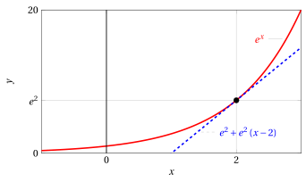
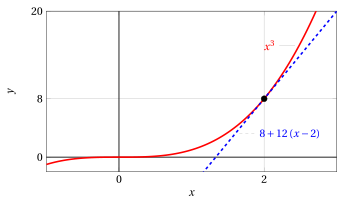

# Derivatives of elementary functions

**Part 4 · Derivatives · Chapter 2** · lecture notes by Fabio Furini · [:material-file-pdf-box: Lecture notes, volume (PDF)](../pdf/lecture-notes-4-derivatives.pdf) · [:material-presentation: Slides (PDF)](../pdf/slides-derivatives-02-elementary-derivatives.pdf)

## 1. Derivatives of elementary functions

- In what follows we derive the derivative functions of some of the main elementary functions.

!!! osservazione "Remark 1"

    Given the function $f(x)=c$ with $c \in \R$ constant, the derivative function is $f'(x)=0$.

??? dimostrazione "Proof"

    We have:

    $$
    \frac{f(x + h) - f(x)}{h} = \frac{c - c}{h} = 0
    $$

    hence

    $$
    f'(x) = \lim_{h \rr 0} \frac{f(x + h) - f(x)}{h} = \lim_{h \rr 0} 0 = 0
    $$

    
□

### 1.1 Derivatives of power functions

!!! osservazione "Remark 2"

    Given the function $f(x)=x^n$ with $n \in \N, n \ge 1$, the derivative function is $f'(x)=n\;x^{n-1}$.

??? dimostrazione "Proof"

    From the binomial theorem (Newton's binomial formula) we have:

    \begin{align*}
    \frac{f(x + h) - f(x)}{h} &= \frac{(x+h)^n-x^n}{h} = \frac{\sum_{k=0}^{n} ~~{{n}\choose{k}} ~~\; x^{n-k} \; h^k- x^n}{h} \\[2ex]
    &= \frac{x^n+ n \;x^{n-1} \;h +\sum_{k=2}^{n} ~~{{n}\choose{k}} ~~\; x^{n-k} \; h^k- x^n}{h} \\[2ex]
    &=  n \;x^{n-1} + \frac{ \sum_{k=2}^{n} ~~{{n}\choose{k}} ~~\; x^{n-k} \; h^k}{h}
    \end{align*}

    hence

    $$
    f'(x) = \lim_{h \rr 0} \frac{f(x + h) - f(x)}{h} = \lim_{h \rr 0} n \;x^{n-1} + \underbrace{\frac{ \sum_{k=2}^{n} ~~{{n}\choose{k}} ~~\; x^{n-k} \; h^k}{h}}_{\rr 0} = n \;x^{n-1}
    $$

    
□

??? dimostrazione "Proof"

    With $n=2$, we have:

    $$
    \frac{f(x + h) - f(x)}{h} = \frac{(x+h)^2 - x^2}{h} = \frac{x^2 + 2\:x\:h + h^2 - x^2}{h} = 2\:x + h
    $$

    hence

    $$
    f'(x)= \lim_{h \rr 0} \frac{f(x + h) - f(x)}{h} = \lim_{h \rr 0} 2\:x + h = 2\:x
    $$

    
□

!!! osservazione "Remark 3"

    Given the function $f(x)=x^{\alpha}$ with $\alpha \in \R$, the derivative function is $f'(x)=\alpha\;x^{\alpha-1}$ for $x >0$.

??? dimostrazione "Proof"

    Let $x >0$. We have:

    \begin{align*}
    \frac{f(x + h) - f(x)}{h} & =  \frac{(x + h)^{\alpha} - x^{\alpha}}{h} =  \frac{ \left(x \left(1 + \frac{h}{x} \right)\right)^{\alpha} -x^{\alpha}}{h}\\[2ex]
    &= x^{\alpha} \cdot \frac{ \left(1 + \frac{h}{x}\right)^{\alpha} -1}{h} \thicksim x^{\alpha} \cdot \frac{ \alpha \: \frac{h}{x} }{h} = \alpha \: x^{\alpha-1} {\rm ~~for~~} h \rr 0
    \end{align*}

    where we used the fundamental limit

    $$
    \big(1 + \varepsilon(h)\big)^{\alpha} -1 \thicksim \alpha \: \varepsilon (h)  {\rm ~~~for~~~} \varepsilon(h) \rr 0
    $$

    where

    $$
    \varepsilon (h) = \frac{h}{x}  \rr 0 {\rm ~~for~~} h \rr 0.
    $$

    Hence

    $$
    f'(x)= \lim_{h \rr 0} ~\frac{f(x + h) - f(x)}{h} = \lim_{h \rr 0} ~~\alpha \; x^{\alpha-1} = \alpha \; x^{\alpha-1}
    $$

    
□

!!! esempio "Example 1: Derivative function"

    
<table>
    <tr>
    <td>\(f(x)=x^{10}\)</td>
    <td>\(\qquad\)</td>
    <td>\(f'(x)=10\:x^9\)</td>
    <td>(for \(x \in \R\))</td>
    </tr>
    <tr>
    <td>\(f(x)=\frac{1}{x} = x^{-1}\)</td>
    <td>\(\qquad\)</td>
    <td>\(f'(x)=-\frac{1}{x^2}\)</td>
    <td>(for \(x >0\))</td>
    </tr>
    <tr>
    <td>\(f(x)=\sqrt{x}=x^{\frac{1}{2}}\)</td>
    <td>\(\qquad\)</td>
    <td>\(f'(x)=\frac{1}{2\:\sqrt{x}}\)</td>
    <td>(for \(x >0\))</td>
    </tr>
    </table>

### 1.2 Derivatives of elementary trigonometric functions

!!! osservazione "Remark 4"

    Given the function $f(x)=\sin x$, the derivative function is $f'(x)=\cos x$.

??? dimostrazione "Proof"

    Using the addition formulas we have:

    \begin{align*}
    \frac{f(x + h) - f(x)}{h} &= \frac{\sin(x + h) - \sin x }{h} = \frac{ \sin x \cos h +\sin h \cos x - \sin x }{h} = \\[2ex]
    & = {\sin x \: \frac{\cos h -1}{h}} + {\frac{\sin h}{h}} \cos x
    \end{align*}

    Using the fundamental limit

    $$
    \frac{1-\cos h}{h^2} \rr \frac{1}{2} {\rm ~~~for~~~} h \rr 0
    $$

    we have

    $$
    \frac{\cos h - 1}{h}  = {h} \cdot \left( \underbrace{-\frac{1 -\cos h}{h^2}}_{\rr -\frac{1}{2} {\rm ~~~for~~~} h \rr 0} \right) \thicksim -\frac{1}{2} \: h  {\rm ~~~for~~~} h \rr 0.
    $$

    Using the fundamental limit

    $$
    \frac{\sin h}{h} \rr 1 {\rm ~~~for~~~} h \rr 0
    $$

    we have

    $$
    {\frac{\sin h}{h}} \cos x \thicksim \cos x  {\rm ~~~for~~~} h \rr 0.
    $$

    Then

    \begin{align*}
    f'(x) &=\lim_{h \rr 0} \frac{f(x + h) - f(x)}{h} = \lim_{h \rr 0} {\sin x \: \frac{\cos h -1}{h}} + {\frac{\sin h}{h}} \cos x  \\[2ex]
      & = \lim_{h \rr 0} \sin x \: \left(-\frac{1}{2} \: h\right) + \cos x = \cos x
    \end{align*}

    
□

!!! osservazione "Remark 5"

    Given the function $f(x)=\cos x$, the derivative function is $f'(x)=-\sin x$.

??? dimostrazione "Proof"

    Using the addition formulas we have:

    \begin{align*}
    \frac{f(x + h) - f(x)}{h} &= \frac{\cos(x + h) - \cos x }{h} = \frac{ \cos x \cos h -\sin x \sin h - \cos x }{h} = \\[2ex]
    & = {\cos x \: \frac{\cos h -1}{h}} - {\frac{\sin h}{h}} \sin x
    \end{align*}

    and, using the arguments of the previous proof, we have:

    \begin{align*}
    f'(x) &=\lim_{h \rr 0} \frac{f(x + h) - f(x)}{h} = \lim_{h \rr 0} {\cos x \: \frac{\cos h -1}{h}} - {\frac{\sin h}{h}} \sin x  \\[2ex]
      & = \lim_{h \rr 0} \cos x \: \left(-\frac{1}{2} \: h\right) - \sin x = -\sin x
    \end{align*}

    
□

### 1.3 Derivatives of the exponential and logarithmic functions with base $e$

!!! osservazione "Remark 6"

    Given the function $f(x)=e^x$, the derivative function is $f'(x)=e^x$.

??? dimostrazione "Proof"

    We have

    $$
    \frac{f(x + h) - f(x)}{h} = \frac{e^{x+h} -e^x } {h} =e^x \cdot \frac{e^h - 1}{h} \thicksim  e^x {\rm ~~for~~} h \rr 0
    $$

    using the fundamental limit

    $$
    \frac{e^h - 1}{h} \rr 1 {\rm ~~for~~} h \rr 0.
    $$

    hence

    $$
    f'(x)=\lim_{h \rr 0} \frac{f(x + h) - f(x)}{h} = \lim_{h \rr 0} e^x = e^x
    $$

    
□

!!! osservazione "Remark 7"

    Given the function $f(x)=\log x$, the derivative function is $f'(x)=\frac{1}{x}$.

??? dimostrazione "Proof"

    We have:

    $$
    \frac{f(x + h) - f(x)}{h} = \frac{\log(x+h) - \log x}{h} = \frac{\log\left(1+\frac{h}{x}\right)}{h} \thicksim  \frac{h}{x} \cdot \frac{1}{h} = \frac{1}{x} {\rm ~~for~~} h \rr 0
    $$

    where we used the fundamental limit

    $$
    \log(1 + \varepsilon (h)) \thicksim \varepsilon (h) {\rm ~~for~~} \varepsilon (h) \rr 0,
    $$

    and

    $$
    \varepsilon (h) = \frac{h}{x}  \rr 0 {\rm ~~for~~} h \rr 0.
    $$

    hence

    $$
    f'(x) =\lim_{h \rr 0} \frac{f(x + h) - f(x)}{h} = \lim_{h \rr 0} \frac{1}{x} = \frac{1}{x}
    $$

    
□

!!! esempio "Example 2: Tangent line"

    We compute the equation of the tangent line to the graph of the function

    $$
    f(x) = e^x {\rm ~~at~the~point~with~abscissa~~} x = 2
    $$

    We have $f(2)=e^2,~f'(x)=e^x,~ f'(2)=e^2$, hence the tangent line at the point $(2,e^2)$ is:

    $$
    y = f(2) + f'(2)(x - 2) = e^2 + e^2 \; (x - 2)
    $$

    { .fig .ovale loading=lazy style="width:82%" }

!!! esempio "Example 3: Tangent line"

    We compute the equation of the tangent line to the graph of the function

    $$
    f(x) = x^3 {\rm ~~at~the~point~with~abscissa~~} x = 2
    $$

    We have $f(2)=8,~f'(x)=3\:x^2,~ f'(2)=12$, hence the tangent line at the point $(2,8)$ is:

    $$
    y = f(2) + f'(2)(x - 2) = 8 + 12\: (x - 2)
    $$

    { .fig .ovale loading=lazy style="width:82%" }
