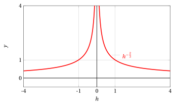
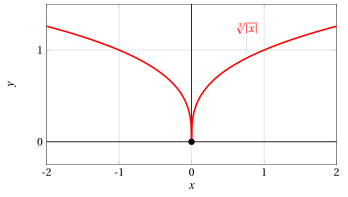
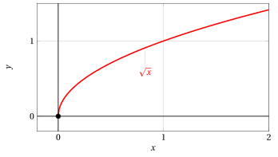
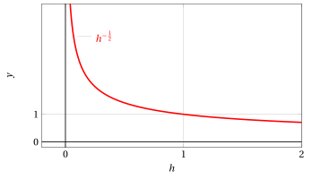

# Corner points, cusps, points with vertical/horizontal tangent

**Part 4 · Derivatives · Chapter 3** · lecture notes by Fabio Furini · [:material-file-pdf-box: Lecture notes, volume (PDF)](../pdf/lecture-notes-4-derivatives.pdf) · [:material-presentation: Slides (PDF)](../pdf/slides-derivatives-03-corners-cusps.pdf)

## 1. Right derivative and left derivative

!!! definizione "Definition 1: of right (left) derivative"

    Let $f: (a, b) \rr \R$;  the function $f$ is said to be differentiable at $x_0  \in (a, b)$ from the right (from the left) if the following limit exists and is finite

    $$
    \lim_{h \rr 0^+} \frac{f(x_0 + h) - f(x_0)}{h} \quad \left(~ \lim_{h \rr 0^-} \frac{f(x_0 + h) - f(x_0)}{h} ~\right)
    $$

    then $f$ is differentiable from the right (from the left) and the limit is called the <strong>right derivative</strong> (<strong>left derivative</strong>).

- The right derivative is denoted by the symbol $f'_{+}(x_0)$, while the left derivative is denoted by the symbol $f'_{-}(x_0)$

## 2. Corner points

!!! definizione "Definition 2: of corner point"

    If $f$ is continuous and differentiable from the right and from the left (but not differentiable) at $x_0$, we say that $f$ has a <strong>corner point</strong> at $x = x_0$.

!!! esempio "Example 1: Corner points"

    Consider the function $f(x) = |x|$ and the point $x_0=0$. We have:

    $$
    f'_{+}(0)=\lim_{h \rr 0^+}\frac{|h|}{h} = \lim_{h \rr 0^+} \frac{h}{h} = 1 {\rm ~~~~and~~~~} f'_{-}(0)=\lim_{h \rr 0^-} \frac{|h|}{h} = \lim_{h \rr 0^-} \frac{-h}{h} = -1
    $$

    Since the limit of the difference quotient does not exist, $f$ is not differentiable at $x =0$. The function is continuous at $x=0$ (the origin) since

    $$
    \lim_{x \rr 0^+} f(x)=\lim_{x \rr 0^+} x = 0 {\rm ~~~and~~~} \lim_{x \rr 0^-} f(x) =\lim_{x \rr 0^-} -x = 0 {\rm ~~~~hence~~~} \lim_{x \rr 0} f(x) = f(0)=0
    $$

    Since the right and left limits of the difference quotient at $x=0$ exist and are finite, the graph therefore has a corner point at $x=0$.

    { .fig .ovale loading=lazy style="width:49%" }

!!! chiave ""

    The formula that concisely expresses the derivative of the absolute value function (away from the origin) is the following:

    $$
    f(x)= |x|, \quad f'(x) = sgn (x) =
    \begin{cases}
    1 & {\rm if~~} x > 0\\
    -1 & {\rm if~~} x < 0
    \end{cases}
    $$

## 3. Points with vertical/horizontal tangent

- If $f$ is continuous at a point $x_0$ and

    $$
    \lim_{h \rr 0} \frac{f(x_0 + h) - f(x_0)}{h}= \pm \infty
    $$

    then $f$ is not differentiable at $x_0$ but, geometrically, the graph of $f$ has a well-defined tangent line parallel to the $y$-axis.

    In this case we will allow the notation

    $$
    f'(x_0) = \ip, ~~~~ f'(x_0) = \im
    $$

    and we will speak of a <strong>point with vertical tangent</strong>.

!!! definizione "Definition 3: of point with vertical tangent"

    If

    $$
    f'(x_0) = \ip {\rm ~~~or~~~} f'(x_0) = \im
    $$

    we say that $f$ has a <strong>point with vertical tangent</strong> at $x = x_0$.

- Similarly, if $f$ is continuous at a point $x_0$ and

    $$
    \lim_{h \rr 0} \frac{f(x_0 + h) - f(x_0)}{h}= 0
    $$

    the graph of $f$ has a well-defined tangent line parallel to the $x$-axis.  In this case we will speak of a <strong>point with horizontal tangent</strong>.

!!! definizione "Definition 4: of point with horizontal tangent"

    If

    $$
    f'(x_0) = 0
    $$

    we say that $f$ has a <strong>point with horizontal tangent</strong> at $x = x_0$.

!!! esempio "Example 2: Point with vertical tangent"

    Let

    $$
    f(x) = \sqrt[3]{x}
    $$

    then for $x_0=0$

    $$
    \frac{f(h) - f(0)}{h} =  \frac{ \sqrt[3]{h}}{h} = \frac{ 1}{h^{2/3}}
    $$

    and the limits are:

    $$
    \lim_{h \rr 0^-} \frac{ 1}{h^{2/3}} = \ip {\rm ~~~and~~~}\lim_{h \rr 0^+} \frac{ 1}{h^{2/3}} = \ip {\rm ~~~~hence~~~~} \lim_{h \rr 0} \frac{ 1}{h^{2/3}} = \ip {\rm ~~~and~~~} f'(0)= \ip.
    $$

    { .fig .ovale loading=lazy style="width:70%" }

    The function has a point with vertical tangent at $x_0=0$. The function:

    $$
    f(h) = \frac{1}{h^{{2}/{3}}} = h^{-\frac{2}{3}}
    $$

    is a power with negative rational exponent $\frac{m}{n}$ with $n$ odd (hence defined on $\R \setminus \{0\}$) and $m$ even (hence an even function). Its graph is:

    { .fig .ovale loading=lazy style="width:70%" }

!!! esempio "Example 3: Point with vertical tangent"

    Let

    $$
    f(x) = -\sqrt[3]{x-2}+1
    $$

    then for $x_0=2$

    $$
    \frac{f(2 + h) - f(2)}{h} = \frac{- \sqrt[3]{(2+h)-2}+1 - 1}{h} = -\frac{ \sqrt[3]{h}}{h}=-\frac{ 1}{h^{2/3}}
    $$

    and the limits are

    $$
    \lim_{h \rr 0^-} -\frac{ 1}{h^{2/3}} = \im {\rm ~~~and~~~}\lim_{h \rr 0^+} -\frac{ 1}{h^{2/3}} = \im {\rm ~~~~hence~~~~} \lim_{h \rr 0} - \frac{ 1}{h^{2/3}} = \im {\rm ~~~and~~~} f'(2)= \im.
    $$

    { .fig .ovale loading=lazy style="width:80%" }

    The function has a point with vertical tangent at $x_0=2$.

## 4. Cusps

!!! definizione "Definition 5: of cusp"

    Let $f$ be a function continuous at $x_0$; if

    $$
    f'_+(x_0)= \pm \infty {\rm ~~and~~} f'_-(x_0)= \mp \infty
    $$

    we say that $f$ has a cusp at $x_0$.

!!! esempio "Example 4: Cusp"

    Let

    $$
    f(x) = \sqrt[3]{|x|}
    $$

    then for $x_0=0$

    $$
    \frac{f(h) - f(0)}{h} =  \frac{ \sqrt[3]{|h|}}{h}
    $$

    and the limits are:

    $$
    \lim_{h \rr 0^-} \frac{ \sqrt[3]{-h}}{h}=\lim_{h \rr 0^-} -\frac{ 1}{h^{2/3}} = \im {\rm ~~~~and~~~~}\lim_{h \rr 0^+} \frac{ \sqrt[3]{h}}{h} =\lim_{h \rr 0^+} \frac{ 1}{h^{2/3}} = \ip,
    $$

    hence:

    $$
    f'_-(0)= \im {\rm ~~~~and~~~~}f'_+(0)= \ip.
    $$

    { .fig .ovale loading=lazy style="width:80%" }

    The function has a cusp at $x_0=0$.

- In the mixed case where one of the two derivatives is finite and the other is infinite (with $f$ continuous) we still speak of a corner point.

- Finally, if the function is defined only for $x \ge x_0$ and at that point has an infinite (right) derivative, we will simply say that at that point it has a vertical tangent, without speaking of either a cusp or a point with vertical tangent.

!!! esempio "Example 5: Point with vertical tangent"

    Let

    $$
    f(x) = \sqrt{x}
    $$

    then for $x_0=0$

    $$
    \frac{f(h) - f(0)}{h} =  \frac{ \sqrt{h}}{h} = \frac{1}{h^{1/2}}
    $$

    we only have the right limit

    $$
    \lim_{h \rr 0^+} \frac{1}{h^{1/2}} = \ip {\rm ~~~and~~~}f'_+(0)= \ip.
    $$

    { .fig .ovale loading=lazy style="width:75%" }

    The function has a point with vertical tangent  at $x_0=0$. The function:

    $$
    f(h) = \frac{1}{h^{{1}/{2}}}  = h^{-\frac{1}{2}}
    $$

    is a power with negative rational exponent $\frac{m}{n}$ with $n$ even (hence defined only on $\R_+$). Its graph is:

    { .fig .ovale loading=lazy style="width:75%" }

!!! esempio "Example 6: Continuous extension from the right and behavior at the origin"

    Let

    $$
    f(x) = x\: \log x, {\rm ~~for~~} x>0
    {\rm ~~we~have~~}
    \lim_{x \rr 0^+} x\: \log x = 0
    $$

    hence the function  can be extended by continuity from the right at $x = 0$, by setting:

    $$
    f(x)=
    \begin{cases}
    x\: \log x & {\rm if~~} x > 0\\[2ex]
    0 & {\rm if~~} x = 0
    \end{cases}
    $$

    { .fig .ovale loading=lazy style="width:80%" }

    We compute the right derivative at $x_0=0$ of $f(x) = x\: \log x$ extended by continuity from the right at $x=0$. We have, for $x_0=0$:

    $$
    \frac{f(x_0 + h) - \overbrace{f(x_0)}^{=0}}{h}=\frac{f(x_0 + h)}{h} = \frac{f(h)}{h}
    $$

    and consequently

    $$
    \lim_{h \rr 0^+}\frac{f(x_0 + h) - f(x_0)}{h}= \lim_{h \rr 0^+}\frac{h \: \log h}{h}= \lim_{h \rr 0^+} \log h = \im {\rm ~~~~hence~~~~} f'_+(x_0)= \im
    $$

    The function therefore has a point with vertical tangent  at $x_0=0$.

!!! esempio "Example 7: Continuous extension from the right and behavior at the origin"

    Let

    $$
    f(x) = e^{-\frac{1}{x}}, {\rm ~~for~~} x>0
    {\rm ~~we~have~~}
    \lim_{x \rr 0^+} e^{-\frac{1}{x}} = 0
    $$

    hence the function  can be extended by continuity from the right at $x = 0$, by setting:

    $$
    f(x)=
    \begin{cases}
    e^{-\frac{1}{x}} & {\rm if~~} x > 0\\[2ex]
    0 & {\rm if~~} x = 0
    \end{cases}
    $$

    { .fig .ovale loading=lazy style="width:80%" }

    We compute the right derivative at $x_0=0$ of $f(x) = e^{-\frac{1}{x}}$ extended by continuity from the right at $x=0$.

    We have:

    $$
    \lim_{h \rr 0^+}\frac{f(x_0 + h) - f(x_0)}{h}= \lim_{h \rr 0^+}\frac{e^{-\frac{1}{h}}}{h}= \lim_{h \rr 0^+} \frac{1}{e^{\frac{1}{h}} \; h}
    $$

    Changing the variable:

    $$
    y=\frac{1}{h}, {\rm ~~if~~} h \rr 0^{+} {\rm ~~then~~} y \rr \ip
    $$

    We obtain:

    $$
    \lim_{h \rr 0^+} \frac{1}{e^{\frac{1}{h}} \; h} = \lim_{y \rr \ip} \frac{y}{e^y} = 0  {\rm ~~~~hence~~~~} f'_+(x_0)= 0
    $$

    and the function has a point with horizontal tangent (from the right)  at $x_0=0$.
