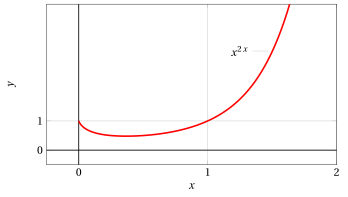
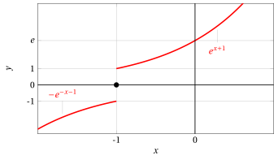

# Rules for computing derivatives

**Part 4 · Derivatives · Chapter 4** · lecture notes by Fabio Furini · [:material-file-pdf-box: Lecture notes, volume (PDF)](../pdf/lecture-notes-4-derivatives.pdf) · [:material-presentation: Slides (PDF)](../pdf/slides-derivatives-04-differentiation-rules.pdf)

## 1. Rules for computing derivatives

- We now look at the relation between the derivative operation and the main operations on functions that we already know; in particular we will show the relation between:

    1. differentiation and algebraic operations

    2. differentiation and composition

    3. differentiation and inversion

### 1.1 Algebra of derivatives

!!! teorema "Theorem 1: algebra of derivatives"

    Let $f$,$g$: $(a,b) \rr \R$  be two functions differentiable in $(a,b)$.

    Then $f \pm g$, $f \cdot g$, $f / g~~(g \neq 0)$ are differentiable in $(a, b)$ and the following formulas hold:

    \begin{equation}
    \label{DD1}
    (f \pm g)' = f' \pm g'
    \end{equation}

    \begin{equation}
    \label{DD2}
    (f \cdot g)' = f' \cdot g +  f \cdot g'
    \end{equation}

    \begin{equation}
    \label{DD3}
    \left(\frac{f}{g}\right)' = \frac{f' \cdot g -  f \cdot g'}{g^2} \qquad (g \neq 0)
    \end{equation}

- From rule \(\eqref{DD2}\) we deduce

    !!! chiave ""

        \begin{equation}
        \label{DD4}
        ( k  \cdot g)' =  k \cdot  g'  \qquad {\rm ~~with~~} k\in \R {\rm ~~constant}
        \end{equation}

    since the derivative of a constant is equal to zero.

- From rule \(\eqref{DD3}\) we deduce

    !!! chiave ""

        \begin{equation}
        \label{DD5}
        \left(\frac{1}{g}\right)' = - \frac{g'}{g^2} \qquad (g \neq 0)
        \end{equation}

- Rule \(\eqref{DD2}\) is called the <strong>Leibniz rule</strong> (product rule) and it extends to the product of $n$ functions:

    \begin{equation}
    \label{DDLEIBNIZ}
    (f_1 \: f_2 \cdots f_n  )' = f_1' \: f_2 \cdots f_n + f_1 \: f'_2 \cdots f_n + {\rm \dots} + f_1 \: f_2 \cdots f'_n
    \end{equation}

- The theorem actually has a pointwise character: that is, if $f$ and $g$ are differentiable at a point $x_0 \in (a, b)$, then at that point $f \pm g$, $f \cdot g$, $f / g$ are also differentiable, and the formulas above hold (and they extend to intervals).

??? dimostrazione "Proof"

    We prove rule \(\eqref{DD2}\). Fixing $x \in (a, b)$, we have

    $$
    f(x + h) \: g(x + h) - f(x) \: g(x) =
    $$

    $$
    =f(x
    + h)g(x + h) -
    f(x + h)g(x) + f(x + h)g(x) - f(x)g(x),
    $$

    and hence the difference quotient can be written as:

    $$
    \frac{f(x + h) \: g(x + h) - f(x) \: g(x)}{h}=
    $$

    $$
    = f(x +h) \: \underbrace{\frac{g(x+h)-g(x)}{h}}_{=g'(x) {\rm ~for~} h \rr 0} + g(x) \: \underbrace{\frac{f(x+h)-f(x)}{h}}_{=f'(x) {\rm ~for~} h \rr 0}
    $$

    We have

    $$
    f(x + h) \rr f(x) {\rm ~~for~~} h \rr 0,
    $$

    since $f$ is continuous, being differentiable. 

    Hence

    $$
    \frac{f(x + h) \: g(x + h) - f(x) \: g(x)}{h} \rr f(x) \: g' (x) + f' (x) \:g( x) {\rm ~~for~~} h \rr 0.
    $$

    
□

??? dimostrazione "Proof"

    We prove rule \(\eqref{DD5}\). Fixing $x \in (a, b)$, the difference quotient can be written as:

    $$
    \frac{1}{h} \left[ \frac{1}{g(x+h)} - \frac{1}{g(x)} \right] = \frac{g(x) - g(x+h)}{h\: g(x) \: g(x+h)} =
    $$

    $$
    = - \frac{g(x+h) - g(x)}{h} \cdot \frac{1}{g(x) \: g(x+h)}
    $$

    We have

    $$
    g(x + h) \rr g(x) {\rm ~~for~~} h \rr 0,
    $$

    since $g$ is continuous, being differentiable. 

    Hence

    $$
    \frac{1}{h} \left[ \frac{1}{g(x+h)} - \frac{1}{g(x)} \right] \rr -\frac{g'(x)}{g^2(x)} {\rm ~~for~~} h \rr 0.
    $$

    
□

??? dimostrazione "Proof"

    Note  that rule \(\eqref{DD3}\) follows  from rules \(\eqref{DD2}\) and \(\eqref{DD5}\); indeed:

    $$
    \left(\frac{f(x)}{g(x)}\right)' = \left( f(x) \cdot \frac{1}{g(x)}\right)' = \underbrace{f'(x) \cdot \frac{1}{g(x)} + f(x) \cdot \left(\frac{1}{g(x)}\right)'}_{{\rm rule~} \eqref{DD2}} =
    $$

    $$
    = f'(x) \cdot \frac{1}{g(x)} + f(x) \cdot \underbrace{\left( -\frac{g'(x)}{g^2(x)} \right)}_{{\rm rule~} \eqref{DD5}} = \frac{f'(x) \cdot g(x) -  f(x) \cdot g'(x)}{g^2(x)}.
    $$

    
□

!!! osservazione "Remark 1"

    Given the function $f(x)=\tan x$, the derivative function is $f'(x)=\frac{1}{\cos^2 x} = 1 + \tan^2 x$.

??? dimostrazione "Proof"

    Using formula \(\eqref{DD3}\) we have

    $$
    f'(x)= \left( \frac{\sin x}{\cos x} \right)' = \frac{\cos^2 x+ \sin^2 x}{\cos^2 x}= \frac{1}{\cos^2 x} = 1 + \tan^2 x
    $$

    
□

!!! osservazione "Remark 2"

    Given the function $f(x)=\cot x$, the derivative function is $f'(x)=-\frac{1}{\sin^2 x} = -(1 + \cot^2 x)$.

??? dimostrazione "Proof"

    Using formula \(\eqref{DD3}\) we have

    \begin{align*}
    f'(x)&= \left( \frac{\cos x}{\sin x} \right)' = \frac{-\sin^2 x - \cos^2 x}{\sin^2 x} = -\frac{\sin^2 x + \cos^2 x}{\sin^2 x}\\[2ex]
    &= - \frac{1}{(\sin^2x)} = - (1 + \cot^2 x)
    \end{align*}

    
□

### 1.2 Derivative of a composite function

!!! teorema "Theorem 2: chain rule"

    Let $g \circ f$ be the composite function of two functions $f$ and $g$. If $f$ is differentiable at a point $x$ and $g$ is differentiable at $y = f ( x)$, then $g \circ f$ is differentiable at $x$ and the following formula holds:

    \begin{equation}
    \label{CAT1}
    (g \circ f)'(x) =  g'\big(f(x)\big) \cdot f'(x)
    \end{equation}

??? dimostrazione "Proof"

    We have

    $$
    (g \circ f)(x + h) - (g \circ f)(x)
    = g(f(x + h)) - g(f(x))
    $$

    If we set

    $$
    k = f(x + h) - f(x) {\rm ~~~and~~~} y = f(x) {\rm ~~~then~~~} f(x+h) = y +k
    $$

    By the continuity of $f$, $h \rr 0$ implies $k \rr 0$. With the new notation we have:

    $$
    g\big(f(x + h)\big) - g\big(f(x)\big) = g(y + k) - g(y)
    $$

    We now observe that the definition of derivative:

    $$
    g'(y) = \lim_{k \rr 0} \frac{g(y+k) - g(y)}{k}
    $$

    can be rewritten, for $k \neq 0$, as

    $$
    \frac{g(y+k) - g(y)}{k} = g'(y) + \varepsilon (k)
    $$

    where $\varepsilon (k)$ denotes a quantity that tends to zero as $k \rr 0$.

    Multiplying both sides of the previous equation by $k$ we find

    $$
    g(y+k) - g(y) = k \cdot g'(y) + k \cdot \varepsilon (k)
    $$

    a relation that also holds for $k = 0$. Therefore:

    $$
    g\big(f(x + h)\big) - g\big(f(x)\big) = k \cdot g'(y) + k \cdot \varepsilon (k)
    $$

    Dividing by $h$, and observing that

    $$
    \frac{k}{h} \rr f'(x) {\rm ~~~~for~~~~} h \to 0
    $$

    which implies, as seen above, also $k  \to 0$, we obtain the claim. □

- As the name “chain rule” suggests, \(\eqref{CAT1}\) can be generalized to the composition of any number of functions, composed one with another.  For example, for three functions we have:

    $$
    \left(~f\bigg(g \big(h(x) \big ) \bigg)~\right)' = f'\bigg(g \big(h(x) \big ) \bigg) \cdot g' \big(h(x) \big ) \cdot h'(x)
    $$

!!! esempio "Example 1: Derivative of a composite function"

    We compute the derivative function of the composite function:

    $$
    h(x)  =  \underbrace{\sin^3 x}_{=(g \circ f)(x)}
    $$

    The two functions are:

    $$
    f(x) = \sin x {\rm ~~~~and~~~~} g(y) = y^3 {\rm ~~~with~~~} y = \sin x.
    $$

    Both functions are differentiable on all of $\R$. We have

    $$
    g'(y) = 3\: y^2 {\rm ~~~~and~~~~} f'(x)=\cos x
    $$

    hence, using the chain rule \(\eqref{CAT1}\) and substituting back, we obtain:

    $$
    h'(x)  = 3 \: \sin^2 x \cdot \cos x.
    $$

!!! chiave ""

    Consider the composite function $g \big(f (x)\big)$, equivalently  written $(g \circ f)(x)$. Setting $y=f(x)$ and $w = g(y)$, and using the (Leibniz) notation

    $$
    \frac{d\!f}{d\!x}
    {~~~and~~~}  \frac{d\!g}{d\!x} {\rm ~~~~for~the~
    derivatives~of~~} f {\rm ~and~} g {\rm~~with~respect~to~~} x
    $$

    the (chain) rule \(\eqref{CAT1}\) can be rewritten as:

    \begin{equation}
    \label{CAT2}
    \frac{d\!w}{d\!x} = \frac{d\!w}{d\!y} \cdot \frac{d\!y}{d\!x}
    \end{equation}

    Rule \(\eqref{CAT2}\) expresses the fact that the rate of change of $w$ with respect to $x$ is the product of the “intermediate” rates of change, of $w$ with respect to $y$ and of $y$ with respect to $x$.

!!! esempio "Example 2: Derivative of a composite function"

    Consider the composite function of the previous exercise.  Setting

    $$
    y = \sin x ~~ \big(y=f(x)\big) {\rm ~~and ~~} w = y^3 ~~\big(w=g(y)\big)
    $$

    and using Leibniz's notation, rule \(\eqref{CAT2}\) would be written:

    $$
    \frac{d\!w}{d\!x} = \frac{d\!w}{d\!y} \cdot \frac{d\!y}{d\!x} = 3\:y^2 \cdot \cos x.
    $$

    And hence, substituting $y= \sin x$, we obtain:

    $$
    \frac{d\!w}{d\!x} =
     3 \: \sin^2 x \cdot \cos x.
    $$

!!! esempio "Example 3: Derivative of a composite function"

    We compute the derivative function of the composite function (multiplied by a constant):

    $$
    h(x)  =  A \cdot \underbrace{\sin \big(\omega \: x + \varphi \big)}_{=(g \circ f)(x) } {\rm ~~~with~~~} A,\omega,\varphi \in \R.
    $$

    The two functions are:

    $$
    f(x) = \omega \: x + \varphi {\rm ~~~~and~~~~} g(y) = \sin y {\rm ~~~with~~~} y = \omega \: x + \varphi.
    $$

    Both functions are differentiable on all of $\R$. We have:

    $$
    f'(x)=\omega {\rm ~~~~~~and~~~~~~} g'(y) = \cos y
    $$

    hence, using rule \(\eqref{CAT1}\), rule \(\eqref{DD4}\)  and substituting back, we obtain:

    $$
    h'(x)  = A \cdot \bigg(\cos \big(\omega \: x + \varphi \big) \cdot \omega \bigg)
    $$

!!! esempio "Example 4: Derivative of a product of composite functions"

    We compute the derivative function of the product of two  composite functions times a constant:

    $$
    h(x) =  A \cdot \underbrace{e^{ -\alpha \: x}}_{= (r \circ s)(x)} \cdot \underbrace{\cos \big(\omega \: x + \varphi \big)}_{= (g \circ f)(x)} {\rm ~~~with~~~} A,\omega,\varphi \in \R, \alpha \in \R_+.
    $$

    The functions are:

    $$
    s(x) = - \alpha \: x {\rm ~~~~and~~~~} r(z) = e^z  {\rm ~~~with~~~} z = -\alpha\:x; ~~~~
    ~~ f(x) = \omega \: x + \varphi {\rm ~~~~and~~~~} g(y) = \cos y {\rm ~~~with~~~} y = \omega \: x + \varphi.
    $$

    The functions are differentiable on all of $\R$. We have:

    $$
    s'(x)=-\alpha {\rm ~~~~and~~~~} r'(z) = e^z
    ; ~~~~
      f'(x)=\omega {\rm ~~~~and~~~~} g'(y) = -\sin y
    $$

    consequently, using the chain rule \(\eqref{CAT1}\)  and substituting back, we obtain:

    $$
    (r \circ s)'(x)  = - \alpha \; e^{ -\alpha \: x}
    ; ~~~~
    (g \circ f)'(x)  = - \sin \big(\omega \: x + \varphi \big) \cdot \omega
    $$

    Hence, using rule \(\eqref{DD2}\)  and rule \(\eqref{DD4}\):

    $$
    h'(x) = A \cdot
    \bigg(~~
    \underbrace{- \alpha \; e^{ -\alpha \: x}}_{(r \circ s)'(x)}  ~\cdot~ \underbrace{\cos \big(\omega \: x
    + \varphi \big)}_{(g \circ f)(x)}
    ~~+~~
    \underbrace{e^{ -\alpha \: x}}_{(r \circ s)(x)} ~\cdot~ \underbrace{\bigg(- \sin \big(\omega \: x + \varphi \big) \cdot \omega  \bigg)}_{(g \circ f)'(x)}
    ~~\bigg)
    $$

!!! esempio "Example 5: Derivative of a composite function"

    Let $f(x)>0$ be differentiable; we compute the derivative of the function

    $$
    h(x) =  \log \left( f(x) \right)
    $$

    using the chain rule \(\eqref{CAT1}\) we have:

    $$
    h'(x) =  \frac{1}{f(x)} \cdot f'(x)
    $$

!!! osservazione "Remark 3"

    Given the function $f(x)=a^x$, with $a>0$, the derivative function is $f'(x)=a^x \cdot \log a$.

??? dimostrazione "Proof"

    We have

    $$
    f'(x) = \bigg( \exp \left( x \cdot \log a \right) \bigg)'
    $$

    hence, using the formulas for the derivative of $e^y$ (with $y=x\: \log a$) and for the derivative of a composite function, we have

    $$
    f'(x) = \exp \left( x \cdot  \log a \right) \cdot \log a = a^x \cdot  \log a
    $$

    
□

!!! osservazione "Remark 4"

    Given the function $f(x)=\log_a x$, with $a>0,a\neq 1$, the derivative function is $f'(x)=\frac{1}{x \: \log a}$.

??? dimostrazione "Proof"

    We have

    $$
    f'(x) = \left( \frac{\log x}{\log a} \right)'
    $$

    hence, using the formulas for the derivative of $\log x$ and for the derivative of $k \: f(x)$, we have:

    $$
    f'(x) = \frac{1}{\log a} \cdot \frac{1}{x} = \frac{1}{x \: \log a}
    $$

    
□

!!! osservazione "Remark 5"

    Given the function $f(x)=\sinh x$, the derivative function is $f'(x)=\cosh x$.

??? dimostrazione "Proof"

    We have:

    $$
    f'(x)=\left(\frac{e^x - e^{-x}}{2} \right)' = \frac{1}{2} \bigg( e^x - \big(-e^{-x} \big)\bigg)=\frac{e^x + e^{-x}}{2}=\cosh x
    $$

    
□

!!! osservazione "Remark 6"

    Given the function $f(x)=\cosh x$, the derivative function is $f'(x)=\sinh x$.

??? dimostrazione "Proof"

    We have:

    $$
    f'(x)=\left(\frac{e^x + e^{-x}}{2} \right)'= \frac{1}{2} \bigg( e^x + \big(-e^{-x} \big)\bigg)=\frac{e^x - e^{-x}}{2}=\sinh x
    $$

    
□

!!! chiave ""

    The derivatives of functions of the type:

    $$
    h(x) = f(x)^{ g(x)}
    $$

    are based on rewriting  the function (with $f(x) > 0$) in the following form:

    $$
    f(x)^{ g(x)} = \exp \bigg(~ g(x) ~\cdot~  \log \big(f(x)\big) ~\bigg)
    $$

    We have:

    \begin{align*}
    \bigg(~f(x)^{ g(x)}~\bigg)' &=  \bigg(~\exp \left(~ g(x) \cdot \log \big(f(x)\big) ~\right) ~\bigg)'  \\[2ex]
    &= \exp \left(~ g(x) \cdot \log \big(f(x)\big) ~\right) ~\cdot~ \bigg(~g(x) \cdot \log \big(f(x)\big) ~\bigg)'  \\[2ex]
    &= f(x)^{ g(x)} ~\cdot~ \left(~ g'(x) ~\cdot~  \log \big(f(x)\big) ~+~ g(x) ~\cdot~ \frac{f'(x)}{f(x)} ~\right)
    \end{align*}

!!! esempio "Example 6: Derivative of a function raised to another function"

    We compute the derivative of the function

    $$
    h(x) =  x^{2\:x} = \exp (2\:x \cdot \log x) {\rm~~with~~} x>0
    $$

    { .fig .ovale loading=lazy style="width:65%" }

    The two functions are:

    $$
    f(x) = x {\rm ~~~~and~~~~} g(x) =  2\:x
    $$

    Hence:

    \begin{align*}
    h'(x) &=  \bigg( \exp \left( 2\:x \cdot \log x \right) ~\bigg)' = \exp \left( 2\:x \cdot \log x \right) \cdot \bigg(2\: x \cdot \log x \bigg)' = x^{2\:x} \cdot \left(  2\:\log x +  2\:x \: \frac{1}{x} \right) = x^{2\:x} \left( 2\:\log x +  2 \right)
    \end{align*}

!!! chiave ""

    Consider the absolute value of a function: $|f(x)|$. At the points where $f(x) \neq 0$, the differentiation of a composite function gives:

    $$
    \left(|f(x)|\right)' = \sgn\big(f(x)\big) \cdot f'(x)
    =
    \begin{cases}
    f'(x) & {\rm ~~for~~} f(x)>0\\[2ex]
    -f'(x) & {\rm ~~for~~} f(x)<0
    \end{cases}
    $$

    In general, we expect the function $|f(x)|$  to have corner points at the points where $f(x)$ vanishes.

!!! esempio "Example 7: Derivative of a function with absolute value"

    We compute the derivative function of the function:

    $$
    f(x) =  |x^2-4\:x+3|, {\rm ~~with~~} x \neq 1 {\rm ~~and~~} x \neq 3, {\rm ~~~we~have~~}  f'(x)=  \sgn (x^2-4\:x+3) \cdot (2x-4)
    $$

    equivalently:

    $$
    f'(x)=\left\{\begin{array}{lr} 2\:x-4, &x<1 {\rm ~or~} x>3 {\rm ~~~~~i.e.~for~~} f(x)>0\\
    \\
    -(2\:x-4) & 1< x< 3 {\rm ~~~~~i.e.~for~~} f(x)<0\end{array}\right.
    $$

    At $x_0 =1$, we need to use the limit of the difference quotient:

    $$
    \frac{f(x_0 + h) - f(x_0)}{h}=\frac{f(1+h) - f(1)}{h}= \frac{|(1+h)^2-4\:(1+h)+3|}{h}  = \frac{|h^2-2\;h|}{h}
    $$

    If $h \rr 0^-$ we have $|h^2-2\;h| = h^2-2\;h$, hence:

    $$
    \lim_{h \rr 0^-} \frac{h^2-2\;h}{h} = -2
    $$

    If $h \rr 0^+$ we have $|h^2-2\;h| = -h^2+2\;h$, hence:

    $$
    \lim_{h \rr 0^+} \frac{-h^2+2\;h}{h} = 2
    $$

    The function is not differentiable at $x_0 =1$ and $x_0 =3$ (by arguments analogous to those for $x_0 =1$), where it has corner points.

    { .fig .ovale loading=lazy style="width:70%" }

!!! esempio "Example 8: Derivative of a function with absolute value"

    We compute the derivative of the function:

    $$
    f(x) =  e^{|x+1|}
    $$

    { .fig .ovale loading=lazy style="width:65%" }

    For $x \neq -1$, we have:

    $$
    f(x)=\left\{\begin{array}{lr} e^{x+1}, &x>-1\\
    \\
    e^{-x-1}, & x < -1 \end{array}\right.
    {\rm ~~~~~~~hence~~~~~~~}
    f'(x)=\left\{\begin{array}{lr} e^{x+1}, &x>-1\\
    \\
    -e^{-x-1}, & x< -1\end{array}\right.
    $$

    { .fig .ovale loading=lazy style="width:65%" }

    At $x_0 =-1$, we need to use the limit of the difference quotient:

    $$
    \frac{f(x_0 + h) - f(x_0)}{h}=\frac{f(-1+h) - f(-1)}{h}= \frac{e^{|-1+h+1|}-1}{h}  = \frac{e^{|h|}-1}{h}
    $$

    We have:

    $$
    {\rm if~~} h \rr 0^+, ~e^{|h|} = e^{h} {\rm ~~and~~} \lim_{h \rr 0^+} \frac{e^{h}-1}{h} = 1;~~~~ {\rm if~~} h \rr 0^-, ~e^{|h|} = e^{-h} {\rm ~~and~~} \lim_{h \rr 0^-} \frac{e^{-h}-1}{h} = -1
    $$

    We conclude that, since the limit of the difference quotient does not exist, the function is not differentiable at $x_0 =-1$.  The function has a corner point at $x_0 = - 1$.

!!! chiave ""

    We now consider the derivatives of some logarithmic functions. We compute:

    $$
    \bigg(~\log \big(|x|\big)~\bigg)' = \frac{1}{|x|} \cdot \sgn (x) = \frac{1}{x}
    $$

    Moreover, by  the differentiation of composite functions we have:

    $$
    \bigg(~\log\big(|f(x)|\big)~\bigg)' = \frac{1}{|f(x)|} \cdot \sgn\big(f(x)\big) \cdot f'(x)= \frac{f'(x)}{f(x)}
    $$

    Sometimes it is convenient to use the properties of logarithms to transform a logarithmic function before computing its derivative function:

    $$
    \big(\log(c\: x)\big)' =  \big(\log(c) + \log(x)\big)' = \frac{1}{x} {\rm ~~~with~~~} c \in \R
    $$

    $$
    \left(\log\left(\frac{a\:x + b}{c\:x + d} \right)\right)' =  \big(\log(a\:x + b) - \log(c\:x + d)\big)' = \frac{a}{a\:x + b} - \frac{c}{c \:x + d} {\rm ~~~with~~~} a,b,c,d \in \R
    $$

### 1.3 Derivative of the inverse function

!!! teorema "Theorem 3: derivative of the inverse function"

    Let $f : (a, b) \rr \R$ be a continuous and invertible function in $(a, b)$ and $g = f^{-1}$ its inverse function, defined in $f\big( (a, b) \big)$.

    Assume moreover that $f'(x_0) \neq 0$ exists for some $x_0 \in  (a, b)$.

    Then $g$ is differentiable at $y_0= f (x_0)$ and

    \begin{equation}
    \label{INV}
    g'(y_0) =  \frac{1}{f'(x_0)}
    \end{equation}

??? dimostrazione "Proof"

    Let:

    $$
    f(x_0)=y_0;~~~~g(y_0)=x_0
    $$

    $$
    f(x_0+h)=y_0+k;~~g(y_0+k)=x_0+h
    $$

    Consider the difference quotient of $g$ at $y_0$:

    $$
    \frac{g(y_0+k)-g(y_0)}{k} = \frac{h}{f(x_0+h)-f(x_0)}
    $$

    If $k\neq 0$, then $f(x_0+h)-f(x_0) \neq 0$ and hence also $h \neq 0$; therefore the last quotient can also be rewritten in the form:

    $$
    \frac{1}{\frac{f(x_0+h)-f(x_0)}{h}}
    $$

    Moreover, for $k \rr 0$ we have $g (y_0 + k) \rr  g(y_0)$ because $g$ is continuous, being the inverse of a continuous function on an interval (theorem on the continuity of inverse functions); on the other hand $h = g (y_0 + k) - g (y_0)$, hence for $k \rr 0$ also $h \rr 0$, and by hypothesis

    $$
    \frac{1}{\frac{f(x_0+h)-f(x_0)}{h}} \to \frac{1}{f'(x_0)} {\rm ~~for~~} h \to 0
    $$

    hence the following limit exists

    $$
    \lim_{k \rr 0} \frac{g(y_0+k)-g(y_0)}{k} = \frac{1}{f'(x_0)}
    $$

    
□

- We observe that, assuming the differentiability of $f^{-1}$, \(\eqref{INV}\) follows immediately from the identity

    $$
    g\big(f(x)\big) = x
    $$

    and from the chain rule:

    $$
    g'\big(f(x)\big)\cdot f'(x) = 1
    $$

    from which, if $f'(x) \neq 0$, \(\eqref{INV}\) follows. The proof we have given, however, is necessary in order to deduce the differentiability of $g$ from our hypotheses on $f$.

- \(\eqref{INV}\) has a simple geometric meaning, recalling that the graphs of $f$ and $g=f^{-1}$ are symmetric with respect to the bisector $y = x$. Geometrically we have:

    { .fig .ovale loading=lazy style="width:80%" }

    hence the angles $\alpha$ and $\beta$ are complementary, that is:

    $$
    \left( \alpha + \beta = \frac{\pi}{2} \right)
    $$

    and hence

    $$
    f'(x) = \tan \alpha = \tan \left( \frac{\pi}{2} - \beta \right) = \frac{1}{\tan \beta} = \frac{1}{g'(y)}
    $$

!!! chiave ""

    With Leibniz's notation, setting $y=f(x)$ and $x=g(y)$, \(\eqref{INV}\) is written in the form

    $$
    \frac{dx}{dy} = \frac{1}{\frac{dy}{dx}}
    $$

- Pay attention to the fact that in the formula for the derivative of the inverse function, the derivatives $f'$ and $g'$ are computed at two different points: this is the main thing to be careful about when applying this theorem.

!!! osservazione "Remark 7"

    Given the function $f(y)=\arctan y$, the derivative function is $f'(y)=\frac{1}{{1 + y^2}}$.

??? dimostrazione "Proof"

    We set $y = \tan x$, $x = \arctan y$ with $x \in  \left(-\frac{\pi}{2}, \frac{\pi}{2} \right)$, $y \in \R$. We have:

    $$
    (\arctan y)' = \frac{dx}{dy} =  \frac{1}{\frac{dy}{dx} } = \frac{1}{1 + \tan^2 x} = \frac{1}{1 + y^2}
    $$

    
□

!!! osservazione "Remark 8"

    Given the function $f(y)=\arcsin y$, the derivative function is $f'(y)=\frac{1}{\sqrt{1 - y^2}}$

??? dimostrazione "Proof"

    We set  $y = \sin x$, $x = \arcsin y$, with $x \in \left[ -\frac{\pi}{2}, \frac{\pi}{2} \right]$, $y \in [-1, 1 ]$. Since for those values of $x$ we have

    $$
    \cos x = \sqrt{1 - \sin^2 x } = \sqrt {1 - y^2}
    $$

    we have:

    $$
    (\arcsin y)' =  \frac{dx}{dy}  =  \frac{1}{\frac{dy}{dx} } = \frac{1}{\cos x} = \frac{1}{\sqrt{1 - y^2}}
    $$

    
□

!!! osservazione "Remark 9"

    Given the function $f(y)=\arccos y$, the derivative function is $f'(y)=-\frac{1}{\sqrt{1 - y^2}}$

??? dimostrazione "Proof"

    Now we set $y = \cos x$, $x = \arccos y$, with $x \in \left[0, \pi \right]$, $y \in [-1, 1 ]$. Since for those values of $x$ we have

    $$
    \sin x = \sqrt{1 - \cos^2 x} = \sqrt {1 - y^2}
    $$

    we have

    $$
    (\arccos y)' =   \frac{dx}{dy}  =  \frac{1}{\frac{dy}{dx} } = \frac{1}{-\sin x} = - \frac{1}{\sqrt{1 - y^2}}
    $$

    
□

- Note that the functions $\arcsin x$, $\arccos x$, although defined and continuous on $[- 1, 1]$, are not differentiable at the endpoints of the interval: precisely, at these points they have a vertical tangent.

!!! chiave ""

    The usefulness of the theorem on the derivative of the inverse function lies in the fact that it allows us to compute the derivative of the inverse function $g$ even in situations where we do not know how to write $g$ explicitly.

!!! esempio "Example 9: Derivative of the inverse function"

    Let

    $$
    f (x) = x+ e^x
    $$

    The function is strictly increasing on all of $\R$, hence invertible; let $g$ be its inverse.  We compute, for example, $g' (y_0)$ for $y_0 = f(0) = 1$.  We have:

    $$
    f'(x) = 1 + e^x, ~~~ f'(0) = 2 \neq 0
    $$

    Hence:

    $$
    g' (1) = \frac{1}{f'(0)} = \frac{1}{2}.
    $$

!!! osservazione "Remark 10"

    Given the function $f(y)=\setsinH y$ (the inverse hyperbolic sine), the derivative function is $f'(y)=\frac{1}{\sqrt{y^2+1}}$

??? dimostrazione "Proof"

    Now we set $y = \sinH x$, $x = \setsinH y$, with $x \in \R$, $y \in \R$. Since for those values of $x$ we have

    $$
    \cosH x = \sqrt{\sinH^2 x +1} = \sqrt {  y^2 + 1}
    $$

    we have:

    $$
    (\setsinH y)' =  \frac{dx}{dy}  =  \frac{1}{\frac{dy}{dx} } = \frac{1}{\cosH x} = \frac{1}{\sqrt{y^2+1}}
    $$

    
□

!!! osservazione "Remark 11"

    Given the function $f(y)=\setcosH y$ (the inverse hyperbolic cosine), the derivative function is $f'(y)=\frac{1}{\sqrt{y^2-1}}$

??? dimostrazione "Proof"

    Now we set $y = \cosH x$, $x = \setcosH y$, with $x \in [0,+\infty)$, $y \in [1,+\infty)$. Since for those values of $x$ we have

    $$
    \sinH x = \sqrt{\cosH^2 x -1} = \sqrt {  y^2 - 1}
    $$

    we have:

    $$
    (\setcosH y)' =  \frac{dx}{dy}  =  \frac{1}{\frac{dy}{dx} } = \frac{1}{\sinH x} = \frac{1}{\sqrt{y^2-1}}
    $$

    
□

### 1.4 Logarithmic derivative and elasticity

!!! definizione "Definition 1: of logarithmic derivative"

    Given $f > 0$, the logarithmic derivative function of $f$ is the derivative function of $\log f$; in formulas:

    $$
    \frac{d}{dx} \log \big( f(x)\big) = \frac{f'(x)}{f(x)}
    $$

- The logarithmic derivative has the meaning of <strong>relative growth rate</strong> of $f$ with respect to $x$.

- In some cases the relative growth rate $\frac{f'(x)}{f(x)}$ is often more meaningful than the absolute rate $f'(x)$.

- For example, a yearly capital increase of 1 billion out of a total of 10 has a very different effect from an increase of 1 billion out of 1000 billion. In the first case the relative rate of change is 1/ 10, in the second 1/1 000, while the absolute increases are equal.

!!! chiave ""

    When we are interested in visualizing relative increases, we use graphs on a <strong>semi-logarithmic scale</strong>: the values of $x$ are placed on the $x$-axis, while the values of $\log \big( f(x)\big)$ are placed on the $y$-axis

{ .fig .ovale loading=lazy style="width:91%" }

{ .fig .ovale loading=lazy style="width:91%" }

- This kind of representation is also used when $f(x)$ grows so rapidly that it would require an excessive compression of the scale (unit of measure) on the $y$-axis (or on the $x$-axis).

!!! chiave ""

    A <strong>log-log graph</strong> (graph on a logarithmic scale) is a graph in which, instead of $x$, the values of $\log x$ are placed on the $x$-axis and, instead of $f(x)$, the values of $\log f(x)$ are placed on the $y$-axis

!!! definizione "Definition 2: of elasticity"

    The slope of the tangent line to a graph on a logarithmic scale is called the elasticity of $f$ and is denoted by $E(x)$.

- Elasticity represents the relative rate of change of $f$ with respect to relative changes of $x$, and it equals the derivative of $\log f$ with respect to $\log x$

{ .fig .ovale loading=lazy style="width:80%" }

- To find the analytic expression of $E(x)$, we observe that, by the theorem on the differentiation of composite functions, setting $u = \log x$ we have:

    $$
    \frac{d \log f}{dx} = \frac{d \log f}{du} \frac{du}{dx} {\rm ~~~~i.e.~~~~} \frac{f'(x)}{f(x)} = E(x) \cdot \frac{1}{x}
    $$

    from which we obtain:

    $$
    E(x) = x \cdot \frac{f'(x)}{f(x)}
    $$

!!! esempio "Example 10: elasticity"

    We compute the elasticity of the power function $f(x)= x^\alpha$, $x>0$, $\alpha \in \R$; we have:

    $$
    E(x)=x \cdot \frac{\alpha\; x^{\alpha-1}}{x^\alpha}=\alpha \qquad {\rm ~~(constant~ elasticity)}
    $$
