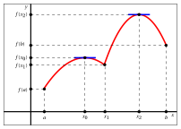
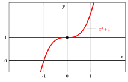
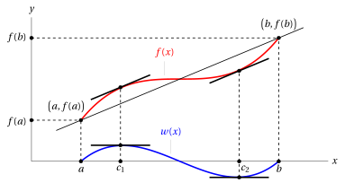
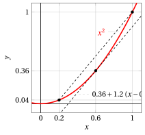
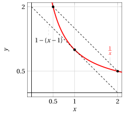
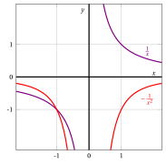
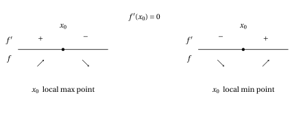
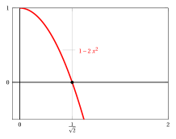
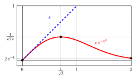

# Mean value theorem, maxima and minima

**Part 4 · Derivatives · Chapter 5** · lecture notes by Fabio Furini · [:material-file-pdf-box: Lecture notes, volume (PDF)](../pdf/lecture-notes-4-derivatives.pdf) · [:material-presentation: Slides (PDF)](../pdf/slides-derivatives-05-mean-value.pdf)

## 1. Local and global maxima/minima

- One of the uses  of differential calculus is the <strong>search for maxima and minima</strong>, that is, the <strong>optimization</strong> of a function defined on an interval $I$ (closed/open, bounded/unbounded).

!!! definizione "Definition 1: of maximum point and maximum"

    Given a function $f:I \rr \R$, if there exists a point $\tilde{x}_M \in I$  such that:

    $$
    f(\tilde{x}_M) \ge f(x),~~~  \forall x \in I
    $$

    then  $\tilde{x}_M$ is a (global) <strong>maximum point</strong> and $f(\tilde{x}_M)$ is the (global) <strong>maximum</strong> of $f$ in $I$.

!!! definizione "Definition 2: of minimum point and minimum"

    Given a function $f:I \rr \R$, if there exists a point $\tilde{x}_m \in I$  such that:

    $$
    f(\tilde{x}_m) \le f(x),~~~  \forall x \in I
    $$

    then  $\tilde{x}_m$ is a (global) <strong>minimum point</strong> and $f(\tilde{x}_m)$ is the (global) <strong>minimum</strong> of $f$ in $I$.

!!! chiave ""

    We call an <strong>extremum</strong> a maximum  or a minimum, and an <strong>extremum point</strong> a maximum  or minimum point. An extremum, if it exists, is unique, while there may be several extremum points (even infinitely many).

!!! definizione "Definition 3: of local maximum point and local maximum"

    Given a function $f:I \rr \R$, if there exist a point $\bar{x}_M \in I$ and a neighborhood $(\bar{x}_M-\delta,\bar{x}_M+\delta)$ with  $\delta >0$, such that:

    $$
    f(\bar{x}_M) \ge f(x),~~~  \forall x \in (\bar{x}_M-\delta,\bar{x}_M+\delta) \cap I
    $$

    then  $\bar{x}_M$ is a <strong>local maximum point</strong>  and $f(\bar{x}_M)$ is the <strong>local maximum</strong>  of $f$ in $(\bar{x}_M-\delta,\bar{x}_M+\delta) \cap I$.

!!! definizione "Definition 4: of local minimum point and local minimum"

    Given a function $f:I \rr \R$, if there exist a point $\bar{x}_m \in I$ and a neighborhood $(\bar{x}_m-\delta,\bar{x}_m+\delta)$ with  $\delta >0$, such that:

    $$
    f(\bar{x}_m) \le f(x),~~~  \forall x \in (\bar{x}_m-\delta,\bar{x}_m+\delta) \cap I
    $$

    then  $\bar{x}_m$ is a <strong>local minimum point</strong> and $f(\bar{x}_m)$ is the <strong>local minimum</strong>  of $f$ in $(\bar{x}_m-\delta,\bar{x}_m+\delta) \cap I$.

- Global extremum points are also local extremum points, and global extrema  are also local extrema.

!!! esempio "Example 1: extrema and extremum points (global and local)"

    Consider the function $f$ with the following graph:

    { .fig .ovale loading=lazy style="width:55%" }

    - the global maximum is $f (x_2)$ and $x_2$ is a global maximum point (it is also unique); $f(x_0)$ is a local (not global) maximum and $x_0$ is a local (not global) maximum point

    - the global minimum is $f (a)$ and $a$ is a global minimum point (it is also unique); $f(b)$ and $f(x_1)$ are two local (not global) minima and $b$ and $x_1$ are two local (not global) minimum points

    Now consider the function $f$ with the following graph:

    { .fig .ovale loading=lazy style="width:55%" }

    - the global maximum does not exist ($\lim_{x \to a^+} f(x)=\ip$); $f(x_1)$ is a  local (not global) maximum and $x_1$ is a  local (not global) maximum point

    - the global minimum is $f(x_0)$, which is also equal to $f(b)$; $x_0$ and $b$ are two global minimum points

## 2. Fermat's theorem and stationary points

- At a local or global extremum point the function  may fail to be differentiable and may even be discontinuous. However, the following theorem tells us that  if a function  is differentiable at a local extremum point, then at that point the  derivative vanishes and hence the tangent to the graph is horizontal.

!!! teorema "Theorem 1: Fermat's theorem"

    Given a function $f: (a,b) \rr \R$ differentiable at $x_0 \in (a,b)$, if $f$ has a local extremum at $x_0$ then $f'(x_0) = 0$.

??? dimostrazione "Proof"

    Consider the case where $x_0$ is a local maximum point. Then:

    $$
    \exists (x_0-\delta,x_0+\delta) {\rm ~~with~~} \delta >0:~~~ f(x_0) \ge f(x)   , ~~\forall x \in (x_0-\delta,x_0+\delta) \cap (a,b)
    $$

    Therefore for every $x \in (x_0-\delta,x_0+\delta) \cap (a,b)$ we have:

    $$
    x < x_0 \Rightarrow \frac{f(x)-f(x_0)}{x-x_0} \ge 0 {\rm ~~~~and~hence~~~~} f'_{-}(x_0)=\lim_{x\rr x_0^-} \frac{f(x)-f(x_0)}{x-x_0} \ge 0
    $$

    where for the non-negativity of the limit we used the sign-preservation theorem. On the other hand:

    $$
    x > x_0 \Rightarrow \frac{f(x)-f(x_0)}{x-x_0} \le 0 {\rm ~~~~and~hence~~~~} f'_{+}(x_0)=\lim_{x\rr x_0^+} \frac{f(x)-f(x_0)}{x-x_0} \le 0
    $$

    Since $f$ is differentiable at $x_0$, we have:

    $$
    f'(x_0) = f'_{-}(x_0) = f'_{+}(x_0) =0
    $$

    The case where $x_0$ is a local minimum point is handled in the same way. □

??? dimostrazione "Proof"

    Suppose, by contradiction, that $f'(x_0) > 0$; then by the sign-preservation theorem we would have $\frac{f(x) -f(x_0)}{x - x_0} >0$ eventually as $x \rr x_0$. Taking into account the sign of $x - x_0$, this implies that $f(x) > f(x_0)$ eventually as $x \rr  x_0^+$ and $f(x) < f(x_0)$ eventually as $x \rr  x_0^-$. But this contradicts the hypothesis that $x_0$ is a local extremum point of $f$. Similarly, we rule out the case $f'(x_0) < 0$. Therefore we must have $f'(x_0) = 0$. □

!!! definizione "Definition 5: stationary point"

    A point $x_0$ is called a  stationary point of $f$ if $f$ is differentiable at $x_0$ and $f'(x_0) = 0$.

!!! attenzione ""

    Fermat's theorem says that for a function $f: (a, b) \rr \R$ differentiable at $x_0 \in (a,b)$ we have:

    \begin{equation}
    x_0 {\rm ~~is~a~local~extremum~point}   ~~~\Rightarrow~~~ \underbrace{x_0 {\rm ~~is~a~stationary~point}}_{ f'(x_0)=0}
    \label{BBB}
    \end{equation}

    Hence “$x_0$ is a local extremum point” is a sufficient condition for “$x_0$ is a stationary point”.  But the converse is not true.  A counterexample is given by the  function $f(x) = x^3+1, \forall x \in \R$, whose  derivative  function is $f'(x) = 3\:x^2, \forall x \in \R$.  With $x_0=0$  we have $f'(0)=0$ but $x_0= 0$ is not a local extremum point.

    { .fig .ovale loading=lazy style="width:70%" }

    Hence we have:

    $$
    \underbrace{x_0 {\rm ~~is~a~stationary~point}}_{ f'(x_0)=0} ~~~\nRightarrow~~~ x_0 {\rm ~~is~a~local~extremum~point}
    $$

    Finally, from the contrapositive  of \(\eqref{BBB}\), we have:

    $$
    x_0 {\rm ~~is~not~a~stationary~point}  ~~\Rightarrow~~  x_0 {\rm ~~is~not~a~local~extremum~point~}
    $$

## 3. Mean value theorem (Lagrange's theorem)

!!! teorema "Theorem 2: mean value theorem (Lagrange)"

    Given a function $f$ differentiable in $(a, b)$ and continuous in $[a, b]$, then:

    \begin{equation}
    \exists~ c \in (a,b) ~~:~~ \frac{f(b)-f(a)}{b-a}=f'(c)
    \label{VVV}
    \end{equation}

!!! chiave ""

    In the case $f(b) = f(a)$, the theorem tells us that there exists $c \in (a,b)$ such that $f'(c)=0$, that is, there exists at least one point where the derivative vanishes. This corollary of Lagrange's theorem is called <strong>Rolle's theorem</strong>.

- Differentiability is required only on the open interval $(a,b)$ in order to include also functions that are continuous at one of the endpoints but not differentiable there.  For example, with $a=0$:

    $$
    f(x) = \begin{cases}
     \sin \left(\frac{1}{x} \right)  \; x & {\rm if~~} x \in (0,b)\\
       0 & {\rm if~~} x = 0
    \end{cases} ~~~{\rm ~~or~~~} g(x) = \sqrt{x}
    $$

- Geometrically, considering the graph of $f$ we have:

    1. $\frac{f(b)-f(a)}{b-a}$  is the slope of the line through $\big(a, f(a)\big)$ and $\big(b,f(b)\big)$

    2. $f'(c)$  is the slope of the tangent line to the graph of $f$ at the point $\big(c,f(c)\big)$

    The mean value theorem therefore expresses the fact that at the point $\big(c,f(c)\big)$ the tangent to the graph of $f$ is parallel to the line through $\big(a, f(a)\big)$ and $\big(b,f(b)\big)$. There may be more than one point with this property, as the following figure shows:

    { .fig .ovale loading=lazy style="width:82%" }

- The figure also shows the function

    $$
    w(x) = f(x) - \left( f(a) + \frac{f(b)-f(a)}{b-a} \;(x-a) \right)
    $$

    given by the difference between the values of the function and the line through the points $\big(a, f(a)\big)$ and $\big(b,f(b)\big)$, which has equation:

    $$
    y = f(a) + \frac{f(b)-f(a)}{b-a} \; (x-a)
    $$

    The function $w(x)$ is the key to the proof of the theorem.

    ??? dimostrazione "Proof"

        Consider the function:

        $$
        w(x) = f(x) - \left( f(a) + \frac{f(b)-f(a)}{b-a} \;(x-a) \right)
        $$

        Clearly $w(a)=w(b)=0$; moreover $w$ is continuous in $[a,b]$ and differentiable in $(a,b)$. Since

        $$
        w'(x) = f'(x) - \frac{f(b)-f(a)}{b-a} {\rm ~~~then~~~} \frac{f(b)-f(a)}{b-a}=f'(c) \Longleftrightarrow \exists c\in (a,b): w' (c) = 0
        $$

        Since $w$ is continuous in $[a, b]$, by the Weierstrass theorem there exist two points $x_1$ and $x_2$ in $[a, b]$ such that:

        $$
        w(x_1) = M, {\rm ~the~maximum~of~} w {\rm~in~} [a, b];~~~w(x_2) = m, {\rm ~the~minimum~of~} w {\rm~in~} [a, b].
        $$

        If $M = m$, then $w(x)$ is constant in $[a,b]$, and hence $w'(x) =0, \forall x \in (a,b)$.

        If $M > m$, at least one of the two points $x_1$ or $x_2$ is not at the endpoints of the interval, since $w(a) = w(b) = 0$. Fermat's theorem then implies that at the maximum or minimum point that lies in the interior (possibly both) the derivative of $w$ vanishes, and the theorem is thus proved. □

!!! esempio "Example 2: using the mean value theorem"

    Let $f(x) = x^2$. Then $f'(x) = 2\:x$ and the mean value theorem states that in every interval $[a, b]$ there exists a number $c$ such that:

    $$
    \frac{b^2-a^2}{b-a}=2\:c {\rm ~~~~from~which~~~~} c= \frac{a+b}{2} \qquad ({\rm arithmetic~mean})
    $$

    That is, every chord $AB$ of the parabola $y = x^2$ is parallel to the tangent at the point whose abscissa equals the arithmetic mean of the abscissas of $A$ and $B$. Taking for example the interval $[0.2,1]$ ($a=0.2,b=1$ and $c=0.6$), we have:

    { .fig .ovale loading=lazy style="width:60%" }

!!! esempio "Example 3: using the mean value theorem"

    Let $f(x) = \frac{1}{x}$. Then $f'(x) = - \frac{1}{x^2}$ and the mean value theorem states that in every interval $[a, b]$ there exists a number $c$ such that:

    $$
    \frac{\frac{1}{b}-\frac{1}{a}}{b-a}=- \frac{1}{c^2} {\rm ~~~~from~which~~~~} c= \sqrt{a \cdot b} \qquad ({\rm geometric~mean})
    $$

    That is, every chord $AB$ of the hyperbola $y = \frac{1}{x}$ is parallel to the tangent at the point whose abscissa equals the geometric mean of the abscissas of $A$ and $B$. Taking for example the interval $[0.5,2]$ ($a=0.5,b=2$ and $c=1$), we have:

    { .fig .ovale loading=lazy style="width:60%" }

<strong>Try it</strong> — the interactive graph below shows what you have just read: move the sliders.

## 4. Differential monotonicity test theorem

!!! teorema "Theorem 3: Differential
Monotonicity
Test"

    Given a function $f:I \rr \R$, continuous in $I$ and differentiable at the interior points of $I$, then:

    \begin{align}
    \label{C1} f'(x) \ge 0,~ \forall x {\rm ~in~the~interior~of~} I &~~~\Longleftrightarrow~~~  f {\rm ~is~non\text{-}decreasing~in~} I\\[2ex]
    \label{C2} f'(x) \le 0,~ \forall x {\rm ~in~the~interior~of~} I &~~~\Longleftrightarrow~~~  f {\rm ~is~non\text{-}increasing~in~} I\\[2ex]
    \label{C3} f'(x) > 0,~ \forall x {\rm ~in~the~interior~of~} I &~~~\Longrightarrow~~~  f {\rm ~is~increasing~in~} I\\[2ex]
    \label{C4} f'(x) < 0,~ \forall x {\rm ~in~the~interior~of~} I &~~~\Longrightarrow~~~  f {\rm ~is~decreasing~in~} I
    \end{align}

??? dimostrazione "Proof"

    - **($\Rightarrow$)** Taking two points $x_1 < x_2$ in the interval $I$, we can apply Lagrange's theorem on the interval $[x_1,x_2]$, hence there exists $c \in  (x_1, x_2)$ such that

        $$
        f(x_2) - f(x_1) =  f'(c)(x_2 - x_1)
        $$

        If $f'(c) \ge 0$ (resp. &gt; 0), then $f(x_2) \ge f(x_1)$ (resp.  $f(x_2) > f(x_1)$). Since $x_1$ and $x_2$ are arbitrary, we have proved that $f$ is non-decreasing (resp. increasing) in $I$. If $f'(c) \le 0$ (resp. &lt; 0) the argument is analogous.

    - **($\Leftarrow$)** If $f$ is non-decreasing, then we have

        $$
        \frac{f(z)-f(x)}{z-x} \ge 0 {\rm ~~~for~all~}z,x \in I, z \neq x
        $$

        and, by the sign-preservation theorem, the limit of the ratio as $z \rr x$ is also non-negative; by hypothesis this limit exists and equals $f'(x)$ for every $x$ in the interior of $I$. If $f$ is non-increasing the argument is analogous.

    
□

!!! attenzione ""

    The Differential Monotonicity Test theorem says that for a function $f: I \rr \R$ differentiable at the interior points of $I$ we have:

    $$
    f'(x) \ge 0,~ \forall x {\rm ~in~the~interior~of~} I ~~~\Longleftrightarrow~~~  f {\rm ~is~non\text{-}decreasing~in~} I
    $$

    Hence “$f'(x) \ge 0,~ \forall x$ in the interior of $I$” is a necessary and sufficient condition for “$f$ is non-decreasing in $I$”. The same holds for the case of non-increasing functions.

!!! attenzione ""

    The Differential Monotonicity Test theorem says that for a function $f: I \rr \R$ differentiable at the interior points of $I$ we have:

    $$
    f'(x) > 0,~ \forall x {\rm ~in~the~interior~of~} I ~~~\Longrightarrow~~~  f {\rm ~is~increasing~in~} I
    $$

    Hence “$f'(x) > 0,~ \forall x$ in the interior of $I$” is a  sufficient condition for “$f$ is increasing in $I$”. But the converse is not true.  A counterexample is given by the  function $f(x) = x^3+1, \forall x \in \R$, which is  increasing and differentiable in $\R$, but $f'(x) = 3\;x^2$ vanishes at $x_0 = 0$.

    Hence we have:

    $$
    f {\rm ~is~increasing~in~} I ~~~\nRightarrow~~~ f'(x) > 0,~ \forall x {\rm ~in~the~interior~of~} I
    $$

    Finally, from the contrapositive  of \(\eqref{C3}\), we have:

    $$
    f {\rm ~is~not~increasing~in~} I  ~~\Rightarrow~~  ~ \exists x {\rm ~in~the~interior~of~} I: f'(x) \le 0,
    $$

    To be checked. The same holds for the case of decreasing functions.

- It follows immediately from the theorem that with $I=(a,b)$ we have:

    \begin{align*}
    f'(x) = 0,~ \forall x \in (a, b) &~~~\Longrightarrow~~~  f {\rm ~~constant~in~} (a, b)
    \end{align*}

    The converse implication is obvious. We then have

    \begin{align}
    \label{C5}
    f'(x) = 0,~ \forall x \in (a, b) &~~~\Longleftrightarrow~~~  f {\rm ~~constant~in~} (a, b)
    \end{align}

    Hence “$f'(x) = 0,~ \forall x \in (a, b)$” is a necessary and sufficient condition for “$f$ constant in $(a,b)$”.

!!! esempio "Example 4: functions with zero derivative"

    Consider the function:

    $$
    f(x) = \arctan x + \arctan \frac{1}{x},~~~ \forall x \neq 0
    $$

    we have

    $$
    f'(x) = \frac{1}{1+x^2} + \frac{1}{1+\frac{1}{x^2}} \; \left(-\frac{1}{x^2}\right)=0,~~~ \forall x \neq 0
    $$

    Implication \(\eqref{C5}\) allows us to say that $f$ is constant on the interval $(-\infty,0)$ and on the interval $(0,\infty)$. To find its value, it is enough to compute $f$ at one point of each interval, for example:

    $$
    f(1) = \arctan (1) + \arctan (1) = 2 \; \frac{\pi}{4}=\frac{\pi}{2}
    $$

    $$
    f(-1) = \arctan (-1) + \arctan (-1) = -\frac{\pi}{2}
    $$

    We have therefore proved that:

    $$
    \arctan x + \arctan \frac{1}{x} =
    \begin{cases}
    \frac{\pi}{2} & {\rm ~~if~~} x>0\\[2ex]
    -\frac{\pi}{2} & {\rm ~~if~~} x<0
    \end{cases}
    $$

- Both in the  Differential Monotonicity Test theorem and in implication \(\eqref{C5}\) it is essential that the set $I$ is an interval. For example, the function

    $$
    f(x) = \frac{1}{x},~~ \forall x \in \R \setminus \{0\}
    $$

    has derivative

    $$
    f'(x) =
    -\frac{1}{x^2} < 0,~~ \forall x \in \R \setminus \{0\}
    $$

    but the function is not decreasing on its domain. The function is decreasing on the interval $(-\infty,0)$ and on the interval $(0,\infty)$, as the figure shows:

    { .fig .ovale loading=lazy style="width:55%" }

## 5. Finding maxima and minima

!!! chiave ""

    Suppose we have a function $f:[a, b] \rr \R$ and we want to find its local and global maxima and minima in $[a,b]$. If $f$ is differentiable in $(a,b)$ we can proceed as follows:

    1. Compute $f(a)$ and $f(b)$.

    2. Compute $f'(x)$ and solve the equation $f'(x)=0$.  In this way we find the stationary points, among which are the possible local extremum points in the interval $(a,b)$.

    3. If there are no stationary points, $f(a)$ and $f(b)$ are the global extrema and $a$ and $b$ are global extremum points. Otherwise we need to determine the nature of the stationary points found. The function $f$ has a local extremum at a stationary point if and only if the sign of $f'$ changes there, which we check by  studying the sign of $f'$ in a neighborhood of the point. We have the following cases:

    { .fig .ovale loading=lazy style="width:90%" }

    1. Having found the possible local extremum points,  compute the value of $f$ at these points and compare it with $f(a)$ and $f(b)$ to understand whether or not they are global extremum points; in this way the global extrema are determined.

!!! esempio "Example 5: finding maxima and minima"

    Consider the function:

    $$
    f(x) = x \; e^{-x^2}, {\rm ~~with~~} x \in [0,2]
    $$

    <strong>Step 1:</strong>

    $$
    f(0)=0,~~f(2)=2\; e^{-4}
    $$

!!! esempio "Example 6: finding maxima and minima"

    <strong>Step 2:</strong>

    $$
    f'(x) = e^{-x^2} + x \; e^{-x^2} \; (-2\:x) = e^{-x^2} \;(1 - 2\:x^2)
    $$

    We have $e^{-x^2} > 0, \forall x \in \R$, hence:

    $$
    f'(x) = 0 \Longleftrightarrow (1 - 2\:x^2)=0 \Longleftrightarrow x=\pm \frac{1}{\sqrt{2}}
    $$

    Only $\frac{1}{\sqrt{2}} \in [0,2]$, hence we have the stationary point $x_0 = \frac{1}{\sqrt{2}}$.

    <strong>Step 3:</strong>

    We study the sign of $f'$ near $x_0 = \frac{1}{\sqrt{2}}$. We have $f'(x) \ge 0$ for  $2\:x^2 \le 1$,  that is, for $-\frac{1}{\sqrt{2}} \le x \le  \frac{1}{\sqrt{2}}$

    { .fig .ovale loading=lazy style="width:75%" }

    We therefore conclude that:

    $$
    \frac{1}{\sqrt{2}} {\rm ~~is~a~local~ maximum~point~~~and~~~} f\left(\frac{1}{\sqrt{2}}\right) =  \frac{1}{\sqrt{2}} \; e^{-1/2} = \frac{1}{\sqrt{2\: e}} {\rm ~~is ~a~local~maximum}
    $$

    We also note that:

    $$
    \lim_{x \rr 0^+} \frac{x \; e^{-x^2}}{x} = \lim_{x \rr 0^+} \frac{1 }{e^{x^2}} = 1 {\rm ~~~~~hence~~~~~} f(x) \sim x  {\rm ~~for~~} x \rr 0^+
    $$

!!! esempio "Example 7: finding maxima and minima"

    <strong>Step 4:</strong>

    $$
    \frac{1}{\sqrt{2\: e}}  > f(0) =0, ~~ \frac{1}{\sqrt{2\: e}} > f(2) = 2\:e^{-4}
    $$

    We therefore conclude that:

    $$
    \frac{1}{\sqrt{2}} {\rm ~~is~the~(unique)~global~ maximum~point~~~and~~~} 0 {\rm ~~is~the~(unique)~global~minimum~point}
    $$

    $$
    \frac{1}{\sqrt{2\: e}}  {\rm ~~is~the~global~maximum~~~and~~~} 0 {\rm ~~is~the~global~minimum}
    $$

    { .fig .ovale loading=lazy style="width:90%" }

### 5.1 From the discrete to the continuous

!!! chiave ""

    Passing “from the discrete to the continuous” for sequences (i.e., from the natural numbers to the reals) is a way to make the tools of differential calculus available

!!! esempio "Example 8: proving monotonicity of sequences by passing to the continuous"

    Consider the sequence

    $$
    a_n = \frac{\log n}{n},  {\rm ~~~~we~have~}~~a_n \ge 0, \forall n \in \N_{>0} {\rm ~~and~~} a_n \rr 0 {\rm ~~for~~} n \rr \ip
    $$

    To prove that the sequence is eventually monotone non-increasing, one way is to use the definition and prove that:

    $$
    a_n  \ge a_{n+1} ,~~~ \forall n \in \N_{>0} {\rm ~~~~~i.e.~~~~~~}  \frac{\log n}{n} \ge \frac{\log (n+1)}{n+1},~~~ \forall n \in \N_{>0}
    $$

    Since both the numerator and the denominator grow as $n$ grows, it is not easy to prove this inequality algebraically.  

    We pass from the discrete to the continuous and define the function

    $$
    f(x) =  \frac{\log x}{x},~~~ \forall x > 1
    $$

    We have

    $$
    f'(x) =  \frac{1-\log x}{x^2} \le 0,~~~ \forall  x \ge e
    $$

    and it follows that $f$ is non-increasing $\forall x \ge e$.  Consequently the sequence $a_n$ is non-increasing for $n \ge  3$ (the first natural number $> e$).

    { .fig .ovale loading=lazy style="width:70%" }

- Be careful not to use the passage from the discrete to the continuous indiscriminately. For example, it cannot be done for the sequences $\frac{n!}{2^n}$ or $\frac{n^2+(-1)^n \; n}{n^3+1}$, since they are defined only for natural numbers.
