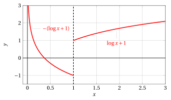
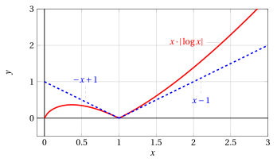
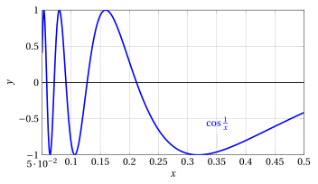

# L'Hôpital's rule and differentiability

**Part 4 · Derivatives · Chapter 6** · lecture notes by Fabio Furini · [:material-file-pdf-box: Lecture notes, volume (PDF)](../pdf/lecture-notes-4-derivatives.pdf) · [:material-presentation: Slides (PDF)](../pdf/slides-derivatives-06-lhopital.pdf)

## 1. L'Hôpital's rule

- A remarkable application of differential calculus is the computation of limits that appear in the indeterminate forms:

    $$
    \left[ \frac{0}{0} \right] ~~\mbox{and}~~ \left[ \frac{\infty}{\infty} \right]
    $$

!!! teorema "Theorem 1: L'Hôpital's rule"

    Let $f$, $g$ be differentiable functions on an interval $(a,b)$ with $g$,$g' \neq 0$ in $(a,b)$. If

    $$
    \lim_{x \rr a^+} f(x) = \lim_{x \rr a^+} g(x) = 0  ~~{\rm (or}  \pm \infty)
    ~~~~~{\rm and~~~~}  \lim_{x \rr a^+} \frac{f'(x)}{g'(x)} = \ell \in \R^*
    $$

    then:

    $$
    \lim_{x \rr a^+} \frac{f(x)}{g(x)} =\ell
    $$

!!! chiave ""

    The theorem still holds if $a = \im$ or if we consider the limit as $x \rr b^-$, with $b \le \ip$ (a case we do not prove). Hence, if the hypotheses hold for $a^-$ and $a^+$, it can clearly be applied also at an interior point of an interval.

!!! esempio "Example 1: using L'Hôpital's rule"

    We want to compute:

    $$
    \lim_{x \rr 0} \frac{\sin x}{x} = \left[ \frac{0}{0} \right] {\rm ~~~and~~~} f(x)=\sin x,f'(x)=\cos x,~~g(x)=x,g'(x)=1
    $$

    applying L'Hôpital's rule, for example with $x \in \left(-1,0 \right) \cup \left(0,  1 \right)$, we obtain:

    $$
    \lim_{x \rr 0} \frac{\sin x}{x} =^H \lim_{x \rr 0} \frac{\cos x}{1}=1
    $$

    We want to compute:

    $$
    \lim_{x \rr \frac{\pi}{2}} \frac{1 - \sin x}{\cos x} = \left[ \frac{0}{0} \right] {\rm ~~~and~~~} f(x)=1-\sin x,f'(x)=-\cos x,~~g(x)=\cos x,g'(x)=-\sin x
    $$

    applying L'Hôpital's rule, for example with $x \in \left(\frac{\pi}{4},\frac{\pi}{2} \right) \cup \left(\frac{\pi}{2},  \frac{3\;\pi}{4} \right)$, we obtain:

    $$
    \lim_{x \rr \frac{\pi}{2}} \frac{1 - \sin x}{\cos x}  =^H \lim_{x \rr \frac{\pi}{2}} \frac{ - \cos x}{-\sin x} = \lim_{x \rr \frac{\pi}{2}} \frac{ \cos x}{\sin x}=\frac{0}{1} =0
    $$

??? dimostrazione "Proof"

    We consider the case:

    $$
    f(x), g(x) \rr 0, {\rm ~~as~~} x \rr a^+
    $$

    Let $\{x_n\}$ be a sequence such that $x_n \rr a^+$ as $n \rr \ip$ and $x_n \neq a, \forall n$, and let us extend $f$ and $g$ by continuity at $a$ by setting $f(a) = g(a) =0$.

    We now define the following function:

    $$
    h(x)= f(x_n)\;g(x) - g(x_n)\;f(x)
    $$

    The function $h$ satisfies the hypotheses of Lagrange's theorem on the interval $[a, x_n]$, hence there exists $t_n \in (a, x_n)$ such that

    $$
    h'(t_n) = \frac{h(x_n)-h(a)}{x_n-a}=0 {\rm ~~~~since~~~~}h(a)= h(x_n) = 0
    $$

    Computing

    $$
    h'(x)= f(x_n) \; g'(x) - g(x_n)\;f'(x), {\rm ~~~we~have~~~} \underbrace{f(x_n) \; g'(t_n) - g(x_n) \; f'(t_n)}_{=h'(t_n)}=0
    $$

    Hence for every $x_n$ there exists a point $t_n \in (a, x_n)$ such that:

    \begin{equation}
    \frac{f(x_n)}{g(x_n)} = \frac{f'(t_n)}{g'(t_n)}
    \label{TT}
    \end{equation}

    As $n \rr \ip$ we have $t_n \rr a^+$, since $a^+ < t_n < x_n$ and $x_n \rr a^+$ as $n \rr \ip$, therefore by the hypothesis of the theorem we have:

    $$
    \frac{f'(t_n)}{g'(t_n)} \rr \ell {\rm~~~~and~consequently~~~~} \frac{f(x_n)}{g(x_n)} \rr \ell
    $$

    which is what we wanted to prove. □

!!! chiave ""

    With L'Hôpital's rule we can easily prove the theorem on the hierarchy of infinities for functions.

??? dimostrazione "Proof"

    We prove:

    $$
    \lim_{x \rr \ip} \frac{x^{\alpha}}{b^{\lambda \;x}}=0, {\rm ~~~with~~~} \alpha >0, \lambda >0, b>1
    $$

    Setting $f(x)=x$, $g(x)=b^{\mu \;x} ~ (\mu >0)$, we have $f'(x)=1$, $g'(x)=\mu\:\log b \;b^{\mu \;x}$ and since:

    $$
    \lim_{x \rr \ip} \frac{f'(x)}{g'(x)}=\lim_{x \rr \ip} \frac{1}{\mu\;\log b \:b^{\mu \;x}}=0 {\rm ~~~~then~~~~} \lim_{x \rr  \ip} \frac{x}{b^{\mu \;x}}=0
    $$

    Observing now that

    $$
    \frac{x^{\alpha}}{b^{\lambda \;x}} = \left(\frac{x}{b^{(\lambda/\alpha) \;x}}\right)^{\alpha}= \left(\frac{x}{b^{\mu \;x}}\right)^{\alpha} {\rm ~~with~~} \mu=\frac{\lambda}{\alpha}>0 
    {\rm ~~~~then~~} \lim_{x \rr \ip} \frac{x^{\alpha}}{b^{\lambda \;x}}= \left(\lim_{x \rr \ip} \frac{x}{b^{\mu \;x}}\right)^{\alpha}=0
    $$

    We prove:

    $$
    \lim_{x \rr \ip} \frac{(\log_a x)^{\beta}}{x^\alpha}=0, {\rm ~~~with~~~} \beta >0, \alpha >0, a >1
    $$

    it suffices to perform the change of variable

    $$
    t
    = \log_a x,~~~ x = a^t, {\rm ~~we~have~that~as~} x \rr \ip {\rm ~~also~~} t \rr \ip
    $$

    hence

    $$
    \lim_{x \rr \ip} \frac{(\log_a x)^{\beta}}{x^\alpha} = \lim_{t \rr \ip} \frac{t^{\beta}}{a^{\alpha\;t}}=0
    $$

    since the second limit has the same form as the one just proved. □

- L'Hôpital's rule can be useful for limits that cannot be solved using only fundamental limits or the asymptotic expansions derived from them.

!!! esempio "Example 2: L'Hôpital's rule and fundamental limits"

    We compute

    $$
    \lim_{x \rr 0} \frac{x-\sin x}{x^3} = \left[ \frac{0}{0} \right]
    $$

    Fundamental limits are not sufficient to resolve the indeterminate form, since:

    $$
    \frac{x-\sin x}{x^3} = \frac{1}{x^2} \left(1 - \frac{\sin x}{x} \right) {\rm ~~~and~~~} \lim_{x \rr 0} \frac{1}{x^2} \left(1 - \underbrace{\frac{\sin x}{x}}_{\rr 1} \right) = [ \infty \cdot 0]
    $$

    L'Hôpital's rule gives:

    $$
    \lim_{x \rr 0} \frac{x-\sin x}{x^3} =^H \lim_{x \rr 0} \frac{(x-\sin x)'}{(x^3)'}=\lim_{x \rr 0} \frac{1 - \cos x}{3\; x^2} = \frac{1}{3} \cdot \lim_{x \rr 0} \underbrace{\frac{1 - \cos x}{x^2}}_{\rr \frac{1}{2}} = \frac{1}{6}
    $$

!!! esempio "Example 3: L'Hôpital's rule and asymptotic expansions"

    We now treat the same limit with the first-order asymptotic expansion:

    $$
    \sin x = x + o(x) {\rm ~~~as~~~} x \rr 0
    $$

    we obtain:

    $$
    \lim_{x \rr 0} \frac{x-\sin x}{x^3} = \lim_{x \rr 0} \frac{x-\big(x + o(x)\big)}{x^3}= \lim_{x \rr 0} \frac{o(x)}{x^3}
    $$

    That is, we still have an indeterminate form, since:

    $$
    \lim_{x \rr 0} \frac{o(x)}{x^3} = \lim_{x \rr 0} \frac{1}{x^2}\;\frac{o(x)}{x} = \lim_{x \rr 0} \frac{1}{x^2}\;o(1)= [\ip \cdot 0]
    $$

    where $o(1)$ denotes a generic function that tends to 0 as $x \rr 0$.

    We reach the same conclusion also with the following reasoning. The symbol $o(x)$ as $x \rr 0$ denotes the set of functions that, divided by $x$, tend to 0 as $x \rr 0$. Hence, for example, $5\;x^2=o(x)$ but also $x^3=o(x)$, and the value of the limit cannot be determined with the first-order asymptotic expansion.

    As we will see later, to determine this limit with asymptotic expansions we need an asymptotic expansion of order higher than the first.

!!! esempio "Example 4: L'Hôpital's rule and asymptotic estimates"

    We compute

    $$
    \lim_{x \rr \ip} \frac{ x -\sin x}{x+\sin x} = \left[ \frac{\ip}{\ip} \right]
    $$

    L'Hôpital's rule gives:

    $$
    \lim_{x \rr \ip} \frac{x-\sin x}{x+\sin x} =^H \lim_{x \rr \ip} \frac{(x-\sin x)'}{(x+\sin x)'}=\lim_{x \rr \ip} \frac{1 - \cos x}{1 + \cos x} {\rm ~~~does~not~exist}
    $$

    the fact that this limit does not exist does not allow us to conclude that the limit we are looking for does not exist.

    Let us proceed instead with asymptotic estimates:

    $$
    \frac{ x -\sin x}{x+\sin x} \sim \frac{x}{x} {\rm ~~as~~} x \rr \ip
    $$

    Since

    $$
    \lim_{x \rr \ip} \frac{ x -\sin x}{x} = \lim_{x \rr \ip} 1 -  \underbrace{\frac{ \sin x}{x}}_{\rr 0} {\rm ~~~~~and~~~~~} \lim_{x \rr \ip} \frac{ x +\sin x}{x} = \lim_{x \rr \ip} 1 +  \underbrace{\frac{ \sin x}{x}}_{\rr 0}
    $$

    hence:

    $$
    \lim_{x \rr \ip} \frac{ x -\sin x}{x+\sin x}=\lim_{x \rr \ip} \frac{ x}{x} = 1
    $$

- The theorem is useful when its application simplifies the limit instead of complicating it, that is, when the order of the infinitesimal (or of the infinity) in the numerator or in the denominator decreases.

!!! esempio "Example 5: L'Hôpital's rule"

    We compute

    $$
    \lim_{x \rr 0^+} \frac{e^{-1/x^2}}{x} = \left[ \frac{0}{0} \right]
    $$

    L'Hôpital's rule gives:

    $$
    \lim_{x \rr 0^+} \frac{e^{-1/x^2}}{x} =^H \lim_{x \rr 0^+} \frac{(e^{-1/x^2})'}{(x)'} = \lim_{x \rr 0^+}  \frac{  2\: e^{-1/x^2}}{x^3}= \left[ \frac{0}{0} \right]
    $$

    Applying instead the change of variable:

    $$
    x^2 = \frac{1}{t}, ~~{x \rr 0^+} {\rm ~~is~equivalent~to~~} t \rr \ip
    $$

    substituting we have:

    $$
    \lim_{x \rr 0^+} \frac{e^{-1/x^2}}{ \left(x^2\right)^{1/2}} = \lim_{t \rr \ip} \frac{e^{-t}}{ \left( \frac{1}{t} \right)^{1/2} } = \lim_{t \rr \ip} \frac{e^{-t}}{ t^{-1/2} } = \lim_{t \rr \ip} \frac{ \sqrt{t}}{ e^{t} }=0
    $$

    where the last limit is obtained thanks to the theorem on the hierarchy of infinities.

- Sometimes the theorem must be applied several times consecutively to resolve the indeterminate form. Also in this case, already after the first application, one should notice that the order of the infinitesimal (or of the infinity) in the numerator or in the denominator has decreased.

!!! esempio "Example 6: L'Hôpital's rule"

    We compute

    $$
    \lim_{x \rr 0} \frac{1 - \cos^3 x}{x^3-x^2} = \left[ \frac{0}{0} \right]
    $$

    L'Hôpital's rule gives:

    $$
    \lim_{x \rr 0} \frac{1 - \cos^3 x}{x^3-x^2} =^H \lim_{x \rr 0} \frac{3\; \sin  x \; \cos^2 x}{3 \; x^2 - 2\; x} = \left[ \frac{0}{0} \right]
    $$

    L'Hôpital's rule applied twice gives:

    $$
    \lim_{x \rr 0} \frac{1 - \cos^3 x}{x^3-x^2} =^H \lim_{x \rr 0} \frac{3\; \sin  x \; \cos^2 x}{3 \; x^2 - 2\; x} =^H \lim_{x \rr 0} \frac{3 \; \overbrace{\cos x}^{\rr 1} \; \big(\overbrace{\cos^2 x}^{\rr 1} - \overbrace{2 \sin^2 x}^{\rr 0} \big)}{\underbrace{6 \; x}_{\rr 0} - 2} = -\frac{3}{2}
    $$

!!! chiave ""

    - The theorem is used for quotients, not for products

    - The theorem is used for quotients that are actual indeterminate forms:

        $$
        \left[ \frac{0}{0} \right] ~~\mbox{and}~~ \left[ \frac{\infty}{\infty} \right]
        $$

    - The theorem prescribes computing the quotient of the derivatives, not the derivative of the quotient

    - If the limit of $f'/g'$ does not exist, nothing can be said about the limit of $f /g$.

## 2. Limit of the derivative and differentiability

!!! teorema "Theorem 2: limit of the derivative"

    If $f: [a, b) \rr \R$ is continuous at $a$, differentiable in $(a, b)$, and $\lim_{x \rr a^+} f'(x) = m \in \R^*$, then $f'_+(a)=m$.

!!! chiave ""

    If the function is continuous at $a$ and the right-hand limit of the derivative exists, then the right derivative exists and coincides with that limit. An analogous statement of the theorem holds for the left derivative and hence for the derivative.

??? dimostrazione "Proof"

    Let $h > 0$. Applying Lagrange's theorem to $f$ on the interval $[a, a+h]$, we obtain that there exists $t_h \in [a, a+h]$ such that

    $$
    \frac{f(a+h)-f(a)}{h}= f'(t_h)
    $$

    As $h \rr 0^+$ we have $t_h \rr a^+$, hence by the hypothesis of the theorem $f'(t_h) \rr m$ as $t_h \rr a^+$. Consequently, there exists

    $$
    f'_+(a)=  \lim_{h \rr 0^+} \frac{f(a+h)-f(a)}{h}=m
    $$

    
□

!!! chiave ""

    Under the hypotheses of the theorem it is therefore possible to compute the right derivative, the left derivative or the derivative without using the limit of the difference quotient

!!! esempio "Example 7: differentiability"

    Suppose we want to study whether or not the following function is differentiable:

    $$
    f(x) = x \cdot |\log x|
    $$

    defined for $x >0$. For $x \neq 1$, where $\log x=0$, we have:

    $$
    f(x)=\left\{\begin{array}{lr} x \cdot \log x, &x>1\\
    \\
    -x \cdot \log x, & 0 < x < 1 \end{array}\right.
    {\rm ~~~~~~~hence~~~~~~~}
    f'(x)=\left\{\begin{array}{lr} \log x +1, &x>1\\
    \\
    -(\log x +1), & 0 < x < 1 \end{array}\right.
    $$

    { .fig .ovale loading=lazy style="width:65%" }

    At $x = 1$ the function $f(x)$ is continuous, and we have:

    $$
    \lim_{x \rr 1^+} f'(x) = \lim_{x \rr 1^+} (\log x +1) = 1 {\rm ~~~~and~~~~} \lim_{x \rr 1^-} f'(x) = \lim_{x \rr 1^-} (-\log x -1) = -1
    $$

    hence the theorem is applicable (from the right and from the left) and we have:

    $$
    f'_+(1)=1,f'_-(1)=-1, {\rm ~~so~that~~} x=1 {\rm ~~is~a~corner~point~and~~} f'(1) {\rm ~does~not~exist}
    $$

    { .fig .ovale loading=lazy style="width:65%" }

!!! esempio "Example 8: differentiability"

    Suppose we want to study whether or not the following function is differentiable:

    $$
    f(x) = x^2 \cdot \sin \left(\frac{1}{x}\right)
    $$

    defined for $x \neq 0$. We know that

    $$
    \lim_{x \rr 0}  x^2 \cdot \sin \left(\frac{1}{x}\right) =0
    $$

    and we can extend $f$ by continuity by defining $f(0) =0$, and $f$ turns out to be continuous also at $0$. For $x \neq 0$, we have:

    $$
    f'(x) = 2\:x \cdot \sin \left(\frac{1}{x}\right) + x^2 \cdot \cos \left(\frac{1}{x}\right) \cdot  \left(-\frac{1}{x^2}\right) = \underbrace{2\:x \cdot \sin \left(\frac{1}{x}\right)}_{\rr 0 {\rm ~as~} x \rr 0} - \cos \left(\frac{1}{x}\right)
    $$

    { .fig .ovale loading=lazy style="width:55%" }

    Near zero, the function $\cos \frac{1}{x}$, like the function $\sin \frac{1}{x}$, cannot be drawn since it has infinitely many oscillations. Hence the hypotheses of the theorem are not satisfied, since

    $$
    \lim_{x \rr 0} f'(x) {\rm ~~does~not~exist},~~~  \lim_{x \rr 0^-} f'(x) {\rm ~~does~not~exist},~~~  \lim_{x \rr 0^+} f'(x) {\rm ~~does~not~exist}
    $$

    However, this does not allow us to conclude that the function is not differentiable at $x_0=0$. To compute the derivative we need to use the limit of the difference quotient. We have

    $$
    f'(0)= \lim_{h \rr 0} \frac{f(h)-0}{h} = \lim_{h \rr 0} h \cdot \sin \left(\frac{1}{h}\right)=0 {\rm ~~hence~the~function~is~differentiable~at~~} x=0
    $$

    { .fig .ovale loading=lazy style="width:55%" }
