# Second derivative

**Part 4 · Derivatives · Chapter 7** · lecture notes by Fabio Furini · [:material-file-pdf-box: Lecture notes, volume (PDF)](../pdf/lecture-notes-4-derivatives.pdf) · [:material-presentation: Slides (PDF)](../pdf/slides-derivatives-07-second-derivative.pdf)

## 1. Second derivative and second derivative function

- We can now ask whether the function $f' (x)$ is in turn differentiable (at a point or on an interval).

!!! definizione "Definition 1: second derivative"

    Let $f: (a, b) \rr \R$, $x_0  \in (a, b)$ and $f':(x_0-\delta, x_0+\delta) \rr \R$ with $\delta >0$; $f$ is said to be twice differentiable at $x_0$ if the following limit exists and is finite

    $$
    \lim_{h \rr 0} \frac{f'(x_0 + h) - f'(x_0)}{h}
    $$

    this limit is called the second derivative of $f$ at $x_0$.

- To denote the second derivative function the following notations are used:

    $$
    \underbrace{f''(x_0)}_{{\rm Lagrange's~notation}}  \qquad 
    \underbrace{\ddot{f}(x_0)}_{{\rm Newton's~notation}} \qquad 
    \underbrace{\frac{d^2f}{dx^2}\bigg\vert _{x=x_0} {\rm~~~~and~~~~~~} \frac{d^2y}{dx^2}\bigg\vert _{x=x_0}}_{{\rm Leibniz's~notation}}
    $$

!!! definizione "Definition 2: second derivative function"

    If a derivative function $f'$ is differentiable at every point of the interval $(a, b)$, the function

    $$
    f'': (a,b) \rr \R ,~~ f'': x \mapsto f''(x)
    $$

    is called the <strong>second derivative function</strong> of $f$.

- To denote the second derivative function the following notations are used:

    $$
    \underbrace{f''(x)}_{{\rm Lagrange's~notation}}  \qquad 
    \underbrace{\ddot{f}(x)}_{{\rm Newton's~notation}} \qquad 
    \underbrace{ \frac{d^2f}{dx^2} {\rm~~~~,~~~~~~} \frac{d^2f(x)}{dx^2}  {\rm~~~~and~~~~~~} \frac{d^2y}{dx^2}}_{{\rm Leibniz's~notation}}
    $$

### 1.1 Derivative function of order $n$

- In a completely analogous way one defines the derivative of order $n$, or $n$-th derivative, and the $n$-th derivative function, which are denoted by the symbols:

    $$
    \underbrace{f^{(n)}(x_0),~~~~f^{(n)}(x)}_{{\rm Lagrange's~notation}} 
    \qquad
    \underbrace{\frac{d^nf}{dx^n}\bigg\vert _{x=x_0} {\rm~~and~~~~} \frac{d^ny}{dx^n}\bigg\vert _{x=x_0},~~~~ \frac{d^nf}{dx^n} {\rm~~~~,~~~~~~} \frac{d^nf(x)}{dx^n}  {\rm~~and~~~~} \frac{d^ny}{dx^n}}_{{\rm Leibniz's~notation}}
    $$

### 1.2 Geometric meaning of the second derivative

!!! chiave ""

    While the first derivative has, as its geometric meaning, the slope of the graph, the second derivative represents the <strong>rate of change of this slope</strong> and therefore is a measure of the <strong>degree to which the graph deviates from a straight line</strong>.

- We start by considering the family of functions that satisfy the conditions:

    $$
    f (0) = f' (0) = 0,~~ f'' (0) \ge 0
    $$

    and the family of semicircles with center on the $y$-axis, tangent to the graph of $f$ at the origin

    $$
    c_r(x) = r - \sqrt{r^2 - x^2},\qquad {\rm where~~} {r > 0} {\rm ~~is~the~radius}
    $$

    For every $r \in \R_+$, we have:

    $$
    c'_r(0)=c_r(0)=0 {\rm ~~since~~} c'_r(x) = \frac{x}{\sqrt{r^2 - x^2}}
    $$

    For example, the function $f(x)= 1 -\cos x$ with $f(0)=f'(0)=0$ and the circles with radii $r \in \{0.5,1,1.5\}$ are:

    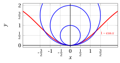{ .fig .ovale loading=lazy style="width:80%" }

- Among these semicircles we want to select the one that not only has the same tangent at $x =0$ but also the same rate of change of the slope at $x = 0$. That is, we want to choose $r$ so that:

    \begin{equation}
    \label{XX} c_r''(0) = f''(0)
    \end{equation}

    We have:

    $$
    c_r'(x) = \frac{x}{\sqrt{r^2 - x^2}} {\rm ~~~~and~~~~} c_r''(x) = \frac{r^2}{\left(r^2 - x^2\right)^{3/2}}
    $$

    hence, if we want \(\eqref{XX}\) to be satisfied, we need to choose $r$ so that:

    \begin{equation}
    \label{YY}   \underbrace{\frac{1}{r}}_{=c_r''(0)} =  f''(0)
    \end{equation}

    Equation \(\eqref{YY}\) expresses the geometric meaning of the second derivative at $x=0$ for the family of functions that satisfy the conditions $f (0) = f' (0) = 0,~~ f'' (0) \ge 0$. That is, $f'' (0)$ represents the reciprocal of the radius of the semicircle that best approximates $f$ at $x = 0$.

- Let us go back to the function $f(x)= 1 -\cos x$; we have

    $$
    f'(x)=\sin x {\rm ~~~and~~~} f''(x)=\cos x
    $$

    hence

    $$
    f''(0)=1 {\rm ~~~and~~~} \frac{1}{r}=1 {\rm ~~hence~~} r=1
    $$

    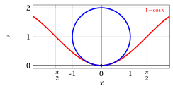{ .fig .ovale loading=lazy style="width:80%" }

!!! chiave ""

    Repeating an analogous construction at a generic point $\big(x,f(x)\big)$ of the graph of $f$ (without assuming a priori $f(x) = f'(x) =0$) one finds that the <strong>circle that best approximates the graph of the function at the point has radius $r(x)$</strong> given by:

    \begin{equation}
    \label{ZZ}  \frac{1}{r(x)} ~~=~~ \frac{|f''(x)|}{\left(1 +  \big(f'(x)\big)^2\right)^{3/2}}
    \end{equation}

    The value $\frac{1}{r(x)}$ is called the <strong>curvature</strong> (of the graph) of $f$ at $x$ and the value $r(x)$ is the <strong>radius of curvature</strong>.

!!! esempio "Example 1: radius of curvature and curvature"

    Consider the (parametric) parabola:

    $$
    f(x) = a\; x^2 {\rm ~~with~~} a \in \R 
    {\rm ~~we~have~~} 
     f'(x)=2\;a\;x {\rm ~~~~~~~and~~~~~~~} f''(x)=2\;a
    $$

    and the following curvature:

    $$
    \frac{1}{r(x)} ~~=~~ \frac{2\:|a|}{\left(1 +   4\;a^2 x^2\right)^{3/2}}
    $$

    Note that the curvature is maximum at $x =0$, i.e., at the vertex.

    Let us now consider the parabola

    $$
    y = 2\; x^2
    $$

    and compute the radius $r(x)$ of the circle that best approximates the graph at the points with abscissa $x=0$ and $x=\frac{1}{2}$. We have:

    $$
    \frac{1}{r(0)} ~~=~~ \frac{2\:|2|}{\left(1 +   4\;2^2 0^2\right)^{3/2}}  ~~=~~ 4
     ~~ {\rm ~~~~hence~~~~} r(0) = \frac{1}{4}
    $$

    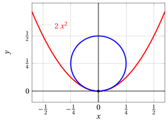{ .fig .ovale loading=lazy style="width:60%" }

    $$
    \frac{1}{r\left(\frac{1}{2}\right)} ~~=~~ \frac{2\:|2|}{\left(1 +   4\;2^2 \left(\frac{1}{2}\right)^2\right)^{3/2}} ~~=~~ \frac{4}{5^{3/2}}  ~~\approx~~ 0.3577 ~~ {\rm ~~~~hence~~~~} r\left(\frac{1}{2}\right) \approx 2.7950
    $$

## 2. Second derivative, concavity and convexity

- We will now see how to make this idea of curvature of the graph more precise, qualitatively and quantitatively, through the concept of <strong>convexity</strong>.

### 2.1 Convex sets

!!! definizione "Definition 3: convex set"

    A set $F \subseteq \R^2$ (a portion of the Euclidean space) is <strong>convex</strong> if for every pair of points $P_a,P_b \in F$ the segment joining $P_a$ to $P_b$ (called a <strong>chord</strong>) is entirely contained in $F$.

!!! chiave ""

    Given two points $P_a$ and $P_b$ and a value $\lambda$ between 0 and 1, i.e., $0\le \lambda \le 1$, the point:

    $$
    P_c = \lambda\; P_a + (1-\lambda)\: P_b
    $$

    is called a <strong>convex (linear) combination</strong> of the points $P_a$ and $P_b$. As $\lambda$ varies, the points $P_c$ move along the segment joining $P_a$ to $P_b$.

!!! definizione "Definition 4: convex set – equivalent definition"

    A set $F \subseteq \R^2$ is <strong>convex</strong> if:

    $$
    \forall P_a, P_b \in F,~~0\le \lambda \le 1,\qquad P_c=\lambda\; P_a + (1-\lambda)\: P_b  \in F
    $$

!!! esempio "Example 2: convex set"

    Consider, for example, the following convex set given by the intersection of 4 half-planes:

    
<table>
    <tr>
    <td>\(F = \big\{ ~~(x,y) \in \R^2:\)</td>
    <td>\(x\)</td>
    <td>\+</td>
    <td>\(y\)</td>
    <td>\(\ge\)</td>
    <td>3,</td>
    <td>\(x\)</td>
    <td>\+</td>
    <td>\(y\)</td>
    <td>\(\le\)</td>
    <td>9,</td>
    </tr>
    <tr>
    <td></td>
    <td>\-	 	\(x\)</td>
    <td>\+</td>
    <td>\(y\)</td>
    <td>\(\le\)</td>
    <td>3,</td>
    <td>\-	 	\(x\)</td>
    <td>\+</td>
    <td>\(y\)</td>
    <td>\(\ge\)</td>
    <td>\-3   \(\big\}\)</td>
    </tr>
    </table>

    { .fig .ovale loading=lazy style="width:52%" }

!!! esempio "Example 3: non-convex set"

    Let us now consider the following set:

    { .fig .ovale loading=lazy style="width:52%" }

    The set is not convex since, for example, the convex combination of the points $(5,3)$ and $(3,5)$ with $\lambda=\frac{1}{2}$, that is, the point:

    $$
    \left(~\frac{1}{2}\cdot 5 + \frac{1}{2}\cdot 3 ~~,~~ \frac{1}{2}\cdot 3 + \frac{1}{2}\cdot 5 ~\right) = (~4~~,~~4~)
    $$

    does not belong to the set.

### 2.2 Convex/concave functions

!!! definizione "Definition 5: epigraph"

    Consider a function $f: I \rr \R$. The <strong>epigraph</strong> of $f$ is the set:

    $$
    \epi f = \big\{(x,y) \in \R^2:~~x\in I {\rm ~~and~~} y \ge f(x) \big\}
    $$

!!! esempio "Example 4: epigraph"

    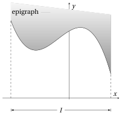{ .fig .ovale loading=lazy style="width:55%" }

!!! definizione "Definition 6: convex (concave) function"

    A function $f: I \rr \R$ is <strong>convex</strong> on $I$ if its epigraph is a convex set. A function is <strong>concave</strong> on $I$ if $-f$ is convex on $I$.

!!! esempio "Example 5: convex function"

    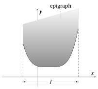{ .fig .ovale loading=lazy style="width:55%" }

!!! esempio "Example 6: concave function"

    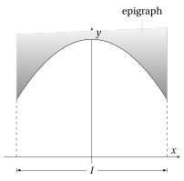{ .fig .ovale loading=lazy style="width:55%" }

!!! definizione "Definition 7: convex (concave) function – equivalent definition"

    A function $f: I \rr \R$ is <strong>convex</strong> (<strong>concave</strong>) on $I$ if for every pair of points $x_1,x_2 \in I$ the segment (“chord”) with endpoints $\big(x_1, f (x_1)\big)$, $\big(x_2, f (x_2)\big)$ has no points below (above) the graph of $f$.

!!! chiave ""

    The definition of convex function translates into the analytic inequality:

    $$
    f\big(\lambda \; x_1 + (1-\lambda)\; x_2\big) \le \lambda \; f(x_1) + (1-\lambda)\; f(x_2), \qquad \forall x_1,x_2 \in I, 0\le \lambda \le 1
    $$

{ .fig .ovale loading=lazy style="width:80%" }

- If in the previous inequality the strict $<$ always holds (with $\lambda \neq 0,1$), the function is called <strong>strictly convex</strong>. For concave (or strictly concave) functions an analogous inequality holds with the sign $\ge$ (or &gt; ).

- Observe that as $0\le \lambda \le 1$ varies: the point $\lambda \; x_1 + (1-\lambda)\; x_2$ runs along the segment $[x_1,x_2]$ on the $x$-axis; the point $\lambda \; f(x_1) + (1-\lambda)\; f(x_2)$ runs along the segment $[f(x_1),f(x_2)]$ on the $y$-axis; the point:

    $$
    \bigg(\lambda \; x_1 + (1-\lambda)\; x_2,~ f\big(\lambda \; x_1 + (1-\lambda)\; x_2\big) \bigg)
    $$

    runs along the graph of the function; the point:

    $$
    \big(\lambda \; x_1 + (1-\lambda)\; x_2,~ \lambda \; f(x_1) + (1-\lambda)\; f(x_2)\big)
    $$

    runs along the segment with endpoints $\big(x_1,f(x_1)\big)$ and $\big(x_2,f(x_2)\big)$.

!!! esempio "Example 7: graph of a convex function"

    Consider the convex function $f(x) = (x-2)^2+1$ with domain $\left[\frac{1}{2},3\right]$ and take, for example, $x_1=1$ and $x_2=\frac{5}{2}$ and $\lambda= \frac{1}{3}$. We have the following convex (linear) combination:

    $$
    \left(~\frac{1}{3}\cdot 1 + \frac{2}{3}\cdot \frac{5}{2}~~,~~ \frac{1}{3}\cdot 2 + \frac{2}{3}\cdot \frac{5}{4} ~\right) = \left(~2~~,~~\frac{3}{2}~\right)
    $$

    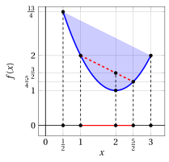{ .fig .ovale loading=lazy style="width:61%" }

- Note that the definition of convex function does not require a priori that the function be continuous or differentiable on an interval.

!!! teorema "Theorem 1"

    A convex (or concave) function on an interval $I$ is continuous on $I$, except possibly at the endpoints of the interval. Moreover, it has a right and a left derivative at every interior point of the interval.

??? dimostrazione "Proof"

    Omitted □

- Corner points inside the interval and points of discontinuity at the endpoints of the interval are the only irregular behaviors allowed for a convex or concave function, as shown by the following examples:

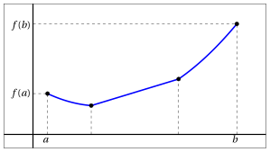{ .fig .ovale loading=lazy style="width:80%" }

{ .fig .ovale loading=lazy style="width:80%" }

## 3. Convexity and derivatives

- If we know a priori that the function is differentiable once or twice on the interval considered, then convexity is related to the first and second derivative of the function.

!!! teorema "Theorem 2"

    Let $f: (a, b) \rr  \R$.

    1. If $f$ is differentiable in $(a,b)$, then $f$ is convex (concave) on $(a, b)$ if and only if $f'$ is increasing (decreasing) on $(a, b)$.

    2. If $f$ is twice differentiable in $(a,b)$, then $f$ is convex (concave) on $(a, b)$ if and only if:

        $$
        f'' (x) \ge 0~~ (\le 0), ~~~\forall x \in (a, b)
        $$

- The theorem is modified in the obvious way for strictly convex or concave functions.

??? dimostrazione "Proof"

    We do not prove part (a). Part (b) follows from (a) by the monotonicity test applied to $f'$. □

!!! chiave ""

    As a consequence of this theorem, the study of the sign of the second derivative allows us to decide on the convexity or concavity of a function (check).

    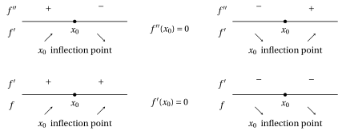{ .fig .ovale loading=lazy style="width:90%" }

!!! esempio "Example 8: convexity of exponential functions"

    The exponential functions

    $$
    f(x) = a^x
    $$

    are convex on $\R$, for any base $a >0, a \neq 1$, since:

    $$
    f'(x) = a^x \log a; ~~~~ f''(x) = a^x \log^2 a >0,~~~~ \forall x \in \R, \forall a >0, a \neq 1
    $$

!!! esempio "Example 9: convexity/concavity of logarithmic functions"

    The logarithmic functions

    $$
    f(x) = \log_a x
    $$

    are concave on $(0,\ip)$ if $a >1$ and convex on $(0,\ip)$ if $0 < a < 1$, since:

    $$
    f'(x) = \frac{1}{x\; \log a}; ~~~~ f''(x) = - \frac{1}{x^2\; \log a} ~~
    \begin{cases}
    < 0, ~ \forall x >0, & {\rm if}~~ a >1\\[2ex]
    > 0, ~ \forall x >0, & {\rm if}~~  0 < a < 1
    \end{cases}
    $$

!!! esempio "Example 10: convexity/concavity of power functions"

    The power functions with real exponent $\alpha$:

    $$
    f(x) = x^{\alpha}
    $$

    are convex on $(0,\ip)$ if $\alpha >1$ or $\alpha < 0$, and concave on $(0,\ip)$ if $0 < \alpha < 1$, since:

    $$
    f'(x) = \alpha \; x^{\alpha-1}; ~~~~ f''(x) = \alpha \; (\alpha-1) x^{\alpha-2}
    $$

    which has, for every $x >0$, the sign of $\alpha \; (\alpha-1)$.

    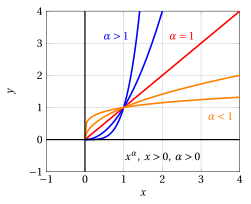{ .fig .ovale loading=lazy style="width:61%" }

## 4. Convexity and tangent lines

- A useful geometric characterization of convexity involves the tangent lines to the graph of the function

!!! teorema "Theorem 3"

    A function $f: (a, b) \rr \R$, differentiable in $(a, b)$, is convex (concave) on $(a, b)$ if and only if, for any choice of a point $x_0 \in (a, b)$, the graph of $f$ lies on the whole of $(a, b)$ above (below) the graph of its tangent line at $\big(x_0, f(x_0)\big)$.

??? dimostrazione "Proof"

    Omitted □

!!! esempio "Example 11: tangent lines and graphs of convex functions"

    Consider the function:

    $$
    f(x) = e^x, ~~f'(x) = e^x, ~~f''(x) = e^x {\rm ~~~is~convex~on~all~of~~~} \R
    $$

    The tangent line to the graph of $f$, for example at $x = 0$, that is, at the point $(0,1)$, is:

    $$
    y = 1 + x {\rm ~~~~hence~~~~} e^x \ge 1+x,~~ x \in \R
    $$

    The tangent line to the graph of $f$, for example at $x = 1$, that is, at the point $(1,e)$, is:

    $$
    y = e + e\;(x-1) {\rm ~~~~hence~~~~} e^x \ge e\:x,~~ x \in \R
    $$

    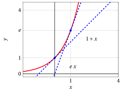{ .fig .ovale loading=lazy style="width:70%" }

!!! chiave ""

    A (differentiable) convex function lies above its tangent lines and, at the same time, below its chords (definition of convexity).

- This allows us to conclude that, given any two points on the graph of a convex function, the graph between those two points lies entirely in the <strong>triangle</strong> whose sides are the chord joining them and the tangent lines to the graph at the two points.

!!! esempio "Example 12: tangent lines/chords and graphs of convex functions"

    Consider the function:

    $$
    f(x) = x^2, ~~f'(x) = 2\:x, ~~f''(x) = 2 {\rm ~~~is~convex~on~all~of~~~} \R
    $$

    The tangent lines to the graph of $f$, for example at the points $x_1 = -0.5$ and $x_2 = 1$, are:

    $$
    y = \frac{1}{4}-\left(x+\frac{1}{2}\right) {\rm ~~~~and~~~~} y = 1 + 2\: (x-1)
    $$

    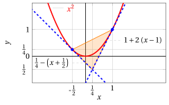{ .fig .ovale loading=lazy style="width:80%" }

## 5. Inflection points

- The direction of concavity of a function (that is, whether it is convex or concave) can change within its domain; this leads us to the concept of inflection point.

!!! definizione "Definition 8: inflection point"

    Let $f : (a, b) \rr \R$ be a function and let $x_0 \in (a, b)$ be a point of differentiability for $f$, or let $f' (x_0) = \pm \infty$. The point $x_0$ is called an <strong>inflection point</strong> of $f$ if there exist a right neighborhood $(x_0, x_0 + h)$, $h > 0$, in which $f$ is convex (concave) and a left neighborhood $(x_0 - h, x_0)$, $h > 0$, in which $f$ is concave (convex).

- When crossing an inflection point, the second derivative of $f$ (if it exists) changes sign. We then expect $f''$ to vanish at this point.

!!! teorema "Theorem 4"

    Let $x_0$ be an inflection point of $f$; if $f'' ( x_0)$ exists, then $f'' ( x_0) = 0$.

??? dimostrazione "Proof"

    Note that, if we knew that $f''$ exists in a neighborhood of $x_0$ <strong>and is continuous</strong> at $x_0$, then the thesis of the theorem would follow from the intermediate value theorem for continuous functions (applied to $f''$). The theorem can also be proved without these additional hypotheses (omitted). □

!!! chiave ""

    The converse of the implication stated by the theorem is not true: a point where the second derivative vanishes may not be an inflection point.

!!! esempio "Example 13: points with zero second derivative that are not inflection points"

    Consider the function:

    $$
    f(x) = x^4, ~~f'(x) = 4\:x^3, ~~f''(x) = 12\;x^2 {\rm ~~~is~convex~on~all~of~~~} \R
    $$

    Since $f' (x) >0$ for $x > 0$, the function is increasing for $x > 0$, decreasing for $x < 0$ and has a minimum point at $x = 0$. We have $f''(0)=0$, but the function is convex on all of $\R$, hence $x=0$ <strong>is not an inflection point</strong>.

    { .fig .ovale loading=lazy style="width:75%" }

- The geometric meaning of inflection points is clarified by the following theorem.

!!! teorema "Theorem 5"

    If $f : (a, b) \rr \R$ is differentiable in $(a, b)$ and $x_0 \in (a, b)$ is an inflection point, then the graph of $f (x)$ crosses its tangent line at $\big(x_0, f (x_0)\big)$.

??? dimostrazione "Proof"

    Let us draw the tangent line to the graph of $f(x)$ at the point with abscissa $x_0$. If $f$ is (for example) concave on $(a, x_0)$, since $f$ is differentiable, the graph of $f$ lies below the line on $(a, x_0)$; on the other hand $f$ is convex on $(x_0, b)$, so its graph lies above the line on $( x_0, b)$. Consequently, at $x_0$ the graph crosses the tangent line. □

!!! esempio "Example 14: inflection points (with horizontal tangent)"

    Consider the function:

    $$
    f(x) = x^3, ~~f'(x) = 3\:x^2, ~~f''(x) = 6\;x
    $$

    Since $f' (x) >0$ for $x \neq 0$, the function is increasing on all of $\R$. It has a stationary point at $x = 0$, which, however, is not a maximum or minimum point, because the function is always increasing.

    We have $f''(0)=0$. Moreover, $f''(x)<0$ for $x < 0$, hence it is concave for $x < 0$, and $f''(x)>0$ for $x > 0$, hence it is convex for $x > 0$. Consequently, the point $x_0$ is <strong>an inflection point with horizontal tangent</strong>, and the graph of the function crosses its tangent line at $\big(0, 0\big)$, that is, the line $y =0$.

    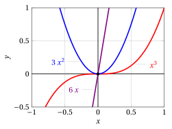{ .fig .ovale loading=lazy style="width:70%" }

!!! esempio "Example 15: inflection points"

    Consider the function:

    $$
    f(x) = e^{-x^2}, ~~f'(x) = -2\;x\;e^{-x^2}, ~~f''(x) = \;e^{-x^2}\;(4\;x^2-2)
    $$

    We have $f' (x) > 0$ for $x < 0$, hence the function increases for $x \le 0$; and $f' (x) < 0$ for $x > 0$, hence it decreases for $x \ge 0$, and moreover $f' (0) = 0$. Therefore it has a relative maximum point at $x = 0$.

    We have:

    $$
    f''(x) = \;e^{-x^2}\;(4\;x^2-2)\ge 0 {\rm ~~for~~} x^2 \ge \frac{1}{2} {\rm ~~~that~is~~~} x \in \left(\im,-\frac{1}{\sqrt{2}}\right] \cup \left[\frac{1}{\sqrt{2}}, \ip\right)
    $$

    The function is convex for these values, and concave for $-\frac{1}{\sqrt{2}} \le x \le \frac{1}{\sqrt{2}}$. Hence it has inflection points at $x = \pm \frac{1}{\sqrt{2}}$, with tangent line of slope:

    $$
    f'\left(\pm \frac{1}{\sqrt{2}}\right)=\mp \sqrt{\frac{2}{e}} {\rm ~~~since~} -2\;\left( \pm \frac{1}{\sqrt{2}} \right)\;e^{-\left( \pm \frac{1}{\sqrt{2}} \right)^2} = \mp \sqrt{2} \cdot {\frac{1}{\sqrt{e}}}
    $$

    The tangent lines are:

    $$
    y= \frac{1}{\sqrt{e}} + \sqrt{\frac{2}{e}}\left(x+\frac{1}{\sqrt{2}}\right) {\rm ~~~~and~~~~~} y= \frac{1}{\sqrt{e}} - \sqrt{\frac{2}{e}}\left(x-\frac{1}{\sqrt{2}}\right)
    $$

    { .fig .ovale loading=lazy style="width:85%" }

!!! esempio "Example 16: inflection points (with vertical tangent)"

    Consider the function:

    $$
    f(x) = x^{1/3}, ~~f'(x) = \frac{1}{3\;x^{2/3}}, {\rm ~~ for~~} x >0, ~~f''(x) = -\frac{2}{9\;x^{5/3}}, {\rm ~~ for~~} x >0
    $$

    For $x_0=0$, we have seen that $f'(0)= \ip$. In this case, however, $f''(0)$ does not exist and the function has an inflection point with vertical tangent.

    { .fig .ovale loading=lazy style="width:70%" }

!!! esempio "Example 17: inflection points (with horizontal tangent)"

    Consider the function:

    $$
    f(x) = x \; |x|, {\rm ~~with~~} x \neq 0,~~ f(x)=\left\{\begin{array}{lr} x^2, &x>0\\
    \\
    -x^2, & x < 0 \end{array}\right. ~~~
    f'(x)=\left\{\begin{array}{lr} 2\;x, &x>0 \\
    \\
    -2\;x, & x< 0 \end{array}\right. ~~~
    f''(x)=\left\{\begin{array}{lr} 2, &x>0 \\
    \\
    -2, & x< 0 \end{array}\right.
    $$

    Hence, for $x>0$ the function is convex and for $x<0$ it is concave, and $f'(0)=0$; therefore $x_0$ is an inflection point (but $f''(0)$ does not exist).

    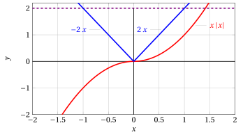{ .fig .ovale loading=lazy style="width:70%" }

<strong>Try it</strong> — the interactive graph below shows what you have just read: move the sliders.

