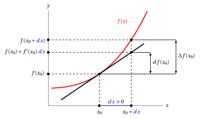
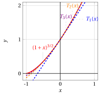
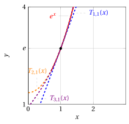

# Differential calculus and approximations

**Part 4 · Derivatives · Chapter 8** · lecture notes by Fabio Furini · [:material-file-pdf-box: Lecture notes, volume (PDF)](../pdf/lecture-notes-4-derivatives.pdf) · [:material-presentation: Slides (PDF)](../pdf/slides-derivatives-08-approximations.pdf)

## 1. First-order asymptotic expansions

- A very frequent operation, both in mathematics and in its applications, is the linear approximation of a given differentiable function (an operation also called first-order asymptotic expansion).

- Let $f : (a, b) \rr  \R$ be a function differentiable at a point $x_0 \in (a, b)$. Consider the argument $x_0 + dx$ due to the increment/decrement $dx$ with respect to $x_0$. As a consequence, the values of $f$ undergo the increment/decrement:

    $$
    \Delta f(x_0) = f(x_0 + dx) - f(x_0)
    $$

    which, in general, for fixed $x_0$, is not proportional to $dx$, i.e., it is not linear with respect to $dx$. The increment/decrement evaluated along the tangent line is:

    $$
    df(x_0) = f(x_0)+f'(x_0) \; dx - f(x_0) = f'(x_0) \; dx
    $$

{ .fig .ovale loading=lazy style="width:97%" }

- Given a function $f$ differentiable at a point $x_0$ in the interior of its domain, the <strong>linear approximation</strong> consists in approximating the increment/decrement $\Delta f(x_0)$ of the values of the function due to an increment/decrement of the argument from $x_0$ to $x_0 + dx$, by replacing the function with its tangent line at the point $\big(x_0,f(x_0)\big)$.

- The idea behind linear approximation therefore consists in estimating $\Delta f(x_0)$ with $df(x_0)$. To obtain good approximations, we consider increments that are very “small” in absolute value, that is, $|dx| \ll 1$.

!!! definizione "Definition 1: differential of a function"

    Given a function $f : (a, b) \rr  \R$, differentiable at a point $x_0 \in (a,b)$, the <strong>differential</strong> of $f$ at the point $x_0$ is the increment/decrement $df(x_0)$ of the values of the function from $x_0$ to $x_0+dx$ evaluated along the tangent line:

    $$
    df(x_0) = f'(x_0) \; dx
    $$

- Given two functions $f$ and $g$, the rules for computing differentials are analogous to the differentiation rules:

    $$
    d(f \pm g)(x_0) = df(x_0) \pm dg(x_0),~~~d(f \cdot g)(x_0) = g(x_0) \: df(x_0) + f(x_0) \; dg(x_0)
    $$

    $$
    d\left(\frac{f}{g} \right)(x_0) = \frac{g(x_0) \: df(x_0) - f(x_0) \; dg(x_0)}{g^2(x_0)}
    $$

- In all types of approximation it is necessary to provide information (qualitative or quantitative) on the <strong>error made</strong>. What is the error made in the approximation? What is the value of $\Delta f(x_0) - df(x_0)$?

    To answer, we observe that $dx$ is equivalent to $x-x_0$, hence we have:

    $$
    \Delta f(x_0) = f(x_0 + x - x_0) - f(x_0) = f(x) - f(x_0)\qquad {\rm and} \qquad df(x_0) = f'(x_0) \; (x-x_0)
    $$

    Moreover, from the definition of derivative we have:

    $$
    \lim_{x \rr x_0} \frac{f(x) - f(x_0)}{x-x_0} = f'(x_0) ~~~~\Rightarrow~~~~
     \lim_{x \rr x_0} \left(\frac{f(x) - f(x_0)}{x-x_0} -f'(x_0) \right)=0
    $$

    $$
    ~~~~\Rightarrow~~~~
     \lim_{x \rr x_0} \left(\frac{f(x) - f(x_0) -f'(x_0)(x-x_0) }{x-x_0}  \right)=0
    $$

    and from the definition of little-$o$ we have:

    \begin{equation}
    \label{DIFF_bis}
     \underbrace{f(x) - f(x_0)}_{= \Delta f(x_0)} - \underbrace{f'(x_0)\; (x-x_0)}_{=df(x_0)} = o(x-x_0)  {\rm ~~~as~~~} x \rr x_0
    \end{equation}

    Hence the error $\Delta f(x_0) - df(x_0)$ tends to zero faster than $(x-x_0)$ as $x \rr x_0$.

!!! definizione "Definition 2: first-order asymptotic expansion"

    Given a function $f : (a, b) \rr  \R$, differentiable at a point $x_0 \in (a,b)$, the <strong>first-order asymptotic expansion</strong> (or linear expansion) of $f$ at the point $x_0$ is the following expression:

    \begin{equation}
    \label{F}f(x)   = f(x_0) + f'(x_0)\; (x -x_0) + o\big(x - x_0 \big) {\rm ~~~as~~~} x \rr x_0
    \end{equation}

Expression \(\eqref{F}\) follows directly from \(\eqref{DIFF_bis}\), and in the case $x_0=0$ we have:

\begin{equation}
\label{DIFF_tris}
f(x)   = f(0) + f'(0)\; x + o(x) {\rm ~~~as~~~} x \rr 0
\end{equation}

!!! esempio "Example 1: first-order (linear) asymptotic expansions and approximation errors"

    We compute the first-order (linear) asymptotic expansion as $x \rr 0$ of:

    $$
    f(x) = \sqrt{1+x}
    $$

    We have $x_0=0$ and moreover:

    $$
    f'(x) = \frac{1}{2\; \sqrt{1+x} }, ~~f'(0) = \frac{1}{2}{\rm ~~~~and~~~~} f(0) = 1
    $$

    Hence we have the following first-order (linear) asymptotic expansion:

    $$
    \sqrt{1+x}   = 1+ \frac{1}{2} \; x + o(x)  {\rm ~~~as~~~} x \rr 0
    $$

    Moreover, the error made by the approximation is:

    $$
    \underbrace{\sqrt{1+x}   - 1}_{=\Delta f(0) =f(x)-f(0)}- \underbrace{\frac{1}{2}\; x}_{=df(0)= f'(0)\; x} =  o(x)  {\rm ~~~as~~~} x \rr 0
    $$

    Graphically we have:

    { .fig .ovale loading=lazy style="width:70%" }

!!! esempio "Example 2: first-order (linear) asymptotic expansions"

    We compute the first-order (linear) asymptotic expansion as $x \rr 1$ of:

    $$
    f(x) = \sqrt{1+x}
    $$

    We have $x_0=1$ and moreover:

    $$
    f'(x) = \frac{1}{2\; \sqrt{1+x} }, ~~f'(1) = \frac{1}{2\sqrt{2}}{\rm ~~~~and~~~~} f(1) = \sqrt{2}
    $$

    Hence we have the following first-order (linear) asymptotic expansion:

    $$
    \sqrt{1+x}   = \sqrt{2}+ \frac{1}{2\; \sqrt{2}} \; (x-1) + o(x-1)  {\rm ~~~as~~~} x \rr 1
    $$

    Moreover, the error made by the approximation is:

    $$
    \underbrace{\sqrt{1+x}   - \sqrt{2}}_{=\Delta f(1) =f(x)-f(1)}- \underbrace{\frac{1}{2\; \sqrt{2}}\; (x-1)}_{=df(1)= f'(1)\; (x-1)} =  o(x-1)  {\rm ~~~as~~~} x \rr 1
    $$

    Graphically we have:

    { .fig .ovale loading=lazy style="width:70%" }

## 2. Derivatives of polynomials

- A polynomial of degree $n$ can be written as:

    $$
    P_n(x) = \sum_{i=0}^n a_i \cdot x^i  \quad  {\rm ~~with~~} a_i \in \R,  {\rm ~for~~} i \in \{0,1,\dots,n\}, ~ {\rm ~~and~~} a_n \neq 0.
    $$

    The value $a_i$ is the <strong>coefficient</strong> of the monomial of degree $i$, with $i \in \{0,1,\dots,n\}$, while $x^i$ is the <strong>literal part</strong> of the monomial, a positive integer power of $x$. The value $a_0$ is the <strong>constant term</strong> of the polynomial.

!!! chiave ""

    The first and second derivative functions of a polynomial of degree $n\ge 2$ are:

    \begin{align*}
    P'_n(x) &= \sum_{i=1}^n  i \; a_{i} \; x^{i-1} &P''_n(x) &= \sum_{i=2}^n  (i-1) \cdot i \cdot a_{i} \; x^{i-2}\\[2ex]
    P'_n(0)&=a_1&P''_n(0)&=2\;a_2
    \end{align*}

!!! esempio "Example 3: first and second derivative of a polynomial"

    Consider the following polynomial of degree $5$:

    $$
    P_5(x) = 10 + 7\; x + 3\; x^2  - 6\; x^3  + 4\; x^4  - 2\; x^5
    $$

    the first derivative function is:

    $$
    P'_5(x) = \red{1} \cdot 7 \; x^{\red{1}-1} + \red{2} \cdot 3\; x^{\red{2}-1}  + \red{3} \cdot   (-6)\; x^{\red{3}-1}  + \red{4} \cdot  4\; x^{\red{4}-1}  + \red{5} \cdot (-2)\; x^{\red{5}-1}  = 7 + 6 \; x - 18 \; x^2 + 16 \;x^3 - 10 x^4
    $$

    $$
    P'_5(0) = 7
    $$

    the second derivative function is:

    $$
    P''_5(x) =  \blue{1} \cdot \red{2} \cdot 3\; x^{\red{2}-2}  + \blue{2} \cdot  \red{3} \cdot   (- 6)\; x^{\red{3}-2}  + \blue{3} \cdot \red{4} \cdot  4\; x^{\red{4}-2}  + \blue{4} \cdot \red{5} \cdot (-2)\; x^{\red{5}-2} =6 -36\; x+48 \;x^2 -40\; x^3
    $$

    $$
    P''_5(0) = 2\cdot 3 =6
    $$

!!! chiave ""

    The $k$-th derivative function of a polynomial of degree $n$ with $k \in \{0,1,\dots,n\}$ is:

    \begin{align*}
    P^{(k)}_n(x) &= \sum_{i=k}^n  \underbrace{(i-k+1)\cdot \cdots (i-2) \cdot (i-1) \cdot i}_{=\prod_{j=1}^{k} (i-j+1)} \;\; a_{i} \;\; x^{i-k}\\[2ex]
    P^{(k)}_n(0)&=k!\; a_k
    \end{align*}

!!! esempio "Example 4: third, fourth and fifth derivative of a polynomial"

    Consider the following polynomial of degree $5$:

    $$
    P_5(x) = 10 + 7\; x + 3\; x^2  - 6\; x^3  + 4\; x^4  - 2\; x^5
    $$

    the third derivative function is:

    $$
    P^{(3)}_5(x) =  \blue{1} \cdot \blue{2} \cdot \red{3}  \cdot  (-6)\; x^{\red{3}-3}  + \blue{2} \cdot \blue{3} \cdot \red{4}  \cdot  4\; x^{\red{4}-3}  + \blue{3} \cdot \blue{4} \cdot \red{5} \cdot (-2)\; x^{\red{5}-3}  = -36 + 96 x - 120 x^2
    $$

    $$
    P^{(3)}_5(0) = 3!\cdot (-6) = 6 \cdot (-6) = -36
    $$

    the fourth derivative function is:

    $$
    P^{(4)}_5(x) =  \blue{1} \cdot \blue{2} \cdot \blue{3} \cdot \red{4} \cdot  4\; x^{\red{4}-4}  + \blue{2} \cdot \blue{3} \cdot \blue{4} \cdot \red{5} \cdot (-2)\; x^{\red{5}-4}  = 96 - 240 x
    $$

    $$
    P^{(4)}_5(0) = 4!\cdot 4 = 24 \cdot 4 = 96
    $$

    the fifth derivative function is:

    $$
    P^{(5)}_5(x) =   \blue{1} \cdot \blue{2} \cdot \blue{3} \cdot \blue{4} \cdot \red{5} \cdot (-2)\; x^{\red{5}-5}  = -240
    $$

    $$
    P^{(5)}_5(0) = 5!\cdot (-2) = 120 \cdot (-2) = -240
    $$

- Given $x_0 \in \R$, equivalently, a polynomial of degree $n$ can be written as:

    $$
    P_n(x) = \sum_{i=0}^n a_i \cdot (x-x_0)^i  \quad  {\rm ~~with~~} a_i \in \R,  {\rm ~for~~} i \in \{0,1,\dots,n\}, ~ {\rm ~~and~~} a_n \neq 0.
    $$

    The $k$-th derivative function, $k \in \{0,1,\dots,n\}$, is in this case:

    \begin{align*}
    P^{(k)}_n(x) &= \sum_{i=k}^n  (i-k+1)\cdot \cdots (i-2) \cdot (i-1)\cdot i \cdot a_{i} \cdot (x-x_0)^{i-k}\\[2ex]
    P^{(k)}_n(x_0)&=k!\cdot a_k
    \end{align*}

## 3. Taylor formula/expansion with Peano remainder

- Linear approximation (or linearization) approximates a function with its tangent line at a point $\big(x_0,f(x_0)\big)$, that is, a first-degree polynomial whose derivative equals that of the function at the point $x_0$ and whose constant term is the value of the function at $x_0$.

    !!! chiave ""

        For simplicity, we start by reasoning with $x_0=0$.

- With first-degree polynomials we have:

    $$
    P_1(x) = a_0 + a_1 \; x,~~~~ P'_1(x)= a_1, {\rm ~~~setting~~~} a_0 = f(0) {\rm ~~and~~} a_1 = f'(0)
    $$

    from \(\eqref{F}\) we obtain the first-order asymptotic expansion:

    $$
    f(x) = \underbrace{a_0}_{=f(0)} + \underbrace{a_1}_{=f'(0)} \; x  + o(x)
    $$

    and the error made by using the first-degree polynomial instead of the function:

    $$
    \underbrace{f(x) - a_0}_{\Delta f(0)} - \underbrace{a_1 \; x}_{df(0)} = o(x)
    $$

    tends to zero faster than any linear function.

- We now want to generalize the procedure of “<strong>linear approximation</strong>” to that of “<strong>polynomial approximation</strong>”.

!!! chiave ""

    We ask: given a function, differentiable as many times as necessary, does there exist a polynomial of degree $n\ge 2$ that, in a neighborhood of a fixed point, approximates the function “better” than its tangent line? <strong>We proceed in two steps</strong>.

<u><strong>First step</strong></u>

- We identify a candidate polynomial to approximate the function “well”, by looking for a polynomial whose derivatives up to order $n$ are all equal to those of the function $f$ at the point $x_0 = 0$. The polynomial must be of degree $n$ in order to have its $n$-th derivative equal to $f^{(n)} (0)$.

!!! teorema "Theorem 1: Maclaurin polynomial"

    Given a function $f:(a,b)\rr \R$ differentiable $n-1$ times in $(a,b)$ and $n$ times at $0 \in (a,b)$, there exists one and only one polynomial $T_{n,f}$ of degree $\le n$ with the property that:

    $$
    T_{n,f}(0) = f(0),~~T'_{n,f}(0) = f'(0),~~\dots~~,~~T^{(n)}_{n,f}(0) = f^{(n)}(0)
    $$

    and this polynomial, called the <strong>Maclaurin polynomial</strong> of $f$ of degree $n$, is:

    \begin{align*}
    T_{n,f}(x) & = \sum_{k=0}^n  \frac{f^{(k)}(0)}{k!} \; x^k \qquad ({\rm setting ~~}f^{(0)}=f)
    \end{align*}

??? dimostrazione "Proof"

    We prove that the Maclaurin polynomial of a function $f$ satisfying the hypotheses of the theorem has the same derivatives at 0 as the function, up to order $n$. The $k$-th derivative at $x_0=0$ of the Maclaurin polynomial of degree $n$, with $k \in \{0,1,\dots,n\}$, is:

    $$
    T^{(k)}_{n,f}(0)=k!\cdot \frac{f^{(k)}(0)}{k!} = f^{(k)}(0) {\rm ~~~~~~and~~with~~~} k=0 {\rm ~~~we~have~~~} T_{n,f}(0) = f(0)
    $$

    Hence all the derivatives at 0 up to order $n$ are equal to those of the function $f$ (and it has the same value as the function at $0$).

    We now prove that this polynomial is unique. Let us now consider a generic polynomial of degree $n$:

    $$
    P_n(x) = \sum_{i=0}^n a_i \cdot x^i  \quad  {\rm ~~with~~} a_i \in \R,  {\rm ~for~~} i=0,1,\dots,n, ~ {\rm ~~and~~} a_n \neq 0.
    $$

    Its $k$-th derivative at $x_0=0$, with $k \in \{0,1,\dots,n\}$, is

    $$
    P^{(k)}_n(0)=k!\cdot a_k
    $$

    Hence, if the polynomial has the same $k$-th derivative as the function, we have:

    $$
    k!\cdot a_k = f^{(k)}(0) {\rm ~~~which~implies~~~} a_k = \frac{f^{(k)}(0)}{k!}
    $$

    that is, the coefficients of the Maclaurin polynomial. □

!!! chiave ""

    The expanded form of the Maclaurin polynomial of degree $n$ of a function $f$ is:

    \begin{align*}
    T_{n,f}(x) & = f(0) + f'(0)  \; x + \frac{1}{2} \; f''(0)  \; x^2 + \frac{1}{3!} \; f'''(0) \; x^3  + {\rm \dots} + \frac{1}{n!} \; f^{(n)}(0) \; x^n
    \end{align*}

- When the function we refer to is clear, for convenience we omit the subscript $f$ of the Maclaurin polynomial and simply write $T_{n}(x)$.

!!! esempio "Example 5: Computing the Maclaurin polynomial"

    We compute the Maclaurin polynomial of degree 3 of the function

    $$
    f(x) = \log (1 + x)
    $$

    We have $f(0)=0$ and for the derivatives we have:

    $$
    f^{(1)}(x)=\frac{1}{1+x},~f^{(1)}(0)=1,~~~~f^{(2)}(x)=-\frac{1}{(1+x)^2},~f^{(2)}(0)=-1,~~~~f^{(3)}(x)=\frac{2}{(1+x)^3},~ f^{(3)}(0)=2
    $$

    Hence the Maclaurin polynomial of degree 3 of the function is:

    $$
    T_3(x)=0+ 1\; x + \frac{1}{2} 
    \; (-1) \; x^2 +  \frac{1}{6} \; 2 \; x^3 = x - \frac{1}{2} 
    \; x^2 +  \frac{1}{3}  \; x^3
    $$

    { .fig .ovale loading=lazy style="width:52%" }

    The fourth derivative is:

    $$
    ~~~f^{(4)}(x)=-\frac{6}{(1+x)^4},~~~~ f^{(4)}(0)=-6
    $$

    Generalizing to the $n$-th derivative, it follows that the Maclaurin polynomial of degree $n$ of the function is:

    \begin{align*}
    T_{n}(x) &= x - \frac{x^2}{2}+ \frac{x^3}{3} - \frac{x^4}{4}+ {\rm \dots} + (-1)^{n-1} \frac{x^n}{n}
    \end{align*}

!!! esempio "Example 6: Computing the Maclaurin polynomial"

    We compute the Maclaurin polynomial of degree 3 of the function

    $$
    f(x) = (1 + x)^{\alpha}
    $$

    We have $f(0)=1$ and for the derivatives we have:

    $$
    f^{(1)}(x)=\alpha \; (1 + x)^{\alpha-1},~f^{(1)}(0)=\alpha,~~~~f^{(2)}(x)=(\alpha-1)\alpha \; (1 + x)^{\alpha-2},~f^{(2)}(0)=(\alpha-1)\alpha
    $$

    $$
    f^{(3)}(x)=(\alpha-2)(\alpha-1)\alpha \; (1 + x)^{\alpha-3},~f^{(3)}(0)=(\alpha-2)(\alpha-1)\alpha
    $$

    Hence the Maclaurin polynomial of degree 3 of the function is:

    $$
    T_3(x)=1+ \alpha\; x + \frac{\alpha\;(\alpha-1)}{2}\; x^2 + \frac{\alpha\;(\alpha-1)\;(\alpha-2)}{3!}\; x^3
    $$

    For example, with $\alpha = \frac{3}{2}$ we have:

    $$
    T_3(x)=1+ \frac{3}{2}\; x + \frac{3}{8}\; x^2 - \frac{1}{16} \; x^3
    $$

    { .fig .ovale loading=lazy style="width:52%" }

    The fourth derivative is:

    $$
    f^{(4)}(x)=(\alpha-3)(\alpha-2)(\alpha-1)\alpha \; (1 + x)^{\alpha-4},~~~~f^{(4)}(0)=(\alpha-3)(\alpha-2)(\alpha-1)\alpha
    $$

    Generalizing to the $n$-th derivative, it follows that the Maclaurin polynomial of degree $n$ of the function is:

    \begin{align*}
    T_{n}(x) &= 1 +  \alpha\; x + \frac{\alpha\;(\alpha-1)}{2}\; x^2 +  \frac{\alpha\;(\alpha-1)\;(\alpha-2)}{3!}\; x^3 +{\rm \dots} + \frac{\alpha\;(\alpha-1)\cdots(\alpha-n+1)}{n!}\; x^n
    \end{align*}

<u><strong>Second step</strong></u>

- We now prove that the Maclaurin polynomial approximates $f (x)$ “well” in a neighborhood of $x_0 = 0$. Precisely, the following theorem holds:

!!! teorema "Theorem 2: Maclaurin formula of order $n$ with Peano remainder"

    Let $f: (a, b) \rr  \R$ be differentiable $n-1$ times in $(a,b)$ and $n$ times at $0 \in (a,b)$. Then

    $$
    f(x) = T_{n,f}(x) + o \big( x^n \big) {\rm ~~as~~} x \rr 0
    $$

- The formula has the structure: <strong>function to be approximated equals approximating polynomial plus approximation error</strong>. The error is the term $o \big( x^n \big)$ and is called the Peano remainder. As $x \rr 0$, the larger $n$ is, the smaller the error.

!!! esempio "Example 7: errors of polynomial approximations"

    Consider $f(x) = \cos x$; we have:

    $$
    f(0)   = 1,~~ f^{(1)}(x) = -\sin x, ~~f^{(1)}(0)= 0, ~~f^{(2)} = -\cos x, ~~f^{(2)}(0)= -1
    $$

    The Maclaurin polynomials of first and second degree and the approximation errors are:

    $$
    T_1(x) = 1,~~~T_2(x) = 1 - \frac{1}{2} x^2,~~~~~~\cos x -1 =  o(x) {\rm ~~~and~~~} \cos x -1 + \frac{1}{2} \: x^2 = o(x^2)
    $$

    { .fig .ovale loading=lazy style="width:90%" }

    The second-degree polynomial $T_2(x)$ approximates the function $\cos x$ near $x_0=0$ “better” than the first-degree polynomial $T_1(x)$. The difference between the function and $T_2(x)$ tends to zero faster than $x^2$, while the difference with $T_1(x)$ tends to zero only faster than $x$.

??? dimostrazione "Proof"

    We prove the theorem in the case $n=2$, i.e.:

    $$
    f(x)= f(0) +  f'(0)\; x + \frac{1}{2} \; f''(0) \; x^2   + o\big(x^2\big) {\rm ~~as~~} x \rr 0
    $$

    We therefore need to prove that:

    $$
    f(x) - \left( f(0) + f'(0) \; x + \frac{1}{2} \; f''(0)  \; x^2\right) = o\big(x^2\big) {\rm ~~as~~} x \rr 0
    $$

    i.e. (by definition of little-$o$) that:

    $$
    \lim_{x \rr 0} \frac{f(x) - \left( f(0) + f'(0) \; x + \frac{1}{2} \; f''(0)  \;x^2 \right)}{x^2} = 0
    $$

    This limit gives an indeterminate form $[0/0]$; we now apply L'Hôpital's rule and obtain:

    $$
    \lim_{x \rr 0} \frac{f(x) - \left( f(0) + f'(0) \; x  + \frac{1}{2} \; f''(0) \; x^2 \right)}{x^2} = \lim_{x \rr 0} \frac{f'(x) - \left( f'(0) +  f''(0)  \; x\right)}{2\;x}
    $$

    which is still in the indeterminate form $[0/0]$. We apply L'Hôpital's rule again and obtain:

    $$
    \lim_{x \rr 0} \frac{f'(x) - \left( f'(0) +  f''(0) \; x \right)}{2\;x} = \lim_{x \rr 0} \frac{f''(x)  - f''(0)}{2} =0
    $$

    the limit equals $0$ if we add the hypothesis that $f''(x)$ is continuous at $x=0$.

    Let us see how to proceed also without requiring the continuity of $f''$ at 0, and prove directly that:

    $$
    \frac{1}{2} \lim_{x \rr 0} \frac{f'(x) - \left( f'(0) +  f''(0)  \; x\right)}{x} =0
    $$

    By hypothesis, $f$ is twice differentiable at 0, hence $f'$ is differentiable; if we apply the linear approximation (equation \(\eqref{DIFF_tris}\)) to the function $f'(x)$ we obtain:

    $$
    f'(x)   = f'(0) + f''(0)\; x + o(x) {\rm ~~~as~~~} x \rr 0
    $$

    hence it follows that (definition of little-$o$):

    $$
    \frac{f'(x) - \left( f'(0) +  f''(0)  \; x\right)}{x} \rr 0 {\rm ~~~as~~~} x \rr 0
    $$

    
□

??? dimostrazione "Proof"

    The general case (any $n$) can be proved by induction on $n$. We have already proved that the thesis holds for $n = 2$.

    Suppose now that we know that for any function differentiable $n - 1$ times at $x=0$ the Maclaurin formula holds, and let us prove that

    \begin{equation}
    \label{VVV}
    f(x)= T_{n,f}(x)  + o\big(x^n\big) {\rm ~~as~~} x \rr 0 {\rm ~~~i.e.~~} \lim_{x \rr 0} \frac{f(x) - T_{n,f}(x)}{x^n} = 0
    \end{equation}

    Applying L'Hôpital's rule, we have:

    \begin{equation}
    \label{NNN}
    \lim_{x \rr 0} \frac{f'(x) - T'_{n,f}(x)}{n\; x^{n-1}}
    \end{equation}

    We now observe that the derivative of the polynomial $T_{n,f}(x)$ of $f$ is nothing but the polynomial $T_{n-1,f'}(x)$ of the function $f'$:

    $$
    T'_{n,f}(x) = T_{n-1,f'}(x)
    $$

    as can be verified directly from the definition of $T_{n,f}$. On the other hand, by the inductive hypothesis applied to the function $f'$, we know that

    $$
    f'(x) = T_{n-1,f'}(x) + o \big( x^{n-1} \big) {\rm ~~as~~} x \rr 0 {\rm ~~~i.e.~~} \lim_{x \rr 0} \frac{f'(x) - T_{n-1,f'}(x)}{x^{n-1}} = 0
    $$

    hence the limit \(\eqref{NNN}\) is zero and, by L'Hôpital's rule, the limit \(\eqref{VVV}\) is also zero, as we wanted to prove. □

!!! esempio "Example 8: computing Maclaurin polynomials"

    To better understand the equality:

    $$
    T'_{n,f}(x) = T_{n-1,f'}(x)
    $$

    consider a function $f$; its Maclaurin polynomial, for example of degree $3$, is:

    $$
    T_{3,f}(x)  = f(0) + f'(0)  \; x + \frac{1}{2} \; f''(0)  \; x^2 + \frac{1}{3!} \; f'''(0) \; x^3
    $$

    and the derivative of the polynomial $T_{3,f}(x)$ is:

    $$
    T'_{3,f}(x)  =  f'(0)   +  f''(0)  \; x + \frac{1}{2} \; f'''(0) \; x^2
    $$

    Let us now consider its derivative function $f'(x)$ and compute its Maclaurin polynomial of degree $2$:

    $$
    T_{2,f'}(x)  =  f'(0)   +  f''(0)  \; x + \frac{1}{2} \; f'''(0) \; x^2
    $$

    that is, we obtain the same polynomial; the reasoning easily extends to degree $n$.

- The derivative $T'_{n,f}(x)$ of the Maclaurin polynomial $T_{n,f}(x)$ of $f$ is the Maclaurin polynomial $T_{n-1,f'}(x)$ of degree $n-1$ of the derivative function $f'$, that is:

    \begin{align*}
    T'_{n,f}(x)  &= \sum_{k=1}^n  k\;\frac{f^{(k)}(0)}{k!} \; x^{k-1} = \sum_{k=1}^n  \frac{f^{(k)}(0)}{(k-1)!} \; x^{k-1}  = \sum_{k=0}^{n-1}  \frac{f^{(k+1)}(0)}{(k)!} \; x^{k} = T_{n-1,f'}(x)
    \end{align*}

!!! esempio "Example 9: Maclaurin formula or expansion of the sine"

    Consider

    $$
    f(x) = \sin x
    $$

    $f(0)=0$ and moreover we have:

    $$
    f^{(1)}(x)=\cos x,~~f^{(2)}(x)=-\sin x,~~f^{(3)}(x)=-\cos x,~~f^{(4)}(x)=\sin x=f(x),~~f^{(5)}(x)=\cos x=f^{(1)}(x)  \dots
    $$

    It follows that the derivatives of order $2k$ (even) vanish at $x = 0$, while those of order $2k+1$ (odd) are alternately $+1$ and $- 1$ at $x = 0$. The Maclaurin polynomials of the sine function therefore contain only terms of odd degree:

    \begin{align*}
    \sin x &= T_1(x) + o(x)= x + o(x)  &{\rm ~~~as~~~}  x \rr 0\\[2ex]
    \sin x &= T_3(x) + o(x^3)= x - \frac{x^3}{6}+ o(x^3)  &{\rm ~~~as~~~}  x \rr 0\\[2ex]
    \sin x &= T_5(x) + o(x^5)= x - \frac{x^3}{6} + \frac{x^5}{120} + o(x^5)  &{\rm ~~~as~~~}  x \rr 0\\[2ex]
    \sin x &= T_7(x) + o(x^7)= x - \frac{x^3}{6} + \frac{x^5}{120} - \frac{x^7}{5040} + o(x^7)  &{\rm ~~~as~~~}  x \rr 0
    \end{align*}

    Graphically, the Maclaurin polynomials of the function $f(x) = \sin x$ are:

    { .fig .ovale loading=lazy style="width:90%" }

!!! esempio "Example 10: Maclaurin formula or expansion of the cosine"

    Consider

    $$
    f(x) = \cos x
    $$

    $f(0)=1$ and moreover we have:

    $$
    f^{(1)}(x)=-\sin x,~~f^{(2)}(x)=-\cos x,~~f^{(3)}(x)=\sin x,~~f^{(4)}(x)=\cos x=f(x),~~f^{(5)}(x)=-\sin x=f^{(1)}(x)  \dots
    $$

    It follows that the derivatives of order $2k+1$ (odd) vanish at $x = 0$, while those of order $2k$ (even) are alternately $-1$ and $+1$ at $x = 0$. The Maclaurin polynomials of the cosine function therefore contain only terms of even degree:

    \begin{align*}
    \cos x &= T_2(x) + o(x^2)= 1 - \frac{1}{2} \; x^2 + o(x^2)  &{\rm ~~~as~~~}  x \rr 0\\[2ex]
    \cos x &= T_4(x) + o(x^4)= 1 - \frac{1}{2} \; x^2  + \frac{x^4}{24} + o(x^4)  &{\rm ~~~as~~~}  x \rr 0\\[2ex]
    \cos x &= T_6(x) + o(x^6)= 1 - \frac{1}{2} \; x^2  + \frac{x^4}{24} - \frac{x^6}{720} + o(x^6)  &{\rm ~~~as~~~}  x \rr 0\\[2ex]
    \cos x &= T_8(x) + o(x^8)= 1 - \frac{1}{2} \; x^2  + \frac{x^4}{24} - \frac{x^6}{720} + \frac{x^8}{40320} + o(x^8)  &{\rm ~~~as~~~}  x \rr 0
    \end{align*}

    Graphically, the Maclaurin polynomials of the function $f(x) = \cos x$ are:

    { .fig .ovale loading=lazy style="width:90%" }

!!! esempio "Example 11: Maclaurin formula or expansion"

    Consider:

    $$
    f(x) = e^x {\rm ~~~we~have~~~}
     f^{(n)}(x) = e^x {\rm ~~and~~} f^{(n)}(0)=1, ~~~ \forall n \in \N, n \ge 1
    $$

    Hence:

    $$
    e^x = T_{n}(x) + o \big(~ x^n \big) = 1 + x + \frac{x^2}{2} + \frac{x^3}{3!} + \dots + \frac{x^n}{n!} + o \big(~ x^n \big) {\rm ~~~as~~~}  x \rr 0
    $$

    { .fig .ovale loading=lazy style="width:70%" }

!!! esempio "Example 12: Computing limits with the Maclaurin expansion"

    We want to compute:

    $$
    \lim_{x \rr 0} \frac{1 - \cos x}{x^2}=\left[\frac{0}{0}\right]
    $$

    Expanding the function to first order, $\cos x = 1 + o(x)$, we have:

    $$
    \lim_{x \rr 0} \frac{1 - \big(1 + o(x)\big)}{x^2}=\lim_{x \rr 0} \frac{o(x)}{x^2}
    $$

    The symbol $o(x)$ as $x \rr 0$ denotes the set of functions that, divided by $x$, tend to 0 as $x \rr 0$. Hence, for example, $5\;x^2=o(x)$ but also $x^3=o(x)$, and the value of the limit cannot yet be determined. Expanding the function to second order, $\cos x = 1 - \frac{1}{2}\; x^2 +o(x^2)$, we have:

    $$
    \lim_{x \rr 0} \frac{1 - \cos x}{x^2}= \lim_{x \rr 0} \frac{1 - \big(1 - \frac{1}{2}\; x^2 +o(x^2) \big)}{x^2}  = \lim_{x \rr 0} \frac{ \frac{1}{2}\; x^2 +o(x^2)}{x^2} = \lim_{x \rr 0} \frac{ \frac{1}{2}\; x^2 +o(x^2)}{x^2}= \lim_{x \rr 0} \frac{1}{2}+ \underbrace{\frac{ o(x^2)}{x^2}}_{\rr 0} = \frac{1}{2}
    $$

    The symbol $o(x^2)$ as $x \rr 0$ denotes the set of functions that, divided by $x^2$, tend to 0 as $x \rr 0$; hence the second term tends to 0 as $x \rr 0$. Equivalently, $\frac{ o(x^2)}{x^2}= o(1)$, that is, a generic function that tends to 0 as $x \rr 0$.

!!! esempio "Example 13: Computing limits with the Maclaurin expansion"

    We want to compute:

    $$
    \lim_{x \rr 0} \frac{e^x - e^{-x} -2\;x}{x -\sin x}=\left[\frac{0}{0}\right]
    $$

    Expanding the functions to first order we have:

    $$
    \lim_{x \rr 0} \frac{e^x - e^{-x} -2\;x}{x -\sin x}=\lim_{x \rr 0} \frac{1+x+o(x)-\big(1-x+o(x)\big)-2\;x}{x - (x + o(x))} = \lim_{x \rr 0} \frac{o(x)}{o(x)}
    $$

    The symbol $o(x)$ as $x \rr 0$ denotes the set of functions that, divided by $x$, tend to 0 as $x \rr 0$. Hence, for example, $5\;x^2=o(x)$ but also $x^3=o(x)$, and the value of the limit cannot yet be determined. Expanding the functions to second order we have:

    $$
    \lim_{x \rr 0} \frac{e^x - e^{-x} -2\;x}{x -\sin x}=\lim_{x \rr 0} \frac{1+x+\frac{x^2}{2}+o(x^2)-\big(1-x+\frac{x^2}{2}+o(x^2)\big)-2\;x}{x - (x + o(x^2))} = \lim_{x \rr 0} \frac{o(x^2)}{o(x^2)}
    $$

    The limit still cannot be solved; expanding the functions to third order we have:

    \begin{align*}
    \lim_{x \rr 0} \frac{e^x - e^{-x} -2\;x}{x -\sin x}&=\lim_{x \rr 0} \frac{1+x+\frac{x^2}{2}+\frac{x^3}{6}+o(x^3)-\big(1-x+\frac{x^2}{2}-\frac{x^3}{6}+o(x^3)\big)-2\;x}{x - \big(x -\frac{x^3}{6} + o(x^3)\big)} \\[2ex]
    & =\lim_{x \rr 0} \frac{\frac{x^3}{3} + o(x^3)}{\frac{x^3}{6} + o(x^3)} = \lim_{x \rr 0} \frac{x^3 \left(\frac{1}{3} +{\frac{o(x^3)}{x^3}} \right)}{x^3 \left(\frac{1}{6} + {\frac{o(x^3)}{x^3}} \right)} =\lim_{x \rr 0} \frac{\frac{1}{3} + o(1)}{\frac{1}{6} + o(1)} = 2
    \end{align*}

!!! esempio "Example 14: Computing the Maclaurin polynomial"

    Compute the Maclaurin polynomial of degree 4 of the function

    $$
    f(x) = \log (1 + \sin x)
    $$

    The Maclaurin polynomials of degree 4 of the functions $\sin x$ and $\log (1+x)$ are:

    $$
    \sin x=  x - \frac{x^3}{6},~~~
    \log (1+x)=  x - \frac{x^2}{2}+ \frac{x^3}{3} - \frac{x^4}{4}
    $$

    Hence, substituting, the Maclaurin polynomial of the function $f(x)$ is:

    \begin{align*}
    T_4(x) &= \left(x - \frac{x^3}{6}\right) - \frac{\left( x - \frac{x^3}{6} \right)^2}{2}+ \frac{\left( x - \frac{x^3}{6} \right)^3}{3} - \frac{\left( x - \frac{x^3}{6} \right)^4}{4}
    \end{align*}

    We have $\left( x - \frac{x^3}{6} \right)^2= x^2 - \frac{2 x^4}{6} + \frac{x^6}{36}$ and the last term has degree greater than 4. Since we are looking only for terms up to degree 4, we discard the last summand. Applying the same reasoning to the other numerators we have:

    \begin{align*}
    T_4(x) &= x - \frac{x^3}{6} - \frac{ x^2 - \frac{2 x^4}{6} }{2}+ \frac{x^3}{3} - \frac{x^4}{4} = x - \frac{x^2}{2} + \frac{x^3}{6} - \frac{x^4}{12}
    \end{align*}

!!! chiave ""

    Maclaurin formulas or expansions of some elementary functions, with the Peano remainder, as $x \rr 0$:

    \begin{align*}
    e^x&= 1 + x + \frac{x^2}{2!} + {\rm \dots} + \frac{x^n}{n!} + o\big(x^n\big)\\[2ex]
    \log(1+x) &= x - \frac{x^2}{2}+ \frac{x^3}{3} + {\rm \dots} + (-1)^{n-1} \frac{x^n}{n} + o\big(x^n\big)\\[2ex]
    (1+x)^{\alpha} &= 1 +  \alpha\; x + \frac{\alpha\;(\alpha-1)}{2}\; x^2 + {\rm \dots} + \frac{\alpha\;(\alpha-1)\dots(\alpha-n+1)}{n!}\; x^n + o\big(x^n\big),~ \forall \alpha \in \R\\[2ex]
    \sin x&= x - \frac{x^3}{3!}+ \frac{x^5}{5!} + {\rm \dots} + (-1)^n\;\frac{x^{2\:n+1}}{(2\:n+1)!} + o\big(x^{2\:n+1}\big) \\[2ex]
    \cos x&= 1 - \frac{x^2}{2!}+ \frac{x^4}{4!} + {\rm \dots} + (-1)^n\;\frac{x^{2\:n}}{(2\:n)!} + o\big(x^{2\:n}\big)\\[2ex]
    \sinH x&= x + \frac{x^3}{3!}+ \frac{x^5}{5!} + {\rm \dots} + \frac{x^{2\:n+1}}{(2\:n+1)!} + o\big(x^{2\:n+1}\big) \\[2ex]
    \cosH x&= 1 + \frac{x^2}{2!}+ \frac{x^4}{4!} + {\rm \dots} +\frac{x^{2\:n}}{(2\:n)!} + o\big(x^{2\:n}\big)
    \end{align*}

    The expansions clearly also hold if we replace $x$ with any function $\varepsilon(x)$ that tends to 0, that is, an infinitesimal (it does not matter what $x$ tends to in this case).

- All of this can be generalized to a point $x_0 \neq 0$. The proofs are analogous to the previous ones and are left as an exercise.

!!! teorema "Theorem 3: Taylor polynomial"

    Given a function $f:(a,b)\rr \R$ differentiable $n-1$ times in $(a,b)$ and $n$ times at $x_0 \in (a,b)$, there exists one and only one polynomial $T_{n,f,x_0}$ of degree $\le n$ with the property that:

    $$
    T_{n,f,x_0}(x_0) = f(x_0),~~T'_{n,f,x_0}(x_0) = f'(x_0),~~\dots~~,~~T^{(n)}_{n,f,x_0}(x_0) = f^{(n)}(x_0)
    $$

    and this polynomial, called the <strong>Taylor polynomial</strong> of $f$ of degree $n$, is:

    \begin{align*}
    T_{n,f,x_0}(x)  = \sum_{k=0}^n  \frac{f^{(k)}(x_0)}{k!} \; (x-x_0)^k \qquad ({\rm setting ~~}f^{(0)}=f)
    \end{align*}

!!! chiave ""

    The expanded form of the Taylor polynomial of degree $n$ of a function $f$ at $x_0$ is:

    \begin{align*}
    T_{n,f,x_0}(x)  =& f(x_0) + f'(x_0)  \; (x-x_0) + \frac{1}{2} \; f''(x_0)  \; (x-x_0)^2 + \frac{1}{3!} \; f'''(x_0) \; (x-x_0)^3  + ~\dots~ \\[2ex] &+ \frac{1}{n!} \; f^{(n)}(x_0)(x-x_0)^n
    \end{align*}

- When the function we refer to is clear, for convenience we omit the subscript $f$ of the Taylor polynomial and simply write $T_{n,x_0}(x)$.

!!! teorema "Theorem 4: Taylor formula of order $n$ with Peano remainder"

    Let $f: (a, b) \rr  \R$ be differentiable $n-1$ times in $(a,b)$ and $n$ times at $x_0 \in (a,b)$. Then

    $$
    f(x) = T_{n,f,x_0}(x) + o \big(~ (x-x_0)^n \big) {\rm ~~as~~} x \rr x_0
    $$

!!! esempio "Example 15: Taylor formula or expansion"

    Consider $x_0=1$ and:

    $$
    f(x) = e^x {\rm ~~~we~have~~~}
     f^{(n)}(x) = e^x {\rm ~~and~~} f^{(n)}(1)=e, ~~~ \forall n \in \N, n \ge 1
    $$

    Hence:

    $$
    e^x = T_{n,1}(x) + o \big(~ (x-1)^n \big) = e + e\:(x-1) + e\:\frac{(x-1)^2}{2} + e\:\frac{(x-1)^3}{3!} + \dots + e\: \frac{(x-1)^n}{n!} + o \big(~ (x-1)^n \big) {\rm ~~~as~~~}  x \rr 1
    $$

    { .fig .ovale loading=lazy style="width:55%" }

<strong>Try it</strong> — the interactive graph below shows what you have just read: move the sliders.

## 4. Taylor formula/expansion with Lagrange remainder

- In the Taylor-Maclaurin formula with Peano remainder, the information we have on the error made in approximating $f$ with its Taylor-Maclaurin polynomial is of a <strong>dynamic type</strong>: as the increment $(x - x_0 )$ tends to zero, we know that the remainder tends to zero faster than $(x - x_0 )^n$.

!!! chiave ""

    For a fixed value of the increment $(x - x_0 )$ the Taylor-Maclaurin formula with Peano remainder says nothing about the size of the error made.

- In various problems of approximate computation, instead, it is essential to estimate the error made in approximating a function with its Taylor polynomial when the increment $(x - x_0 )$ has a fixed value, or a value that does not exceed a fixed threshold.

- This type of problem is addressed by the next result, which gives an alternative way of quantifying the approximation error made.

!!! teorema "Theorem 5: Taylor formula of order $n$ with Lagrange remainder"

    Let $f: [a, b] \rr  \R$ be differentiable $n+1$ times in $[a, b]$ and let $x_0 \in [a,b]$. Then there exists a point $c$ between $x_0$ and $x$ such that:

    \begin{equation}
    f(x) = T_{n,f,x_0}(x) +  \frac{f^{(n+1)}(c)}{(n+1)!} \;(x-x_0)^{n+1}  \label{JJJ}
    \end{equation}

- The formula has the structure: <strong>function to be approximated equals approximating polynomial plus approximation error</strong>. The error is the term $\frac{f^{(n+1)}(c)}{(n+1)!} \;(x-x_0)^{n+1}$ and is called the Lagrange remainder.

- For $n =0$, the theorem coincides with Lagrange's theorem: setting $x_0=a$ and $b=x$ we have:

    $$
    \exists c \in [a,b]: f(b) = f(a) + f'(c)\: (b-a) {\rm ~~that~is ~~} \frac{f(b)-f(a)}{b-a}=f'(c)
    $$

    which is Lagrange's theorem. Warning: the interval $(a,b)$ becomes $[a,b]$.

!!! chiave ""

    The point $c$ depends on $x_0$, $x$ and $n$, and lies between $x_0$ and $x$. If we manage to prove that

    \begin{equation}
    \label{FFFF}
    |f^{(n+1)}(t)| \le M, ~~~ \forall t \in [x_0,x]
    \end{equation}

    then the Taylor formula with Lagrange remainder says that

    \begin{equation}
    |f(x) - T_{n,x_0}(x)| \le  \frac{M}{(n+1)!} \; |x-x_0|^{n+1} \label{GGGG}
    \end{equation}

!!! esempio "Example 16: error estimates with the Lagrange remainder"

    Consider $f(x)=e^x$; we know that the second- and third-order Maclaurin polynomials of $e^x$ are:

    $$
    T_2(x)= 1 + x +\frac{1}{2} \; x^2,~~~T_3(x)= 1 + x +\frac{1}{2} \; x^2 +\frac{1}{6} \; x^3
    $$

    Now, if we wanted to use the polynomial to compute an approximate value of $e^{1/2}$, i.e., if we planned to approximate

    $$
    e^{1/2} {\rm ~~~with~~~} T_2\left(\frac{1}{2}\right) = \frac{13}{8} {\rm ~~or~with~~} T_3\left(\frac{1}{2}\right) = \frac{79}{48}
    $$

    how can we estimate a priori (i.e., without already knowing the true value of $e^{1/2}$) how large our error is?

    { .fig .ovale loading=lazy style="width:45%" }

    We have $x_0= 0$, $x =\frac{1}{2}$. In formula \(\eqref{JJJ}\), expanding up to the third degree ($n=3$), we obtain:

    $$
    e^{1/2} = \underbrace{T_3\left(\frac{1}{2}\right)}_{=\frac{79}{48}} + \frac{e^c}{4!} \left(\frac{1}{2}\right)^4 {\rm ~~~with~~~} c \in \left[0,\frac{1}{2}\right]
    $$

    The value $c$ is unknown, hence the value $e^c$ is also unknown; we therefore need to use \(\eqref{FFFF}\) to bound $e^c$ from above. We have:

    $$
    f^{(4)}(t)=e^t {\rm ~~~~consequently~~~~} |e^t|\le \underbrace{3^{1/2}}_{=M},~~~ \forall t \in \left[0,\frac{1}{2}\right], {\rm ~~since~~~} e < 3
    $$

    Hence from \(\eqref{GGGG}\) we obtain:

    $$
    \left| e^{1/2} - T_3\left(\frac{1}{2}\right)  \right| \le \frac{3^{1/2}}{2^4 \cdot 4!}
    $$

    This means that by approximating $e^{1/2}$ with the value $\frac{79}{48}$ we make an error not greater than $\sqrt{3}/384$, which is approximately $0.0045$.

??? dimostrazione "Proof"

    We prove the theorem in the case $n = 1$. Setting for convenience $x_0 = a,~x = b$, the statement becomes: if $f : [a,b] \rr \R$ is twice differentiable in $[a,b]$, then there exists a point $c \in [a,b]$ such that:

    $$
    f(b) = f(a) + f'(a)\: (b-a) + \frac{1}{2} \; f''(c)\: (b-a)^2
    $$

    We set

    $$
    f(b) - \big( f(a) + f'(a)\: (b-a) \big) = k \: (b-a)^2
    $$

    and we try to determine the form of $k$.

    Let us therefore consider the function:

    $$
    g(x) = f(b) - f(x)  - f'(x)\:(b-x)  - k \: (b-x)^2
    $$

    and let us apply to it the mean value (Lagrange's) theorem. Since $g(b) = g(a) = 0$ (the second equality follows from the definition of $k$), we find that there exists $c \in (a, b)$ such that

    $$
    0 = \frac{g(b) - g(a)}{b - a} = g'(c)
    $$

    But we have:

    $$
    g'(x) = -f'(x) -f''(x)\: (b-x) + f'(x) + 2\:k \:(b-x)=(b-x) \cdot \big(2\:k -f''(x) \big)
    $$

    and hence $g'(c)=0$ implies, since $c \neq b$:

    $$
    k = \frac{1}{2}\: f''(c)
    $$

    The procedure just seen can be extended to any $n$.

    We now define:

    $$
    g(x) = f(b) - \sum_{j=0}^n \frac{f^{(j)}(x)\: (b-x)^j }{j!} -k \: (b-x)^{n+1}
    $$

    with $k$ defined implicitly by the identity

    \begin{equation}
    \label{TTTT}
     f(b) -T_{n,a}(b) = k \: (b-a)^{n+1}
    \end{equation}

    
□

??? dimostrazione "Proof"

    We now proceed as follows:

    1. We verify that $g(a)=g(b)=0$ since

        $$
        g(b)=f(b)-f(b)=0, ~~ g(a)=f(b)-T_{n,a}(b)- k \: (b-a)^{n+1}  =0 {\rm ~by~def.~of~} k
        $$

    2. We apply Lagrange's theorem to $g$ on $[a,b]$, and we show that the statement “there exists $c \in  (a, b)$ such that $g'(c) = 0$” is exactly the theorem.

        We start by computing $g'$:

        \begin{align*}
        g'(x)& = - \sum_{j=0}^n \frac{f^{(j+1)}(x)\: (b-x)^j }{j!} +  \sum_{j=1}^n \frac{f^{(j)}(x)\: (b-x)^{j-1} }{(j-1)!} + k \: (n+1) \: (b-x)^n \\[2ex]
        & = - \sum_{j=0}^n \frac{f^{(j+1)}(x)\: (b-x)^j }{j!} +  \sum_{j=0}^{n-1} \frac{f^{(j+1)}(x)\: (b-x)^{j} }{j!} + k \: (n+1) \: (b-x)^n \\[2ex]
        & =-  \frac{f^{(n+1)}(x)\: (b-x)^n }{n!} + k \: (n+1) \: (b-x)^n
        \end{align*}

        Then $g' (c) = 0$ means:

        $$
        -  \frac{f^{(n+1)}(c)\: (b-c)^n }{n!} + k \: (n+1) \: (b-c)^n =0
        $$

        that is

        $$
        k =  \frac{f^{(n+1)}(c)}{(n+1)!}
        $$

        which, substituted into \(\eqref{TTTT}\), gives the thesis.

    
□

### 4.1 Relations with convexity

- Consider formula \(\eqref{JJJ}\) with $n=1$:

    $$
    f(x) = f(x_0) + f'(x_0)\: (x-x_0) + \frac{1}{2} \; f''(c)\: (x-x_0)^2
    $$

    and suppose that at every point of $(a,b)$ we have $f''(x) \ge 0$, that is, $f$ is convex on $(a,b)$. Then we have

    $$
    \frac{1}{2} \; f''(c)\: (x-x_0)^2 \ge 0
    $$

    and therefore we can write, for every pair of points $x_0$ and $x \in (a,b)$,

    \begin{equation}
    \label{CCCC}
    f(x) \ge f(x_0) + f'(x_0)\: (x-x_0)
    \end{equation}

    Geometrically, this means that the graph of $f (x)$ lies on the whole of $(a,b)$ above the graph of its tangent line at $x_0$ (and this holds for every choice of the point $x_0 \in  (a,b)$).

    !!! chiave ""

        We have therefore proved that if a (twice differentiable) function is convex, it is also “convex with respect to tangents”

- If instead $f$ is concave, i.e., $f'' (x) \le 0$ on the whole of $(a, b)$, we have

    \begin{equation}
    \label{CCCC__2}
    f(x) \le f(x_0) + f'(x_0)\: (x-x_0)
    \end{equation}

    and the graph of $f (x)$ lies on the whole of $(a, b)$ below the graph of its tangent line at $x_0$.

    !!! chiave ""

        We have therefore proved that if a (twice differentiable) function is concave, it is also “concave with respect to tangents”
