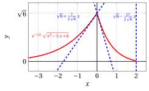
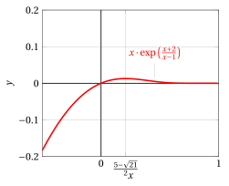

# Curve sketching

**Part 4 · Derivatives · Chapter 9** · lecture notes by Fabio Furini · [:material-file-pdf-box: Lecture notes, volume (PDF)](../pdf/lecture-notes-4-derivatives.pdf) · [:material-presentation: Slides (PDF)](../pdf/slides-derivatives-09-curve-sketching.pdf)

## 1. Graphs of real functions of a real variable

- The infinitesimal and differential calculus developed so far allows us to tackle completely the problem of drawing the graph of a function $f$, that is, to carry out <strong>curve sketching</strong> (function analysis).

!!! chiave ""

    <strong>The steps of curve sketching</strong>:

    1. Determine the (maximal) <strong>domain</strong> of $f$.

    2. Compute the <strong>limits at the boundary</strong> of the domain. Determine any <strong>horizontal/vertical asymptotes</strong> and <strong>points of discontinuity</strong>. Study the <strong>sign of the function</strong> and the <strong>points where it vanishes</strong> (possible only for relatively simple functions).

    3. If the function tends to $\infty$ as $x \rr  \infty$, determine any <strong>oblique asymptotes</strong>.

    4. Compute the <strong>derivative function </strong>$f'$ at the points where it exists. Study the points where $f$ is continuous but not differentiable and determine their nature (<strong>corner points</strong>, <strong>inflection points with vertical tangent</strong> or <strong>cusps</strong>). At corner points or at the endpoints of the domain it is useful to compute the <strong>right or left derivatives</strong>, which determine the <strong>slope of the graph at those points</strong>.

    5. Study the sign of $f'$ (on its domain) to obtain information on the <strong>monotonicity</strong> of $f$ and on its <strong>relative maximum and minimum points</strong>. Then determine the<strong> absolute maximum and minimum points</strong>.

!!! chiave ""

    <strong>Additional information</strong>:

    1. It can be useful to determine an <strong>asymptotic estimate at infinity</strong> that tells us whether the function tends to $\infty$ in a <em>superlinear</em> or <em>sublinear</em> way or in a <em>linear</em> way (in which case it may have an oblique asymptote). The asymptotic estimate at infinity normally also gives information on the <strong>concavity</strong> of $f$ at infinity.

    2. Compute the <strong>second derivative function</strong> $f''$ and study its sign, to deduce information on the <strong>concavity</strong> and the <strong>inflection points</strong> of $f$.

    3. Determine any symmetry of $f$ (<strong>even or odd functions</strong>) and restrict the study to $x \ge 0$.

    4. Determine any periodicity of $f$ (<strong>periodic functions</strong>) and restrict the study to one period.

## 2. Examples

!!! esempio "Example 1: Function analysis and graph"

    Let us study the function and draw its graph:

    $$
    f(x) = e^{-|x|} \; \sqrt{x^2-5\;x+6}
    $$

    We expect a corner point at $x=0$ due to the presence of $|x|$, and points with vertical tangent where the radicand vanishes. 

    <strong>Step 1</strong>. The (maximal) domain of $f$ is:

    $$
    x^2-5\;x+6 \ge 0,~~(x-3)(x-2)\ge 0 {\rm ~~~that~is~~~} x \in (\im,2] \cup [3, \ip)
    $$

    <strong>Step 2</strong>. The limits at the boundary are:

    \begin{align*}
    \lim_{x \rr \ip} e^{-|x|} \; \sqrt{x^2-5\;x+6} &=  \lim_{x \rr \ip} \frac{\sqrt{x^2-5\;x+6}}{e^x} = 0^+\\[2ex]
     \lim_{x \rr \im} e^{-|x|} \; \sqrt{x^2-5\;x+6} &
      = \lim_{x \rr \im}   \sqrt{e^{2\:x} \big(\:x^2-5\;x+6 \big)} = \lim_{y \rr \ip}   \sqrt{\frac{y^2+5\;y+6}{e^{2\:y}}}  =0^+\\[2ex]
    \lim_{x \rr 3^+} e^{-|x|} \; \sqrt{x^2-5\;x+6} &= \lim_{x \rr 3^+} e^{-x} \; \sqrt{(x-3)(x-2)} =   0^+\\[2ex]
    \lim_{x \rr 2^-}  e^{-|x|} \; \sqrt{x^2-5\;x+6} &= \lim_{x \rr 2^-}  e^{-x} \; \sqrt{(x-3)(x-2)}=   0^+
    \end{align*}

    Hence the line $y=0$ is a horizontal asymptote as $x \rr \pm \infty$ and there are no vertical asymptotes. In the domain there are no points of discontinuity. We have $f(x) \ge 0$ for every $x$ in the domain and $f(x)=0$ for $x=2$ and $x=3$. 

    <strong>Step 3</strong>. The function has no oblique asymptotes. 

    <strong>Step 4</strong>. We compute the derivative function for $x \neq 0$:

    \begin{align*}
    f'(x) &= e^{-|x|} \left(-\sgn(x) \; \sqrt{x^2-5\;x+6} + \frac{2\;x -5}{2\; \sqrt{x^2-5\;x+6}}\right)\\[2ex]
    &= \frac{e^{-|x|}}{2\; \sqrt{(x-3)(x-2)}} \bigg( -2\; \sgn(x) \; (x^2-5\;x+6) + 2\;x-5\bigg)
    \end{align*}

    Or, equivalently:

    $$
    f'(x) =
    \begin{cases}
    \displaystyle e^{-x} \cdot \frac{  -2\;x^2+12\;x-17 }{2\; \sqrt{(x-3)(x-2)}} ~~ & {\rm ~~~if~~} x >0\\[3ex]
    \displaystyle e^{x} \cdot \frac{ 2\;x^2-8\;x+7 }{2\; \sqrt{(x-3)(x-2)}} ~~& {\rm ~~~if~~} x <0
    \end{cases}
    $$

!!! esempio "Example 2: Function analysis and graph"

    We compute the right and left derivatives at $x=0$:

    $$
    f'_+(0)= \lim_{x \rr 0^+} \frac{e^{-x}\; ~~\big( -2\;x^2+12\;x-17 \big)}{2\; \sqrt{(x-3)(x-2)}}  =   -\frac{17}{2\; \sqrt{6}}
    $$

    $$
    f'_-(0)=  \lim_{x \rr 0^-} \frac{e^{x}\; ~~\big( 2\;x^2-8\;x+7 \big)}{2\; \sqrt{(x-3)(x-2)}}  =   \frac{7}{2\; \sqrt{6}}
    $$

    hence $x=0$ is a corner point, that is, $f'(0)$ does not exist. We compute the right-hand limit at $x=3$ and the left-hand limit at $x=2$ of the derivative function:

    $$
    f'_+(3)= \lim_{x \rr 3^+} \frac{e^{-x} \; ~~\overbrace{\big( -2\;x^2+12\;x-17 \big)}^{\rr 1}}{2\; \sqrt{(x-3)(x-2)}}  =   \ip
    $$

    $$
    f'_-(2)= \lim_{x \rr 2^-} \frac{e^{-x}\; ~~\overbrace{\big( -2\;x^2+12\;x-17 \big)}^{\rr -1}}{2\; \sqrt{(x-3)(x-2)}}  =   \im
    $$

    Hence the function has points with vertical tangent at $x=2$ and $x=3$.

    <strong>Step 5</strong>. We study the sign of the derivative function:

    - For $x>0$ we have:

        $$
        f'(x) \ge 0 {\rm ~~~~if~~~~} 2\;x^2-12\;x+17 \le 0, {\rm ~~~~that~is~~~~} x \in \left[\underbrace{\frac{6-\sqrt{2}}{2}}_{\approx 2.3}, \underbrace{\frac{6+\sqrt{2}}{2}}_{\approx 3.7} \right]
        $$

        hence:

        $$
        f {\rm ~~is~decreasing~for~~} x \in [0,2] \cup \left[\frac{6+\sqrt{2}}{2},\ip \right],
        ~~~~~ f {\rm ~~is~increasing~for~~} x \in \left[3,\frac{6+\sqrt{2}}{2} \right]
        $$

        We have $f'\left(\frac{6+\sqrt{2}}{2}\right) =0$, hence $x=\frac{6+\sqrt{2}}{2}$ is a relative maximum point. The relative maximum is  $f\left(\frac{6+\sqrt{2}}{2}\right) \approx 0.027$

    - For $x<0$ we have:

        $$
        f'(x) \ge 0 {\rm ~~~~if~~~~} 2\;x^2-8\;x+7 \ge 0, {\rm ~~~~that~is,~if~~~} x \in \left[\im,\frac{4-\sqrt{2}}{2}\right] \cup \left[\frac{4+\sqrt{2}}{2},\ip\right]
        $$

        hence $f(x)$ is increasing for $x<0$.

    We can deduce that $x = 0$ (where $f$ is not differentiable) is an absolute maximum point; the absolute maximum is $\sqrt{6} \approx 2.44$.

    There are also two inflection points, one in $(0, 2)$ and one in $( 3, \ip)$, which can be obtained by studying the sign of the second derivative.

!!! esempio "Example 3: Function analysis and graph"

    { .fig .ovale loading=lazy style="width:88%" }

    { .fig .ovale loading=lazy style="width:88%" }

!!! esempio "Example 4: Function analysis and graph"

    Let us study the function and draw its graph:

    $$
    f(x) = x \cdot \exp \left(\frac{x+2}{x-1}\right)
    $$

    <strong>Step 1</strong>. The (maximal) domain of $f$ is:

    $$
    x \in \R \setminus \{1\}
    $$

    <strong>Step 2</strong>. The limits at the boundary are:

    $$
    \lim_{x \rr \ip} x \cdot \exp \left(\frac{x+2}{x-1}\right) =  \ip
    $$

    $$
    \lim_{x \rr \im} x \cdot \exp \left(\frac{x+2}{x-1}\right) =  \im
    $$

    $$
    \frac{x+2}{x-1} \rr \ip {\rm ~~as~~}  x \rr 1^+,~~~~{\rm hence~~} \lim_{x \rr 1^+} x \; \exp \left(\frac{x+2}{x-1}\right) =  \ip
    $$

    $$
    \frac{x+2}{x-1} \rr \im {\rm ~~as~~}  x \rr 1^-,~~~~{\rm hence~~} \lim_{x \rr 1^-} x \; \exp \left(\frac{x+2}{x-1}\right) =  0
    $$

    Hence there are no horizontal asymptotes and $x=1$ is a point of discontinuity. Moreover, $x=1$ is a vertical asymptote as $x \rr 1^+$. We have $f(x) \ge 0$ for $x \ge 0$ and $f(x)=0$ for $x=0$. 

    <strong>Step 3</strong>. We compute an asymptotic estimate; we have:

    $$
    \frac{x+2}{x-1} \rr 1 {\rm ~~as~~}  x \rr \ip,\qquad  \frac{x+2}{x-1} \rr 1 {\rm ~~as~~}  x \rr \im
    $$

    hence

    $$
    x \cdot \exp \left(\frac{x+2}{x-1}\right) \sim x \cdot e {\rm ~~~~as~~~~} x \rr \pm \infty {\rm ~~therefore~~} f {\rm ~~has~linear~growth}
    $$

    We therefore check for the presence of oblique asymptotes. We try to compute the following limit:

    $$
    \lim_{x \rr \pm \infty} \bigg( x \cdot \exp \left(\frac{x+2}{x-1}\right) - x \; e \bigg) = \lim_{x \rr \pm \infty} x \cdot e \cdot \bigg(   \exp \left(\frac{x+2}{x-1}-1\right) - 1 \bigg)
    $$

    We have

    $$
    \frac{x+2}{x-1}-1 = \frac{3}{x-1} \rr 0 {\rm ~~as~~} x \rr \pm \infty
    $$

    therefore

    $$
    \exp \left(\frac{x+2}{x-1}-1\right) - 1 \sim \frac{3}{x-1} {\rm ~~as~~} x \rr \pm \infty; ~~~~  x \cdot e \cdot \bigg(  \exp \left(\frac{x+2}{x-1}-1\right) - 1 \bigg) \sim \frac{3\cdot x \cdot e}{x-1}  {\rm ~~as~~} x \rr \pm \infty
    $$

    consequently:

    $$
    \lim_{x \rr \pm \infty} \bigg( x \cdot \exp \left(\frac{x+2}{x-1}\right) - x \cdot e \bigg) = \lim_{x \rr \pm \infty} \frac{3\cdot x \cdot e}{x-1} = 3\cdot e
    $$

    Hence the function has the oblique asymptote $y = e\;x +3\;e~$ as $x \rr \pm \infty$.

!!! esempio "Example 5: Function analysis and graph"

    <strong>Step 4</strong>. We compute the derivative function for $x \neq 1$:

    \begin{align*}
    f'(x) &= \exp \left(\frac{x+2}{x-1}\right) \cdot \left( 1 + x \cdot  \frac{(x-1)-(x+2)}{(x-1)^2} \right) = \exp \left(\frac{x+2}{x-1}\right) \cdot \frac{ (x-1)^2- 3\;x  }{(x-1)^2}  \\[2ex]
     &= \exp \left(\frac{x+2}{x-1}\right) \cdot \frac{ x^2 - 5\;x +1 }{(x-1)^2}
    \end{align*}

    For every $x\neq 1$, $f'$ is defined. We compute the left-hand limit at $x=1$:

    $$
    f'_-(1)=\lim_{x \rr 1^-} \exp \left(\frac{x+2}{x-1}\right) \cdot \frac{ x^2 - 5\;x +1 }{(x-1)^2} = 0
    $$

    the exponential goes to zero faster than $(x - 1)^2$; hence the graph reaches $x = 1$ with a horizontal tangent, from the left.

    <strong>Step 5</strong>. We study the sign of the derivative function:

    $$
    f'(x) \ge 0 {\rm ~~~~for~~~~} x^2 - 5\;x +1 \ge 0 {\rm ~~~~that~is~~~~} x \in \left[\im,\frac{5-\sqrt{21}}{2}\right]  \cup \left[\frac{5+\sqrt{21}}{2},\ip\right]
    $$

    hence $x=\frac{5+\sqrt{21}}{2}$ is a relative minimum point and $x=\frac{5-\sqrt{21}}{2}$ is a relative maximum point.

    { .fig .ovale loading=lazy style="width:70%" }

    There is an inflection point in $\left(\frac{5-\sqrt{21}}{2}, 1\right)$, which can be obtained by studying the sign of the second derivative.

!!! esempio "Example 6: Function analysis and graph"

    { .fig .ovale loading=lazy style="width:82%" }

    We have $f'_-(1)=0$ since:

    $$
    f'_-(1)=\lim_{x \rr 1^-} \exp \left(\frac{x+2}{x-1}\right) \cdot \frac{ x^2 - 5\;x +1 }{(x-1)^2} = \lim_{x \rr 1^-} \frac{\exp \left(\frac{x+2}{x-1}\right)}{(x-1)^2} \cdot \underbrace{(x^2 - 5\;x +1)}_{\rr -3 {\rm ~~as~~} x \rr 1^-}
    $$

    with the change of variable $y=\frac{x+2}{x-1}$: if $x \rr 1^-$ then $y \rr \im$; moreover:

    $$
    y=\frac{x+2}{x-1},~~~~ y=\frac{x-1+3}{x-1},~~~~ y=1+\frac{3}{x-1} {\rm ~~and~~} x=1+\frac{3}{y-1}
    $$

    hence we have:

    $$
    \lim_{x \rr 1^-} \frac{\exp \left(\frac{x+2}{x-1}\right)}{(x-1)^2} = \lim_{y \rr \im} \frac{e^y}{\left(\frac{3}{y-1}\right)^2} =  \frac{1}{9} \; \lim_{y \rr \im}   e^y \cdot \underbrace{(y-1)^2}_{\sim y^2 {\rm ~~as~~} y \rr \im}
    $$

    with a second change of variable $z=-y$: if $y \rr \im$ then $z \rr \ip$ and we have

    $$
    \frac{1}{9} \; \lim_{y \rr \im}  e^y \cdot y^2 = \frac{1}{9} \; \lim_{z \rr \ip}  e^{-z} \cdot (-z)^2= \frac{1}{9} \; \lim_{z \rr \ip}  \frac{z^2}{e^{z}} = 0
    $$

    by the theorem on the hierarchy of infinities.
