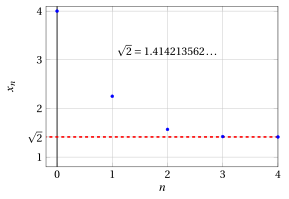
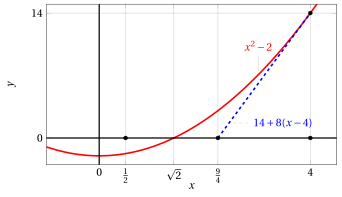

# Newton's method

**Part 4 · Derivatives · Chapter 10** · lecture notes by Fabio Furini · [:material-file-pdf-box: Lecture notes, volume (PDF)](../pdf/lecture-notes-4-derivatives.pdf)

## 1. Newton's method

- Suppose we want to solve the equation

    $$
    f(x) = 0
    $$

    which is equivalent to looking for the intersections of the graph of $f$ with the $x$-axis, or the zeros of the function. Suppose moreover: i) that the solution $x = c$ exists, is unique and lies inside the interval $[a, b]$; ii) that the function is differentiable in $[a,b]$; iii) that $f'(x)\le 0$ (decreasing function) and $f''(x)\ge 0$ (convex function) for every $x \in [a,b]$.

- Let us then start from $x_0 = a$ and linearize the equation $f(x) = 0$ by replacing $f$ with the tangent line to its graph at the point $\big(x_0, f(x_0)\big)$. This line has equation:

    $$
    y = f(x_0) + f'(x_0) (x - x_0)
    $$

    Instead of solving $f(x) = 0$, we solve:

    $$
    f(x_0) + f'(x_0) (x - x_0) =0
    $$

    calling the solution $x_1$ we obtain:

    $$
    x_1 = x_0 - \frac{f(x_0)}{f'(x_0)}, {\rm ~~~~the~first~approximation~of~~} c
    $$

    { .fig .ovale loading=lazy style="width:85%" }

- Let us now start from $x_1$ and linearize as before with the tangent line at the new point $\big(x_1, f(x_1)\big)$. This line has equation:

    $$
    y = f(x_1) + f'(x_1) (x - x_1)
    $$

    As before, we solve:

    $$
    f(x_1) + f'(x_1) (x - x_1) =0
    $$

    obtaining

    $$
    x_2 = x_1 - \frac{f(x_1)}{f'(x_1)}, {\rm ~~~~the~second~approximation~of~~} c
    $$

    !!! chiave ""

        Proceeding with $x_2$ as with $x_1$ and continuing, we obtain the following recursively defined sequence:

        $$
        x_0 =a, \qquad  x_{n+1} = x_n  - \frac{f(x_n)}{f'(x_n)}  {\rm ~~with~~} n \in \N
        $$

        In this way, the term $x_n$ can be constructed starting from $x_0$ with $n$ iterations of the same algorithm. The method is therefore very well suited to automatic computation.

- The main idea of this method, called <strong>Newton's method</strong>, is therefore to construct a sequence that, <strong>under certain hypotheses</strong>, converges to $c$.

!!! teorema "Theorem 1: Newton's method"

    Let $f:[a,b]\rr \R$ be twice differentiable in $[a,b]$. If the following three hypotheses hold:

    1. $f(a) \cdot f(b) < 0$

    2. $f'(x)$ and $f''(x)$ have constant sign in $[a,b]$

    3. $f(a) \cdot f''(a) > 0$

    then there exists one and only one point $c \in (a, b)$ such that $f(c)=0$, and the sequence

    $$
    x_0 =a, \qquad  x_{n+1} = x_n  - \frac{f(x_n)}{f'(x_n)}
    $$

    converges to $c$ from below. If, instead of hypothesis 3, the following hypothesis holds

    1. $f(b) \cdot f''(b) > 0$

    then the sequence

    $$
    x_0 =b, \qquad  x_{n+1} = x_n  - \frac{f(x_n)}{f'(x_n)}
    $$

    converges to $c$ from above.

- Note that, under hypotheses 1. and 2., either 3. or 3'. is certainly satisfied. The function $f''$ has the same sign at $a$ and $b$ by 2., and the function $f$ has opposite signs at $a$ and $b$ by 1. Therefore either 3. or 3'. holds.

- This means that the method is applicable whenever hypotheses 1. and 2. are satisfied: we only need to choose appropriately whether to set $x_0= a$ or $x_0= b$.

- Condition 2, apparently restrictive, will in general be satisfied provided we choose an interval $[a, b]$ small enough.

??? dimostrazione "Proof"

    Since $f$ is continuous, being differentiable in $[a , b]$, and 1 holds, by the intermediate zero theorem there exists at least one $c \in  (a, b)$ such that $f(c) =0$.

    Moreover, since $f'(x)$ has constant sign in $(a, b)$, $f$ is strictly monotone, hence this point $c$ is unique (a strictly monotone function cannot vanish at two distinct points).

    This proves the existence and uniqueness of the point $c$ at which $f$ vanishes. We will now prove that the sequence is monotone. From this it will follow that the sequence is convergent, by the theorem on monotone sequences.

    We start by showing that if the sequence $x_n$ converges, then $x_n \rr c$. If $x_n \rr \ell \in [a,b]$, passing to the limit in the equality

    $$
    x_{n+1} = x_n  - \frac{f(x_n)}{f'(x_n)}  {\rm ~~~~we~get~~~~~} \ell = \ell - \frac{f(\ell)}{f'(\ell)}
    $$

    (we used the fact that $f$ is continuous, and $f'$ is also continuous, since $f'$ is differentiable, because $f''$ exists by hypothesis). From the last equality it follows that $f(\ell) =0$, so that $\ell =c$ (the only point where the function vanishes).

    Let us therefore prove that $x_n$ is monotone, under hypotheses 1, 2, 3. Without loss of generality, we assume $f(a) < 0$ and, by 1, consequently $f (b) > 0$. Since, by 2, $f' (x)$ has constant sign in $[a, b]$, we must have $f' (x) > 0$ on all of $[a, b]$ (if the other inequality held, $f$ would be decreasing, and we could not have $f (a) < 0 < f (b)$). Since $f (a) <0$ and 3 holds, $f'' (a) < 0$; hence, since by 2 $f'' (x)$ has constant sign, $f'' (x) < 0$ on all of $[a, b]$. 

    <strong>We are therefore proving the case of an increasing and concave function</strong>. The other cases are proved analogously. □

??? dimostrazione "Proof"

    Consider the function:

    $$
    g(x) = x -  \frac{f(x)}{f'(x)}, {\rm ~~we~have~~} x_{n+1}= g(x_n) {\rm ~~and~~} g(c)=c {\rm ~since~} f(c)=0
    $$

    We have:

    $$
    g'(x)=1- \frac{f'(x)^2 - f(x)f''(x)}{f'(x)^2} = \frac{f(x)f''(x)}{f'(x)^2} >0 \Longleftrightarrow f(x) <0
    $$

    because $f''(x) < 0$ on all of $[a, b]$. Hence $g'(x) > 0$ for $x \in  [a, c]$, i.e., on $[a, c]$ the function $g$ is strictly increasing.

    Keeping these facts in mind, we now prove that:

    \begin{equation}
    \label{BBB} x_n < x_{n+1} < c,~~~ \forall n \in \N
    \end{equation}

    For $n = 0$ we have

    $$
    x_1 = a - \frac{f(a)}{f'(a)} > a
    $$

    because $f(a)<0$ and $f'(a)>0$, hence $x_1 > x_0$. Moreover $a < c$ (and $x_0=a$), and since $g$ is increasing, this implies:

    $$
    g(a) < g(c) {\rm ~~~that~is~~~} x_1 < c
    $$

    Hence we have proved that

    $$
    x_0 < x_1 < c
    $$

    Applying now $g$ to the previous inequalities ($g$ is strictly increasing on $[a, c]$, and the three points lie in this interval, hence $g$ preserves the inequalities), we have

    $$
    g(x_0) < g(x_1) < g(c) {\rm ~~~that~is~~~} x_1 < x_2 < c
    $$

    Applying $g$ again, we find $x_2 < x_3 < c$, and so on. Therefore \(\eqref{BBB}\) is true, and in particular $x_n$ is monotone. This concludes the proof. □

!!! esempio "Example 1: Newton's method"

    Consider the function:

    $$
    f(x) = x^2 - 2, ~~~f'(x) = 2\; x, ~~~f''(x) = 2
    $$

    { .fig .ovale loading=lazy style="width:72%" }

    We have:

    $$
    f\left( \frac{1}{2}\right) =-\frac{7}{4} <0 {\rm ~~~and~~~} f(4)=14 >0
    $$

    { .fig .ovale loading=lazy style="width:72%" }

    Consider the interval $\left[\frac{1}{2},4\right]$; we have:

    $$
    f'(x) > 0 {\rm ~~~and~~~} f''(x) > 0, ~~ \forall x \in \left[\frac{1}{2},4\right]
    $$

!!! esempio "Example 2: Newton's method"

    Hence on the interval $\left[\frac{1}{2},4\right]$ the function $f(x) = x^2 - 2$ satisfies the hypotheses of the theorem.

    We are in the case of a function that is strictly increasing on $\left[\frac{1}{2},4\right]$, since $f'(x)>0,  \forall x \in \left[\frac{1}{2},4\right]$, and convex on $\left[\frac{1}{2},4\right]$, since $f''(x)>0,  \forall x \in \left[\frac{1}{2},4\right]$. The endpoints of the chosen interval are $a=\frac{1}{2}$ and $b=4$.

    Hypothesis 3' holds, that is, $f(4) \cdot f''(4) >0$, and the sequence becomes:

    $$
    x_0 =4, \qquad  x_{n+1} = x_n  - \frac{x_n^2-2}{2\;x_n} = \frac{1}{2} \left( x_n + \frac{2}{x_n} \right)       {\rm ~~with~~} n \in \N
    $$

    Computing the first values of the sequence we have:

    $$
    x_0=4,~~~x_1=\frac{9}{4}=2.25,~~~x_2=\frac{113}{72}=1.569444444\dots
    $$

    $$
    x_3=\frac{23,137}{16,272}=1.421890363\dots,~~~x_4=\frac{1,064,876,737}{752,970,528}=1.414234285\dots
    $$

    { .fig .ovale loading=lazy style="width:85%" }

!!! esempio "Example 3: Newton's method"

    At the first iteration the tangent line is:

    $$
    y = 14 + 8 \; (x-4) {\rm ~~and~~} x_1 = \frac{9}{4}
    $$

    { .fig .ovale loading=lazy style="width:72%" }

    At the second iteration the tangent line is:

    $$
    y = \frac{49}{16} + \frac{18}{4} \; \left(x-\frac{9}{4}\right) {\rm ~~and~~} x_2 = \frac{113}{72}
    $$

    { .fig .ovale loading=lazy style="width:72%" }

- Newton's method can be used, for example, to compute the $k$-th root of a number $c \in \R_+$, by looking for the zeros of the following function:

    $$
    f(x)= x^k - c {\rm ~~~that~is~~~} x= \sqrt[k]{c}
    $$

    Given a value $b \ge \sqrt[k]{c}$, we have the recursively defined sequence:

    $$
    x_0 =b, \qquad  x_{n+1} = x_n  - \frac{x_n^k - c}{k \: x_n^{k-1}}  {\rm ~~with~~} n \in \N
    $$

    expanding we obtain

    $$
    x_n  - \frac{x_n^k - c}{k \: x_n^{k-1}}  =  \frac{k \: x_n^k - x_n^k +c}{k \: x_n^{k-1} } = \frac{1}{k} \left((k-1) x_n + \frac{c}{x_n^{k-1}}  \right)
    $$

    and hence the sequence becomes:

    $$
    x_0 =b, \qquad  x_{n+1} = \frac{1}{k} \left((k-1) x_n + \frac{c}{x_n^{k-1}}  \right)  {\rm ~~with~~} n \in \N
    $$

    With $k=2$ we obtain the sequence of Heron's algorithm:

    $$
    x_0 =b, \qquad  x_{n+1} = \frac{1}{2} \left( x_n + \frac{c}{x_n}  \right)  {\rm ~~with~~} n \in \N
    $$

<strong>Try it</strong> — the interactive graph below shows what you have just read: move the sliders.

## 2. Error estimates for Newton's method

- The <strong>absolute error</strong> of Newton's method is:

    $$
    \varepsilon_n = |x_n - c|
    $$

    where $c \in (a,b)$ is the zero of the function, that is, $f(c)=0$.

!!! chiave ""

    The value of $c$ is unknown, hence we need a way to analyze the values of the absolute errors that is independent of $c$. We also want to understand how “fast” the error decreases by comparing the errors of two consecutive iterations, that is, we want to determine the <strong>“rate of convergence”</strong> of the algorithm.

- Using the theorem on the Taylor formula with Lagrange remainder we can write:

    $$
    f(x) = f(x_n) + f'(x_n)\: (x-x_n) + \frac{1}{2} \; f''(\mu)\: (x-x_n)^2
    $$

    for some $\mu$ between $x_n$ and $x$. In particular, choosing $x= c$ we have:

    \begin{equation}
    \label{AA}
    0 = f(c) = f(x_n) + f'(x_n)\: (c-x_n) + \frac{1}{2} \; f''(\mu)\: (c-x_n)^2
    \end{equation}

    Recalling that $x_{n+1}$ was obtained as the solution of the equation:

    $$
    f(x_n) + f'(x_n) (x - x_n) =0
    $$

    we have

    \begin{equation}
    \label{BB}
    0= f(x_n) + f'(x_n) (x_{n+1} - x_n)
    \end{equation}

    Subtracting \(\eqref{BB}\) from \(\eqref{AA}\), we obtain:

    $$
    0 = f'(x_n) (c - x_{n+1}) + \frac{1}{2} \; f''(\mu)\: (c-x_n)^2
    $$

    which in turn implies:

    \begin{equation}
    \label{XX} 
    x_{n+1} - c = \frac{1}{2} \; \frac{f''(\mu)}{f'(x_n)} \; (x_n - c)^2 {\rm ~~~~~~hence~~~~~~} |x_{n+1} - c| = \frac{1}{2} \; \frac{|f''(\mu)|}{|f'(x_n)|} \; |x_n - c|^2
    \end{equation}

    Now, if $x_n$ is close to $c$ (that is, $x_n \approx c$), then $\mu$, which lies between $x_n$ and $c$, is also close to $c$; hence in these cases:

    $$
    f''(\mu) \approx f''(c) {\rm ~~~~and~~~~} f'(x_n) \approx f'(c)
    $$

    then, substituting, we obtain:

    \begin{equation}
    \label{YY}
     |x_{n+1} - c| \approx \frac{1}{2} \; \frac{|f''(c)|}{|f'(c)|} \; |x_n - c|^2 {\rm ~~~~~hence~~~~~} \varepsilon_{n+1} \approx \frac{1}{2} \; \frac{|f''(c)|}{|f'(c)|} \;\varepsilon^2_{n}
    \end{equation}

    !!! chiave ""

        The absolute error of Newton's method at each step is proportional to the square of the absolute error at the previous step. <strong> The rate of convergence is quadratic</strong>.

- However, the error is also proportional to the constant:

    $$
    \frac{|f''(c)|}{2\;|f'(c)|}
    $$

    hence, if $|f'(c)|$ is very small, or zero, or $|f''(c)|$ is very large, the convergence may be very slow or may even fail to occur.

- Let us go back to equation \(\eqref{XX}\), and determine $L,M>0$ such that:

    $$
    |f'(x_n)| \ge L {\rm ~~~~and~~~~} |f''(\mu)| \le M
    $$

    then we can write:

    $$
    |x_{n+1} - c| \le \frac{1}{2} \; \frac{M}{L} \; |x_n - c|^2 {\rm ~~~hence~~~} \varepsilon_{n+1} \le  \frac{1}{2} \; \frac{M}{L} \; \varepsilon^2_n
    $$

!!! chiave ""

    We have obtained the relation between $\varepsilon_{n+1}$ and $\varepsilon_{n}$, which is independent of both $x_n$ and $c$ (but depends on $M$ and $L$).

!!! esempio "Example 4: Error estimates for Newton's method ($\sqrt{2}=1.414213562\dots$)"

    Let us go back to the previous example:

    $$
    f(x) = x^2-2,~~f'(x)=2\;x {\rm ~~~and~~~}f''(x)=2
    $$

    Hence we can choose $M=2$ and, since $x_n \ge 1, \forall n \in \N$, we can choose $L=2$ (in this case $\frac{M}{L}=\frac{2}{2}=1$).

    We know that $\sqrt{2}>1$, hence with $n=2$ we have $\varepsilon_{2} \le \left|\frac{113}{72}-1\right| \approx 0.56944$, and we have:

    
<table>
    <tr>
    <td>iter.</td>
    <td>\(x_n\)</td>
    <td>estimate of \(\sqrt{2}\)</td>
    <td>\(\varepsilon_n\)</td>
    </tr>
    <tr>
    <td>\(n=3\)</td>
    <td>\(\frac{23,137}{16,272}\)</td>
    <td>1.421890363…</td>
    <td>\(\le \frac{1}{2}\; \varepsilon^2_{2} \approx\)</td>
    <td>0.16213…</td>
    </tr>
    <tr>
    <td>\(n=4\)</td>
    <td>\(\frac{1,064,876,737}{752,970,528}\)</td>
    <td>1.414234285…</td>
    <td>\(\le \frac{1}{2}\; \varepsilon^2_{3} \approx\)</td>
    <td>0.01314…</td>
    </tr>
    </table>

