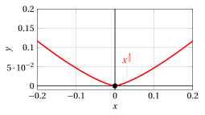
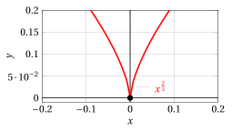
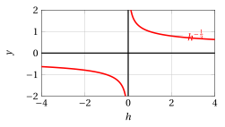
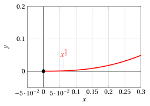
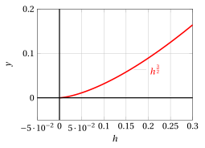
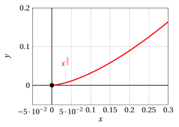
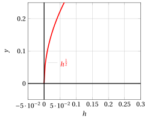

# Cusps, inflection points and tangents

**Exercises · Derivatives** · with worked solutions · [:material-file-pdf-box: Lecture notes, volume (PDF)](../pdf/lecture-notes-4-derivatives.pdf)

!!! esercizio "Exercise 1"

    Using the definition of derivative, determine the behavior at the origin of the following function:

    $$
    f(x)=x^{\frac{4}{3}}
    $$

??? soluzione "Solution"

    Let

    $$
    f(x) = x^{\frac{4}{3}}
    $$

    then for $x_0=0$

    $$
    \frac{f(h) - f(0)}{h} =  \frac{ h^{4/3}}{h} = h^{1/3}
    $$

    and the limits are:

    $$
    \lim_{h \rr 0^-} {h^{1/3}} = 0 {\rm ~~~and~~~}\lim_{h \rr 0^+} {h^{1/3}} = 0 {\rm ~~~~hence~~~~} \lim_{h \rr 0} {h^{1/3}} = 0 {\rm ~~~and~~~}f'(0)= 0.
    $$

    { .fig .ovale loading=lazy style="width:55%" }

    The function has a <strong>point with horizontal tangent</strong> at $x_0=0$. The function:

    $$
    f(h) = h^{\frac{1}{3}}
    $$

    is a power with positive rational exponent $\frac{m}{n}$ with $n$ odd (hence defined on all of $\R$) and $m$ odd (hence an odd function). Its graph is:

    { .fig .ovale loading=lazy style="width:55%" }

!!! esercizio "Exercise 2"

    Using the definition of derivative, determine the behavior at the origin of the following function:

    $$
    f(x)=x^{\frac{2}{3}}
    $$

??? soluzione "Solution"

    Let

    $$
    f(x) = x^{\frac{2}{3}}
    $$

    then for $x_0=0$

    $$
    \frac{f(h) - f(0)}{h} =  \frac{ h^{2/3}}{h} = \frac{ 1}{h^{1/3}}
    $$

    and the limits are:

    $$
    \lim_{h \rr 0^-} \frac{ 1}{h^{1/3}} = \im {\rm ~~and~~}\lim_{h \rr 0^+} \frac{ 1}{h^{1/3}} = \ip {\rm ~~~~~hence~~~~~} f'_-(0)= \im {\rm ~~and~~}f'_+(0)= \ip
    $$

    { .fig .ovale loading=lazy style="width:55%" }

    The function has <strong>a cusp</strong> at $x_0=0$. The function:

    $$
    f(h) = h^{-\frac{1}{3}} = \frac{1}{h^{{1}/{3}}}
    $$

    is a power with negative rational exponent $\frac{m}{n}$ with $n$ odd (hence defined on all of $\R$) and $m$ odd (hence an odd function). Its graph is:

    { .fig .ovale loading=lazy style="width:55%" }

!!! esercizio "Exercise 3"

    Using the definition of derivative, determine the behavior at the origin of the following function:

    $$
    f(x)=x^{\frac{5}{2}}
    $$

??? soluzione "Solution"

    Let

    $$
    f(x) = x^{\frac{5}{2}}
    $$

    then for $x_0=0$

    $$
    \frac{f(h) - f(0)}{h} =  \frac{ h^{5/2}}{h} = h^{3/2}
    $$

    and the limits are:

    $$
    \lim_{h \rr 0^+} {h^{3/2}} = 0.
    $$

    { .fig .ovale loading=lazy style="width:48%" }

    The function has a <strong>point with horizontal tangent</strong> at $x_0=0$. The function:

    $$
    f(h) = h^{\frac{3}{2}}
    $$

    is a power with positive rational exponent $\frac{m}{n}$ with $n$ even (hence defined only on $\R_+$). Its graph is:

    { .fig .ovale loading=lazy style="width:48%" }

!!! esercizio "Exercise 4"

    Using the definition of derivative, determine the behavior at the origin of the following function:

    $$
    f(x)=x^{\frac{3}{2}}
    $$

??? soluzione "Solution"

    Let

    $$
    f(x) = x^{\frac{3}{2}}
    $$

    then for $x_0=0$

    $$
    \frac{f(h) - f(0)}{h} =  \frac{ h^{3/2}}{h} = h^{1/2}
    $$

    and the limits are:

    $$
    \lim_{h \rr 0^+} {h^{1/2}} = 0.
    $$

    { .fig .ovale loading=lazy style="width:45%" }

    The function has a <strong>point with horizontal tangent</strong> at $x_0=0$. The function:

    $$
    f(h) = h^{\frac{1}{2}}
    $$

    is a power with positive rational exponent $\frac{m}{n}$ with $n$ even (hence defined only on $\R_+$). Its graph is:

    { .fig .ovale loading=lazy style="width:45%" }
