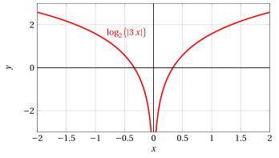
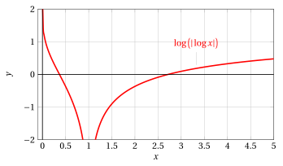
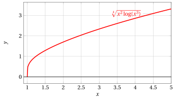
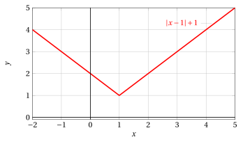

# Computing derivative functions

**Exercises · Derivatives** · with worked solutions · [:material-file-pdf-box: Lecture notes, volume (PDF)](../pdf/lecture-notes-4-derivatives.pdf)

!!! esercizio "Exercise 1"

    Let $f:\R\rightarrow\R$, $f(x)=x^{3}$.

    1. Write the difference quotient of $f$ at the point $x=1$.

    2. Compute $f'(1)$ as the limit of the difference quotient.

    3. Write the equation of the tangent line to the graph of $f$ at the point $(1,1)$.

??? soluzione "Solution"

    1.

        $$
        \frac{f(1+h)-f(1)}{h}=\frac{(1+h)^{3}-1}{h}=\frac{3h+3h^{2}+h^{3}}{h}=3+3h+h^{2}
        $$

    2.

        $$
        f'(1)=\lim_{h\to0}3+3h+h^{2}=3
        $$

    3. The tangent line has equation $y = f(1) + f'(1)(x-1)$, hence

        $$
        y=1 + 3(x-1)
        $$

        from which

        $$
        y=3x-2
        $$

!!! esercizio "Exercise 2"

    Compute the derivative of the following function $f$, specifying the domain of $f$ and of $f'$:

    $$
    f(x)=x^{2}\sin\left(x^{3}\right)
    $$

??? soluzione "Solution"

    The functions $f$ and $f'$ are defined on all of ${\R}$. 

    Using the rules for the derivative of a product and of composite functions, we have

    $$
    f'(x)=2x\cdot\sin\left(x^{3}\right)+x^{2}\cdot\cos\left(x^{3}\right)\cdot3x^{2}=2x\sin\left(x^{3}\right)+3x^{4}\cos\left(x^{3}\right)
    $$

!!! esercizio "Exercise 3"

    Compute the derivative of the following function $f$, specifying the domain of $f$ and of $f'$:

    $$
    f(x)=x^{3}\cos\left(e^{5x^{2}}\right)
    $$

??? soluzione "Solution"

    The functions $f$ and $f'$ are defined on all of ${\R}$.

    Using the rules for the derivative of a product and of composite functions, we have

    $$
    \begin{array}{l} f'(x)=3x^{2}\cdot\cos\left(e^{5x^{2}}\right)-x^{3}\cdot\sin\left(e^{5x^{2}}\right)\cdot e^{5x^{2}}\cdot10x=\\
    \\
    = 3x^{2}\cos\left(e^{5x^{2}}\right)-10x^{4}e^{5x^{2}}\sin\left(e^{5x^{2}}\right)\end{array}
    $$

!!! esercizio "Exercise 4"

    Compute the derivative of the following function $f$, specifying the domain of $f$ and of $f'$:

    $$
    f(x)=e^{1/x}
    $$

??? soluzione "Solution"

    Using the rules for the derivative of composite functions, we have

    $$
    f'(x)=-\frac{1}{x^{2}} \cdot e^{1/x}
    $$

    The functions $f$ and $f'$ are defined on ${\R}\setminus\{0\}$.

!!! esercizio "Exercise 5"

    Compute the derivative of the following function:

    $$
    f(x) = 3\: x^4 + 5\:x + x^{3/2} - 2 \: x^{-3}
    $$

??? soluzione "Solution"

    $$
    f'(x) = 12\: x^3 + 5 + \frac{3}{2}\sqrt{x} + \frac{6}{x^4}
    $$

!!! esercizio "Exercise 6"

    Compute the derivatives of the following functions:

    $$
    (1)~~ f(x) = \log \big(|x|\big),~~(2)~~ f(x) =\log (3\:x),~~ (3)~~f(x) =\log \left(\left|\frac{x+2}{3-x}\right|\right)
    $$

??? soluzione "Solution"

    1.

        $$
        \left(~\log \big(|x|\big)~\right)'=\frac{1}{|x|} \cdot \sgn (x) = \frac{1}{x}
        $$

    2.

        $$
        \left(~ \log (3\:x)~\right)' =\big(\log 3 + \log x \big)' = \frac{1}{x}
        $$

    3.

        \begin{align*}
        \left(~\log\left(\left|\frac{x+2}{3-x}\right|\right)~\right)' & = \frac{1}{\left|\frac{x+2}{3-x}\right|} \cdot \sgn\left(\frac{x+2}{3-x}\right) \cdot \left(~\left(\frac{x+2}{3-x}\right)~\right)'= \frac{\left(~\left(\frac{x+2}{3-x}\right)~\right)'}{\frac{x+2}{3-x}} \\[2ex]
        &={\left(~\left(\frac{x+2}{3-x}\right)~\right)'} \cdot {\frac{3-x}{x+2}}= \frac{3-x+x+2}{(3-x)^2}\cdot {\frac{3-x}{x+2}}\\[2ex]
        &= \frac{5}{(3-x)\cdot(x+2)} = \frac{5}{-x^2+x+6}
        \end{align*}

!!! esercizio "Exercise 7"

    Compute the derivative of the following function:

    $$
    f(x) = e^{-3\:x} \: (x^2 + 2\:x -1)
    $$

??? soluzione "Solution"

    Using the rules for the derivative of a product and of composite functions, we have:

    $$
    f'(x) = -3\: e^{-3\:x} \: (x^2 + 2\:x -1) + e^{-3\:x} \: (2x + 2) =
    $$

    $$
    = e^{-3\:x}(-3x^2-6x+3+2x+2) = e^{-3\:x}(-3x^2-4x+5)
    $$

!!! esercizio "Exercise 8"

    Compute the derivative of the following function:

    $$
    f(x) = \frac{1}{a} \: \arctan \left( \frac{x}{a} \right),~~~ a>0
    $$

??? soluzione "Solution"

    $$
    f'(x) \: = \: \frac{1}{a} \cdot \frac{1}{1+x^2/a^2} \cdot  \frac{1}{a} \: = \: \frac{1}{a^2}\cdot \frac{1}{\frac{a^2+x^2}{a^2}} \: = \:\frac{1}{a^2+x^2}
    $$

!!! esercizio "Exercise 9"

    Compute the derivative of the following function:

    $$
    f(x) = x \: \log x
    $$

??? soluzione "Solution"

    Using the rules for the derivative of a product, we have:

    $$
    f'(x) = \log x + x \cdot \frac{1}{x} = \log x + 1.
    $$

!!! esercizio "Exercise 10"

    Compute the derivative of the following function:

    $$
    f(x) = \arctan \left( \frac{1+x}{1-x} \right)
    $$

??? soluzione "Solution"

    Using the rules for the derivative of a quotient and of composite functions, we have:

    $$
    f'(x) = \frac{1}{1+\frac{(1+x)^2}{(1-x)^2}} \cdot \frac{(1-x)+(1+x)}{(1-x)^2} \: = \: \frac{(1-x)^2}{(1-x)^2+(1+x)^2} \cdot \frac{2}{(1-x)^2} \: =
    $$

    $$
    = \: \frac{2}{1+x^2-2x+1+x^2+2x} = \frac{2}{2(x^2+1)} = \frac{1}{x^2+1}
    $$

!!! esercizio "Exercise 11"

    Compute the derivative of the following function:

    $$
    f(x) = e^{2\:x} \: (2 \: \sin 3\:x - 4\: \cos 3 \:x)
    $$

??? soluzione "Solution"

    Using the rules for the derivative of a product and of composite functions, we have

    $$
    f'(x) = 2\: e^{2\:x} \: (2 \: \sin 3\:x - 4\: \cos 3 \:x) + e^{2\:x} \: (2\cdot3 \: \cos 3\:x + 4\cdot3\: \sin 3 \:x) 
    =
    $$

    $$
    = 2\: e^{2\:x} \: (2\: \sin 3\:x - 4\: \cos 3 \:x + 3 \: \cos 3\:x + 6\: \sin 3 \:x) = 2\: e^{2\:x} \: (8 \: \sin 3\:x - \cos 3 \:x)
    $$

!!! esercizio "Exercise 12"

    Compute the derivative of the following function:

    $$
    f(x) = e^{\frac{x+2}{x-3}}
    $$

??? soluzione "Solution"

    Using the rules for the derivative of composite functions, we have

    $$
    f'(x) = e^{\frac{x+2}{x-3}} \left[ \frac{(x-3)-(x+2)}{(x-3)^2}\right] 
     = \frac{-5\: e^{\frac{x+2}{x-3}}}{(x-3)^2}
    $$

!!! esercizio "Exercise 13"

    Compute the derivative of the following function:

    $$
    f(x) =\tanh x
    $$

??? soluzione "Solution"

    We compute the derivative of the hyperbolic tangent function

    $$
    f(x) = \tanh x = \frac{\sinh x}{\cosh x}
    $$

    Using the rules for the derivative of a quotient, we have

    $$
    f'(x) = \frac{\cosh^2x-\sinh^2x}{\cosh^2 x} = 1 - \tanh^2x
    $$

    Moreover, since $\cosh^2x-\sinh^2x = 1$, we also have

    $$
    f'(x) = \frac{\cosh^2x-\sinh^2x}{\cosh^2 x} = \frac{1}{\cosh^2 x} = \sech^2 x,
    $$

    where $\sech x$ is the hyperbolic secant, defined as $\sech x = \frac{1}{\cosh x}$.

!!! esercizio "Exercise 14"

    Compute the derivative of the following function:

    $$
    f(x) =\coth x
    $$

??? soluzione "Solution"

    We compute the derivative of the hyperbolic cotangent function

    $$
    f(x) = \coth x = \frac{\cosh x}{\sinh x}
    $$

    Using the rules for the derivative of a quotient, we have

    $$
    f'(x) = \frac{\sinh^2 x-\cosh^2 x}{\sinh^2 x} = 1 - \coth^2 x
    $$

    Moreover, since $\cosh^2x-\sinh^2x = 1$, we also have

    $$
    f'(x) = -\frac{\cosh^2x-\sinh^2x}{\sinh^2 x} = -\frac{1}{\sinh^2 x} = - \csch^2 x,
    $$

    where $\csch x$ is the hyperbolic cosecant, defined as $\csch x = \frac{1}{\sinh x}$.

!!! esercizio "Exercise 15"

    Compute the derivative of the following function:

    $$
    f(x) = e^{x^2 + 3\:x}
    $$

??? soluzione "Solution"

    Using the rules for the derivative of composite functions, we have

    $$
    f'(x) = e^{x^2 + 3\:x}\cdot(2x+3)
    $$

!!! esercizio "Exercise 16"

    Compute the derivative of the following function:

    $$
    f(x) = \log_2 \big(|3\:x|\big)
    $$

??? soluzione "Solution"

    For $x \neq 0$, we have:

    $$
    f(x)=\left\{\begin{array}{lr} \log_2 \big(3\:x\big), &x>0\\
    \\
    \log_2 \big(-3\:x\big), & x < 0 \end{array}\right.
    {\rm ~~~~~~~hence~~~~~~~}
    f'(x)=\left\{\begin{array}{lr} \frac{3}{3\:x \: \log 2}=\frac{1}{x \: \log 2}, &x>0\\
    \\
    \frac{-3}{-3\:x \: \log 2}=\frac{1}{x \: \log 2}, & x< 0\end{array}\right.
    $$

??? soluzione "Solution"

    { .fig .ovale loading=lazy style="width:60%" }

    { .fig .ovale loading=lazy style="width:60%" }

    The function is discontinuous at $x = 0$, hence it is not differentiable.

!!! esercizio "Exercise 17"

    Compute the derivative of the following function:

    $$
    f(x) = \frac{x^2 + 3\:x -2}{2\:x +1}
    $$

??? soluzione "Solution"

    Using the rules for the derivative of a quotient, we have

    \begin{align*}
    f'(x) &= \: \frac{(2x+3)(2x+1)-2(x^2+3x-2)}{(2x+1)^2} \:= \: \frac{4x^2+2x+6x+3-2x^2-6x+4}{(2x+1)^2}\\[2ex]
    &=\: \frac{2x^2+2x+7}{(2x+1)^2}
    \end{align*}

!!! esercizio "Exercise 18"

    Compute the derivative of the following function:

    $$
    f(x) = x^2\log(\cos x)
    $$

??? soluzione "Solution"

    Using the rules for the derivative of composite functions, we have

    \begin{align*}
    f'(x) &= \: 2x\cdot\log(\cos x)+x^2\cdot\frac{1}{\cos x}\cdot(-\sin x) = 2x\log(\cos x)-x^2\tan x
    \end{align*}

!!! esercizio "Exercise 19"

    Compute the derivative of the following function:

    $$
    f(x) = \sqrt{\arctan(1+x^2)}
    $$

??? soluzione "Solution"

    Using the rules for the derivative of composite functions, we have

    \begin{align*}
    f'(x) &= \frac{1}{2\sqrt{\arctan(1+x^2)}}\cdot\frac{1}{1+(1+x^2)^2}\cdot2x = \frac{x}{(1+(1+x^2)^2)\sqrt{\arctan(1+x^2)}} \\
    &= \frac{x}{(x^4+2x^2+2)\sqrt{\arctan(1+x^2)}}
    \end{align*}

!!! esercizio "Exercise 20"

    Determine whether the function

    $$
    f(x)=e^{-x+1}-2\pi x-1
    $$

    is invertible and compute the derivative of $f^{-1}(y)$ for $y=-2\pi$.

??? soluzione "Solution"

    Since $f'(x)=-e^{-x+1}-2\pi<0$, for every $x\in\mathbb{R}$, we immediately obtain that f is strictly monotonically decreasing and hence invertible on $\mathbb{R}$. We also observe that

    $$
    e^{-x+1}-2\pi x-1=-2\pi \Longleftrightarrow x=1,
    $$

    i.e., $f^{-1}(-2\pi)=1$. From the theorem on the derivative of the inverse function we immediately obtain

    $$
    (f^{-1})'(-2\pi)=\frac{1}{f'(1)}=-\frac{1}{1+2\pi}.
    $$

    <em>Remark: </em>We would not have been able to write the analytic expression of $f^{-1}$, even though it exists since $f$ is invertible; the theorem on the derivative of the inverse function allows us to overcome this obstacle, without going through the explicit expression of the inverse.

!!! esercizio "Exercise 21"

    Determine whether the function

    $$
    f(x)=4x+\pi \sin x
    $$

    is invertible and compute the derivative of $f^{-1}(y)$ for $y=4\pi$.

??? soluzione "Solution"

    Since $f'(x)=4+\pi \cos x>0$, for every $x\in\mathbb{R}$, we immediately obtain that f is strictly monotonically increasing and hence invertible on $\mathbb{R}$. We also observe that

    $$
    4x+\pi \sin x=4\pi \Longleftrightarrow x=\pi,
    $$

    i.e., $f^{-1}(4\pi)=\pi$. From the theorem on the derivative of the inverse function we immediately obtain

    $$
    (f^{-1})'(4\pi)=\frac{1}{f'(\pi)}=\frac{1}{4-\pi}.
    $$

    <em>Remark: </em>We would not have been able to write the analytic expression of $f^{-1}$, even though it exists since $f$ is invertible; the theorem on the derivative of the inverse function allows us to overcome this obstacle, without going through the explicit expression of the inverse.

!!! esercizio "Exercise 22"

    Let $f \in \mathcal{C}^1(\mathbb{R})$ be such that $f'(1)=5e$. Setting $g(x)=f(\log x)$, compute $g'(e)$.

??? soluzione "Solution"

    We observe that $g \in \mathcal{C}^1(0,+\infty)$, since it is a composition of functions of class $\mathcal{C}^1$ on their domains. Therefore, using the theorem on the derivative of composite functions, we obtain

    $$
    g'(x)=f'(\log x)\frac{1}{x} \quad \Longrightarrow \quad g'(e)=\frac{f'(1)}{e}=5.
    $$

!!! esercizio "Exercise 23"

    Compute the derivative of the following function:

    $$
    h(x) = x^{x\:\log x}
    $$

??? soluzione "Solution"

    We use the rule for the derivative of a function raised to another function. The two functions are:

    $$
    f(x) = x {\rm ~~~~and~~~~} g(x) =  x \: \log x
    $$

    Hence:

    \begin{align*}
    h'(x) &=  \bigg( \exp \left( x \cdot \log^2 x \right) ~\bigg)' = \exp \left( x \cdot \log^2 x \right) \cdot \bigg(x \cdot \log^2 x \bigg)' =
    \\[2ex]
    &= x^{x\:\log x} \cdot \left( \log^2 x + x \cdot \bigg( \log^2 x ~\bigg)'  \right) =  x^{x\:\log x} \cdot \left( \log^2 x + x \cdot \frac{2 \cdot \log x}{x}  \right)\\[2ex]
    &=x^{x\:\log x} \cdot \log x  \cdot ( \log x +  2 )
    \end{align*}

    { .fig .ovale loading=lazy style="width:60%" }

!!! esercizio "Exercise 24"

    Compute the derivative of the following function:

    $$
    f(x) = \frac{a\:x + b}{c\:x + d}
    $$

??? soluzione "Solution"

    Using the rules for the derivative of a quotient, we have

    $$
    f'(x) = \frac{a(c\:x+d)-c(a\:x+b)}{(c\:x + d)^2} = \frac{ac\:x + ad - ac\:x - bc}{(c\:x + d)^2} = \frac{ad-bc}{(c\:x + d)^2}
    $$

!!! esercizio "Exercise 25"

    Compute the derivative of the following function:

    $$
    f(x) = \log \left( |\log x| \right)
    $$

??? soluzione "Solution"

    For $x \neq 1$, we have:

    $$
    f(x)=\left\{\begin{array}{lr} \log \left( \log x \right), &x>1\\
    \\
    \log \left( -\log x \right), & x < 1 \end{array}\right.
    {\rm ~~~~~~~hence~~~~~~~}
    f'(x)=\left\{\begin{array}{lr} \frac{1}{\log x} \cdot \frac{1}{x}=\frac{1}{x \; \log x}, &x>1\\
    \\
    \frac{1}{-\log x}\cdot - \frac{1}{x}=\frac{1}{x \: \log x}, & x< 1\end{array}\right.
    $$

    The function is discontinuous at $x = 1$, hence it is not differentiable.

    { .fig .ovale loading=lazy style="width:60%" }

!!! esercizio "Exercise 26"

    Compute the derivative of the following function $f$, specifying the domain of $f$ and of $f'$:

    $$
    f(x)=\sqrt[4]{x^{2}\log(x^{3})}
    $$

??? soluzione "Solution"

    From $x^{3}>0$ and $x^{2}\log(x^{3})\geq0$ it follows that $f$ is defined for $x\in[1,+\infty)$, and for such $x$ we have

    $$
    f(x)=\sqrt[4]{3x^{2}\log x}
    $$

    By the usual differentiation rules, for $x>1$ the function $f$ is differentiable and we have:

    $$
    f'(x)=\frac{\sqrt[4]{3}}{4\sqrt[4]{x^{6}\log^{3} x}}\left(2x\log x+x\right).
    $$

    For $x=1$, since the usual differentiation rules cannot be applied (the function $\sqrt[4]{y}$ is not differentiable at $y=0$), we directly examine the limit of the difference quotient, where the increment $h$ makes sense only if $h>0$:

    $$
    \lim_{h\to0^{+}}\frac{f(1+h)-f(1)}{h}=\sqrt[4]{3}\lim_{h\to0^{+}}\frac{\sqrt[4]{(1+h)^{2}\log(1+h)}}{h}=
    $$

    $$
    = \sqrt[4]{3}\lim_{h\to0^{+}}\frac{\log^{1/4}(1+h)}{h}=\sqrt[4]{3}\lim_{h\to0^{+}}\frac{h^{1/4}}{h}=
    \sqrt[4]{3}\lim_{h\to0^{+}}\frac{1}{h^{3/4}}=+\infty
    $$

    where we used $\log^{1/4}(1+h)\sim h^{1/4}$ for $h\to0^{+}$. The function $f$ is not differentiable at $x=1$. At the point $(1,0)$ the graph has a vertical tangent line.

    Alternatively, we reach the same conclusion $f'(1)=+\infty$ by observing that $f$ is continuous and that

    $$
    \lim_{x\to1^{+}}\frac{f(x)-f(1)}{x-1}=\lim_{x\to1^{+}}f'(x)=
    \lim_{x\to1^{+}}\frac{\sqrt[4]{3}}{4\sqrt[4]{x^{6}\log^{3} x}}\left(2x\log x+x\right)=+\infty
    $$

    using Lagrange's mean value theorem or, equivalently, L'Hopital's rule for the indeterminate forms $0/0$.

    { .fig .ovale loading=lazy style="width:60%" }

!!! esercizio "Exercise 27"

    Give an example of $f:\R\rightarrow\R$, continuous at $x=1$, not differentiable at $x=1$, and such that $f(0)=2$.

??? soluzione "Solution"

    For example

    $$
    f(x)=|x-1|+1.
    $$

    The function satisfies $f(0)=2$ and is continuous on all of ${\R}$.

    At $x=1$ we have $f'_{+}(1)=1$, $f'_{-}(1)=-1$, hence the function is not differentiable.

    { .fig .ovale loading=lazy style="width:60%" }
