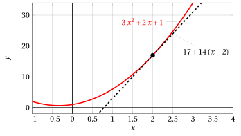

# Tangent lines

**Exercises · Derivatives** · with worked solutions · [:material-file-pdf-box: Lecture notes, volume (PDF)](../pdf/lecture-notes-4-derivatives.pdf)

!!! esercizio "Exercise 1"

    Write the equation of the tangent line to the graph of $y = f(x)$ at the point $\big( x_0, f(x_0)\big)$ for

    $$
    f(x) = 3\:x^2 + 2\:x +1, ~~x_0=2
    $$

??? soluzione "Solution"

    We compute the equation of the tangent line to the graph of the function

    $$
    f(x) = 3\:x^2 + 2\:x +1 {\rm ~~at~the~point~with~abscissa~~} x_0 = 2, {\rm ~~we~have:}
    $$

    $$
    f(2)=17,~ f'(x)=6\:x+2,~ f'(2)=14;
    $$

    the tangent line is

    $$
    y = f(2) + f'(2)(x - 2) = 17 + 14\: (x - 2)
    $$

    { .fig .ovale loading=lazy style="width:82%" }

!!! esercizio "Exercise 2"

    Write the equation of the tangent line to the graph of $y = f(x)$ at the point $\big( x_0, f(x_0)\big)$ for

    $$
    f(x) = \sin x, ~~x_0=\frac{\pi}{3}
    $$

??? soluzione "Solution"

    We compute the equation of the tangent line to the graph of the function

    $$
    f(x) = \sin x {\rm ~~at~the~point~with~abscissa~~} x_0 = \frac{\pi}{3}, {\rm ~~we~have:}
    $$

    $$
    f\left(\frac{\pi}{3}\right)=\frac{\sqrt{3}}{2},~ f'(x)=\cos x,~ f'\left(\frac{\pi}{3}\right)=\frac{1}{2};
    $$

    the tangent line is

    $$
    y = f\left(\frac{\pi}{3}\right) + f'\left(\frac{\pi}{3}\right)\left(x - \frac{\pi}{3}\right) = \frac{\sqrt{3}}{2} + \frac{1}{2}\: \left(x - \frac{\pi}{3}\right)
    $$

    { .fig .ovale loading=lazy style="width:80%" }

!!! esercizio "Exercise 3"

    Write the equation of the tangent line to the graph of $y = f(x)$ at the point $\big( x_0, f(x_0)\big)$ for

    $$
    f(x) = \log x, ~~x_0=1
    $$

??? soluzione "Solution"

    We compute the equation of the tangent line to the graph of the function

    $$
    f(x) = \log x {\rm ~~at~the~point~with~abscissa~~} x_0 = 1, {\rm ~~we~have:}
    $$

    $$
    f(1)=0,~ f'(x_0)=\lim_{h \rr 0} \frac{f(x_0+h)-f(x_0)}{h} =\lim_{h \rr 0}\frac{\log (1+h)}{h} = 1
    $$

    the tangent line is

    $$
    y = f(1) + f'(1)(x - 1) = 0 +  (x - 1)
    $$

    { .fig .ovale loading=lazy style="width:82%" }

!!! esercizio "Exercise 4"

    Write the equation of the tangent line to the graph of $y = f(x)$ at the point $\big( x_0, f(x_0)\big)$ for

    $$
    f(x) = a^x, ~~x_0=2
    $$

!!! esercizio "Exercise 5"

    Write the equation of the tangent line to the graph of $y = f(x)$ at the point $\big( x_0, f(x_0)\big)$ for

    $$
    f(x) = (x \: \log |x|)^3, ~~x_0=-1
    $$

!!! esercizio "Exercise 6"

    Write the equation of the tangent line to the graph of $y = f(x)$ at the point $\big( x_0, f(x_0)\big)$ for

    $$
    f(x) = \cos (\log x), ~~x_0=e^{\frac{\pi}{2}}
    $$

!!! esercizio "Exercise 7"

    Write the equation of the tangent line to the graph of $y = f(x)$ at the point $\big( x_0, f(x_0)\big)$ for

    $$
    f(x) = e^{x^2}, ~~x_0=\log 2
    $$

!!! esercizio "Exercise 8"

    Write the equation of the tangent line to the graph of $y = f(x)$ at the point $\big( x_0, f(x_0)\big)$ for

    $$
    f(x) = e^{-|x|}, ~~x_0=-1
    $$
