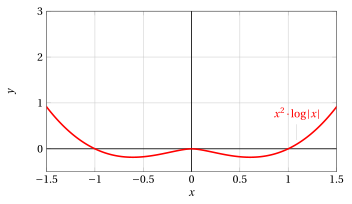
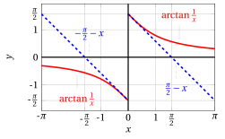

# Differentiability

**Exercises · Derivatives** · with worked solutions · [:material-file-pdf-box: PDF](../pdf/es-derivatives-06-differentiability.pdf)

!!! esercizio "Exercise 1"

    Study the differentiability of the function $f(x) = x^2 \cdot \log | x|$ defined for $x \neq 0$.

??? soluzione "Solution"

    We know that the following limit exists

    $$
    \lim_{x \rr 0}  x^2 \cdot \log | x| =0
    $$

    and we can extend $f$ by continuity by defining $f(0) =0$, so that $f$ is continuous at $0$ as well.   For $x \neq 0$, we have:

    $$
    f(x)=\left\{\begin{array}{lr} x^2 \cdot \log x, &x>0\\
    \\
    x^2 \cdot \log (-x), & x < 0 \end{array}\right.
    {\rm ~~~~~~~hence~~~~~~~}
    f'(x)=\left\{\begin{array}{lr} 2\:x \cdot \log (x) +x, &x>0\\
    \\
    2\:x \cdot \log (-x) +x, & x < 0 \end{array}\right.
    $$

    { .fig .ovale loading=lazy style="width:65%" }

    At $x = 0$ the function is continuous, and we have:

    $$
    \lim_{x \rr 0^+} f'(x) = \lim_{x \rr 0^+} 2\:x \cdot \log x +x = 0 {\rm ~~~~and~~~~} \lim_{x \rr 0^-} f'(x) = \lim_{x \rr 0^-} 2\:x \cdot \log(-x) +x = 0
    $$

    hence the derivative limit theorem can be applied and we have:

    $$
    f'_+(0)=0,f'_-(0)=0, f'(0)=0 {\rm ~~so~that~at~~} x=0 {\rm ~~the~function~is~differentiable}
    $$

    { .fig .ovale loading=lazy style="width:65%" }

!!! esercizio "Exercise 2"

    Determine the values of $\alpha$ and $\beta \in \mathbb{R}$ for which the function

    $$
    f(x) = \begin{cases}
      \displaystyle \frac{(1+x)^\alpha-1}{x}  & \text{if }x>0 \vspace{0.2cm} \\ 
      \beta x+2 & \text{if }x\leq0 
    \end{cases}
    $$

    is continuous and differentiable at $x=0$.

??? soluzione "Solution"

    We start with continuity at the junction point:

    \begin{align*}
    \lim_{x\to0^+}f(x)&=\lim_{x\to0^+}\frac{(1+x)^\alpha-1}{x}=\alpha, \\
    \lim_{x\to0^-}f(x)&=f(0)=2;
    \end{align*}

    hence the function is continuous at $x=0$ if and only if $\alpha=2$ and $\beta\in\mathbb{R}$.

    For $\alpha=2$ and $x>0$, we have:

    $$
    f(x)=\frac{(1+x)^2-1}{x}=x+2.
    $$

    Therefore it is clear that, in order to smoothly join two lines passing through the same point (in our case, the $y$-intercept ($0, 2$)), their equations must coincide, from which $\beta=1$.

    Alternatively, one can write the analytic expression of $f'(x)$ and impose the condition

    $$
    \lim_{x\to0^+}f'(x)=\lim_{x\to0^-}f'(x)
    $$

    and observe that the same conclusion is reached.

!!! esercizio "Exercise 3"

    Determine the values of $\alpha$ and $\beta \in \mathbb{R}$ for which the function

    $$
    f(x) = \begin{cases}
      \displaystyle \frac{e^{x-1}-1}{x\sin(x^2-1)}  & \text{if }0<x<1 \vspace{0.2cm} \\ 
      \alpha x+\beta & \text{if }1\leq x\leq2 \vspace{0.2cm} \\
      (x-2)^2\log^2(x-2) & \text{if }x>2
    \end{cases}
    $$

    is continuous and differentiable on $(0,+\infty)$.

??? soluzione "Solution"

    The given function is continuous on the intervals (0, 1), (1, 2) and (2,$+\infty$), since each branch is a composition of continuous functions.

    In order to ensure continuity at $x=1$, we impose the equality

    $$
    \lim_{x\to1^+}\left(\alpha x+\beta\right)=\lim_{x\to1^-}\frac{e^{x-1}-1}{x\sin(x^2-1)}
    $$

    and, observing that, for $x\to1^-$,

    $$
    f(x)\sim\frac{x-1}{x(x^2-1)}=\frac{1}{x(x+1)}\to\frac{1}{2},
    $$

    we obtain $\alpha+\beta=\frac{1}{2}$.

    We now study continuity at the junction point $x=2$; we impose

    $$
    \lim_{x\to2^+}(x-2)^2\log^2(x-2)=\lim_{x\to2^-}\left(\alpha x+\beta\right),
    $$

    and since

    $$
    \lim_{x\to2^+}(x-2)^2\log^2(x-2)=0
    $$

    we obtain $2\alpha+\beta=0$. Solving the system of the two conditions we get $\alpha=-\frac{1}{2}$ and $\beta=1$, which guarantee the continuity of $f$ on (0,$+\infty$).

    To check differentiability, we observe that computing $f'(x)$ on (0,1) is much more complicated than on (2,$+\infty$). It is therefore convenient to first check the differentiability of $f$ at $x=2$. Since

    $$
    f'(x)=2(x-2)\log^2(x-2)+2(x-2)\log(x-2) \quad \forall x>2,
    $$

    we have that

    $$
    \lim_{x\to2^+}f'(x)=0\neq-\frac{1}{2}=\lim_{x\to2^-}f'(x)
    $$

    Therefore, for $\alpha=-\frac{1}{2}$ and $\beta=1$, the function is <strong>not</strong> differentiable on $(0,+\infty)$, due to the presence of a corner point at $x=2$. We might ask what would happen for other values of $\alpha$ and $\beta$, but the answer is immediate: the function would not be continuous on $(0, +\infty)$, and hence not differentiable either.

!!! esercizio "Exercise 4"

    Given the function

    $$
    f(x) = \begin{cases}
      \displaystyle \frac{\pi}{\arctan \frac{1}{x}}  & \text{if }x<0 \vspace{0.2cm} \\ 
      \displaystyle \lambda & \text{if }x=0 \vspace{0.2cm} \\
      \displaystyle \frac{\log (1-2x^4)}{x^\alpha} & \text{if }x>0
    \end{cases}
    $$

    determine for which values of the real parameters $\alpha,\lambda\in\mathbb{R}$ the function is continuous and differentiable at $x=0$.

??? soluzione "Solution"

    The given function is continuous on the intervals $(-\infty, 0)$ and $(0, +\infty)$ since it is a composition of continuous functions. It remains to ensure continuity at the junction point $x=0$, where the following must hold:

    $$
    \lim_{x\to0^-}f(x)=\lim_{x\to0^+}f(x)=f(0)=\lambda
    $$

    We have

    $$
    \lim_{x\to0^-}f(x)=\lim_{x\to0^-}\frac{\pi}{\arctan \frac{1}{x}}=-2
    $$

    and

    \begin{align*}
    \lim_{x\to0^+}f(x)=\lim_{x\to0^+}\frac{\log (1-2x^4)}{x^\alpha}=\lim_{x\to0^+}\frac{-2x^4}{x^\alpha}&=-2\lim_{x\to0^+}x^{4-\alpha} \\
    &= \begin{cases}
    \displaystyle 0 & \text{if }\alpha<4 \\
    \displaystyle -2 & \text{if }\alpha=4 \\
    \displaystyle -\infty & \text{if }\alpha>4
    \end{cases}
    \end{align*}

    It is clear that the function is continuous at $x=0$ <em>if and only if</em> $\alpha=4, \lambda=-2$. Let us check whether, for the values of $\alpha, \lambda$ obtained, the function is also differentiable at $x=0$. We rewrite the function substituting the values of $\alpha, \lambda$ obtained:

    $$
    f(x) = \begin{cases}
      \displaystyle \frac{\pi}{\arctan \frac{1}{x}}  & \text{if }x<0 \vspace{0.2cm} \\ 
      \displaystyle -2 & \text{if }x=0 \vspace{0.2cm} \\
      \displaystyle \frac{\log (1-2x^4)}{x^4} & \text{if }x>0
    \end{cases}
    $$

    and we write the analytic expression of its first derivative:

    $$
    f'(x) = \begin{cases}
      \displaystyle \frac{\pi}{(x^2+1)\left(\arctan \frac{1}{x}\right)^2}  & \text{if }x<0 \vspace{0.4cm} \\ 
      \displaystyle \frac{-8x^7-4x^3(1-2x^4)\log (1-2x^4)}{x^8(1-2x^4)} & \text{if }x>0
    \end{cases}
    $$

    We have

    $$
    \lim_{x\to0^{-}}f'(x)=\lim_{x\to0^{-}}\frac{\pi}{(x^2+1)\left(\arctan \frac{1}{x}\right)^2}=\frac{4}{\pi}
    $$

    while

    $$
    \lim_{x\to0^{+}}f'(x)=\lim_{x\to0^{+}}\frac{-8x^7-4x^3(1-2x^4)\log (1-2x^4)}{x^8(1-2x^4)}=0
    $$

    since

    $$
    \lim_{x\to0^{+}}\frac{-8x^7-4x^3(1-2x^4)\log (1-2x^4)}{x^8(1-2x^4)}=\lim_{x\to0^{+}}\frac{-8x^{11}+o(x^{11})}{x^8}=\lim_{x\to0^{+}}\frac{-8x^{11}}{x^8}=0
    $$

    We conclude that $\nexists \; \alpha, \lambda \in \mathbb{R}$ for which the function is also differentiable at $x=0$.

!!! esercizio "Exercise 5"

    Prove that the following inequality holds:

    $$
    \log\left(1+x\right)\leq x \quad \quad \forall x \geq 0
    $$

??? soluzione "Solution"

    The function $f(x)=\log (1+x)$ is continuous and differentiable on $(-1,+\infty)$. We can apply Lagrange's theorem on every interval of the form $[0,x]$, with $x>0$. Therefore, for a suitable $\eta\in (0,x)$, $x>0$, we obtain

    $$
    \log (1+x)=\log(1+x)-\log(1+0)=\frac{1}{1+\eta}x< x
    $$

    where we took into account that $\frac{1}{1+\eta}<1$ for every $\eta>0$.

!!! esercizio "Exercise 6"

    Determine the minimum and maximum points (if any), relative and absolute, of the function

    $$
    g(x)=x+|\cos x|
    $$

    on $[0, 2\pi]$. At how many points does $g(x)$ vanish? Why?

??? soluzione "Solution"

    The function is continuous on the closed and bounded interval $[0, 2\pi]$, hence by the Weierstrass theorem the absolute maximum and minimum points exist. We have

    $$
    g(x)=\begin{cases}
    x+ \cos x & \text{if }x\in [0,\pi/2]\cup[3\pi/2,2\pi] \\
    x- \cos x & \text{if }x \in (\pi/2,3\pi/2)
    \end{cases}
    $$

    and

    $$
    g'(x)=\begin{cases}
    1- \sin x & \text{if }x\in (0,\pi/2)\cup(3\pi/2,2\pi) \\
    1+ \sin x & \text{if }x \in (\pi/2,3\pi/2)
    \end{cases}
    $$

    and verify as an exercise that the function is not differentiable at the junction points. The first derivative is always positive where it is defined, hence the function is always increasing and attains its absolute maximum and minimum values at the endpoints of the interval. More precisely, $x=0$ is the absolute minimum point with $g(0)=1$ and $x=2\pi$ is the absolute maximum point with $g(2\pi)=2\pi+1$. The function never vanishes since it is always increasing and $g(0)=1$.

!!! esercizio "Exercise 7"

    Study the differentiability of the function $f(x) = \arctan \frac{1}{x}$ defined for $x \neq 0$.

??? soluzione "Solution"

    For $x \neq 0$, we have:

    $$
    f'(x) = -\frac{1}{1+x^2}
    $$

    { .fig .ovale loading=lazy style="width:59%" }

    But in this case the hypothesis of continuity of $f$ at $0$ fails, since:

    $$
    \lim_{x \rr 0^+} f(x) = \frac{\pi}{2} ~~~{\rm and}~~~ \lim_{x \rr 0^-} f(x) = -\frac{\pi}{2}
    $$

    and it is not possible to use the derivative limit theorem to compute the derivative at $x=0$. Since it is not continuous at $x=0$, the function is not differentiable. If instead we consider only the left limit of the derivative, the hypotheses of the derivative limit theorem are satisfied and since:

    $$
    \lim_{x \rr 0^-} f'(x)= \lim_{x \rr 0^-} -\frac{1}{1+x^2}=-1 {\rm ~~then~~~} f'_-(0)=-1
    $$

    moreover, since:

    $$
    \lim_{x \rr 0^+} f'(x)= \lim_{x \rr 0^+} -\frac{1}{1+x^2}=-1 {\rm ~~then~~~} f'_+(0)=-1
    $$

    { .fig .ovale loading=lazy style="width:59%" }
