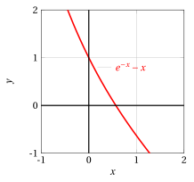
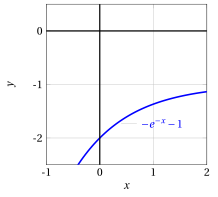
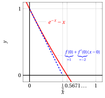

# Newton's method

**Exercises · Derivatives** · with worked solutions · [:material-file-pdf-box: PDF](../pdf/es-derivatives-11-newton.pdf)

!!! esercizio "Exercise 1"

    Consider

    $$
    f(x) = e^{-x} - x
    $$

    and verify whether Newton's method can be applied on the interval $[0,1]$. If so, find an estimate of $x \in[0,1]$ such that:

    $$
    e^{-x} - x = 0
    $$

??? soluzione "Solution"

    We consider the function:

    $$
    f(x) = e^{-x} - x, ~~~f'(x) = -e^{-x}-1, ~~~f''(x) = e^{-x}
    $$

    { .fig .ovale loading=lazy style="width:39%" }

    We have:

    $$
    f(0) =1>0 {\rm ~~~and~~~} f(1) <0
    $$

    { .fig .ovale loading=lazy style="width:39%" }

    We consider the interval $[0,1]$; for $x \in [0,1]$ we have:

    $$
    f'(x) < 0 {\rm ~~~and~~~} f''(x) > 0
    $$

??? soluzione "Solution"

    Hence on the interval $[0,1]$ the function $f(x) = e^{-x} - x$ satisfies the hypotheses of the theorem.

    We are in the case of a function that is strictly decreasing on $[0,1]$, since $f'(x)<0, x \in [0,1]$, and convex on $[0,1]$, since $f''(x)>0, x \in [0,1]$. The endpoints of the chosen interval are: $a=0$ and $b=1$.

    Hypothesis 3 holds, that is $f(0) \cdot f''(0) >0$, and the sequence becomes:

    $$
    x_0 =0, \qquad  x_{n+1} = x_n  - \frac{e^{-x_n} - x_n}{-e^{-x_n}-1} = \frac{x_n+1}{1+e^{x_n}}    {\rm ~~with~~} n \in \N
    $$

    Since

    \begin{align*}
    x_n  - \frac{e^{-x_n} - x_n}{-e^{-x_n}-1} &= x_n  + \frac{e^{-x_n} - x_n}{e^{-x_n}+1}=x_n  + \frac{e^{-x_n}}{e^{-x_n}} \frac{1 - e^{x_n}\;x_n}{1+e^{x_n}} \\[2ex]
     &= \frac{x_n(1+e^{x_n})+1-e^{x_n}x_n}{1+e^{x_n}} = \frac{x_n+1}{1+e^{x_n}}
    \end{align*}

    we therefore have:

    $$
    x_0=0,~~~x_1=0.5,~~~x_2=0.5663\dots,~~~x_3=0.5671\dots,~~~x_4=0.5671\dots,~~~x_5=0.5671\dots
    $$

    { .fig .ovale loading=lazy style="width:85%" }

??? soluzione "Solution"

    At the first iteration the tangent line is:

    $$
    y = 1 - 2 \; x {\rm ~~and~~} x_1 = 0 - \frac{1}{-2}=\frac{1}{2}
    $$

    { .fig .ovale loading=lazy style="width:55%" }
