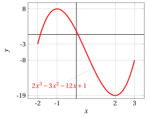
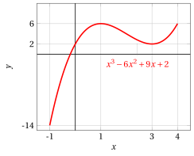
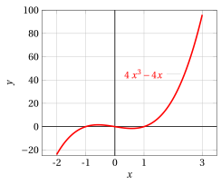

# Finding local and global extrema and extremum points

**Exercises · Derivatives** · with worked solutions · [:material-file-pdf-box: Lecture notes, volume (PDF)](../pdf/lecture-notes-4-derivatives.pdf)

!!! esercizio "Exercise 1"

    Compute all the maximum and minimum points (global and local) of the function:

    $$
    f(x)=    5 +54x -2x^3 {\rm ~~~~~on the interval~~} [0,4]
    $$

??? soluzione "Solution"

    1. The values of the function at the endpoints of the interval are: $f(0)=5$ and $f(4)=93$.

    2. The derivative is:

        $$
        f'(x)=54-6\;x^2=-6\;(x^2-9)=-6\;(x+3)\;(x-3)
        $$

        We solve the equation:

        $$
        f'(x) = 0 \Longleftrightarrow -6\;(x+3)\;(x-3)=0  \Longleftrightarrow x=\pm 3
        $$

        $$
        x_1 = 3 \in [0,4]~~~~ {\rm stationary~point}
        $$

    3. We have $f'(x) \ge 0$ for  $x \in [-3,3]$.  Studying the sign of $f'$ near $x = 3$, we deduce that $x=3$ is a local maximum point and $f(3)=113$ is a local maximum.

    4. We have:

        $$
        f(3) = 113 > f(0) =5, ~~ f(3) = 113
          > f(4) = 93
        $$

        We therefore conclude that:

        - $f(0)=5$  is the <strong>global minimum</strong> and $x=0$  is a <strong>global minimum point</strong>

        - $f(3)=113$ is the <strong>global maximum</strong> and $x=3$  is a <strong>global maximum point</strong>

        - $f(4)=93$ is a <strong>local minimum</strong> and  $x=4$   is a <strong>local minimum point</strong>

!!! esercizio "Exercise 2"

    Compute all the maximum and minimum points (global and local) of the function:

    $$
    f(x)=   2x^3 -3x^2-12x +1 {\rm ~~~~~on the interval~~} [-2,3]
    $$

??? soluzione "Solution"

    1. The values of the function at the endpoints of the interval are: $f(-2)=-3$ and $f(3)=-8$.

    2. The derivative is:

        $$
        f'(x)=6\;x^2-6\:x-12=6\;(x^2-x-2)=6\;(x+1)\;(x-2)
        $$

        We solve the equation:

        $$
        f'(x) = 0 \Longleftrightarrow 6\;(x^2-x-2)=0  \Longleftrightarrow x=\frac{1\pm 3}{2}
        $$

        $$
        x_1 = -1 \in [-2,3] {\rm ~~and~~} x_2 = 2 \in [-2,3] ~~~{\rm stationary~points}
        $$

    3. We have $f'(x) \ge 0$ for  $x \in (\im,-1] \cup [2,\ip)$. Studying the sign of $f'$ near $x = -1$, we deduce that $x=-1$ is a local maximum point and $f(-1)=8$ is a local maximum. Studying the sign of $f'$ near $x = 2$, we deduce that $x=2$ is a local minimum point and $f(2)=-19$ is a local minimum.

    4. We have:

        $$
        f(-1) = 8 > f(-2) =-3, ~~ f(-1) = 8
          > f(3) = -8
        $$

        $$
        f(2) = -19 < f(-2) =-3, ~~ f(2) = -19
          < f(3) = -8
        $$

        We therefore conclude that:

        - $f(-2)=-3$ is a <strong>local minimum</strong> and $x=-2$  is a <strong>local minimum point</strong>

        - $f(-1)=8$ is the <strong>global maximum</strong> and $x=-1$ is a <strong>global maximum point</strong>

        - $f(2)=-19$ is the <strong>global minimum</strong> and  $x=2$  is a <strong>global minimum point</strong>

        - $f(3)=-8$ is a <strong>local maximum</strong> and $x=3$  is a <strong>local maximum point</strong>

!!! esercizio "Exercise 3"

    Compute all the maximum and minimum points (global and local) of the function:

    $$
    f(x)= x^3 - 6x^2  + 9x  + 2 {\rm ~~~~~on the interval~~} [-1,4]
    $$

??? soluzione "Solution"

    1. The values of the function at the endpoints of the interval are: $f(-1)=-14$ and $f(4)=6$.

    2. The derivative is:

        $$
        f'(x)=3\;x^2-12\:x+9=3\;(x^2-4\:x+3)=3\;(x-3)\;(x-1)
        $$

        We solve the equation:

        $$
        f'(x) = 0 \Longleftrightarrow 3\;(x^2-4\:x+3)=0  \Longleftrightarrow x=\frac{4\pm 2}{2}
        $$

        $$
        x_1 = 1 \in [-1,4] {\rm ~~and~~} x_2 = 3 \in [-1,4] ~~~{\rm stationary~points}
        $$

    3. We have $f'(x) \ge 0$ for  $x \in (\im,1] \cup [3,\ip)$. Studying the sign of $f'$ near $x = 1$, we deduce that $x=1$ is a local maximum point and $f(1)=6$ is a local maximum. Studying the sign of $f'$ near $x = 3$, we deduce that $x=3$ is a local minimum point and $f(3)=2$ is a local minimum.

    4. We have:

        $$
        f(1) = 6 > f(-1) =-14, ~~ f(1) = 6
          \ge f(4) = 6
        $$

        $$
        f(3) = 2 > f(-1) =-14, ~~ f(3) = 2
          < f(4) = 6
        $$

        We therefore conclude that:

        - $f(-1)=-14$ is the <strong>global minimum</strong> and $x=-1$  is a <strong>global minimum point</strong>

        - $f(1)=6$ is the <strong>global maximum</strong> and $x=1$ is a <strong>global maximum point</strong>

        - $f(3)=2$ is a <strong>local minimum</strong> and  $x=3$  is a <strong>local minimum point</strong>

        - $f(4)=6$ is the <strong>global maximum</strong> and $x=4$  is a <strong>global maximum point</strong>

!!! esercizio "Exercise 4"

    Compute all the maximum and minimum points (global and local) of the function:

    $$
    f(x)=x^4 - 2x^2 + 3 {\rm ~~~~~on the interval~~} [-2,3]
    $$

??? soluzione "Solution"

    1. The values of the function at the endpoints of the interval are: $f(-2)=11$ and $f(3)=66$.

    2. The derivative is:

        $$
        f'(x)=4\;x^3-4\:x=4\;x\;(x^2-1)
        $$

        We solve the equation:

        $$
        f'(x) = 0 \Longleftrightarrow 4\;x\;(x^2-1)=0  \Longleftrightarrow x=\pm 1 {\rm ~~and~~} x=0
        $$

        $$
        x_1 = -1 \in [-2,3],~~x_2 = 0 \in [-2,3]  {\rm ~~and~~} x_3 = 1 \in [-2,3] ~~~{\rm stationary~points}
        $$

    3. We have $f'(x) \ge 0$ for  $x \in [-1,0] \cup [1,\ip)$. Studying the sign of $f'$ near $x = -1$, we deduce that $x=-1$ is a local minimum point and $f(-1)=2$ is a local minimum. Studying the sign of $f'$ near $x = 0$, we deduce that $x=0$ is a local maximum point and $f(0)=3$ is a local maximum. Studying the sign of $f'$ near $x = 1$, we deduce that $x=1$ is a local minimum point and $f(1)=2$ is a local minimum.

    4. We have:

        $$
        f(-1) = 2 < f(-2) =11, ~~ f(-1) = 2
          < f(3) = 66
        $$

        $$
        f(0) = 3 < f(-2) =11, ~~ f(0) = 3
          < f(3) = 66
        $$

        $$
        f(1) = 2 < f(-2) =11, ~~ f(1) = 2
          < f(3) = 66
        $$

        We therefore conclude that:

        - $f(-2)=11$ is a <strong>local maximum</strong> and $x=-2$  is a <strong>local maximum point</strong>

        - $f(-1)=2$ is the <strong>global minimum</strong> and $x=-1$ is a <strong>global minimum point</strong>

        - $f(0)=3$ is a <strong>local maximum</strong> and  $x=0$  is a <strong>local maximum point</strong>

        - $f(1)=2$ is the <strong>global minimum</strong> and  $x=1$  is a <strong>global minimum point</strong>

        - $f(3)=66$ is the <strong>global maximum</strong> and $x=3$  is a <strong>global maximum point</strong>

These are the graphs of the function $f(x)= 5 +54x -2x^3$ and of its derivative on the interval $[0,4]$:

{ .fig .ovale loading=lazy style="width:79%" }

{ .fig .ovale loading=lazy style="width:79%" }

These are the graphs of the function $f(x)= 2x^3 -3x^2-12x +1$ and of its derivative on the interval $[-2,3]$:

{ .fig .ovale loading=lazy style="width:79%" }

{ .fig .ovale loading=lazy style="width:79%" }

These are the graphs of the function $f(x)= x^3 - 6x^2  + 9x  + 2$ and of its derivative on the interval $[-1,4]$:

{ .fig .ovale loading=lazy style="width:79%" }

{ .fig .ovale loading=lazy style="width:79%" }

These are the graphs of the function $f(x)= x^4 - 2x^2 + 3$ and of its derivative on the interval $[-2,3]$:

{ .fig .ovale loading=lazy style="width:79%" }

{ .fig .ovale loading=lazy style="width:79%" }
