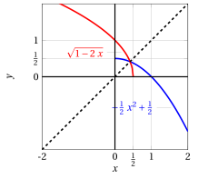

# Inverse functions

**Exercises · Functions** · with worked solutions · [:material-file-pdf-box: PDF](../pdf/es-functions-02-inverse-functions.pdf)

!!! esercizio "Exercise 1"

    Prove that the function

    $$
    f(x)=\log{(2+3x)}
    $$

    is invertible on its domain and determine the analytic expression of the inverse $f^{-1}$. Specify the domain of $f^{-1}$.

??? soluzione "Solution"

    The domain of the given function is

    $$
    \left(-\frac{2}{3},+\infty\right),
    $$

    the interval where the argument of the logarithm is strictly positive. To prove that $f$ is invertible, it suffices to verify that it is injective, i.e.,

    $$
    \forall x_1,x_2 \in D \qquad f(x_1) = f(x_2) \Longrightarrow x_1 = x_2
    $$

    Imposing $f(x_1) = f(x_2)$ is equivalent to imposing that

    \begin{align*}
    \log{(2+3x_1)} &=\log{(2+3x_2)} \\
    2+3x_1 &= 2+3x_2 \\
    3x_1 &= 3x_2 \Longleftrightarrow x_1=x_2
    \end{align*}

    The function $f$ is injective and, consequently, invertible. We look for the analytic expression of the inverse function $f^{-1}$ by solving, with respect to the variable $x$, the equation

    $$
    \log{(2+3x)}=y.
    $$

    which has the unique solution

    $$
    x=\frac{1}{3}(e^{y}-2)
    $$

??? soluzione "Solution"

    More formally, the inverse function of $f$ is

    $$
    f^{-1}(y)=\frac{1}{3}(e^{y}-2)
    $$

    whose domain is the image of the original function $f$, that is, $\mathbb{R}$. Hence $f:\left(-\frac{2}{3},+\infty\right)\to(-\infty, +\infty)$, while $f^{-1}:(-\infty, +\infty) \to\left(-\frac{2}{3},+\infty\right)$.

    The graphs $y=\log{(2+3x)}$ and $y=\frac{1}{3}(e^{x}-2)$ are symmetric with respect to the bisector $y=x$:

    { .fig .ovale loading=lazy style="width:58%" }

!!! esercizio "Exercise 2"

    Prove that the function

    $$
    f(x)=\sqrt{1-2x}
    $$

    is invertible on its domain and determine the analytic expression of the inverse $f^{-1}$. Specify the domain of $f^{-1}$.

??? soluzione "Solution"

    The domain of the given function is

    $$
    \left(-\infty,\frac{1}{2}\right],
    $$

    the interval where the radicand is non-negative.

??? soluzione "Solution"

    To prove that $f$ is invertible, it suffices to verify that it is injective, i.e.,

    $$
    \forall x_1,x_2 \in D \qquad f(x_1) = f(x_2) \Longrightarrow x_1 = x_2
    $$

    Imposing $f(x_1) = f(x_2)$ is equivalent to imposing that

    \begin{align*}
    \sqrt{1-2x_1} &=\sqrt{1-2x_2} \\
    1-2x_1 &=1-2x_2 \\
    -2x_1 &= -2x_2 \Longleftrightarrow x_1=x_2
    \end{align*}

    The function $f$ is injective and, consequently, invertible. We look for the analytic expression of the inverse function $f^{-1}$ by solving, with respect to the variable $x$, the equation

    $$
    \sqrt{1-2x}=y.
    $$

    which, for $y \geq 0$ (a square root is never negative in $\mathbb{R}$), has the unique solution

    $$
    x=-\frac{1}{2}y^2+\frac{1}{2}
    $$

    More formally, the inverse function of $f$ is

    $$
    f^{-1}(y)=-\frac{1}{2}y^2+\frac{1}{2}
    $$

    whose domain is the image of the original function $f$, that is, $[0, +\infty)$. Hence $f:\left(-\infty,\frac{1}{2}\right]\to[0, +\infty)$, $f^{-1}:[0, +\infty) \to\left(-\infty,\frac{1}{2}\right]$.

    The graphs $y=\sqrt{1-2x}$ and $y=-\frac{1}{2}x^2+\frac{1}{2}$ are symmetric with respect to the bisector $y=x$:

    { .fig .ovale loading=lazy style="width:58%" }

!!! esercizio "Exercise 3"

    Prove that the function

    $$
    f(x)=e^{2x-3}
    $$

    is invertible on its domain and determine the analytic expression of the inverse $f^{-1}$. Specify the domain of $f^{-1}$.

??? soluzione "Solution"

    The domain of the given function is

    $$
    \left(-\infty,+\infty\right),
    $$

    since the exponential function is defined for every $x\in\mathbb{R}$. To prove that $f$ is invertible, it suffices to verify that it is injective, i.e.,

    $$
    \forall x_1,x_2 \in D \qquad f(x_1) = f(x_2) \Longrightarrow x_1 = x_2
    $$

    Imposing $f(x_1) = f(x_2)$ is equivalent to imposing that

    \begin{align*}
    e^{2x_1-3} &=e^{2x_2-3} \\
    2x_1-3 &=2x_2-3 \\
    2x_1 &= 2x_2 \Longleftrightarrow x_1=x_2
    \end{align*}

    The function $f$ is injective and, consequently, invertible. We look for the analytic expression of the inverse function $f^{-1}$ by solving, with respect to the variable $x$, the equation

    $$
    e^{2x-3}=y.
    $$

    It makes sense to solve this equation only for $y > 0$, since it would have no solutions when $y\leq0$ (the exponential never vanishes and is never negative). The equation has the unique solution

    $$
    x=\frac{3}{2}+\frac{1}{2}\log{y}
    $$

    More formally, the inverse function of $f$ is

    $$
    f^{-1}(y)=\frac{3}{2}+\frac{1}{2}\log{y}
    $$

    whose domain is the image of the original function $f$, that is, $(0, +\infty)$. Hence $f:(-\infty,+\infty)\to(0, +\infty)$, $f^{-1}:(0, +\infty) \to (-\infty,+\infty)$.

!!! esercizio "Exercise 4"

    Prove that the function

    $$
    f(x)=\arctan(2x-1)
    $$

    is invertible on its domain and determine the analytic expression of the inverse $f^{-1}$. Specify the domain of $f^{-1}$.

??? soluzione "Solution"

    The arctangent function, which we recall is the inverse function of the restriction of $y=\tan(x)$ to the interval $(-\frac{\pi}{2},\frac{\pi}{2})$, has the following properties:

    - its <em>domain</em> is the set $\mathbb{R}$;

    - its image is the interval  $(-\frac{\pi}{2},\frac{\pi}{2})$;

    - it is a <strong>strictly increasing</strong> monotonic function.

    Since it is strictly increasing, the function $f$ is invertible (note that this is only a <em>sufficient</em> condition). We look for the analytic expression of the inverse function $f^{-1}$ by solving, with respect to the variable $x$, the equation

    $$
    \arctan(2x-1)=y,
    $$

    where $y \in (-\frac{\pi}{2},\frac{\pi}{2})$. The equation becomes

    \begin{align*}
    2x-1 &=\tan(y) \\
    x &= \frac{1}{2}+\frac{\tan(y)}{2}
    \end{align*}

    More formally, the inverse function of $f$ is

    $$
    f^{-1}(y)=\frac{1}{2}+\frac{\tan(y)}{2}
    $$

    whose domain is the image of the original function $f$, that is, $(-\frac{\pi}{2},\frac{\pi}{2})$. Hence $f:\mathbb{R}\to(-\frac{\pi}{2},\frac{\pi}{2})$, while $f^{-1}:(-\frac{\pi}{2},\frac{\pi}{2})\to\mathbb{R}$

!!! esercizio "Exercise 5"

    Prove that the function

    $$
    f(x)=\frac{x-1}{x+2}
    $$

    is invertible on its domain and determine the analytic expression of the inverse $f^{-1}$. Specify the domain of $f^{-1}$.

??? soluzione "Solution"

    The domain of the given function is

    $$
    (-\infty, -2)\cup(-2,+\infty),
    $$

    since it is defined $\forall x \in \mathbb{R}, \, x \neq -2$. To prove that $f$ is invertible, it suffices to verify that it is injective, i.e.,

    $$
    \forall x_1,x_2 \in D \qquad f(x_1) = f(x_2) \Longrightarrow x_1 = x_2
    $$

    To simplify the subsequent computations, it is convenient to rewrite the function $f$ as:

    $$
    f(x)=\frac{x-1}{x+2}=\frac{x+2-3}{x+2}=1-\frac{3}{x+2}
    $$

    Imposing $f(x_1) = f(x_2)$ is equivalent to imposing that

    \begin{align*}
    1-\frac{3}{x_1+2} &=1-\frac{3}{x_2+2} \\
    \frac{3}{x_1+2} &=\frac{3}{x_2+2} \\
    x_1+2 &= x_2+2 \Longleftrightarrow x_1=x_2
    \end{align*}

    The function $f$ is injective and, consequently, invertible. We look for the analytic expression of the inverse function $f^{-1}$ by solving, with respect to the variable $x$, the equation

    $$
    \frac{x-1}{x+2}=y.
    $$

    Rewriting the function again as before

    $$
    1-\frac{3}{x+2}=y
    $$

    we obtain

    $$
    x=\frac{3}{1-y}-2=\frac{2y+1}{1-y}
    $$

    More formally, the inverse function of $f$ is

    $$
    f^{-1}(y)=\frac{2y+1}{1-y}
    $$

    whose domain is the image of the original function $f$, that is, $(-\infty, 1)\cup(1,+\infty)$. Hence $f:(-\infty, -2)\cup(-2,+\infty)\to(-\infty, 1)\cup(1,+\infty)$, $f^{-1}:(-\infty, 1)\cup(1,+\infty) \to (-\infty, -2)\cup(-2,+\infty)$.

!!! esercizio "Exercise 6"

    Prove that the function

    $$
    f(x)=e^{1+x^2}
    $$

    is invertible on a restriction of its domain and determine the analytic expression of the inverse $f^{-1}$. Specify the domain of $f^{-1}$.

??? soluzione "Solution"

    The domain of the given function is

    $$
    \left(-\infty,+\infty\right),
    $$

    since the exponential function is defined for every $x\in\mathbb{R}$. It is clear that $f$ is not invertible on all of $\mathbb{R}$, since it is an even function, i.e., symmetric with respect to the $y$-axis:

    $$
    f(-x)=e^{1+(-x)^2}=e^{1+x^2}=f(x)
    $$

    This implies that any horizontal line intersects the graph of the function in two points. The function is not injective, hence not invertible on $\mathbb{R}$. However, we can restrict the domain by considering only the positive $x$-half-axis including the origin, i.e., the set

    $$
    [0, +\infty)
    $$

    Let us verify that, on this restricted domain, the function $f$ is injective. To this end, we impose $f(x_1) = f(x_2)$, i.e.,

    \begin{align*}
    e^{1+x_1^2} &=e^{1+x_2^2} \\
    1+x_1^2 &=1+x_2^2 \\
    x_1^2 &= x_2^2 \Longleftrightarrow x_1=x_2
    \end{align*}

    where the last equivalence holds since $x \in [0, +\infty)$, i.e., $x \geq 0$, so the solution $x_1=-x_2$ is excluded. We have thus proved that the function $f$ is injective on the restricted domain and, consequently, invertible on $[0, +\infty)$.

    We look for the analytic expression of the inverse function $f^{-1}$ by solving, with respect to the variable $x$, the equation

    $$
    e^{1+x^2}=y.
    $$

    The equation is solved by

    $$
    x=\pm \sqrt{\log{(y)}-1}
    $$

    where, however, it is now clear that the negative solution must be excluded, since $x$ varies in the restriction $[0, +\infty)$.

??? soluzione "Solution"

    More formally, the inverse function of $f$ is

    $$
    f^{-1}(y)=\sqrt{\log{(y)}-1}
    $$

    whose domain is the image of the original function $f$, that is, $[e, +\infty)$. Hence $f:[0,+\infty)\to[e, +\infty)$, $f^{-1}:[e, +\infty) \to [0,+\infty)$.

!!! esercizio "Exercise 7"

    Prove that the function

    $$
    f(x)=\frac{4}{5^{3x}}
    $$

    is invertible on its domain and determine the analytic expression of the inverse $f^{-1}$. Specify the domain of $f^{-1}$.

??? soluzione "Solution"

    The domain of the given function is

    $$
    \left(-\infty,+\infty\right),
    $$

    since the denominator is always nonzero (the exponential never vanishes). To prove that $f$ is invertible, it suffices to verify that it is injective, i.e.,

    $$
    \forall x_1,x_2 \in D \qquad f(x_1) = f(x_2) \Longrightarrow x_1 = x_2
    $$

    Imposing $f(x_1) = f(x_2)$ is equivalent to imposing that

    \begin{align*}
    \frac{4}{5^{3x_1}} &=\frac{4}{5^{3x_2}} \\
    5^{3x_1} &= 5^{3x_2} \\
    3x_1 &= 3x_2 \Longleftrightarrow x_1=x_2
    \end{align*}

    The function $f$ is injective and, consequently, invertible. We look for the analytic expression of the inverse function $f^{-1}$ by solving, with respect to the variable $x$, the equation

    $$
    \frac{4}{5^{3x}}=y,
    $$

    with $y >0$, which has the unique solution

    $$
    x=\frac{1}{3}\log_5{\left(\frac{4}{y}\right)}=-\frac{1}{3}\log_5{\left(\frac{y}{4}\right)}
    $$

??? soluzione "Solution"

    More formally, the inverse function of $f$ is

    $$
    f^{-1}(y)=-\frac{1}{3}\log_5{\left(\frac{y}{4}\right)}
    $$

    whose domain is the image of the original function $f$, that is, $(0, +\infty)$. Hence $f:\mathbb{R}\to(0, +\infty)$, while $f^{-1}:(0, +\infty) \to\mathbb{R}$.

!!! esercizio "Exercise 8"

    Prove that the function

    $$
    f(x)=-1+\sqrt[5]{1+x}
    $$

    is invertible on its domain and determine the analytic expression of the inverse $f^{-1}$. Specify the domain of $f^{-1}$.

??? soluzione "Solution"

    The domain of the given function is

    $$
    \left(-\infty,+\infty\right),
    $$

    since roots of odd index are always defined. To prove that $f$ is invertible, it suffices to verify that it is injective, i.e.,

    $$
    \forall x_1,x_2 \in D \qquad f(x_1) = f(x_2) \Longrightarrow x_1 = x_2
    $$

    Imposing $f(x_1) = f(x_2)$ is equivalent to imposing that

    \begin{align*}
    -1+\sqrt[5]{1+x_1} &=-1+\sqrt[5]{1+x_2} \\
    \sqrt[5]{1+x_1} &= \sqrt[5]{1+x_2} \\
    1+x_1 &= 1+x_2 \Longleftrightarrow x_1=x_2
    \end{align*}

    The function $f$ is injective (it is also strictly increasing) and, consequently, invertible. We look for the analytic expression of the inverse function $f^{-1}$ by solving, with respect to the variable $x$, the equation

    $$
    -1+\sqrt[5]{1+x}=y,
    $$

    which has the unique solution

    $$
    x=-1+(y+1)^5
    $$

??? soluzione "Solution"

    More formally, the inverse function of $f$ is

    $$
    f^{-1}(y)=-1+(y+1)^5
    $$

    whose domain is the image of the original function $f$, that is, $\mathbb{R}$. Hence $f:\mathbb{R}\to\mathbb{R}$, and also $f^{-1}:\mathbb{R} \to\mathbb{R}$.

!!! esercizio "Exercise 9"

    Prove that the function

    $$
    f(x)=\frac{1-3x}{x+1}
    $$

    is invertible on its domain and determine the analytic expression of the inverse $f^{-1}$. Specify the domain of $f^{-1}$.

    <em>(Hint: perform the division of $1-3x$ by $x+1$)</em>.

!!! esercizio "Exercise 10"

    Prove that the function

    $$
    f(x)=3^{x^2}
    $$

    is invertible on a restriction of its domain and determine the analytic expression of the inverse $f^{-1}$ on the restriction. Specify the domain of $f^{-1}$.

!!! esercizio "Exercise 11"

    Prove that the function

    $$
    f(x)=\sqrt{\log{\left(\frac{x-1}{x}\right)}}
    $$

    is invertible on its domain and determine the analytic expression of the inverse $f^{-1}$. Specify the domain of $f^{-1}$.
