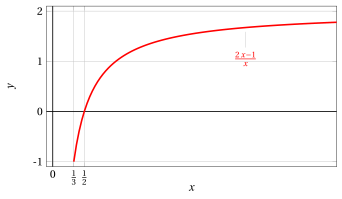
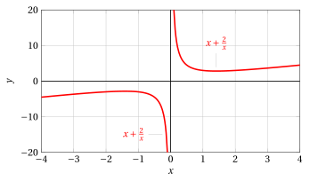

# Maxima, minima, suprema and infima

**Exercises · Numbers and logic** · with worked solutions · [:material-file-pdf-box: PDF](../pdf/es-numbers-01-max-min-suprema.pdf)

!!! esercizio "Exercise 1"

    Determine whether the set

    $$
    A=[0,\sqrt{2}]\cap \Q
    $$

    has a maximum, a minimum, a supremum, an infimum and, if so, determine these elements.

??? soluzione "Solution"

    The minimum of $A$ is $0$. $A$ has no maximum; its supremum is $\sqrt{2}$.

!!! esercizio "Exercise 2"

    Determine whether the set

    $$
    A=[\sqrt{2},\sqrt{3}]\cap \Q
    $$

    has a maximum, a minimum, a supremum, an infimum and, if so, determine these elements.

??? soluzione "Solution"

    $A$ has neither a minimum nor a maximum. The infimum is $\sqrt{2}$, the supremum is $\sqrt{3}$.

!!! esercizio "Exercise 3"

    Determine whether the set

    $$
    A=[0,\sqrt{2}]\cap(\R-  \Q)
    $$

    has a maximum, a minimum, a supremum, an infimum and, if so, determine these elements.

??? soluzione "Solution"

    $A$ has no minimum; the infimum is $0$. The maximum of $A$ is $\sqrt{2}$.

!!! esercizio "Exercise 4"

    In each of the following cases, say whether the set

    $$
    A=(-\infty,\sqrt{2}]\cap \Q
    $$

    has a maximum, a minimum, a supremum, an infimum and, if so, determine these elements.

??? soluzione "Solution"

    $A$ is not bounded below, hence it has no infimum in $\R$. $A$ has no maximum; the supremum is $\sqrt{2}$.

!!! esercizio "Exercise 5"

    Say whether the following set $A \subset\R$ has a maximum, a minimum, a supremum, an infimum, and whether it is bounded:

    $$
    A=\left\{\frac{2n+1}{n}: \ n\in \N \setminus \{0\} \right\}
    $$

??? soluzione "Solution"

    From $(2n+1)/n=2+(1/n)$ we have that the maximum of $A$ is attained for $n=1$ and is equal to $3$. $A$ has no minimum; the infimum is $2$. In particular, $A$ is bounded.

!!! esercizio "Exercise 6"

    Say whether the following set $A \subset\R$ has a maximum, a minimum, a supremum, an infimum, and whether it is bounded:

    $$
    A=\left\{\frac{n-1}{n}: \ n\in \N \setminus \{0\} \right\}
    $$

??? soluzione "Solution"

    From $(n-1)/n=1-(1/n)$ we have that the minimum of $A$ is attained for $n=1$ and is equal to $0$. $A$ has no maximum; the supremum is $1$. In particular, $A$ is bounded.

!!! esercizio "Exercise 7"

    Say whether the following set $A \subset\R$ has a maximum, a minimum, a supremum, an infimum, and whether it is bounded:

    $$
    A=\left\{\frac{3n^{2}+1}{n^{2}}: \ n\in \N \setminus \{0\} \right\}
    $$

??? soluzione "Solution"

    From $(3n^{2}+1)/n^{2}=3+(1/n^{2})$ we have that the maximum of $A$ is attained for $n=1$ and is equal to $4$. $A$ has no minimum; the infimum is $3$. In particular, $A$ is bounded.

!!! esercizio "Exercise 8"

    Say whether the following set $A \subset\R$ has a maximum, a minimum, a supremum, an infimum, and whether it is bounded:

    $$
    A=\left\{\frac{1}{n^{2}+1}: \ n\in \N \setminus \{0\} \right\}
    $$

??? soluzione "Solution"

    The maximum value of $A$ is attained for $n=1$ and is equal to $1/2$. $A$ has no minimum; the infimum is $0$. In particular, $A$ is bounded.

!!! esercizio "Exercise 9"

    Let

    $$
    A=\left\{\left|\frac{3x}{x+1}\right| :\ -\frac{1}{2}<x\leq2\right\}.
    $$

    Choose the correct statements among the following:

    $$
    (a)~~  \sup A\notin A ~~~~~~~~~~~~~~(b)~~  \inf A=\min A=2
    $$

    $$
    (c)~~  \max A=3 
    ~~~~~~~~~~~~~~(d)~~  {\rm ~~none~of~the~other~answers~is~correct}
    $$

??? soluzione "Solution"

    $A$ is the set of values of $|f(x)|$ on the interval $(-1/2,2]$, with $f(x)=\frac{3x}{x+1}$. From

    $$
    \frac{3x}{x+1}=3-\frac{3}{x+1}
    $$

    we have that the function $f$ is strictly increasing on the given interval $(-1/2,2]$, negative on $(-1/2,0)$, zero for $x=0$, and positive on $(0,2]$. It follows that

    $$
    |f(x)|=\left|\frac{3x}{x+1}\right|
    $$

    is strictly decreasing on $(-1/2,0]$, where it takes all the values in $[0,3)$, and strictly increasing on $[0,2]$, where it takes all the values in $[0,2]$. The minimum value is therefore attained for $x=0$ and is equal to $0$. The supremum is $3$; there is no maximum value. The correct answer is (a).

    { .fig .ovale loading=lazy style="width:78%" }

!!! esercizio "Exercise 10"

    For $I=[1/3,+\infty)$ consider the function

    $$
    f:I\rightarrow\R,\ f(x)=\exp \left(\left|\frac{2x-1}{x}\right|\right).
    $$

    Determine, among the following intervals, the set $J=f(I)$ of the values taken by $f$.

    $$
    (a)~~  [e,e^{2}) ~~~~~~~~~~~~~~(b)~~  (e^{-2},e] ~~~~~~~~~~~~~~(c)~~  [1,e^{2})
    $$

    $$
    ~~~~~~~~~~~~~~(d)~~  (e,+\infty)
    ~~~~~~~~~~~~~~(e)~~  (0,e^{2}) 
    ~~~~~~~~~~~~~~(f)~~  {\rm ~~another~interval}
    $$

??? soluzione "Solution"

    The function $f$ has the same monotonicity behavior as

    $$
    |g(x)|=\left|\frac{2x-1}{x}\right|
    $$

    with

    $$
    g(x)=\frac{2x-1}{x}=2-\frac{1}{x}.
    $$

    { .fig .ovale loading=lazy style="width:65%" }

    { .fig .ovale loading=lazy style="width:65%" }

??? soluzione "Solution"

    The function $g$ is strictly increasing on the interval $I=[1/3,+\infty)$, negative on $[1/3,1/2)$, zero for $x=1/2$, and positive on $(1/2,+\infty)$. It follows that $|g(x)|$ is strictly decreasing on $[1/3,1/2]$, where it takes all the values in $[0,1]$, and strictly increasing on $[1/2,+\infty)$, where it takes all the values in $[0,2)$. The set of values $|g|(I)$ is $[0,2)$, hence for $f(x)=e^{|g(x)|}$ we have

    $$
    f(I)=[1,e^{2}).
    $$

    The correct answer is (c).

    { .fig .ovale loading=lazy style="width:65%" }

    More precisely, $f$ is strictly decreasing on $[1/3,1/2]$, where it takes all the values in $[1,e]$, and strictly increasing on $[1/2,+\infty)$, where it takes all the values in $[1,e^{2})$.

!!! esercizio "Exercise 11"

    Let $A=A_{+}\cup A_{-}$ with

    $$
    A_{+}=\left\{x+\frac{2}{x}:x>0\right\},~~~\ A_{-}=\left\{x+\frac{2}{x}:x<0\right\}.
    $$

    Choose the correct statements among the following:

    $$
    (a)~~  \sup A=+\infty ~~~~~~~~~~~~~~(b)~~  \inf A_{+}=2\sqrt{2} ~~~~~~~~~~~~~~(c)~~  A_{+} {\rm~has~no~minimum}
    $$

    $$
    ~~~~~~~~~~~~~~(d)~~  A_{-} {\rm~has~no~maximum}
    ~~~~~~~~~~~~~~(e)~~  {\rm none~of~the~other~answers~is~correct}
    $$

??? soluzione "Solution"

    Clearly, $A_{+}$ is not bounded above, hence statement (a) is correct (and statement (e) is false). For $x\neq0$, we consider the equation

    $$
    x+\frac{2}{x}=y,
    $$

    $$
    x^{2}-yx+2=0.
    $$

    There are solutions $x\in\R$ if and only if $y\in(-\infty,-2\sqrt{2}]\cup[2\sqrt{2},+\infty)$. Moreover, for every $y\in(-\infty,-2\sqrt{2}]$ the solutions $x$ are negative, while for every $y\in[2\sqrt{2},+\infty)$ the solutions $x$ are positive. This means

    $$
    A_{+}=[2\sqrt{2},+\infty),\ A_{-}=(-\infty,-2\sqrt{2}].
    $$

    Therefore (b) is true, (c) is false, (d) is false.

    { .fig .ovale loading=lazy style="width:78%" }
