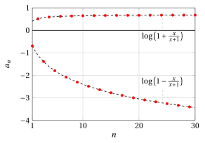

# Properties of sequences

**Exercises · Limits of sequences** · with worked solutions · [:material-file-pdf-box: Lecture notes, volume (PDF)](../pdf/lecture-notes-3-limits.pdf)

!!! esercizio "Exercise 1"

    Consider the sequence

    $$
    a_n = \log \left( 1  +  (-1)^n \frac{n}{n+1}\right), \quad {\rm ~~for~~} n=1,2,3, \dots
    $$

    Questions:

    1. Is the sequence bounded above? If so, determine $\sup \big\{a_n \big\}$.

    2. Does the sequence have a maximum? If so, determine $\max \big\{a_n \big\}$.

    3. Is the sequence bounded below? If so, determine $\inf \big\{a_n \big\}$.

    4. Does the sequence have a minimum? If so, determine $\min \big\{a_n \big\}$.

??? soluzione "Solution"

    For $n=1$ we have

    $$
    \log \left( 1    -1 \: \frac{1}{2}\right) = \log \frac{1}{2} \approx -0.69314.
    $$

    For $n=2$ we have

    $$
    \log \left( 1    +1 \: \frac{2}{3}\right) = \log \frac{5}{3} \approx 0.510826.
    $$

    { .fig .ovale loading=lazy style="width:72%" }

    The presence of the alternating sign $(-1)^n$  suggests studying the behavior of the sequence by distinguishing what happens for even $n$ and odd $n$.

??? soluzione "Solution"

    - If $n$ is even:

        $$
        a_n = \log \left( 1  + \frac{n}{n+1}\right), \quad {\rm ~~for~~} n=2,4,6 \dots
        $$

        hence the argument of the logarithm is

        $$
        1 + \frac{n}{n+1} = 1 + \frac{n+1-1}{n+1} = 2 - \frac{1}{n+1}
        $$

        which varies in

        $$
        \left[\frac{5}{3},2\right) {\rm ~and~the~logarithm~in} \left[\log \frac{5}{3}, \log 2\right),
        $$

        i.e., it is positive and bounded above. Hence

        $$
        \sup \big\{a_n: n {\rm ~~is~even~} \big\} = \log 2 \approx 0.69314
        $$

        but $\log 2$ is not the maximum of these values.

    - If $n$ is odd:

        $$
        a_n = \log \left( 1  - \frac{n}{n+1}\right), \quad {\rm ~~for~~} n=1,3,5 \dots
        $$

        hence the argument of the logarithm is

        $$
        1 - \frac{n}{n+1} = \frac{1}{n+1}
        $$

        which varies in

        $$
        \left(0,\frac{1}{2}\right] {\rm ~and~the~logarithm~in} \left(- \infty, \log \frac{1}{2}\right],
        $$

        i.e., it is negative and, as $n$ increases, it is unbounded below.

    The sequence as a whole is therefore bounded above but not bounded below; it has no maximum (although its $\sup$ is finite) and no minimum (because it is unbounded below).

!!! esercizio "Exercise 2"

    Consider the sequence

    $$
    a_n = e^{-\frac{1}{n}} \: \sin n, \quad {\rm ~~for~~} n=1,2,3, \dots
    $$

    Questions:

    1. Is the sequence bounded above?

    2. Is the sequence bounded below?

    3. Is it eventually positive?

    4. Does it never vanish?

    5. Does it have a limit (finite or infinite)?

??? soluzione "Solution"

    For $n=1$ we have

    $$
    e^{-1} \sin 1 \approx 0.3679	\cdot 0.8415
    \approx 0.309560.
    $$

    For $n=2$ we have

    $$
    e^{-\frac{1}{2}} \sin 2 \approx 0.6065 \cdot	0.9093
    \approx 0.551517.
    $$

    For $n=10$ we have

    $$
    e^{-\frac{1}{10}} \sin 10 \approx 0.9048	\cdot -0.5440
     \approx -0.492251.
    $$

    For $n=20$ we have

    $$
    e^{-\frac{1}{20}} \sin 20 \approx 0.9512	\cdot 0.9129
     \approx 0.8684.
    $$

    { .fig .ovale loading=lazy style="width:72%" }

??? soluzione "Solution"

    The sequence is the product of the sequence

    $$
    n \mapsto e^{- \frac{1}{n}} {\rm ~~with~~} \lim_{n \rr \ip } e^{- \frac{1}{n}} =1,
    $$

    which is bounded, always nonzero, convergent,  and of the sequence

    $$
    n \mapsto \sin n,
    $$

    which is bounded but irregular, and never zero (since $n$ starts from 1, by the irrationality of $\pi$, the angle $n$ is never an integer multiple of $\pi$).

    Hence, the sequence given by the product of these two is bounded, never zero, and irregular.

    Since

    $$
    e^{- \frac{1}{n}} \rr 1
    $$

    and the sign of $\sin n$ is not eventually constant, the sequence given by the product of the two is not eventually positive.

!!! esercizio "Exercise 3"

    Consider the sequence

    $$
    a_n = e^{n} \: \sin n, \quad {\rm ~~for~~} n=1,2,3, \dots
    $$

    Questions:

    1. Is the sequence bounded above?

    2. Is the sequence bounded below?

    3. Is it eventually positive?

    4. Does it never vanish?

    5. Does it have a limit (finite or infinite)?

??? soluzione "Solution"

    For $n=1$ we have

    $$
    e^{1} \sin 1 \approx 2.7183	\cdot 0.8415
    \approx 2.2874.
    $$

    For $n=2$ we have

    $$
    e^{2} \sin 2 \approx 7.3891 \cdot	0.9093
    \approx 6.7188.
    $$

    For $n=5$ we have

    $$
    e^{5} \sin 5 \approx 148.4132	\cdot -0.9589
     \approx -142.3170.
    $$

    { .fig .ovale loading=lazy style="width:72%" }

??? soluzione "Solution"

    The sequence is the product of the sequence

    $$
    n \mapsto e^{n} {\rm ~~with~~} \lim_{n \rr \ip } e^{n} =+\infty,
    $$

    which is unbounded above, bounded below, always nonzero, divergent, and of the sequence

    $$
    n \mapsto \sin n,
    $$

    which is bounded but irregular, and never zero (since $n$ starts from 1, by the irrationality of $\pi$, the angle $n$ is never an integer multiple of $\pi$).

    Hence, the sequence given by the product of these two is unbounded above, unbounded below, never zero, and irregular.

    Since

    $$
    e^{n} \rr +\infty
    $$

    and the sign of $\sin n$ is not eventually constant, the sequence given by the product of the two is not eventually positive.

!!! esercizio "Exercise 4"

    Consider the sequence

    $$
    a_n = \frac{n^{(-1)^n}}{n+1}, \quad {\rm ~~for~~} n=1,2,3, \dots
    $$

    Questions:

    1. Is the sequence bounded above? If so, determine $\sup \big\{a_n \big\}$.

    2. Does the sequence have a maximum? If so, determine $\max \big\{a_n \big\}$.

    3. Is the sequence bounded below? If so, determine $\inf \big\{a_n \big\}$.

    4. Does the sequence have a minimum? If so, determine $\min \big\{a_n \big\}$.

??? soluzione "Solution"

    For $n=1$ we have

    $$
    1^{(-1)^1} \frac{1}{2} = 1 \: \frac{1}{2}
    $$

    For $n=2$ we have

    $$
    2^{(-1)^2} \frac{1}{3} = 2 \: \frac{1}{3}.
    $$

    For $n=3$ we have

    $$
    3^{(-1)^3} \frac{1}{4} = \frac{1}{3} \: \frac{1}{4}.
    $$

    For $n=4$ we have

    $$
    4^{(-1)^4} \frac{1}{5} = 4 \: \frac{1}{5}.
    $$

    { .fig .ovale loading=lazy style="width:72%" }

    The presence of the alternating sign $(-1)^n$  suggests studying the behavior of the sequence by distinguishing what happens for even $n$ and odd $n$.

??? soluzione "Solution"

    - If $n$ is even:

        $$
        a_n = \frac{n}{n+1}, \quad {\rm ~~for~~} n=2,4,6 \dots
        $$

        Adding $+1$ and $-1$ to the numerator, we obtain

        $$
        a_n=\frac{n}{n+1} = \frac{n+1-1}{n+1} = 1 - \frac{1}{n+1}
        $$

        which varies in

        $$
        \left[\frac{2}{3},1\right),
        $$

        i.e., it is positive and bounded above. Hence

        $$
        \sup \big\{a_n: n {\rm ~~is~even~} \big\} = 1
        $$

        but $1$ is not the maximum of these values.

    - If $n$ is odd:

        $$
        a_n = \frac{\frac{1}{n}}{n+1} = \frac{1}{n}\cdot\frac{1}{n+1}=\frac{1}{n(n+1)}, \quad {\rm ~~for~~} n=1,3,5 \dots
        $$

        which varies in

        $$
        \left(0,\frac{1}{2}\right],
        $$

        i.e., it is positive and bounded below. Hence

        $$
        \inf \big\{a_n: n {\rm ~~is~odd~} \big\} = 0
        $$

        but $0$ is not the minimum of these values.

    The sequence as a whole is bounded; it has no maximum (although its $\sup$ is finite) and no minimum (although its $\inf$ is finite).
