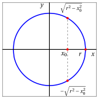
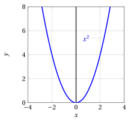
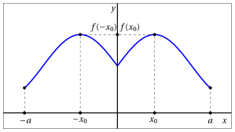
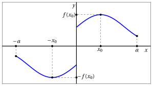
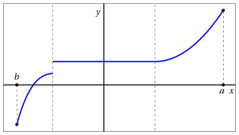

# Real functions of a real variable

**Part 2 · Functions · Chapter 2** · lecture notes by Fabio Furini · [:material-file-pdf-box: Lecture notes, volume (PDF)](../pdf/lecture-notes-2-functions.pdf)

## 1. Real function of a real variable

!!! definizione "Definition 1: real function of a real variable"

    A function whose <em>domain</em> $D$ is a subset of $\mathbb{R}$ and whose <em>codomain</em> is $\mathbb{R}$:

    \begin{align*}
    f&: D \subseteq \mathbb{R} \rightarrow \mathbb{R},~~~f: x \mapsto f(x)
    \end{align*}

    is called a <strong>real function of a real variable</strong>.

- These are functions in which the “input” variable $x$ and the “output” variable $f(x)$ are real numbers.

- The most common real functions of a real variable have as domain $D$ and as image $f(D)$ an <strong>interval</strong> (possibly the whole of $\mathbb{R}$) or the union of a <strong>finite number of intervals</strong>.

!!! chiave ""

    The dependence of the output $f(x)$ on the input $x$ is effectively visualized by drawing the <strong>graph</strong> of $f$, that is, the set of points of the plane with coordinates $(x,y)$ such that $y = f(x)$ and  $x$ in the  domain  $D$. 

    Example of the graph of a real function of a real variable with domain $D = [a, b]$ (a closed and bounded interval): 

    { .fig .ovale loading=lazy style="width:80%" }

    Every line parallel to the $y$-axis that intersects the $x$-axis at a point $x_0$ of the domain $D$ intersects the graph of $f$ at one and only one point.  [^1]  <strong>Therefore, not all curves are graphs of functions</strong>.

    Note, instead, that nothing prevents a line parallel to the $x$-axis from intersecting the graph of $f$ at several points or at no point at all.

!!! esempio "Example 1: curve that does not correspond to the graph of a function"

    Consider, for example, the curve made of the points of the circle of radius $r$:

    $$
    {x^2+y^2=r^2} ~~\Longleftrightarrow~~ y = \pm \sqrt{r^2-x^2}
    $$

    { .fig .ovale loading=lazy style="width:55%" }

    It is not possible to associate a unique output with the input $x_0 \in (-r,r)$, hence this curve does not correspond to the graph of a function!

## 2. Bounded functions

!!! definizione "Definition 2: bounded
functions"

    Given a function $f: D \subseteq \mathbb{R} \rightarrow \mathbb{R}$, the function is said to be

    $$
    \begin{cases}
    {\rm bounded~above} & {\rm if~~} \exists M \in \R: f(x) \le M,~~ \forall  x \in D\\[2ex]
    {\rm bounded~below} & {\rm if~~} \exists M \in \R: f(x) \ge M,~~ \forall  x \in D\\[2ex]
    {\rm bounded} & {\rm if~~} \exists M \in \R_{\ge 0}: |f(x)| \le M,~~ \forall  x \in D\\
    \end{cases}
    $$

- Graphically, we have:

    1. a function is bounded above if its graph is contained in the lower half-plane bounded by a line parallel to the $x$-axis

    2. a function is bounded below if its graph is contained in the upper half-plane bounded by a line parallel to the $x$-axis

    3. a function is bounded if its graph is contained in a horizontal strip

!!! esempio "Example 2: bounded function"

    Consider the function:

    $$
    f: \mathbb{R} \rightarrow \mathbb{R},~~ f: x \mapsto \frac{1}{1 + x^2} +1
    $$

    we have

    $$
    \frac{1}{1 + x^2} +1=  \frac{1+ x^2- x^2}{1 + x^2} +1 = 2- \frac{x^2}{1+x^2} \qquad {\rm ~~and~~} \qquad \frac{x^2}{1+x^2} \ge 0, ~~\forall x \in \R
    $$

    $$
    {\rm ~~~hence~~~}1  < \frac{1}{1 + x^2} +1 \le 2, \forall x \in \mathbb{R}
    $$

    { .fig .ovale loading=lazy style="width:70%" }

!!! esempio "Example 3: Unbounded function"

    The function

    $$
    f: \mathbb{R} \rightarrow \mathbb{R},~~ f: x \mapsto x^3 \qquad (y=x^3)
    $$

    is bounded neither above nor below.

    { .fig .ovale loading=lazy style="width:42%" }

!!! esempio "Example 4: Function bounded below"

    The function

    $$
    f: \mathbb{R} \rightarrow \mathbb{R},~~ f: x \mapsto x^2 \qquad (y=x^2)
    $$

    is bounded below; indeed, $x^2  \ge 0, \forall x \in \mathbb{R}$

    { .fig .ovale loading=lazy style="width:45%" }

- Equivalently, we can say that a function is <em>bounded above </em>(<em>bounded below</em>, <em>bounded</em>) if, respectively, its <strong>image</strong> is a subset of $\mathbb{R}$ that is <em>bounded above</em> (<em>bounded below</em>, <em>bounded</em>).

## 3. Symmetric functions

!!! definizione "Definition 3: even function"

    Functions whose graph is symmetric with respect to the $y$-axis are called <strong>even</strong>.

- They are characterized by the relation

    $$
    f(-x) = f(x)
    $$

    which expresses the equality of the ordinates corresponding to the points $x$ and $-x$, which are symmetric with respect to $x = 0$.

!!! definizione "Definition 4: Odd function"

    Functions whose graph is symmetric with respect to the origin are called <strong>odd</strong>.

- They are characterized by the relation

    $$
    f(-x) = - f(x)
    $$

    which expresses the fact that the ordinates corresponding to the points $x$ and $-x$, which are symmetric with respect to $x = 0$, are the opposite of each other.

!!! esempio "Example 5: Even and odd functions"

    For example, the function $x \mapsto x^2$ is even, while $x  \mapsto x^3$ is odd. More generally, powers with integer exponent are even functions  if the exponent is even and odd functions if the exponent is odd.

1. <strong>Example of the graph of an even function</strong>:

    { .fig .ovale loading=lazy style="width:80%" }

2. <strong>Example of the graph of an odd function</strong>:

    { .fig .ovale loading=lazy style="width:80%" }

!!! chiave ""

    A function <em>cannot</em> have a graph that is symmetric with respect to the $x$-axis, since the correspondence would no longer be single-valued.

## 4. Monotonic functions

!!! definizione "Definition 5: Increasing function"

    A function is called <strong>non-decreasing</strong> if for every pair of points $x_1$, $x_2$ in the domain of $f$ we have:

    \begin{equation}
    x_1 > x_2 ~~\Longrightarrow~~ f(x_1) \ge f(x_2) \label{ed:monCRE}
    \end{equation}

!!! definizione "Definition 6: Strictly increasing function"

    A function is called <strong>increasing</strong>  if for every pair of points $x_1$, $x_2$ in the domain of $f$ we have:

    \begin{equation}
    x_1 > x_2 ~~\Longrightarrow~~ f(x_1) > f(x_2) \label{ed:monCRES}
    \end{equation}

!!! definizione "Definition 7: Decreasing function"

    A function is called <strong>non-increasing</strong> if for every pair of points $x_1$, $x_2$ in the domain of $f$ we have:

    \begin{equation}
    x_1 > x_2 ~~\Longrightarrow~~ f(x_1) \le f(x_2) \label{ed:monDECRE}
    \end{equation}

!!! definizione "Definition 8: Strictly decreasing function"

    A function is called <strong>decreasing</strong>  if for every pair of points $x_1$, $x_2$ in the domain of $f$ we have:

    \begin{equation}
    x_1 > x_2 ~~\Longrightarrow~~ f(x_1) < f(x_2) \label{ed:monDECRES}
    \end{equation}

- A function $f$ is <em>non-decreasing</em> if, as $x$ increases, the corresponding ordinate on the graph of the function does not decrease (hence it either stays the same or increases);

- A function $f$ is <em>non-increasing</em>  if, as $x$ increases, the corresponding ordinate on the graph of the function does not increase (hence it either stays the same or decreases).

!!! chiave ""

    Increasing or decreasing functions are called <strong>monotonic</strong>. Strictly increasing or strictly decreasing functions are called <strong>strictly monotonic</strong>.

!!! esempio "Example 6: Monotonic functions"

    For example, the function $x \mapsto x^3$ is strictly monotonic increasing; the constant function  $x \mapsto k$ (whose graph is the line with equation $y = k$) is both non-decreasing and non-increasing.

1. <strong>Example of the graph of a non-decreasing function</strong> (horizontal segment):

    { .fig .ovale loading=lazy style="width:80%" }

2. <strong>Example of the graph of an increasing function</strong>:

    { .fig .ovale loading=lazy style="width:80%" }

- Increasing or decreasing functions (strictly or not) are called <strong>monotonic</strong>.

## 5. Periodic functions

!!! definizione "Definition 9: Periodic function"

    A (non-constant) function $f:D \rightarrow \mathbb{R}$ is <strong>periodic</strong> with period $T$ , $T > 0$, if $T$ is the smallest positive real number such that

    $$
    f(x+T)=f(x) {\rm~~~for~every~~} x \in D
    $$

- Every interval of length $T$ contained in $D$ is called a <strong>periodicity interval</strong>.

!!! esempio "Example 7: Periodic functions"

    Typical examples of periodic functions are the <em>trigonometric functions</em> $x \mapsto \sin(x)$ ($T=2\:\pi$), $x \mapsto \cos(x)$ ($T=2\:\pi$) and $x \mapsto \tan(x)$ ($T=\pi$).

!!! esempio "Example 8: Graph of periodic functions"

    Graph of a periodic function with period $T=2$:

    { .fig .ovale loading=lazy style="width:80%" }

- Lines parallel to the $x$-axis have equation

    $$
    y = k \qquad k \in \mathbb{R}
    $$

[^1]:  If the line did not intersect the graph, this would mean that no output corresponds to the input $x$. If the line intersected the graph at more than one point, this would mean that several distinct outputs correspond to the input $x$, and hence the function would no longer be single-valued.
