# Power functions

**Part 2 · Functions · Chapter 3** · lecture notes by Fabio Furini · [:material-file-pdf-box: Lecture notes, volume (PDF)](../pdf/lecture-notes-2-functions.pdf)

## 1. Power functions

!!! definizione "Definition 1: power functions"

    Given $\alpha \in \R, \alpha \neq 0$, the function:

    \begin{equation}
    \label{potenze}
    f:D \subseteq \R \rightarrow \mathbb{R},~~~ f:x \mapsto x^{\alpha}
    \end{equation}

    is called the <strong>power function</strong> with exponent $\alpha$. The domain $D$ depends on the value of $\alpha$:

    - with rational exponent $\alpha=\frac{m}{n} \in \Q$,  $m \in \Z$ and $n \in \N_+$ coprime, we have four  cases:

        $$
        D=
        \begin{cases}
         \R & {\rm ~~if~~} n {\rm ~~odd~~}  {\rm ~~and~~~}  \frac{m}{n}>0\\[2ex]
         \R \setminus \{0\} & {\rm ~~if~~} n {\rm ~~odd~~}  {\rm ~~and~~~}  \frac{m}{n}<0\\[2ex]
         [0,\ip) & {\rm ~~if~~} n {\rm ~~even~~}  {\rm ~~and~~~}  \frac{m}{n}>0\\[2ex]
         (0,\ip)  & {\rm ~~if~~} n {\rm ~~even~~}  {\rm ~~and~~~}  \frac{m}{n}<0
        \end{cases}
        $$

    - with real, non-rational exponent $\alpha \in \R \setminus \Q$, we have two cases:

        $$
        D=
        \begin{cases}
         [0,\ip) & {\rm ~~if~~} \alpha >0\\[2ex]
         (0,\ip) & {\rm ~~if~~} \alpha<0
        \end{cases}
        $$

### 1.1 Rational exponent

!!! chiave ""

    With $\alpha=\frac{m}{n} \in \Q$, $m \in \Z$ and $n \in \N_+$ coprime, we have a power function with rational exponent:

    $$
    f:D \subseteq \R \rightarrow \mathbb{R},~~~ f:x \mapsto x^{\frac{m}{n}}=\sqrt[n]{x^m}
    $$

    We have the following three cases, depending on whether $m$ and $n$ are even or odd.

1. With $n$ odd and $m$ even, it is an <strong>even function</strong>, i.e., $(-x)^{\frac{m}{n}}=x^{\frac{m}{n}}$. For the sign and the monotonicity we have:

    $$
    x^{\frac{m}{n}} > 0, ~~~\forall x \in \R \setminus \{0\};\qquad
    x^{\frac{m}{n}} = 0 \Longleftrightarrow x=0 {\rm ~~and~~} \frac{m}{n}>0
    $$

    $$
    \begin{cases}
          {\rm ~~if~~} \frac{m}{n} >0 {\rm ~~~then~} f {\rm ~~is~decreasing~in~} (\im,0] {\rm ~~and~increasing~in~} [0,\ip)\\[3ex]
    {\rm ~~if~~} \frac{m}{n}<0  {\rm ~~~then~}  f {\rm ~~is~increasing~in~} (\im,0) {\rm ~~and~decreasing~in~} (0,\ip)
    \end{cases}
    $$

    

    { .fig .ovale loading=lazy style="width:91%" }

    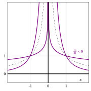{ .fig .ovale loading=lazy style="width:91%" }

    

2. With $n$ odd and $m$ odd, it is an <strong>odd function</strong>, i.e., $(-x)^{\frac{m}{n}}=-x^{\frac{m}{n}}$. For the sign and the monotonicity we have:

    $$
    x^{\frac{m}{n}} < 0, ~ \forall x < 0,~~~~x^{\frac{m}{n}} > 0, ~ \forall x > 0;\qquad
    x^{\frac{m}{n}} = 0 \Longleftrightarrow x=0 {\rm ~~and~~} \frac{m}{n}>0
    $$

    $$
    \begin{cases}
          {\rm ~~if~~} \frac{m}{n} >0 {\rm ~~~then~} f {\rm ~~is~increasing~in~} \R\\[3ex]
    {\rm ~~if~~} \frac{m}{n}<0  {\rm ~~~then~}  f {\rm ~~is~decreasing~in~} (\im,0) {\rm ~~and~in~} (0,\ip)
    \end{cases}
    $$

    

    { .fig .ovale loading=lazy style="width:97%" }

    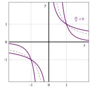{ .fig .ovale loading=lazy style="width:97%" }

    

    

    !!! esempio "Example 1: graphs of power functions with rational exponent $\frac{m}{n}$ and $n$ odd"

        With $m$ even:

        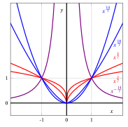{ .fig .ovale loading=lazy style="width:55%" }

        With $m$ odd:

        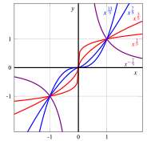{ .fig .ovale loading=lazy style="width:55%" }

3. With $n$ even and $m$ odd ($m$ cannot be even since they are coprime), for the sign and the monotonicity we have:

    $$
    x^{\frac{m}{n}} > 0, ~~~\forall x >0;\qquad
    x^{\frac{m}{n}} = 0 \Longleftrightarrow x=0 {\rm ~~and~~} \frac{m}{n}>0
    $$

    $$
    \begin{cases}
          {\rm ~~if~~} \frac{m}{n} >0 {\rm ~~~then~} f {\rm ~~is~increasing~in~} [0,\ip)\\[3ex]
    {\rm ~~if~~} \frac{m}{n}<0  {\rm ~~~then~}  f {\rm ~~is~decreasing~in~} (0,\ip)
    \end{cases}
    $$

    

    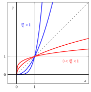{ .fig .ovale loading=lazy style="width:91%" }

    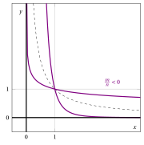{ .fig .ovale loading=lazy style="width:91%" }

    

    

    !!! esempio "Example 2: graphs of power functions with rational exponent $\frac{m}{n}$ and $n$ even"

        { .fig .ovale loading=lazy style="width:55%" }

### 1.2 Real exponent

- With $\alpha \in \R\setminus \Q$, for the sign and the monotonicity we have:

    $$
    x^{\alpha} > 0, ~~~\forall x >0;\qquad
    x^{\alpha} = 0 \Longleftrightarrow x=0 {\rm ~~and~~} \alpha>0
    $$

    $$
    \begin{cases}
          {\rm ~~if~~} \alpha >0 {\rm ~~~then~} f {\rm ~~is~increasing~in~} [0,\ip)\\[2ex]
    {\rm ~~if~~} \alpha<0  {\rm ~~~then~}  f {\rm ~~is~decreasing~in~} (0,\ip)
    \end{cases}
    $$

    

    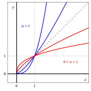{ .fig .ovale loading=lazy style="width:91%" }

    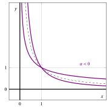{ .fig .ovale loading=lazy style="width:91%" }

    

!!! esempio "Example 3: graphs of power functions with real exponent"

    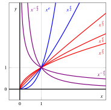{ .fig .ovale loading=lazy style="width:55%" }

<strong>Try it</strong> — the interactive graph below shows what you have just read: move the sliders.

### 1.3 Polynomials

!!! definizione "Definition 2: polynomial"

    Given $n+1$ values $a_i \in \R$ with $i \in \{0,1,\dots,n\}$ and $a_n \neq 0$, the function:

    \begin{equation}
    \label{potenze__2}
    f:\R \rightarrow \mathbb{R},~~~ f:x \mapsto \underbrace{\sum_{i=0}^n a_i \: x^i }_{= P_n(x)}
    \end{equation}

    is called a <strong>polynomial</strong> of degree $n$.

- For each <strong>monomial</strong> $i \in \{0,1,\dots,n\}$:

    1. the value $a_i$ is the <strong>coefficient of the monomial</strong>

    2. the power function $x^i$ with integer exponent $i$  is the <strong>literal part</strong> of the monomial

    The value $a_0$ is the <strong>constant term</strong> of the polynomial since $x^0=1.$

!!! esempio "Example 4: polynomial"

    For example, with $n=4$,  $a_0=1$, $a_1=-2$, $a_2=0$, $a_3=\frac{1}{2}$ and $a_4=\frac{1}{9}$  we have the following polynomial of degree four:

    $$
    P_4(x) = \sum_{i=0}^4 a_i \: x^i = 1 - 2 \; x + \frac{1}{2} \; x^3 + \frac{1}{9} \; x^4
    $$

    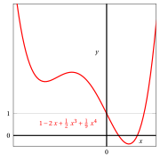{ .fig .ovale loading=lazy style="width:55%" }

## 2. Direct and inverse proportionality functions

!!! chiave ""

    With $\alpha = 1$ and given $\lambda \in \mathbb{R}$, we have the family of <strong>direct proportionality (or linear) functions</strong>:

    $$
    f:\R \rightarrow \mathbb{R},~~~ f:x \mapsto \lambda \: x  {\rm ~~~~where~~}  \lambda {\rm ~~is~the~constant~of~direct~proportionality}
    $$

    Moreover, $\lambda= \tan \vartheta$ and $\vartheta$ is the angle between the line $y=\lambda \: x$ and the $x$-axis.

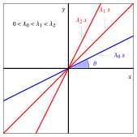{ .fig .ovale loading=lazy style="width:91%" }

{ .fig .ovale loading=lazy style="width:91%" }

!!! chiave ""

    With $\alpha = -1$ and given $\lambda \in \mathbb{R}$, we have the family of <strong>inverse proportionality functions (or rectangular hyperbolas)</strong>:

    $$
    f:\R \setminus \{0\} \rightarrow \mathbb{R},~~~ f:x \mapsto \frac{\lambda}{x}  {\rm ~~~~where~~}  \lambda {\rm ~~is~the~constant~of~inverse~proportionality}
    $$

{ .fig .ovale loading=lazy style="width:91%" }

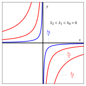{ .fig .ovale loading=lazy style="width:91%" }

!!! chiave ""

    Given $\alpha \in \R$ and $\lambda \in \mathbb{R}$, we have the family of <strong>power functions multiplied by a constant</strong>:

    $$
    f:D \subseteq \R \rightarrow \mathbb{R},~~~ f:x \mapsto \lambda \: x^{\alpha}  {\rm ~~~~where~~}  \lambda {\rm ~~is~the~multiplicative~constant}
    $$

- For example, with $\alpha$ equal  to $2$ or equal to $3$ and $\lambda \in \R$  we have:

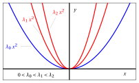{ .fig .ovale loading=lazy style="width:55%" }

{ .fig .ovale loading=lazy style="width:55%" }

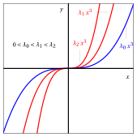{ .fig .ovale loading=lazy style="width:91%" }

{ .fig .ovale loading=lazy style="width:91%" }

- For example, with $\alpha=\frac{1}{2}$ and $\lambda \in \R$  we have:

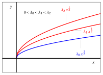{ .fig .ovale loading=lazy style="width:61%" }

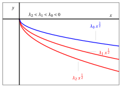{ .fig .ovale loading=lazy style="width:61%" }
