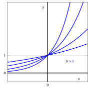
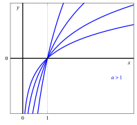
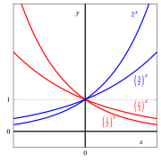

# Exponential and logarithmic functions

**Part 2 · Functions · Chapter 4** · lecture notes by Fabio Furini · [:material-file-pdf-box: Lecture notes, volume (PDF)](../pdf/lecture-notes-2-functions.pdf)

## 1. Exponential functions

!!! definizione "Definition 1: exponential functions"

    Given $b \in \R_+\setminus \{1\}$, the function:

    \begin{equation}
    \label{epeonziali}
    f: \mathbb{R} \rightarrow \mathbb{R},~~~ f:x \mapsto  b^x
    \end{equation}

    is called the <strong>exponential function</strong> with base $b$.

- Regarding positivity and monotonicity, we have:

    $$
    b^x> 0, ~~~\forall x \in \R  {\rm ~~~and~~~}
    \begin{cases}
          {\rm ~~if~~} 0 < b < 1 {\rm ~~~then~} f {\rm ~~is~decreasing~on~} \R\\[3ex]
    {\rm ~~if~~} b > 1   {\rm ~~~then~}  f {\rm ~~is~increasing~on~} \R
    \end{cases}
    $$

{ .fig .ovale loading=lazy style="width:97%" }

{ .fig .ovale loading=lazy style="width:97%" }

## 2. Logarithmic functions

!!! definizione "Definition 2: logarithmic functions"

    Given $a \in \R_{>0}\setminus \{1\}$, the function:

    \begin{equation}
    \label{epeonziali__2}
    f: (0,+\infty) \rightarrow \mathbb{R},~~~ f:x \mapsto \log_a x
    \end{equation}

    is called the <strong>logarithmic function</strong> with base $a$.

- Regarding positivity and monotonicity, we have:

    $$
    \begin{cases}
    {\rm ~~if~~} 0 < a < 1 & \log_a x > 0,~~ \forall x \in (0,1),~~\log_a x < 0,~~ \forall x \in (1,\ip){\rm ~~~and~~~} f {\rm ~~is~decreasing~on~} \R_{>0}  \\[4ex]
    {\rm ~~if~~} a > 1 & \log_a x < 0,~~ \forall x \in (0,1),~~\log_a x > 0,~~ \forall x \in (1,\ip) {\rm ~~~and~~~} f {\rm ~~is~increasing~on~} \R_{>0} 
    \end{cases}
    $$

    Moreover, we have:

    $$
    \log_a x = 0 \Longleftrightarrow x=1,~~~ \forall  a \in \R_{>0}\setminus \{1\}
    $$

{ .fig .ovale loading=lazy style="width:97%" }

{ .fig .ovale loading=lazy style="width:97%" }

<strong>Try it</strong> — the interactive graph below shows what you have just read: move the sliders.

## 3. Change of base

!!! chiave ""

    Given any base $c \in \R_{>0}\setminus \{1\}$, all exponential and logarithmic functions can be rewritten in terms of another base $d \in \R_{>0} \setminus \{1\}$ as follows:

    $$
    c^x = d^{\log_d c^x}   = d^{x \; \log_d c}  {\rm ~~~~~hence~with~~}   \lambda = \log_d c {\rm ~~~~we~get~~~~~} c^x = d^{\lambda \; x}
    $$

    $$
    \log_c x = \frac{\log_d x}{\log_d c} {\rm ~~~~~hence~with~~}   \lambda=\frac{1}{\log_d c} {\rm ~~~~we~get~~~~~} \log_c x= \lambda \; \log_d x
    $$

    The logarithmic function with base $e$ is also written $\log x$ or $\ln x$, while the one with base $2$ is also written $\lg x$.

!!! esempio "Example 1: graphs of exponential and logarithmic functions "

    Exponential functions:

    { .fig .ovale loading=lazy style="width:58%" }

    Logarithmic functions:

    { .fig .ovale loading=lazy style="width:58%" }
