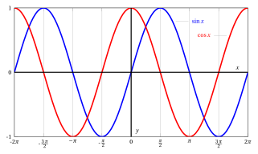
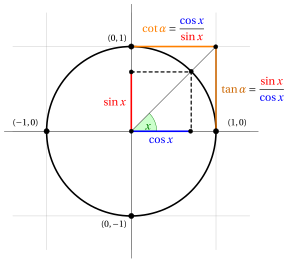
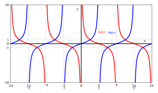
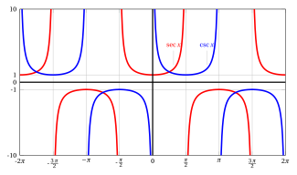

# Trigonometric functions

**Part 2 · Functions · Chapter 5** · lecture notes by Fabio Furini · [:material-file-pdf-box: Lecture notes, volume (PDF)](../pdf/lecture-notes-2-functions.pdf)

## 1. Trigonometric functions

!!! definizione "Definition 1: sine function and cosine function"

    The trigonometric functions:

    \begin{align}
    \label{seno}  f: \mathbb{R} \rightarrow \mathbb{R},~~~ f: x \mapsto \sin x \\[2ex] 
     \label{coseno}
    f: \mathbb{R} \rightarrow \mathbb{R},~~~ f: x \mapsto \cos x
    \end{align}

    are called <strong>sine</strong> and <strong>cosine</strong>.

- The sine is an <strong>odd</strong> function, while the cosine is an <strong>even</strong> function. Hence we have:

    $$
    \sin(-x)=-\sin x, ~~~\forall x \in \R {\rm ~~~~and~~~~} \cos(-x)=\cos x, ~~~\forall x \in \R
    $$

- The sine and the cosine are periodic functions with period:

    $$
    T=2\: \pi {\rm ~~~~and~we~have~the~fundamental~identity~~~} \sin^2 x + \cos^2 x = 1,~~ \forall x \in \mathbb{R}
    $$

    { .fig .ovale loading=lazy style="width:80%" }

    We have

    $$
    \cos\left(x -\frac{\pi}{2}\right) = \sin x,~~ \forall x \in \mathbb{R}
    $$

- From the sign and the monotonicity of the sine function we have:

    $$
    \sin x = 0 \Longleftrightarrow x= k\;\pi,~ \forall k \in \Z \qquad 
    \begin{cases}
    \sin x > 0 & {\rm if~~~}  x \in (2\;k\;\pi~,~ 2\;k\;\pi + \pi),~ \forall k \in \Z    \\[3ex]
    \sin x < 0 & {\rm if~~~}  x \in (2\;k\;\pi-\pi~,~ 2\;k\;\pi),~ \forall k \in \Z    
    \end{cases}
    $$

    $$
    \begin{cases}
    {\rm if~~~}  x \in (2\;k\;\pi- \frac{\pi}{2},~ 2\;k\;\pi + \frac{\pi}{2}),~ \forall k \in \Z   & f {\rm ~~is~increasing}  \\[3ex]
    {\rm if~~~}  x \in (2\;k\;\pi+ \frac{\pi}{2}~,~ 2\;k\;\pi + \frac{3\;\pi}{2}),~ \forall k \in \Z   & f {\rm ~~is~decreasing}    
    \end{cases}
    $$

- From the sign and the monotonicity of the cosine function we have:

    $$
    \cos x = 0 \Longleftrightarrow x= k\;\pi-\frac{\pi}{2},~ \forall k \in \Z \qquad 
    \begin{cases}
    \cos x > 0 & {\rm if~~~}  x \in (2\;k\;\pi~-\frac{\pi}{2},~ 2\;k\;\pi + \frac{\pi}{2}),~ \forall k \in \Z    \\[3ex]
    \cos x < 0 & {\rm if~~~}  x \in (2\;k\;\pi+\frac{\pi}{2}~,~ 2\;k\;\pi +\frac{3\;\pi}{2}),~ \forall k \in \Z    
    \end{cases}
    $$

    $$
    \begin{cases}
    {\rm if~~~}  x \in (2\;k\;\pi+ \pi,~ 2\;k\;\pi + 2\; \pi),~ \forall k \in \Z   & f {\rm ~~is~increasing}  \\[3ex]
    {\rm if~~~}  x \in (2\;k\;\pi ~,~ 2\;k\;\pi + \pi),~ \forall k \in \Z   & f {\rm ~~is~decreasing}    
    \end{cases}
    $$

!!! chiave ""

    The trigonometric functions:

    \begin{align}
    \label{tangente} f: \mathbb{R} \setminus \{k\;\pi-\frac{\pi}{2},~ \forall k \in \Z\}  \rightarrow \mathbb{R},~~~ f: x \mapsto \tan x = \frac{\sin x}{\cos x} \\[2ex] 
     \label{cotangente}
    f: \mathbb{R}\setminus \{k\;\pi,~ \forall k \in \Z\}  \rightarrow \mathbb{R},~~~ f: x \mapsto \cot x = \frac{\cos x}{\sin x}
    \end{align}

    are called <strong>tangent</strong> and <strong>cotangent</strong>; they are both odd and periodic with period $T=\pi$.

{ .fig .ovale loading=lazy style="width:60%" }

{ .fig .ovale loading=lazy style="width:80%" }

!!! chiave ""

    The trigonometric functions:

    \begin{align}
    \label{secante} f: \mathbb{R} \setminus \{k\;\pi-\frac{\pi}{2},~ \forall k \in \Z\}  \rightarrow \mathbb{R},~~~ f: x \mapsto \sec x = \frac{1}{\cos x} \\[2ex] 
     \label{cosecante}
    f: \mathbb{R}\setminus \{k\;\pi,~ \forall k \in \Z\}  \rightarrow \mathbb{R},~~~ f: x \mapsto \csc x = \frac{1}{\sin x}
    \end{align}

    are called <strong>secant</strong> and <strong>cosecant</strong> and they are periodic with period $T=2\;\pi$. The secant function is even, while the cosecant function is odd.

{ .fig .ovale loading=lazy style="width:80%" }

## 2. Values of the trigonometric functions

<table>
<tr>
<td></td>
<td>\(\cos\)</td>
<td>\(\sin\)</td>
<td>\(\tan\)</td>
<td>\(\cot\)</td>
<td>\(\sec\)</td>
<td>\(\csc\)</td>
</tr>
<tr>
<td>0</td>
<td>1</td>
<td>0</td>
<td>0</td>
<td>\(\pm \infty\)</td>
<td>1</td>
<td>\(\pm \infty\)</td>
</tr>
<tr>
<td>\(x=\frac{\pi}{6}\) (\(30^{\circ}\))</td>
<td>\(\frac{\sqrt{3}}{2}\)</td>
<td>\(\frac{1}{2}\)</td>
<td>\(\frac{\sqrt{3}}{3}\)</td>
<td>\(\sqrt{3}\)</td>
<td>\(\frac{2}{3}\:\sqrt{3}\)</td>
<td>2</td>
</tr>
<tr>
<td>\(x=\frac{\pi}{4}\) (\(45^{\circ}\))</td>
<td>\(\frac{\sqrt{2}}{2}\)</td>
<td>\(\frac{\sqrt{2}}{2}\)</td>
<td>1</td>
<td>1</td>
<td>\(\sqrt{2}\)</td>
<td>\(\sqrt{2}\)</td>
</tr>
<tr>
<td>\(x=\frac{\pi}{3}\) (\(60^{\circ}\))</td>
<td>\(\frac{1}{2}\)</td>
<td>\(\frac{\sqrt{3}}{2}\)</td>
<td>\(\sqrt{3}\)</td>
<td>\(\frac{\sqrt{3}}{3}\)</td>
<td>2</td>
<td>\(\frac{2}{3}\: \sqrt{3}\)</td>
</tr>
<tr>
<td>\(x=\frac{\pi}{2}\) (\(90^{\circ}\))</td>
<td>0</td>
<td>1</td>
<td>\(\pm \infty\)</td>
<td>0</td>
<td>\(\pm \infty\)</td>
<td>1</td>
</tr>
<tr>
<td>\(x=\pi\) (\(180^{\circ}\))</td>
<td>\-1</td>
<td>0</td>
<td>0</td>
<td>\(\pm \infty\)</td>
<td>\-1</td>
<td>\(\pm \infty\)</td>
</tr>
</table>

{ .fig .ovale loading=lazy style="width:68%" }

<table>
<tr>
<td></td>
<td>\(\phantom{-} \cos\)</td>
<td>\(\phantom{-} \sin\)</td>
<td>\(\phantom{-} \tan\)</td>
<td>\(\phantom{-} \cot\)</td>
</tr>
<tr>
<td>\(\phantom{-}x\)</td>
<td>\(\phantom{-} \cos x\)</td>
<td>\(\phantom{-} \sin x\)</td>
<td>\(\phantom{-} \tan x\)</td>
<td>\(\phantom{-} \cot x\)</td>
</tr>
<tr>
<td>\(-x\)</td>
<td>\(\phantom{-} \cos x\)</td>
<td>\(- \sin x\)</td>
<td>\(-\tan x\)</td>
<td>\(-\cot x\)</td>
</tr>
<tr>
<td>\(\frac{\pi}{2} +x\)</td>
<td>\(-\sin x\)</td>
<td>\(\phantom{-} \cos x\)</td>
<td>\(-\cot x\)</td>
<td>\(-\tan x\)</td>
</tr>
<tr>
<td>\(\frac{\pi}{2} - x\)</td>
<td>\(\phantom{-} \sin x\)</td>
<td>\(\phantom{-} \cos x\)</td>
<td>\(\phantom{-} \cot  x\)</td>
<td>\(\phantom{-} \tan x\)</td>
</tr>
<tr>
<td>\(\pi+x\)</td>
<td>\(-\cos x\)</td>
<td>\(-\sin x\)</td>
<td>\(\phantom{-} \tan x\)</td>
<td>\(\phantom{-} \cot x\)</td>
</tr>
<tr>
<td>\(\pi-x\)</td>
<td>\(-\cos x\)</td>
<td>\(\phantom{-} \sin x\)</td>
<td>\(-\tan x\)</td>
<td>\(-\cot x\)</td>
</tr>
</table>

## 3. Main trigonometric formulas

<strong>Relations among the trigonometric functions</strong>

!!! chiave ""

    
<table>
    <tr>
    <td></td>
    <td>\(\sin x\)</td>
    <td>\(\cos x\)</td>
    <td>\(\tan x\)</td>
    <td>\(\cot x\)</td>
    </tr>
    <tr>
    <td>\(\sin x\)</td>
    <td>\-</td>
    <td>\(\pm \sqrt{1 - \cos^2 x}\)</td>
    <td>\(\pm \sqrt{\frac{\tan^2 x}{1 + \tan^2 x}}\)</td>
    <td>\(\pm \sqrt{\frac{1}{1 + \cot^2 x}}\)</td>
    </tr>
    <tr>
    <td>\(\cos x\)</td>
    <td>\(\pm \sqrt{1 - \sin^2 x}\)</td>
    <td>\-</td>
    <td>\(\pm \sqrt{\frac{1}{1 + \tan^2 x}}\)</td>
    <td>\(\pm \sqrt{\frac{\cot^2 x}{1 + \cot^2 x}}\)</td>
    </tr>
    <tr>
    <td>\(\tan x\)</td>
    <td>\(\pm\sqrt{\frac{\sin^2 x}{1 - \sin^2 x}}\)</td>
    <td>\(\pm\sqrt{\frac{1- \cos^2 x}{\cos^2 x}}\)</td>
    <td>\-</td>
    <td>\(\frac{1}{\cot x}\)</td>
    </tr>
    <tr>
    <td>\(\cot x\)</td>
    <td>\(\pm\sqrt{\frac{1- \sin^2 x}{\sin^2 x}}\)</td>
    <td>\(\pm\sqrt{\frac{\cos^2 x}{1 - \cos^2 x}}\)</td>
    <td>\(\frac{1}{\tan x}\)</td>
    <td>\-</td>
    </tr>
    </table>

    where the symbol $\pm$ means that the sign depends on the quadrant in which $x$ lies

<strong>Addition and subtraction</strong>

!!! chiave ""

    \begin{align}
    \label{trig:add}
    \sin ( x_1 \pm x_2)  &= \sin x_1 \: \cos x_2 \pm \sin x_2 \: \cos x_1\\[2ex]
    \cos ( x_1 \pm x_2)  &= \cos x_1 \: \cos x_2 \mp \sin x_1 \: \sin x_2
    \end{align}

!!! chiave ""

    \begin{align}
    \tan ( x_1 \pm x_2)  &= \frac{\tan x_1 \pm \tan x_2}{1 \mp \tan x_1 \: \tan x_2}\\[2ex]
    \cot ( x_1 \pm x_2)  &= \frac{\cot x_1 \: \cot x_2 \mp 1}{\cot x_2 \pm \cot x_1}
    \end{align}

<strong>Double-angle formulas</strong>

!!! chiave ""

    \begin{align}
    \sin ( 2\: x)  &= 2\: \sin x \: \cos x \\[2ex]
    \cos ( 2\: x)  &= \cos^2 x - \sin^2 x \nonumber\\[2ex]
                        &= 2\: \cos^2 x - 1 \nonumber\\[2ex]
                        &= 1 - 2\: \sin^2 x
    \end{align}

!!! chiave ""

    \begin{align}
    \tan ( 2\: x)  &= \frac{2 \:\tan x}{1 - \tan^2 x}\\[2ex]
    \cot ( 2\: x)  &= \frac{\cot^2 x -1}{2\: \cot x}
    \end{align}

<strong>Triple-angle formulas</strong>

!!! chiave ""

    \begin{align}
    \sin ( 3\: x)  &= 3\: \sin x - 4\: \sin^3 x \\[2ex]
    \cos ( 3\: x)  &= 4\: \cos^3 x - 3\: \cos x
    \end{align}

<strong>Half-angle formulas</strong>

!!! chiave ""

    \begin{align}
    \sin  \frac{x}{2}  &= \pm \sqrt{\frac{1 - \cos x}{2}}\\[2ex]
    \cos  \frac{x}{2}  &= \pm \sqrt{\frac{1 + \cos x}{2}}
    \end{align}

!!! chiave ""

    \begin{align}
    \tan  \frac{x}{2}  &= \pm \sqrt{\frac{1 - \cos x}{1 + \cos x}} \nonumber\\[2ex]
        &= \frac{\sin x}{1 + \cos x} \nonumber\\[2ex]
        &= \frac{1 - \cos x}{\sin x}
    \end{align}

!!! chiave ""

    \begin{align}
    \cot  \frac{x}{2}  &= \pm \sqrt{\frac{1 + \cos x}{1 - \cos x}} \nonumber\\[2ex]
        &= \frac{\sin x}{1 - \cos x} \nonumber\\[2ex]
        &= \frac{1 + \cos x}{\sin x}
    \end{align}

<strong>Parametric formulas (tangent half-angle substitution)</strong>

!!! chiave ""

    \begin{align}
    \sin {x}  &= \frac{2\: \tan \frac{{x}}{2}}{1+ \tan^2 \frac{{x}}{2}}\\[2ex]
    \cos {x}  &= \frac{1- \tan^2 \frac{{x}}{2}}{1+ \tan^2 \frac{{x}}{2}}
    \end{align}

<strong>Sum-to-product formulas (prosthaphaeresis)</strong>

!!! chiave ""

    \begin{align}
    \sin  {x_1} + \sin {x_2}  &= \phantom{-} 2\: \sin \frac{x_1 + x_2}{2} \: \cos \frac{x_1 - x_2}{2}\\[2ex]
    \sin  {x_1} - \sin {x_2}  &= \phantom{-}2\: \sin \frac{x_1 - x_2}{2} \: \cos \frac{x_1 + x_2}{2}\\[2ex]
    \cos  {x_1} + \cos {x_2}  &= \phantom{-}2\: \cos \frac{x_1 + x_2}{2} \: \cos \frac{x_1 - x_2}{2}\\[2ex]
    \cos  {x_1} - \cos {x_2}  &= - 2\: \sin \frac{x_1 + x_2}{2} \: \sin \frac{x_1 - x_2}{2}
    \end{align}

<strong>Product-to-sum formulas (Werner's formulas)</strong>

!!! chiave ""

    \begin{align}
    \sin  {x_1} \: \sin {x_2}  &= \frac{1}{2} \bigg(\cos(x_1-x_2) - \cos(x_1 +x_2) \bigg)\\[2ex]
    \sin  {x_1} \: \cos {x_2}  &= \frac{1}{2} \bigg(\sin(x_1-x_2) + \sin(x_1 +x_2) \bigg)\\[2ex]
    \cos  {x_1} \: \cos {x_2}  &= \frac{1}{2} \bigg(\cos(x_1-x_2) + \cos(x_1 +x_2) \bigg)
    \end{align}

<strong>Additional formulas</strong>

!!! chiave ""

    \begin{align}
    \sin^2 x  &= \frac{1 - \cos (2\:x)}{2}\\[2ex]
    \cos^2 x  &= \frac{1 + \cos (2\:x)}{2}\\[2ex]
    \sin  x \:\cos x  &= \frac{\sin (2\:x)}{2}
    \end{align}
