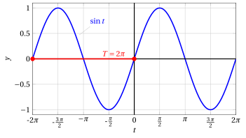
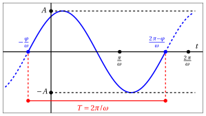
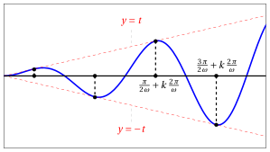
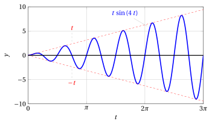
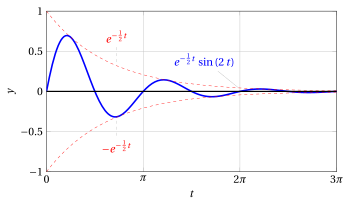

# Vibration phenomena

**Part 2 · Functions · Chapter 6** · lecture notes by Fabio Furini · [:material-file-pdf-box: Lecture notes, volume (PDF)](../pdf/lecture-notes-2-functions.pdf) · [:material-presentation: Slides (PDF)](../pdf/slides-functions-06-oscillations.pdf)

## 1. Vibration phenomena

- We have seen that the sine and cosine functions are periodic with <strong>period</strong> $2\: \pi$. We will use the variable $t$ to denote time.

    { .fig .ovale loading=lazy style="width:80%" }

- Recall that $\sin (t + \varphi)$ corresponds to a <strong>phase shift</strong> $\varphi$ (horizontal translation).

    { .fig .ovale loading=lazy style="width:80%" }

!!! chiave ""

    The functions:

    \begin{equation}
    \label{trig_vibr}
    t \mapsto a\: \sin \:(\omega \: t), \qquad\qquad t \mapsto b\: \cos \:(\omega \: t)
    \end{equation}

    where $a$, $b$ and $\omega$ are positive real numbers, are called <strong>elementary vibrations</strong>.  They are periodic functions with

    $$
    {\rm \textbf{period}~~~} T = \frac{2\:\pi}{\omega}
    $$

!!! esempio "Example 1: period"

    For example, considering $t' = t + \frac{2\: \pi}{\omega}$:

    $$
    \sin \left[ \omega \underbrace{\left( t + \frac{2\: \pi}{\omega} \right)}_{t'}\right] = \sin (\omega \: t + 2\: \pi) = \sin \omega \: t
    $$

- Clearly we have:

    $$
    |a\: \sin \:(\omega \: t)| \le a \qquad{\rm ~~and~~}\qquad |b\: \cos \:(\omega \: t)| \le b
    $$

!!! chiave ""

    The functions \(\eqref{trig_vibr}\) describe elementary vibrations characterized by

    $$
    {\rm \textbf{amplitude}~~} a {\rm ~~and~~} b {\rm ~~~~(respectively)}
    $$

    $$
    {\rm \textbf{angular frequency}~~} \omega = \frac{2\: \pi}{T}
    $$

    also called <em>angular velocity</em>, which indicates how many periods there are in an interval of length $2\: \pi$. Moreover, they are characterized by the

    $$
    {\rm \textbf{frequency}~~} \nu = \frac{\omega}{2\:\pi}
    $$

    which indicates how many times the function repeats itself in an interval of length $1$

!!! esempio "Example 2: of amplitude, angular frequency and frequency"

    $$
    t \mapsto 2\: \sin \:\left( \frac{3}{2} \: t \right) \qquad a=2,~ \omega=\frac{3}{2},~ T=\frac{4\:\pi}{3}
    $$

    { .fig .ovale loading=lazy style="width:80%" }

    The angular frequency $\omega=\frac{3}{2}$ means that there are 1.5 periods in an interval of length $2 \: \pi$. The frequency $\nu$ is $\frac{3}{4\:\pi}$.

- The function

    \begin{equation}
    \label{EEE}
    h(t) = a\: \sin \:(\omega \: t) + b\: \cos \:(\omega \: t)
    \end{equation}

    describes the <strong>superposition</strong> of the two elementary vibrations with the <strong>same angular frequency</strong> $\omega$. The latter is again an elementary vibration, <strong>phase-shifted</strong> with respect to the previous ones.

- Indeed, setting

    $$
    A= \sqrt{a^2 + b^2}
    $$

    we can write

    \begin{equation}
    \label{EEEE}
    h(t) = A \: \underbrace{\frac{a}{ \sqrt{a^2 + b^2}}}_{\alpha} \: \sin \:(\omega \: t) + A \: \underbrace{\frac{b}{ \sqrt{a^2 + b^2}}}_{\beta} \: \cos \:(\omega \: t)
    \end{equation}

- Now observe that the numbers

    $$
    \alpha=\frac{a}{ \sqrt{a^2 + b^2}} {\rm ~~and~~} \beta=\frac{b}{ \sqrt{a^2 + b^2}}
    $$

    satisfy the conditions

    $$
    -1 \le \alpha \le 1 \qquad -1 \le \beta \le 1 \qquad  \alpha^2 + \beta^2=1
    $$

    Hence there exists a <strong>unique angle</strong> $\varphi$ such that

    $$
    \cos \varphi = \alpha \qquad \sin \varphi = \beta
    $$

    so that \(\eqref{EEEE}\) can be rewritten in the following form

    \begin{align}
    \label{EEEEE}
    h(t) & = A \: \cos \varphi \: \sin (\omega \:t) + A \: \sin \varphi \: \cos (\omega \:t)\nonumber\\[2ex]
         & = A \: \sin (\omega\:t + \varphi)
    \end{align}

    Therefore $h(t)$ represents an elementary vibration with amplitude $A$, angular frequency $\omega$, phase-shifted by an angle $\varphi$.

    { .fig .ovale loading=lazy style="width:80%" }

In summary:

!!! chiave ""

    \begin{align*}
    a\: \sin \:(\omega \: t) + b\: \cos \:(\omega \: t) = A \: \sin (\omega\:t + \varphi)\\[2ex]
    A = \sqrt{a^2 + b^2} \qquad 
    \begin{cases}
    a= A \: \cos \varphi \\
    b= A \: \sin \varphi 
    \end{cases}
    \end{align*}

- Under fairly general conditions, a periodic natural phenomenon can be written as the superposition of a finite or infinite number of elementary vibrations with different frequencies (<strong>Fourier series</strong>).

<strong>Try it</strong> — the interactive graph below shows what you have just read: move the sliders.

## 2. Damping and amplification effects

- By multiplying an elementary vibration by <strong>powers</strong> or <strong>exponentials</strong>, we can model <strong>damping</strong> or <strong>amplification</strong> effects.

<strong>First example</strong>

- For example, consider the function

    $$
    h(t) = t \: \sin \:(\omega \: t)
    $$

    which models an <strong>amplified vibration</strong>.

- Since $-1 \le \sin \:(\omega \: t) \le 1$, we have

    $$
    -t \le t \: \sin \:(\omega \: t) \le t
    $$

    and hence the graph of $h(t)$ lies between the graphs of the lines with equations $y = -t$, $y = t$.

- At the points where

    $$
    \sin \:(\omega\:t) = 1
    $$

    i.e.,

    $$
    t = \frac{\pi}{2 \: \omega} + k \: \frac{2\:\pi}{\omega} \qquad (k=0,1,2,\dots)
    $$

    the graph of $h(t)$ touches that of $y=t$.

- At the points where

    $$
    \sin \:(\omega\:t) = -1
    $$

    i.e.,

    $$
    t = \frac{3\: \pi}{2 \: \omega} + k \: \frac{2\:\pi}{\omega} \qquad (k=0,1,2,\dots)
    $$

    the graph of $h(t)$ touches that of $y=-t$.

    { .fig .ovale loading=lazy style="width:80%" }

- From the graph we can see that multiplication by $t$ has the effect of amplifying the vibration as $t$ increases.

{ .fig .ovale loading=lazy style="width:80%" }

{ .fig .ovale loading=lazy style="width:80%" }

<strong>Second example</strong>

- For example, consider the function

    $$
    k(t) = e^{-\alpha\:t} \: \sin \:(\omega \: t) \qquad (\alpha > 0)
    $$

    which models a <strong>damped vibration</strong>.

- Recalling that

    $$
    e^{-\alpha\:t} = \left(\frac{1}{e^{\alpha}}\right)^t
    $$

    is an exponential with base less than $1$, considerations analogous to those made for the function $h(t)$ show that the graph of $k$ lies between the graphs of the functions

    $$
    y_1 = e^{-\alpha\:t} {\rm ~~~~and~~~~} y_2 = -e^{-\alpha\:t}
    $$

    as shown in the figure:

{ .fig .ovale loading=lazy style="width:80%" }

{ .fig .ovale loading=lazy style="width:80%" }
