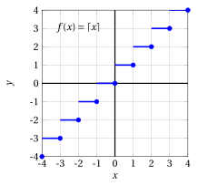
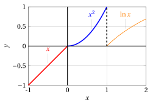

# Integer part and fractional part functions

**Part 2 · Functions · Chapter 7** · lecture notes by Fabio Furini · [:material-file-pdf-box: Lecture notes, volume (PDF)](../pdf/lecture-notes-2-functions.pdf)

## 1. Integer part and fractional part functions

- Two functions that are typically encountered when writing <em>algorithms</em> are the integer part (floor) function and the fractional part (or decimal part) function.

!!! definizione "Definition 1: of the integer part function"

    The <strong>integer part (floor) function</strong> is:

    \begin{equation}
    \label{parte_int}
    f: \mathbb{R} \rightarrow \mathbb{Z}, x \mapsto [x] \qquad ({\rm or~~ x \mapsto \lfloor x \rfloor})
    \end{equation}

!!! definizione "Definition 2: of the upper integer part function"

    The <strong>upper integer part (ceiling) function</strong> is:

    \begin{equation}
    \label{parte_ceil}
    f: \mathbb{R} \rightarrow \mathbb{Z}, x \mapsto \lceil x \rceil
    \end{equation}

!!! definizione "Definition 3: of the fractional part function"

    The <strong>fractional part function</strong> is:

    \begin{equation}
    \label{parte_int__2}
    f: \mathbb{R} \rightarrow [0, 1), x \mapsto (x)
    \end{equation}

- The integer part function $f(x)= \lfloor x \rfloor$ is <em>monotone increasing</em>, like the upper integer part function  $f(x)= \lceil x \rceil$.

- Graphs of the functions $f(x)=\lceil x \rceil$ and  $f(x)= \lfloor x \rfloor$  on the interval $[-4,4]$.

    { .fig .ovale loading=lazy style="width:61%" }

    { .fig .ovale loading=lazy style="width:61%" }

- Note that the fractional part is a periodic function with period 1:

    { .fig .ovale loading=lazy style="width:80%" }

## 2. Piecewise-defined functions

- Starting from the elementary functions, new ones can be built by using <strong>different analytic definitions on different intervals</strong>.

!!! definizione "Definition 4: of piecewise-defined function"

    A function $f$ whose value $f (x)$ is computed through different “instructions” depending on the interval in which $x$ lies is called a <strong>piecewise-defined function</strong>.

!!! esempio "Example 1: Piecewise-defined functions"

    Consider for example

    $$
    f(x)=
    \begin{cases}
    \ln x & {\rm if~~} x > 1,\\
    x^2 & {\rm if~~} 0 < x \le 1,\\
    x & {\rm if~~} x \le 0
    \end{cases}
    $$

    its graph is:

    { .fig .ovale loading=lazy style="width:80%" }

- From the <em>logical</em> / <em>algorithmic</em> point of view, one can say that a function of this kind has the peculiarity of being built using not only mathematical functions  but also the <strong>logical function</strong> “if … then”.
