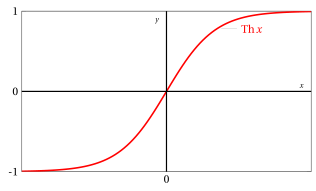

# Hyperbolic functions

**Part 2 · Functions · Chapter 8** · lecture notes by Fabio Furini · [:material-file-pdf-box: Chapter PDF](../pdf/functions-08-hyperbolic-functions.pdf)

## 1. Hyperbolic functions

!!! definizione "Definition 1: hyperbolic sine function and hyperbolic cosine function"

    The hyperbolic functions:

    \begin{align}
    \label{seno_iper}  f: \mathbb{R} \rightarrow \mathbb{R},~~~ f: x \mapsto \sinH x =\frac{e^x-e^{-x}}{2}  \\[2ex] 
     \label{coseno_iper}
    f: \mathbb{R} \rightarrow \mathbb{R},~~~ f: x \mapsto \cosH x=\frac{e^x+e^{-x}}{2}
    \end{align}

    are called <strong>hyperbolic sine</strong> and <strong>hyperbolic cosine</strong>.

- The hyperbolic sine is an <strong>odd</strong> function, while the hyperbolic cosine is an <strong>even</strong> function. Hence we have:

    $$
    \sinH(-x)=-\sinH x, ~~~\forall x \in \R {\rm ~~~~and~~~~} \cosH(-x)=\cosH x, ~~~\forall x \in \R
    $$

- We have the fundamental relations:

    \begin{align}
    \cosH^2 x - \sinH^2 x = 1,~~~\forall x \in \mathbb{R}
    {\rm ~~~~~~~and~~~~~~~}
    \sinH x \le \frac{e^x}{2}   \le  \cosH x,~~~  \forall x \in \mathbb{R}
    \end{align}

    { .fig .ovale loading=lazy style="width:70%" }

- For the sign and monotonicity of the hyperbolic sine function we have:

    $$
    \sinH x = 0 \Longleftrightarrow x = 0 \qquad 
    \begin{cases}
    \sinH x > 0 & {\rm if~~~}  x >0 \\[3ex]
    \sinH x < 0 & {\rm if~~~}  x <0     
    \end{cases}
    $$

    $$
    f {\rm ~~is~increasing ~~~~} \forall x \in \R
    $$

- For the sign and monotonicity of the hyperbolic cosine function we have:

    $$
    \cosH x > 0,~~~~ \forall x \in \R
    $$

    $$
    \begin{cases}
    {\rm if~~~}  x < 0   & f {\rm ~~is~decreasing}  \\[3ex]
    {\rm if~~~}  x > 0   & f {\rm ~~is~increasing}    
    \end{cases}
    $$

!!! chiave ""

    The hyperbolic function:

    \begin{align}
    \label{tangente_iper} f: \mathbb{R}   \rightarrow \mathbb{R},~~~ f: x \mapsto \tanH x= \frac{e^x-e^{-x}}{e^x+e^{-x}}
    \end{align}

    is called the <strong>hyperbolic tangent</strong> and it is an odd function.

{ .fig .ovale loading=lazy style="width:70%" }

## 2. Main hyperbolic formulas

<strong>Addition</strong>

!!! chiave ""

    \begin{align}
    \sinH ( x_1 + x_2)  &= \sinH x_1 \: \cosH x_2 + \sinH x_2 \: \cosH x_1\\[2ex]
    \cosH ( x_1 + x_2)  &= \cosH x_1 \: \cosH x_2 + \sinH x_1 \: \sinH x_2\\[2ex]
    \tanH ( x_1 + x_2)  &= \frac{\tanH x_1 + \tanH x_2}{1 + \tanH x_1 \: \tanH x_2}
    \end{align}

<strong>Double-argument formulas</strong>

!!! chiave ""

    \begin{align}
    \sinH ( 2 \: x)  &= 2 \: \sinH x \: \cosH x\\[2ex]
    \cosH ( 2 \: x)  &= \cosH^2 x + \sinH^2 x
    \end{align}
