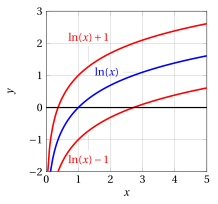
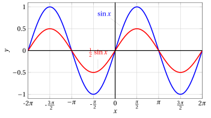
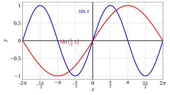
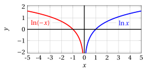
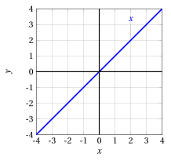
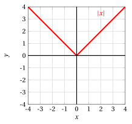
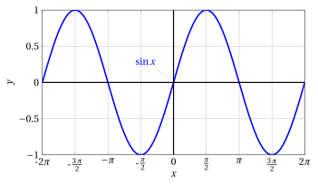
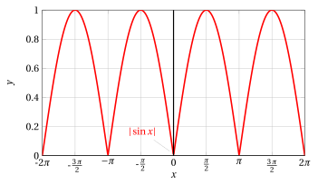
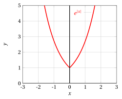

# Operations on graphs

**Part 2 · Functions · Chapter 9** · lecture notes by Fabio Furini · [:material-file-pdf-box: Chapter PDF](../pdf/functions-09-graph-transformations.pdf)

## 1. Operations on graphs

- Knowing the graph of a function $y = f (x)$, by means of simple geometric transformations it is possible to draw the graph of the following functions:

!!! chiave ""

    \begin{align}
    y_1 &= f(x) + a, \quad a \in \mathbb{R}\\[2ex]
    y_2 &= f(x + a), \quad a \in \mathbb{R}\\[2ex]
    y_3 &= k \: f(x), \quad k \in \mathbb{R}\\[2ex]
    y_4 &=  f(k \:x), \quad k \in \mathbb{R}\\[2ex]
    y_5 &=  |f(x)| \\[2ex]
    y_6 &=  f(|x|)
    \end{align}

- Therefore, starting from the elementary functions, it is possible to build, by means of these operations, a large variety of new functions. These operations create <strong>translations</strong>, <strong>dilations</strong> and <strong>reflections</strong> of the original function.

### 1.1 Operations related to $y_1= f(x) +a$

!!! esempio "Example 1: Operations on graphs related to $y_1= f(x) +a$"

    Consider  $y = \ln x$. Then

    $$
    y_1  = \ln (x) +a ~~~~(x > 0).
    $$

    { .fig .ovale loading=lazy style="width:48%" }

- The graph of $y_1$ is obtained from that of $y$ by a <strong>translation</strong> of $a$ units <strong>upward</strong> if $a> 0$, <strong>downward</strong> if $a < 0$.

### 1.2 Operations related to $y_2= f(x +a)$

!!! esempio "Example 2: Operations on graphs related to $y_2= f(x +a)$"

    Consider again $y = \ln x$. Then

    $$
    y_2  = \ln (x +a).
    $$

    Since $\ln x$ is defined for $x > 0$, $\ln(x +a)$ will be defined for $x +a > 0$, i.e., for $x > - a$. Since $\ln x =0$ if $x = 1$, we have $\ln(x +a) =0$ for $x +a= 1$, i.e., $x = 1 - a$.

    { .fig .ovale loading=lazy style="width:42%" }

- The graph of $y_2$ is obtained from that of $y$ by a <strong>translation</strong> of $a$ units to the <strong>left</strong> if $a > 0$, to the <strong>right</strong> if $a < 0$.

### 1.3 Operations related to $y_3 = k\: f(x)$

- The graph of $y_3 = k \: f ( x)$ is obtained from that of $f$ by multiplying all the ordinates $f(x)$ by $k$.

- In particular, if $k = -1$ the ordinates simply change sign, so that the graph of $y_3$ is symmetric to that of $f$ with respect to the $x$-axis.

- Note that if $k > 1$, the graph is “<strong>stretched</strong>” in the <strong>vertical direction</strong>, dilating the <strong>positive</strong> ordinates <strong>upward</strong> and the <strong>negative</strong> ones <strong>downward</strong>.

- Conversely, if $0 < k < 1$ the graph “<strong>shrinks</strong>”, again in the vertical direction.

- Therefore, the operation of multiplying $f ( x)$ by $k$ has the geometric meaning of a <strong>dilation</strong> (if $|k| > 1$) or a <strong>contraction</strong> (if $|k| < 1$) along the $y$-axis, possibly accompanied by a <strong>reflection with respect to the</strong> $x$<strong>-axis</strong>, if $k < 0$.

!!! esempio "Example 3: Operations on graphs related to $y_3= k\: f( x)$"

    Consider $y = \sin x$, then $y_3  = k\: \sin(x).$

    { .fig .ovale loading=lazy style="width:70%" }

    { .fig .ovale loading=lazy style="width:70%" }

    { .fig .ovale loading=lazy style="width:70%" }

### 1.4 Operations related to $y_4= f(k\:x)$

- The graph of $y_4 = f ( k\:x)$ is obtained from that of $f(x)$ by a <strong>change of scale</strong> along the $x$-axis.

- If $k > 1$, $k \:x$ grows faster than $x$, and therefore the graph of $y_4$ will be similar to that of $f$ but with faster oscillations, that is, it will be “<strong>compressed</strong>” in the <strong>horizontal direction</strong> by a factor $\frac{1}{k}$.

- Similarly, if $0 < k < 1$ the graph will appear “<strong>dilated</strong>” in the <strong>horizontal direction</strong>, with gentler oscillations.

- If $k < 0$, in addition to a compression (if $|k| > 1$) or a dilation (if $|k|< 1$) along the $x$-axis, there will be a <strong>reflection with respect to the $y$-axis</strong>.

!!! esempio "Example 4: Operations on graphs related to $y_4 =  f(k\: x)$"

    Consider $y = \sin x$, then $y_4 =  \sin(k\: x).$ With $k=\frac{1}{2}$ and $k=2$ we have:

    { .fig .ovale loading=lazy style="width:75%" }

    { .fig .ovale loading=lazy style="width:75%" }

!!! esempio "Example 5: Operations on graphs related to $y_4=  f(k\: x)$"

    Consider $y = \ln x$, then $y_4 =  \ln(k\: x).$ With $k=-1$ we have:

    { .fig .ovale loading=lazy style="width:80%" }

### 1.5 Operations related to $y_5=|f(x)|$

<strong>Absolute value of $f(x)$:</strong>

!!! chiave ""

    $$
    |f(x)|=
    \begin{cases}
    f(x) & {\rm if~~} f(x)\ge0,\\
    -f(x) \:  & {\rm if~~} f(x)<0
    \end{cases}
    $$

- When passing from the graph of $y=f(x)$ to that of $y_5=|f(x)|$, the points with <strong>non-negative ordinate remain unchanged</strong>, while those with <strong>negative ordinate are transformed into their symmetric points with respect to the</strong> $x$<strong>-axis</strong>.

- The graph of  $y_5=|f(x)|$ is obtained from that of $f$ by “flipping”  symmetrically with respect to the $x$-axis the part of the graph of $f$ that lies in the lower half-plane, and leaving the rest unchanged.

!!! esempio "Example 6: Operations on graphs related to $y_5=  |f(x)|$"

    Consider $y = x$, then $y_5 = |x|$

    { .fig .ovale loading=lazy style="width:61%" }

    { .fig .ovale loading=lazy style="width:61%" }

!!! esempio "Example 7: Operations on graphs related to $y_5=  |f( x)|$"

    Consider $y = \sin x$, then $y_5  = |\sin x|$

    { .fig .ovale loading=lazy style="width:80%" }

    { .fig .ovale loading=lazy style="width:80%" }

### 1.6 Operations related to $y_6=f(|x|)$

- Finally, to draw the graph of  $y_6 =f(|x|)$, we observe that $|x|  = x$ for $x \ge 0$, and hence in the right half-plane the two graphs coincide.

- We have $|-x|=|x|$, and hence $y_6$ is an even function, therefore symmetric with respect to the $y$-axis.

- Consequently, the graph of  $y_6 = f(|x|)$ is drawn by <strong>leaving the graph of $f$ unchanged in the right half-plane and flipping it symmetrically with respect to the $y$-axis</strong>.

!!! esempio "Example 8: Operations on graphs related to $y_6=f(|x|)$"

    Consider $y = e^x$, then $y_6  = e^{|x|}$

    { .fig .ovale loading=lazy style="width:61%" }

    { .fig .ovale loading=lazy style="width:61%" }

<strong>Try it</strong> — the interactive graph below shows what you have just read: move the sliders.

