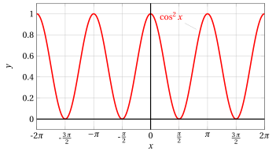
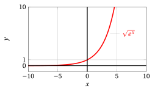
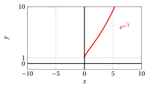

# Composite functions

**Part 2 · Functions · Chapter 10** · lecture notes by Fabio Furini · [:material-file-pdf-box: Lecture notes, volume (PDF)](../pdf/lecture-notes-2-functions.pdf) · [:material-presentation: Slides (PDF)](../pdf/slides-functions-10-composite-functions.pdf)

## 1. Composite functions

!!! definizione "Definition 1: of composite function"

    Given two functions:

    $$
    f: E \rightarrow \mathbb{R} {\rm~~~~and~~~~} g: F \rightarrow \mathbb{R},
    $$

    if $f (E) \subseteq F$ (i.e., if for every $x \in E$ we have $f ( x) \in F)$, one can define the function $h : E \rightarrow \mathbb{R}$, the <strong>composite</strong> of $f$ and $g$ (in this order), denoted by the symbol $g \circ f$, through the formula

    $$
    h(x) = (g \circ f) (x) = g[f(x)]
    $$

- The composition scheme is the following:

    { .fig .ovale loading=lazy style="width:75%" }

!!! esempio "Example 1: of composite function"

    The function $x \mapsto |f(x)|$  is actually “composed” of two functions:

    1. given $x$, we compute $f(x)$

    2. once $f(x)$ is computed, we compute $|f(x)|$

    This amounts to operating in series with two black boxes, the first corresponding to $f$, the second to its absolute value, according to the following scheme:

    { .fig .ovale loading=lazy style="width:75%" }

- It may happen that both compositions $(g \circ f)$ and $(f \circ g)$ are well defined, but in general

    $$
    (f \circ g) \neq (g \circ f)
    $$

    In other words, <strong>the commutative property does not hold</strong>.

!!! esempio "Example 2: of composition of functions"

    Consider the functions:

    $$
    f: \mathbb{R} \rightarrow \mathbb{R}, \quad f: x \mapsto x^2 {\rm ~~~~~and~~~~~} g: \mathbb{R} \rightarrow \mathbb{R}, \quad g: x \mapsto \cos x
    $$

    that is,  $f(x)= x^2$ and $g(x)= \cos x$.

    1. Since $g$ is defined on all of $\mathbb{R}$, $h = g \circ f$ is well defined on $\mathbb{R}$ and the following formula holds

        $$
        h(x) = (g \circ f) (x) = g[f(x)] = \cos x^2
        $$

        { .fig .ovale loading=lazy style="width:73%" }

    2. Since $f$ is defined on all of $\mathbb{R}$, $k = f \circ g$ is well defined on $\mathbb{R}$ and the following formula holds

        $$
        k(x) = (f \circ g) (x) = f[g(x)] = \cos^2 x
        $$

        { .fig .ovale loading=lazy style="width:73%" }

!!! esempio "Example 3: of composition of functions"

    Consider the functions:

    $$
    f: \mathbb{R} \rightarrow \mathbb{R}, \quad f: x \mapsto e^x \qquad g: [0,+\infty) \rightarrow \mathbb{R}, \quad g: x \mapsto \sqrt{x}
    $$

    that is,  $f(x)= e^x$ and $g(x)= \sqrt{x}$.

    1. Since $g$ is defined on $[0,+\infty)$ and $f(x) > 0$ for every $x \in \mathbb{R}$, $h = g \circ f$ is well defined on $\mathbb{R}$ and the following formula holds

        $$
        h(x) = (g \circ f) (x) = g[f(x)] = \sqrt{e^x}
        $$

        { .fig .ovale loading=lazy style="width:73%" }

    2. Since $g$ is defined only on  $[0,+\infty)$, $k = f \circ g$ is well defined only on $\mathbb{R}_+$ and the following formula holds

        $$
        k(x) = (f \circ g) (x) = f[g(x)] = e^{\sqrt{x}}
        $$

        { .fig .ovale loading=lazy style="width:73%" }

- The composition operation can be extended to three or more factors. One can verify that if the composition $(f \circ g) \circ r$ exists, then $f \circ (g \circ r)$ also exists and they are equal

    $$
    (f \circ g) \circ r = f \circ (g \circ r)
    $$

    In other words, <strong> the associative property holds</strong>.

- If a function $f : D \rightarrow \mathbb{R}$ is such that $f ( D) \subseteq D$, then it can be composed with itself

    $$
    f^2 = f \circ f {\rm~~that~is~~} f^2(x) = f[f(x)]
    $$

    $f^2$ is called the <strong>second iterate</strong> of $f$. Similarly, $f^n$ is called the <strong>$n$-th iterate function</strong> of $f$.
