# Inverse functions

**Part 2 · Functions · Chapter 11** · lecture notes by Fabio Furini · [:material-file-pdf-box: Lecture notes, volume (PDF)](../pdf/lecture-notes-2-functions.pdf) · [:material-presentation: Slides (PDF)](../pdf/slides-functions-11-inverse-functions.pdf)

## 1. Invertible functions and inverse functions

- Given a real function of a real variable $f : D \rightarrow \mathbb{R}$,  for every input $x$ in the domain $D$ there exists a unique output $y=f(x)$ in the image of the domain $f(D)$.

- If, in addition, for every output $y = f(x) \in f(D)$ there exists a unique input $x \in D$, then $f$ is called <strong>invertible</strong>, and it establishes a <strong>one-to-one correspondence</strong> between the domain $D$ of $f$ and the image   of the domain  $f(D)$.

!!! definizione "Definition 1: of invertible function"

    A function $f : D \rightarrow \mathbb{R}$ is <strong>invertible</strong> on the domain $D$ if one of the following equivalent conditions holds:

    \begin{align*}
    \forall x_1,x_2 \in D,&\qquad x_1 \neq x_2 \Longrightarrow f(x_1)\neq f(x_2)\\[2ex]
    \forall x_1,x_2 \in D,&\qquad f(x_1) = f(x_2) \Longrightarrow x_1 = x_2\\[2ex]
    \forall y \in f(D),&\qquad \exists! x \in D:  y=f(x)
    \end{align*}

    that is, if $f$ is <strong>injective</strong>.

!!! chiave ""

    <strong>WARNING:</strong> the definition of invertible function given here for real functions of a real variable is different from the usual one given for functions between arbitrary sets, which also requires surjectivity. In this case <em>injectivity is enough</em> because we define the inverse on the image of $f$ and not on its whole codomain.

!!! definizione "Definition 2: of inverse function"

    Given an invertible function $f : D \rightarrow \mathbb{R}$,  the function that associates to each output $y \in f(D)$ the unique input $x \in D$  such that $f(x) = y$ is called the <strong>inverse function</strong> of $f$ and is denoted by the symbol $f^{-1}$.

!!! chiave ""

    The pair $f$ and $f^{-1}$ is written as:

    \begin{equation}
    \label{inversa}
    f:
    \begin{cases}
    y = f(x)\\
    x \in D
    \end{cases} ~~~~~~~~
    f^{-1}:
    \begin{cases}
    x = f^{-1}(y)\\
    y \in f(D)
    \end{cases}
    \end{equation}

    The black box of $f^{-1}$ works backwards with respect to that of $f$, according to the following scheme:

    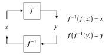{ .fig .ovale loading=lazy style="width:65%" }

!!! chiave ""

    The invertibility condition is equivalent to requiring that the graph of $f$ be intersected in at most one point by every line parallel to the $x$-axis.

!!! esempio "Example 1: graph of an invertible function"

    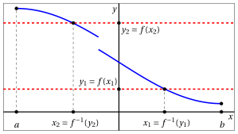{ .fig .ovale loading=lazy style="width:80%" }

    Graph of a function that is <strong>invertible</strong> on $[a,b]$, since every line parallel to the $x$-axis either does not intersect the graph of $f$ or intersects it in exactly one point.

!!! esempio "Example 2: graph of a non-invertible function"

    { .fig .ovale loading=lazy style="width:80%" }

    Graph of a function that is <strong>not invertible</strong> on $[a,b]$, since for the indicated value $\tilde{y}$ there are several values $x$ (precisely $x_1$ , $x_2$ and $x_3$) whose image is $\tilde{y}$.

!!! teorema "Theorem 1"

    If a function $f : D \rightarrow \mathbb{R}$ is strictly  increasing (decreasing) on $D$, then it is invertible on $D$. Moreover, its inverse function is  strictly  increasing (decreasing).

For the strictly increasing case, graphically we have:

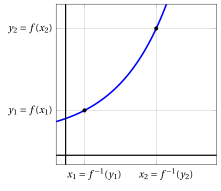{ .fig .ovale loading=lazy style="width:61%" }

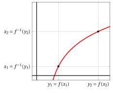{ .fig .ovale loading=lazy style="width:61%" }

??? dimostrazione "Proof"

    Consider the case of a function that is strictly increasing on $D$ and two arbitrary values $x_1,  x_2 \in D$ (the strictly decreasing case is analogous).

    If $x_1  \neq x_2$, then either $x_1 < x_2$ or $x_1 > x_2$. Since  $f$ is strictly  increasing, we have:

    $$
    {\rm if~~} x_1 < x_2,  {\rm ~~then~~} f(x_1) < f (x_2)
    $$

    $$
    {\rm if~~} x_1 > x_2,  {\rm ~~then~~} f(x_1) > f (x_2)
    $$

    In both cases $f(x_1) \neq f(x_2)$, therefore $f$ is invertible.

    Consider the inverse function $f^{-1}$, that is, $x = f^{-1} (y)$, and let us prove that  it is strictly increasing. Consider two arbitrary values $y_1,  y_2 \in f(D)$, with  $y_1 < y_2$. 

    If we had $f^{-1}(y_1) =x_1  \ge x_2= f^{-1}(y_2)$, since $f$ is strictly  increasing we would have $y_1 = f(x_1) \ge f(x_2) =y_2$, that is, $y_1 \ge y_2$. This cannot happen, since it contradicts $y_1 < y_2$ (<strong>contradiction</strong>).

    Consequently, we have $f^{-1}(y_1) =x_1  < x_2= f^{-1}(y_2)$, that is, $f^{-1} (y_1) < f^{-1}(y_2)$, and hence $f^{-1}$ is strictly  increasing. □

!!! chiave ""

    However, a function can be invertible even without being strictly increasing or decreasing.

!!! esempio "Example 3: invertible function that is neither strictly increasing nor strictly decreasing"

    For example, the following piecewise-defined function is invertible:

    $$
    f(x)=
    \begin{cases}
    \frac{1}{2}\; x & {\rm if~~} -1 \le x < 0,\\[2ex]
    \frac{1}{2}-\frac{1}{2} \: x & {\rm if~~} 0 \le x \le 2/3\\
    \end{cases}
    $$

    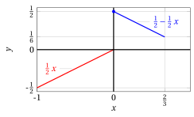{ .fig .ovale loading=lazy style="width:61%" }

- Two classes of functions that are certainly not invertible are:

    1. even (symmetric) functions, since:

        $$
        f(-x) = f (x)
        $$

    2. periodic functions, since:

        $$
        f(x + T) =f(x)
        $$

### 1.1 Graph of the inverse function

- The relations between an invertible function $f$ and its inverse function $f^{-1}$:

    \begin{equation*}
    f:
    \begin{cases}
    y = f(x)\\
    x \in D
    \end{cases} ~~~~~~~~
    f^{-1}:
    \begin{cases}
    x = f^{-1}(y)\\
    y \in f(D)
    \end{cases}
    \end{equation*}

    indicate that if the point $(x_0, y_0)$ lies on the graph of $f$, then the point $(y_0, x_0)$ lies on the graph of $f^{-1}$.

- Since the points $(x_0, y_0)$ and $(y_0, x_0)$ are <strong>symmetric with respect to the bisector</strong> with equation $y = x$, the graph of $f^{-1}$ is obtained from that of $f$ by symmetry with respect to the bisector.

    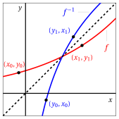{ .fig .ovale loading=lazy style="width:58%" }

!!! chiave ""

    If the analytic expression of $f$ is known and $f$ is invertible, the <strong>analytic expression</strong> of $f^{-1}$ is found by trying to solve  for $x$ the equation:

    $$
    f(x) = y {\rm ~~~~that~is,~find~the~input~~} x {\rm~~that~produces~the~output~} y
    $$

    <strong>Note that it is not always possible to find it, even in cases where the inverse function exists!</strong>

!!! chiave ""

    Given $a,b \in \R, a \neq 0$, we have:

    $$
    f:\begin{cases}
    y = a\:x + b\\
    x \in \R
    \end{cases}
    \qquad
    \qquad
    f^{-1}:\begin{cases}
    x = \frac{y-b}{a}\\
    y \in \R
    \end{cases}
    $$

!!! esempio "Example 4: inverse function of an affine function"

    The function  $f: \mathbb{R} \rightarrow \mathbb{R}, x \mapsto 2 \: x +3$ is strictly increasing, hence invertible on $\mathbb{R}$, and the equation

    $$
    2\: x + 3 = y {\rm ~~solved~for~~} x,~~{\rm ~that~is~~} x=\frac{y-3}{2}
    $$

    gives for $f^{-1}$ the analytic expression:

    $$
    f^{-1}(y) = \frac{y-3}{2}
    $$

    that is, the function: $f^{-1}: \mathbb{R} \rightarrow \mathbb{R}, y \mapsto \frac{y-3}{2}$.

    { .fig .ovale loading=lazy style="width:52%" }

    The graphs $y=2 \: x +3$ and  $y=\frac{x-3}{2}$ are symmetric with respect to the bisector $y = x$

    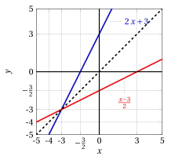{ .fig .ovale loading=lazy style="width:52%" }

!!! chiave ""

    We have:

    $$
    f:\begin{cases}
    y = x^2\\
    x \ge 0
    \end{cases}
    \qquad
    \qquad
    f^{-1}:\begin{cases}
    x = \sqrt{y}\\
    y \ge 0
    \end{cases}
    $$

!!! esempio "Example 5: inverse function of $f(x)=x^2$"

    The function  $f: \mathbb{R} \rightarrow \mathbb{R}, x \mapsto x^2$ is strictly increasing on the interval $[0,+\infty)$, hence invertible there; the equation

    $$
    x^2 = y {\rm ~~solved~for~~} x,~~{\rm ~that~is~~} x=\sqrt{y}
    $$

    gives for $f^{-1}$ the analytic expression

    $$
    f^{-1}(y) = \sqrt{y}
    $$

    that is, the function: $f^{-1}: [0,+\infty) \rightarrow \mathbb{R}, y \mapsto \sqrt{y}$.

    The graphs $y=x^2$ and  $y=\sqrt{x}$ are symmetric with respect to the bisector $y = x$

    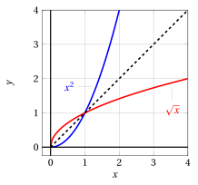{ .fig .ovale loading=lazy style="width:58%" }

!!! chiave ""

    Given $a \in \R_+, a \neq 1$, we have:

    $$
    f:\begin{cases}
    y = a^x\\
    x \in \mathbb{R}
    \end{cases}
    \qquad
    \qquad
    f^{-1}:\begin{cases}
    x = \log_a y\\
    y > 0
    \end{cases}
    $$

!!! esempio "Example 6: inverse function of $f(x)=e^x$"

    The function  $f: \mathbb{R} \rightarrow \mathbb{R}, x \mapsto e^x$ is strictly increasing on all of $\mathbb{R}$ and hence invertible; the equation

    $$
    e^x = y {\rm ~~solved~for~~} x,~~{\rm ~that~is~~} x=\log{y}
    $$

    gives for $f^{-1}$ the analytic expression

    $$
    f^{-1}(y) = \log{y}
    $$

    that is, the function: $f^{-1}: (0,+\infty) \rightarrow \mathbb{R}, y \mapsto \log{y}$.

    The graphs $y=e^x$ and  $y=\log {x}$ are symmetric with respect to the bisector $y = x$

    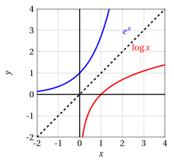{ .fig .ovale loading=lazy style="width:58%" }

- Now consider the function:

    $$
    f(x)= x + e^x
    $$

    Being the sum of two functions that are strictly increasing on all of $\mathbb{R}$, $f(x)$ is strictly increasing and hence invertible on all of $\mathbb{R}$ (see Theorem [Theorem 1](#box-theoINV-5)). However, we would try in vain to solve the equation $x + e^x = y$ for $x$.  In other words, $f^{-1}$ exists, but we cannot write it explicitly.

### 1.2 Inverse power functions

!!! chiave ""

    Given $\alpha \in \mathbb{R},\alpha \neq 0$, we have:

    $$
    f:\begin{cases}
    y = x^{\alpha}\\
    x > 0
    \end{cases}
    \qquad
    \qquad
    f^{-1}:\begin{cases}
    x = y^{\frac{1}{\alpha}}\\
    y > 0
    \end{cases}
    $$

    If $\alpha > 0$ we have:

    $$
    f:\begin{cases}
    y = x^{\alpha}\\
    x \ge 0
    \end{cases}
    \qquad
    \qquad
    f^{-1}:\begin{cases}
    x = y^{\frac{1}{\alpha}}\\
    y \ge 0
    \end{cases}
    $$

    If $\alpha=\frac{m}{n} \in \Q$, with $m \in \Z, n \in \N_+$  odd and coprime, we have:

    $$
    f:\begin{cases}
    y = x^{\frac{m}{n}}\\
    x \in \R
    \end{cases}
    \qquad
    \qquad
    f^{-1}:\begin{cases}
    x = y^{\frac{n}{m}}\\
    y \in \R
    \end{cases}
    $$

- The <strong>even powers</strong>:

    $$
    x^{2\:n} {\rm~~~~with~} n = 1, 2, \dots
    $$

    are not invertible on the whole real line, but only on the half-line $x \ge 0$.

    { .fig .ovale loading=lazy style="width:58%" }

- The <strong>odd powers</strong>:

    $$
    x^{2\:n+1} {\rm~~~~with~} n = 1, 2, \dots
    $$

    and the <strong>powers with rational exponent</strong>

    $$
    x^{\frac{m}{n}} {\rm~~with~~} n,m {\rm~~positive ~odd~integers}
    $$

    being strictly  increasing monotone functions, are invertible from $-\infty$ to $+\infty$.

    { .fig .ovale loading=lazy style="width:58%" }

### 1.3 Inverse trigonometric functions

- Being periodic, the trigonometric functions cannot be invertible. Indeed, for example, the equation

    $$
    y = \sin x
    $$

    has infinitely many solutions if $- 1 \le y \le 1$ (the output $y$ corresponds to infinitely many inputs), or has no real solutions if $|y| > 1$.

- To speak of inverse functions of sine, cosine and tangent, we will need to restrict ourselves to intervals on which these functions are strictly monotone and therefore invertible.

- An interval on which the sine function is invertible is $[-\frac{\pi}{2},\frac{\pi}{2}]$.

!!! definizione "Definition 3: of arcsine"

    The inverse function of the sine on the interval $\left[-\frac{\pi}{2},\frac{\pi}{2}\right]$ is the <strong>arcsine</strong>:

    $$
    f: [-1,1] \rightarrow \left[-\frac{\pi}{2},\frac{\pi}{2}\right],~~ f: y \mapsto \arcsin y
    $$

!!! chiave ""

    We have:

    \begin{equation}
    \label{arcoseno}
    f:
    \begin{cases}
    y = \sin x\\
    x \in \left[-\frac{\pi}{2},\frac{\pi}{2}\right]
    \end{cases}
    \qquad
    \qquad
    f^{-1}:
    \begin{cases}
    x = \arcsin y\\
    y \in [-1,1]
    \end{cases}
    \end{equation}

- The graph of the arcsine is obtained from the arc of the sine curve restricted to the interval $\left[-\frac{\pi}{2},\frac{\pi}{2}\right]$ (strictly monotone), by symmetry with respect to the bisector $y = x$,

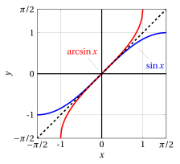{ .fig .ovale loading=lazy style="width:58%" }

- An interval on which the cosine function is invertible is $[0,\pi]$.

!!! definizione "Definition 4: of arccosine"

    The inverse function of the cosine on the interval $[0,\pi]$ is the <strong>arccosine</strong>:

    $$
    f: [-1,1] \rightarrow \left[0,\pi\right],~~ f: y \mapsto \arccos y
    $$

!!! chiave ""

    We have:

    \begin{equation}
    \label{arcoseno__2}
    f:
    \begin{cases}
    y = \cos x\\
    x \in [0,\pi]
    \end{cases}
    \qquad
    \qquad
    f^{-1}:
    \begin{cases}
    x = \arccos y\\
    y \in [-1,1]
    \end{cases}
    \end{equation}

- The graph of the arccosine is obtained from the arc of the cosine curve restricted to the interval $[0,\pi]$ (strictly monotone), by symmetry with respect to the bisector $y = x$,

{ .fig .ovale loading=lazy style="width:58%" }

- Note that on the interval $( -\frac{\pi}{2}, \frac{\pi}{2})$ the tangent is strictly monotone and hence invertible. Its inverse function is called the arctangent ($\arctan$), and it is defined on $\mathbb{R}$.

!!! definizione "Definition 5: of arctangent"

    The inverse function of the tangent on the interval $\left(-\frac{\pi}{2},\frac{\pi}{2}\right)$ is the <strong>arctangent</strong>:

    $$
    f: \mathbb{R} \rightarrow \left(-\frac{\pi}{2},\frac{\pi}{2} \right),~~ f: y \mapsto \arctan y
    $$

!!! chiave ""

    We have:

    \begin{equation}
    \label{arcoseno__3}
    f:
    \begin{cases}
    y = \tan x\\
    x \in \left(-\frac{\pi}{2},\frac{\pi}{2}\right)
    \end{cases}
    \qquad
    \qquad
    f^{-1}:
    \begin{cases}
    x = \arctan y\\
    y \in \mathbb{R}
    \end{cases}
    \end{equation}

- The graph of the arctangent is obtained from that of the tangent restricted to the interval $\left(-\frac{\pi}{2},\frac{\pi}{2}\right)$ (strictly monotone), by symmetry with respect to the bisector $y = x$,

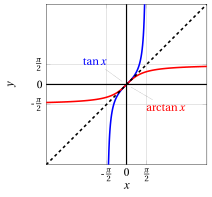{ .fig .ovale loading=lazy style="width:58%" }

- By means of the inverse trigonometric functions, we can express the solutions of a <strong>trigonometric equation or inequality</strong> when it involves angles that are not standard angles.

!!! esempio "Example 7: Trigonometric equations/inequalities"

    - The solutions of:

        $$
        \sin x = \frac{1}{4}
        $$

        are:

        $$
        (i) ~~~~~~ x = \arcsin \frac{1}{4} + 2\: k \: \pi; ~~~~~~(ii) ~~~~~~ x = \pi - \arcsin \frac{1}{4} + 2\: k \: \pi \qquad (k \in \mathbb{Z})
        $$

        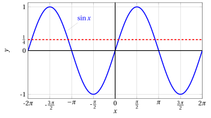{ .fig .ovale loading=lazy style="width:70%" }

    - The solutions of:

        $$
        \cos x < \frac{1}{5}
        $$

        are:

        $$
        \arccos \frac{1}{5} + 2\: k \: \pi ~~<~~ x ~~<~~ 2 \: \pi - \arccos \frac{1}{5} + 2\: k \: \pi \qquad (k \in \mathbb{Z})
        $$

        { .fig .ovale loading=lazy style="width:70%" }

    - The solutions of:

        $$
        \tan x \ge 3
        $$

        are:

        $$
        \arctan \:3 +  k \: \pi ~~\le~~ x ~~<~~ \frac{\pi}{2} +  k \: \pi \qquad (k \in \mathbb{Z})
        $$

### 1.4 Inverse hyperbolic functions

- Consider the <strong>hyperbolic sine</strong> function:

    $$
    y =\sinH x = \frac{e^x - e^{-x}}{2}
    $$

    It is defined and strictly increasing on all of $\mathbb{R}$, therefore it is invertible.

- To solve the equation for $x$, multiplying both sides by $e^x$ we obtain:

    \begin{align*}
    0 & = e^x \: y - e^x \: \frac{e^x - e^{-x}}{2}\\[2ex]
       & = 2\: e^x \: y - (e^x \: e^x - \underbrace{e^x \: e^{-x}}_{=e^{x-x}=e^0})\\[2ex]
     & = 2\:y\: e^x   - e^{2\:x}  + 1 \\[2ex]
     & = e^{2\:x} - 2\: y \:e^x  -1
    \end{align*}

    which is a quadratic equation in the unknown $e^x$. Setting $t=e^x$ we obtain

    $$
    0 = t^{2} - 2\: y \: t  -1
    $$

    We obtain:

    $$
    t = y \pm \sqrt{y^2+1} {\rm~~~~~and~substituting~back~~~~~} e^x = y \pm \sqrt{y^2+1}
    $$

    since $e^x  > 0$, the solution with the minus sign must be discarded. Hence we are left with:

    $$
    e^x = \underbrace{y + \sqrt{y^2+1}}_{>0, \forall y \in \R} {\rm~~~~and~hence~~~~} x = \log \left(y + \sqrt{y^2+1}\right)
    $$

- This is the analytic expression of the inverse function of $\sinH x$, which is called the <strong>inverse hyperbolic sine</strong> (area hyperbolic sine), and is also denoted by $\setsinH$. It is defined for every real $y$.

!!! definizione "Definition 6: of inverse hyperbolic sine"

    The inverse function of the hyperbolic sine is the <strong>inverse hyperbolic sine</strong>:

    $$
    f: \mathbb{R} \rightarrow \mathbb{R},~~ f: y \mapsto \setsinH y
    $$

!!! chiave ""

    We have:

    \begin{equation}
    \label{arcoseno__4}
    f:
    \begin{cases}
    y = \sinH x\\
    x \in \mathbb{R}
    \end{cases}
    \qquad
    \qquad
    f^{-1}:
    \begin{cases}
    x = \setsinH y\\
    y \in \mathbb{R}
    \end{cases}
    \end{equation}

- The graph of the inverse hyperbolic sine is obtained from that of the hyperbolic sine on $\mathbb{R}$ (strictly monotone), by symmetry with respect to the bisector $y = x$

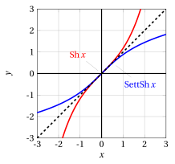{ .fig .ovale loading=lazy style="width:58%" }

- Consider the <strong>hyperbolic cosine</strong> function:

    $$
    y =\cosH x = \frac{e^x + e^{-x}}{2}
    $$

    It is defined on all of $\mathbb{R}$, strictly increasing for $x \ge 0$, decreasing for $x \le 0$. Therefore it is not invertible on all of $\mathbb{R}$.

- Its restriction to $x \ge 0$, however, is invertible. We want to determine the analytic expression of the inverse function of this restriction.

- Proceeding as before,  we obtain:

    $$
    e^x = y \pm \sqrt{y^2-1}
    $$

- This time both numbers $y \pm \sqrt{y^2-1}$ are positive; recall, however, that we are reasoning only for $x \ge 0$, which is equivalent to choosing the plus sign. Therefore:

    $$
    x = \log \left(y + \sqrt{y^2-1}\right)
    $$

    This is the analytic expression of the inverse function of $\cosH x$, which is called the inverse hyperbolic cosine (area hyperbolic cosine), and is also denoted by $\setcosH$.  Note that it is defined for $y \ge 1$.

!!! definizione "Definition 7: of inverse hyperbolic cosine"

    The inverse function of the hyperbolic cosine on the interval $[0,+\infty)$ is the <strong>inverse hyperbolic cosine</strong>:

    $$
    f: [1,+\infty) \rightarrow [0,+\infty),~~ f: y \mapsto \setcosH y
    $$

!!! chiave ""

    We have:

    \begin{equation*}
    f:
    \begin{cases}
    y = \cosH x\\
    x \in [0,+\infty)
    \end{cases}
    \qquad
    \qquad
    f^{-1}:
    \begin{cases}
    x = \setcosH y\\
    y \in [1,+\infty)
    \end{cases}
    \end{equation*}

- The graph of the inverse hyperbolic cosine is obtained from that of the hyperbolic cosine on $[0,+\infty)$ (strictly monotone), by symmetry with respect to the bisector $y = x$.

{ .fig .ovale loading=lazy style="width:58%" }

!!! esempio "Example 8: Hyperbolic equations"

    - The equation:

        $$
        \sinH x = 2
        $$

        has the unique solution:

        $$
        x = \setsinH 2 = \log (2 + \sqrt{5})
        $$

    - The equation:

        $$
        \cosH x = 3
        $$

        has two solutions:

        $$
        x = \pm \setcosH 3 = \pm \log(3 + 2\:\sqrt{2})
        $$

    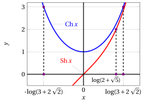{ .fig .ovale loading=lazy style="width:61%" }
