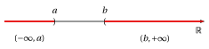
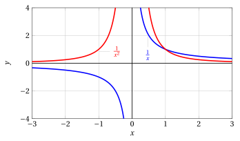
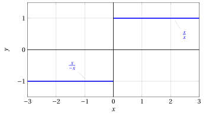
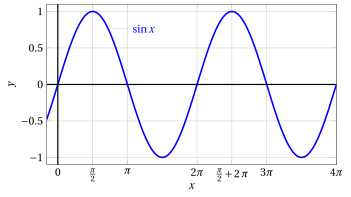
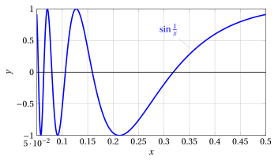

# Limits of functions, asymptotes and continuity

**Part 3 · Limits of functions and continuity · Chapter 1** · lecture notes by Fabio Furini · [:material-file-pdf-box: Lecture notes, volume (PDF)](../pdf/lecture-notes-3-limits.pdf)

## 1. Sequential definition of limit

The limit operation can be extended from sequences to real functions of a real variable.  

In this way we can describe the behavior of the function when the independent variable <strong>moves close to a given point</strong> or <strong>becomes very large </strong>(in absolute value).

!!! chiave ""

    - Consider an <strong>interval</strong> $I$, a <strong>point</strong> $c \in I$ and a <strong>function</strong> $f$ defined in $I$, except possibly at the point $c$.

    - The <strong>interval</strong> $I$ can be <strong>bounded</strong> or <strong>unbounded</strong>, <strong>closed</strong> or <strong>open</strong>.

    - The <strong>point</strong> $c$ can be <strong>interior</strong> to the interval or <strong>one of its endpoints</strong> (possibly $\ip$ or $\im$).

!!! definizione "Definition 1: Limit (sequential definition)"

    With $\ell,c\in \R^*$, we write

    $$
    f(x) \rr \ell {\rm ~~as~~} x \rr c
    $$

    if for every sequence $\{x_n\}$ of points of $I$ such that $x_n \rr c$ as $n \rr \ip$ and $x_n \neq c, \forall n$, we have

    $$
    f(x_n) \rr \ell {\rm~~as~~} n \rr +\infty
    $$

In these cases we can also write:

$$
\lim_{x \rr c} f(x) = \ell
$$

which is read: the limit of $f(x)$, as $x$ tends to $c$, is $\ell$.

!!! chiave ""

    In other words, if <strong>for any sequence $\{x_n\}$ of inputs</strong> the <strong>sequence of outputs</strong> $\left\{f(x_n)\right\}$ tends to the limit $\ell$ (finite or infinite), then we say that the limit of $f(x)$, as $x$ tends to $c$, is $\ell$.

    The sequential definition of limit reduces the concept of limit of a function to that of limit of a sequence.

    <strong>It is not the only possible definition</strong>. Another definition is the <em>topological definition of limit</em>. The two definitions are perfectly equivalent.

### 1.1 Neighborhoods and topological definition of limit

!!! definizione "Definition 2: Centered neighborhood of a point"

    Given $\delta>0$ and $x_0 \in \R$, the <strong>neighborhood</strong> centered at $x_0$ associated with $\delta$ is the open interval:

    $$
    (x_0 - \delta, x_0 + \delta) = \big\{ x \in \mathbb{R}:  x_0 - \delta < x < x_0 + \delta \big\}
    $$

{ .fig .ovale loading=lazy style="width:80%" }

!!! chiave ""

    Saying that “$x$ moves in a neighborhood of $x_0$” means stating that

    $$
    x \in  (x_0 - \delta, x_0 + \delta), {\rm ~~where~
    we~think~of~~} 0 < \delta \ll 1.
    $$

!!! definizione "Definition 3: Neighborhood of $\pm \infty$"

    Given $a,b \in \R$, the neighborhood of $\im$ associated with $a$ is the interval:

    $$
    (\im, a)= \big\{ x \in \mathbb{R}:  x < a \big\}
    $$

    and the neighborhood of $\ip$ associated with $b$ is the interval:

    $$
    (b, \ip) = \big\{ x \in \mathbb{R}:  x > b \big\}
    $$

{ .fig .ovale loading=lazy style="width:80%" }

- We now introduce the expression “eventually as $x \rr c$”, analogously to what we did in the case of sequences

!!! definizione "Definition 4: Property eventually satisfied by functions"

    We say that a function $f$ <strong>eventually</strong> has a certain property as $x \rr c \in \R^*$ if there exists a neighborhood $U$ of $c$ such that the property holds for $f(x)$ for every $x \in U, x \neq c$.

- We now give the topological definition of limit which, as already mentioned, is equivalent to the sequential one seen above, but turns out to be useful.

!!! definizione "Definition 5: Limit (topological definition)"

    Let $c, \ell \in \R^*$, and let $f$ be a function defined at least eventually as $x \rr c$. We write

    $$
    f(x) \rr  \ell {\rm ~~~as~~~} x \rr c
    $$

    if for every neighborhood $U_{\ell}$ of $\ell$ there exists a neighborhood $U_c$ of $c$ such that

    $$
    \forall x \in U_c, x \neq c, {\rm~~we~have~~} f(x) \in U_{\ell}
    $$

- This definition can be specialized to the specific cases:

    !!! chiave ""

        <strong>Finite limit at a finite point</strong>: $f(x) \rr  \ell \in \R$ as $x \rr c \in \R$

        $$
        \forall \varepsilon > 0, ~\exists \delta >0:~~~~ \forall x \neq c, |x-c| < \delta \Longrightarrow |f(x) - \ell| < \varepsilon
        $$

    !!! chiave ""

        <strong>Infinite limit at a finite point</strong>: $f(x) \rr  \pm \infty$ as $x \rr c \in \R$

        $$
        \forall M > 0, ~\exists \delta >0:~~~~ \forall x \neq c, |x-c| < \delta \Longrightarrow |f(x)| > M
        $$

    !!! chiave ""

        <strong>Finite limit at infinity</strong>: $f(x) \rr  \ell \in \R$ as $x \rr \pm \infty$

        $$
        \forall \varepsilon > 0, ~\exists b >0:~~~~ \forall |x| > b \Longrightarrow |f(x) - \ell| < \varepsilon
        $$

    !!! chiave ""

        <strong>Infinite limit at infinity</strong>: $f(x) \rr  \pm \infty$ as $x \rr \pm \infty$

        $$
        \forall M > 0, ~\exists b >0:~~~~ \forall |x| > b \Longrightarrow |f(x)| > M
        $$

!!! chiave ""

    The fact that we have already developed the basics of <em>limit calculus for sequences</em> will make it very convenient to use the sequential definition of limit to prove the theorems on limits of functions starting from those seen for sequences.

!!! teorema "Theorem 1: Uniqueness of the limit of functions"

    Given a function $f$, if $f(x) \rr \ell$ as $x \rr c$, then this limit $\ell$ is unique.

??? dimostrazione "Proof"

    If there were two limits $\ell_1$ and $\ell_2$, different from each other, taking any sequence $\{x_n\}$ such that $x_n \rr c$ and $x_n \neq c, \forall n$, we would have:

    $$
    f(x_n) \rr \ell_1 {\rm ~~and~~} f(x_n) \rr \ell_2 {\rm ~~as~~} n \rr \ip
    $$

    Hence the sequence $\left\{f(x_n)\right\}$ would have two distinct limits: a contradiction. □

!!! definizione "Definition 6: Infinitesimal function"

    A function $f$ such that $f(x) \rr 0$ as $x \rr c$ is called <strong>infinitesimal</strong> as $x \rr c$.

!!! definizione "Definition 7: Infinite function"

    A function $f$ such that $f(x) \rr \pm \infty$ as $x \rr c$ is called <strong>infinite</strong> as $x \rr c$.

!!! chiave ""

    - When we write:

        $$
        f(x) \rr \ell {\rm ~~as~~} x \rr c {\rm ~~~~or~~~~} \lim_{x \rr c} f(x) = \ell
        $$

        we have

        $$
        {\rm a~~}
        \begin{cases}
        {\rm finite~limit}\\
        {\rm infinite~limit}
        \end{cases}
        \quad
        {\rm ~~if~~}
        \quad
        \begin{cases}
        \ell \in \R\\
        \ell = \pm \infty 
        \end{cases}
        $$

        we have

        $$
        {\rm a~limit~~}
        \begin{cases}
        {\rm at~a
        ~finite~point}\\
        {\rm at~infinity}
        \end{cases}
        \quad
        {\rm ~~if~~}
        \quad
        \begin{cases}
        c \in \R\\
        c =  \pm \infty
        \end{cases}
        $$

### 1.2 Finite limit at infinity

!!! chiave ""

    $$
    f(x) \rr \ell {\rm ~~as~~} x \rr c {\rm~~~~with~~~~} \ell \in \R {\rm ~~~and~~~} c= \pm \infty
    $$

!!! esempio "Example 1: Finite limit at infinity (sequential definition of limit)"

    Let us prove that:

    $$
    e^x \rr  0 {\rm ~~~as~~~} x \rr \im
    $$

    By the definition, we have to prove that for every sequence $\{x_n\}$ such that $x_n \rr \im$ as $n \rr \ip$, we have:

    $$
    e^{x_n} \rr  0 {\rm ~~~as~~~} n \rr \ip
    $$

    By the definition of limit of a sequence, this means proving that, for every $\varepsilon >0$, we have:

    $$
    |e^{x_n}| < \varepsilon, {\rm~~eventually}, {\rm ~~that~is~~~} e^{x_n} < \varepsilon, {\rm~~eventually,}
    $$

    since the exponential is always positive. The last inequality is equivalent to:

    $$
    x_n < \log \: \varepsilon
    $$

    If $\varepsilon > 0$ is a small number ($<1$), $\log \: \varepsilon$ is a negative number (and large in absolute value). We set

    $$
    M(\varepsilon) =  - \log \: \varepsilon > 0
    $$

    We therefore have to prove that, for every $M(\varepsilon)>0$, we have:

    $$
    x_n < -M(\varepsilon) , {\rm~~eventually}.
    $$

    But this is exactly what holds by hypothesis, because $x_n \rr  \im$. Hence $e^x \rr 0$ as $x \rr \im$.

#### Horizontal asymptote

!!! definizione "Definition 8: Horizontal asymptote"

    We say that $f$ has a <strong>horizontal asymptote</strong> with equation $y = \ell \in \R$ as $x \rr \ip$ ($x \rr \im$) if:

    $$
    f(x) \rr \ell \in \R {\rm ~~~as~~} x \rr \ip ~~(x \rr \im)
    $$

- Every situation of <em>finite limit at infinity</em>, therefore, corresponds graphically to the <strong>presence of a horizontal asymptote</strong>, that is, a horizontal line which the graph of the function gets closer and closer to.

#### Limit from above or from below

- When a function has a finite limit at infinity, it is <strong>sometimes</strong> possible to specify whether this limit is <strong>from above</strong> ($\ell^+$) or <strong>from below</strong> ($\ell^-$). Graphically, this means that the graph of the function approaches the level $y = \ell$ from <strong>above</strong> or from <strong>below</strong>.

!!! definizione "Definition 9: Limit from above or from below"

    With $\ell,c\in \R^*$, we write

    $$
    f(x) \rr \ell^+~~(\ell^-) {\rm ~~as~~} x \rr c
    $$

    if for every sequence $\{x_n\}$ of points of $I$ such that $x_n \rr c$ as $n \rr \ip$ and $x_n \neq c, \forall n$, we have

    $$
    f(x_n) \rr \ell^+~~(\ell^-) {\rm~~as~~} n \rr +\infty
    $$

- Stating that $f(x) \rr \ell^+$ means that $f(x) \rr \ell$ and moreover $f(x) \ge \ell$, eventually.

- Stating that $f(x) \rr \ell^-$ means that $f(x) \rr \ell$ and moreover $f(x) \le \ell$, eventually.

- In these cases we say that $f(x)$ tends to $\ell$ from above (from below) as $x$ tends to $c$.

!!! esempio "Example 2: Limits from above/below"

    For example:

    $$
    \lim_{x \rr \im} e^x = 0^+
    $$

    the notation $0^+$ means that the function tends to $0$ from above, that is, the values of $f(x)$ tend to zero while remaining non-negative.

    { .fig .ovale loading=lazy style="width:80%" }

!!! esempio "Example 3: Limit from above/below"

    Note that not every finite limit is necessarily from above or from below, as shown for example by:

    $$
    \lim_{x \rr \ip} e^{-\frac{1}{2}\:x} \: \sin \:( x)+1 = 1
    $$

    { .fig .ovale loading=lazy style="width:80%" }

    The function $f(x)$ tends to 1 as $x \rr \ip$, but we can state neither $f(x) \rr 1^+$ nor $f(x) \rr 1^{-}$.

### 1.3 Infinite limit at infinity

!!! chiave ""

    $$
    f(x) \rr \ell {\rm ~~as~~} x \rr c {\rm~~~~with~~~~} \ell= \pm \infty {\rm ~~~and~~~} c= \pm \infty
    $$

!!! esempio "Example 4: Infinite limit at infinity (sequential definition of limit)"

    Let us prove that:

    $$
    \log_{1/2} x \rr \im {\rm ~~~as~~~} x \rr \ip
    $$

    By the definition, we have to prove that for every sequence $\{x_n\}$ such that $x_n \rr \ip$ as $n \rr \ip$, we have:

    $$
    \log_{1/2} x_n \rr \im {\rm ~~~as~~~} n \rr \ip
    $$

    This means proving that for every $M>0$ we have:

    $$
    \log_{1/2} x_n  <  - M, \quad {\rm eventually,~~ that~is~~}
     x_n  > \left( \frac{1}{2} \right)^{-M}= 2^M, \quad {\rm eventually}
    $$

    But by hypothesis $x_n \rr \ip$, so, having fixed the positive quantity $2^M$, we certainly have $x_n > 2^M$, eventually. Hence $\log_{1/2} x \rr \im$ as $x \rr \ip$.

#### Oblique asymptote

- When a function has an infinite limit at infinity, it may happen (but it does not always happen) that there exists an oblique line which the graph of the function gets closer and closer to.

!!! definizione "Definition 10: Oblique asymptote"

    We say that $f$ has an <strong>oblique asymptote</strong> with equation $y = m \: x + q ~~(q,m \in \R, m \neq 0)$ as $x \rr \ip$ $(\im)$ if:

    $$
    \big( f(x) - (m \: x + q) \big)   \rr  0 {\rm ~~~as~~~} x \rr \ip ~~(\im)
    $$

!!! esempio "Example 5: Oblique asymptote"

    Consider

    $$
    f(x) = 2\:x +1 + e^x
    $$

    and we want to test whether or not $2\:x +1$ is an oblique asymptote as $x \rr \im$. We have

    $$
    \lim_{x \rr \im} \big(f(x) - (2\:x +1)\big) = \lim_{x \rr \im} e^x = 0
    $$

    Therefore, by the definition of oblique asymptote, the line

    $$
    y = 2x + 1
    $$

    is an oblique asymptote of $f$ as $x \rr \im$.

    { .fig .ovale loading=lazy style="width:80%" }

- In less elementary cases, instead of having to “guess” the oblique asymptote, it is useful to have an operational criterion to find it.

!!! teorema "Proposition 1: Existence of an oblique asymptote"

    A function $f$ has an oblique asymptote with equation $y = mx+ q$ as $x \rr \ip$ if and only if the following two conditions hold:

    $$
    \lim_{x \rr \ip} \frac{f(x)}{x} = m \in \R, m \neq 0 {\rm ~~~~~and~~~~~} \lim_{x \rr \ip} \big( f(x) - m\:x \big) = q \in \R
    $$

    An analogous criterion holds for $x \rr \im$.

- Note that the first condition requires $f(x)$ to have the same order of infinity as $y=x$ as $x \rr \ip$, since:

    $$
    \lim_{x \rr \im}{x} = \im {\rm ~~~~~and~~~~~} \lim_{x \rr \ip}{x} = \ip
    $$

    Moreover, if $m>0$ we have:

    $$
    \lim_{x \rr \im}{f(x)} = \im  {\rm ~~~~~and~~~~~} \lim_{x \rr \ip}{f(x)} = \ip
    $$

    and if $m<0$ we have:

    $$
    \lim_{x \rr \im}{f(x)} = \ip  {\rm ~~~~~and~~~~~} \lim_{x \rr \ip}{f(x)} = \im
    $$

!!! chiave ""

    The oblique asymptote $y= mx+ q$ is a (non-horizontal) line that approximates the behavior of a function that diverges as $x \rr \pm \infty$.

??? dimostrazione "Proof"

    The first condition rules out the possibility that the asymptote is horizontal and requires $f(x)$ to have the same order of infinity as $y=x$. From the second condition:

    $$
    {\rm if~~}  \lim_{x \rr \ip} \big( f(x) - m\:x \big) = q  {\rm ~~~then~~~} \lim_{x \rr \ip} \big(f(x) - (m \: x + q) \big) = 0
    $$

    Analogous reasoning for $x \rr \im$. □

!!! esempio "Example 6: Oblique asymptote"

    Consider

    $$
    f(x) = 3\:x + \sqrt{x}
    $$

    and compute

    $$
    \lim_{x \rr \ip} \frac{3\:x + \sqrt{x}}{x} = \lim_{x \rr \ip} \left( 3 + \frac{1}{\sqrt{x}}\right) = 3, \qquad \lim_{x \rr \ip} \left( 3\:x + \sqrt{x} - 3 \: x \right) = \lim_{x \rr \ip} \sqrt{x} = \ip
    $$

    since the second limit is infinite, the second condition of the proposition does not hold and consequently the function has no oblique asymptote as $x \rr \ip$.

### 1.4 Infinite limit at a finite point

!!! chiave ""

    $$
    f(x) \rr \ell {\rm ~~as~~} x \rr c {\rm~~~~with~~~~} \ell= \pm \infty {\rm ~~~and~~~} c \in \R
    $$

!!! esempio "Example 7: Infinite limit at a finite point (sequential definition of limit)"

    Let us prove that:

    $$
    \frac{1}{x^2} \rr \ip {\rm ~~~as~~~} x \rr 0
    $$

    By the definition, we have to prove that for every sequence $\{x_n\}$ such that $x_n \rr 0$ as $n \rr \ip$ and $x_n \neq 0, \forall n$, we have:

    $$
    \frac{1}{x_n^2} \rr \ip {\rm ~~~as~~~} n \rr \ip
    $$

    Note that the condition $x_n \neq 0, \forall n$, contained in the definition of limit, was irrelevant in the previous examples where we had $x \rr \pm \infty$, but now it clearly becomes relevant.

    We therefore have to prove that for every $M>0$ we have:

    $$
    \frac{1} {x_n^2}  >  M, \quad {\rm eventually, ~~that~is~~~}
     |x_n|  < \frac{1}{\sqrt{M}}, \quad {\rm eventually}
    $$

    But by hypothesis $x_n \rr 0$, so, having fixed the positive quantity $\frac{1}{\sqrt{M}}$, we certainly have $|x_n| < \frac{1}{\sqrt{M}}$ eventually. Hence $1/x^2 \rr \ip$ as $x \rr 0$.

#### Right and left limits

- Sometimes a function behaves differently, as far as its limit is concerned, depending on whether $x$ approaches $c$ from the <strong>right</strong> or from the <strong>left</strong>.

!!! definizione "Definition 11: Right and left limits"

    With $\ell \in \R^*$ and $c \in \R$, we write

    $$
    f(x) \rr \ell {\rm ~~~as~~~} x \rr c^+ ~~(c^-)
    $$

    if for every sequence $\{x_n\}$ of points of $I$ such that $x_n \rr c^+ ~(c^-)$ as $n \rr \ip$ and $x_n \neq c^+ ~(c^-), \forall n$, we have

    $$
    f(x_n) \rr \ell  {\rm~~as~~} n \rr +\infty
    $$

!!! chiave ""

    The limit $\lim_{x \rr c} f(x)$ exists if and only if the right limit and the left limit exist and are both equal to $\ell$. That is, if and only if:

    $$
    \lim_{x \rr c^+} f(x) = \lim_{x \rr c^-} f(x) = \ell
    $$

    However, it may happen that the right limit and the left limit exist but are different from each other, or that only one of the two exists. In these cases:

    $$
    \lim_{x \rr c} f(x) {\rm ~~~~~does~not~exist~~}
    $$

!!! esempio "Example 8: Right and left limits"

    Consider the functions $y= \frac{1}{x}$ and $y= \frac{1}{x^2}$:

    { .fig .ovale loading=lazy style="width:80%" }

    $$
    \lim_{x \rr 0^+} \frac{1}{x} = \ip, \qquad  \lim_{x \rr 0^-} \frac{1}{x} = \im
    {\rm ~~~~while~~~~}
     \lim_{x \rr 0} \frac{1}{x}
    {\rm ~~does~not~exist}
    $$

    $$
    \lim_{x \rr 0^+} \frac{1}{x^2} = \ip, \qquad  \lim_{x \rr 0^-} \frac{1}{x^2} = \ip
    {\rm ~~~~and~~~~}
     \lim_{x \rr 0} \frac{1}{x^2}= \ip
    $$

!!! chiave ""

    If $f$ is defined in $(a, b)$, the limit as $x \rr a$ (respectively $x \rr b$) is automatically a right limit (respectively a left limit).

#### Vertical asymptote

!!! definizione "Definition 12: Vertical asymptote"

    We say that $f$ has a <strong>vertical asymptote</strong> with equation $x = c \in \R$ as $x \rr c ~~ (c^+ {\rm ~or~~} c^-)$ if:

    $$
    f(x) \rr  \pm \infty {\rm ~~as~~} x \rr c ~~(c^+ {\rm ~or~~}c^-)
    $$

- Every situation of <strong>infinite limit at a finite point</strong>, therefore, corresponds graphically to the presence of a <strong>vertical asymptote</strong>, that is, a <strong>vertical line</strong> which the graph of the function gets closer and closer to.

!!! esempio "Example 9: Vertical asymptote"

    - $x=0$ is a vertical asymptote of

        $$
        \frac{1}{x^2} \quad {\rm as~~} x \rr  0
        $$

        { .fig .ovale loading=lazy style="width:70%" }

    - $x=0$ is a vertical asymptote of

        $$
        \frac{1}{x} \quad {\rm as~~} x \rr  0^+ {\rm ~and~as~~} x \rr  0^-
        $$

    - $x=0$ is a vertical asymptote of

        $$
        \log x \quad {\rm as~~} x \rr  0^+
        $$

### 1.5 Finite limit at a finite point

!!! chiave ""

    $$
    f(x) \rr \ell {\rm ~~as~~} x \rr c  {\rm~~~~with~~~~} \ell \in \R  {\rm ~~~and~~~} c \in \R
    $$

!!! esempio "Example 10: Finite limit at a finite point (sequential definition of limit)"

    Consider the function $f(x)=\sin x$ and let us prove that:

    $$
    \sin x  \rr 0 {\rm ~~~as~~~} x \rr 0
    $$

    By the definition, we have to prove that for every sequence $\{x_n\}$ such that $x_n \rr 0$ as $n \rr \ip$ and $x_n \neq 0, \forall n$, we have:

    $$
    \sin x_n  \rr 0 {\rm ~~~as~~~} n \rr \ip
    $$

    We start from the following elementary inequality:

    $$
    |\sin x| \le |x|, \quad \forall x \in \R {\rm ~~~hence~~~}
     |\sin x_n| \le |x_n|
    $$

    By the comparison theorem:

    $$
    {\rm if~~}  x_n \rr 0 {\rm~~as~~} n \rr \ip {\rm ~~then~also ~~} \sin x_n \rr 0 {\rm~~as~~} n \rr \ip
    $$

    Hence $\sin x \rr 0$ as $x \rr 0$ and we have:

    $$
    \lim_{x \rr 0} \sin x = f(0)
    $$

!!! esempio "Example 11: Finite limit at a finite point (sequential definition of limit)"

    Consider the function:

    $$
    f(x)= 
    \begin{cases}
    1 &  {\rm if ~~} x \neq 0\\
    0 &  {\rm if ~~} x= 0
    \end{cases}
    $$

    and let us prove that:

    $$
    f(x) \rr 1 {\rm ~~~as~~~} x \rr 0
    $$

    By the definition, we have to prove that for every sequence $\{x_n\}$ such that $x_n \rr 0$ as $n \rr \ip$ and $x_n \neq 0, \forall n$, we have:

    $$
    f(x_n) \rr 1 {\rm ~~~as~~~} n \rr \ip
    $$

    We have

    $$
    f(x_n) = 1,  ~~ \forall n,  {\rm ~~hence~~}
    f(x_n) \rr 1 {\rm ~~as~~}  n \rr +\infty
    $$

    Consequently $f(x) \rr 1$ as $x \rr 0$. In this case, therefore (unlike the previous example), we have:

    $$
    \lim_{x \rr 0} f(x) \neq f(0)
    $$

- Think about the two examples just seen. In both cases the limit at a finite point of a certain function exists and is finite.

- In the first case, this limit coincides with the value of the function at the point considered; in the second case it does not.

- We therefore introduce the concept of continuity to distinguish these two cases.

### 1.6 Continuity

!!! definizione "Definition 13: Continuity"

    If $f: I \rr \R$ and $c \in I$, we say that $f$ is <strong>continuous</strong> at $c$ if

    $$
    \lim_{x \rr c} f(x) = f(c)
    $$

    We say that $f$ is continuous in $I$ if it is continuous at each point of $I$.

- The continuity property on an interval has a simple geometric interpretation:

    !!! chiave ""

        “the graph of a function continuous on an interval can be drawn, on that interval, without lifting the pen from the paper”

- A function that is <strong>not continuous</strong> at a point $c$ is called <strong>discontinuous</strong> at $c$.

!!! esempio "Example 12: Continuity"

    The function:

    $$
    f(x)= 
    \begin{cases}
    1 &  {\rm if ~~} x \neq 0\\
    0 &  {\rm if ~~} x= 0
    \end{cases}
    $$

    is discontinuous at 0. The function $\sin x$ is continuous at 0.

!!! esempio "Example 13: Discontinuity"

    Consider the function: $f(x) = x/|x|$

    { .fig .ovale loading=lazy style="width:65%" }

    In this case it is not possible to compute $f(0)$ and the function $f(x)$ is discontinuous at 0 since:

    $$
    \lim_{x \rr 0^+} f(x) = 1 {\rm ~~and~~} \lim_{x \rr 0^-} f(x) = -1
    $$

!!! definizione "Definition 14: Jump discontinuity point"

    We say that $c$ is a <strong>jump discontinuity point</strong> of $f$ when the right and left limits at $c$ exist and are finite, but are different from each other. The jump is given by the difference of the limits:

    $$
    {\rm jump~at~} c = \lim_{x \rr c^+} f(x) - \lim_{x \rr c^-} f(x)
    $$

!!! esempio "Example 14: Jump discontinuity"

    The function

    $$
    f(x) = \frac{x}{|x|}
    $$

    has a jump discontinuity point at $x=0$, with jump equal to 2.

!!! chiave ""

    If one of the two limits, the right limit or the left limit (as $x \rr c$), coincides with $f(c)$, we say that $f$ is <strong>continuous from the right or from the left</strong>, respectively.

- Functions with jump discontinuities are well suited to model phenomena that undergo sudden changes.

- Continuous functions, on the other hand, owe their importance to the fact that

    $$
    \lim_{x \rr c} f(x) = f(c)
    $$

    can be interpreted by saying that “if x is close to $c$” then “$f(x)$ is close to $f(c)$", that is, small variations of $x$ imply small variations of $f(x)$.

### 1.7 Non-existence of the limit

- The limit of a function may also not exist

!!! chiave ""

    $$
    \lim_{x \rr c} f(x)   {\rm ~~~does~not~exist}
    $$

!!! esempio "Example 15: Non-existence of the limit (sequential definition of limit)"

    Let us prove that:

    $$
    \lim_{x \rr \ip} \sin x {\rm~~does~not~exist~~}
    $$

    To prove it, it is enough to find two sequences $\{x_n\}$ and $\{y_n\}$ such that $x_n \rr \ip$ and $y_n \rr \ip$ as $n \rr \ip$, with $\left\{\sin x_n \right\}$ and $\left\{\sin y_n \right\}$ tending to two different limits.

    We take:

    $$
    x_n =   n \: \pi {\rm ~~~~and~~~~} y_n =\frac{\pi}{2} + 2 \: n \: \pi,\quad  \forall n
    $$

    consequently we have:

    $$
    \{n \: \pi\} \rr \ip {\rm ~~~~and~~~~} \left\{\frac{\pi}{2} + 2 \: n \: \pi\right\} \rr \ip {\rm ~~~as~~~} n \rr \ip
    $$

    For these sequences we have

    $$
    \sin x_n = 0 {\rm~~and~~} \sin y_n = 1,\quad  \forall n
    $$

    and consequently the two sequences tend to two different limits. Hence the definition of limit is not satisfied and the limit does not exist.

    { .fig .ovale loading=lazy style="width:80%" }

!!! esempio "Example 16: Non-existence of the limit (sequential definition of limit)"

    Let us prove that:

    $$
    \lim_{x \rr 0} \sin \frac{1}{x} {\rm~~does~not~exist~~}
    $$

    To prove it, it is enough to find two sequences $\{x_n\}$ and $\{y_n\}$ such that $x_n \rr 0$, $y_n \rr 0$ as $n \rr \ip$ and $x_n,y_n \neq 0, \forall n$, with $\left\{\sin \frac{1}{x_n}\right\}$ and $\left\{\sin \frac{1}{y_n}\right\}$ tending to two different limits.

    We take:

    $$
    x_n =  \frac{1}{\:n \: \pi} {\rm ~~~~and~~~~} y_n = \frac{1}{\frac{\pi}{2} + 2 \: n \: \pi},\quad  \forall n>1
    $$

    consequently we have:

    $$
    \left\{\frac{1}{n \: \pi}\right\} \rr 0 {\rm ~~~~and~~~~} \left\{\frac{1}{\frac{\pi}{2} + 2 \: n \: \pi}\right\} \rr 0 {\rm ~~~as~~~} n \rr \ip
    $$

    For these sequences we have

    $$
    \sin \frac{1}{x_n} = 0 {\rm~~and~~} \sin \frac{1}{y_n} = 1,\quad  \forall n>1
    $$

    and consequently the two sequences tend to two different limits. Hence the definition of limit is not satisfied and the limit does not exist.

    The function has infinitely many oscillations in a finite space, so it is not possible to draw its graph on an interval $(0, b]$ with $b\in \R_+$.

    { .fig .ovale loading=lazy style="width:80%" }
