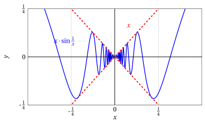
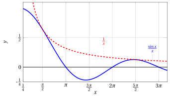
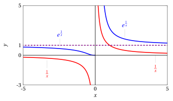

# Computing limits of functions

**Part 3 · Limits of functions and continuity · Chapter 2** · lecture notes by Fabio Furini · [:material-file-pdf-box: Lecture notes, volume (PDF)](../pdf/lecture-notes-3-limits.pdf)

## 1. Computing limits of functions

- We state the theorems on limits of functions that follow immediately from the corresponding theorems on limits of sequences and from the sequential definition of limit

### 1.1 Algebra of limits theorem

!!! teorema "Theorem 1: Algebra of limits, case of finite limits"

    Hypotheses as $x \rr c$:

    $$
    \textbf{1.} ~~ f(x) \rr \ell_1 \in \R, \qquad \textbf{2.} ~~ g(x) \rr \ell_2 \in \R.
    $$

    Thesis as $x \rr c$:

    $$
    \textbf{1.} ~~ f(x)\pm g(x) \rr \ell_1 \pm \ell_2, \qquad \textbf{2.} ~~ f(x) \: g(x) \rr \ell_1 \: \ell_2,
    $$

    $$
    \textbf{3.} ~~ \frac{f(x)}{g(x)} \rr \frac{\ell_1}{\ell_2}  ~~~~~~( \ell_2 \neq 0, g(x) \neq 0, {\rm ~~eventually~as~~} x \rr c).
    $$

??? dimostrazione "Proof"

    Let $\{x_n\}$ be any sequence such that

    $$
    x_n \neq c, \forall n, {\rm ~~and~~} x_n \rr c {\rm ~~as~~} n \rr +\infty.
    $$

    By hypothesis we have

    $$
    f(x_n) \rr \ell_1 {\rm ~~and~~} g(x_n) \rr \ell_2 ~~~ (\ell_1,\ell_2 \in \R).
    $$

    From the theorem on the algebra of limits for sequences we therefore conclude that

    $$
    f(x_n) \pm g(x_n) \rr \ell_1 \pm \ell_2,
    $$

    and hence

    $$
    f(x) \pm g(x) \rr \ell_1 \pm \ell_2.
    $$

    Claims 2 and 3 of the theorem are proved in a perfectly analogous way. □

### 1.2 Sign-preservation theorems

!!! chiave ""

    In the following statements $\ell$ and $c$ will be points of $\R^*$ unless otherwise stated.

!!! teorema "Theorem 2: Sign preservation, $1^{st}$ form"

    Hypotheses:

    $$
    \textbf{1.} ~~f(x) \rr \ell {\rm ~~as~~} x \rr c, \qquad \textbf{2.} ~~ \ell \lessgtr 0.
    $$

    Thesis:

    $$
    f(x) \lessgtr 0 {\rm ~~eventually~as~} x \rr c.
    $$

??? dimostrazione "Proof"

    Let $\{x_n\}$ be any sequence such that

    $$
    x_n \neq c, \forall n, {\rm ~~and~~} x_n \rr c {\rm ~~as~~} n \rr +\infty
    $$

    By the hypothesis we have

    $$
    f(x_n) \rr \ell  > 0
    $$

    hence, by the sign-preservation theorem for sequences, applied to the sequence $\big\{f(x_n)\big\}$, we conclude that

    $$
    f(x_n) > 0,  ~~~~{\rm eventually}.
    $$

    Since this holds for every sequence such that $x_n \rr c$, we conclude that

    $$
    f(x) > 0,  {\rm ~~eventually,~as~~} x \rr c
    $$

    
□

!!! teorema "Theorem 3: Sign preservation for functions, $2^{nd}$ form"

    Hypotheses:

    $$
    \textbf{1.} ~~ f(x) \rr \ell \in \R {\rm ~~as~~} x \rr c,
    $$

    $$
    \textbf{2.} ~~ f(x)\ge 0 {\rm ~~eventually~as~~} x \rr c.
    $$

    Thesis:

    $$
    \ell \ge 0.
    $$

??? dimostrazione "Proof"

    It follows from the corresponding theorem for sequences. □

- For functions we also have the following sign-preservation theorem.

!!! teorema "Theorem 4: Sign preservation for continuous functions"

    Hypotheses:

    $$
    \textbf{1.} ~~ f {\rm ~~is~continuous~at~~} c \in \R,  \qquad \textbf{2.} ~~ f(c)>0.
    $$

    Thesis:

    $$
    f(x)>0 {\rm ~~eventually~as~~} x \rr c.
    $$

??? dimostrazione "Proof"

    If $f$ is continuous at $c$, then

    $$
    f(c) = \lim_{x \rr c} f(x)
    $$

    hence the hypothesis $f(c)>0$ means that

    $$
    f(c) = \lim_{x \rr c} f(x) > 0
    $$

    and this, by the sign-preservation theorem ($1^{st}$ form), implies that

    $$
    f(x) > 0 {\rm ~~eventually~as~~} x \rr c.
    $$

    
□

### 1.3 Comparison theorem

!!! teorema "Theorem 5: Comparison theorem"

    Hypotheses:

    $$
    \textbf{1.} ~~  f(x) \rr \ell {\rm ~~and~~} g(x) \rr \ell {\rm ~~as~~} x \rr c,
    $$

    $$
    \textbf{2.} ~~ f(x) \le h(x) \le g(x) {\rm ~~eventually~as~~} x \rr c.
    $$

    Thesis:

    $$
    h(x) \rr \ell {\rm ~~as~~} x \rr c.
    $$

??? dimostrazione "Proof"

    Let $\{x_n\}$ be any sequence such that

    $$
    x_n \neq c, \forall n, {\rm ~~and~~} x_n \rr c {\rm ~~as~~} n \rr +\infty
    $$

    We want to prove that

    $$
    h(x_n) \rr  \ell {\rm ~~as~~} n \rr +\infty
    $$

    By hypothesis we know that:

    $$
    f(x_n) \le h(x_n) \le g(x_n),  {\rm ~~eventually,}
    $$

    $$
    f(x_n) \rr \ell {\rm~~and~~} g(x_n) \rr \ell, {\rm ~~as~~} x_n \rr c
    $$

    Hence, by the comparison theorem for sequences applied to:

    $$
    \big\{f(x_n)\big\},~~ \big\{h(x_n)\big\}~~ {\rm and~~} \big\{g(x_n)\big\}
    $$

    we conclude that

    $$
    h(x_n) \rr \ell {\rm ~~as~~} n \rr +\infty
    $$

    
□

!!! teorema "Corollary 1: Of the comparison theorem (part I)"

    Hypotheses:

    $$
    \textbf{1.} ~~ g(x) \rr 0 {\rm ~~as~~} x \rr c,
    $$

    $$
    \textbf{2.} ~~ |h(x)| \le g(x) {\rm ~~eventually~as~~} x \rr c.
    $$

    Thesis:

    $$
    h(x) \rr 0 {\rm ~~as~~} x \rr c.
    $$

??? dimostrazione "Proof"

    It follows from the corresponding corollary for sequences. □

!!! esempio "Example 1: Corollary of the comparison theorem"

    Let us prove that:

    $$
    \lim_{x \rr 0} x \: \sin \frac{1}{x} = 0
    $$

    We have

    $$
    x \rr 0 {\rm ~~as~~} x \rr 0 {\rm ~~and~~} \lim_{x \rr 0} \sin \frac{1}{x} {\rm ~~does~not~exist~}
    $$

    hence we cannot apply Theorem [Theorem 1](#box-theoALGEBRA_LIMITI_FUNZIONI-1) on the algebra of limits for functions. 

    We have

    $$
    \left|\sin \frac{1}{x}\right| \le 1 {\rm~~hence~~} \left|x \: \sin \frac{1}{x}\right| \le |x| {\rm ~~and~~} |x| \rr 0 {\rm ~~as~~} x \rr 0.
    $$

    Hence, by Corollary [Corollary 1](#box-corolCONFRONTO_FUNZIONI_A-6) of the comparison theorem for functions, we have:

    $$
    x \: \sin \frac{1}{x} \rr 0 {\rm ~~as~~} x \rr 0.
    $$

    { .fig .ovale loading=lazy style="width:80%" }

!!! teorema "Corollary 2: Of the comparison theorem (part II)"

    Hypotheses:

    $$
    \textbf{1.} ~~  f(x) \rr 0 {\rm ~~as~~} x \rr c,
    $$

    $$
    \textbf{2.} ~~ g(x) {\rm ~~is~bounded,~eventually,~as~~}  x \rr c.
    $$

    Thesis:

    $$
    f(x) \: g(x) \rr 0 {\rm ~~as~~} x \rr c.
    $$

??? dimostrazione "Proof"

    It follows from the corresponding corollary for sequences. □

!!! esempio "Example 2: Corollary of the comparison theorem"

    Let us prove that:

    $$
    \lim_{x \rr \ip} \frac{x + \sin x}{2\: x + \cos x}= \frac{1}{2}
    $$

    Factoring, we obtain

    $$
    \frac{x + \sin x}{2\: x + \cos x} = \frac{x \left( 1+ \frac{\sin x}{x} \right)}{2\:x \left( 1+ \frac{\cos x}{2\:x} \right)} = \frac{1}{2} \left(\frac{  1+ \frac{\sin x}{x} }{ 1+ \frac{\cos x}{2\:x} } \right)
    $$

    By Corollary [Corollary 2](#box-corolCONFRONTO_FUNZIONI_B-8) of the comparison theorem for functions, we have:

    $$
    \frac{\sin x}{x} \rr 0 {\rm ~~and~~} \frac{\cos x}{2\: x} \rr 0 {\rm ~~as~~} x \rr \ip.
    $$

    { .fig .ovale loading=lazy style="width:80%" }

    Then, by Theorem [Theorem 1](#box-theoALGEBRA_LIMITI_FUNZIONI-1) on the algebra of limits, we therefore have:

    $$
    \frac{x + \sin x}{2\: x + \cos x} \rr \frac{1}{2} {\rm ~~as~~} x \rr \ip.
    $$

### 1.4 Theorems of partial arithmetization of the infinity symbol

!!! teorema "Theorem 6: Partial arithmetization of the infinity symbol (addition)"

    Hypotheses as $x \rr c$:

    $$
    \textbf{1.} ~~ f(x) \rr \ell \in \R, \qquad \textbf{2.} ~~ g(x) \rr \ip, \qquad \textbf{3.} ~~  h(x) \rr \ip.
    $$

    Thesis as $x \rr c$:

    $$
    \textbf{1.} ~~ f(x) + g(x)  \rr \ell  \ip = \ip, \qquad \textbf{2.} ~~ f(x) - g(x)  \rr \ell  \im = \im,
    $$

    $$
    \textbf{3.} ~~ g(x) + h(x) \rr \ip \ip = \ip, \qquad \textbf{4.} ~~ -g(x) - h(x) \rr \im \im = \im.
    $$

??? dimostrazione "Proof"

    It follows from the corresponding theorem for sequences. □

!!! teorema "Theorem 7: Partial arithmetization of the infinity symbol (product)"

    Hypotheses as $x \rr c$:

    $$
    \textbf{1.} ~~ f(x) \rr \ell \in \R, \qquad \textbf{2.} ~~ g(x) \rr 0, \qquad \textbf{3.} ~~  h(x) \rr \infty.
    $$

    Thesis as $x \rr c$:

    $$
    \textbf{1.} ~~ f(x) \:\: h(x)  \rr \ell \cdot \infty = \infty \quad (\ell \neq 0),
    \qquad	
    \textbf{2.} ~~ \frac{f(x)}{g(x)}  \rr \frac{\ell}{0} = \infty \quad (\ell \neq 0),
    $$

    $$
    \textbf{3.} ~~ \frac{f(x)}{h(x)}  \rr \frac{\ell}{\infty} = 0.
    $$

??? dimostrazione "Proof"

    It follows from the corresponding theorem for sequences. □

- As for sequences, the <strong>sign</strong> of $\infty$ must be determined with the <strong>rule of signs</strong>.

!!! esempio "Example 3: Partial arithmetization of the infinity symbol"

    $$
    \lim_{x \rr \im} \left(\frac{1}{x} - 2\right) \: x^3 = \ip
    $$

    Since $\left(\frac{1}{x} - 2\right) \rr -2 {\rm ~~and~~} x^3 \rr \im \quad {\rm as~~} x \rr \im$.

## 2. Change of variable theorem for limits

!!! teorema "Theorem 8: Change of variable in the limit"

    Let $f$ and $g$ be two functions for which the composition $f \circ g$ is defined, at least eventually as $x \rr x_0 \in \R^*.$ If:

    $$
    1.~~~ \lim_{x \rr x_0} g(x) = t_0 \in \R^*,~~~2.~~~ \lim_{t \rr t_0} f(t) = \ell \in \R^*
    $$

    $$
    3.~~~ g(x) \neq t_0,  {\rm ~~~eventually,~as~~~} x \rr x_0
    $$

    Then:

    $$
    \lim_{x  \rr x_0} f\big(g(x)\big) = \lim_{t  \rr t_0} f(t).
    $$

!!! chiave ""

    Hypothesis $3.$ is not necessary when $f$ is continuous at $t_0$, or when $t_0= \pm \infty$.

??? dimostrazione "Proof"

    Let $\{x_n\}$ be any sequence such that

    $$
    x_n \neq x_0, \forall n, {\rm ~~and~~} x_n \rr x_0 {\rm ~~as~~} n \rr +\infty.
    $$

    We have

    $$
    g(x_n) \rr t_0 {\rm ~~as~~} n \rr +\infty  ~~({\rm by~hypothesis}~1)
    $$

    and

    $$
    g(x_n) \neq t_0, {\rm ~~eventually~~} ~({\rm by~hypothesis}~3).
    $$

    Therefore

    $$
    f\big(g(x_n)\big) \rr \ell ~~({\rm by~hypothesis}~2).
    $$

    If $t_0= \pm \infty$ the condition $g(x) \neq \pm \infty$ is obviously satisfied, while if $f$ is continuous at $t_0$, $\ell = f(t_0)$, so if $g(x_n)= t_0$ for some $n$ we would have

    $$
    f\big(g(x_n)\big)= f(t_0)= \ell
    $$

    and hence the convergence

    $$
    f\big(g(x_n)\big) \rr \ell {\rm ~~as~~} n \rr +\infty
    $$

    would be guaranteed anyway. □

!!! esempio "Example 4: Computing a limit with the change of variable theorem"

    Let us compute the limit

    $$
    \lim_{x \rr \ip} \log \left ( \frac{2\:x^3+4\:x+1}{5\:(x+1)^3} \right)
    $$

    The functions $f$ and $g$ are:

    $$
    g(x) = \left ( \frac{2\:x^3+4\:x+1}{5\:(x+1)^3} \right) {\rm ~~~~and~~~~} f(t) = \log t.
    $$

    We have $t=g(x)$ and

    $$
    (f \circ g)(x) = f\big(g(x)\big) = \log \left ( \frac{2\:x^3+4\:x+1}{5\:(x+1)^3} \right) ~~~~{\rm and ~~~~} x_0 = \ip.
    $$

    We compute

    $$
    \lim_{x \rr \ip} g(x) = \frac{2}{5} ~~~~{\rm and ~consequently~~~} t_0 = \frac{2}{5}.
    $$

    Now we compute

    $$
    \lim_{t \rr 2/5} \log t = \log{\frac{2}{5}} \quad({\rm as~we~will~see,~the~logarithm~is ~continuous~in~} \R_+)
    $$

    Hence

    $$
    \lim_{x \rr \ip} f\big(g(x)\big) = \log{\frac{2}{5}}
    $$

    { .fig .ovale loading=lazy style="width:80%" }

    Moreover:

    $$
    \lim_{x \rr 0} f\big(g(x)\big)=\log{\frac{1}{5}}
    $$

    using the theorem we have:

    $$
    \lim_{x \rr 0} g(x) = \frac{1}{5} {\rm ~~~and~~~}  \lim_{t \rr 1/5} \log t = \log{\frac{1}{5}}
    $$

    since

    $$
    \lim_{x \rr 0} 2\:x^3+4\:x+1 = 1  {\rm ~~~and~~~}   \lim_{x \rr 0} 5\:(x+1)^3= 5
    $$

!!! esempio "Example 5: Computing a limit with the change of variable theorem "

    Let us compute the limits

    $$
    \lim_{x \rr 0^+} e^{\frac{1}{x}}  {\rm ~~~~and~~~~} \lim_{x \rr 0^-} e^{\frac{1}{x}}.
    $$

    The functions $f$ and $g$ are:

    $$
    g(x) = \frac{1}{x} {\rm ~~~~and~~~~} f(t) = e^t.
    $$

    We have $t=g(x)$ and

    $$
    (f \circ g) (x) = f\big(g(x)\big) = e^{\frac{1}{x}}~~~~{\rm moreover ~~~~} x_0 = 0^+ {\rm ~~~~and~~~~} x_0 = 0^-.
    $$

    1. $\frac{1}{x} \rr \ip$ as $x \rr 0^+$ and hence $t_0=\ip$. Now we compute:

        $$
        \lim_{t \rr \ip} e^t = \ip {\rm ~~~~hence~~~~}
        \lim_{x \rr 0^+} e^{\frac{1}{x}} = \ip.
        $$

    2. $\frac{1}{x} \rr \im$ as $x \rr 0^-$ and hence $t_0=\im$. Now we compute:

        $$
        \lim_{t \rr \im} e^t = 0 {\rm ~~~~hence~~~~} \lim_{x \rr 0^-} e^{\frac{1}{x}} = 0.
        $$

    { .fig .ovale loading=lazy style="width:80%" }
