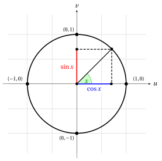
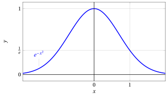

# Continuous functions

**Part 3 · Limits of functions and continuity · Chapter 4** · lecture notes by Fabio Furini · [:material-file-pdf-box: Lecture notes, volume (PDF)](../pdf/lecture-notes-3-limits.pdf)

## 1. Algebra of continuous functions theorem

!!! teorema "Theorem 1: Algebra of continuous functions"

    Let $f$ and $g$ be two functions defined at least in a neighborhood of $x_0 \in \R$ and continuous at $x_0$. Then:

    $$
    \textbf{1.}~~ f(x) \pm g(x) {\rm ~~is~continuous~at~} x_0; \qquad \textbf{2.}~~ f(x) \cdot g(x) {\rm ~~is~continuous~at~} x_0;
    $$

    $$
    \textbf{3.}~~ \frac{f(x)}{g(x)} {\rm ~~is~continuous~at~} x_0 {\rm ~provided~that~} g(x_0) \neq 0.
    $$

??? dimostrazione "Proof"

    Let us prove, for example, claim 3., the others being analogous. By hypothesis we know that $f$ and $g$ are continuous at $x_0$, that is:

    $$
    f(x) \rr f(x_0) {\rm ~~ and~~ } g(x) \rr g(x_0) {\rm ~~~~as~~~~} x \rr x_0.
    $$

    Moreover $g(x_0) \neq 0$ and hence, by the sign-preservation theorem for continuous functions, $g(x) \neq 0$ eventually as $x \rr x_0$.

    Then, by the theorem on the algebra of limits, we conclude that

    $$
    \frac{f(x)}{g(x)} \rr \frac{f(x_0)}{g(x_0)} {\rm ~~~~as~~ ~~} x \rr x_0
    $$

    that is, $f(x)/g(x)$ is continuous at $x_0$. □

## 2. Continuity of elementary functions theorem

!!! teorema "Theorem 2: Continuity of elementary functions"

    The following elementary functions are continuous at all points of their domain:

    1. Powers with integer, rational or real exponent;

    2. Exponential functions;

    3. Logarithmic functions;

    4. Elementary trigonometric functions ($\sin x$, $\cos x$)

??? dimostrazione "Proof"

    For example, let us prove the continuity on the whole of $\R$ of the functions $\sin x$ and $\cos x$.

    - We have seen that $\sin x$ is continuous at $x =0$; let us show that $\cos x$ is also continuous at $x=0$.

    - The unit (trigonometric) circle shows that, if $x$ is an angle in the first quadrant,

        $$
        \sin x + \cos x \ge 1
        $$

        since 1 is the hypotenuse of a right triangle with legs $\sin x$, $\cos x$.

        { .fig .ovale loading=lazy style="width:70%" }

    - It follows that

        $$
        0 \le 1 - \cos x \le \sin x ~~~ {\rm ~for~} x \in \left[0, \frac{\pi}{2}\right], {\rm~~and~hence}
        $$

        $$
        0 \le 1 - \cos x \le |\sin x| ~~~ {\rm ~for~} x \in \left[-\frac{\pi}{2}, \frac{\pi}{2}\right]
        $$

    - Then, by the comparison theorem,

        $$
        1 - \cos x \rr 0 {\rm  ~~as~~} x \rr 0
        {\rm ~~hence~~}  \cos x \rr 1 {\rm  ~~as~~} x \rr 0
        $$

        and therefore $\cos x$ is continuous at $0$.

    
□

??? dimostrazione "Proof"

    - To now prove the continuity of $\sin x$ at a generic point $x_0 \in \R$ we consider the chain of relations:

        \begin{align*}
        | \sin(x_0 + h) - \sin x_0| &= | \sin x_0 \: \cos h + \sin h \:\cos x_0  - \sin x_0| \\[2ex] 
        & = | \sin x_0 \: (\cos h -1) + \cos x_0 \: \sin h | \\[2ex] 
        & \le |\sin x_0 \; (\cos h -1)| + |\cos x_0 \;\sin h|\\[2ex]  
        & = |\sin x_0| \: |\cos h -1| + |\cos x_0| \: |\sin h|
        \end{align*}

        Now $|\sin h|$ and $|\cos h - 1|$ tend to zero as $h \rr 0$, by what we have just proved, while $|\sin x_0|$ and $|\cos x_0|$ are constants, so

        $$
        \sin(x_0 + h) - \sin x_0  \rr 0 {\rm ~~as~~} h \rr 0
        $$

        that is

        $$
        \sin(x_0 + h) \rr \sin x_0 {\rm ~~as~~} h \rr 0
        $$

        and $\sin x$ is continuous at $x_0$. An analogous argument shows the continuity of $\cos x$.

    
□

!!! chiave ""

    - Having proved that $\sin x$, $\cos x$ are continuous on the whole of $\R$, we deduce that the functions $\tan x$, $\cot x$ are continuous on their domain (by the theorem on the algebra of continuous functions)

    - Power functions with integer exponent are continuous (on the whole of $\R$), since $f(x)=x$ is obviously continuous, and $f(x) = x^n$ is the product of $n$ continuous functions.

    - Polynomials are continuous functions, since they are obtained by adding functions of the type $c \: x^n$, which are continuous by the previous point.

    - Rational functions (i.e., quotients of polynomials) are continuous functions, except at the points where the denominator vanishes (the denominator is a polynomial, hence it vanishes at a finite number of points)

## 3. Continuity of composite functions theorem

!!! teorema "Theorem 3: Continuity of the composite function"

    Let:

    - $g$ be a function defined at least in a neighborhood of $x_0$ and continuous at $x_0$,

    - $f$ be a function defined at least in a neighborhood of $t_0=g(x_0)$ and continuous at $t_0$,

    then $f \circ g$ is defined at least in a neighborhood of $x_0$ and is continuous at $x_0$.

??? dimostrazione "Proof"

    Since $g$ is continuous at $x_0$,

    $$
    \lim_{x \rr x_0} g(x) = g(x_0) = t_0
    $$

    then, by the change of variable theorem for limits, we have:

    $$
    \lim_{x \rr x_0} f\big(g(x)\big) = \lim_{t \rr t_0} f(t)
    $$

    and since $f$ is continuous at $t_0$, we have

    $$
    \lim_{t \rr t_0} f(t) = f(t_0)
    $$

    and the thesis is proved. □

- It follows that all the functions that can be obtained from elementary functions by sums, products, quotients and compositions are continuous on their domain. <strong>Hence, by combining functions in this way, we still obtain continuous functions</strong>.

!!! chiave ""

    To summarize:

    - sums, products and quotients of continuous functions give continuous functions (where the denominator does not vanish);

    - the elementary functions of mathematical analysis are continuous on their domain;

    - the composition of continuous functions gives a continuous function.

- It is therefore possible to know a priori that a function is continuous on its domain, without applying the definition of continuity case by case.

!!! chiave ""

    <strong>For continuous functions</strong>, if $x_0$ is a point of the domain, the limit as $x \rr x_0$ is computed simply by substituting $x_0$ into the analytic expression of the function, that is:

    $$
    f(x) \rr f(x_0) {\rm ~~~~as~~~} x \rr x_0
    $$

!!! esempio "Example 1: Continuous functions and finite limits at a finite point"

    The following function is continuous for $x \in \R$:

    $$
    f(x)=e^{-x^2}
    $$

    hence:

    $$
    \lim_{x \rr 1} e^{-x^2} = e^{-1} = \frac{1}{e}
    $$

    { .fig .ovale loading=lazy style="width:80%" }

!!! esempio "Example 2: Continuous functions and finite limits at a finite point"

    The following function is continuous for $x \in \R$ with $2 \;k \;\pi \le x \le  2 \;k \;\pi+\pi, \forall k \in \Z$:

    $$
    f(x)=\sqrt{\sin x}
    {\rm ~~~~hence~~~~~}
    \lim_{x \rr \pi^{-}}  \sqrt{\sin x} =  \sqrt{\sin \pi} = 0
    $$

    { .fig .ovale loading=lazy style="width:75%" }

!!! esempio "Example 3: Continuous functions and finite limits at a finite point"

    The following function is continuous for $x \in \R$ with $x \neq (2\:k+1) \: \frac{\pi}{2}, \forall k \in \mathbb{Z}$:

    $$
    f(x)=\log_a \big( 1 + (\tan x)^2\big),~~ \forall a >0, a \neq 1
    $$

    hence:

    $$
    \lim_{x \rr 0}  \log_a \big( 1 + (\tan x)^2\big) = \log_a \big( 1 + (\tan 0)^2\big) = \log_a 1 =0
    $$

    For example, with $a=e$ we have:

    { .fig .ovale loading=lazy style="width:75%" }
