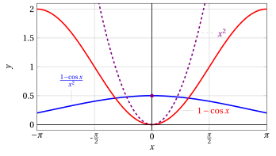
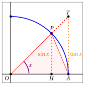
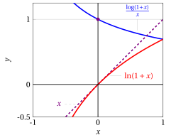
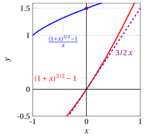
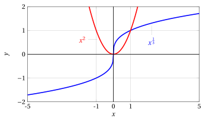
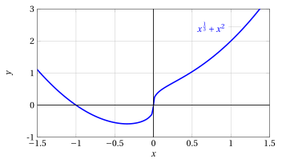
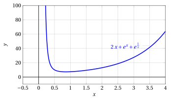
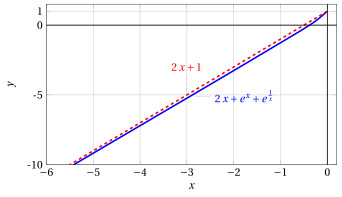

# Fundamental limits and asymptotic estimates

**Part 3 · Limits of functions and continuity · Chapter 6** · lecture notes by Fabio Furini · [:material-file-pdf-box: Lecture notes, volume (PDF)](../pdf/lecture-notes-3-limits.pdf) · [:material-presentation: Slides (PDF)](../pdf/slides-limits-06-standard-limits.pdf)

## 1. Fundamental limits

- We now look at some common techniques for computing limits that combine the general theorems on limits with the use of some fundamental limits of certain elementary functions.

### 1.1 Fundamental limits of sine and cosine

- We want to compute

    $$
    \lim_{x \rr 0} \frac{\sin x}{x} = \left[\frac{0}{0}\right]
    {\rm ~~and~~}
    \lim_{x \rr 0} \frac{1-\cos x}{x^2} = \left[\frac{0}{0}\right]
    $$

    which are indeterminate forms.

{ .fig .ovale loading=lazy style="width:80%" }

{ .fig .ovale loading=lazy style="width:80%" }

!!! teorema "Lemma 1"

    \begin{equation}
    \label{LN_1}
    \lim_{x \rr 0} \frac{\sin x}{x} =1
    \end{equation}

??? dimostrazione "Proof"

    The functions $\sin x$ and $x$ are odd functions, hence $\frac{\sin x}{x}$ is an even function.  Therefore it is sufficient to compute

    $$
    \lim_{x \rr 0^+} \frac{\sin x}{x}
    $$

    We have:

    { .fig .ovale loading=lazy style="width:42%" }

    $$
    HP=\sin x \quad AT = \tan x \quad 
    \stackrel{\LARGE\frown}{AP}
    = x
    $$

    The area of the triangle $OPA$ is smaller than that of the circular sector $OPA$, which in turn is smaller than that of the triangle $OTA$. It follows that

    $$
    \underbrace{\frac{1}{2} \cdot 1 \cdot \sin x}_{{\rm area~ triangle~} OPA} \le \underbrace{\frac{1}{2} \cdot 1 \cdot x}_{{\rm area~ circ.~sector~} OPA} \le \underbrace{\frac{1}{2} \cdot 1 \cdot \tan x}_{{\rm area~triangle~} OTA}
    $$

    that is, for $x \in  \left(0, \frac{\pi}{2}\right)$:

    $$
    \sin x < x < \tan x
    $$

    Dividing by $\sin x$, which is positive because $x \in  \left(0, \frac{\pi}{2}\right)$, we have

    $$
    1 < \frac{x}{\sin x} < \frac{1}{\cos x}, \quad \forall x \in  \left(0, \frac{\pi}{2} \right)
    {\rm ~~~~that~is~~~~}
    \cos x < \frac{\sin x}{x} < 1, \quad \forall x \in  \left(0, \frac{\pi}{2} \right)
    $$

    By the comparison theorem, since $\lim_{x \rr 0} \cos x= 1$, the lemma follows. □

{ .fig .ovale loading=lazy style="width:52%" }

!!! teorema "Lemma 2"

    \begin{equation}
    \label{LN_2}
    \lim_{x \rr 0} \frac{1 - \cos x}{x^2} = \frac{1}{2}
    \end{equation}

??? dimostrazione "Proof"

    We consider

    $$
    \frac{1-\cos x}{x^2} = \frac{1-\cos^2 x}{x^2 \:(1+\cos x)}= \left( \frac{\sin x}{x} \right)^2 \: \frac{1}{1 + \cos x}
    $$

    hence, since $\frac{\sin x}{x} \rr 1 {\rm ~~and~~} (1 + \cos x) \rr 2 {\rm ~~as~~} x \rr 0$, the claim follows. □

{ .fig .ovale loading=lazy style="width:70%" }

### 1.2 Continuous extension of a function

- Based on the limit \(\eqref{LN_1}\) just proved, the functions $f(x) = \frac{\sin x}{x}$ and $g(x) = \frac{1-\cos x}{x^2}$, initially not defined at $x = 0$, can be extended by continuity also at $x = 0$, by setting

    $$
    f(x)= 
    \begin{cases}
    \frac{\sin x}{x} & {\rm if~~} x \neq 0\\
    1 & {\rm if~~} x = 0
    \end{cases}
    \qquad 
    g(x)= 
    \begin{cases}
    \frac{1- \cos x}{x^2} & {\rm if~~} x \neq 0\\
    \frac{1}{2} & {\rm if~~} x = 0
    \end{cases}
    $$

    The functions $f$ and $g$ defined in this way are continuous also at $x = 0$.

!!! chiave ""

    - if a function $f(x)$ is not defined at $x_0$ but the finite limit exists

        $$
        \lim_{x \rr x_0} f(x) = \ell
        $$

        the function can be extended by continuity also at $x_0$, by defining

        $$
        f(x_0) = \ell
        $$

    - If instead the function $f$ has at $x_0$ a jump discontinuity, a vertical asymptote, or in any case does not have a finite limit, it is not possible to make it continuous at $x_0$ by changing its definition at a single point.

### 1.3 Other fundamental limits

- We know that for every sequence $\{a_n\}$ diverging to $\ip$ or $\im$ we have

    $$
    \lim_{n \rr \ip} \left(1 + \frac{1}{a_n}\right)^{a_n} = e
    $$

- By the sequential definition of the limit of a function, this fact immediately implies the next fundamental limit

!!! teorema "Lemma 3"

    \begin{equation}
    \label{LN_3}
    \lim_{x \rr \pm \infty} \left(1 + \frac{1}{x}\right)^x = e
    \end{equation}

{ .fig .ovale loading=lazy style="width:80%" }

!!! chiave ""

    If $\eta(x)$ is a function that tends to infinity[^1] (i.e., it is an infinity: $\eta(x) \rr \pm\infty$), we have: 

    \begin{align}
    \left( 1 + \frac{1}{\eta(x)} \right)^{\eta(x)} \rr e
    \end{align}

!!! esempio "Example 1: Limits of functions tending to $e$"

    1.

        $$
        \lim_{x \rr \ip} \left( 1 + \frac{1}{2\:x^2-10} \right)^{2\:x^2-10} = e
        $$

        since with $\eta(x) = 2\:x^2-10$ we have

        $$
        \eta(x) \rr \ip {\rm~~as~~} x \rr \ip.
        $$

    2.

        $$
        \lim_{x \rr 0^+} \left( 1 + \frac{1}{1/x} \right)^{1/x} = e
        $$

        since with $\eta(x) = \frac{1}{x}$ we have

        $$
        \eta(x) \rr \ip {\rm~~as~~} x \rr 0^+.
        $$

<strong>From the fundamental limit \(\eqref{LN_3}\) three more can be deduced </strong>

!!! teorema "Corollary 1"

    \begin{equation}
    \label{LN_4}
    \lim_{y \rr 0} \frac{\log(1 + y)}{y} =1
    \end{equation}

??? dimostrazione "Proof"

    Taking logarithms in \(\eqref{LN_3}\), we obtain

    $$
    \log \left(1 + \frac{1}{x}\right)^x = x \: \log \left(1 + \frac{1}{x}\right)
    $$

    hence

    $$
    \lim_{x \rr \pm \infty} x \: \log \left(1 + \frac{1}{x}\right) = \log e = 1.
    $$

    Now, if we set $y=\frac{1}{x}$, $x \rr \pm \infty$ is equivalent to $y \rr 0^{\pm}$, and the last limit can therefore be rewritten in the following form:

    \begin{equation*}
    \frac{\log(1 + y)}{y} \rr 1 {\rm ~~as~~} y \rr 0.
    \end{equation*}

    
□

{ .fig .ovale loading=lazy style="width:61%" }

!!! teorema "Corollary 2"

    \begin{equation}
    \label{LN_5}
    \lim_{x \rr 0}  \frac{e^x -1}{x} =1
    \end{equation}

??? dimostrazione "Proof"

    If in \(\eqref{LN_4}\) we instead set $y= e^x -1$, $y \rr 0$ is equivalent to $x \rr 0$, and substituting we obtain

    $$
    \frac{\log e^x}{e^x-1} = \frac{x}{e^x-1} \rr 1 {\rm ~~~as~~~} x \rr 0.
    $$

    Taking reciprocals we obtain the fundamental limit. □

{ .fig .ovale loading=lazy style="width:61%" }

!!! esempio "Example 2: Fundamental limit"

    We compute:

    $$
    \lim_{x \rr 0} \frac{e^{-x}-1}{x}
    $$

    We set $z= -x$; $x \rr 0$ is equivalent to $z \rr 0$, and substituting we obtain:

    $$
    \lim_{x \rr 0} \frac{e^{-x}-1}{x} = \lim_{z \rr 0} \frac{e^{z}-1}{-z}=-\lim_{z \rr 0} ~~~\underbrace{\frac{e^{z}-1}{z}}_{\rr 1}=-1
    $$

!!! teorema "Corollary 3"

    \begin{equation}
    \label{LN_5__2}
    \lim_{x \rr 0} \frac{ (1 + x)^{\alpha} -1}{x} = \alpha {\rm ~~~~~~~~with~~~} \alpha \in \R
    \end{equation}

??? dimostrazione "Proof"

    If in \(\eqref{LN_4}\) we instead set $y= (1+x)^{\alpha} -1$, with $\alpha$ any real exponent, then $x \rr 0$ is equivalent to $y \rr 0$ and we have:

    \begin{align*}
    \frac{\log(1 + y)}{y} &= \frac{\log[1 + (1+x)^{\alpha} -1]}{(1+x)^{\alpha} -1} = \frac{\alpha \log (1+x)}{(1+x)^{\alpha} -1}\\[2ex]
     & = \frac{\alpha \: x}{(1+x)^{\alpha} -1} \cdot \frac{\log(1+x)}{x} \rr 1  {\rm ~~as~~} x \rr 0.
    \end{align*}

    But since also

    $$
    \frac{\log(1+x)}{x} \rr 1 {\rm ~~as~~} x \rr 0,
    $$

    then

    $$
    \frac{\alpha \: x}{(1+x)^{\alpha} -1} \rr 1 {\rm ~~~as~~~} x \rr 0.
    $$

    Taking reciprocals and then multiplying by $\alpha$ we obtain the fundamental limit. □

{ .fig .ovale loading=lazy style="width:61%" }

## 2. Asymptotic estimates

!!! definizione "Definition 1: Asymptotic functions"

    Two functions $f$ , $g$ are said to be <strong>asymptotic</strong> as $x \rr c$ if

    $$
    \lim_{x \rr c} \frac{f(x)}{g(x)}=1
    $$

    and we write $f \thicksim g$ as $x \rr c$.

- The asymptotic symbol for functions enjoys all the properties stated for sequences

!!! chiave ""

    As $x \rr 0$ we have (from the fundamental limits):

    

    \begin{align}
    \sin x &\thicksim x\\[2ex]
    \log(1+x) &\thicksim x\\[2ex] 
     \cos x & \thicksim  1- \frac{1}{2} x^2\\[2ex]
     e^x &\thicksim 1+ x\\[2ex] 
    (1+x)^{\alpha}  &\thicksim 1 + \alpha \: x  {\rm ~~~~~~~~with~~~} \alpha \in \R
    \end{align}

- The functions $\thicksim x$ behave, to a first approximation or to first order, like $x$ as $x \rr 0$.

!!! chiave ""

    If $\varepsilon(x)$ is a function that tends to zero[^2] (i.e., it is an infinitesimal: $\varepsilon(x) \rr 0$), we have:

    

    \begin{align}
    \sin \big( \varepsilon(x) \big) &\thicksim \varepsilon(x)\\[2ex]
     \log \big(1+\varepsilon(x)\big) &\thicksim \varepsilon(x)\\[2ex]
     \cos \big( \varepsilon(x) \big) &\thicksim 1 - \frac{1}{2} \;\varepsilon^2(x)\\[2ex]
     e^{\varepsilon(x)} &\thicksim 1 +\varepsilon(x)\\[2ex]
      \big(1+\varepsilon(x)\big)^{\alpha}  & \thicksim 1+ \alpha \; \varepsilon(x)  {\rm ~~~~~~~~with~~~} \alpha \in \R
    \end{align}

- Formulas \(\eqref{LIM_NOT_C__2}\) follow from formulas \(\eqref{LIMMMM}\) simply by a change of variable

    $$
    x = \varepsilon(x)
    $$

!!! esempio "Example 3: Limits with asymptotic functions"

    $$
    \lim_{x \rr 1} \frac{(x-1)^2}{e^{3\: (x-1)^2}-1} = \left[\frac{0}{0}
     \right]
    $$

    We use the estimate

    $$
    e^{\varepsilon(x)} -1  \thicksim \varepsilon(x)
    $$

    with

    $$
    \varepsilon(x) = 3 \: (x-1)^2 {\rm ~~and~~} \varepsilon(x) \rr 0 {\rm ~~as~~} x \rr 1
    $$

    Then, as $x \rr 1$, we have

    $$
    e^{3\: (x-1)^2}-1 \thicksim 3\: (x-1)^2.
    $$

    and

    $$
    \lim_{x \rr 1} \frac{(x-1)^2}{e^{3\: (x-1)^2}-1} = \lim_{x \rr 1} \frac{(x-1)^2}{3\: (x-1)^2} = \frac{1}{3}
    $$

!!! esempio "Example 4: Limits with asymptotic functions"

    $$
    \lim_{x \rr 0} \frac{\log(1+2\:x)}{\sin 3\:x} = \left[\frac{0}{0}
     \right]
    $$

    We use the estimate

    $$
    \log(1 + \varepsilon(x))   \thicksim \varepsilon(x)
    $$

    with

    $$
    \varepsilon(x) = 2 \: x {\rm ~~and~~} \varepsilon(x) \rr 0 {\rm ~~as~~} x \rr 0.
    $$

    Hence, as $x \rr 0$ we have

    $$
    \log(1 + 2\:x) \thicksim 2 x
    $$

    Now we also use the estimate

    $$
    \sin{\varepsilon(x)}   \thicksim \varepsilon(x)
    $$

    with

    $$
    \varepsilon(x) = 3 \: x {\rm ~~and~~} \varepsilon(x) \rr 0 {\rm ~~as~~} x \rr 0
    $$

    Hence, as $x \rr 0$ we have

    $$
    \sin 3\: x \thicksim 3 x
    $$

    Then, as $x \rr 0$, we have

    $$
    \frac{\log(1+2\:x)}{\sin 3\:x} \thicksim \frac{2\:x}{3\:x}
    $$

    and

    $$
    \lim_{x \rr 0} \frac{\log(1+2\:x)}{\sin 3\:x} = \lim_{x \rr 0} \frac{2\:x}{3\:x} = \frac{2}{3}
    $$

!!! esempio "Example 5: Limits with asymptotic functions"

    $$
    \lim_{x \rr \ip}  \sqrt[3]{x^3 + 2\: x^2 +1} - x= \left[\ip \im
     \right]
    $$

    We rewrite,

    $$
    \sqrt[3]{x^3 + 2\: x^2 +1} - x  = x \: \left( \sqrt[3]{1 + \left( \frac{2}{x} + \frac{1}{x^3} \right)} - 1 \right)
    $$

    We use the estimate

    $$
    \sqrt[3]{1 +\varepsilon(x)} -1 \thicksim \frac{1}{3} \varepsilon(x)
    $$

    with

    $$
    \varepsilon(x) = \left( \frac{2}{x} + \frac{1}{x^3} \right) {\rm ~~and~~} \varepsilon(x) \rr 0 {\rm ~~as~~} x \rr \ip.
    $$

    Then, as $x \rr \ip$, we have

    $$
    \sqrt[3]{x^3 + 2\: x^2 +1} - x \thicksim x \left[ \frac{1}{3} \: \left( \frac{2}{x} + \frac{1}{x^3} \right) \right]
    $$

    and

    $$
    \lim_{x \rr \ip} \sqrt[3]{x^3 + 2\: x^2 +1} - x = \lim_{x \rr \ip} x \left[ \frac{1}{3} \: \left( \frac{2}{x} + \frac{1}{x^3} \right) \right] = \frac{2}{3}
    $$

## 3. Asymptotic estimates and graphs

- Asymptotic estimates are useful not only for computing limits, but also for sketching the qualitative graph of a function in a neighborhood of a given point, or as $x \rr \pm \infty$.

!!! esempio "Example 6: Known graphs"

    { .fig .ovale loading=lazy style="width:80%" }

!!! esempio "Example 7: Qualitative graph"

    We now want to study the qualitative graph of the function (the sum of the previous two):

    $$
    f(x) = \sqrt[3]{x} + x^2= x^{\frac{1}{3}} + x^2
    $$

    - the function is defined and continuous on all of $\R$;

    - as $x \rr \pm \infty$, $f(x) \thicksim x^2$, since

        $$
        \lim_{x \rr \pm \infty} \frac{x^{\frac{1}{3}} + x^2}{x^2} =1
        $$

        Therefore $f(x) \rr \ip$ as $x \rr \pm \infty$; moreover, for $x$ large in absolute value, its graph will be similar to that of $x^2$.

    - Moreover, the function vanishes at $x = 0$ and, as $x \rr  0$, $f(x) \thicksim x^{\frac{1}{3}}$, since

        $$
        \lim_{x \rr  0} \frac{x^{\frac{1}{3}} + x^2}{x^{\frac{1}{3}}} =1
        $$

        therefore, in a neighborhood of $x = 0$, its graph will be similar to that of $x^{\frac{1}{3}}$; in particular, it will have a vertical tangent at the origin.

!!! esempio "Example 8: Actual graph"

    $$
    f(x) = \sqrt[3]{x} + x^2= x^{\frac{1}{3}} + x^2
    $$

    { .fig .ovale loading=lazy style="width:80%" }

- Often the behavior of a function in a neighborhood of a point (for example, the fact that it has a vertical or horizontal tangent) can be predicted from a suitable asymptotic estimate.

- The asymptotic estimate allows us to sketch the qualitative graph of $f$ (in a neighborhood of the point) by comparison with that of a known function (for example, a power with rational exponent).

- Analogous estimates are useful as $x \rr \pm \infty$.

<strong>Growth of a function at infinity</strong>

- Suppose we want to sketch the graph of a function $f$ that, as $x \rr \ip$ (or $\im$), tends to $\ip$ (or $\im$).

- To describe the speed at which the function tends to infinity, the following notions are useful: we say that, as $x \rr \ip$,

    $$
    f {\rm~~has}
    \begin{cases}
    {\rm superlinear~growth}\\
    {\rm linear~growth}\\
    {\rm sublinear~growth}\\
    \end{cases}
    \quad
    {\rm if}
    \quad
    \lim_{x \rr \ip} \frac{f(x)}{x}=
    \begin{cases}
    \pm \infty\\
    m ~~~~({\rm ~finite~and~different~from~} 0)\\
    0\\
    \end{cases}
    $$

- Analogous definitions are given for $x \rr \im$.

- Only when a function has linear growth is it possible for it to have an oblique asymptote

!!! esempio "Example 9: Growth of a function at infinity"

    For example, as $x \rr \ip$

    - Superlinear growth:$~~~$  exponentials $a^x$ and powers $x^a$ with $a > 1$.

    - Sublinear growth:$~~~$ logarithms $\log_a x$ and powers $x^a$ with $0 < a < 1$.

!!! esempio "Example 10: Growth of a function at infinity"

    The function

    $$
    f(x) = 2\:x + e^x + e^{\frac{1}{x}}
    $$

    - as $x \rr  \ip$ it is asymptotic to $e^x$; therefore it tends to $\ip$ with superlinear growth;

    - as $x \rr \im$ it is asymptotic to $2\:x$; therefore it tends to $\im$ linearly

    - since

        $$
        \lim_{x \rr \im}[f(x) - 2\:x] = 1
        $$

        the function has the oblique asymptote

        $$
        y = 2\:x + 1 {\rm ~~as~~} x \rr \im
        $$

!!! esempio "Example 11: Graphs"

    $$
    f(x) = e^x, ~~~ \lim_{x \to \ip} e^x = \ip, ~~~ \lim_{x \to \im} e^x = 0, ~~~ \lim_{x \to 0} e^x = 1
    $$

    { .fig .ovale loading=lazy style="width:80%" }

    $$
    f(x) = e^{\frac{1}{x}}, ~~~ \lim_{x \to \ip} e^{\frac{1}{x}} = 1, ~~~ \lim_{x \to \im} e^{\frac{1}{x}} = 1, ~~~ \lim_{x \to 0^-} e^{\frac{1}{x}} = 0, ~~~ \lim_{x \to 0^+} e^{\frac{1}{x}} = \ip
    $$

    { .fig .ovale loading=lazy style="width:80%" }

!!! esempio "Example 12: Actual graph"

    $$
    f(x) = 2\:x + e^x + e^{\frac{1}{x}},~~~~ f(x) \thicksim e^x {\rm ~~as~~} x \to \ip,~~~~ \lim_{x \to 0^+} f(x) = \ip
    $$

    { .fig .ovale loading=lazy style="width:85%" }

    $$
    f(x) = 2\:x + e^x + e^{\frac{1}{x}},~~~~ f(x) \thicksim 2\;x {\rm ~~as~~} x \to \im,~~~~ \lim_{x \to 0^-} f(x) = 1
    $$

    { .fig .ovale loading=lazy style="width:85%" }

[^1]: it does not matter what $x$ tends to
[^2]: it does not matter what $x$ tends to
