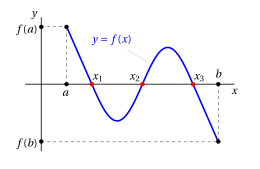
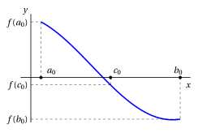
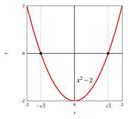
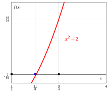
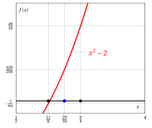
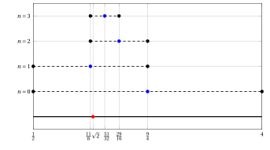

# Intermediate zero theorem and bisection method

**Part 3 · Limits of functions and continuity · Chapter 8** · lecture notes by Fabio Furini · [:material-file-pdf-box: Lecture notes, volume (PDF)](../pdf/lecture-notes-3-limits.pdf) · [:material-presentation: Slides (PDF)](../pdf/slides-limits-08-zeros-bisection.pdf)

## 1. Zeros of a function

!!! chiave ""

    Given a function $f$, we are interested in solving the equation:

    \begin{equation}
    f(x) =0 \label{TTT}
    \end{equation}

    that is, in finding the <strong>zeros</strong> of $f$. The zeros are the solutions of equation \(\eqref{TTT}\), that is, the points $c$ of the domain of the function where $f(c)=0$.

- When $f$ is a polynomial of degree $\le 4$ there are formulas that give the solutions of \(\eqref{TTT}\). However, if $f$ is a polynomial of degree $> 4$ or a more complicated function, except in particularly lucky cases, there are no formulas for the solutions of equation \(\eqref{TTT}\).

- Geometrically, solving equation \(\eqref{TTT}\) means determining the $x$-coordinates of the intersection points between the graph of $y = f (x)$ and the $x$-axis.  There can be: <strong>infinitely many solutions</strong>, <strong>a finite number of solutions</strong>, <strong>no solutions</strong>.

!!! esempio "Example 1: Zeros of a function"

    Consider the function $f$ with the following graph:

    { .fig .ovale loading=lazy style="width:85%" }

    the equation $f(x) = 0$ has 3 solutions  in the interval $[a,b]$, that is, the function $f$ has 3 zeros, $x_1$, $x_2$ and $x_3$.

!!! teorema "Theorem 1: Intermediate zero theorem (Bolzano's theorem)"

    If  a function $f: [a,b] \rr \R$ is continuous on the interval $[a,b]$ and $f(a) \cdot f(b) < 0$,  then there exists $c \in (a, b)$  such that  $f(c) = 0$. If $f$ is also strictly monotonic then the zero $c$ is unique.

- The idea of the proof is to construct two sequences that converge to the zero of the function. To understand how to construct them,  consider for example a function  with $f(a)>0$ and $f(b) < 0$:

    { .fig .ovale loading=lazy style="width:70%" }

- We set $a_0=a$ and $b_0=b$ and compute

    $$
    c_0 = \frac{a_0+b_0}{2}, {\rm ~~the~
    midpoint~of~the~interval~~} [a_0, b_0].
    $$

    In the previous example we have:

    { .fig .ovale loading=lazy style="width:70%" }

    If $f(c_0)=0$ we have found a zero. If $f(c_0) \neq 0$ we look at the sign of $f(a_0) \cdot f(c_0)$ and proceed as follows:

    $$
    \begin{cases}
    {\rm if~~} f(a_0) \cdot f(c_0) <0 \\[2ex]
    {\rm if~~} f(a_0) \cdot f(c_0) >0 
    \end{cases} 
    ~~~~{\rm ~~we~create~~} [a_1,b_1]~~~
    \begin{cases}
     {\rm~~with~~} a_1 =a_0, ~~b_1=c_0\\[2ex]
     {\rm~~with~~} a_1 =c_0, ~~b_1=b_0
    \end{cases}
    $$

    In the previous example we have $f(a_0) \cdot f(c_0) <0$, hence we have  $a_1 =a_0, ~~b_1=c_0$.

- With $a_1$ and $b_1$, we compute:

    $$
    c_1 = \frac{a_1+b_1}{2}, {\rm ~~the~
    midpoint~of~the~interval~~} [a_1, b_1].
    $$

    In the previous example we have:

    { .fig .ovale loading=lazy style="width:70%" }

    If $f(c_1)=0$ we have found a zero. If $f(c_1) \neq 0$ we look at the sign of $f(a_1) \cdot f(c_1)$ and proceed as follows:

    $$
    \begin{cases}
    {\rm if~~} f(a_1) \cdot f(c_1) <0 \\[2ex]
    {\rm if~~} f(a_1) \cdot f(c_1) >0 
    \end{cases} 
    ~~~~{\rm ~~we~create~~} [a_2,b_2]~~~
    \begin{cases}
     {\rm~~with~~} a_2 =a_1, ~~b_2=c_1\\[2ex]
     {\rm~~with~~} a_2 =c_1, ~~b_2=b_1
    \end{cases}
    $$

    In the previous example we have $f(a_1) \cdot f(c_1) >0$, hence we have  $a_2 =c_1, ~~b_2=b_1$.

- We now generalize this idea in the proof of the theorem.

??? dimostrazione "Proof"

    Consider the following two recursively defined sequences:

    $$
    a_0 =a, \qquad  a_{n+1} = \begin{cases}
    a_n {\rm ~~if~~} f(a_n) \cdot f(c_n) <0 \\[2ex]
    c_n {\rm ~~if~~} f(a_n) \cdot f(c_n) >0 
    \end{cases}  \quad \forall n \in \N
    $$

    $$
    b_0 =b, \qquad  b_{n+1} = \begin{cases}
    c_n {\rm ~~if~~} f(a_n) \cdot f(c_n) <0 \\[2ex]
    b_n {\rm ~~if~~} f(a_n) \cdot f(c_n) >0 
    \end{cases}  \quad \forall n \in \N
    $$

    where

    $$
    c_n = \frac{a_n+b_n}{2},\quad \forall n \in \N
    $$

    The two sequences create a sequence of intervals $[a_n,b_n]$ with the following properties:

    1. We have $a_n \le a_{n+1},$ hence the sequence $\{a_n\}$ is increasing and, since $a_n \le b, \forall n,$ it is  also  bounded.  Moreover, we have $b_n \ge b_{n+1},$ hence the sequence $\{b_n\}$ is decreasing and,   since $b_n \ge  a,\forall n,$ it is also bounded.

    2. $b_n - a_n = \frac{b-a}{2^n}$ $~~$ (each interval is half as long as the previous one)

    3. $f(a_n)\cdot f(b_n) < 0$ $~~$ (because of how $a_n$ and $b_n$ were chosen at each step)

    By point 1), we can then deduce that the sequences $\{a_n\}$ and $\{b_n\}$ have a finite limit, thanks to the  monotone sequence  theorem. Hence:

    $$
    a_n \rr \ell_1 \in \R {\rm ~~and~~} b_n \rr \ell_2 \in \R {\rm ~~ as ~~} n \rr \ip.
    $$

    From point 2) we deduce that:

    $$
    b_n - a_n = \frac{b - a}{2^n} \rr 0 {\rm ~~as~~} n \rr \ip,
    {\rm ~~~~and~therefore~~~~}
     \ell_2=\ell_1=\ell
    $$

    By the continuity of $f$, we then have that:

    $$
    f(a_n) \cdot f(b_n) \rr \big(f(\ell)\big)^2 {\rm ~~~as~~~} n \rr \ip
    $$

    On the other hand, from point 3) and the sign-preservation theorem we deduce $\big(f(\ell)\big)^2 \le 0$. Therefore it must be $f(\ell)=0$ and thus $\ell$ is the zero we are looking for,  that is, $c=\ell$. □

- We have proved:

    \begin{equation*}
    f: [a,b] \rr \R  {\rm ~~continuous~on~~} [a,b] {\rm ~~and~~} f(a) \cdot f(b) < 0  ~~~\Rightarrow~~~ {\rm ~~there~exists~} c \in [a,b]  {\rm ~~such~that~} f(c)=0
    \end{equation*}

    hence “$f: [a,b] \rr \R$  continuous on $[a,b]$ and $f(a) \cdot f(b) < 0$” is a sufficient condition for “there exists $c \in [a,b]$ such that $f(c)=0$” and “there exists $c \in [a,b]$ such that $f(c)=0$” is a necessary condition for “$f: [a,b] \rr \R$  continuous on $[a,b]$ and $f(a) \cdot f(b) < 0$”. The implication does not work in the other direction:

    \begin{equation*}
    {\rm ~~there~exists~} c \in [a,b]  {\rm ~~such~that~} f(c)=0 ~~~\nRightarrow~~~ f: [a,b] \rr \R  {\rm ~~continuous~on~~} [a,b] {\rm ~~and~~} f(a) \cdot f(b) < 0
    \end{equation*}

    It suffices, for example, to consider $f(x)=x^2-2$ on the interval $[-2,2]$. We have  $f(-2)=2$ and $f(2)=2$, hence $f(a) \cdot f(b) \nless 0$, but the function does have zeros:

    { .fig .ovale loading=lazy style="width:52%" }

    Hence the theorem provides <strong>sufficient</strong> (but not necessary) conditions  for the existence of a zero of a function.

- The proof of the theorem is constructive, that is, we have constructed two sequences that tend to a zero of the function   (<strong>constructive proof/<strong>algorithm</strong></strong>). This algorithm is called the <strong>bisection method</strong>.

    !!! chiave ""

        If the function $f$ has several zeros in $[a, b]$, the procedure does not indicate which of them will be determined.  The zero found depends   on the interval $[a,b]$ given as input, and finding it may require infinitely many iterations. However, by stopping the procedure, as we will see, we obtain an estimate of the zero and of the error made.

## 2. Bisection method

!!! esempio "Example 2: Bisection method"

    - We look for a zero of the continuous function $f(x) = x^2 -2$ on the interval $\left[\frac{1}{2},4\right]$, that is, we look for the value of $\sqrt{2}$. Initialization, with $n=0$ we have:

        $$
        [a_0,b_0] = \left[\frac{1}{2},4\right], ~~~~f(a)=-\frac{7}{4}, ~~~~f(b)=14 ~~~~\Rightarrow~~~~ c_0=\frac{9}{4} {\rm~~and~~} f(c_0)=\frac{49}{16}
        $$

    { .fig .ovale loading=lazy style="width:53%" }

    - Iteration $n=1$, we have:

        $$
        [a_1,b_1] = \left[\frac{1}{2},\frac{9}{4}\right],~~~~f(a_1)=-\frac{7}{4}, ~~~~f(b_1)=\frac{49}{16}
        ~~~~\Rightarrow~~~~
        c_1=\frac{11}{8} {\rm~~and~~}  f(c_1)=-\frac{7}{64}
        $$

    { .fig .ovale loading=lazy style="width:53%" }

!!! esempio "Example 3: Bisection method"

    - Iteration $n=2$, we have:

        $$
        [a_2,b_2] = \left[\frac{11}{8},\frac{9}{4}\right], ~~~~f(a_2)=-\frac{7}{64}, ~~~~f(b_2)=\frac{49}{16}
         ~~~~\Rightarrow~~~~ c_2=\frac{29}{16} {\rm~~and~~} f(c_2)=\frac{329}{256}
        $$

    { .fig .ovale loading=lazy style="width:59%" }

    - Iteration $n=3$, we have:

        $$
        [a_3,b_3] = \left[\frac{11}{8},\frac{29}{16}\right],~~~~f(a_3)=-\frac{7}{64}, ~~~~f(b_3)=\frac{329}{256} ~~~~\Rightarrow~~~~
         c_3=\frac{51}{32} {\rm~~and~~}  f(c_3)=\frac{553}{1024}
        $$

    { .fig .ovale loading=lazy style="width:59%" }

!!! esempio "Example 4: Intervals of the bisection method"

    Plotting the values obtained in the previous exercise, we have the following intervals and estimates of $\sqrt{2}$:

    { .fig .ovale loading=lazy style="width:93%" }

### 2.1 Error estimates for the bisection method

- At iteration $n$, we have:

    $$
    c \in [a_n,b_n]
    $$

    that is, the zero lies inside the $n$-th interval. Hence, stopping the procedure after $n$ steps, $a_n$ approximates the zero from below and $b_n$ approximates the zero from above. Therefore:

    $$
    a_n \le c \le  b_n
    $$

- The estimate of the value $c$ at iteration $n$ is:

    $$
    c_{n} = \frac{a_{n}+b_{n}}{2}
    $$

    that is, the midpoint of the interval $[a_n,b_n]$.

- The absolute error $\varepsilon_n$ made at iteration $n$ is:

    $$
    \varepsilon_n = |c_{n} - c|
    $$

    !!! chiave ""

        The value of $c$ is unknown, hence we need a way to analyze the values of the errors that is independent of $c$.

- We can estimate the error at iteration $n$ as follows:

    $$
    \varepsilon_n = |c_{n} - c| \le \frac{b-a}{2^n}
    $$

    this follows from:

    - the length of the interval at iteration $n$ is $\frac{b-a}{2^n}$

    - the midpoint of this interval is $c_{n}$  and $c$ lies inside the interval itself

    - the distance of any point $c$ from the center of the interval is less than or equal  to the length of the interval itself

    !!! chiave ""

        If $n \rr \ip$ then  $\varepsilon_n \rr 0$, that is, the error tends to zero as $n$ tends to infinity.

- At iteration $n$, we can  improve the error estimate as follows:

    $$
    \varepsilon_n = |c_{n} - c|   \le \frac{1}{2} \frac{b-a}{2^n} = \frac{b-a}{2^{n+1}}
    $$

    that is, half the length of the interval $[a_n,b_n]$,  since $c \in (a_n,c_n)$ or $c \in (c_n,b_n)$.

    

    !!! esempio "Example 5: Error estimates for the bisection method ($\sqrt{2}=1.414213562\dots$)"

        Let us go back to the previous exercise with $b-a=\frac{7}{2}$; in the first 6 iterations we have:

        
<table>
        <tr>
        <td>iteration</td>
        <td>\(a_n\)</td>
        <td>\(c_n\)</td>
        <td>\(b_n\)</td>
        <td>estimate of \(\sqrt{2}\)</td>
        <td>\(\varepsilon_n\)</td>
        </tr>
        <tr>
        <td>\(n=0\)</td>
        <td>\(\frac{1}{2}\)</td>
        <td>\(\frac{9}{4}\)</td>
        <td>\(4\)</td>
        <td>\(2.25\)</td>
        <td>\(\le \frac{7/2}{2^1}=\)</td>
        <td>1.75</td>
        </tr>
        <tr>
        <td>\(n=1\)</td>
        <td>\(\frac{1}{2}\)</td>
        <td>\(\frac{11}{8}\)</td>
        <td>\(\frac{9}{4}\)</td>
        <td>\(1.375\)</td>
        <td>\(\le\frac{7/2}{2^2}=\)</td>
        <td>0.875</td>
        </tr>
        <tr>
        <td>\(n=2\)</td>
        <td>\(\frac{11}{8}\)</td>
        <td>\(\frac{29}{16}\)</td>
        <td>\(\frac{9}{4}\)</td>
        <td>\(1.8125\)</td>
        <td>\(\le \frac{7/2}{2^3}=\)</td>
        <td>0.4375</td>
        </tr>
        <tr>
        <td>\(n=3\)</td>
        <td>\(\frac{11}{8}\)</td>
        <td>\(\frac{51}{32}\)</td>
        <td>\(\frac{29}{16}\)</td>
        <td>\(1.59375\)</td>
        <td>\(\le \frac{7/2}{2^4}=\)</td>
        <td>0.21875</td>
        </tr>
        <tr>
        <td>\(n=4\)</td>
        <td>\(\frac{11}{8}\)</td>
        <td>\(\frac{95}{64}\)</td>
        <td>\(\frac{51}{32}\)</td>
        <td>\(1.484375\)</td>
        <td>\(\le \frac{7/2}{2^5}=\)</td>
        <td>0.109375</td>
        </tr>
        <tr>
        <td>\(n=5\)</td>
        <td>\(\frac{11}{8}\)</td>
        <td>\(\frac{183}{128}\)</td>
        <td>\(\frac{95}{64}\)</td>
        <td>\(1.4296875\)</td>
        <td>\(\le \frac{7/2}{2^6}=\)</td>
        <td>0.0546875</td>
        </tr>
        </table>

        { .fig .ovale loading=lazy style="width:60%" }

- In order to guarantee that the error made does not exceed a given tolerance $\delta$, that is, to impose $\varepsilon_n \le \delta$, we need to perform  $n(\delta)$ iterations, where  $n(\delta)$ is the smallest  integer that satisfies the inequality:

    $$
    n(\delta) > \log_2 \left( \frac{b-a}{\delta}\right) -1
    $$

    obtained by solving for $n(\delta)$ in the maximum error estimate:

    $$
    \delta = \frac{b-a}{2^{(n(\delta)+1)}}
    $$

    hence

    $$
    2^{(n(\delta)+1)}  = \frac{b-a}{\delta} {\rm ~~~~and~~~~}  n(\delta)+1 = \log_2 \left( \frac{b-a}{\delta}\right)
    $$

    Clearly, if $\delta \rr 0$ then  $n(\delta) \rr \ip$, and the smaller the error tolerance,  the larger the number of iterations needed to guarantee it.

- If we wanted to reduce the tolerance  by one decimal digit,  that is, to go from $\delta$ to $\frac{\delta}{10}$, we would have:

    $$
    n(\delta) \approx \log_2 \left( \frac{b-a}{\delta}\right) -1 {\rm ~~~~~~and~~~~~~ } n \left(\frac{\delta}{10} \right) \approx \log_2 \left( \frac{b-a}{\frac{\delta}{10}}\right) -1
    $$

    since

    $$
    \log_2 \left( \frac{b-a}{\frac{\delta}{10}}\right) -1 
    = 
    \log_2 \left( \frac{b-a}{\delta} \cdot 10 \right) -1
    =
    \underbrace{\log_2 \left( \frac{b-a}{\delta} \right) -1}_{\approx n(\delta)} + \log_2 10
    $$

    the number of additional iterations is independent of the interval $[a,b]$, and it is equal to

    $$
    \log_{2}10 \approx 3.32
    $$

!!! chiave ""

    On average, more than three bisections are needed to improve the accuracy of the estimate by one significant digit;   <strong>convergence is therefore slow</strong>.

!!! esempio "Example 6: Bisection method (error estimates)"

    Again for the previous example:

    - if we want a tolerance (maximum error) $\delta=0.00001 = 10^{-5}$:

        $$
        n\left(10^{-5}\right)>   \log_2 \left( \frac{7/2}{10^{-5}}\right) -1 = 17.416\dots \quad {\rm ~~hence~~} n\left(10^{-5}\right)=18
        $$

    - if we want a tolerance (maximum error) $\delta=0.000001=10^{-6}$:

        $$
        n\left(10^{-6}\right)>   \log_2 \left( \frac{7/2}{10^{-6}}\right) -1 = 20.738\dots \quad {\rm ~~hence~~} n\left(10^{-6}\right)=21
        $$

!!! chiave ""

    We now want to understand how “fast” the error decreases by comparing the errors  of two consecutive iterations.  This estimate gives us information about the quality of the algorithm, that is, we want to determine the  <strong>“rate of convergence”</strong> of the algorithm.

- Consider the maximum error, which we denote by $\varepsilon^*_n$; we have:

    $$
    \varepsilon^*_n= \frac{b-a}{2^{n+1}} {\rm ~~~~~~and~~~~~~} \varepsilon_n \le \varepsilon^*_n
    $$

    hence

    $$
    \frac{\varepsilon^*_{n+1}}{\varepsilon^*_{n}} = \frac{1}{2} {\rm ~~~~since~~~~} \frac{\frac{b-a}{2^{n+2}}}{\frac{b-a}{2^{n+1}}} = \frac{1}{2}
    $$

    that is, the maximum error is halved at each iteration. Consequently, we have:

    $$
    \underbrace{\varepsilon^*_{n+1}}_{\ge \varepsilon_{n+1}} = \frac{1}{2} \; \underbrace{\varepsilon^*_{n}}_{\ge \varepsilon_{n}}
    $$

    !!! chiave ""

        The maximum absolute error of the bisection method at each step is proportional to the maximum absolute error at the previous step.  <strong> The rate of convergence is linear.</strong>

- For every triple $c_{n+1},c_{n}$ and $c_{n-1}$, with $n\ge 1$, we have the following relation:

    \begin{equation}
    c_{n+1} = \frac{c_{n-1}+c_{n}}{2}
    \label{BBBB}
    \end{equation}

    that is, the estimate $c_{n+1}$ is the midpoint of the interval with endpoints $c_{n-1}$ and $c_{n}$. We now write:

    $$
    c_{n+1}= c + \varepsilon_{n+1},~~~c_{n}= c + \varepsilon_{n},~~~c_{n-1}= c + \varepsilon_{n-1}
    $$

    now, substituting into equation \(\eqref{BBBB}\), we obtain:

    \begin{align*}
    c + \varepsilon_{n+1} &= \frac{c + \varepsilon_{n}+c + \varepsilon_{n-1}}{2} = \frac{2\;c + \varepsilon_{n}+ \varepsilon_{n-1}}{2}\\[2ex]
    &= c + \frac{\varepsilon_{n}+ \varepsilon_{n-1}}{2}
    \end{align*}

    hence

    $$
    \varepsilon_{n+1} = \frac{\varepsilon_{n}+ \varepsilon_{n-1}}{2} = \frac{1}{2} \varepsilon_{n} \; \left( \frac{\varepsilon_{n-1}}{\varepsilon_{n}}+1\right)
    $$

    The term $\varepsilon_{n-1} / \varepsilon_{n}$, that is, the ratio between the errors of two consecutive iterations, can be an arbitrarily small or large number (indeed, the error at each iteration can increase or decrease).

<strong>Try it</strong> — the interactive graph below shows what you have just read: move the sliders.

