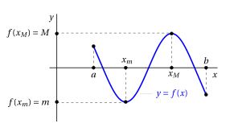
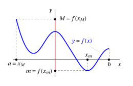

# Weierstrass theorem and intermediate value theorem

**Part 3 · Limits of functions and continuity · Chapter 9** · lecture notes by Fabio Furini · [:material-file-pdf-box: Lecture notes, volume (PDF)](../pdf/lecture-notes-3-limits.pdf)

## 1. Weierstrass theorem

- The following theorem establishes <strong>sufficient but not necessary</strong> conditions for a function to have a maximum and a minimum.

!!! teorema "Theorem 1: Weierstrass theorem"

    If a function $f: [a,b] \rr \R$ is continuous on the interval $[a,b]$, then it has a maximum $M$ and a minimum $m$ in $[a,b]$.

!!! chiave ""

    Under the hypotheses of the theorem there exist:

    $$
    x_m {\rm ~~and~~} x_M \in [a, b] {\rm ~~~~such~that~~~~}
    f(x_m) \le f(x) \le f(x_M) {\rm ~~~for~every~~~} x \in [a, b]
    $$

    We say that $x_m$ is a <strong>minimum point</strong> of $f$ and $m = f (x_m)$ is the <strong>minimum</strong> of $f$.

    We say that $x_M$ is a <strong>maximum point</strong> of $f$ and $M = f (x_M)$ is the <strong>maximum</strong> of $f$.

    { .fig .ovale loading=lazy style="width:85%" }

<strong>Properties of the supremum/infimum</strong>

- Given two non-empty subsets $E_1$, $E_2$ of $\R$ we have:

    $$
    \sup \big(E_1 \cup E_2 \big) = \max \big(\sup E_1, \sup E_2 \big)
    $$

    This property holds for both bounded and unbounded sets. If one or both sets are unbounded above we have: $\sup (E_1 \cup E_2) = \ip$. For the infimum we have:

    $$
    \inf \big(E_1 \cup E_2 \big) = \min \big(\inf E_1, \inf E_2 \big)
    $$

??? dimostrazione "Proof"

    We prove that $f$ has a maximum in $[a, b]$. Consider the function:

    $$
    f : [a, b] \rr \R, {\rm ~~~and~set~~~~}
     \ell = \sup_{[a,b]} f
    $$

    We now need to prove that:

    - **$i)$** $\ell$ is finite, that is, $\ell \in \R$;

    - **$ii)$** $\ell$ is equal to $f(x_0)$ for some $x_0\in [a,b]$ (and hence $\ell$ is the maximum and $x_0$ is the maximum point).

    We split the interval $[a, b]$ into two equal intervals: $I_{1}$ and $I_{2}$; by the properties of the supremum we have:

    $$
    \sup_{[a,b]} f 
    = \max \bigg( \sup_{I_{1}} f, \sup_{I_{2}} f \bigg) {\rm ~~~that~is~~~} \sup_{[a,b]} f = \sup_{I_{1}} f  {\rm ~~~or~~~}  \sup_{[a,b]} f = \sup_{I_{2}} f
    $$

    Hence for one of the two intervals, which we call $[a_1, b_1]$, it will be true that:

    $$
    \ell = \sup_{[a_1,b_1]} f
    $$

    We now split $[a_1 , b_1]$ into two equal intervals; for one of them, which we call $[a_2, b_2]$, it will be true that:

    $$
    \ell = \sup_{[a_2,b_2]} f
    $$

    Proceeding by bisection in this way, we construct a sequence of intervals $[a_n, b_n]$, each contained in the previous ones, with the properties:

    1. the sequence $\{a_n\}$ is monotone increasing and bounded, and the sequence $\{b_n\}$ is monotone decreasing and bounded;

    2. $b_n - a_n = \frac{b-a}{2^n} \rr 0 {\rm~~as~~} n \rr \ip;$

    3. $\displaystyle \ell = \sup_{[a_n,b_n]} f$ (the supremum of $f$ is attained in the interval $[a_n,b_n]$)

    By the same reasoning used in the proof of the intermediate zero theorem (which uses the monotonicity theorem for sequences), from points 1) and 2) it follows that the sequences $\{a_n\}$ and $\{b_n\}$ converge to the same limit $x_0 \in [a, b]$:

    $$
    a_n \rr x_0 {\rm ~~and~~} b_n \rr x_0 {\rm ~~as~~} n \rr \ip.
    $$

    We now proceed by cases. □

??? dimostrazione "Proof"

    Case 1: $\ell \in \R$

    If $\ell \in \R$, for every $n$ there exists a point $t_n \in [a_n, b_n]$ such that:

    \begin{equation}
    \label{RRRR}
    \ell - \frac{1}{n} < f(t_n) \le \ell
    \end{equation}

    Indeed, since $\ell - \frac{1}{n}$ is less than $\ell$, which is the least upper bound of the values of $f(x)$ in $[a_n, b_n]$, $\ell - \frac{1}{n}$ is not an upper bound; hence there exists $t_n \in  [a_n, b_n]$ with property \(\eqref{RRRR}\).

    Since $t_n \in  [a_n, b_n]$, and we have:

    $$
    a_n \rr x_0 {\rm ~~and~~} b_n \rr x_0 {\rm ~~as~~} n \rr \ip {\rm ~~~then~~~}t_n \rr  x_0 {\rm ~~as~~} n \rr \ip
    $$

    by the comparison (squeeze) theorem. Again by the comparison theorem, \(\eqref{RRRR}\) then gives

    $$
    \lim_{n \rr \ip} f(t_n) = \ell
    $$

    On the other hand, since $f$ is continuous and $t_n \rr x_0$, we have:

    $$
    \lim_{n \rr \ip} f(t_n) = f(x_0) {\rm ~~~~therefore~~~~} f(x_0) = \ell.
    $$

    Then, since $\ell$ is the $\sup$ of the values of $f$ in $[a, b]$, $\ell$ is the <strong>maximum</strong> of $f$ in $[a, b]$, and it is attained at the point $x_0$, the <strong>maximum point</strong>. Therefore, in this case the theorem is proved.

    Case 2: $\ell = \ip$

    If $\ell = \ip$, for every $n$ there exists a point $t_n \in [a_n,b_n]$ such that:

    \begin{equation}
    \label{RRRRR}
    f (t_n) \ge n
    \end{equation}

    Reasoning as above, one proves that $t_n \rr  x_0$ for some $x_0 \in [a, b]$. Since $f$ is continuous at $x_0$:

    $$
    \lim_{n \rr \ip} f(t_n) = f (x_0)
    $$

    but by \(\eqref{RRRRR}\) we have

    $$
    \lim_{n \rr \ip} f(t_n) = \ip
    $$

    which is a <strong>contradiction</strong>, since at $x_0$ the function must have a finite value. Hence this case cannot occur.

    Similarly, one proves that the function has a minimum in $[a, b]$. □

!!! chiave ""

    The proof is a constructive existence proof (similar to that of the intermediate zero theorem), which, however, cannot be used algorithmically since, after each bisection, it is not known a priori which interval the supremum or infimum is associated with.

<strong>The hypotheses of the Weierstrass theorem are all essential</strong>

1. The interval must be closed

    !!! chiave ""

        Consider as a counterexample:

        $$
        f(x) = x {\rm ~~with~~} x \in (0,1)
        $$

        The function is continuous on a bounded, but not closed, interval. In this case, the function has neither a maximum nor a minimum (its supremum, $1$, and its infimum, $0$, are not attained by the function).

2. The interval must be bounded

    !!! chiave ""

        Consider as a counterexample:

        $$
        f(x) = x {\rm ~~with~~} x \in \R
        $$

        The function is continuous on an unbounded interval but has neither a maximum nor a minimum (it is not even bounded).

3. The function must be continuous

    !!! chiave ""

        Consider as a counterexample:

        $$
        f(x) = 
        \begin{cases}
        x & {\rm ~~for~~} x \in (0,1)\\
        \frac{1}{2} & {\rm ~~for~~} x=0 {\rm ~~and~~} x=1
        \end{cases}
        $$

        The function is defined on a closed and bounded interval $[0, 1]$ but it is not continuous. The function has neither a maximum nor a minimum (its supremum, $1$, and its infimum, $0$, are not attained by the function).

## 2. Intermediate value theorem

!!! teorema "Theorem 2: Intermediate value theorem"

    If a function $f: [a,b] \rr \R$ is continuous on $[a,b]$, then it has a maximum $M$ and a minimum $m$ in $[a,b]$ and it takes all the values between $m$ and $M$.

!!! chiave ""

    We are under the hypotheses of the Weierstrass theorem, hence we have:

    $$
    x_m {\rm ~~and~~} x_M \in [a, b] {\rm ~~~~such~that~~~~}
    f(x_m) \le f(x) \le f(x_M) {\rm ~~~for~every~~~} x \in [a, b]
    $$

    The intermediate value theorem further tells us that:

    $$
    \forall \lambda \in (m,M), {\rm ~~~there~exists~~~} x(\lambda) \in [x_m,x_M] {\rm ~~such~that~~} f\big(x(\lambda)\big) = \lambda
    $$

    This property is called the <strong>intermediate value property</strong>.

??? dimostrazione "Proof"

    From the Weierstrass theorem we have a maximum point $x_{M}$ and a minimum point $x_m$ such that $f(x_M)=M$ (maximum) and $f(x_m)=m$ (minimum) in $[a,b]$. Let

    $$
    m  < \lambda < M
    $$

    and consider the function

    $$
    g(x) = f(x) - \lambda {\rm ~~with~~} x \in [x_m,x_M]
    $$

    which is continuous since $f(x)$ is continuous on $[a,b]$ and $x_m, x_M \in [a,b]$.

    Hence:

    $$
    g(x_M) = f(x_M) -\lambda = M -\lambda >0
    $$

    $$
    g(x_m) = f (x_m) -\lambda = m -\lambda < 0
    $$

    Then, by the intermediate zero theorem, there exists $x(\lambda) \in (x_m,x_M)$ such that:

    $$
    g\big(x(\lambda)\big) = 0 {\rm ~~~~that~is~~~~} f\big(x(\lambda)\big) = \lambda
    $$

    
□

- Given a function continuous on an interval $[a,b]$, graphically we have:

{ .fig .ovale loading=lazy style="width:85%" }

!!! esempio "Example 1: Discontinuous function without the intermediate
value property"

    Consider for example the graph of the following function, discontinuous on $[a,b]$:

    { .fig .ovale loading=lazy style="width:85%" }

    This function does not have the intermediate value property, that is, the values $\lambda \in (y_1,y_2)$ are not outputs of $f$.

- The properties of the two previous theorems can be summarized in the following single statement:

!!! teorema "Corollary 1"

    If $f: [a, b] \rr \R$ is continuous, then

    $$
    f([a, b]) = [m, M];
    $$

    i.e., the image of an interval $[a, b]$ is the interval with endpoints:

    $$
    \displaystyle m = \min_{[a,b]} f {\rm ~~~and~~} M = \max_{[a,b]} f.
    $$

??? dimostrazione "Proof"

    It follows from the Weierstrass theorem and the intermediate value theorem. □

!!! esempio "Example 2: Failure of the intermediate value theorem in $\Q$"

    - Let

        $$
        f(x) = x^2
        $$

        and consider $f$ as a function from the set $\Q$ of rational numbers to $\Q$ itself (this is legitimate because the square of a rational number is rational).

    - Then f does not have the intermediate value property.

    - Indeed, for example,

        $$
        f (1) = 1, f(2) = 4,
        $$

        but $f$ does not take all the rational values between 1 and 4: for example, it never takes the value 2, or 3.

    - In other words, the intermediate value property holds for continuous functions <strong>thanks to the properties of the set of real numbers</strong>.

    - This is a further reason why it is useful to work in the set of real numbers rather than in the set of rational numbers.

## 3. Existence theorem for the $n$-th root

!!! teorema "Theorem 3"

    For every $y \in \R$, $y > 0$ and $n \in \N$, $n \ge 1$, there exists one and only one $x \in \R, x >0$, such that $x^n = y$.

!!! chiave ""

    This number $x$ is called the $n$-th root of $y$

??? dimostrazione "Proof"

    Consider the function $f (x) = x^n$. 

    This function is continuous on all of $\R$, because it is the product of $n$ continuous functions $g (x) = x$.

    We show that there exist

    $$
    x_2 > x_1 > 0 {\rm ~~such~that~~} x_1^n < y < x_2^n.
    $$

    If $y=1$ the $n$-th root exists and is unique; moreover:

    1. If $y > 1$: it suffices to choose

        $$
        x_1 = 1, x_2 = y {\rm ~~and~we~have~~} x_1^n < y < x_2^n ~~~(1 < y < y^n)
        $$

    2. If $y < 1$: it suffices to choose

        $$
        x_1 = y, x_2 = 1 {\rm ~~and~we~have~~} x_1^n < y < x_2^n ~~~(y^n< y < 1 )
        $$

    Then we can apply the intermediate value theorem to the continuous function $f(x) = x^n$ on the interval $[x_1, x_2]$. Here its minimum is $x_1^n$ and its maximum is $x_2^n$.

    Since:

    $$
    x_1^n < y < x_2^n, {\rm ~~there~exists~~} x_0 \in [x_1,x_2] {\rm ~~such~that~~} x_0^n = y.
    $$

    Uniqueness follows from the fact that the function is strictly increasing. □
