# Sets

**Part 1 · Numbers and logic · Chapter 1** · lecture notes by Fabio Furini · [:material-file-pdf-box: Lecture notes, volume (PDF)](../pdf/lecture-notes-1-numbers.pdf) · [:material-presentation: Slides (PDF)](../pdf/slides-numbers-01-sets.pdf)

## 1. Informal introduction to set theory

- Set theory is based on the following three key concepts:

    1. <strong>Sets</strong>

        The notion of set is generally taken as <strong>primitive</strong> (that is, not reducible to more elementary concepts). The words <em>collection</em>, <em>class</em>, <em>aggregate</em>, <em>family</em> are used as synonyms of set.

        

        !!! esempio "Example 1: sets"

            For example, we have the set of points of a plane, the set of students of a university, or the set of stars of a galaxy.

    2. <strong>Elements</strong>

        A set is determined by its <em>elements</em>, in the sense that a set is defined when we have a <strong>criterion</strong> to establish whether a given element is or is not an element of this set. 

        There are sets with a <em>finite number of elements</em> (for example the set of students of a university) and sets with an <em>infinite number of elements</em> (for example the set of points of the plane).

        !!! chiave ""

            Sets are usually denoted by capital letters. The elements of a set are usually denoted by lowercase letters.

    3. <strong>Membership</strong>

        The concept of <em>membership</em> links elements to sets. When an object is an element of a set, we say that the element <em>belongs</em> to the set. To indicate that an element $x$ belongs to a set $A$ we write:

        $$
        x \in A
        $$

        To indicate that an element $x$ does <em>not</em> belong to a set $A$ we write:

        $$
        x \notin A
        $$

### 1.1 Informal definition of sets

1. A first way to define sets is <strong>definition by listing</strong> (roster notation)

    !!! chiave ""

        A set can be defined <strong>by listing</strong>, that is, by listing the elements that belong to it between curly brackets. This technique assumes that the set has a finite number of elements.

    

    !!! esempio "Example 2: definition by listing"

        - The notation:

            $$
            A = \{a,b,c\}
            $$

            means that the set $A$ has as elements the three letters $a$, $b$ and $c$. For example, $a$ belongs to $A$, that is, $a \in A$, while $d \notin A$.

        - The set of vowels of the Latin alphabet can be defined by listing:

            $$
            V = \{a,~ e,~ i,~ o,~ u\}
            $$

    - When listing the elements of a set, each element is written <strong>only once</strong>: a set does not contain the same object more than once.

    - The elements of a set are <strong>not ordered</strong>: $\{1, 2, 3\}$ and $\{3, 1, 2\}$ describe the same set, because the order in which we list the elements is irrelevant.

2. A second way to define sets is <strong>definition by a property</strong>:

    !!! chiave ""

        A set can be defined <strong>by a property</strong> as follows:

        $$
        A = \big\{~ x \in U:  p(x) \textrm{~~is~true} ~\big\}
        $$

        where $p(x)$ is the property that the element $x$ of the set $U$ must have in order to belong to the set $A$. This technique can be used to define sets with a finite or even an infinite number of elements.

    

    !!! esempio "Example 3: definition by a property"

        Consider for example the set of letters of the Latin alphabet:

        $$
        U =\{a,~ b,~ c,~ d,~ e,~ f,~ g,~ h,~ i,~ j,~ k,~ l,~ m,~ n,~ o,~ p,~ q,~ r,~ s,~ t,~ u,~ v,~ w,~ x,~ y,~ z
        \}
        $$

        Using for example the property $p(x)$ defined as “$x$ is a vowel” we can define the following set of vowels:

        $$
        A= \underbrace{\{x \in U: x \textrm{~~~is~a~vowel}\}}_{ \{a,~e,~i,~o,~u\} }
        $$

    Note that to define a set $A$ by a property we need a set $U$ to which all the elements of the set $A$ we want to define belong. The set $U$ plays the role of the <strong>universal set</strong>.

    

    !!! definizione "Definition 1: of universal set"

        A <strong>universal set</strong> (or simply <strong>universe</strong>), denoted by $U$, is a set fixed in advance that contains all the objects under consideration in a given context: all the sets considered in that context have elements that belong to $U$.

    It is important that the property $p(x)$ we use makes sense for every $x$ of the set $U$ (universal set), and therefore is true or false (without ambiguity of meaning) for every particular $x \in U$; the set $A$ will then consist of exactly those $x$ belonging to $U$ for which the property $p(x)$ is true.

!!! chiave ""

    One must be careful when defining sets, since contradictions may arise. There is a formal definition of the concept of set, developed to avoid contradictions, but it is beyond the scope of this course.

- For example, the set of all sets that do not contain themselves is not a set in the formal definition of sets. Admitting this set would generate the contradiction: “the set of all sets that do not belong to themselves belongs to itself if and only if it does not belong to itself” (<strong>Russell's paradox</strong>, discussed in the further topics at the end of the chapter).

## 2. Number sets

!!! definizione "Definition 2: numeral system"

    A <strong>positional numeral system</strong> is a way of encoding numbers using a <strong>sequence of digits</strong>, where each digit contributes differently to the number depending on its position. The number of distinct digits is the <strong>base</strong> of the system.

!!! chiave ""

    The <strong>decimal expansion</strong> of a number is a numerical representation in base 10; it expresses a number as a sum of powers of 10, and it can be finite or infinite depending on the type of number.

- Informal definition of the main number sets:

    1. We denote by $\N$ the set of <strong>natural numbers</strong>, that is, the set of numbers that can be written as <strong>decimal expansions without decimal point and without sign</strong>. We will use the informal notation:

        $$
        \N = \{0,~ 1,~ 2,~ 3,~ 4,~ \dots\}
        $$

    2. We denote by $\Z$ the set of <strong>integers</strong>, that is, the set of numbers that can be written as <strong>decimal expansions without decimal point and with a sign</strong>. We will use the informal notation:

        $$
        \Z = \{0,~ \pm 1,~ \pm 2,~ \pm 3,~ \pm 4,~ \dots \}
        $$

    3. We denote by $\Q$ the set of <strong>rational numbers</strong>, that is, the set of numbers that can be written as <strong>finite or infinite periodic decimal expansions</strong>. In other words, it is the set of numbers that can be written as a fraction $\frac{p}{q}$ where $p$ is an integer and $q$ is a natural number different from zero.

        

        !!! esempio "Example 4: rational numbers"

            - For example, with $p=2$ and $q=5$ we have the fraction $\frac{2}{5}$, whose decimal expansion is $0.4$.

            - For example, with $p=4$ and $q=10$ we have the fraction $\frac{4}{10}$, whose decimal expansion is again $0.4$. Note that a rational number can be written with more than one fraction.

            - For example, with $p=13$ and $q=30$ we have the fraction $\frac{13}{30}$, whose decimal expansion is $0.4\bar{3}=0.43333\dots$.

        However, we can represent every rational number different from $0$ by a single fraction $\frac{p}{q}$ by choosing $p \in \Z$ and $q \in \N$ coprime (that is, relatively prime: $p$ and $q$ are not both divisible by the same integer greater than 1).

        

        !!! osservazione "Remark 1"

            $$
            0,\overline{9}=1
            $$

        ??? dimostrazione "Proof"

            There are different proofs of this remark, based on different mathematical techniques.

            1. A simple proof follows directly from the definition of $1$ divided by $3$; indeed, we have:

                \begin{align*}
                \frac{1}{3} &= 0,\overline{3}\\
                \frac{1}{3} \cdot 3 &= 0,\overline{3} \cdot 3\\
                 1 &= 0,\overline{9}
                \end{align*}

            2. Using algebraic arguments we can write:

                \begin{align*}
                x &= 0.999\dots\\
                10\:x &= 9.999\dots & {\rm multiplying~by~} 10 \\
                10\:x &= 9 + 0.999\dots & {\rm separating~the~integer~part~from~the~fractional~part} \\
                10\:x &= 9 + x & {\rm by~definition~of~} x\\
                9\:x &= 9  & {\rm subtracting~} x\\
                x &= 1  & {\rm dividing~by~} 9
                \end{align*}

            3. A proof by contradiction is the following:

                \begin{align*}
                0,\overline{9} & \neq 1\\
                0,\overline{9} \cdot 9 & \neq 1 \cdot 9\\
                0,\overline{9} \cdot 9 + 0,\overline{9}& \neq 1 \cdot 9 +0,\overline{9}\\
                0,\overline{9} \cdot 9 + 0,\overline{9}& \neq 9,\overline{9}\\
                0,\overline{9} \cdot  (9+1) & \neq 9,\overline{9}\\
                0,\overline{9} \cdot  (10) & \neq 9,\overline{9}\\
                9,\overline{9} & \neq 9,\overline{9} ~~~~~~ {\rm contradiction!}
                \end{align*}

            
□

    4. We denote by $\R$ the set of <strong>real numbers</strong>, that is, the set of numbers identified with finite or infinite decimal expansions, periodic or non-periodic.

        

        !!! esempio "Example 5: real numbers"

            - Consider for example the number

                $$
                0,10110111011110 \dots
                $$

                obtained by putting after the decimal point one digit equal to $1$, then $0$, then two digits equal to $1$, then $0$, then three digits equal to $1$ … and so on. The string of nonzero digits after the decimal point is neither finite nor periodic: therefore this number is real but not rational.

            - Other examples of real but not rational numbers are $\sqrt{2}$ and $\sqrt{3}$, or $\pi$ and Euler's number $e$ (Napier's constant), which have infinite non-periodic decimal expansions and are therefore real but not rational numbers.

    

    !!! esempio "Example 6: number sets defined by listing and by a property"

        - The set of the first five prime numbers can be defined by listing:

            $$
            P = \{2,~ 3,~ 5,~ 7,~ 11\}
            $$

            For example $2 \in P$, while $4 \notin P$.

        - The set of <strong>even numbers</strong> can be defined by a property, with universal set $\Z$:

            $$
            E = \big\{x \in \Z : \textrm{there exists } k \in \Z \textrm{ such that } x = 2\,k \big\}
            $$

            For example $-4 \in E$, because $-4 = 2 \cdot (-2)$, while $3 \notin E$, because $3 = 2\,k$ would give $k = \frac{3}{2} \notin \Z$.

        - The set of <strong>positive real numbers</strong> can be defined by a property, with universal set $\R$:

            $$
            \R_{>0} = \{x \in \R : x > 0\}
            $$

            It is a set with an infinite number of elements, which cannot be defined by listing.

- There are formal definitions of the sets of natural, integer and rational numbers that are beyond the scope of this course. Later we will give a formal definition of the real numbers.

## 3. Relations between sets

!!! definizione "Definition 3: of equal sets"

    Two sets $A$ and $B$ are <strong>equal</strong> when they have the same elements. We write

    $$
    A = B
    $$

    and this means that every element that belongs to $A$ also belongs to $B$ and every element that belongs to $B$ also belongs to $A$. If $A$ and $B$ are not equal we write $A \neq B$.

!!! esempio "Example 7: order and multiplicity of the elements"

    - The concept of <em>order</em> among the elements is foreign to sets:

        $$
        \{1,2,5\} = \{1,5,2\}
        $$

        because the two sets have the same elements, the numbers $1$, $2$ and $5$: the order in which we list the elements is irrelevant.

    - The concept of <em>multiplicity of the elements</em> is also foreign to sets. For example, the set of solutions of the equation

        $$
        x-1 = 0
        $$

        (whose only element is the number 1) is equal to the set of solutions of the equation

        $$
        (x-1)^2 = 0
        $$

        The fact that the second equation has the solution $x = 1$ with algebraic multiplicity $2$ does not change the set of its solutions: both sets are equal to $\{1\}$.

It may happen that only one of the two requirements expressed by the equality relation holds. For example, if we only know that every element of $A$ is also an element of $B$, we can say that $A$ is contained in $B$.

!!! definizione "Definition 4: of subset"

    Given two sets $A$ and $B$, we say that $A$ is a <strong>subset</strong> of $B$, and we write

    $$
    A \subseteq B,
    $$

    if every element of $A$ is also an element of $B$, that is, if for every $x$ the implication $x \in A \Longrightarrow x \in B$ holds. We read “$A$ is contained in $B$” or “$A$ is a subset of $B$”.

If we state that $A \subseteq B$, we do not exclude that $A = B$. If instead we want to state precisely that $A$ is contained in $B$ but does not coincide with $B$, we say that $A$ is <em>strictly contained</em> in $B$.

!!! definizione "Definition 5: of proper subset"

    Given two sets $A$ and $B$, we say that $A$ is a <strong>proper subset</strong> of $B$, or that $A$ is <em>strictly contained</em> in $B$, and we write

    $$
    A \subsetneqq B,
    $$

    if $A \subseteq B$ and $A \neq B$. In this case we speak of <strong>strict inclusion</strong>.

- In some texts the symbol $\subset$ denotes strict inclusion, in others it is a synonym of $\subseteq$. To avoid ambiguity we will use $\subseteq$ for inclusion and $\subsetneqq$ for strict inclusion; when it appears, the symbol $\subset$ has the same meaning as $\subseteq$.

!!! esempio "Example 8: inclusion and strict inclusion"

    - $\{1, 4\} \subseteq \{1, 3, 4\}$, because $1$ and $4$ belong to $\{1, 3, 4\}$. The inclusion is strict, $\{1, 4\} \subsetneqq \{1, 3, 4\}$, because $3 \in \{1, 3, 4\}$ but $3 \notin \{1, 4\}$, so the two sets are not equal.

    - $\{1, 3, 4\} \subseteq \{1, 3, 4\}$, but the inclusion is not strict, because the two sets are equal.

    - $\N \subsetneqq \Z$: every natural number is an integer, and $-1 \in \Z$ but $-1 \notin \N$.

!!! chiave ""

    Be careful not to confuse “belongs to” and “is contained in” (in symbols, $\in$ and $\subseteq$). In a sense, they are two ways of indicating that “something is inside something else”, but they have a fundamental logical difference:

    - a set is contained in another set;

    - an element belongs to a set.

!!! esempio "Example 9: “belongs to” vs “is contained in”"

    For example:

    $$
    3 \in \{1,3,4\};
    $$

    $$
    \{3\} \subseteq \{1, 3, 4\};
    $$

    $$
    \{1,4\} \subseteq \{1,3,4\}.
    $$

    In particular, do not confuse $3$ (which is a number) with $\{3\}$, which is the set that contains the number 3 as its only element.

Sometimes we consider sets whose elements are other sets. In this case too, the symbols $\in$ and $\subseteq$ are not interchangeable, but must be used correctly.

!!! esempio "Example 10: “belongs to” vs “is contained in”"

    For example, if we define the set

    $$
    A = \bigg\{ ~\{1\},~ \{2\},~ \{1, 2\} ~\bigg\},
    $$

    then it is correct to state that $\{2\} \in A$, because $\{2\}$ is a set that plays the role of an element of $A$, whereas it would be incorrect to say that $\{2\} \subseteq A$, because this would mean that $2 \in A$, while $A$ has $\{2\}$ as an element but not $2$. Instead, the subset of $A$ containing only the element $\{2\}$ is denoted by $\big\{\{2\}\big\}$ and we have $\big\{\{2\}\big\} \subseteq A$.

### 3.1 Properties of inclusion

!!! teorema "Proposition 1: reflexive property of inclusion"

    For every set $A$ we have

    $$
    A \subseteq A.
    $$

??? dimostrazione "Proof"

    By the definition of subset we must check that every element of $A$ is also an element of $A$, that is, that for every $x$ the implication $x \in A \Longrightarrow x \in A$ holds. The implication is true because the conclusion coincides with the hypothesis: if $x \in A$, then $x \in A$. Hence $A \subseteq A$. □

!!! teorema "Proposition 2: antisymmetric property of inclusion"

    Given two sets $A$ and $B$, we have

    $$
    A = B \quad \Longleftrightarrow \quad A \subseteq B \textrm{ ~and~ } B \subseteq A.
    $$

??? dimostrazione "Proof"

    ($\Longrightarrow$) Suppose $A = B$. By the definition of equal sets every element of $A$ belongs to $B$, hence $A \subseteq B$ by the definition of subset. In the same way every element of $B$ belongs to $A$, hence $B \subseteq A$.

    ($\Longleftarrow$) Suppose $A \subseteq B$ and $B \subseteq A$. From $A \subseteq B$ it follows that every element of $A$ belongs to $B$, and from $B \subseteq A$ it follows that every element of $B$ belongs to $A$. Hence $A$ and $B$ have the same elements, that is, $A = B$. □

- The antisymmetric property gives the most common method to prove that two sets $A$ and $B$ are equal, called <strong>double inclusion</strong>: we take an arbitrary element of $A$ and show that it belongs to $B$ (that is, $A \subseteq B$), then we take an arbitrary element of $B$ and show that it belongs to $A$ (that is, $B \subseteq A$).

!!! teorema "Proposition 3: transitive property of inclusion"

    Given three sets $A$, $B$ and $C$, we have

    $$
    A \subseteq B \textrm{ ~and~ } B \subseteq C \quad \Longrightarrow \quad A \subseteq C.
    $$

??? dimostrazione "Proof"

    Suppose $A \subseteq B$ and $B \subseteq C$, and let $x$ be an arbitrary element of $A$. Since $A \subseteq B$, we have $x \in B$. Since $B \subseteq C$, from $x \in B$ it follows that $x \in C$. Hence every element of $A$ belongs to $C$, that is, $A \subseteq C$. □

### 3.2 Empty set, cardinality and power set

!!! definizione "Definition 6: of empty set"

    The <strong>empty set</strong> is the set that contains no elements. It is denoted by $\varnothing.$

!!! osservazione "Remark 2"

    Given a set $A$, we have:

    $$
    \varnothing \subseteq A
    $$

??? dimostrazione "Proof"

    By the definition of subset we must prove that every element that belongs to $\varnothing$ also belongs to $A$, that is, that for every $x$ the implication

    $$
    x \in \varnothing \Longrightarrow x \in A
    $$

    holds. The hypothesis $x \in \varnothing$ is false for every $x$, because no element belongs to $\varnothing$. An implication with a false hypothesis is true whatever the conclusion is: we say that the implication is <strong>vacuously true</strong>. The same can be seen by contradiction: if $\varnothing \subseteq A$ did not hold, there would exist an element of $\varnothing$ that does not belong to $A$; but $\varnothing$ has no elements, so such an element does not exist. Hence the thesis holds. □

!!! definizione "Definition 7: of cardinality of a set"

    The number of elements of a set $A$ is the <strong>cardinality</strong> of the set. It is denoted by $|A|$. If the cardinality of $A$ is a natural number, the set $A$ is called <strong>finite</strong>; otherwise it is called <strong>infinite</strong>.

- The empty set is finite and has cardinality $|\varnothing| = 0$.

- A set with only one element is called a <strong>singleton</strong>: for example $\{3\}$ is a singleton and $|\{3\}| = 1$.

- A subset with $k$ elements of a set $A$ is called a <strong>$k$-subset</strong> of $A$.

!!! esempio "Example 11: cardinality and subsets with k elements"

    Given the set $A=\{1,2,3\}$ we have $|A| = 3$. The $2$-subsets of $A$ are $\{1,2\}$, $\{1,3\}$ and $\{2,3\}$; the $1$-subsets of $A$ are the singletons $\{1\}$, $\{2\}$ and $\{3\}$; the only $0$-subset of $A$ is $\varnothing$ and the only $3$-subset of $A$ is $A$ itself.

!!! definizione "Definition 8: of power set"

    Given a set $A$, the set whose elements are all the subsets of $A$ is called the <strong>power set</strong> of $A$ and is denoted by the symbol $\mathscr{P}(A)$. The notation $2^A$ is also used.

- Every set $A$ has two trivial subsets, namely $A$ itself (by the reflexive property of inclusion) and the empty set $\varnothing$ (by the remark on the empty set); the two subsets coincide if $A$ is empty.

!!! esempio "Example 12: power set"

    For example, given

    $$
    A= \{1, 2, 3\} ,
    $$

    then

    $$
    \mathscr{P}(A) = \bigg\{~\varnothing,~ \{1\},~ \{2\},~ \{3\},~ \{1, 2\},~ \{2, 3\},~ \{1 , 3\},~ \{1,2,3\} ~\bigg\}
    $$

!!! osservazione "Remark 3"

    Given a set $A$ with $n$ elements, the power set $\mathscr{P}(A)$ has $2^n$ elements:

    $$
    |\mathscr{P}(A)|=2^n = 2^{|A|}
    $$

??? dimostrazione "Proof"

    If $n = 0$, the set $A$ is empty and its only subset is $\varnothing$, hence $|\mathscr{P}(A)| = 1 = 2^0$. If $n \ge 1$, let $a_1, a_2, \dots, a_n$ be the elements of $A$. To build a subset $S$ of $A$ we must decide, for each of the elements $a_1, a_2, \dots, a_n$, whether or not $S$ contains that element: hence we must make a choice between two options $n$ times, and each choice is independent of the others.

    - Every sequence of $n$ choices determines a subset of $A$ and, conversely, every subset $S$ of $A$ is obtained from a sequence of choices: for each $i$ we choose to include $a_i$ if and only if $a_i \in S$.

    - Different sequences of choices give different subsets: if two sequences differ in the choice about the element $a_i$, then $a_i$ belongs to one of the two subsets but not to the other.

    The total number of possible subsets is therefore equal to the number of sequences of $n$ choices between two options, that is,

    $$
    \underbrace{2 \cdot 2 \cdots 2}_{n \textrm{ times}} = 2^{n}.
    $$

    
□

!!! esempio "Example 13: construction of the power set with a binary tree"

    Given the set $A=\{1,2,3\}$ with $n=3$ elements, the cardinality of its power set is $2^3=8$. The construction of the power set $\mathscr{P}(A)$ can be visualized through the following <strong>binary tree</strong> (an undirected, connected and acyclic graph) in which at each level we decide whether or not to include the object in the subset:

    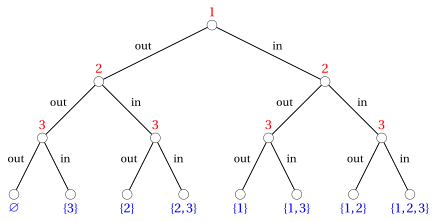{ .fig .ovale loading=lazy style="width:100%" }

## 4. Operations on sets

!!! definizione "Definition 9: of intersection of sets"

    The <em>intersection</em> of two sets $A,B \subseteq U$ is the set defined by:

    $$
    A \cap B = \big\{x \in U: x \in A {\rm ~~and~~} x \in B \big\}
    $$

It is the set of elements that belong both to the first and to the second set.

!!! definizione "Definition 10: of union of sets"

    The <strong>union</strong> of two sets $A,B \subseteq U$ is the set defined by:

    $$
    A \cup B = \big\{x \in U: x \in A {\rm ~~or~~} x \in B \big\}
    $$

It is the set of elements that belong to the first or to the second set, where “or” is meant in the <u>non-exclusive</u> sense (the set of elements that belong to $A$ or to $B$ or to both).

!!! definizione "Definition 11: of difference of sets"

    The <strong>difference</strong> of two sets $A,B \subseteq U$ is the set defined by:

    $$
    A \setminus B = \big\{x \in A: x \notin B \big\}
    $$

It is the set of elements that belong to the first but not to the second set. The symbol “$\setminus$” can also be written “-” by analogy with arithmetic subtraction.

!!! esempio "Example 14: intersection, union and difference"

    Given the sets $A = \{1, 2, 3, 4\}$ and $B = \{3, 4, 5\}$, we have

    $$
    A \cap B = \{3, 4\}, \qquad A \cup B = \{1, 2, 3, 4, 5\},
    $$

    $$
    A \setminus B = \{1, 2\}, \qquad B \setminus A = \{5\}.
    $$

    In particular $A \setminus B \neq B \setminus A$: in the difference the order of the two sets matters.

### 4.1 Complementary sets and disjoint sets

!!! esempio "Example 15: universal sets"

    For example, in questions of arithmetic we could have $U= \N$; if we consider sets made up only of integers it is natural to choose $U = \Z$, while in questions of analysis we could have $U =\R$.

!!! definizione "Definition 12: of set complementation and complementary sets"

    The <strong>complementation</strong> of a set $A \subseteq U$ is the set defined by:

    $$
    \overline{A} = \big\{x \in U: x \notin A \big\}
    $$

    This set is called the <strong>complement</strong> (complementary set) of $A$ with respect to $U$.

- By the definition of difference, $U \setminus A = \{x \in U : x \notin A\}$, hence the complement of $A$ is the difference between the universal set and $A$:

    $$
    \overline{A} = U \setminus A.
    $$

!!! teorema "Proposition 4: properties of the complement"

    For every set $\red{A} \subseteq \violet{U}$, where $\violet{U}$ is the universal set, we have the following relations:

    \begin{align*}
    \overline{ \overline{ \red{A}}} &= \red{A}\\
      \red{A} \cap \overline{\red{A}} &= \varnothing\\
      \red{A} \cup \overline{\red{A}} &= \violet{U} \\
      \overline{\violet{U}} &= \varnothing \\
      \overline{\varnothing} &= \violet{U}
    \end{align*}

??? dimostrazione "Proof"

    All the sets involved are subsets of $U$: hence it is enough to consider the elements $x \in U$. We prove the five relations.

    - Let $x \in U$. We have $x \in \overline{\overline{A}}$ if and only if $x \notin \overline{A}$, that is, if and only if it is not true that $x \notin A$, that is, if and only if $x \in A$. Hence $\overline{\overline{A}} = A$.

    - If there existed $x \in A \cap \overline{A}$, we would have $x \in A$ and $x \in \overline{A}$, that is, $x \notin A$: this is impossible. Hence $A \cap \overline{A}$ has no elements, that is, $A \cap \overline{A} = \varnothing$.

    - By the definition of union, $A \cup \overline{A}$ is made up of elements of $U$, hence $A \cup \overline{A} \subseteq U$. Conversely, let $x \in U$: if $x \in A$, then $x \in A \cup \overline{A}$; if $x \notin A$, then $x \in \overline{A}$ and hence $x \in A \cup \overline{A}$. Hence $U \subseteq A \cup \overline{A}$ and, by double inclusion, $A \cup \overline{A} = U$.

    - $\overline{U} = \{x \in U : x \notin U\}$ has no elements, because no element of $U$ can fail to belong to $U$. Hence $\overline{U} = \varnothing$.

    - $\overline{\varnothing} = \{x \in U : x \notin \varnothing\}$, and every $x \in U$ satisfies $x \notin \varnothing$. Hence $\overline{\varnothing} = U$.

    
□

!!! teorema "Proposition 5: identity laws"

    For every set $\red{A} \subseteq \violet{U}$, where $\violet{U}$ is the universal set, we have:

    \begin{align*}
    \red{A} \cap \varnothing &= \varnothing \\
      \red{A} \cap \violet{U} &= \red{A} \\
      \red{A} \cup \varnothing &= \red{A} \\
      \red{A} \cup \violet{U} &= \violet{U}
    \end{align*}

??? dimostrazione "Proof"

    We prove the four relations.

    - No $x$ can belong both to $A$ and to $\varnothing$, because $\varnothing$ has no elements. Hence $A \cap \varnothing = \varnothing$.

    - If $x \in A \cap U$, then $x \in A$. Conversely, if $x \in A$, then $x \in U$ because $A \subseteq U$, and hence $x \in A \cap U$. By double inclusion $A \cap U = A$.

    - We have $x \in A \cup \varnothing$ if and only if $x \in A$ or $x \in \varnothing$. The second possibility never occurs, hence $x \in A \cup \varnothing$ if and only if $x \in A$, that is, $A \cup \varnothing = A$.

    - By the definition of union, $A \cup U$ is made up of elements of $U$, hence $A \cup U \subseteq U$. Conversely, if $x \in U$, then $x \in A \cup U$. By double inclusion $A \cup U = U$.

    
□

!!! definizione "Definition 13: of disjoint sets"

    Two sets $\red{A}$ and $\blue{B}$ are <strong>disjoint</strong> if they have no elements in common:

    $$
    \red{A} \cap \blue{B} = \varnothing
    $$

!!! esempio "Example 16: disjoint sets"

    The sets $\{1, 2\}$ and $\{3, 4\}$ are disjoint, while $\{1, 2\}$ and $\{2, 3\}$ are not, because $\{1, 2\} \cap \{2, 3\} = \{2\}$. By the properties of the complement, every set $A \subseteq U$ and its complement $\overline{A}$ are disjoint.

Disjoint sets allow us to “split” a set into pieces that do not overlap. Given a family $\mathcal{F}$ of sets, the <strong>union of the family</strong> is the set of elements that belong to at least one of the sets of the family; it is denoted by

$$
\bigcup_{B \in \mathcal{F}} B.
$$

For a family made up of two sets $B$ and $C$ we recover the union $B \cup C$.

!!! definizione "Definition 14: of partition"

    Given a set $A$, a family $\mathcal{F}$ of subsets of $A$ is a <strong>partition</strong> of $A$ if:

    - every set of the family is nonempty: $B \neq \varnothing$ for every $B \in \mathcal{F}$;

    - the sets of the family are <em>pairwise disjoint</em>: if $B, C \in \mathcal{F}$ and $B \neq C$, then $B \cap C = \varnothing$;

    - their union is $A$:

        $$
        A = \bigcup_{B \in \mathcal{F}} B,
        $$

        that is, every element of $A$ belongs to at least one set of the family.

    The sets of the family $\mathcal{F}$ are called the <strong>blocks</strong> of the partition.

!!! osservazione "Remark 4"

    A family $\mathcal{F}$ of nonempty subsets of a set $A$ is a partition of $A$ if and only if every element of $A$ belongs to <strong>exactly one</strong> set of the family.

??? dimostrazione "Proof"

    ($\Longrightarrow$) Let $\mathcal{F}$ be a partition of $A$ and let $x \in A$. Since the union of the family is $A$, the element $x$ belongs to at least one set of the family. If it belonged to two different sets $B, C \in \mathcal{F}$, we would have $x \in B \cap C$, against the fact that $B \cap C = \varnothing$. Hence $x$ belongs to exactly one set of the family.

    ($\Longleftarrow$) Suppose that every element of $A$ belongs to exactly one set of the family. The sets of the family are nonempty by hypothesis. Every element of $A$ belongs to at least one set of the family, hence $A \subseteq \bigcup_{B \in \mathcal{F}} B$; conversely, every element of the union belongs to a subset of $A$ and hence to $A$: by double inclusion the union is $A$. Finally, if two different sets $B, C \in \mathcal{F}$ had a common element $x$, this element of $A$ would belong to two sets of the family, against the hypothesis: hence $B \cap C = \varnothing$. □

!!! esempio "Example 17: partitions"

    - The family $\big\{ \{1, 2\},~ \{3\},~ \{4, 5, 6\} \big\}$ is a partition of $A = \{1, 2, 3, 4, 5, 6\}$: the three sets are nonempty and every element of $A$ belongs to exactly one of them.

    - The family $\big\{ \{1, 2\},~ \{2, 3\} \big\}$ is not a partition of $\{1, 2, 3\}$: the element $2$ belongs to two sets of the family.

    - The family $\big\{ \{1\},~ \{2\} \big\}$ is not a partition of $\{1, 2, 3\}$: the element $3$ does not belong to any set of the family.

    - With universal set $\Z$, the set $E$ of even numbers and its complement $\overline{E}$, that is, the set of odd numbers, form a partition of $\Z$: the two sets are nonempty ($0 \in E$ and $1 \in \overline{E}$) and, by the properties of the complement, $E \cap \overline{E} = \varnothing$ and $E \cup \overline{E} = \Z$.

### 4.2 Venn diagrams

Venn diagrams are graphical representations in which sets are represented as regions of the plane

- Venn diagrams of intersection, union and difference:

    

    { .fig .ovale loading=lazy style="width:32%" }

    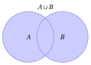{ .fig .ovale loading=lazy style="width:32%" }

    { .fig .ovale loading=lazy style="width:32%" }

    

- Venn diagram of the complement of a set:

    { .fig .ovale loading=lazy style="width:25%" }

### 4.3 Properties of operations on sets

!!! osservazione "Remark 5: properties of intersection"

    Given three sets $\red{A}, \blue{B}$ and $\orange{C}$, intersection has the following properties:

    - <strong>Commutative</strong>:

        $$
        \red{A} \cap \blue{B} = \blue{B} \cap \red{A}
        $$

    - <strong>Associative</strong>:

        $$
        \red{A} \cap (\blue{B} \cap \orange{C}) = (\red{A} \cap \blue{B}) \cap \orange{C}
        $$

    - <strong>Idempotence</strong>:

        $$
        \red{A} \cap \red{A} = \red{A}
        $$

??? dimostrazione "Proof"

    We prove the three properties by comparing the elements of the two sides.

    - <strong>Commutative</strong>: $x \in A \cap B$ if and only if $x \in A$ and $x \in B$, that is, if and only if $x \in B$ and $x \in A$, that is, if and only if $x \in B \cap A$. Hence $A \cap B = B \cap A$.

    - <strong>Associative</strong>: $x \in A \cap (B \cap C)$ if and only if $x \in A$ and $x \in B \cap C$, that is, if and only if $x$ belongs to all three sets $A$, $B$ and $C$, that is, if and only if $x \in A \cap B$ and $x \in C$, that is, if and only if $x \in (A \cap B) \cap C$.

    - <strong>Idempotence</strong>: $x \in A \cap A$ if and only if $x \in A$ and $x \in A$, that is, if and only if $x \in A$. Hence $A \cap A = A$.

    The graphical proof of the associative property of intersection is the following: in the first row we build $(A \cap B) \cap C$, in the second row $A \cap (B \cap C)$, and the two sets obtained on the right coincide.

    

    { .fig .ovale loading=lazy style="width:27%" }

    { .fig .ovale loading=lazy style="width:27%" }

    { .fig .ovale loading=lazy style="width:27%" }

    

    

    { .fig .ovale loading=lazy style="width:27%" }

    { .fig .ovale loading=lazy style="width:27%" }

    { .fig .ovale loading=lazy style="width:27%" }

    
 □

!!! osservazione "Remark 6: properties of union"

    Given three sets $\red{A}, \blue{B}$ and $\orange{C}$, union has the following properties:

    - <strong>Commutative</strong>:

        $$
        \red{A} \cup \blue{B} = \blue{B} \cup \red{A}
        $$

    - <strong>Associative</strong>:

        $$
        \red{A} \cup (\blue{B} \cup \orange{C}) = (\red{A} \cup \blue{B}) \cup \orange{C}
        $$

    - <strong>Idempotence</strong>:

        $$
        \red{A} \cup \red{A} = \red{A}
        $$

??? dimostrazione "Proof"

    We prove the three properties by comparing the elements of the two sides.

    - <strong>Commutative</strong>: $x \in A \cup B$ if and only if $x \in A$ or $x \in B$, that is, if and only if $x \in B$ or $x \in A$, that is, if and only if $x \in B \cup A$. Hence $A \cup B = B \cup A$.

    - <strong>Associative</strong>: $x \in A \cup (B \cup C)$ if and only if $x \in A$ or $x \in B \cup C$, that is, if and only if $x$ belongs to at least one of the three sets $A$, $B$ and $C$, that is, if and only if $x \in A \cup B$ or $x \in C$, that is, if and only if $x \in (A \cup B) \cup C$.

    - <strong>Idempotence</strong>: $x \in A \cup A$ if and only if $x \in A$ or $x \in A$, that is, if and only if $x \in A$. Hence $A \cup A = A$.

    The graphical proof of the associative property of union is the following: in the first row we build $(A \cup B) \cup C$, in the second row $A \cup (B \cup C)$, and the two sets obtained on the right coincide.

    

    { .fig .ovale loading=lazy style="width:27%" }

    { .fig .ovale loading=lazy style="width:27%" }

    { .fig .ovale loading=lazy style="width:27%" }

    

    

    { .fig .ovale loading=lazy style="width:27%" }

    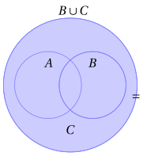{ .fig .ovale loading=lazy style="width:27%" }

    { .fig .ovale loading=lazy style="width:27%" }

    
 □

!!! osservazione "Remark 7: distributive properties (linking union and intersection)"

    Given three sets $\red{A}, \blue{B}$ and $\orange{C}$ we have:

    $$
    \red{A} \cap (\blue{B} \cup \orange{C}) = (\red{A} \cap \blue{B}) \cup (\red{A} \cap \orange{C})
    $$

    $$
    \red{A} \cup (\blue{B} \cap \orange{C}) = (\red{A} \cup \blue{B}) \cap (\red{A} \cup \orange{C}).
    $$

The distributive properties link union and intersection to each other.

??? dimostrazione "Proof"

    The graphical proof of the first property is the following: in the first row we build the left-hand side $A \cap (B \cup C)$, in the second row the right-hand side $(A \cap B) \cup (A \cap C)$, and the two sets obtained on the right coincide.

    

    { .fig .ovale loading=lazy style="width:27%" }

    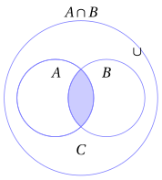{ .fig .ovale loading=lazy style="width:27%" }

    { .fig .ovale loading=lazy style="width:27%" }

    

    

    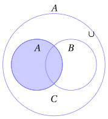{ .fig .ovale loading=lazy style="width:27%" }

    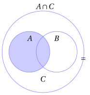{ .fig .ovale loading=lazy style="width:27%" }

    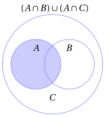{ .fig .ovale loading=lazy style="width:27%" }

    

    The graphical proof of the second property is the following: in the first row we build the left-hand side $A \cup (B \cap C)$, in the second row the right-hand side $(A \cup B) \cap (A \cup C)$.

    

    { .fig .ovale loading=lazy style="width:27%" }

    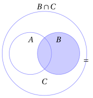{ .fig .ovale loading=lazy style="width:27%" }

    { .fig .ovale loading=lazy style="width:27%" }

    

    

    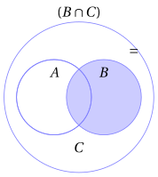{ .fig .ovale loading=lazy style="width:27%" }

    { .fig .ovale loading=lazy style="width:27%" }

    { .fig .ovale loading=lazy style="width:27%" }

    
 □

!!! teorema "Proposition 6: absorption laws"

    Given two sets $\red{A}$ and $\blue{B}$ we have:

    $$
    \red{A} \cap (\red{A} \cup \blue{B}) = \red{A}
    $$

    $$
    \red{A} \cup (\red{A} \cap \blue{B}) = \red{A}
    $$

??? dimostrazione "Proof"

    We prove the two laws by double inclusion.

    - If $x \in A \cap (A \cup B)$, then $x \in A$. Conversely, if $x \in A$, then $x \in A \cup B$, and hence $x \in A \cap (A \cup B)$. Hence $A \cap (A \cup B) = A$.

    - If $x \in A$, then $x \in A \cup (A \cap B)$. Conversely, if $x \in A \cup (A \cap B)$, then $x \in A$ or $x \in A \cap B$; in the second case, again, $x \in A$. Hence $A \cup (A \cap B) = A$.

    
□

!!! teorema "Proposition 7: inclusion, union and intersection"

    Given two sets $A$ and $B$, the following statements are equivalent:

    $$
    A \subseteq B, \qquad\qquad A \cap B = A, \qquad\qquad A \cup B = B.
    $$

??? dimostrazione "Proof"

    We prove that $A \subseteq B$ is equivalent to each of the other two statements.

    - ($A \subseteq B \Longrightarrow A \cap B = A$) Every element of $A \cap B$ belongs to $A$. Conversely, if $x \in A$, then $x \in B$ because $A \subseteq B$, and hence $x \in A \cap B$. By double inclusion $A \cap B = A$.

    - ($A \cap B = A \Longrightarrow A \subseteq B$) If $x \in A$, then $x \in A \cap B$, because $A \cap B = A$, and hence $x \in B$.

    - ($A \subseteq B \Longrightarrow A \cup B = B$) Every element of $B$ belongs to $A \cup B$. Conversely, if $x \in A \cup B$, then $x \in A$ or $x \in B$; in the first case $x \in B$ because $A \subseteq B$. In every case $x \in B$, and by double inclusion $A \cup B = B$.

    - ($A \cup B = B \Longrightarrow A \subseteq B$) If $x \in A$, then $x \in A \cup B$, and hence $x \in B$ because $A \cup B = B$.

    
□

!!! teorema "Proposition 8: De Morgan's laws (first version)"

    Given three sets $\red{A}, \blue{B}$ and $\orange{C}$ we have:

    $$
    \red{A} \setminus (\blue{B} \cap \orange{C}) = (\red{A} \setminus \blue{B}) \cup (\red{A} \setminus \orange{C})
    $$

    $$
    \red{A} \setminus (\blue{B} \cup \orange{C}) = (\red{A} \setminus \blue{B}) \cap (\red{A} \setminus \orange{C})
    $$

??? dimostrazione "Proof"

    The graphical proof of the first property is the following: in the first row we build the left-hand side $A \setminus (B \cap C)$, in the second row the right-hand side $(A \setminus B) \cup (A \setminus C)$, and the two sets obtained on the right coincide.

    

    { .fig .ovale loading=lazy style="width:27%" }

    { .fig .ovale loading=lazy style="width:27%" }

    { .fig .ovale loading=lazy style="width:27%" }

    

    

    { .fig .ovale loading=lazy style="width:27%" }

    { .fig .ovale loading=lazy style="width:27%" }

    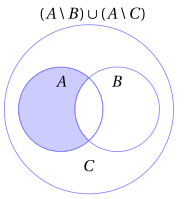{ .fig .ovale loading=lazy style="width:27%" }

    

    The graphical proof of the second property is the following: in the first row we build the left-hand side $A \setminus (B \cup C)$, in the second row the right-hand side $(A \setminus B) \cap (A \setminus C)$.

    

    { .fig .ovale loading=lazy style="width:27%" }

    { .fig .ovale loading=lazy style="width:27%" }

    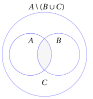{ .fig .ovale loading=lazy style="width:27%" }

    

    

    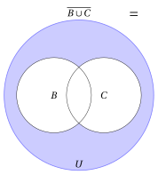{ .fig .ovale loading=lazy style="width:27%" }

    { .fig .ovale loading=lazy style="width:27%" }

    { .fig .ovale loading=lazy style="width:27%" }

    
 □

!!! teorema "Proposition 9: De Morgan's laws (second version)"

    Given the sets $\blue{B}, \orange{C} \subseteq \violet{U}$, we have

    $$
    \overline{\blue{B} \cap \orange{C}} = \overline{\blue{B}} \cup \overline{\orange{C}}
    $$

    $$
    \overline{\blue{B} \cup \orange{C}} = \overline{\blue{B}} \cap \overline{\orange{C}}
    $$

??? dimostrazione "Proof"

    These laws can be derived by setting $A$ equal to $U$ in the previous De Morgan's laws and recalling that $\overline{B} = U \setminus B$ and $\overline{C} = U \setminus C$, as follows:

    $$
    \underbrace{\violet{U} \setminus (\blue{B} \cap \orange{C})}_{=\overline{\blue{B} \cap \orange{C}} } = (\underbrace{\violet{U} \setminus \blue{B}}_{=  \overline{\blue{B}}}) \cup (\underbrace {\violet{U} \setminus \orange{C}}_{= \overline{\orange{C}}})
    $$

    $$
    \underbrace{\violet{U} \setminus (\blue{B} \cup \orange{C})}_{=\overline{\blue{B} \cup \orange{C}} } = (\underbrace{\violet{U} \setminus \blue{B}}_{=  \overline{\blue{B}}}) \cap (\underbrace {\violet{U} \setminus \orange{C}}_{= \overline{\orange{C}}})
    $$

    
□

??? dimostrazione "Proof"

    The graphical proof of the first property is the following: in the first row we build the left-hand side $\overline{B \cap C}$ starting from $B \cap C$, in the second row the right-hand side $\overline{B} \cup \overline{C}$, and the two sets obtained on the right coincide.

    

    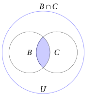{ .fig .ovale loading=lazy style="width:27%" }

    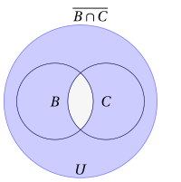{ .fig .ovale loading=lazy style="width:27%" }

    

    

    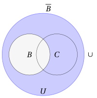{ .fig .ovale loading=lazy style="width:27%" }

    { .fig .ovale loading=lazy style="width:27%" }

    { .fig .ovale loading=lazy style="width:27%" }

    

    The graphical proof of the second property is the following: in the first row we build the left-hand side $\overline{B \cup C}$ starting from $B \cup C$, in the second row the right-hand side $\overline{B} \cap \overline{C}$.

    

    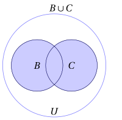{ .fig .ovale loading=lazy style="width:27%" }

    { .fig .ovale loading=lazy style="width:27%" }

    

    

    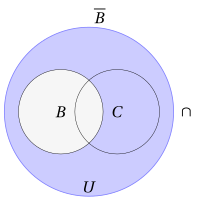{ .fig .ovale loading=lazy style="width:27%" }

    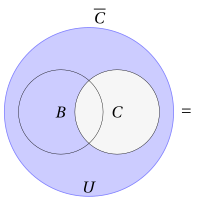{ .fig .ovale loading=lazy style="width:27%" }

    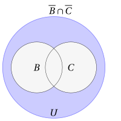{ .fig .ovale loading=lazy style="width:27%" }

    
 □

- The set of elements that belong to a set $B$ or to a set $C$ but not to both (meaning “or” in the <u>exclusive</u> sense) is called the <strong>symmetric difference</strong> of $B$ and $C$ and is denoted by $B \,\triangle\, C$:

    $$
    B \,\triangle\, C = (B \setminus C) \cup (C \setminus B).
    $$

    It is also obtained by setting $U = B \cup C$ and taking the complement of the intersection with respect to this universal set:

    $$
    B \,\triangle\, C = (B \cup C) \setminus (B \cap C).
    $$

??? dimostrazione "Proof"

    We prove that the two expressions of the symmetric difference coincide. We have $x \in (B \setminus C) \cup (C \setminus B)$ if and only if ($x \in B$ and $x \notin C$) or ($x \in C$ and $x \notin B$), that is, if and only if $x$ belongs to only one of the two sets $B$ and $C$. On the other hand, $x \in (B \cup C) \setminus (B \cap C)$ if and only if $x$ belongs to at least one of the two sets but not to both, that is, again, if and only if $x$ belongs to only one of the two sets. Hence the two sets have the same elements. □

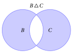{ .fig .ovale loading=lazy style="width:40%" }

### 4.4 Properties of the cardinality of sets

!!! teorema "Proposition 10: cardinality of the union of disjoint sets"

    If $\red{A}$ and $\blue{B}$ are two disjoint finite sets, that is, $|\red{A} \cap \blue{B}| = 0$, then

    $$
    |\red{A} \cup \blue{B}| = |\red{A}| +  |\blue{B}|.
    $$

    More generally, if $A_1, A_2, \dots, A_m$ are pairwise disjoint finite sets, then

    $$
    |A_1 \cup A_2 \cup \cdots \cup A_m| = |A_1| + |A_2| + \cdots + |A_m|.
    $$

??? dimostrazione "Proof"

    Every element of $A \cup B$ belongs to $A$ or to $B$, and no element belongs to both, because $A \cap B = \varnothing$. Counting first the $|A|$ elements of $A$ and then the $|B|$ elements of $B$ we therefore count every element of $A \cup B$ exactly once: $|A \cup B| = |A| + |B|$.

    In the same way, every element of $A_1 \cup A_2 \cup \cdots \cup A_m$ belongs to at least one of the sets $A_1, A_2, \dots, A_m$ and, since the sets are pairwise disjoint, to only one of them. Counting one after the other the elements of $A_1, A_2, \dots, A_m$ we therefore count every element of the union exactly once. □

!!! teorema "Proposition 11: cardinality of the union"

    For any two finite sets $\red{A}$ and $\blue{B}$, we have

    $$
    |\red{A} \cup \blue{B}| = |\red{A}| + |\blue{B}| - |\red{A} \cap \blue{B}|.
    $$

??? dimostrazione "Proof"

    Every element of $A \cup B$ belongs to exactly one of the three sets

    $$
    A \setminus B, \qquad A \cap B, \qquad B \setminus A:
    $$

    if it belongs both to $A$ and to $B$ it lies in $A \cap B$, if it belongs only to $A$ it lies in $A \setminus B$, if it belongs only to $B$ it lies in $B \setminus A$. The three sets are therefore pairwise disjoint and their union is $A \cup B$, and by the cardinality of the union of disjoint sets

    $$
    |A \cup B| = |A \setminus B| + |A \cap B| + |B \setminus A|.
    $$

    In the same way, every element of $A$ belongs to exactly one of the two disjoint sets $A \setminus B$ and $A \cap B$, and every element of $B$ belongs to exactly one of the two disjoint sets $B \setminus A$ and $A \cap B$, hence

    $$
    |A| = |A \setminus B| + |A \cap B|, \qquad |B| = |B \setminus A| + |A \cap B|.
    $$

    Adding the last two equalities we obtain

    $$
    |A| + |B| = |A \setminus B| + |A \cap B| + |B \setminus A| + |A \cap B| = |A \cup B| + |A \cap B|,
    $$

    that is, $|A \cup B| = |A| + |B| - |A \cap B|$. □

!!! teorema "Proposition 12: inequality for the cardinality of the union"

    For any two finite sets $\red{A}$ and $\blue{B}$, we have

    $$
    |\red{A} \cup \blue{B}| \le |\red{A}| + |\blue{B}|.
    $$

??? dimostrazione "Proof"

    By the cardinality of the union we have $|A \cup B| = |A| + |B| - |A \cap B|$. Since $|A \cap B| \ge 0$, we obtain

    $$
    |A \cup B| = |A| + |B| - |A \cap B| \le |A| + |B|.
    $$

    
□

!!! teorema "Proposition 13: cardinality of a subset"

    Given two finite sets $\red{A}$ and $\blue{B}$ with $\red{A} \subseteq \blue{B}$, we have

    $$
    |\red{A}| \le |\blue{B}|.
    $$

    If moreover $\red{A} \subsetneqq \blue{B}$, then $|\red{A}| < |\blue{B}|$.

??? dimostrazione "Proof"

    Since $A \subseteq B$, every element of $B$ belongs to exactly one of the two disjoint sets $A$ and $B \setminus A$, and every element of these two sets belongs to $B$: hence $B = A \cup (B \setminus A)$ and, by the cardinality of the union of disjoint sets,

    $$
    |B| = |A| + |B \setminus A| \ge |A|.
    $$

    If moreover $A \subsetneqq B$, then $A \neq B$ and hence, by the antisymmetric property of inclusion, $B \subseteq A$ cannot hold: there exists an element $b \in B$ with $b \notin A$, that is, $b \in B \setminus A$. Then $|B \setminus A| \ge 1$ and

    $$
    |B| = |A| + |B \setminus A| \ge |A| + 1 > |A|.
    $$

    
□

### 4.5 Ordered pairs and Cartesian product

There is another operation on sets, which can be performed on any two sets (i.e., two sets not necessarily contained in the same universal set). To introduce it we need the concept of <em>ordered pair</em>: unlike the set $\{a, b\}$, in which the order of the elements is irrelevant, in an ordered pair it matters which element comes first.

!!! definizione "Definition 15: of ordered pair"

    Given two elements $a$ and $b$, the <strong>ordered pair</strong> $(a, b)$ is the set

    $$
    (a, b) = \big\{ \{a\},~ \{a,b\} \big\} .
    $$

    The element $a$ is called the <strong>first component</strong> and the element $b$ the <strong>second component</strong> of the pair.

This definition, due to Kuratowski, expresses the ordered pair using only sets. What matters about the ordered pair is the following property.

!!! teorema "Proposition 14: characteristic property of ordered pairs"

    Given the elements $a$, $b$, $c$ and $d$, we have

    $$
    (a, b) = (c, d) \quad \Longleftrightarrow \quad a = c \textrm{ ~and~ } b = d.
    $$

??? dimostrazione "Proof"

    ($\Longleftarrow$) If $a = c$ and $b = d$, the sets $\big\{ \{a\}, \{a,b\} \big\}$ and $\big\{ \{c\}, \{c,d\} \big\}$ are written with the same elements, hence they are equal.

    ($\Longrightarrow$) Suppose $\big\{ \{a\}, \{a,b\} \big\} = \big\{ \{c\}, \{c,d\} \big\}$ and distinguish two cases.

    - If $a = b$, then $\{a, b\} = \{a\}$ and the pair $(a,b) = \big\{\{a\}\big\}$ has only one element. Hence $\big\{ \{c\}, \{c,d\} \big\}$ also has $\{a\}$ as its only element: from $\{c\} = \{a\}$ it follows that $c = a$, and from $\{c, d\} = \{a\}$ it follows that $d = a$. Hence $a = c$ and $b = a = d$.

    - If $a \neq b$, the pair $(a,b)$ has two distinct elements: $\{a\}$, which has one element, and $\{a,b\}$, which has two. Then also $c \neq d$, otherwise $(c, d)$ would have only one element. Since $\{a\} \in \big\{ \{c\}, \{c,d\} \big\}$ and $\{a\}$ has only one element, while $\{c,d\}$ has two, we must have $\{a\} = \{c\}$, that is, $a = c$. Similarly $\{a,b\}$, which has two elements, cannot be equal to $\{c\}$, hence $\{a,b\} = \{c,d\} = \{a, d\}$. Since $b \in \{a, d\}$ and $b \neq a$, we obtain $b = d$.

    
□

- In particular, if $a \neq b$ then $(a, b) \neq (b, a)$: if $(a,b) = (b,a)$ held, the characteristic property would give $a = b$. Instead the sets $\{a, b\}$ and $\{b, a\}$ are always equal. If $a = b$, the two pairs $(a,b)$ and $(b,a)$ are the same pair.

!!! definizione "Definition 16: of Cartesian product"

    Given two (not necessarily distinct) sets $A$ and $B$, the set consisting of all <em>ordered pairs</em> $(a, b)$, with $a \in A$ and $b \in B$, is called the <strong>Cartesian product</strong> of $A$ and $B$ and is denoted by the symbol $A \times B$:

    $$
    A \times B = \big\{ (a, b) : a \in A \textrm{ ~and~ } b \in B \big\}.
    $$

!!! teorema "Proposition 15: cardinality of the Cartesian product"

    When ${A}$ and ${B}$ are two finite sets, the cardinality of their Cartesian product is:

    $$
    |{A} \times {B}| = |{A}| \cdot |{B}|.
    $$

??? dimostrazione "Proof"

    If $A = \varnothing$ there is no pair with first component in $A$, hence $A \times B = \varnothing$ and $|A \times B| = 0 = 0 \cdot |B|$. Otherwise let $a_1, a_2, \dots, a_m$ be the elements of $A$, with $m = |A|$, and for every $i \in \{1, 2, \dots, m\}$ consider the set of pairs with first component $a_i$:

    $$
    R_i = \big\{ (a_i, b) : b \in B \big\}.
    $$

    - Every pair of $A \times B$ belongs to exactly one of the sets $R_1, R_2, \dots, R_m$, the one corresponding to its first component: by the characteristic property, pairs with different first components are different. Hence the sets $R_1, R_2, \dots, R_m$ are pairwise disjoint and their union is $A \times B$.

    - Every set $R_i$ has $|B|$ elements: by the characteristic property, $(a_i, b) = (a_i, b')$ if and only if $b = b'$, hence different elements of $B$ give different pairs.

    By the cardinality of the union of disjoint sets

    $$
    |A \times B| = |R_1| + |R_2| + \cdots + |R_m| = \underbrace{|B| + |B| + \cdots + |B|}_{m \textrm{ times}} = |A| \cdot |B|.
    $$

    
□

!!! esempio "Example 18: Cartesian product"

    $$
    \{a,b\} \times \{a,b,c\} = \big\{ (a,a),(a,b),(a,c),(b,a),(b,b),(b,c) \big\}
    $$

    $$
    |\{a,b\}|=2,~~ |\{a,b,c\}|=3,~~ |\{a,b\} \times \{a,b,c\}| = 2 \cdot 3 = 6
    $$

    The Cartesian product is not commutative: the pair $(c, a)$ belongs to $\{a,b,c\} \times \{a,b\}$, but it does not belong to $\{a,b\} \times \{a,b,c\}$, because $c \notin \{a, b\}$. Hence $\{a,b,c\} \times \{a,b\} \neq \{a,b\} \times \{a,b,c\}$.

The Cartesian product extends to more than two sets.

!!! definizione "Definition 17: of ordered $n$-tuple and of Cartesian product of $n$ sets"

    Given $n \ge 3$ elements $a_1, a_2, \dots, a_n$, the <strong>ordered $n$-tuple</strong> $(a_1, a_2, \dots, a_n)$ is the ordered pair

    $$
    (a_1, a_2, \dots, a_n) = \big( (a_1, a_2, \dots, a_{n-1}),~ a_n \big).
    $$

    Given $n \ge 2$ sets $A_1, A_2, \dots, A_n$, their <strong>Cartesian product</strong> is the set of $n$-tuples

    $$
    A_1 \times A_2 \times \cdots \times A_n = \big\{ (a_1,a_2,\dots,a_n): a_i \in A_i {\rm~~for~every~~} i \in \{1, 2, \dots, n\} \big\}.
    $$

- Applying repeatedly the characteristic property of ordered pairs we obtain

    $$
    (a_1, a_2, \dots, a_n) = (b_1, b_2, \dots, b_n) \quad \Longleftrightarrow \quad a_i = b_i \textrm{ ~for every~ } i \in \{1, 2, \dots, n\}.
    $$

!!! teorema "Proposition 16: cardinality of the Cartesian product of $n$ sets"

    If $A_1, A_2, \dots, A_n$ are finite sets, then

    $$
    |A_1 \times A_2 \times \cdots \times A_n| = |A_1| \cdot |A_2| \cdots |A_n|.
    $$

??? dimostrazione "Proof"

    For $n = 2$ it is the cardinality of the Cartesian product of two sets. For $n \ge 3$, by the definition of $n$-tuple the $n$-tuples $(a_1, a_2, \dots, a_n)$ are exactly the pairs $\big( (a_1, \dots, a_{n-1}), a_n \big)$ with $(a_1, \dots, a_{n-1}) \in A_1 \times \cdots \times A_{n-1}$ and $a_n \in A_n$, that is,

    $$
    A_1 \times A_2 \times \cdots \times A_n = (A_1 \times A_2 \times \cdots \times A_{n-1}) \times A_n.
    $$

    By the cardinality of the Cartesian product of two sets

    $$
    |A_1 \times A_2 \times \cdots \times A_n| = |A_1 \times A_2 \times \cdots \times A_{n-1}| \cdot |A_n|.
    $$

    Repeating the same argument on $A_1 \times A_2 \times \cdots \times A_{n-1}$, then on $A_1 \times A_2 \times \cdots \times A_{n-2}$, and so on down to $A_1 \times A_2$, we obtain $|A_1| \cdot |A_2| \cdots |A_n|$. □

- The Cartesian product of $n$ sets equal to $A$ is denoted by

    $$
    A^n = \underbrace{A \times A \times \cdots \times A}_{n \textrm{ times}}
    $$

    and, if $A$ is finite, by the previous proposition it has cardinality $|A^n| = |A|^n$. For example $\{0, 1\}^3$ has $2^3 = 8$ elements: the triples of $0$ and $1$ correspond to the “in” or “out” choices of the binary tree with which we built the power set of a set with $3$ elements.

- A typical use of the Cartesian product is $\R \times \R$, which is abbreviated by the symbol $\R^2$ and denotes the set of ordered pairs of real numbers.

- Similarly, $\R^n$ (abbreviation of the Cartesian product of $n$ sets equal to $\R$) is the set of <em>ordered $n$-tuples of real numbers</em>

    $$
    \R^n =\big\{ ~(x_1,~x_2,~ \dots,~ x_n)~: ~~x_i \in \R, ~~i \in \{1,2,\dots, n\} ~\big\}
    $$

!!! esempio "Example 19: subsets of the plane"

    When we study subsets of the plane we choose $U = \R^2$ as universal set. For example, the set of points of the plane with both coordinates positive (the <em>first quadrant</em>) is

    $$
    Q_1 = \big\{ (x_1, x_2) \in \R^2 : x_1 > 0 \textrm{ ~and~ } x_2 > 0 \big\}.
    $$

    Since $(x_1, x_2) \in Q_1$ if and only if $x_1 \in \R_{>0}$ and $x_2 \in \R_{>0}$, we have $Q_1 = \R_{>0} \times \R_{>0}$.

## 5. Further topics

### 5.1 Russell's paradox

!!! chiave ""

    “can a set be an element of itself or not?”

- For example, the set of all books in a library is not an element of itself (a set of books is not a book). On the other hand, reasoning naively, the collection of all sets with more than 20 elements would seem to be an element of itself, since it certainly has more than 20 elements. We will see at the end of this section that in the formal definition of sets this collection is not a set.

- Following this reasoning, two categories of sets can be defined:

    1. sets that are not elements of themselves

    2. sets that are elements of themselves

!!! chiave ""

    If we consider the set of all sets that are not elements of themselves, is it an element of itself or not?

Let us call this set $S$; two hypotheses can be made:

- **1** If we suppose $S \in S$, then $S$ contains itself as an element and therefore does not belong to $S$ (since by definition a set belongs to $S$ only if it does not contain itself as an element). Hence $S \notin S$, and we have a contradiction. We conclude that the hypothesis must be wrong.

- **2** If we suppose $S \notin S$, then $S$ does not contain itself as an element and therefore belongs to $S$ (since by definition a set belongs to $S$ if it does not contain itself as an element). Hence $S \in S$ and we have another contradiction. We conclude that this hypothesis must be wrong too!

!!! chiave ""

    <strong>Russell's paradox:</strong> The set of all sets that do not belong to themselves belongs to itself if and only if it does not belong to itself.

- The formal definition of the concept of set is based on the <strong>Zermelo-Fraenkel system of axioms</strong>, abbreviated as <strong>ZF</strong>. This system of axioms includes the standard axioms of axiomatic set theory on which, together with the <em>axiom of choice</em>, all of ordinary mathematics is based.

- The <strong>axiom of pairing</strong> states that “Given two objects, there exists a set whose elements are the two objects”.

- The <strong>axiom of regularity</strong> states that “Every non-empty set $A$ contains an element disjoint from $A$”.

    

    !!! osservazione "Remark 8"

        No set is an element of itself.

    ??? dimostrazione "Proof"

        Let $A$ be a set. By the axiom of pairing, applied to the two objects $A$ and $A$, there exists the set $\{A,A\}$, which coincides with $\{A\}$ since sets do not contain repeated objects: hence $\{A\}$ is a set (it is a special case of a pair), and it is non-empty.

        We now apply the axiom of regularity to the set $\{A\}$: there must exist an element of $\{A\}$ disjoint from $\{A\}$. Since the only element of $\{A\}$ is $A$, $A$ is disjoint from $\{A\}$, that is, $A\cap \{A\}=\varnothing$.

        If $A \in A$ held, since also $A \in \{A\}$, we would have $A \in A \cap \{A\}$, against the fact that $A\cap \{A\}=\varnothing$ (definition of disjoint sets). Hence $A \notin A$. □

- In particular, the collection of all sets with more than 20 elements is not a set in ZF: if it were, it would have more than 20 elements and would therefore be an element of itself, against the remark just proved.

- The other ZF axioms are not part of the basic course in Mathematical Analysis.

### 5.2 A further proof via the Archimedean property

- A further proof of

    $$
    0,\overline{9}=1
    $$

    starts from the assumption that two numbers are equal if and only if their difference is equal to zero, and it is based on computing the value of $1 - 0,\overline{9}$.

- This proof is based on the fact that 0 is the only non-negative number less than all the reciprocals of the positive integers, or equivalently that there is no number greater than every integer. This is the <strong>Archimedean property</strong>, which holds for the rational and the real numbers.

??? dimostrazione "Proof"

    We write the number $0,999...$ with $n$ digits after the decimal point as $0,(9)_n$, hence $0,(9)_1 = 0.9$, $0,(9)_2 = 0.99$, $0,(9)_3 = 0.999$, and so on. 

    Given $\frac{1}{10^n} = 0,0 \dots 01$, with $n$ digits after the decimal point, the addition rules for decimal numbers imply

    $$
    0,(9)_n + \frac{1}{10^n} = 1
    {\rm ~~moreover~~}
    0,(9)_n < 1,  \forall n \in \N.
    $$

    We must prove that $1$ is the smallest number that is not less than all the $0,(9)_n$. For this it is enough to prove that, if a number $x$ is not greater than 1 and not less than all the $0.(9)_n$, then $x = 1$.

    So let $x$ be such that

    $$
    0,(9)_n \le x \le 1
    $$

    for every positive integer $n$. Hence

    $$
    1-1 \le 1 -  x \le 1- 0,(9)_n
    $$

    which, using basic arithmetic and the first equality established above, simplifies to

    $$
    0 \le 1 -  x  \le \frac{1}{10^n}
    $$

    This implies that the difference between $1$ and $x$ is less than the reciprocal of any positive integer. Hence this difference must be zero, and therefore $x = 1$; which in turn implies

    $$
    0.999\dots = 1
    $$

    
□

