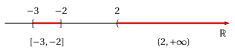

# Number sets and intervals

**Part 1 · Numbers and logic · Chapter 3** · lecture notes by Fabio Furini · [:material-file-pdf-box: Lecture notes, volume (PDF)](../pdf/lecture-notes-1-numbers.pdf) · [:material-presentation: Slides (PDF)](../pdf/slides-numbers-03-number-sets.pdf)

## 1. The five main number sets

### 1.1 The natural numbers

$\N$ is the set of <strong>natural numbers</strong>, that is, the numbers used for counting:

$$
\N = \{0,~ 1,~ 2,~ 3,~ 4,~ \dots\}
$$

- We recall the convention adopted in these notes: <strong>zero is a natural number</strong>, that is $0 \in \N$. Other textbooks exclude zero from $\N$: it is only a convention, but it must be stated once and for all.

- We denote by $\N_{>0}$ the set of <strong>positive natural numbers</strong>:

    $$
    \N_{>0} = \N \setminus \{0\} = \{1,~ 2,~ 3,~ 4,~ \dots\}
    $$

!!! chiave ""

    In the chapter <em>Sets</em> we have already introduced, for the natural numbers:

    - the definitions of <strong>even</strong> number ($n = 2\,m$) and <strong>odd</strong> number ($n = 2\,m+1$), with $m \in \N$, and the fact that every natural number is either even or odd, but never both;

    - the <strong>well-ordering axiom</strong>, stating that every non-empty subset of $\N$ has a minimum.

### 1.2 The integers

$\Z$ is the set of <strong>integers</strong> (also called signed numbers), that is:

$$
0,~ 1,~ - 1,~ 2,~ -2,~ \dots
$$

### 1.3 The rational numbers

$\Q$ is the set of <strong>rational numbers</strong>, that is, of the fractions:

$$
\frac{n}{m},~~ {\rm~where~~} n, m \in \Z , {\rm ~~and~~} m \neq 0.
$$

Rational numbers can also be written in decimal form. For example:

\begin{align*}
\frac{3}{4} = 0, 75, {\rm ~~~while~~~} \frac{1}{3} =  0,333 \dots {\rm }= 0,\overline{3}.
\end{align*}

A rational number, written in decimal form, has a <strong>finite or infinite periodic decimal expansion</strong>: after the decimal point there is a finite number of digits, or an infinite number of digits which, from a certain point on, repeat <em>periodically</em>.

!!! chiave ""

    The same rational number can have two different decimal expansions. The classical example is the equality

    $$
    0,\overline{9}=1
    $$

    for which we gave four different proofs in the chapter <em>Sets</em>, and which we therefore do not repeat here.

### 1.4 The real numbers

$\R$ is the set of <strong>real numbers</strong>, that is, those which are identified with <strong>finite or infinite decimal expansions, periodic or non-periodic</strong>: after the decimal point there may be any string of digits, possibly <em>infinite</em> and <em>non-periodic</em>.

That numbers of this last kind exist (that is, real but not rational), can be understood by reflecting on examples such as:

$$
0,10110111011110 \dots
$$

After the decimal point, the previous number has: one digit equal to $1$, then $0$, then two digits equal to $1$, then $0$, then three digits equal to $1$ … and so on. It is clear that this rule defines a decimal number precisely. On the other hand, the string of digits after the decimal point is neither finite nor periodic: therefore this number is irrational.

### 1.5 The complex numbers

$\C$ is the set of <strong>complex numbers</strong>, that is, numbers of the form $a + i\:b$, where $a$, $b$ are real numbers, and $i$ is the <em>imaginary unit</em>, that is, a number whose square is $-1$.

!!! chiave ""

    Among the number sets introduced, the following inclusions hold:

    $$
    \N ~\subsetneqq~ \Z ~\subsetneqq~ \Q ~\subsetneqq~ \R ~\subsetneqq~ \C.
    $$

    As indicated by the symbols, all the inclusions are strict:

    - there exist integers that are not natural numbers (the negative numbers),

    - there exist rational numbers that are not integers (the proper fractions),

    - there exist real numbers that are not rational (the irrational numbers),

    - there exist complex numbers that are not real (the imaginary numbers).

{ .fig .ovale loading=lazy style="width:62%" }

!!! chiave ""

    As for $\N_{>0}$, we denote by

    $$
    \Z_{>0}, \qquad \Q_{>0}, \qquad \R_{>0}
    $$

    the sets of <strong>positive</strong> integer, rational and real numbers, and by

    $$
    \Z_{\ge 0}, \qquad \Q_{\ge 0}, \qquad \R_{\ge 0}
    $$

    the sets of <strong>non-negative</strong> integer, rational and real numbers (that is, positive or zero). For example:

    $$
    \R_{>0} = \{x \in \R : x > 0\} \qquad {\rm ~~and~~} \qquad \Z_{\ge 0} = \{x \in \Z : x \ge 0\} = \N
    $$

## 2. Intervals

!!! definizione "Definition 1: of bounded interval"

    Given two real numbers $a$, $b$, a <strong>bounded interval</strong> with endpoints $a$ and $b$ is one of the following sets:

    \begin{align*}
    [a,b] = \big\{ x \in \mathbb{R}:  a \le x \le b \big\}, & \qquad
     [a,b) = \big\{ x \in \mathbb{R}:  a \le x < b \big\} \\[2ex]
     (a,b] = \big\{ x \in \mathbb{R}:  a < x \le b \big\}, &\qquad
     (a,b) = \big\{ x \in \mathbb{R}:  a < x < b \big\}
    \end{align*}

- As can be seen, the square (round) bracket at one of the two endpoints indicates that this endpoint is included in (excluded from) the interval.

- The intervals $[a, b]$ are called <strong>closed</strong>; the intervals $(a, b)$ are called <strong>open</strong>.

!!! definizione "Definition 2: of unbounded interval"

    Given a real number $a$, an <strong>unbounded interval</strong> (or <strong>half-line</strong>) with endpoint $a$ is one of the following sets:

    \begin{align*}
    [a,+\infty) = \big\{ x \in \mathbb{R}:  x \ge a \big\}, & \qquad
     (a,+\infty) = \big\{ x \in \mathbb{R}:  x > a \big\} \\[2ex]
     (-\infty,a] = \big\{ x \in \mathbb{R}:  x \le a \big\}, &\qquad
     (-\infty,a) = \big\{ x \in \mathbb{R}:  x < a \big\}
    \end{align*}

- The symbols $-\infty$ and $+\infty$ <strong>are not real numbers</strong>: they are not endpoints that can belong to the set, and therefore next to them one always writes a round bracket.

- The whole line is an unbounded interval as well:

    $$
    \mathbb{R} = (-\infty, +\infty)
    $$

    { .fig .ovale loading=lazy style="width:80%" }

!!! esempio "Example 1: of intervals"

    The graphical representation of the closed bounded interval $[-3,-2]$ and of the open unbounded interval $(2,+\infty)$ is the following:

    { .fig .ovale loading=lazy style="width:80%" }

    The first one contains both of its endpoints, the second one does not contain its endpoint $2$ and is not bounded above.

!!! chiave ""

    It can be proved that the intervals, bounded or unbounded, are exactly the subsets $I$ of $\mathbb{R}$ that satisfy the following property (called <strong>connectedness</strong>):

    $$
    \forall x_1, x_2, x_3 \in \R {\rm ~~such~that~~} x_1 < x_2 < x_3, {\rm ~~if~~} x_1,x_3 \in I, {\rm ~~then~~} x_2 \in I
    $$

- In what follows we will sometimes consider the Cartesian product of two (or more) intervals, which can be given the geometric meaning of a rectangle (in two dimensions) or of a parallelepiped (in three dimensions).

!!! esempio "Example 2: Cartesian product of intervals"

    Let $A = [0, 1]$, $B = [1, 2]$; the figure

    { .fig .ovale loading=lazy style="width:25%" }

    { .fig .ovale loading=lazy style="width:25%" }

    { .fig .ovale loading=lazy style="width:25%" }

    illustrates the sets $A \times B$ , $B \times A$ , $A \times A$, also denoted by $A^2$. In general, $A \times B$ is different from $B \times A$.
