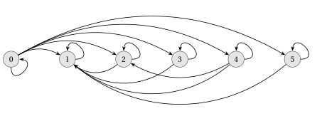
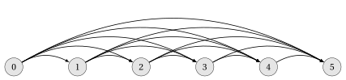
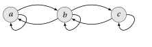
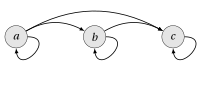
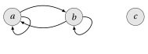
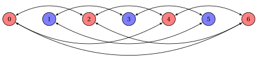
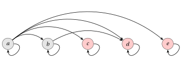
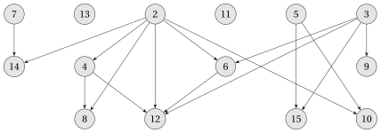
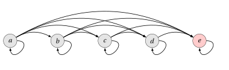

# Binary relations

**Part 1 · Numbers and logic · Chapter 4** · lecture notes by Fabio Furini · [:material-file-pdf-box: Lecture notes, volume (PDF)](../pdf/lecture-notes-1-numbers.pdf) · [:material-presentation: Slides (PDF)](../pdf/slides-numbers-04-binary-relations.pdf)

## 1. Binary relations

!!! definizione "Definition 1: of binary relation"

    Given two sets $\red{A}$ and $\blue{B}$, a <strong>binary relation</strong> $\violet{R}$ is a subset of the Cartesian product $\red{A} \times \blue{B}$

!!! chiave ""

    When we say that $\violet{R}$ is a binary relation on a single set $\red{A}$, we mean that $\violet{R}$ is a subset of $\red{A} \times \red{A}$.

- A binary relation will simply be called a relation (however, non-binary relations also exist).

- If $(a,b) \in \violet{R}$ we also write $a \, \violet{R} \, b$ and we say that $a$ is <strong>related</strong> to $b$.

!!! esempio "Example 1"

    - The relation “less than” (“$<$”) on the natural numbers is the set:

        $$
        R_{<}= \bigg\{ (a,b): a,b \in \mathbb{N} {\rm~~and~~} a < b \bigg\}.
        $$

    - The relation “less than or equal to” (“$\le$”) on the natural numbers is the set:

        $$
        R_{\le}= \bigg\{ (a,b): a,b \in \mathbb{N} {\rm~~and~~} a \le b \bigg\}.
        $$

    - The relation “equal to” (“$=$”) on the natural numbers is the set:

        $$
        R_{=}= \bigg\{ (a,b): a,b \in \mathbb{N} {\rm~~and~~} a = b \bigg\}.
        $$

    - The relation “is a subset of” $R_{\subseteq}$ on the power set of the natural numbers (denoted by $2^{\mathbb{N}}$) is the set:

        $$
        R_{\subseteq} = \bigg\{ (A,B): A,B \in 2^\mathbb{N} {\rm ~~and~~} A \subseteq B \bigg\}.
        $$

!!! chiave ""

    A relation $\violet{R}$ on a set of natural numbers can be visualized with a <strong>table</strong>: in row $a$ and column $b$ we write the pair $(a,b)$ if $(a,b) \in \violet{R}$, and the cell is left empty if $(a,b) \notin \violet{R}$.

!!! esempio "Example 2: tables of relations"

    - The table of the relation $R_{<}$ (rows and columns from $0$ to $4$):

        
<table>
        <tr>
        <td></td>
        <td>\(0\)</td>
        <td>\(1\)</td>
        <td>\(2\)</td>
        <td>\(3\)</td>
        <td>\(4\)</td>
        <td>\(\dots\)</td>
        </tr>
        <tr>
        <td>\(0\)</td>
        <td></td>
        <td>\((0,1)\)</td>
        <td>\((0,2)\)</td>
        <td>\((0,3)\)</td>
        <td>\((0,4)\)</td>
        <td></td>
        </tr>
        <tr>
        <td>\(1\)</td>
        <td></td>
        <td></td>
        <td>\((1,2)\)</td>
        <td>\((1,3)\)</td>
        <td>\((1,4)\)</td>
        <td></td>
        </tr>
        <tr>
        <td>\(2\)</td>
        <td></td>
        <td></td>
        <td></td>
        <td>\((2,3)\)</td>
        <td>\((2,4)\)</td>
        <td></td>
        </tr>
        <tr>
        <td>\(3\)</td>
        <td></td>
        <td></td>
        <td></td>
        <td></td>
        <td>\((3,4)\)</td>
        <td></td>
        </tr>
        <tr>
        <td>\(4\)</td>
        <td></td>
        <td></td>
        <td></td>
        <td></td>
        <td></td>
        <td></td>
        </tr>
        <tr>
        <td>\(\dots\)</td>
        <td></td>
        <td></td>
        <td></td>
        <td></td>
        <td></td>
        <td></td>
        </tr>
        </table>

    - The table of the relation $R_{=}$:

        
<table>
        <tr>
        <td></td>
        <td>\(0\)</td>
        <td>\(1\)</td>
        <td>\(2\)</td>
        <td>\(3\)</td>
        <td>\(4\)</td>
        <td>\(\dots\)</td>
        </tr>
        <tr>
        <td>\(0\)</td>
        <td>\((0,0)\)</td>
        <td></td>
        <td></td>
        <td></td>
        <td></td>
        <td></td>
        </tr>
        <tr>
        <td>\(1\)</td>
        <td></td>
        <td>\((1,1)\)</td>
        <td></td>
        <td></td>
        <td></td>
        <td></td>
        </tr>
        <tr>
        <td>\(2\)</td>
        <td></td>
        <td></td>
        <td>\((2,2)\)</td>
        <td></td>
        <td></td>
        <td></td>
        </tr>
        <tr>
        <td>\(3\)</td>
        <td></td>
        <td></td>
        <td></td>
        <td>\((3,3)\)</td>
        <td></td>
        <td></td>
        </tr>
        <tr>
        <td>\(4\)</td>
        <td></td>
        <td></td>
        <td></td>
        <td></td>
        <td>\((4,4)\)</td>
        <td></td>
        </tr>
        <tr>
        <td>\(\dots\)</td>
        <td></td>
        <td></td>
        <td></td>
        <td></td>
        <td></td>
        <td></td>
        </tr>
        </table>

    - The table of the relation $R_{\le}$, which contains the pairs of $R_{<}$ and those of $R_{=}$:

        
<table>
        <tr>
        <td></td>
        <td>\(0\)</td>
        <td>\(1\)</td>
        <td>\(2\)</td>
        <td>\(3\)</td>
        <td>\(4\)</td>
        <td>\(\dots\)</td>
        </tr>
        <tr>
        <td>\(0\)</td>
        <td>\((0,0)\)</td>
        <td>\((0,1)\)</td>
        <td>\((0,2)\)</td>
        <td>\((0,3)\)</td>
        <td>\((0,4)\)</td>
        <td></td>
        </tr>
        <tr>
        <td>\(1\)</td>
        <td></td>
        <td>\((1,1)\)</td>
        <td>\((1,2)\)</td>
        <td>\((1,3)\)</td>
        <td>\((1,4)\)</td>
        <td></td>
        </tr>
        <tr>
        <td>\(2\)</td>
        <td></td>
        <td></td>
        <td>\((2,2)\)</td>
        <td>\((2,3)\)</td>
        <td>\((2,4)\)</td>
        <td></td>
        </tr>
        <tr>
        <td>\(3\)</td>
        <td></td>
        <td></td>
        <td></td>
        <td>\((3,3)\)</td>
        <td>\((3,4)\)</td>
        <td></td>
        </tr>
        <tr>
        <td>\(4\)</td>
        <td></td>
        <td></td>
        <td></td>
        <td></td>
        <td>\((4,4)\)</td>
        <td></td>
        </tr>
        <tr>
        <td>\(\dots\)</td>
        <td></td>
        <td></td>
        <td></td>
        <td></td>
        <td></td>
        <td></td>
        </tr>
        </table>

!!! definizione "Definition 2: of congruence modulo $n$"

    Given a natural number $n \ge 1$, two natural numbers $a$ and $b$ are <strong>congruent modulo $n$</strong>, written $a \equiv b \pmod{n}$, if their difference is an integer multiple of $n$:

    $$
    a \equiv b \pmod{n} \qquad \Longleftrightarrow \qquad \exists q \in \mathbb{Z} {\rm ~~such~that~~} b - a = q \, n.
    $$

!!! definizione "Definition 3: of multiple and divisor"

    Given two natural numbers $a$ and $b$, we say that $a$ is a <strong>multiple</strong> of $b$ if there exists $k \in \mathbb{N}$ such that $a = k \, b$. We say that $a$ is a <strong>divisor</strong> of $b$ if there exists $k \in \mathbb{N}$ such that $b = k \, a$.

- Hence $a$ is a divisor of $b$ if and only if $b$ is a multiple of $a$.

- With this definition $0$ is a multiple of every natural number ($0 = 0 \cdot b$) and $0$ is a divisor only of itself (if $b = k \cdot 0$ then $b=0$).

!!! esempio "Example 3: other relations on the natural numbers"

    - The relation “congruent modulo $n$” on the natural numbers is the set:

        $$
        R_{\equiv_n} = \bigg\{ (a,b): a,b \in \mathbb{N} {\rm ~~and~~} a \equiv b \pmod{n} \bigg\}.
        $$

        With $n = 3$ the table is:

        
<table>
        <tr>
        <td></td>
        <td>\(0\)</td>
        <td>\(1\)</td>
        <td>\(2\)</td>
        <td>\(3\)</td>
        <td>\(4\)</td>
        <td>\(5\)</td>
        <td>\(6\)</td>
        <td>\(\dots\)</td>
        </tr>
        <tr>
        <td>\(0\)</td>
        <td>\((0,0)\)</td>
        <td></td>
        <td></td>
        <td>\((0,3)\)</td>
        <td></td>
        <td></td>
        <td>\((0,6)\)</td>
        <td></td>
        </tr>
        <tr>
        <td>\(1\)</td>
        <td></td>
        <td>\((1,1)\)</td>
        <td></td>
        <td></td>
        <td>\((1,4)\)</td>
        <td></td>
        <td></td>
        <td></td>
        </tr>
        <tr>
        <td>\(2\)</td>
        <td></td>
        <td></td>
        <td>\((2,2)\)</td>
        <td></td>
        <td></td>
        <td>\((2,5)\)</td>
        <td></td>
        <td></td>
        </tr>
        <tr>
        <td>\(3\)</td>
        <td>\((3,0)\)</td>
        <td></td>
        <td></td>
        <td>\((3,3)\)</td>
        <td></td>
        <td></td>
        <td>\((3,6)\)</td>
        <td></td>
        </tr>
        <tr>
        <td>\(4\)</td>
        <td></td>
        <td>\((4,1)\)</td>
        <td></td>
        <td></td>
        <td>\((4,4)\)</td>
        <td></td>
        <td></td>
        <td></td>
        </tr>
        <tr>
        <td>\(5\)</td>
        <td></td>
        <td></td>
        <td>\((5,2)\)</td>
        <td></td>
        <td></td>
        <td>\((5,5)\)</td>
        <td></td>
        <td></td>
        </tr>
        <tr>
        <td>\(6\)</td>
        <td>\((6,0)\)</td>
        <td></td>
        <td></td>
        <td>\((6,3)\)</td>
        <td></td>
        <td></td>
        <td>\((6,6)\)</td>
        <td></td>
        </tr>
        <tr>
        <td>\(\dots\)</td>
        <td></td>
        <td></td>
        <td></td>
        <td></td>
        <td></td>
        <td></td>
        <td></td>
        <td></td>
        </tr>
        </table>

    - The relation “is a multiple of” on the natural numbers is the set:

        $$
        R_{\textrm{mul}} = \bigg\{ (a,b): a,b \in \mathbb{N} {\rm ~~and~~} \exists k \in \mathbb{N} {\rm ~~such~that~~} a = k \, b \bigg\}.
        $$

        
<table>
        <tr>
        <td></td>
        <td>\(0\)</td>
        <td>\(1\)</td>
        <td>\(2\)</td>
        <td>\(3\)</td>
        <td>\(4\)</td>
        <td>\(5\)</td>
        <td>\(6\)</td>
        <td>\(\dots\)</td>
        </tr>
        <tr>
        <td>\(0\)</td>
        <td>\((0,0)\)</td>
        <td>\((0,1)\)</td>
        <td>\((0,2)\)</td>
        <td>\((0,3)\)</td>
        <td>\((0,4)\)</td>
        <td>\((0,5)\)</td>
        <td>\((0,6)\)</td>
        <td></td>
        </tr>
        <tr>
        <td>\(1\)</td>
        <td></td>
        <td>\((1,1)\)</td>
        <td></td>
        <td></td>
        <td></td>
        <td></td>
        <td></td>
        <td></td>
        </tr>
        <tr>
        <td>\(2\)</td>
        <td></td>
        <td>\((2,1)\)</td>
        <td>\((2,2)\)</td>
        <td></td>
        <td></td>
        <td></td>
        <td></td>
        <td></td>
        </tr>
        <tr>
        <td>\(3\)</td>
        <td></td>
        <td>\((3,1)\)</td>
        <td></td>
        <td>\((3,3)\)</td>
        <td></td>
        <td></td>
        <td></td>
        <td></td>
        </tr>
        <tr>
        <td>\(4\)</td>
        <td></td>
        <td>\((4,1)\)</td>
        <td>\((4,2)\)</td>
        <td></td>
        <td>\((4,4)\)</td>
        <td></td>
        <td></td>
        <td></td>
        </tr>
        <tr>
        <td>\(5\)</td>
        <td></td>
        <td>\((5,1)\)</td>
        <td></td>
        <td></td>
        <td></td>
        <td>\((5,5)\)</td>
        <td></td>
        <td></td>
        </tr>
        <tr>
        <td>\(6\)</td>
        <td></td>
        <td>\((6,1)\)</td>
        <td>\((6,2)\)</td>
        <td>\((6,3)\)</td>
        <td></td>
        <td></td>
        <td>\((6,6)\)</td>
        <td></td>
        </tr>
        <tr>
        <td>\(\dots\)</td>
        <td></td>
        <td></td>
        <td></td>
        <td></td>
        <td></td>
        <td></td>
        <td></td>
        <td></td>
        </tr>
        </table>

!!! esempio "Example 4: other relations on the natural numbers"

    - The relation “is a divisor of” on the natural numbers is the set:

        $$
        R_{\textrm{div}} = \bigg\{ (a,b): a,b \in \mathbb{N} {\rm ~~and~~} \exists k \in \mathbb{N} {\rm ~~such~that~~} b = k \, a \bigg\}.
        $$

        Since $(a,b) \in R_{\textrm{div}}$ if and only if $(b,a) \in R_{\textrm{mul}}$, its table is obtained from that of $R_{\textrm{mul}}$ by swapping the two elements of each pair:

        
<table>
        <tr>
        <td></td>
        <td>\(0\)</td>
        <td>\(1\)</td>
        <td>\(2\)</td>
        <td>\(3\)</td>
        <td>\(4\)</td>
        <td>\(5\)</td>
        <td>\(6\)</td>
        <td>\(\dots\)</td>
        </tr>
        <tr>
        <td>\(0\)</td>
        <td>\((0,0)\)</td>
        <td></td>
        <td></td>
        <td></td>
        <td></td>
        <td></td>
        <td></td>
        <td></td>
        </tr>
        <tr>
        <td>\(1\)</td>
        <td>\((1,0)\)</td>
        <td>\((1,1)\)</td>
        <td>\((1,2)\)</td>
        <td>\((1,3)\)</td>
        <td>\((1,4)\)</td>
        <td>\((1,5)\)</td>
        <td>\((1,6)\)</td>
        <td></td>
        </tr>
        <tr>
        <td>\(2\)</td>
        <td>\((2,0)\)</td>
        <td></td>
        <td>\((2,2)\)</td>
        <td></td>
        <td>\((2,4)\)</td>
        <td></td>
        <td>\((2,6)\)</td>
        <td></td>
        </tr>
        <tr>
        <td>\(3\)</td>
        <td>\((3,0)\)</td>
        <td></td>
        <td></td>
        <td>\((3,3)\)</td>
        <td></td>
        <td></td>
        <td>\((3,6)\)</td>
        <td></td>
        </tr>
        <tr>
        <td>\(4\)</td>
        <td>\((4,0)\)</td>
        <td></td>
        <td></td>
        <td></td>
        <td>\((4,4)\)</td>
        <td></td>
        <td></td>
        <td></td>
        </tr>
        <tr>
        <td>\(5\)</td>
        <td>\((5,0)\)</td>
        <td></td>
        <td></td>
        <td></td>
        <td></td>
        <td>\((5,5)\)</td>
        <td></td>
        <td></td>
        </tr>
        <tr>
        <td>\(6\)</td>
        <td>\((6,0)\)</td>
        <td></td>
        <td></td>
        <td></td>
        <td></td>
        <td></td>
        <td>\((6,6)\)</td>
        <td></td>
        </tr>
        <tr>
        <td>\(\dots\)</td>
        <td></td>
        <td></td>
        <td></td>
        <td></td>
        <td></td>
        <td></td>
        <td></td>
        <td></td>
        </tr>
        </table>

!!! esempio "Example 5: other relations on the natural numbers"

    - The relation “difference of one” on the natural numbers is the set:

        $$
        R^1_{ab} = \bigg\{ (a,b): a,b \in \mathbb{N} {\rm ~~and~~} a =b-1 \bigg\}.
        $$

        
<table>
        <tr>
        <td></td>
        <td>\(0\)</td>
        <td>\(1\)</td>
        <td>\(2\)</td>
        <td>\(3\)</td>
        <td>\(4\)</td>
        <td>\(5\)</td>
        <td>\(6\)</td>
        <td>\(\dots\)</td>
        </tr>
        <tr>
        <td>\(0\)</td>
        <td></td>
        <td>\((0,1)\)</td>
        <td></td>
        <td></td>
        <td></td>
        <td></td>
        <td></td>
        <td></td>
        </tr>
        <tr>
        <td>\(1\)</td>
        <td></td>
        <td></td>
        <td>\((1,2)\)</td>
        <td></td>
        <td></td>
        <td></td>
        <td></td>
        <td></td>
        </tr>
        <tr>
        <td>\(2\)</td>
        <td></td>
        <td></td>
        <td></td>
        <td>\((2,3)\)</td>
        <td></td>
        <td></td>
        <td></td>
        <td></td>
        </tr>
        <tr>
        <td>\(3\)</td>
        <td></td>
        <td></td>
        <td></td>
        <td></td>
        <td>\((3,4)\)</td>
        <td></td>
        <td></td>
        <td></td>
        </tr>
        <tr>
        <td>\(4\)</td>
        <td></td>
        <td></td>
        <td></td>
        <td></td>
        <td></td>
        <td>\((4,5)\)</td>
        <td></td>
        <td></td>
        </tr>
        <tr>
        <td>\(5\)</td>
        <td></td>
        <td></td>
        <td></td>
        <td></td>
        <td></td>
        <td></td>
        <td>\((5,6)\)</td>
        <td></td>
        </tr>
        <tr>
        <td>\(6\)</td>
        <td></td>
        <td></td>
        <td></td>
        <td></td>
        <td></td>
        <td></td>
        <td></td>
        <td></td>
        </tr>
        <tr>
        <td>\(\dots\)</td>
        <td></td>
        <td></td>
        <td></td>
        <td></td>
        <td></td>
        <td></td>
        <td></td>
        <td></td>
        </tr>
        </table>

    - The relation “the sum is even” on the natural numbers is the set:

        $$
        R_{\textrm{even}} = \bigg\{ (a,b): a,b \in \mathbb{N} {\rm ~~and~~} \exists m \in \mathbb{N} {\rm ~~such~that~~} a + b = 2 \, m \bigg\}.
        $$

        
<table>
        <tr>
        <td></td>
        <td>\(0\)</td>
        <td>\(1\)</td>
        <td>\(2\)</td>
        <td>\(3\)</td>
        <td>\(4\)</td>
        <td>\(5\)</td>
        <td>\(6\)</td>
        <td>\(\dots\)</td>
        </tr>
        <tr>
        <td>\(0\)</td>
        <td>\((0,0)\)</td>
        <td></td>
        <td>\((0,2)\)</td>
        <td></td>
        <td>\((0,4)\)</td>
        <td></td>
        <td>\((0,6)\)</td>
        <td></td>
        </tr>
        <tr>
        <td>\(1\)</td>
        <td></td>
        <td>\((1,1)\)</td>
        <td></td>
        <td>\((1,3)\)</td>
        <td></td>
        <td>\((1,5)\)</td>
        <td></td>
        <td></td>
        </tr>
        <tr>
        <td>\(2\)</td>
        <td>\((2,0)\)</td>
        <td></td>
        <td>\((2,2)\)</td>
        <td></td>
        <td>\((2,4)\)</td>
        <td></td>
        <td>\((2,6)\)</td>
        <td></td>
        </tr>
        <tr>
        <td>\(3\)</td>
        <td></td>
        <td>\((3,1)\)</td>
        <td></td>
        <td>\((3,3)\)</td>
        <td></td>
        <td>\((3,5)\)</td>
        <td></td>
        <td></td>
        </tr>
        <tr>
        <td>\(4\)</td>
        <td>\((4,0)\)</td>
        <td></td>
        <td>\((4,2)\)</td>
        <td></td>
        <td>\((4,4)\)</td>
        <td></td>
        <td>\((4,6)\)</td>
        <td></td>
        </tr>
        <tr>
        <td>\(5\)</td>
        <td></td>
        <td>\((5,1)\)</td>
        <td></td>
        <td>\((5,3)\)</td>
        <td></td>
        <td>\((5,5)\)</td>
        <td></td>
        <td></td>
        </tr>
        <tr>
        <td>\(6\)</td>
        <td>\((6,0)\)</td>
        <td></td>
        <td>\((6,2)\)</td>
        <td></td>
        <td>\((6,4)\)</td>
        <td></td>
        <td>\((6,6)\)</td>
        <td></td>
        </tr>
        <tr>
        <td>\(\dots\)</td>
        <td></td>
        <td></td>
        <td></td>
        <td></td>
        <td></td>
        <td></td>
        <td></td>
        <td></td>
        </tr>
        </table>

    - The table of the relation $R_{\subseteq}$ restricted to the subsets of $\{0,1,2\}$ (rows and columns are the sets $A$ and $B$):

        
<table>
        <tr>
        <td></td>
        <td>\(\emptyset\)</td>
        <td>\(\{0\}\)</td>
        <td>\(\{1\}\)</td>
        <td>\(\{2\}\)</td>
        <td>\(\{0,1\}\)</td>
        <td>\(\{0,2\}\)</td>
        <td>\(\{1,2\}\)</td>
        <td>\(\{0,1,2\}\)</td>
        </tr>
        <tr>
        <td>\(\emptyset\)</td>
        <td>\((\emptyset,\emptyset)\)</td>
        <td>\((\emptyset,\{0\})\)</td>
        <td>\((\emptyset,\{1\})\)</td>
        <td>\((\emptyset,\{2\})\)</td>
        <td>\((\emptyset,\{0,1\})\)</td>
        <td>\((\emptyset,\{0,2\})\)</td>
        <td>\((\emptyset,\{1,2\})\)</td>
        <td>\((\emptyset,\{0,1,2\})\)</td>
        </tr>
        <tr>
        <td>\(\{0\}\)</td>
        <td></td>
        <td>\((\{0\},\{0\})\)</td>
        <td></td>
        <td></td>
        <td>\((\{0\},\{0,1\})\)</td>
        <td>\((\{0\},\{0,2\})\)</td>
        <td></td>
        <td>\((\{0\},\{0,1,2\})\)</td>
        </tr>
        <tr>
        <td>\(\{1\}\)</td>
        <td></td>
        <td></td>
        <td>\((\{1\},\{1\})\)</td>
        <td></td>
        <td>\((\{1\},\{0,1\})\)</td>
        <td></td>
        <td>\((\{1\},\{1,2\})\)</td>
        <td>\((\{1\},\{0,1,2\})\)</td>
        </tr>
        <tr>
        <td>\(\{2\}\)</td>
        <td></td>
        <td></td>
        <td></td>
        <td>\((\{2\},\{2\})\)</td>
        <td></td>
        <td>\((\{2\},\{0,2\})\)</td>
        <td>\((\{2\},\{1,2\})\)</td>
        <td>\((\{2\},\{0,1,2\})\)</td>
        </tr>
        <tr>
        <td>\(\{0,1\}\)</td>
        <td></td>
        <td></td>
        <td></td>
        <td></td>
        <td>\((\{0,1\},\{0,1\})\)</td>
        <td></td>
        <td></td>
        <td>\((\{0,1\},\{0,1,2\})\)</td>
        </tr>
        <tr>
        <td>\(\{0,2\}\)</td>
        <td></td>
        <td></td>
        <td></td>
        <td></td>
        <td></td>
        <td>\((\{0,2\},\{0,2\})\)</td>
        <td></td>
        <td>\((\{0,2\},\{0,1,2\})\)</td>
        </tr>
        <tr>
        <td>\(\{1,2\}\)</td>
        <td></td>
        <td></td>
        <td></td>
        <td></td>
        <td></td>
        <td></td>
        <td>\((\{1,2\},\{1,2\})\)</td>
        <td>\((\{1,2\},\{0,1,2\})\)</td>
        </tr>
        <tr>
        <td>\(\{0,1,2\}\)</td>
        <td></td>
        <td></td>
        <td></td>
        <td></td>
        <td></td>
        <td></td>
        <td></td>
        <td>\((\{0,1,2\},\{0,1,2\})\)</td>
        </tr>
        </table>

!!! definizione "Definition 4: of $n$-ary relation"

    Given $n$ sets $A_1, A_2, \dots, A_n$, an <strong>$n$-ary relation</strong> $\violet{R}$ is a subset of the Cartesian product $A_1 \times A_2 \times \dots \times A_n$.

- Binary relations are the $n$-ary relations with $n=2$.

## 2. Properties of relations

!!! chiave ""

    - A relation $\violet{R} \subseteq \red{A} \times \red{A}$ is <strong>reflexive</strong> if:

        $$
        \forall a \in \red{A},\qquad (a,a) \in \violet{R}
        $$

    - A relation $\violet{R} \subseteq \red{A} \times \red{A}$ is <strong>symmetric</strong> if:

        $$
        \forall a,b \in \red{A}, \qquad (a,b) \in \violet{R} ~~\Rightarrow~~ (b,a) \in \violet{R}
        $$

    - A relation $\violet{R} \subseteq \red{A} \times \red{A}$ is <strong>transitive</strong> if:

        $$
        \forall a,b,c \in \red{A}, \qquad (a,b) \in \violet{R} {\rm~~~and~~~} (b,c) \in \violet{R} ~~\Rightarrow~~ (a,c) \in \violet{R}
        $$

    - A relation $\violet{R} \subseteq \red{A} \times \red{A}$ is <strong>antisymmetric</strong> if:

        $$
        \forall a,b \in \red{A}, ~~~~(a,b) \in \violet{R} {\rm~~~and~~~} (b,a) \in \violet{R} ~~\Rightarrow~~  a=b
        $$

!!! osservazione "Remark 1: equivalent form of antisymmetry"

    A relation $\violet{R} \subseteq \red{A} \times \red{A}$ is antisymmetric if and only if:

    $$
    \forall a,b \in \red{A}, ~~~~(a,b) \in \violet{R} {\rm~~~and~~~} a \neq b ~~\Rightarrow~~  (b,a) \notin \violet{R}
    $$

??? dimostrazione "Proof"

    Fix $a,b \in \red{A}$. An implication is false only when the antecedent is true and the consequent is false.

    - The implication “$(a,b) \in \violet{R}$ and $(b,a) \in \violet{R}$ $\Rightarrow$ $a=b$” is false only when $(a,b) \in \violet{R}$, $(b,a) \in \violet{R}$ and $a \neq b$.

    - The implication “$(a,b) \in \violet{R}$ and $a \neq b$ $\Rightarrow$ $(b,a) \notin \violet{R}$” is false only when $(a,b) \in \violet{R}$, $a \neq b$ and $(b,a) \in \violet{R}$.

    The two implications are therefore false in exactly the same cases: for every pair $a,b$ one is true if and only if the other is, and hence one holds for all $a,b \in \red{A}$ if and only if the other does. □

!!! esempio "Example 6"

    - The relation $R_{\le}$ is reflexive, but $R_{<}$ is not.

    - The relations $R_{<}$ and $R_{\le}$ are not symmetric.

    - The relations $R_{<}$ and $R_{\le}$ are transitive, but for example the relation:

        $$
        R^1_{ab} = \bigg\{ (a,b): a,b \in \mathbb{N} {\rm ~~and~~} a =b-1 \bigg\}
        $$

        is not, e.g., $(3,4) \in R^1_{ab}$ and $(4,5) \in R^1_{ab}$ but $(3,5) \notin R^1_{ab}$.

Let us now see in detail, for each property, how to prove that a relation has it and how to show, with a counterexample, that it does not.

!!! esempio "Example 7: reflexive property"

    - The relation $R_{=}$ is reflexive, since

        $$
        a=a, \qquad \forall a \in \mathbb{N}.
        $$

    - The relation $R_{\le}$ is reflexive, since

        $$
        a \le a, \qquad \forall a \in \mathbb{N}.
        $$

    - The relation $R_{<}$ is not reflexive: a counterexample is $a=1$, since $1 < 1$ is false and hence $(1,1) \notin R_{<}$.

!!! esempio "Example 8: symmetric property"

    - The relation $R_{=}$ is symmetric, since

        $$
        a = b ~~\Rightarrow~~ b = a, \qquad \forall a,b \in \mathbb{N}.
        $$

    - The relations $R_{<}$ and $R_{\le}$ are not symmetric: a counterexample is the pair $(1,2)$, since $1<2$ and $1 \le 2$, but $2 < 1$ and $2 \le 1$ are false. Hence $(1,2) \in R_{<}$ but $(2,1) \notin R_{<}$, and $(1,2) \in R_{\le}$ but $(2,1) \notin R_{\le}$.

!!! esempio "Example 9: transitive property"

    - The relation $R_{=}$ is transitive, since

        $$
        a=b {\rm~~and~~} b=c ~~\Rightarrow~~ a=c, \qquad \forall a,b,c \in \mathbb{N}.
        $$

        The same holds for $R_{<}$ and $R_{\le}$: if $a<b$ and $b<c$ then $a<c$, and if $a \le b$ and $b \le c$ then $a \le c$.

    - The relation $R^1_{ab}$ is not transitive: a counterexample is given by $(3,4) \in R^1_{ab}$ and $(4,5) \in R^1_{ab}$, while $(3,5) \notin R^1_{ab}$ because $3 \neq 5-1$.

!!! esempio "Example 10: antisymmetric property"

    - The relation $R_{\le}$ is antisymmetric, since $a \le b$ and $b \le a$ imply $a=b$.

    - The relation $R_{=}$ is antisymmetric, since

        $$
        a=b {\rm~~and~~} b=a ~~\Rightarrow~~ a=b, \qquad \forall a,b \in \mathbb{N}.
        $$

    - The relation $R_{<}$ is antisymmetric. Indeed, there are no two natural numbers $a$ and $b$ with $a<b$ and $b<a$ (otherwise we would have $a<a$): the antecedent of the implication is never true, and hence the implication is true for all $a,b \in \mathbb{N}$. With the equivalent form of antisymmetry this can be seen directly:

        $$
        a<b {\rm~~and~~} a \neq b ~~\Rightarrow~~ b \not< a, \qquad \forall a,b \in \mathbb{N}.
        $$

    - The relation $R_{\equiv_3}$ is not antisymmetric: a counterexample is given by $(0,3) \in R_{\equiv_3}$ (because $3-0 = 1 \cdot 3$) and $(3,0) \in R_{\equiv_3}$ (because $0-3 = (-1) \cdot 3$), while $0 \neq 3$.

## 3. Representation with directed graphs

!!! chiave ""

    Relations can be represented by a <strong>directed graph</strong>, where the <strong>vertices</strong> are the elements of the set on which the relation $R$ is defined and an <strong>arc</strong> $(a,b)$, drawn as an arrow from $a$ to $b$, means that $(a,b) \in R$. An arc $(a,a)$ is called a <strong>loop</strong>.

!!! esempio "Example 11: graphs of relations"

    - The directed graph of the relation “is a multiple of” on the set $\{0, 1, \dots, 5\}$:

        $$
        R = \bigg\{ (a,b): a,b \in \{0, 1, \dots, 5\} {\rm ~~and~~} \exists k \in \mathbb{N} {\rm ~~such~that~~} a = k \, b \bigg\}.
        $$

    { .fig loading=lazy style="width:100%" }

    - The directed graph of the relation “is a divisor of” on the set $\{0, 1, \dots, 5\}$:

        $$
        R = \bigg\{ (a,b): a,b \in \{0, 1, \dots, 5\} {\rm ~~and~~} \exists k \in \mathbb{N} {\rm ~~such~that~~} b = k \, a \bigg\}.
        $$

        It has the same arcs as the previous graph, traversed in the opposite direction.

    { .fig loading=lazy style="width:100%" }

!!! esempio "Example 12: graphs of relations"

    - The directed graph of the relation “less than or equal to” on the set $\{0, 1, \dots, 5\}$:

        $$
        R = \bigg\{ (a,b): a,b \in \{0, 1, \dots, 5\} {\rm ~~and~~} a \le b \bigg\}.
        $$

    { .fig loading=lazy style="width:100%" }

    - The directed graph of the relation “less than” on the set $\{0, 1, \dots, 5\}$, obtained from the previous one by removing the loops:

        $$
        R = \bigg\{ (a,b): a,b \in \{0, 1, \dots, 5\} {\rm ~~and~~} a < b \bigg\}.
        $$

    { .fig loading=lazy style="width:100%" }

    - The directed graph of the relation “equal to” on the set $\{0, 1, \dots, 5\}$, which has only the loops:

        $$
        R = \bigg\{ (a,b): a,b \in \{0, 1, \dots, 5\} {\rm ~~and~~} a = b \bigg\}.
        $$

    { .fig loading=lazy style="width:100%" }

!!! esempio "Example 13: graph of the inclusion relation"

    The directed graph of the relation “is a subset of” on the subsets of $\{0,1\}$:

    $$
    R = \bigg\{ (A,B): A,B \in 2^{\{0,1\}} {\rm ~~and~~} A \subseteq B \bigg\}.
    $$

    { .fig .ovale loading=lazy  }

!!! chiave ""

    The main properties of a relation can be read on its directed graph:

    - the relation is <strong>reflexive</strong> if and only if every vertex $a$ has the loop $(a,a)$;

    - the relation is <strong>symmetric</strong> if and only if, for every pair of vertices $a$ and $b$, if there is the arc from $a$ to $b$ then there is also the arc from $b$ to $a$;

    - the relation is <strong>transitive</strong> if and only if, for every triple of vertices $a$, $b$ and $c$, if there are the arc from $a$ to $b$ and the arc from $b$ to $c$ then there is also the arc from $a$ to $c$;

    - the relation is <strong>antisymmetric</strong> if and only if, for every pair of distinct vertices $a$ and $b$, if there is the arc from $a$ to $b$ then there is no arc from $b$ to $a$ (equivalent form of antisymmetry).

- For example, in the graphs of “is a multiple of”, “is a divisor of”, “less than or equal to” and “equal to” every vertex has the loop (reflexive relations), while in the graph of “less than” no vertex has it. In none of these graphs are there two arcs in opposite directions between two distinct vertices (antisymmetric relations).

!!! esempio "Example 14: graphs satisfying only two properties"

    - The relation $\{(a,a),(b,b),(c,c),(a,b),(b,a),(b,c),(c,b)\}$ on the set $\{a,b,c\}$ is reflexive and symmetric, but not transitive: there are the arcs $(a,b)$ and $(b,c)$, but not the arc $(a,c)$.

        { .fig .ovale loading=lazy  }

    - The relation $\{(a,a),(b,b),(c,c),(a,b),(a,c),(b,c)\}$ on the set $\{a,b,c\}$ is reflexive and transitive, but not symmetric: there is the arc $(a,b)$, but not the arc $(b,a)$.

        { .fig .ovale loading=lazy  }

    - The relation $\{(a,a),(a,b),(b,a),(b,b)\}$ on the set $\{a,b,c\}$ is symmetric and transitive, but not reflexive: the loop $(c,c)$ is missing. For transitivity it suffices to check the pairs of consecutive arcs: from $(a,b)$ and $(b,a)$ follows $(a,a)$, from $(b,a)$ and $(a,b)$ follows $(b,b)$, and the pairs containing a loop give an arc already present.

        { .fig .ovale loading=lazy  }

!!! osservazione "Remark 2: symmetric and transitive relations"

    Let $\violet{R} \subseteq \red{A} \times \red{A}$ be a symmetric and transitive relation. If an element $a \in \red{A}$ appears in at least one pair of $\violet{R}$, then $(a,a) \in \violet{R}$.

??? dimostrazione "Proof"

    If $a$ appears in a pair of $\violet{R}$, there exists $b \in \red{A}$ such that $(a,b) \in \violet{R}$ or $(b,a) \in \violet{R}$. By symmetry, in both cases we have both $(a,b) \in \violet{R}$ and $(b,a) \in \violet{R}$. By transitivity, from $(a,b) \in \violet{R}$ and $(b,a) \in \violet{R}$ follows $(a,a) \in \violet{R}$. □

- Hence a symmetric and transitive relation fails to be reflexive only if some element of $\red{A}$ appears in no pair of the relation, like the element $c$ of the last graph.

## 4. Equivalence relations

!!! definizione "Definition 5: of equivalence relation"

    A reflexive, symmetric and transitive relation is an <strong>equivalence relation</strong>.

!!! esempio "Example 15: equivalence relations"

    - The relation $R_{=}$ is an equivalence relation, because it is reflexive, symmetric and transitive.

    - The relation $R_{<}$ is not an equivalence relation, because it is not reflexive (nor symmetric).

    - The relation $R_{\le}$ is not an equivalence relation, because it is not symmetric.

!!! esempio "Example 16: congruence modulo $n$"

    Given a natural number $n \ge 1$, the relation

    $$
    R_{\equiv_n} = \bigg\{ (a,b): a,b \in \mathbb{N} {\rm ~~and~~} a \equiv b \pmod{n} \bigg\}
    $$

    is an equivalence relation. Recall that $(a,b) \in R_{\equiv_n}$ if and only if there exists $q \in \mathbb{Z}$ such that $b - a = q \, n$.

    - Reflexive: for every $a \in \mathbb{N}$ we have $a - a = 0 \cdot n$, with $0 \in \mathbb{Z}$, hence $(a,a) \in R_{\equiv_n}$.

    - Symmetric: for all $a,b \in \mathbb{N}$, if there exists $q \in \mathbb{Z}$ such that $b - a = q \, n$, then

        $$
        a - b = (-q) \, n, \qquad {\rm with~~} -q \in \mathbb{Z},
        $$

        hence $(b,a) \in R_{\equiv_n}$.

    - Transitive: for all $a,b,c \in \mathbb{N}$, if there exist $q,p \in \mathbb{Z}$ such that $b - a = q \, n$ and $c - b = p \, n$, then

        $$
        c - a = (c-b) + (b-a) = p \, n + q \, n = (q+p) \, n, \qquad {\rm with~~} q+p \in \mathbb{Z},
        $$

        hence $(a,c) \in R_{\equiv_n}$.

!!! esempio "Example 17: the sum is even"

    The relation

    $$
    R_{\textrm{even}} = \bigg\{ (a,b): a,b \in \mathbb{N} {\rm ~~and~~} \exists m \in \mathbb{N} {\rm ~~such~that~~} a + b = 2 \, m \bigg\}
    $$

    is an equivalence relation.

    - Reflexive: for every $a \in \mathbb{N}$ we have $a + a = 2 \, a$, with $a \in \mathbb{N}$, hence $(a,a) \in R_{\textrm{even}}$.

    - Symmetric: for all $a,b \in \mathbb{N}$, if $a + b = 2 \, m$ with $m \in \mathbb{N}$, then also $b + a = a + b = 2 \, m$, hence $(b,a) \in R_{\textrm{even}}$.

    - Transitive: for all $a,b,c \in \mathbb{N}$, if there exist $p,q \in \mathbb{N}$ such that $a + b = 2 \, p$ and $b + c = 2 \, q$, then

        $$
        (a+b) + (b+c) = 2 \, p + 2 \, q ~~\Rightarrow~~ a + c = 2 \, (p + q - b).
        $$

        The number $p+q-b$ is an integer, and it is not negative because $2 \, (p+q-b) = a + c \ge 0$; hence $p+q-b \in \mathbb{N}$ and $(a,c) \in R_{\textrm{even}}$.

!!! definizione "Definition 6: of equivalence class"

    Given an equivalence relation $\violet{R}$ on a set $\red{A}$, the <strong>equivalence class</strong> of an element $a \in \red{A}$ is the set

    $$
    [a] = \bigg\{ b \in \red{A}: (a,b) \in \violet{R} \bigg\}.
    $$

!!! teorema "Lemma 1: related elements have the same class"

    Let $\violet{R}$ be an equivalence relation on a set $\red{A}$. For all $a,b \in \red{A}$:

    $$
    (a,b) \in \violet{R} ~~\Rightarrow~~ [a] = [b].
    $$

??? dimostrazione "Proof"

    Let $(a,b) \in \violet{R}$. We show the two inclusions.

    - $[b] \subseteq [a]$: if $c \in [b]$, then $(b,c) \in \violet{R}$. From $(a,b) \in \violet{R}$ and $(b,c) \in \violet{R}$, by transitivity, follows $(a,c) \in \violet{R}$, that is $c \in [a]$.

    - $[a] \subseteq [b]$: by symmetry $(b,a) \in \violet{R}$. If $c \in [a]$, then $(a,c) \in \violet{R}$, and from $(b,a) \in \violet{R}$ and $(a,c) \in \violet{R}$, by transitivity, follows $(b,c) \in \violet{R}$, that is $c \in [b]$.

    Hence $[a] = [b]$. □

- Any two elements of the same class are related to each other: if $b,c \in [a]$, then $(a,b) \in \violet{R}$ and $(a,c) \in \violet{R}$; by symmetry $(b,a) \in \violet{R}$ and by transitivity $(b,c) \in \violet{R}$. An equivalence class therefore gathers elements that are all related to each other.

!!! esempio "Example 18: equivalence classes"

    The directed graph of an equivalence relation on the set $\{a,b,c,d,e,f\}$ with two equivalence classes, $\{a,b,c\}$ (in blue) and $\{d,e,f\}$ (in red). A double-headed arrow between $x$ and $y$ represents the two arcs $(x,y)$ and $(y,x)$.

    { .fig .ovale loading=lazy  }

!!! definizione "Definition 7: of partition"

    A <strong>partition</strong> of a set $\red{A}$ is a family $\mathcal{S}$ of subsets of $\red{A}$ such that:

    - every set of the family is nonempty: $S \neq \emptyset$ for every $S \in \mathcal{S}$;

    - two distinct sets of the family are disjoint: $S \cap T = \emptyset$ for all $S, T \in \mathcal{S}$ with $S \neq T$;

    - the union of the sets of the family is $\red{A}$: $\displaystyle \bigcup_{S \in \mathcal{S}} S = \red{A}$, that is, every $a \in \red{A}$ belongs to at least one $S \in \mathcal{S}$.

- The family can be finite, $\mathcal{S} = \{S_1, S_2, \dots, S_n\}$, or infinite.

- From the second and the third condition it follows that every element of $\red{A}$ belongs to <strong>one and only one</strong> set of the partition: to at least one by the third condition, and not to two distinct sets $S$ and $T$, which are disjoint.

!!! teorema "Proposition 1: equivalence classes form a partition"

    Let $\violet{R}$ be an equivalence relation on a set $\red{A}$. Then the family of the equivalence classes

    $$
    \mathcal{S} = \bigg\{ [a]: a \in \red{A} \bigg\}
    $$

    is a partition of $\red{A}$.

- The proof checks the three conditions of the definition of partition; the second one follows from the fact that two classes are either equal or disjoint.

??? dimostrazione "Proof"

    Every class $[a]$ is a subset of $\red{A}$ by definition.

    - Nonempty classes: by reflexivity $(a,a) \in \violet{R}$, hence $a \in [a]$ and $[a] \neq \emptyset$.

    - Union equal to $\red{A}$: every $a \in \red{A}$ belongs to the class $[a]$, hence $\red{A} \subseteq \bigcup_{a \in \red{A}} [a]$; the other inclusion holds because every class is contained in $\red{A}$.

    - Distinct classes are disjoint: we show that if two classes $[a]$ and $[b]$ have an element in common, then they are equal. Let $c \in [a] \cap [b]$. Then $(a,c) \in \violet{R}$ and $(b,c) \in \violet{R}$. By symmetry $(c,b) \in \violet{R}$, and by transitivity, from $(a,c) \in \violet{R}$ and $(c,b) \in \violet{R}$, follows $(a,b) \in \violet{R}$. By Lemma [Lemma 1](#box-lem_rb_stessa_classe-26) we then have $[a] = [b]$. Hence two distinct classes have no element in common.

    
□

!!! teorema "Proposition 2: every partition defines an equivalence relation"

    Let $\mathcal{S}$ be a partition of a set $\red{A}$ and let

    $$
    \violet{R} = \bigg\{ (a,b): a,b \in \red{A} {\rm ~~and~~} \exists S \in \mathcal{S} {\rm ~~such~that~~} a \in S {\rm ~~and~~} b \in S \bigg\}.
    $$

    Then $\violet{R}$ is an equivalence relation on $\red{A}$, and its equivalence classes are exactly the sets of the partition $\mathcal{S}$.

??? dimostrazione "Proof"

    We first show that $\violet{R}$ is an equivalence relation.

    - Reflexive: for every $a \in \red{A}$ there exists $S \in \mathcal{S}$ with $a \in S$ (the union of the sets of the partition is $\red{A}$). Then $a$ and $a$ belong to the same set $S$, that is $(a,a) \in \violet{R}$.

    - Symmetric: if $(a,b) \in \violet{R}$, there exists $S \in \mathcal{S}$ with $a \in S$ and $b \in S$; the same $S$ contains $b$ and $a$, hence $(b,a) \in \violet{R}$.

    - Transitive: if $(a,b) \in \violet{R}$ and $(b,c) \in \violet{R}$, there exist $S, T \in \mathcal{S}$ with $a, b \in S$ and $b, c \in T$. Then $b \in S \cap T$, hence $S \cap T \neq \emptyset$ and, since two distinct sets of the partition are disjoint, $S = T$. Hence $a$ and $c$ belong to the same set $S$, that is $(a,c) \in \violet{R}$.

    We now show that the classes are the sets of the partition. Given $a \in \red{A}$, let $S_a$ be the only set of $\mathcal{S}$ containing $a$. If $b \in S_a$, then $(a,b) \in \violet{R}$, that is $b \in [a]$. Conversely, if $b \in [a]$, there exists $S \in \mathcal{S}$ with $a, b \in S$; since $a$ belongs to only one set of the partition, $S = S_a$ and hence $b \in S_a$. Therefore $[a] = S_a$: every class is a set of the partition. Finally, every $S \in \mathcal{S}$ is nonempty: taking $a \in S$, we have $S = S_a = [a]$, hence every set of the partition is a class. □

!!! esempio "Example 19: classes modulo $3$"

    The equivalence relation $R_{\equiv_3}$ divides the natural numbers into $3$ equivalence classes:

    $$
    [0] = \{0, 3, 6, 9, \dots\}, \qquad [1] = \{1, 4, 7, 10, \dots\}, \qquad [2] = \{2, 5, 8, 11, \dots\}.
    $$

    Each class contains the natural numbers that have the same remainder in the division by $3$. Indeed, write $a = 3 \, q_a + r_a$ and $b = 3 \, q_b + r_b$, with $q_a, q_b \in \mathbb{N}$ and remainders $r_a, r_b \in \{0,1,2\}$. Then

    $$
    b - a = 3 \, (q_b - q_a) + (r_b - r_a).
    $$

    - If $r_a = r_b$, then $b - a = 3 \, (q_b - q_a)$ and $(a,b) \in R_{\equiv_3}$.

    - If $(a,b) \in R_{\equiv_3}$, that is $b - a = 3 \, q$ with $q \in \mathbb{Z}$, then $r_b - r_a = 3 \, (q - q_b + q_a)$ is a multiple of $3$ between $-2$ and $2$, hence $r_b - r_a = 0$.

    Here is the directed graph of the relation on the natural numbers from $0$ to $8$, with one colour per class. A double-headed arrow represents the two arcs $(a,b)$ and $(b,a)$; the loops $(a,a)$, present for every $a$, are not drawn.

    { .fig loading=lazy style="width:100%" }

!!! esempio "Example 20: even and odd numbers"

    The equivalence relation $R_{\textrm{even}}$ divides the natural numbers into $2$ equivalence classes, the even numbers and the odd numbers:

    $$
    [0] = \{0, 2, 4, 6, \dots\}, \qquad [1] = \{1, 3, 5, 7, \dots\}.
    $$

    Indeed, write $a = 2 \, q_a + r_a$ and $b = 2 \, q_b + r_b$, with $q_a, q_b \in \mathbb{N}$ and remainders $r_a, r_b \in \{0,1\}$. Then $a + b = 2 \, (q_a + q_b) + (r_a + r_b)$, with $r_a + r_b \in \{0,1,2\}$.

    - If $r_a = r_b$, then $r_a + r_b = 2 \, r_a$ and $a + b = 2 \, (q_a + q_b + r_a)$ is even.

    - If $r_a \neq r_b$, then $r_a + r_b = 1$ and $a + b = 2 \, (q_a + q_b) + 1$ is not even.

    Hence $(a,b) \in R_{\textrm{even}}$ if and only if $a$ and $b$ are both even or both odd. Here is the directed graph of the relation on the natural numbers from $0$ to $6$ (even in red, odd in blue; double-headed arrows and loops omitted as in the previous example):

    { .fig loading=lazy style="width:100%" }

!!! osservazione "Remark 3: equivalence and antisymmetry"

    If an equivalence relation $\violet{R}$ on a set $\red{A}$ is also antisymmetric, then every equivalence class has a single element: $[a] = \{a\}$ for every $a \in \red{A}$.

??? dimostrazione "Proof"

    Let $a \in \red{A}$. By reflexivity $a \in [a]$. If $b \in [a]$, then $(a,b) \in \violet{R}$; by symmetry also $(b,a) \in \violet{R}$, and by antisymmetry $a = b$. Hence $[a] = \{a\}$. □

- In this case $(a,b) \in \violet{R}$ if and only if $b \in [a] = \{a\}$, that is if and only if $a = b$: the only equivalence relation on $\red{A}$ that is also antisymmetric is the relation “equal to”.

## 5. Partial order relations

!!! definizione "Definition 8: of partial order relation"

    A reflexive, antisymmetric and transitive relation is a <strong>partial order relation</strong>.

!!! esempio "Example 21"

    - The relation $R_{\le}$ is a partial order relation, but the relation $R_{<}$ is not, since it is not reflexive.

    - The relation $R_{=}$ is a partial order relation, because it is reflexive, antisymmetric and transitive.

!!! osservazione "Remark 4"

    The relation $R_{\subseteq}$ is a partial order relation

??? dimostrazione "Proof"

    We must prove that the relation is reflexive, antisymmetric and transitive.

    - For it to be reflexive we must prove that $(S,S) \in R_{\subseteq}$, which is true since $S \subseteq S$.

    - For it to be antisymmetric we must prove that if $S_1  \neq S_2$ then $S_1 \nsubseteq S_2$ or $S_2 \nsubseteq S_1$ or both, the negation of the desired property.  Since $S_1  \neq S_2$:

        - **** either there exists some element that is in $S_1$ but not in $S_2$, hence $S_1 \nsubseteq S_2$

        - **** or there exists some element that is in $S_2$ but not in $S_1$, hence $S_2 \nsubseteq S_1$

        - **** or both of the previous options hold

    - For it to be transitive we must prove that $(S_1,S_2) \in R_{\subseteq}$ and $(S_2,S_3) \in R_{\subseteq}$ imply $(S_1,S_3) \in  R_{\subseteq}$. Clearly, since $S_1 \subseteq S_2$ and $S_2 \subseteq S_3$, we have $S_1 \subseteq S_3$.

    
□

!!! esempio "Example 22: multiples and divisors"

    The relation $R_{\textrm{mul}}$ (“is a multiple of”) is a partial order relation.

    - Reflexive: for every $a \in \mathbb{N}$ we have $a = 1 \cdot a$, hence $(a,a) \in R_{\textrm{mul}}$.

    - Transitive: for all $a,b,c \in \mathbb{N}$, if there exist $q,p \in \mathbb{N}$ such that $a = q \, b$ and $b = p \, c$, then

        $$
        a = q \, b = q \, (p \, c) = (q \, p) \, c, \qquad {\rm with~~} q \, p \in \mathbb{N},
        $$

        hence $(a,c) \in R_{\textrm{mul}}$.

    - Antisymmetric: let $a,b \in \mathbb{N}$ with $(a,b) \in R_{\textrm{mul}}$ and $(b,a) \in R_{\textrm{mul}}$, that is $a = q \, b$ and $b = p \, a$ with $q,p \in \mathbb{N}$. Then

        $$
        a = q \, b = q \, p \, a.
        $$

        If $a = 0$, then $b = p \cdot 0 = 0 = a$. If $a \neq 0$, dividing by $a$ we obtain $q \, p = 1$. Neither factor is $0$ (otherwise the product would be $0$), hence $q \ge 1$ and $p \ge 1$; if $q \ge 2$ we would have $q \, p \ge 2 \, p \ge 2$, hence $q = 1$, and in the same way $p = 1$. Therefore $a = 1 \cdot b = b$.

    Also $R_{\textrm{div}}$ (“is a divisor of”) is a partial order relation, because $(a,b) \in R_{\textrm{div}}$ if and only if $(b,a) \in R_{\textrm{mul}}$:

    - reflexive: $(a,a) \in R_{\textrm{mul}}$, hence $(a,a) \in R_{\textrm{div}}$;

    - transitive: if $(a,b), (b,c) \in R_{\textrm{div}}$, then $(c,b), (b,a) \in R_{\textrm{mul}}$, hence $(c,a) \in R_{\textrm{mul}}$ by transitivity of $R_{\textrm{mul}}$, that is $(a,c) \in R_{\textrm{div}}$;

    - antisymmetric: if $(a,b), (b,a) \in R_{\textrm{div}}$, then $(b,a), (a,b) \in R_{\textrm{mul}}$, hence $a = b$ by antisymmetry of $R_{\textrm{mul}}$.

!!! definizione "Definition 9: of partially ordered set"

    A <strong>partially ordered set</strong> is a pair consisting of a set and a partial order relation defined on it.

!!! esempio "Example 23"

    - The sets of natural, rational or real numbers with the relation $R_{\le}$ are partially ordered sets.

    - The relation “is a descendant of” defined on a subset of people is a partial order relation (if we consider individuals as descendants of themselves). Consequently, the subset of people considered with the relation “is a descendant of” is a partially ordered set.

    - The set of natural numbers with the relation $R_{\textrm{mul}}$, or with the relation $R_{\textrm{div}}$, is a partially ordered set.

!!! osservazione "Remark 5: graph of a partial order"

    The directed graph of a partial order relation contains no <strong>cycles</strong>, that is, sequences of arcs

    $$
    (a_1,a_2),~(a_2,a_3),~\dots,~(a_{k-1},a_k),~(a_k,a_1)
    $$

    with $k \ge 2$ distinct vertices $a_1, a_2, \dots, a_k$. In other words, once the loops are removed, the graph is <strong>acyclic</strong>.

??? dimostrazione "Proof"

    Suppose by contradiction that the graph contains a cycle as above. If $k=2$, the cycle consists of the arcs $(a_1,a_2)$ and $(a_2,a_1)$. If $k \ge 3$, applying transitivity to the arcs $(a_2,a_3)$ and $(a_3,a_4)$ we obtain $(a_2,a_4) \in R$, then from $(a_2,a_4)$ and $(a_4,a_5)$ we obtain $(a_2,a_5) \in R$, and so on up to the arc $(a_k,a_1)$, from which we obtain $(a_2,a_1) \in R$. In both cases $(a_1,a_2) \in R$ and $(a_2,a_1) \in R$, and by antisymmetry $a_1 = a_2$, against the assumption that the vertices of the cycle are distinct. □

- The converse does not hold: an acyclic graph does not necessarily represent a partial order relation. For example, the relation $\{(1,2),(2,3)\}$ on the set $\{1,2,3\}$ has a graph without cycles, but it is neither reflexive ($(1,1)$ does not belong to the relation) nor transitive ($(1,3)$ does not belong to the relation).

!!! esempio "Example 24"

    The directed graph of the relation $R_{\subseteq}$ on the subsets of the set $\{1,2,3,4\}$ is the following. To keep the figure readable, the empty set, the sets consisting of a single number (and hence the arcs leaving them) and the loops $(S,S)$ are not shown; all the other arcs are drawn.

    { .fig loading=lazy style="width:90%" }

### 5.1 Maximum, maximal, minimum and minimal elements

!!! definizione "Definition 10: of maximum, maximal, minimum and minimal element"

    Let $(\red{A}, \violet{R})$ be a partially ordered set.

    - An element $\tilde{a} \in \red{A}$ is the <strong>maximum</strong> of $\red{A}$ if:

        $$
        (b, \tilde{a}) \in \violet{R}, \qquad \forall b \in \red{A}.
        $$

    - An element $\bar{a} \in \red{A}$ is a <strong>maximal element</strong> of $\red{A}$ if there is no $b \in \red{A}$ such that:

        $$
        (\bar{a}, b) \in \violet{R} {\rm ~~~and~~~} b \neq \bar{a}.
        $$

    - An element $\tilde{a} \in \red{A}$ is the <strong>minimum</strong> of $\red{A}$ if:

        $$
        (\tilde{a}, b) \in \violet{R}, \qquad \forall b \in \red{A}.
        $$

    - An element $\bar{a} \in \red{A}$ is a <strong>minimal element</strong> of $\red{A}$ if there is no $b \in \red{A}$ such that:

        $$
        (b, \bar{a}) \in \violet{R} {\rm ~~~and~~~} b \neq \bar{a}.
        $$

- On the directed graph: the maximum is the vertex that receives an arc from every vertex; a maximal element is a vertex from which no arc leaves, apart from the loop. For the minimum and the minimal elements, incoming and outgoing arcs are swapped.

!!! teorema "Proposition 3: uniqueness of the maximum and of the minimum"

    In a partially ordered set $(\red{A}, \violet{R})$ the maximum, if it exists, is unique. The same holds for the minimum.

??? dimostrazione "Proof"

    Let $\tilde{a}_1$ and $\tilde{a}_2$ be two maxima of $\red{A}$. Since $\tilde{a}_2$ is a maximum, $(\tilde{a}_1, \tilde{a}_2) \in \violet{R}$; since $\tilde{a}_1$ is a maximum, $(\tilde{a}_2, \tilde{a}_1) \in \violet{R}$. By antisymmetry $\tilde{a}_1 = \tilde{a}_2$. For the minimum: if $\tilde{a}_1$ and $\tilde{a}_2$ are two minima, then $(\tilde{a}_1, \tilde{a}_2) \in \violet{R}$ because $\tilde{a}_1$ is a minimum and $(\tilde{a}_2, \tilde{a}_1) \in \violet{R}$ because $\tilde{a}_2$ is a minimum, and again $\tilde{a}_1 = \tilde{a}_2$. □

!!! osservazione "Remark 6: the maximum is the only maximal element"

    If a partially ordered set $(\red{A}, \violet{R})$ has the maximum $\tilde{a}$, then $\tilde{a}$ is a maximal element, and it is the only maximal element of $\red{A}$.

??? dimostrazione "Proof"

    - $\tilde{a}$ is maximal: if $b \in \red{A}$ and $(\tilde{a}, b) \in \violet{R}$, since $\tilde{a}$ is the maximum also $(b, \tilde{a}) \in \violet{R}$, and by antisymmetry $b = \tilde{a}$. Hence there is no $b \neq \tilde{a}$ with $(\tilde{a}, b) \in \violet{R}$.

    - $\tilde{a}$ is the only maximal element: let $\bar{a}$ be a maximal element. Since $\tilde{a}$ is the maximum, $(\bar{a}, \tilde{a}) \in \violet{R}$; since $\bar{a}$ is maximal, $\tilde{a} \neq \bar{a}$ is impossible. Hence $\bar{a} = \tilde{a}$.

    
□

!!! chiave ""

    - In a partially ordered set the <strong>maximum element</strong> may not exist, that is, there may be no element $a$ such that:

        $$
        \forall b \in A, \qquad (b,a) \in R
        $$

        A partially ordered set may therefore contain several maximal elements $a$ such that, for no $b \in A$ with $b \neq a$, we have $(a,b) \in R$.

!!! esempio "Example 25: maximal elements"

    The directed graph of a partial order relation on the set $\{a,b,c,d,e\}$ with three maximal elements, $c$, $d$ and $e$, in red. The maximum does not exist: for example $(d,c)$ does not belong to the relation. The element $a$ is the minimum.

    { .fig .ovale loading=lazy  }

!!! esempio "Example 26"

    The directed graph associated with the partial order relation “is a divisor of” on the set $\{2, 3, \dots, 15\}$ is the following (the loops $(a,a)$, present for every $a$, are not drawn). The maximal elements are $8, 9, 10, 11, 12, 13, 14$ and $15$, which divide no other number of the set, and the maximum does not exist. The minimal elements are $2, 3, 5, 7, 11$ and $13$, and the minimum does not exist.

    { .fig .ovale loading=lazy  }

!!! esempio "Example 27"

    Given a set of boxes of different sizes, the relation “one box is contained in the other” on the set of boxes may have several maximal boxes, that is, boxes that are not contained in any other box.

## 6. Total order relations

!!! definizione "Definition 11: of total relation"

    A relation $\violet{R}$ on a set $\red{A}$ is a <strong>total relation</strong> if:

    $$
    \forall a, b \in A, \qquad (a, b) \in R  {\rm ~~~or~~~} (b, a) \in R {\rm ~~(or ~both)}
    $$

!!! osservazione "Remark 7: a total relation is reflexive"

    Every total relation $\violet{R}$ on a set $\red{A}$ is reflexive.

??? dimostrazione "Proof"

    Let $a \in \red{A}$. Choosing $b = a$ in the definition of total relation we obtain that $(a,a) \in \violet{R}$ or $(a,a) \in \violet{R}$, that is $(a,a) \in \violet{R}$. □

!!! esempio "Example 28"

    - The relation $R_{\le}$ is a total relation.

    - The relation $R_{\subseteq}$ is not a total relation since, taking for example $S_1=\{1, 2\}$ and $S_2=\{2, 3\}$, $(S_1,S_2) \notin R_{\subseteq}$ and $(S_2,S_1) \notin R_{\subseteq}$.

    - The relation “is a descendant of” is not a total relation since there exist pairs of individuals $(a,b)$ for which neither $a$ descends from $b$ nor $b$ descends from $a$.

    - The relation $R_{<}$ is not a total relation, because it is not reflexive: for $a = b = 1$ the condition of the definition requires $(1,1) \in R_{<}$, which is false.

    - The relation $R_{=}$ is not a total relation: for example $(3,4) \notin R_{=}$ and $(4,3) \notin R_{=}$.

!!! definizione "Definition 12: of total order relation"

    A partial order relation that is also a total relation is a <strong>total order relation</strong>.

!!! esempio "Example 29"

    - The relation $R_{\le}$ is a total order relation.

    - The relation $R_{=}$ is a partial order relation but not a total order relation, because it is not a total relation.

    - The relation $R_{<}$ is not a total order relation, because it is not a partial order relation.

    - The relation $R_{\subseteq}$ is a partial order relation but not a total order relation: as we have seen, the sets $S_1=\{1, 2\}$ and $S_2=\{2, 3\}$ are not comparable.

    - The relation $R_{\textrm{mul}}$ is a partial order relation but not a total order relation: for example $(6,9) \notin R_{\textrm{mul}}$, because there is no $k \in \mathbb{N}$ with $6 = k \cdot 9$, and $(9,6) \notin R_{\textrm{mul}}$, because there is no $k \in \mathbb{N}$ with $9 = k \cdot 6$.

!!! esempio "Example 30: divisibility among powers of $2$"

    The relation

    $$
    R = \bigg\{ (a,b): a,b \in A {\rm ~~and~~} \exists k \in \mathbb{N} {\rm ~~such~that~~} b = k \, a \bigg\}, \qquad {\rm with~~} A = \bigg\{ 2^n: n \in \mathbb{N} \bigg\},
    $$

    that is, the relation “is a divisor of” on the powers of $2$, is a total order relation.

    - It is a partial order relation: reflexivity, antisymmetry and transitivity hold for $R_{\textrm{div}}$ on all the natural numbers, hence they hold in particular for the elements of $A$.

    - It is a total relation: let $a = 2^m$ and $b = 2^n$ be two elements of $A$, with $m,n \in \mathbb{N}$. If $m \le n$, then

        $$
        b = 2^n = 2^{n-m} \cdot 2^m = 2^{n-m} \, a, \qquad {\rm with~~} 2^{n-m} \in \mathbb{N},
        $$

        hence $(a,b) \in R$. If instead $n < m$, in the same way $a = 2^{m-n} \, b$ and $(b,a) \in R$.

!!! definizione "Definition 13: of totally ordered set"

    A <strong>totally ordered set</strong> is a pair consisting of a set and a total order relation defined on it.

!!! esempio "Example 31"

    - The sets of natural, rational or real numbers with the relation $R_{\le}$ are totally ordered sets.

!!! teorema "Proposition 4: maximal element and maximum in a totally ordered set"

    In a totally ordered set $(\red{A}, \violet{R})$ an element is maximal if and only if it is the maximum. Hence a totally ordered set has at most one maximal element.

??? dimostrazione "Proof"

    If $\tilde{a}$ is the maximum, then it is maximal, as we have already proved for every partially ordered set. Conversely, let $\bar{a}$ be a maximal element and let $b \in \red{A}$. Since the relation is total, $(b, \bar{a}) \in \violet{R}$ or $(\bar{a}, b) \in \violet{R}$. In the second case, since $\bar{a}$ is maximal, $b = \bar{a}$, and hence $(b, \bar{a}) = (\bar{a}, \bar{a}) \in \violet{R}$ by reflexivity. In both cases $(b, \bar{a}) \in \violet{R}$, hence $\bar{a}$ is the maximum. Since the maximum, if it exists, is unique, there is at most one maximal element. □

- “At most” cannot be replaced by “exactly”: the totally ordered set $(\mathbb{N}, R_{\le})$ has no maximal elements, because for every $a \in \mathbb{N}$ we have $(a, a+1) \in R_{\le}$ with $a+1 \neq a$.

!!! esempio "Example 32: maximum"

    The directed graph of a total order relation on the set $\{a,b,c,d,e\}$, with the maximum $e$ in red:

    { .fig .ovale loading=lazy  }

## 7. Functions

!!! definizione "Definition 14: of function"

    Given two <em>sets</em> $\red{A}$ and $\blue{B}$, a <em>binary relation</em> $\violet{f}$ on $\red{A}$ and $\blue{B}$ is a <strong>function</strong> if, for each $a \in \red{A}$, there exists one and only one $b \in \blue{B}$ such that $(a, b) \in \violet{f}$.

!!! definizione "Definition 15: of domain and codomain"

    The set $\red{A}$ is called the <strong>domain</strong> of $\violet{f}$, and the set $\blue{B}$ is called the <strong>codomain</strong> of $\violet{f}$.

- We write:

    $$
    \violet{f}:  \red{A} \rightarrow \blue{B}
    $$

    and if $(a, b) \in \violet{f}$, we write:

    $$
    b = \violet{f}(a)
    $$

    since $b$ is uniquely determined by the choice of $a$.

- Intuitively, the function $\violet{f}$ assigns an element of $\blue{B}$ to each element of $\red{A}$. No element of $\red{A}$ is associated with two different elements of $\blue{B}$. The same element of $\blue{B}$ can however be assigned to different elements of $\red{A}$.

!!! esempio "Example 33"

    - The binary relation on $\mathbb{N}$ and $\{0,1\}$:

        $$
        f = \bigg\{(a,b): a \in \mathbb{N},~ b \in \{0,1\} {\rm ~~and~~} b= a \mod 2\bigg\},
        $$

        where $a \mod 2$ is the remainder of the division of $a$ by $2$, <u><em>is a function</em></u> $f: \mathbb{N} \rightarrow \{0,1\}$ since for all natural numbers $a$, there is exactly one value $b \in \{0,1\}$ such that $b = a \mod 2$. For example,

        $$
        0 = f(0),~~~~ 1 = f (1),~~~~
        0 = f(2), \dots
        $$

!!! esempio "Example 34"

    - The binary relation

        $$
        g = \bigg\{(a,b): a,b \in \mathbb{N} {\rm ~~and~~}   a+b {\rm ~is~even} \bigg\}
        $$

        <u><em>is not a function</em></u>, since for example (1, 3) and (1, 5) are both in $g$. In other words, for $a =1$, we do not have one and only one $b$ such that $(a,b) \in g$.

!!! definizione "Definition 16: of argument and value"

    Given a function $\violet{f}: \red{A} \rightarrow \blue{B}$, if ${\viridian{b}} = \violet{f}(\orange{a})$, we say that $\orange{a} \in \red{A}$ is the argument of $\violet{f}$ and that $\viridian{b} \in \blue{B}$ is the value of $\violet{f}$ associated with $\orange{a}$.

- We can <strong>define a function</strong> by <em>directly defining its value</em> for all the <em>elements</em> of its <em>domain</em>.

!!! esempio "Example 35"

    For example, we can define $f(n)=  2\:n$ for $n \in \mathbb{N}$, which means:

    $$
    f = \big\{ (n,2\:n): n \in \mathbb{N} \big\} {~~and~~} f: \mathbb{N} \rightarrow \mathbb{N}
    $$
