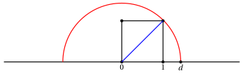
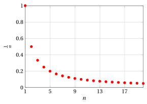
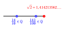
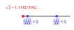

# Ordered fields, supremum/infimum and the completeness axiom

**Part 1 · Numbers and logic · Chapter 5** · lecture notes by Fabio Furini · [:material-file-pdf-box: Chapter PDF](../pdf/numbers-05-ordered-fields.pdf)

## 1. Properties $R_1$ and $R_2$

- We now begin to study more closely the <strong>structure of the number sets</strong> that we introduced earlier, and in particular: the set $\mathbb{Q}$ of <strong>rational numbers</strong> and the set $\mathbb{R}$ of <strong>real numbers</strong>.

- We denote by $a$, $b$, $c$ three generic <strong>rational</strong> or <strong>real</strong> numbers.

!!! chiave ""

    - **$R_1 \rightarrow$** In $\mathbb{Q}$ and $\mathbb{R}$ an operation is defined (called <strong>addition</strong> or <strong>sum</strong>) which has the following four properties:

    - **1** $\forall a,b, \quad a+b = b+a~~~~$  (<strong>commutative property</strong>)

    - **2** $\forall a,b,c, \quad (a+b)+c = a+(b+c)~~~~$  (<strong>associative property</strong>)

    - **3** there exists a <strong>neutral element for the sum</strong>, denoted by $0$, such that:

        $$
        \forall a, ~~  a+0=a
        $$

    - **4** for every $a$ there exists an <strong>inverse</strong> element of $a$ <strong>with respect to the sum</strong>, called the <strong>opposite</strong> of $a$ and denoted by $-a$, such that:

        $$
        a + (-a) =0
        $$

!!! chiave ""

    - **$R_2 \rightarrow$** In $\mathbb{Q}$ and $\mathbb{R}$ an operation is defined (called <strong>multiplication</strong> or <strong>product</strong>) which has the following four properties:

    - **1** $\forall a,b, ~~$ $a \cdot b = b \cdot a~~~~$  (<strong>commutative property</strong>)

    - **2** $\forall a,b,c, ~~$  $(a \cdot b) \cdot c = a \cdot (b\cdot c)~~~~$  (<strong>associative property</strong>)

    - **3** there exists a <strong>neutral element for the product</strong>, denoted by $1$, such that:

        $$
        \forall a, ~~ a \cdot 1=a
        $$

    - **4** for every $a \neq 0$ there exists an <strong>inverse</strong> element of $a$ <strong>with respect to the product</strong>, called the <strong>reciprocal</strong> of $a$ and denoted by $a^{-1}$, such that:

        $$
        a \cdot a^{-1}  = 1
        $$

- The operations of sum and product are linked by the following property:

    !!! chiave ""

        - ****

            $$
            \forall a,b,c,  \qquad (a +b) \cdot c = a \cdot c + b \cdot c  \qquad ({\rm \textbf{distributive} ~~property})
            $$

- From properties $R_1$ and $R_2$ follows the <strong>possibility of performing the four fundamental operations without restrictions</strong>:

    1. <strong>addition</strong> and <strong>multiplication</strong> (defined above)

    2. <strong>subtraction</strong>, by setting:

        $$
        a - b = a + (-b)
        $$

    3. <strong>division</strong>, by setting:

        $$
        a / b = a \cdot b^{-1} {\rm~~~provided~~that~} b \neq 0
        $$

## 2. Commensurable magnitudes

!!! chiave ""

    In mathematics, the word <strong>magnitude</strong> denotes a <strong>property</strong> of a <strong>geometric figure</strong> that can be <strong>measured</strong>. Examples of magnitudes are: the length of a segment, the measure of an angle, the area of a plane figure or the volume of a solid.

!!! definizione "Definition 1: of homogeneous magnitudes"

    Two magnitudes are <strong>homogeneous</strong> if they have the same dimension, i.e., if they can be expressed using the same unit of measurement.

- The length of a segment and the height of a solid are two homogeneous magnitudes; indeed, both can be expressed with the same unit of length.

- The area of a square and the volume of a cone are not homogeneous magnitudes; indeed, area is expressed in square meters or in other units of surface, which however cannot be used to express volume.

!!! definizione "Definition 2: of commensurable and incommensurable magnitudes"

    Two homogeneous magnitudes $a$ and $b$ are called <strong>commensurable</strong> if their ratio is a rational number, i.e., if ${a}/{b}  \in \mathbb{Q}$. They are instead called <strong>incommensurable</strong> if their ratio is not a rational number, i.e., if ${a}/{b}  \notin \mathbb{Q}$.

!!! esempio "Example 1: of commensurable magnitudes"

    The volume of a sphere and the volume of the cylinder circumscribed about the sphere are commensurable. In formulas, the volume $V_s$ of the sphere as a function of its radius $r$ is given by the formula:

    $$
    V_s =\frac{4}{3} \: \pi \: r^3
    $$

    The cylinder circumscribed about it has base radius equal to the radius $r$ of the sphere and height $h$ equal to twice the radius. The volume $V_c$ of this cylinder is therefore given by the formula:

    $$
    V_c =\pi \: r^2 \: h = \pi \: r^2 \: 2 \: r = 2 \: \pi \: r^3
    $$

    Taking the ratio we obtain:

    $$
    \frac{V_s}{V_c} = \frac{\frac{4}{3} \: \pi \: r^3}{2 \: \pi \: r^3}= \frac{2}{3} \in \mathbb{Q}
    $$

!!! esempio "Example 2: of incommensurable magnitudes"

    The length of a circle and the length of its diameter are incommensurable. In formulas, denoting by $d$ the diameter of the circle and by $c$ the length of the circle, we have:

    $$
    c = \pi \: d
    $$

    Now, taking the ratio between the length of the circle and its diameter, we obtain:

    $$
    \frac{c}{d}=\frac{\pi \: d}{d} = \pi \notin \mathbb{Q}
    $$

    A proof that $\pi \notin \mathbb{Q}$ will be given later.

## 3. Geometric representation of $\mathbb{Q}$

!!! chiave ""

    A geometric representation of $\mathbb{Q}$ can be obtained by associating with each rational number a point of the <strong>Euclidean line</strong> (which can be imagined as a line in the plane of infinite length)

- With an arbitrarily chosen point of the Euclidean line we associate $0$, and with another point, distinct from the first, we associate $1$, thus identifying the oriented segment $01$, which constitutes the <strong>unit of measurement</strong>

- At this point we have a <strong>one-to-one correspondence</strong> between the rational numbers and those points $P$ of the line that are endpoints of oriented segments $0P$ <strong>commensurable</strong> with $01$. They are clearly commensurable since:

    $$
    \frac{P}{1} \in \Q {\rm ~~~with~~~} P \in \Q
    $$

{ .fig .ovale loading=lazy style="width:80%" }

## 4. Total order relations

!!! osservazione "Remark 1"

    The sets of rational numbers $~\Q$ and of real numbers $~\R$ with the relation “less than or equal to” (“$\le$”) are totally ordered sets.

- The relations “less than or equal to” (“$\le$”) for the set of rational or real numbers:

    $$
    R_{\le}= \bigg\{ (a,b): a,b \in \mathbb{Q} {\rm~~~~and~~~~} a \le b \bigg\}, \qquad ~~~R_{\le}= \bigg\{ (a,b): a,b \in \mathbb{R} {\rm~~~~and~~~~} a \le b \bigg\}
    $$

    are <strong>partial order relations</strong>. That is, they satisfy the following properties:

    !!! chiave ""

        1. $\forall a, \quad a \le a   \qquad ({\rm \textbf{reflexive} ~~property})$

        2. $\forall a,b, \quad  a \le b {\rm~~~~and~~~~} b \le a ~~\Rightarrow~~ a =  b   \qquad ({\rm \textbf{antisymmetric} ~~property})$

        3. $\forall a,b,c, \quad  a \le b {\rm~~~~and~~~~} b \le c ~~\Rightarrow~~ a \le  c   \qquad ({\rm \textbf{transitive} ~~property})$

    Moreover, the relations “less than or equal to” (“$\le$”) for $\Q$ and $\R$ are <strong>total relations</strong> since:

    !!! chiave ""

        1. $\forall a,b, \qquad a \le b {\rm~~~~or~~~~} b \le a$

- Consequently, the pair consisting of the set $\Q$ or $\R$ and the corresponding relation $R_{\le}$ is a totally ordered set.

## 5. Property $R_3$

- We now highlight the properties of the ordering of rational or real numbers:

    !!! chiave ""

        - **$R_3 \rightarrow$** In $\mathbb{Q}$ and $\mathbb{R}$ the total order relation “less than or equal to” (“$\le$”) is defined, compatible with the algebraic structure [^1], that is:

            1. $\forall a,b, c,\qquad a \le b ~~\Rightarrow~~ a +  c  \le b +c$

            2. $\forall a,b,c > 0, \qquad  a \le b ~~\Rightarrow~~ a \cdot  c  \le b \cdot c$

- We observe that all the rules of algebraic computation follow from the properties: $R_1$, $R_2$, $R_3$.

!!! esempio "Example 3"

    For example, all the usual procedures used to solve inequalities are a consequence of the axioms and of the algebraic properties of the sum and the product, expressed by $R_1$ and $R_2$.

## 6. Ordered fields

!!! definizione "Definition 3: of (ordered) field"

    An <strong>ordered field</strong> is a set on which two operations (sum and product) and a total order relation are defined, satisfying the properties $R_1$, $R_2$, $R_3$. A set with only the properties $R_1$, $R_2$ is called a <strong>field</strong>.

- Everything we have said so far about the operations of sum and product and about the total order relation “less than or equal to” (“$\le$”) holds both for the set of rational numbers and for the set of real numbers.

!!! osservazione "Remark 2"

    The sets of rational numbers $~\Q$ and of real numbers $~\R$ are ordered fields.

- From this point of view, therefore, $\mathbb{Q}$ and $\mathbb{R}$ appear to have similar properties. In what follows we will highlight the <strong>property that substantially distinguishes</strong> $\mathbb{R}$ from $\mathbb{Q}$ and that makes $\mathbb{R}$ the <strong>right setting for developing mathematical analysis</strong>.

- We begin by observing that the <strong>set of rational numbers is inadequate for expressing the lengths of segments</strong> (but also areas, volumes, times, speeds, etc.)

!!! chiave ""

    As we have seen, there exist magnitudes that are not <strong>commensurable</strong> with each other. The classic example is given by the diagonal and the side of a square: if the side measures 1, the abscissa $d$ that measures the diagonal is not a rational number.

    { .fig .ovale loading=lazy style="width:80%" }

    Indeed, by the Pythagorean Theorem we have:

    $$
    d^2 = 1^2 + 1^2 = 2
    $$

    but, as we have seen, there is no rational number whose square is $2$. Hence the point $d$ on the line does not represent any rational number. This means that, after “occupying” the points of the line with the rational numbers, there are still some <strong>empty places</strong> left on it.

## 7. Bounded sets, maxima and minima

!!! definizione "Definition 4: of bounded set"

    Let $E$ be a set contained in $\Q$ or in $\R$. The set $E$ is called <strong>bounded</strong> if there exist two numbers $m$ and $M$ such that:

    $$
    \forall x \in E, \qquad m \le x \le M \qquad
    $$

- $E$ is <strong>bounded below</strong> if there exists a number $m$ such that:

    $$
    \forall x \in E, \qquad m \le x  \qquad
    $$

- $E$ is <strong>bounded above</strong> if there exists a number $M$ such that:

    $$
    \forall x \in E, \qquad x \le M \qquad
    $$

- It makes no difference whether we require $m$ and/or $M$ to belong to $\Q$ or to $\R$, since the condition only concerns the existence of such numbers.

!!! definizione "Definition 5: of maximum and minimum of a set"

    An element $x_{M} \in E$ is called the <strong>maximum</strong> of $E$ if:

    $$
    \forall x \in E, \qquad x \le x_{M}
    $$

    An element $x_m \in E$ is called the <strong>minimum</strong> of $E$ if:

    $$
    \forall x \in E, \qquad x_m \le x
    $$

!!! chiave ""

    The existence of the maximum and of the minimum of a set implies that the set is bounded, that is:

    \begin{equation}
    {\rm ~~existence~of~maximum~and~minimum~} ~~\Rightarrow~~ {\rm ~~bounded~set~} \label{BBB}
    \end{equation}

    but the converse is not true (we will give a counterexample later):

    \begin{equation}
    {\rm ~~bounded~set~}  ~~\nRightarrow~~  {\rm ~~existence~of~maximum~and~minimum~} 
     \label{CCC}
    \end{equation}

    Hence the fact that a set is bounded is a necessary but not sufficient condition for the set to have a maximum and a minimum. Moreover, the existence of a maximum and a minimum is a sufficient but not necessary condition for a set to be bounded.  

    From the contrapositive of \(\eqref{BBB}\) we have:

    $$
    {\rm ~~unbounded~set~}   ~~\Rightarrow~~ {\rm ~~non\text{-}existence~of~maximum~and~minimum~}
    $$

    that is, if a set is not bounded, it has no maximum or it has no minimum.

!!! esempio "Example 4: of maxima and minima"

    
<table>
    <tr>
    <td>Example</td>
    <td>set \(E\)</td>
    <td>minimum</td>
    <td>maximum</td>
    </tr>
    <tr>
    <td>I)</td>
    <td>\(\mathbb{N}\)</td>
    <td>\(0\)</td>
    <td>does not exist</td>
    </tr>
    <tr>
    <td>II)</td>
    <td>even integers</td>
    <td>does not exist</td>
    <td>does not exist</td>
    </tr>
    </table>

!!! esempio "Example 5: of maxima and minima"

    
<table>
    <tr>
    <td>Example</td>
    <td>set \(E\)</td>
    <td>minimum</td>
    <td>maximum</td>
    </tr>
    <tr>
    <td>III)</td>
    <td>\(\bigg\{~~\frac{1}{n} ~~:~~ n \in \mathbb{N}\setminus \{0\}~~\bigg\}\)</td>
    <td>does not exist</td>
    <td>1</td>
    </tr>
    </table>

    { .fig .ovale loading=lazy style="width:58%" }

!!! esempio "Example 6: of maxima and minima"

    
<table>
    <tr>
    <td>Example</td>
    <td>set \(E\)</td>
    <td>minimum</td>
    <td>maximum</td>
    </tr>
    <tr>
    <td>IV)</td>
    <td>\(\bigg\{~~\frac{n-1}{n+1} ~~:~~ n \in \mathbb{N}~~\bigg\}\)</td>
    <td>\-1</td>
    <td>does not exist</td>
    </tr>
    </table>

    We have:

    $$
    \frac{n-1}{n+1} = \frac{n+1-1-1}{n+1}=1-\frac{2}{n+1}
    $$

    { .fig .ovale loading=lazy style="width:58%" }

!!! chiave ""

    Note that sometimes, even though the set is bounded, it may have no maximum or no minimum.

!!! esempio "Example 7: of maxima and minima"

    
<table>
    <tr>
    <td>Example</td>
    <td>set \(E\)</td>
    <td>minimum</td>
    <td>maximum</td>
    </tr>
    <tr>
    <td>V)</td>
    <td>\(\left\{ x \in \mathbb{R}:~~ 27 \le  x^3 \right\}\)</td>
    <td>3</td>
    <td>does not exist</td>
    </tr>
    </table>

    We have:

    $$
    27 \le  x^3 \Longleftrightarrow \sqrt[3]{27}=3 \le  x {\rm ~~~~and~~~} 3 \in E
    $$

!!! esempio "Example 8: of maxima and minima"

    
<table>
    <tr>
    <td>Example</td>
    <td>set \(E\)</td>
    <td>minimum</td>
    <td>maximum</td>
    </tr>
    <tr>
    <td>VI)</td>
    <td>\(\left\{ x \in \mathbb{Q}:~~ x \ge 0,  x  < \sqrt{2}   \right\}\)</td>
    <td>0</td>
    <td>does not exist</td>
    </tr>
    </table>

    The value $\sqrt{2}$ is irrational, hence by truncating we obtain rational numbers that get closer and closer to $\sqrt{2}$, none of which has the property of being the maximum. 

    { .fig .ovale loading=lazy style="width:50%" }

    It is an example of a bounded set that has no maximum.

    
<table>
    <tr>
    <td>Example</td>
    <td>set \(E\)</td>
    <td>minimum</td>
    <td>maximum</td>
    </tr>
    <tr>
    <td>VII)</td>
    <td>\(\left\{ x \in \mathbb{Q}:~~  ~  x  > \sqrt{2}, x\le 4   \right\}\)</td>
    <td>does not exist</td>
    <td>4</td>
    </tr>
    </table>

    The value $\sqrt{2}$ is irrational, hence by truncating and rounding up we obtain rational numbers that get closer and closer to $\sqrt{2}$, none of which has the property of being the minimum. 

    { .fig .ovale loading=lazy style="width:50%" }

    It is an example of a bounded set that has no minimum.

## 8. Upper/lower bounds and suprema/infima

!!! definizione "Definition 6: of upper bound of a set"

    Let $E$ be a set contained in $\Q$ or in $\R$; a number $k$ belonging to $\Q$ or to $\R$ respectively is called an <strong>upper bound</strong> of $E$ if:

    $$
    \forall x \in E, \qquad  x \le k
    $$

!!! definizione "Definition 7: of lower bound of a set"

    Let $E$ be a set contained in $\Q$ or in $\R$; a number $k$ belonging to $\Q$ or to $\R$ respectively is called a <strong>lower bound</strong> of $E$ if:

    $$
    \forall x \in E, \qquad k \le  x
    $$

!!! chiave ""

    We observe that a set bounded above (below) has many upper (lower) bounds. Moreover, the upper (lower) bounds do not necessarily belong to the set itself.

!!! definizione "Definition 8: of supremum"

    The <strong>supremum</strong> of $E$ (denoted by $\sup E$) is the minimum of the upper bounds of $E$.

!!! definizione "Definition 9: of infimum"

    The <strong>infimum</strong> of $E$ (denoted by $\inf E$) is the maximum of the lower bounds of $E$.

!!! chiave ""

    We observe that the supremum (infimum) may not exist (unbounded sets). We also observe that if the set has a maximum (minimum), it coincides with the supremum (infimum).

!!! esempio "Example 9: of suprema and infima"

    
<table>
    <tr>
    <td>Example</td>
    <td>set \(E\)</td>
    <td>\(\inf E\)</td>
    <td>\(\sup E\)</td>
    <td>minimum</td>
    <td>maximum</td>
    </tr>
    <tr>
    <td>I)</td>
    <td>\(\left\{ x \in \mathbb{Q}:~~ x \ge 0, x  < \sqrt{2}   \right\}\)</td>
    <td>0</td>
    <td>does not exist</td>
    <td>0</td>
    <td>does not exist</td>
    </tr>
    </table>

    We have:

    $$
    \sqrt{2} \notin E
    {\rm ~~~~and~~~} \sqrt{2} \notin \Q
    $$

    hence the maximum does not exist, and neither does the $\sup$.

    
<table>
    <tr>
    <td>Example</td>
    <td>set \(E\)</td>
    <td>\(\inf E\)</td>
    <td>\(\sup E\)</td>
    <td>minimum</td>
    <td>maximum</td>
    </tr>
    <tr>
    <td>II)</td>
    <td>\(\left\{ x \in \mathbb{R}:~~ x \ge 0,  ~x  < \sqrt{2}   \right\}\)</td>
    <td>0</td>
    <td>\(\sqrt{2}\)</td>
    <td>0</td>
    <td>does not exist</td>
    </tr>
    </table>

    We have:

    $$
    \sqrt{2} \notin E
    {\rm ~~~~and~~~} \sqrt{2} \in \R
    $$

    that is, the maximum does not exist, but $\sqrt{2}$ is the minimum of the upper bounds and therefore it is the $\sup$.

## 9. Axiomatic definition of the real numbers

!!! chiave ""

    A totally ordered number set $X$ is said to have the <strong>supremum property</strong> (least upper bound property) if:

    - **$R_4 \rightarrow$** Every non-empty set $E \subset X$ that is bounded above has a supremum in $X$

- It is easy to prove that, if this property holds, then it is also true that every non-empty subset of $X$ that is bounded below has an infimum.

- It is not required that $X$ itself has a supremum (for example, in the case $X = \mathbb{Q}$ or $\mathbb{R}$ this is certainly false!), but that every non-empty subset of $X$ that is bounded above has one.

!!! chiave ""

    Example VI shows that $\mathbb{Q}$ certainly does not have the supremum property. On the other hand, $\mathbb{R}$ has this property. [^2]

- In the <strong>axiomatic definition</strong> of $\mathbb{R}$, this property is part of the very definition of $\mathbb{R}$

!!! definizione "Definition 10:  (axiomatic) of the real numbers"

    We call $\mathbb{R}$ a set that satisfies the properties $R_1$, $R_2$, $R_3$, $R_4$, that is, an ordered field that has the supremum property

- The supremum property is also called the <strong>Dedekind axiom</strong>, <strong>or axiom of continuity</strong>, or <strong>completeness axiom</strong>, and it can also be stated in the following equivalent form.

!!! chiave ""

    Let $\{A, B\}$ be a partition of $\mathbb{R}$ (i.e., $A$ and $B$ are non-empty disjoint sets whose union is $\mathbb{R}$); the partition is called a <strong>cut</strong> (section) if:

    $$
    \forall a \in A {\rm ~~and~~} \forall b \in B {\rm ~~we~have~~} a < b.
    $$

    Then one proves that:

    - **$R_4' \rightarrow$** For every cut $\{A, B\}$ of $\mathbb{R}$ there exists a unique real number $s$ (called the <strong>separating element</strong>) such that:

        $$
        \forall a \in A {\rm ~~and~~} \forall b \in B , \qquad a \le s \le b \qquad
        $$

    This separating element is $\sup A$ and $\inf B$, hence $\sup A=\inf B$

## 10. Geometric representation of $\mathbb{R}$

!!! chiave ""

    Can the set of real numbers $\mathbb{R}$ be put in one-to-one correspondence with the points of the Euclidean line?

- Let us now return to the problem of the incommensurability of the side and the diagonal of a square. When, with straightedge and compass, having fixed the unit side of the square, we construct its diagonal and transfer it onto the starting line, the arc drawn by the compass "splits the line in two", generating what we have called a cut; the separating element, which exists by axiom $R_4$, geometrically represents the point of intersection, and therefore that number measures the diagonal.

{ .fig .ovale loading=lazy style="width:80%" }

!!! chiave ""

    Hence the geometric interpretation of property $R_4$ shows us how the set $\mathbb{R}$ is an adequate representation of our intuitive idea of a line, so adequate that <strong>in mathematics the expression “the real line” is often used to denote</strong> $\mathbb{R}$, identifying the number set with its natural geometric representation.

[^1]: an algebraic structure is a set, called the underlying set (of the structure), equipped with one or more operations
[^2]: However, we will not present a formal proof.
