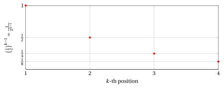
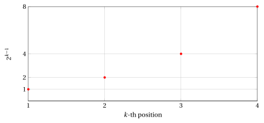

# Summations and geometric progressions

**Part 1 · Numbers and logic · Chapter 7** · lecture notes by Fabio Furini · [:material-file-pdf-box: Lecture notes, volume (PDF)](../pdf/lecture-notes-1-numbers.pdf) · [:material-presentation: Slides (PDF)](../pdf/slides-numbers-07-summations.pdf)

## 1. Summations

!!! definizione "Definition 1: summation"

    Let $a_1 , a_2, \dots, a_n$ be $n$ real numbers. Their sum

    $$
    a_1 + a_2 + \dots + a_n
    $$

    can be written in compact form with the summation symbol:

    $$
    \sum_{k=1}^n a_k
    $$

    which is read: “sum for $k$ from $1$ to $n$ of $a_k$”. The symbol $k$ is called the summation index.

- The summation symbol is therefore just a shorthand, which is nevertheless very useful when the terms $a_k$ are defined explicitly as a function of the index $k$.

!!! esempio "Example 1: summations"

    \begin{align*}
    \sum_{k=1}^{10} \frac{1}{k} &~~=~~ 1 +\frac{1}{2} +\frac{1}{3} +\frac{1}{4} +\frac{1}{5} +\frac{1}{6} +\frac{1}{7} +\frac{1}{8} +\frac{1}{9} +\frac{1}{10} \\[2ex]
     \sum_{k=3}^{n} k^2 &~~=~~ 3^2 +4^2 +5^2 + \dots +n^2
    \end{align*}

- The summation index is a <strong>dummy index</strong>. This means that if we replace $k$ with $i$, $j$ or any other index (in all its occurrences), the value of the summation does not change.

!!! esempio "Example 2: dummy index"

    We have:

    $$
    \sum_{k=1}^{n} k^2 ~~=~~   \sum_{i=1}^{n} i^2
    $$

    since both symbols denote the sum of the squares of the first $n$ natural numbers (without zero).

    On the other hand, we have:

    $$
    \sum_{k=1}^{n} k^2 ~~\neq~~   \sum_{k=1}^{m} k^2
    $$

    since the two symbols denote the sum of, respectively, the first $n$ or the first $m$ squares (if $n \neq m$ the result will be different).

### 1.1 Main properties of summations

!!! osservazione "Remark 1: product by a constant"

    Given a summation $\sum_{k=1}^n a_k$ and a real number $c \in \R$, we have:

    \begin{equation}
    \label{P1}
    \sum_{k=1}^n (c \cdot a_k) = c \: \sum_{k=1}^n a_k
    \end{equation}

??? dimostrazione "Proof"

    By the distributive property we have:

    $$
    \underbrace{c\: a_1 + c\: a_2 + \dots + c\: a_n}_{=\sum_{k=1}^n (c \cdot a_k)} = \underbrace{c \: (a_1+a_2+\dots+a_n)}_{= c \: \sum_{k=1}^n a_k}
    $$

    
□

!!! osservazione "Remark 2: summation with a constant term"

    For every natural number $n \ge 1$ and every real number $c \in \R$, we have:

    \begin{equation}
    \label{P2}
    \sum_{k=1}^n c  = c \cdot n
    \end{equation}

??? dimostrazione "Proof"

    We have:

    $$
    \underbrace{c\:  + c  + \dots + c\:}_{=\sum_{k=1}^n c {\rm ~~~~that~is,~} c {\rm ~added~} n {\rm ~times}} = c \: n
    $$

    
□

!!! osservazione "Remark 3: union of summations"

    Given two summations $\sum_{k=1}^n a_k$ and $\sum_{k=1}^n b_k$, we have:

    \begin{equation}
    \label{P3}
    \sum_{k=1}^n a_k  + \sum_{k=1}^n b_k = \sum_{k=1}^n (a_k + b_k)
    \end{equation}

??? dimostrazione "Proof"

    We have:

    $$
    \underbrace{a_1 +  a_2 + \dots + a_n +  b_1 +  b_2 + \dots +  b_n}_{=\sum_{k=1}^n a_k  + \sum_{k=1}^n b_k} = \underbrace{a_1 + b_1 +a_2 + b_2+\dots+a_n + b_n}_{=\sum_{k=1}^n (a_k + b_k) }
    $$

    
□

- The three properties that follow (decomposition, index translation and index reflection) are simply different ways of writing and/or ordering the terms of the summations.

!!! osservazione "Remark 4: decomposition"

    Given two natural numbers $n \ge 1$ and $m \ge 1$, we have:

    \begin{equation}
    \label{P4}
    \sum_{k=1}^{n+m} a_k   = \sum_{k=1}^{n} a_k + \sum_{k=n+1}^{n+m} a_k
    \end{equation}

??? dimostrazione "Proof"

    The terms of the summation $\sum_{k=1}^{n+m} a_k$ can be grouped into the first $n$ and the last $m$ ones:

    $$
    \underbrace{a_1 + a_2 + \dots + a_n}_{=\sum_{k=1}^{n} a_k} + \underbrace{a_{n+1} + a_{n+2} + \dots + a_{n+m}}_{=\sum_{k=n+1}^{n+m} a_k} = \underbrace{a_1 + a_2 + \dots + a_n + a_{n+1} + \dots + a_{n+m}}_{=\sum_{k=1}^{n+m} a_k}
    $$

    
□

!!! osservazione "Remark 5: index translation"

    Given a summation $\sum_{k=1}^{n} a_k$ and a natural number $m \ge 1$, we have:

    \begin{equation}
    \label{P5}
    \sum_{k=1}^{n} a_k   = \sum_{k=1+m}^{n+m} a_{k-m} =  \sum_{k=1-m}^{n-m} a_{k+m}
    \end{equation}

??? dimostrazione "Proof"

    In the summation $\sum_{k=1+m}^{n+m} a_{k-m}$ the index $k$ ranges from $1+m$ to $n+m$, and therefore the index $k-m$ ranges from $1$ to $n$:

    $$
    \underbrace{a_{(1+m)-m} + a_{(2+m)-m} + \dots + a_{(n+m)-m}}_{=\sum_{k=1+m}^{n+m} a_{k-m}} = \underbrace{a_1 + a_2 + \dots + a_n}_{=\sum_{k=1}^{n} a_k}
    $$

    In the same way, in the summation $\sum_{k=1-m}^{n-m} a_{k+m}$ the index $k$ ranges from $1-m$ to $n-m$, and therefore the index $k+m$ ranges from $1$ to $n$:

    $$
    \underbrace{a_{(1-m)+m} + a_{(2-m)+m} + \dots + a_{(n-m)+m}}_{=\sum_{k=1-m}^{n-m} a_{k+m}} = \underbrace{a_1 + a_2 + \dots + a_n}_{=\sum_{k=1}^{n} a_k}
    $$

    
□

!!! osservazione "Remark 6: index reflection"

    Given a summation $\sum_{k=1}^{n} a_k$, we have:

    \begin{equation}
    \label{P6}
    \sum_{k=1}^{n} a_k   = \sum_{k=1}^{n} a_{n-k+1} = \sum_{k=0}^{n-1} a_{n-k}
    \end{equation}

??? dimostrazione "Proof"

    In the summation $\sum_{k=1}^{n} a_{n-k+1}$ the index $k$ ranges from $1$ to $n$, and therefore the index $n-k+1$ ranges from $n$ to $1$, that is, the terms are the same ones listed in reverse order:

    $$
    \underbrace{a_{n} + a_{n-1} + \dots + a_{1}}_{=\sum_{k=1}^{n} a_{n-k+1}} = \underbrace{a_1 + a_2 + \dots + a_n}_{=\sum_{k=1}^{n} a_k}
    $$

    In the same way, in the summation $\sum_{k=0}^{n-1} a_{n-k}$ the index $k$ ranges from $0$ to $n-1$, and therefore the index $n-k$ ranges from $n$ to $1$:

    $$
    \underbrace{a_{n} + a_{n-1} + \dots + a_{1}}_{=\sum_{k=0}^{n-1} a_{n-k}} = \underbrace{a_1 + a_2 + \dots + a_n}_{=\sum_{k=1}^{n} a_k}
    $$

    
□

### 1.2 Some important summations

!!! osservazione "Remark 7: sum of the first $n$ natural numbers (without zero)"

    For every natural number $n \ge 1$, we have:

    $$
    \sum_{k=1}^{n} k = \frac{n \: (n+1)}{2}
    $$

??? dimostrazione "Proof"

    Using the index reflection \(\eqref{P6}\) we have:

    \begin{align*}
    \sum_{k=1}^{n} k &= \frac{1}{2} \left( \sum_{k=1}^{n} k + \sum_{k=1}^{n} k \right) = \frac{1}{2} \left( \sum_{k=1}^{n} k + \sum_{k=1}^{n} \big( n-k+1 \big) \right)\\[2ex]
     & = \frac{1}{2}  \; \sum_{k=1}^{n}  \big(k+ n-k+1 \big)
      = \frac{1}{2} \; \sum_{k=1}^{n}  \big(n +1  \big)
      = \frac{n \: (n+1)}{2}
    \end{align*}

    
□

!!! osservazione "Remark 8: sum of the first $n$ odd numbers"

    For every natural number $n \ge 1$, we have:

    $$
    \sum_{k=1}^{n} (2\:k-1) = n^2 \quad {\rm ~~or~~~equivalently~~} \quad \sum_{k=0}^{n-1} (2\:k+1) = n^2
    $$

??? dimostrazione "Proof"

    Using the properties of summations we have:

    \begin{align*}
    \sum_{k=1}^{n} (2\:k-1) &= 2\:\sum_{k=1}^{n} k - {\sum_{k=1}^{n} 1}\\[2ex]
        & = 2\:\left( \frac{n \: (n+1)}{2}  \right)- n 
         =  n^2 + n -n 
         =  n^2 \\[5ex]
     \sum_{k=0}^{n-1} (2\:k+1) &= 2\:\sum_{k=0}^{n-1} k + {\sum_{k=0}^{n-1} 1}\\[2ex]
     & = 2\:\sum_{k=1}^{n} (k-1) + n 
       = 2\:\left(\sum_{k=1}^{n} k - \sum_{k=1}^{n} 1 \right)+ n \\[2ex]
        & = 2\:\left( \frac{n \: (n+1)}{2} - n \right)+ n 
         =  n^2 + n - 2\:n + n 
         =  n^2
    \end{align*}

    
□

!!! osservazione "Remark 9: sum of the first $n$ even numbers (without zero)"

    For every natural number $n \ge 1$, we have:

    $$
    \sum_{k=1}^{n} 2\:k = n \: (n+1)
    $$

??? dimostrazione "Proof"

    \begin{align*}
    \sum_{k=1}^{n} 2\:k &= 2\:\sum_{k=1}^{n} k = 2 \left(\frac{n\:(n+1)}{2} \right) =  n \: (n+1)
    \end{align*}

    
□

- The three important summations we have just seen can also be proved by induction, in the chapter “Principle of induction”.

## 2. Geometric progressions

!!! definizione "Definition 2: geometric progression"

    A sequence of real numbers is a <strong>geometric progression</strong> if the ratio between each term (starting from the second one) and the previous one is constant. This constant is called the common ratio of the progression.

!!! chiave ""

    Given the first term $a \in \R$ and the common ratio $q \in \R$, the associated geometric progression is:

    $$
    a,~~ a \: q,~~ a \: q^2,~~ a \: q^3,~~ a \: q^4,~~ \dots
    $$

    Each term (starting from the second one) is obtained from the previous one by multiplying it by $q$. The  $k$-th term ($k \in \N$, $k \ge 1$) can be written as $a\: q^{k-1}$ and we have:

    \begin{align*}
    &a\: q^{1-1}=a\: q^0=a   &{\rm first~term,~in~position~} k=1\\
    &a\: q^{2-1}=a\: q^1=a\: q  &{\rm second~term,~in~position~} k=2\\
    &a\: q^{3-1}=a\: q^2   &{\rm third~term,~in~position~} k=3\\
    &a\: q^{4-1}=a\: q^3   &{\rm fourth~term,~in~position~} k=4\\
    &\dots &   \dots
    \end{align*}

!!! osservazione "Remark 10: $k$-th term of a geometric progression"

    Given the first term $a \in \R$ and the common ratio $q \in \R$, let $t_k$ denote the term in position $k$ of the geometric progression. The recursive relation that defines the progression is:

    \begin{equation}
    \label{GEOMREC}
    t_1 = a \qquad {\rm and} \qquad t_k = t_{k-1} \: q \qquad {\rm for~every~natural~number~} k \ge 2
    \end{equation}

    and the closed formula of the $k$-th term is:

    \begin{equation}
    \label{GEOMTERM}
    t_k = a \: q^{k-1} \qquad {\rm for~every~natural~number~} k \ge 1
    \end{equation}

??? dimostrazione "Proof"

    The closed formula \(\eqref{GEOMTERM}\) is obtained by applying repeatedly the recursive relation \(\eqref{GEOMREC}\):

    \begin{align*}
    t_1 &= a = a \: q^0\\[1ex]
    t_2 &= t_1 \: q = a \: q = a \: q^1\\[1ex]
    t_3 &= t_2 \: q = a \: q \: q  = a \: q^2\\[1ex]
    t_4 &= t_3 \: q = a \: q^2 \: q  = a \: q^3\\[1ex]
    &\vdots\\[1ex]
    t_k &= t_{k-1} \: q = a \: q^{k-2} \: q  = a \: q^{k-1}
    \end{align*}

    
□

!!! esempio "Example 3: geometric progressions"

    - With $a=1$ and $q=\frac{1}{2}$, the first 4 terms are:

        $$
        1,~~\frac{1}{2},~~\frac{1}{4},~~\frac{1}{8}
        $$

    { .fig .ovale loading=lazy style="width:85%" }

    - With $a=1$ and $q=2$, the first 4 terms are:

        $$
        1,~~2,~~4,~~8
        $$

    { .fig .ovale loading=lazy style="width:85%" }

### 2.1 Sums of the terms of geometric progressions

!!! osservazione "Remark 11: sum of the first $n$ terms of the geometric progression ($a=1$)"

    Given $q \in\ \R_+$, for every natural number $n \ge 1$ we have:

    \begin{equation}
    \label{GEOM}
    \sum_{k=1}^{n} q^{k-1} = 
    \begin{cases}
    \frac{q^{n}-1}{q-1} & {\rm ~~~if~~~~}  q \neq 1\\[2ex]
    n & {\rm ~~~otherwise}
    \end{cases}
    \end{equation}

??? dimostrazione "Proof"

    If $q\neq 1$, we prove the equation in the following equivalent form:

    $$
    ({q-1}) \: \sum_{k=1}^{n} q^{k-1} = {q^{n} - 1}
    $$

    Applying the properties of summations, in particular the product by a constant \(\eqref{P1}\) and the index translation \(\eqref{P5}\), we get:

    \begin{align*}
    ({q-1}) \: \sum_{k=1}^{n} q^{k-1} &= q \: \sum_{k=1}^{n} q^{k-1} - \sum_{k=1}^{n} q^{k-1} =\\[2ex]
    & = \sum_{k=1}^{n} q^{k} - \sum_{k=1}^{n} q^{k-1} = \sum_{k=1}^n q^k - \sum_{k=0}^{n-1} q^{k} =\\[2ex]
    & =  \sum_{k=1}^{n-1} q^k + q^n - \left(1 + \sum_{k=1}^{n-1} q^k  \right) = q^{n}  - 1
    \end{align*}

    Dividing by $q-1 \neq 0$ we obtain:

    $$
    \sum_{k=1}^{n} q^{k-1} = \frac{q^{n}-1}{q-1}
    $$

    If $q = 1$, we have instead:

    $$
    \sum_{k=1}^{n} q^{k-1} = \sum_{k=1}^{n} 1 = n
    $$

    
□

- Given $q \in\ \R_+, n \in \N, n \ge 1$ and $a \in \R$, formula \(\eqref{GEOM}\) extends as follows:

    \begin{equation}
    \sum_{k=1}^{n} a \; q^{k-1}  =
    \begin{cases}
    a \; \left(\frac{q^{n}-1}{q-1} \right)& {\rm ~~~if~~~~}  q \neq 1\\[2ex]
    a \; n & {\rm ~~~otherwise}
    \end{cases}
    \qquad {\rm ~~since~~~~}\sum_{k=1}^{n} a \; q^{k-1} = a \; \sum_{k=1}^{n}  q^{k-1}
    \end{equation}

    clearly:

    \begin{equation*}
    \frac{q^n-1}{q-1} = \frac{1-q^n}{1-q} {\rm ~~and~hence~we~also~have~~~~} \sum_{k=1}^{n} a \; q^{k-1}  =
    \begin{cases}
    a \; \left(\frac{1-q^{n}}{1-q} \right)& {\rm ~~~if~~~~}  q \neq 1\\[2ex]
    a \; n & {\rm ~~~otherwise}
    \end{cases}
    \end{equation*}

- Formula \(\eqref{GEOM}\) can also be proved by induction, in the chapter “Principle of induction”.

!!! esempio "Example 4: sum of the first $n$ terms of geometric progressions"

    - With $a=2$ and $q=\frac{1}{2}$, the first 4 terms are:

        $$
        2,~~1,~~\frac{1}{2},~~\frac{1}{4} \qquad {\rm ~~and~~} \qquad  2 + 1 + \frac{1}{2} + \frac{1}{4} = \frac{8+4+2+1}{4} = \frac{15}{4}
        $$

        the sum of the first $n=4$ terms is given by the formula:

        $$
        \sum_{k=1}^4  2 \; \left(\frac{1}{2}\right)^{k-1}= \sum_{k=1}^4 \frac{2}{2^{k-1}} = 2 \; \frac{1-\frac{1}{2^4}}{1-\frac{1}{2}} = 2 \; \frac{1-\frac{1}{16}}{\frac{1}{2}}= \frac{15}{16} \; 4 = \frac{15}{4}
        $$

    - With $a=1$ and $q=\frac{1}{2}$, the first 4 terms are:

        $$
        1,~~\frac{1}{2},~~\frac{1}{4},~~\frac{1}{8} \qquad {\rm ~~and~~} \qquad  1 + \frac{1}{2} + \frac{1}{4} + \frac{1}{8} = \frac{8+4+2+1}{8} = \frac{15}{8}
        $$

        the sum of the first $n=4$ terms is given by the formula:

        $$
        \sum_{k=1}^4  \left(\frac{1}{2}\right)^{k-1}= \sum_{k=1}^4\frac{1}{2^{k-1}} = \frac{1-\frac{1}{2^4}}{1-\frac{1}{2}} = \frac{1-\frac{1}{16}}{\frac{1}{2}}= \frac{15}{16} \; 2 = \frac{15}{8}
        $$

    - With $a=1$ and $q=2$, the first 4 terms are:

        $$
        1,~~2,~~4,~~8 \qquad {\rm ~~and~~} \qquad  1 + 2+ 4 +8= 15
        $$

        the sum of the first $n=4$ terms is given by the formula:

        $$
        \sum_{k=1}^4  2^{k-1} = \frac{2^4-1}{2-1} = 16-1 =15
        $$
