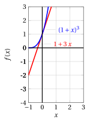
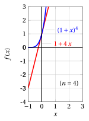

# Principle of mathematical induction

**Part 1 · Numbers and logic · Chapter 8** · lecture notes by Fabio Furini · [:material-file-pdf-box: Chapter PDF](../pdf/numbers-08-induction.pdf)

## 1. The principle of mathematical induction

- We now present a proof technique called proof by induction. This procedure can be applied to theorems with the following structure:

    “ for every $n \in \N$, $n \ge n_0$, property $p (n)$ holds ”

- The number $n_0$ is the smallest integer for which we want the property to be true; if $n_0 = 0$ the theorem simply states that the property is true for every $n \in \N$.

    !!! chiave ""

        A proof by induction consists of the following two steps:

        1. We prove that $p (n)$ is true for $n = n_0$ (<strong>base case of the induction</strong>).

        2. We prove that, if n is an arbitrary natural number $\ge n_0$, the fact that $p(n)$ is true implies that $p( n + 1)$ is true (<strong>inductive step</strong>).

        We can then conclude that for every $n \ge n_0$, $p (n)$ is true.

- The validity of this proof technique, <em>intuitively</em>, is based on the following fact:

    1. By point 1, we know that $p (n_0)$ is true. Suppose for example $n_0 = 1$: we therefore know that $p(1)$ is true (this must be proved explicitly).

    2. By point $2$, since $p(1)$ is true, $p (2)$ will be true: indeed, we have proved that for any $n$, if $p ( n)$ is true then $p ( n + 1)$ is also true. But then, since $p (2)$ is true, $p (3)$ will be true; but then $p (4)$ is true, … and so on, hence $p (n)$ is true for every $n \ge 1$.

- In practice, the proof consists of two phases.

    1. Prove $p (n_0)$ directly;

    2. Assume $p (n)$ as a hypothesis (<strong>inductive hypothesis</strong>) and prove $p (n + 1)$.

- This is the delicate point, often subject to misunderstandings. “Assuming as a hypothesis” $p (n)$ does not mean assuming the thesis as a hypothesis. What must be proved is that:

    “ for every $n \ge n_0$, if $p( n)$ is true then $p (n + 1)$ is also true ”

    and not

    “ if $p (n)$ is true for every $n$, then $p (n + 1)$ is also true”

## 2. Proofs based on the principle of mathematical induction

### 2.1 Bernoulli's inequality

!!! osservazione "Remark 1: Bernoulli's inequality"

    For every integer $n \ge 0$, $x \in \R$, $x \ge -1$, we have:

    \begin{equation}
    \label{BERNOULLI}
    (1+x)^n \ge 1 + n\: x
    \end{equation}

??? dimostrazione "Proof"

    By induction on $n$.

    - <strong>Base case of the induction</strong>

        Let $n = 0$. Then the statement becomes:

        $$
        (1+x)^0 \ge 1 + 0\: x \text{ ~~ i.e.  ~~} 1 \ge 1
        $$

        which is clearly true.

    - <strong>Inductive step</strong>

        Suppose it is true for $n$, and let us prove it for $(n + 1)$. By the inductive hypothesis, we have:

        $$
        (1+x)^n \ge 1 + n\: x
        $$

        and moreover we have

        $$
        (1+x) \ge 0 {\rm~~~since~~~} x \ge -1.
        $$

        Then we can write:

        \begin{align*}
        (1+x)^{n+1} &= (1+x) \cdot (1+x)^{n} \\[2ex] 
         &\ge (1+x) \cdot  (1 + n\: x)  \\[2ex]
         &= 1 + (n+1)\: x + n\: x^2 \\[2ex] 
         &\ge 1 + (n+1) \: x
        \end{align*}

        where in the last inequality we used the fact that $n\:x^2 \ge 0$.

        The chain of inequalities shows that, for $n + 1$, we have

        $$
        (1 + x)^{n+1} \ge 1 + (n + 1) \: x
        $$

        which is exactly the desired statement, for $n + 1$.

    
□

!!! esempio "Example 1: Bernoulli's inequality"

    

    { .fig .ovale loading=lazy style="width:91%" }

    { .fig .ovale loading=lazy style="width:91%" }

    

    

    { .fig .ovale loading=lazy style="width:91%" }

    { .fig .ovale loading=lazy style="width:91%" }

    

### 2.2 Some important summations

!!! osservazione "Remark 2: sum of the first $n$ natural numbers"

    For every integer $n \ge 1$, we have:

    $$
    \sum_{k=1}^{n} k = \frac{n \: (n+1)}{2}
    $$

??? dimostrazione "Proof"

    By induction on $n$.

    - <strong>Base case of the induction</strong>

        Let $n = 1$. Then the statement becomes:

        $$
        \sum_{k=1}^1 k = \frac{1\:(1+1)}{2} \text{ ~~ i.e.  ~~} 1 = 1
        $$

        which is clearly true.

    - <strong>Inductive step</strong>

        Suppose it is true for $n$, and let us prove it for $(n + 1)$. By the inductive hypothesis, we have:

        $$
        \sum_{k=1}^n k = \frac{n\:(n+1)}{2}.
        $$

        Hence we can write:

        \begin{align*}
        \sum_{k=1}^{n+1} k &= \sum_{k=1}^{n} k + (n+1) \\[2ex]
        &=  \frac{n\:(n+1)}{2} + (n+1) \\[2ex]
        &=  \frac{n\:(n+1) + 2\:(n+1)}{2} \\[2ex]
        & =  \frac{(n+1)\:( n  + 2 )}{2}  =  \frac{(n+1)\:\big(( n+1) +1\big)}{2}
        \end{align*}

        which is exactly the desired statement, for $n + 1$.

    
□

### 2.3 Sum of the terms of the geometric progression

!!! osservazione "Remark 3: sum of the first $n$ terms of the geometric progression ($a=1$)"

    Given $q \in\ \R_+$, for every integer $n \ge 1$ we have:

    \begin{equation}
    \label{GEOM}
    \sum_{k=1}^{n} q^{k-1} = 
    \begin{cases}
    \frac{q^{n}-1}{q-1} & {\rm ~~~if~~~~}  q \neq 1\\[2ex]
    n & {\rm ~~~otherwise} 
    \end{cases}
    \end{equation}

??? dimostrazione "Proof"

    By induction on $n$.

    - <strong>Base case of the induction</strong>

        Let $n = 1$. Then the statement becomes:

        $$
        \sum_{k=1}^{1} q^{k-1}  = \frac{q^1-1}{q-1} \text{ ~~ i.e.  ~~} 1 = 1
        $$

        which is clearly true.

    - <strong>Inductive step</strong>

        Suppose it is true for $n$, and let us prove it for $(n + 1)$. By the inductive hypothesis, we have:

        $$
        \sum_{k=1}^{n} q^{k-1} = \frac{q^n-1}{q-1}
        $$

        Hence we can write

        \begin{align*}
        \sum_{k=1}^{n+1} q^{k-1}&= \sum_{k=1}^{n} q^{k-1} + q^n =  \frac{q^n-1}{q-1} + q^n\\[2ex]
        & =  \frac{q^n-1+q^{n+1}-q^n}{q-1} =  \frac{q^{n+1}-1}{q-1}
        \end{align*}

        which is exactly the desired statement, for $n + 1$.

    
□

