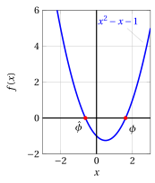
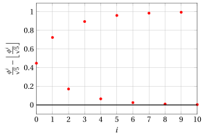
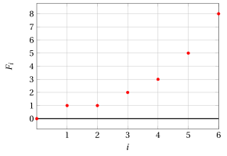

# The Fibonacci sequence

**Part 1 · Numbers and logic · Chapter 10** · lecture notes by Fabio Furini · [:material-file-pdf-box: Lecture notes, volume (PDF)](../pdf/lecture-notes-1-numbers.pdf) · [:material-presentation: Slides (PDF)](../pdf/slides-numbers-10-fibonacci.pdf)

## 1. The Fibonacci sequence

!!! definizione "Definition 1: Fibonacci sequence"

    \begin{align}
    F_0&=0, \nonumber\\
    F_1&=1, \nonumber\\
    F_i&=F_{i-1}+F_{i-2}, {\rm~~~~~with~~} i\ge2, i\in \N \label{fibonacci}
    \end{align}

- Therefore, each Fibonacci number is the sum of the two previous ones, which gives the sequence

    $$
    0, 1, 1, 2, 3, 5, 8, 13, 21, 34, 55, \dots
    $$

- The Fibonacci sequence is related to the  <strong>golden ratio</strong> $\phi$ and to the <strong>conjugate of the golden ratio</strong> $\hat \phi$,

!!! definizione "Definition 2: golden ratio"

    The <strong>golden ratio</strong> $\phi$ and the <strong>conjugate of the golden ratio</strong> $\hat \phi$ are the two roots of the equation:

    $$
    x^2 = x +1
    $$

    and are given by the formulas:

    \begin{align*}
    \phi & = \frac{1 + \sqrt{5}}{2} & \hat \phi & = \frac{1 - \sqrt{5}}{2}\\
         & \approx 1.61803 &  &\approx -0.61803
    \end{align*}

The following figure shows the graph of the function $f(x)=x^2-x-1$ on the interval $[-3,3]$; the red dots correspond to the roots of the equation  $x^2 = x +1$.

{ .fig .ovale loading=lazy style="width:61%" }

The golden ratio $\phi$ and the conjugate of the golden ratio  $\hat{\phi}$ clearly satisfy the equation $x^2 = x +1$ since:

$$
\phi^2 = \left(\frac{1 + \sqrt{5}}{2}\right)^2 = \frac{1 + 2\: \sqrt{5} +5}{4} = \frac{3 + \sqrt{5}}{2} = \frac{1 + \sqrt{5}}{2} +1 = \phi +1
$$

$$
\hat{\phi}^2 = \left(\frac{1 - \sqrt{5}}{2}\right)^2 =  \frac{1 - 2\: \sqrt{5} +5}{4} =  \frac{3 - \sqrt{5}}{2} =  \frac{1 - \sqrt{5}}{2} +1 = \hat \phi +1
$$

!!! osservazione "Remark 1"

    \begin{align*}
    F_i & = \frac{\phi^i - \hat{\phi}^i }{\sqrt{5}}, \qquad  \qquad i=0,1,2,\dots
    \end{align*}

??? dimostrazione "Proof"

    By induction on $i$.

    - <strong>Base case of the induction</strong>

        We prove that the formula holds for $i = 0$ and $i = 1$:

        $$
        F_0  = \frac{\phi^0 - \hat{\phi}^0 }{\sqrt{5}} = \frac{1 - 1 }{\sqrt{5}} =0,  \qquad
        F_1  = \frac{\phi^1 - \hat{\phi}^1 }{\sqrt{5}} = \frac{\sqrt{5}}{\sqrt{5}} = 1.
        $$

    - <strong>Inductive step</strong>

        Suppose it is true for $i = k$ and $i = k - 1$ with $k \ge 1$, and let us prove it for $i = k + 1$. By the definition of the Fibonacci sequence, we have $F_{k+1}  = F_{k} + F_{k-1}$, while by the inductive hypothesis we have:

        $$
        F_{k}  = \frac{\phi^k - \hat{\phi}^k }{\sqrt{5}} {\rm ~~~~~and~~~~~} F_{k-1}  = \frac{\phi^{k-1} - \hat{\phi}^{k-1} }{\sqrt{5}}
        $$

        Hence we can write

        \begin{align*}
        F_{k+1} & = F_{k} + F_{k-1} \\[2ex]
        & = \frac{\phi^k - \hat{\phi}^k }{\sqrt{5}} + \frac{\phi^{k-1} - \hat{\phi}^{k-1} }{\sqrt{5}}  = \frac{\big(\phi^k - \hat{\phi}^k\big) + \big(\phi^{k-1} - \hat{\phi}^{k-1}\big)}{\sqrt{5}}\\[2ex]
        & = \frac{\big(\phi^k + \phi^{k-1}\big) - \big(\hat{\phi}^k  + \hat{\phi}^{k-1}\big)}{\sqrt{5}}
         = \frac{\phi^{k-1} \big(\phi + 1\big) - \hat{\phi}^{k-1} \big(\hat{\phi}  + 1\big)}{\sqrt{5}}\\[2ex]
        & = \frac{\phi^{k-1} \big(\phi^2\big) - \hat{\phi}^{k-1} \big(\hat{\phi}^2\big)}{\sqrt{5}} = \frac{\phi^{k+1} - \hat{\phi}^{k+1}}{\sqrt{5}}
        \end{align*}

        which is exactly the desired statement, for $i= k + 1$.

    
□

!!! osservazione "Remark 2"

    \begin{align*}
    F_i & = \left\lfloor \frac{{\phi}^i}{\sqrt{5}} + \frac{1}{2} \right\rfloor, \qquad  \qquad i=0,1,2,\dots
    \end{align*}

??? dimostrazione "Proof"

    Since $|\hat{\phi}| < 1$, we have

    \begin{align*}
    \frac{|\hat{\phi}^i|}{\sqrt{5}} \le \frac{1}{\sqrt{5}} < \frac{1}{2}  
    {\rm  ~~~~~~and~~~~~~} -\frac{1}{2} < \frac{\hat{\phi}^i}{\sqrt{5}} <  \frac{1}{2}   , \qquad  \qquad i=0,1,2,\dots
    \end{align*}

    Since $F_i \in \N$ and $F_i  = \frac{\phi^i  }{\sqrt{5}} - \frac{ \hat{\phi}^i }{\sqrt{5}}$, the  $i$-th Fibonacci number $F_i$ is equal to $\frac{{\phi}^i}{\sqrt{5}}$ rounded to the nearest integer:

    $$
    F_i  = \left\lfloor \frac{{\phi}^i}{\sqrt{5}} + \frac{1}{2} \right\rfloor, \qquad  \qquad i=0,1,2,\dots
    $$

    
□

- The values of

    $$
    \frac{\hat{\phi}^i}{\sqrt{5}} {\rm ~~with~~} i=0,1,\dots,10 {\rm ~~are:~~}
    $$

    { .fig .ovale loading=lazy style="width:60%" }

- The values of

    $$
    \frac{{\phi}^i}{\sqrt{5}} - \left\lfloor \frac{{\phi}^i}{\sqrt{5}} \right\rfloor {\rm ~~with~~} i=0,1,\dots,10 {\rm ~~are:~~}
    $$

    { .fig .ovale loading=lazy style="width:60%" }

- Since $F_i \in \N$, we moreover have:

    $$
    \left( \frac{{\phi}^i}{\sqrt{5}} - \left\lfloor \frac{{\phi}^i}{\sqrt{5}} \right\rfloor \right) - \frac{\hat{\phi}^i}{\sqrt{5}} \in \{0,1\}, \qquad  \qquad i=0,1,2,\dots
    $$

- The values of $F_i$, with $i=0,1,\dots,10$, are:

    { .fig .ovale loading=lazy style="width:60%" }
