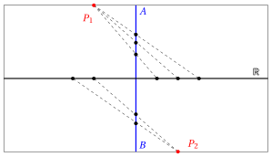

# Cardinality of infinite sets

**Part 1 · Numbers and logic · Chapter 11** · lecture notes by Fabio Furini · [:material-file-pdf-box: Lecture notes, volume (PDF)](../pdf/lecture-notes-1-numbers.pdf) · [:material-presentation: Slides (PDF)](../pdf/slides-numbers-11-infinite-sets.pdf)

## 1. Countable cardinality

!!! chiave ""

    Is it possible to compare the “size” of infinite sets?

- Let us approach the question starting from the important number sets that we have introduced: $\N, \Z, \Q, \R$, and ask ourselves: how many elements does each of these sets have?

- Intuitively, the answer seems obvious: each of these sets has infinitely many elements; however, the rational numbers are more numerous than the integers, since $\Z \subset \Q$, and for the same reason the real numbers are more numerous than the rational numbers, since $\Q \subset \R$.

- How can we state, at the same time, that two sets are both infinite, but one is more numerous than the other?

!!! chiave ""

    How is it possible, in general,  to compare the size of infinite sets?

- To give meaning to these questions, even before being able to answer them, we must define what we mean by two sets having the same size.

- Abstracting from the experience of counting the elements of a finite set, the idea of <strong>same size</strong> has been identified with that of <strong>one-to-one correspondence</strong> (bijection):

!!! definizione "Definition 1: equal cardinality of two sets"

    Two sets $A$, $B$ are said to have <strong>equal cardinality</strong> (or power) if they can be put in one-to-one correspondence with each other, i.e., if there exists a rule that associates with each element of $A$ one and only one element of $B$, and vice versa.

- The cardinality (or power) of a set expresses the intuitive idea of size

!!! osservazione "Remark 1"

    The set of integers $~\Z$ and the set of natural numbers $~\N$ have the same cardinality

??? dimostrazione "Proof"

    The following rule puts the integers and the natural numbers in one-to-one correspondence:

    
<table>
    <tr>
    <td>\(\Z\)</td>
    <td>0</td>
    <td>1</td>
    <td>\-1</td>
    <td>2</td>
    <td>\- 2</td>
    <td>…</td>
    <td>\(n\)</td>
    <td>\(-n\)</td>
    <td>…</td>
    </tr>
    <tr>
    <td></td>
    <td>\(\updownarrow\)</td>
    <td>\(\updownarrow\)</td>
    <td>\(\updownarrow\)</td>
    <td>\(\updownarrow\)</td>
    <td>\(\updownarrow\)</td>
    <td></td>
    <td>\(\updownarrow\)</td>
    <td>\(\updownarrow\)</td>
    </tr>
    <tr>
    <td>\(\N\)</td>
    <td>0</td>
    <td>1</td>
    <td>2</td>
    <td>3</td>
    <td>4</td>
    <td>…</td>
    <td>\(2\:n-1\)</td>
    <td>\(2\:n\)</td>
    <td>…</td>
    <td></td>
    </tr>
    </table>
 □

- Therefore, even though from the point of view of inclusion $\Z$ has “more elements” than $\N$ (in the sense that it has all the elements of $\N$ plus others), the two sets have the same cardinality.

!!! chiave ""

    Two sets that have the same cardinality are also called <strong>equipotent</strong> and should be thought of as equally numerous.

!!! definizione "Definition 2: countable set"

    A set that has the same cardinality as $\N$ is called <strong>countable</strong>.

- The term countable indicates that the elements of the set can be enumerated, that is, arranged in a numbered list (place 1, place 2, place 3, … )

!!! chiave ""

    The cardinality of $\N$ is called the <strong>cardinality of the countable</strong> (countable infinity).

!!! teorema "Theorem 1"

    The set $\Q$ is countable

??? dimostrazione "Proof"

    - We begin by proving that the set of positive rational numbers is countable.

    - To do this, we represent the positive rational numbers as fractions $n/m$, with $n$, $m$ positive integers, and we arrange these fractions in an <strong>infinite triangular table</strong>, in the following way:

        
<table>
        <tr>
        <td>\(\frac{n}{m}\), with \(n+m=\dots\)</td>
        <td></td>
        <td></td>
        <td></td>
        <td></td>
        </tr>
        <tr>
        <td>2</td>
        <td>\(\frac{1}{1}\)</td>
        <td></td>
        <td></td>
        <td></td>
        </tr>
        <tr>
        <td>3</td>
        <td>\(\frac{1}{2}\)</td>
        <td>\(\frac{2}{1}\)</td>
        <td></td>
        <td></td>
        </tr>
        <tr>
        <td>4</td>
        <td>\(\frac{1}{3}\)</td>
        <td>\(\frac{2}{2}\)</td>
        <td>\(\frac{3}{1}\)</td>
        <td></td>
        </tr>
        <tr>
        <td>5</td>
        <td>\(\frac{1}{4}\)</td>
        <td>\(\frac{2}{3}\)</td>
        <td>\(\frac{3}{2}\)</td>
        <td>\(\frac{4}{1}\)</td>
        </tr>
        <tr>
        <td>…</td>
        <td>…</td>
        <td></td>
        <td></td>
        <td></td>
        </tr>
        </table>

        Note that: all the fractions representing positive rational numbers appear in this table at least once; some numbers are repeated several times (e.g., $\frac{1}{1} = \frac{2}{2}$). Each row has finite length.

    - Hence we can put $\N$ in one-to-one correspondence with the set of positive rationals, by going through the table row by row (and skipping an element when it is equal to one already encountered). For example:

        
<table>
        <tr>
        <td>1</td>
        <td>2</td>
        <td>3</td>
        <td>4</td>
        <td>5</td>
        <td>6</td>
        <td>7</td>
        <td>8</td>
        <td>9</td>
        <td>…</td>
        </tr>
        <tr>
        <td>\(\frac{1}{1}\)</td>
        <td>\(\frac{1}{2}\)</td>
        <td>\(\frac{2}{1}\)</td>
        <td>\(\frac{1}{3}\)</td>
        <td>\(\frac{3}{1}\)</td>
        <td>\(\frac{1}{4}\)</td>
        <td>\(\frac{2}{3}\)</td>
        <td>\(\frac{3}{2}\)</td>
        <td>\(\frac{4}{1}\)</td>
        <td>…</td>
        </tr>
        </table>

        (note that we skipped $\frac{2}{2}$ because it is equal to $\frac{1}{1}$, already encountered).

    - This proves that the set of positive rationals is countable.

    - Then $\Q$ is also countable, and this can be proved with an argument similar to the one we used to prove that $\Z$ is countable: denoting by $q_1, q_2, q_3, \dots$ the positive rationals, we set:

        
<table>
        <tr>
        <td>\(\N\)</td>
        <td>0</td>
        <td>1</td>
        <td>2</td>
        <td>3</td>
        <td>4</td>
        <td>5</td>
        <td>6</td>
        <td>…</td>
        </tr>
        <tr>
        <td></td>
        <td>\(\updownarrow\)</td>
        <td>\(\updownarrow\)</td>
        <td>\(\updownarrow\)</td>
        <td>\(\updownarrow\)</td>
        <td>\(\updownarrow\)</td>
        <td>\(\updownarrow\)</td>
        <td>\(\updownarrow\)</td>
        <td></td>
        </tr>
        <tr>
        <td>\(\Q\)</td>
        <td>0</td>
        <td>\(q_1\)</td>
        <td>\(-q_1\)</td>
        <td>\(q_2\)</td>
        <td>\(-q_2\)</td>
        <td>\(q_3\)</td>
        <td>\(-q_3\)</td>
        <td>…</td>
        <td></td>
        </tr>
        </table>

        which gives a one-to-one correspondence between $\N$ and $\Q$.

    
□

- Having discovered that several infinite sets, each properly contained in the next $(\N, \Z, \Q)$, have the same cardinality, might suggest that this is true for all infinite sets. This is not true, as shown in the next section.

## 2. Cardinality of the continuum

!!! teorema "Theorem 2"

    The set of real numbers $~\R$ is not countable

- The proof technique is called <strong>Cantor's diagonal argument</strong>

??? dimostrazione "Proof"

    - We will prove that the interval $[0, 1]$  has uncountable cardinality,  from which the uncountability of $\R$ obviously follows

    - Suppose therefore, <strong>by contradiction</strong>, that $[0, 1]$ is countable, and arrange <strong>all</strong> the real numbers of the interval $[0 , 1]$ in a list $r_1 , r_2, r_3, \dots$

    - We write each number $r_i$ in decimal form:

        $$
        0.a_1 a_2 a_3 \dots
        $$

        where the $a_i$ are digits from $0$ to $9$; if the digits are all zero we have $r_i =0$ and if they are all nine we have $r_i = 0.\overline{9}  = 1$):

        \begin{align*}
        r_1=&0.a_{11} a_{12} a_{13} \dots \\
        r_2=&0.a_{21} a_{22} a_{23} \dots \\
        r_3=&0.a_{31} a_{32} a_{33} \dots \\
        \dots
        \end{align*}

    - We now define the following decimal number:

        $$
        r=0.b_1 b_2 b_3 \dots
        $$

        where the digits $b_i$ are defined by the following rule:

        $$
        b_i =
        \begin{cases}
        5 & {\rm if~~} a_{ii} {\rm ~~is~one~of~the~digits~~} 0, 1, 2, 3 {\rm ~~or~~} 4\\
        4 & {\rm if~~} a_{ii} {\rm ~~is~one~of~the~digits~~} 5, 6, 7, 8 {\rm ~~or~~} 9\\
        \end{cases}
        $$

        With this definition we have $b_i \neq a_{ii}$ for every $i$. Note that the number $r$ has been constructed by reasoning on the diagonal of the infinite table whose rows are the numbers $r_i$, hence the name of the argument.

    
□

??? dimostrazione "Proof"

    - We now observe that $r$ is a real number belonging to the interval $[0, 1]$ (because it is of the form $0.b_1 b_2b_3 \dots$ with all digits equal to 4 or 5) and on the other hand it is not equal to any of the numbers $r_i$ in the list, since:

        - **$\rightarrow$** $r \neq r_1$: the first digit of $r$ is different from the first digit of $r_1$ ($b_1 \neq a_{11})$;

        - **$\rightarrow$** $r \neq r_2$: the second digit of $r$ is different from the second digit of $r_2$ ($b_2 \neq a_{22})$;

        - **$\rightarrow$** …

    - But this leads to a <strong>contradiction</strong>, since we had assumed that the $r_i$ completely exhausted the set of real numbers of the interval $[0, 1]$. Therefore $[0, 1]$ is not countable.

    
□

!!! chiave ""

    Since $\N$ cannot be put in one-to-one correspondence with $\R$, but it can be put in one-to-one correspondence with a proper subset of $\R$ ($\N$ itself!), we say that $\N$ has <strong>smaller cardinality</strong> than $\R$.

- We also note that the interval $[0, 1]$, and any interval of $\R$ (open or closed, bounded or unbounded), has the same cardinality as $\R$.

- This fact can be proved, for example, with an elementary geometric construction that gives a one-to-one correspondence between the points of the line and those of a segment $[A,B]$; as shown in  the following figure, by drawing suitable segments from the two fixed points $P_1$ , $P_2$ to the line itself:

    { .fig .ovale loading=lazy style="width:80%" }

- This implies that, for example, the points of a line have the same cardinality as the points of a segment.

!!! chiave ""

    The cardinality of $\R$ is called the <strong>cardinality of the continuum</strong>.

- It is not only every interval of $\R$ that has this same cardinality. It can be proved that the same holds for the plane, for three-dimensional space and for their “continuous” subsets: for example, a plane and a sphere both have the cardinality of the continuum.

- So far we have encountered only two hierarchical levels of infinity: the cardinality of the countable and that of the continuum. One should not believe that only these two exist! For example, the set of all subsets of $\R$ (its power set) is even more numerous than $\R$; and with this procedure we can always construct a set more numerous than a given set.

- Therefore the hierarchical levels of infinite cardinalities are themselves infinite.
