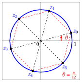
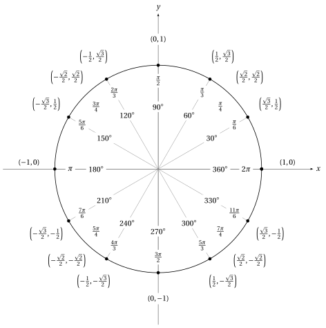

# Complex numbers

**Part 1 · Numbers and logic · Chapter 12** · lecture notes by Fabio Furini · [:material-file-pdf-box: Chapter PDF](../pdf/numbers-12-complex-numbers.pdf)

## 1. Definition of $\C$ and field structure

- We have denoted by $\R^2$ (short for $\R \times \R$) the set of ordered pairs $(a, b)$ of real numbers.

- On these pairs we directly define the operations of sum and product with the following rules:

    !!! chiave ""

        \begin{align}
        \label{OP1}(a, b) + (c, d) &= (a+ c, b + d)\\[2ex]
        \label{OP2}(a, b) \cdot (c, d) &= (ac - bd, ad+ bc)
        \end{align}

    

    !!! esempio "Example 1: sum"

        { .fig .ovale loading=lazy style="width:42%" }

    

    !!! esempio "Example 2: product"

        { .fig .ovale loading=lazy style="width:42%" }

- This “sum” and this “product” satisfy the <strong>commutative</strong>, <strong>associative</strong> and <strong>distributive</strong> properties

- We also observe that, $\forall (a, b) \in \R^2$:

    $$
    (a, b) + (0, 0) = (0, 0) + (a, b) = (a, b)
    $$

    hence the pair $(0, 0)$ is the <strong>identity element for the sum</strong>. Moreover:

    $$
    (a, b) \cdot  (1, 0) = (1, 0) \cdot (a, b) = (a, b)
    $$

    hence the pair $(1, 0)$ is the <strong>identity element for the product</strong>. We have:

    $$
    (a,b) + (-a,-b)= (0,0)
    $$

    hence $(-a , -b)$ is the <strong>opposite</strong> of $(a, b)$. Moreover, if $(a,b) \neq (0,0)$ then:

    $$
    (a,b) \cdot \left(\frac{a}{a^2+b^2}~,~\frac{-b}{a^2+b^2} \right)= (1,0)
    $$

    hence the pair $(a/(a^2 + b^2 ) , -b/(a^2 + b^2 ))$ is the <strong>reciprocal</strong> of $(a, b)$.

!!! definizione "Definition 1: field of complex numbers"

    Properties $R_1$, $R_2$  are satisfied by the sum and the product defined above, and therefore the set $\R^2$ with this structure is a field, which we will call the <strong>field of complex numbers</strong> and denote by $\C$

- We now observe that $\C$ contains the subset $\C_0$ of pairs of the form $(a,0)$; it is a subfield of $\C$, since the sum and product of pairs of this form are again pairs of the same form; indeed we have:

    $$
    (a,0) + (b,0) =(a+b,0) {\rm ~~~and~~~} (a,0) \cdot (b,0) =(a \cdot b,0)
    $$

    Moreover, $\C_0$ can be ordered by setting $(a, 0) < (b, 0)$ if $a <b$.

- If we then put the set of real numbers $\R$ in one-to-one correspondence with $\C_0$, by setting

    $$
    (a,0) \longleftrightarrow a
    $$

    we can identify the real numbers $a \in \R$ with the complex numbers of the form $(a, 0) \in \R^2$. In this sense the field of complex numbers $\C$ is an <strong>extension</strong> of the field of real numbers $\R$.

!!! chiave ""

    Let us now consider the number $(0, 1) \in \C$. It has the remarkable property that:

    $$
    (0,1) \cdot (0,1) = (-1,0)
    $$

    i.e., its square coincides with the real number $-1$

!!! definizione "Definition 2: imaginary unit"

    The pair $(0, 1) \in \C$ is denoted by the letter “$i$” and is called the <strong>imaginary unit</strong>

## 2. Algebraic form of complex numbers

!!! chiave ""

    We observe that, if we write any complex number $(c, 0)$ simply as  $c$, we have:

    $$
    (a,b)
    =
    (a, 0) + \underbrace{(0,1)}_{=i} \cdot (b, 0)
    =
    a+ib
    $$

    With this notation, rules \(\eqref{OP1}\) and \(\eqref{OP2}\)  are the ordinary rules of algebraic calculation, keeping in mind that $i^2 = - 1$:

    \begin{align}
    \label{OP3}(a + ib) + (c + id) &= (a+ c) + i (b + d)\\[2ex]
    \label{OP4}(a + ib) \cdot (c + id) &= (ac - bd) + i (ad + bc)
    \end{align}

!!! definizione "Definition 3: algebraic form, real part and imaginary part"

    The expression:

    \begin{equation}
    \label{FA} z= a + i b
    \end{equation}

    is called the<strong> algebraic form of complex numbers</strong>; $a$ is called the <strong>real part</strong> of $z$ and is denoted by $\Re(z)$ (or Re($z$)) while $b$ is called the <strong>imaginary part</strong> and is denoted by $\Im(z)$ (or Im($z$)).

<strong>Complex plane</strong>

- In a Cartesian plane, the complex numbers $a+ib$ can be represented as points with coordinates $(a, b)$. In this context:

    - the plane is called the <strong>complex plane</strong> or <strong>Gauss plane</strong>

    - the $x$, $y$ axes are called the <strong>real axis</strong> and the <strong>imaginary axis</strong>

    - the points on the real axis are the <strong>real numbers</strong>

    - the points on the imaginary axis are the <strong>purely imaginary numbers</strong> (i.e., of the form $ib$)

- The <strong>sum of two complex numbers</strong> is the complex number whose coordinates are the sums of the coordinates: the geometric meaning of this fact is that the point $z + t$ is constructed from the points $z$, $t$ according to the “<strong>parallelogram rule</strong>”, illustrated in the following figure:

{ .fig .ovale loading=lazy style="width:61%" }

!!! osservazione "Remark 1"

    The set of complex numbers $~\C$ is not an ordered field

??? dimostrazione "Proof"

    - We have seen that $\C$ satisfies the field axioms; however, it does not satisfy those of an ordered field, that is, it is not possible to define a relation $\le$ between complex numbers in such a way that properties  $R3$ hold

    - It can be proved that properties $R3$ imply that the square of any number is never negative, and on the other hand, if a number is positive its opposite is negative. Now, in $\C$ we have:

        $$
        1^2 = 1 {\rm ~~~and ~~~} i^2=-1
        $$

        We therefore have two squares, each the opposite of the other. Neither of them, however, can be negative (because they are squares), and this is absurd (because between $a$ and $- a$ one must be negative, if $a\neq 0$). We conclude that $\C$ is not an ordered field.

    
□

!!! definizione "Definition 4: conjugate"

    The complex number $a - ib$ is called the <strong>complex conjugate</strong> of $z = a + ib$ and is denoted by $\overline{z}$.

!!! chiave ""

    We have:

    \begin{align}
    \label{OP100}z + \overline{z} &= 2a = (a+ib) +(a-ib)=2a=2\;\Re(z) \\[2ex]
    \label{OP200}z - \overline{z} &= 2ib = (a+ib) -(a-ib)= 2ib=2i\;\Im(z) \\[2ex] 
    \label{OP300} z \cdot \overline{z} &= (a+ib) \cdot (a-ib) = a^2 -aib + iba - \underbrace{i^2}_{=-1}b^2= a^2 + b^2 \ge 0
    \end{align}

- The conjugation operation has the following elementary properties with respect to sum and product:

    \begin{align}
    \overline{(z_1+z_2)} &= \overline{z}_1 + \overline{z}_2 \\[2ex]
     \overline{(z_1 \cdot z_2)} &= \overline{z}_1 \cdot \overline{z}_2 \\[2ex]
     \overline{\left(\frac{1}{z}\right)} &= \frac{1}{\overline{z}}
    \end{align}

!!! definizione "Definition 5: modulus"

    The <strong>modulus</strong> of $z = a+ ib$ is the non-negative real number $\sqrt{a^2 + b^2}$; it is denoted by $|z|$.

- If $z = a$ is real, its modulus is called the absolute value and is still denoted by $|a|$. The following properties hold:

    1. $|z| = 0 \Longleftrightarrow z=0, {\rm ~~moreover~~} |z| \ge 0$

    2. $|z| = |\overline{z}|$

    3. $\Re(z) \le |z| ~~~~ \Im(z) \le |z| ~~~~ |z|  \le |\Re(z)| + |\Im(z)|$

    4. $|z_1 + z_2| \le |z_1| + |z_2| ~~~~$ <strong>triangle inequality</strong>

    5. $|z_1 + z_2| \ge \big| |z_1| - |z_2| \big| ~~~~$

- Properties a), b) , c) are immediately verified.

??? dimostrazione "Proof"

    - Let us prove properties d) and  e). They are equivalent to the following:

        $$
        (|z_1| - |z_2|)^2 ~~\le~~ |z_1 + z_2|^2 ~~\le~~ (|z_1| + |z_2|)^2
        $$

    - Setting $z_1 = a + ib$, $z_2 = c + id$ we obtain:

        \begin{align*}
        |z_1 + z_2|^2 &= \big| (a + ib) +  (c + id)\big|^2\\[2ex]
        &= \big| (a + c) +  i(b+d) \big|^2\\[2ex]
        &= \left(\sqrt{(a + c)^2+(b + d)^2}\right)^2=(a+c)^2 + (b+d)^2
        \end{align*}

        and hence we have:

        $$
        \underbrace{\left(\sqrt{a^2+b^2} - \sqrt{c^2+d^2}\right)^2}_{=(a^2+b^2)+(c^2+d^2)-2\:\sqrt{a^2+b^2} \cdot \sqrt{c^2+d^2} } ~~\le~~ \underbrace{(a+c)^2 + (b+d)^2}_{=a^2+2ac+c^2+b^2+2bd+d^2} ~~\le~~  \underbrace{\left(\sqrt{a^2+b^2} + \sqrt{c^2+d^2}\right)^2}_{=(a^2+b^2)+(c^2+d^2)+2\:\sqrt{a^2+b^2} \cdot \sqrt{c^2+d^2} }
        $$

        After simplification, this double inequality reduces to:

        $$
        -\sqrt{a^2+b^2} \cdot \sqrt{c^2+d^2} ~~\le~~ ac+bd ~~\le~~  \sqrt{a^2+b^2} \cdot \sqrt{c^2+d^2}
        $$

        which is equivalent to the following:

        $$
        |ac + db | ~\le~ \sqrt{a^2+b^2} \cdot \sqrt{c^2+d^2}
        $$

        Squaring both sides we arrive at:

        $$
        \underbrace{\big(ac + db\big)^2}_{=a^2c^2+d^2b^2+2acbd} ~\le~ \underbrace{\left(a^2+b^2\right) \cdot \left(c^2+d^2\right)}_{=a^2c^2+a^2d^2+b^2c^2+b^2d^2}
        $$

        that is,

        $$
        0 ~~\le~~ - 2acbd + a^2d^2 + b^2 c^2 ~~=~~ \big(ad-bc\big)^2
        $$

        which is true for every $a, b, c, d \in \R$.

    
□

- Geometrically, $|z|$ represents the distance of the point (or complex number) $z$ from the origin; $|z_1 - z_2|$ represents the distance between the two points $z_1$ and $z_2$; inequalities d) and e) express the well-known theorem on the <strong>lengths of the sides of a triangle</strong>[^1]:

{ .fig .ovale loading=lazy style="width:61%" }

- Using the concepts just introduced, we can write the quotient of two complex numbers in algebraic form:

    $$
    \frac{a+ib}{c+id}
    $$

    it suffices to multiply the numerator and the denominator by $c-id$, and we obtain:

    $$
    \frac{a+ib}{c+id} = \frac{(a+ib)(c-id)}{\underbrace{(c+id)(c-id)}_{=c^2+d^2}} = \frac{ac-aid+ibc-i^2bd}{c^2+d^2}= \frac{(ac+bd)}{c^2+d^2} + i \frac{(bc-ad)}{c^2+d^2}
    $$

### 2.1 Equations in the complex field

- Let us see how to solve an equation in the complex field, when it involves the unknown $z = x + iy$ also through $\Re(z)$, $\Im(z)$, $z$, $|z|$.

- We illustrate, with the following example, the procedure of transforming the equation in one complex unknown into a system of two equations in two real unknowns. The method consists in taking the real and imaginary parts of the equation.

!!! esempio "Example 3: equations in the complex field (algebraic method)"

    - We want to solve:

        $$
        z^2 + i \;\Im \;z + 2 \;\overline{z} =0
        $$

        We set $z = x + iy$, with $x$, $y$ real unknowns, and rewrite the equation:

        $$
        \begin{cases}
        z^2= (x + i\:y)^2 = x^2 - y^2 + 2\:i\:x\:y\\[2ex]
        i \;\Im\;z= i\:y\\[2ex]
        2 \;\overline{z}= 2\: (x - i\:y) = 2\: x - 2\:i\:y   
        \end{cases}
        $$

        Substituting, we therefore obtain:

        $$
        (x^2 - y^2 + 2\:i\:x\:y) + (i\:y) + (2\: x - 2\:i\:y) =0
        $$

    - Now, a complex number is zero if and only if its real part and imaginary part are zero. Therefore we separate the real part and the imaginary part of the left-hand side:

        $$
        (x^2 - y^2 + 2\:x) + i \:(2\: x\:y + y - 2\:y) =0
        $$

        and set both equal to zero:

        $$
        \begin{cases}
        x^2 - y^2 + 2\:x = 0\\[2ex]
        2\: x\:y - y = 0   
        \end{cases}
        $$

        We have thus transformed the equation in one complex unknown into a system of two equations in two real unknowns.

    - We solve the system. The second equation gives:

        $$
        y=0 {\rm ~~~~or~~~~} x= \frac{1}{2}
        $$

        1. For $y=0$ the first equation becomes

            $$
            x^2 + 2\:x = 0 {\rm ~~~which~gives~~~} x=0 {\rm ~~~~or~~~~} x= -2
            $$

        2. For $x=\frac{1}{2}$ the first equation becomes

            $$
            -y^2 + \frac{5}{4}= 0 {\rm ~~~which~gives~~~} y=\pm \frac{\sqrt{5}}{2}
            $$

    - Hence the equation has the following 4 solutions:

        $$
        z=0,~~~~~ z=-2,~~~~~z= \frac{1}{2} + i\:\frac{\sqrt{5}}{2},~~~~~z= \frac{1}{2} - i\:\frac{\sqrt{5}}{2}
        $$

    The method seen in this example can in principle be applied to any equation in $\C$, but a generic system of two equations in two unknowns is almost always impossible to solve algebraically.

## 3. Trigonometric form of complex numbers

- As is known from Geometry, the points of the plane can be identified not only by their Cartesian coordinates , but also by their <strong>polar coordinates</strong>:

    1. $\varrho$ $\rightarrow$ <strong>polar radius</strong>, i.e., the distance of the point from the origin

    2. $\vartheta$ $\rightarrow$ <strong>polar angle</strong>, i.e., the angle that the line joining the point to the origin forms with the positive $x$-axis, measured counterclockwise.

- Clearly, a pair $\varrho$ , $\vartheta$, with $\varrho > 0$, identifies a well-defined point of the plane; conversely, a point of the plane uniquely determines the coordinate $\varrho$, but the angle $\vartheta$, measured in radians, is determined only up to multiples of $2\:\pi$.

    { .fig .ovale loading=lazy style="width:61%" }

- Given a complex number $z$ , <strong>its modulus $|z|$ coincides with the polar radius</strong> $\varrho$ of the point representing it in the complex plane.

- We call <strong>argument</strong> of $z$, and denote by arg$(z)$, any of the angles $\vartheta$ associated with the point $z$. In this way the argument of $z$ is not uniquely determined. Often this indeterminacy does not cause any problem.  At other times, however, it is preferable to assign a well-defined argument to a complex number. This can be done in infinitely many ways, by fixing any interval of length $2\;\pi$ within which the angle $\vartheta$ is allowed to vary

- The intervals most commonly used for this purpose are $[0, 2\:\pi)$ and $(-\pi, \pi]$; the argument of $z$ is then called the <strong>principal argument</strong>.

    

    !!! esempio "Example 4: arguments of complex numbers"

        - the number $-i$ has argument $- \pi / 2$ or $3\pi / 2$ or any other value of the form $- \pi / 2 + 2\:k\:\pi$ with $k \in \Z$. Its principal argument will be $3\pi / 2$ if we adopt the convention $\vartheta \in [0, 2\:\pi)$, and $-\pi / 2$ with the convention $\vartheta \in (-\pi, \pi]$.

        - Positive real numbers have principal argument $0$ and negative ones $\pi$, with both conventions.

!!! chiave ""

    Given the number $z = a+ ib$, from trigonometry we immediately obtain the relations between the Cartesian coordinates $a$, $b$ and the polar ones $\varrho$, $\vartheta$:

    \begin{align}
    \label{POLARY1} a= \varrho \;\cos \;\vartheta~~~~ {\rm and}~~~~ b= \varrho \;\sin \;\vartheta
    \end{align}

    The inverse relations are:

    \begin{align}
    \label{POLARY2} \varrho= \sqrt{a^2+b^2},~~~~\cos \vartheta= \frac{a}{\sqrt{a^2+b^2}}~~~~~ {\rm and}~~~~ \sin \vartheta= \frac{b}{\sqrt{a^2+b^2}}
    \end{align}

!!! definizione "Definition 6: trigonometric form"

    A complex number $z = a+ ib$ can also be written in the form

    \begin{equation}
    \label{FT} z=  \varrho \; (\cos \; \vartheta + i \; \sin \; \vartheta)
    \end{equation}

    which is called the <strong>trigonometric form</strong> of complex numbers.

!!! esempio "Example 5: trigonometric form"

    Let us write the following complex number in trigonometric form:

    $$
    z= \sqrt{3} + i
    $$

    We have $\varrho=\sqrt{a^2+b^2}=\sqrt{3+1}=2$, hence:

    $$
    \sqrt{3} + i = 2\: \left( \frac{\sqrt{3}}{2} + i\: \frac{1}{2}\right)= 2\left(\cos \frac{\pi}{6} + i \: \sin \frac{\pi}{6} \right)
    $$

### 3.1 De Moivre's formulas

- The trigonometric form is convenient for expressing products and quotients of complex numbers. Indeed, if we have:

    $$
    z_1=  \varrho_1 \; (\cos \vartheta_1 + i \; \sin \vartheta_1) ~~~~~~ z_2=  \varrho_2 \; (\cos \vartheta_2 + i \; \sin \vartheta_2)
    $$

    for the <strong>product</strong> we obtain:

    \begin{align}
    z_1 z_2 & = \varrho_1\varrho_2 \cdot \bigg\{~~\cos \vartheta_1 \; \cos \vartheta_2 - \sin \vartheta_1 \; \sin \vartheta_2 + i ~~\big(\sin \vartheta_1  \cos \vartheta_2+ \cos \vartheta_1  \sin \vartheta_2\big)~~\bigg\} \nonumber \\[2ex] 
    & = \varrho_1\varrho_2 \cdot \bigg\{~~ \cos \big(\vartheta_1+\vartheta_2\big) + i ~~ \sin \big(\vartheta_1+\vartheta_2\big)~~\bigg\} \label{PPP}
    \end{align}

    for the <strong>quotient</strong>, if $z_2\neq0$, we have:

    $$
    \frac{z_1}{z_2} = \frac{\varrho_1}{\varrho_2} \cdot \frac{\cos \vartheta_1 + i \; \sin \vartheta_1}{\cos \vartheta_2 + i \; \sin \vartheta_2},
    $$

    multiplying numerator and denominator by $(\cos \; \vartheta_2 - i \; \sin \; \vartheta_2)$ and, taking into account that $( \cos \; \vartheta_2)^2 + (\sin \; \vartheta_2)^2 = 1$, we obtain:

    \begin{align}
    \frac{z_1}{z_2} & = \frac{\varrho_1}{\varrho_2} \cdot \bigg\{~~ (\cos \vartheta_1 + i \; \sin \vartheta_1) \cdot (\cos \vartheta_2 - i \sin \vartheta_2) ~~\bigg\} \nonumber \\[2ex] 
    & = \frac{\varrho_1}{\varrho_2} \cdot \bigg\{~~ \cos \big(\vartheta_1-\vartheta_2\big) + i ~~ \sin \big(\vartheta_1-\vartheta_2\big)~~\bigg\}
    \end{align}

- Therefore the modulus of the product and of the quotient of two complex numbers is, respec- tively, the product and the quotient of the moduli; the argument is, respectively, the sum and the difference of the arguments:

    !!! chiave ""

        \begin{align}
        |z_1 \cdot z_2| = |z_1|\cdot|z_2|~~~~{\rm and}  ~~~~{\rm arg}(z_1 \cdot z_2) = {\rm arg}(z_1)+{\rm arg}(z_2)\\[2ex]
        \left|\frac{z_1}{z_2}\right| = \frac{|z_1|}{|z_2|}~~~~{\rm and}  ~~~~{\rm arg}\left(\frac{z_1}{z_2}\right) = {\rm arg}(z_1) - {\rm arg}(z_2)
        \end{align}

- Formula \(\eqref{PPP}\) generalizes to the case of any number of factors $z_1, z_2,\dots, z_n$:

    \begin{align}
    z_1z_2 \dots z_n= \varrho_1\varrho_2\dots\varrho_n \cdot \bigg\{~~ \cos \big(\vartheta_1+\vartheta_2+\dots+\vartheta_n\big) + i ~~ \sin \big(\vartheta_1+\vartheta_2+\dots+\vartheta_n)~~\bigg\}
    \end{align}

    If, moreover, all the factors are equal, we obtain:

    \begin{align}
    z^n= \varrho^n \cdot \bigg\{~~ \cos \big(n\: \vartheta\big) + i ~~ \sin \big(n\: \vartheta)~~\bigg\}
    \end{align}

- These relations on products and quotients of complex numbers are known as De Moivre's formulas.

!!! esempio "Example 6: powers of complex numbers with De Moivre's formulas"

    Write in algebraic form:

    $$
    z= (1+i)^7
    $$

    We determine the modulus and argument of $(1 + i)$ and then apply De Moivre's formula.

    $$
    |1+i|=\sqrt{2}~~~~{\rm and}~~~~{\rm arg}(1+i)=\frac{\pi}{4} ~~~~~~~\left(\cos \vartheta=\frac{1}{\sqrt{2}},~~ \sin \vartheta=\frac{1}{\sqrt{2}} \right)
    $$

    Hence we have:

    $$
    |(1+i)^7|=\left(\sqrt{2}\right)^7 = 2^{\frac{7}{2}}= 2^{3+\frac{1}{2}} = 8\sqrt{2} ~~~~{\rm and}~~~~{\rm arg}(1+i)^7= \frac{7}{4} \: \pi
    $$

    Consequently:

    $$
    (1+i)^7= 8\sqrt{2} \left( \underbrace{\cos \frac{7}{4} \: \pi}_{=\frac{1}{\sqrt{2}}} + i \; \underbrace{\sin \frac{7}{4} \: \pi}_{=-\frac{1}{\sqrt{2}}} \right) = 8\sqrt{2} \left( \frac{1}{\sqrt{2}} - i \; \frac{1}{\sqrt{2}}\right) = 8 - 8i
    $$

!!! chiave ""

    - De Moivre's formulas allow us to give a geometric interpretation of the product of complex numbers.

    - Let $z$, to begin with, be a complex number with modulus $1$, hence of the form $( \cos \vartheta + i \sin \vartheta)$. Then, multiplying a number by $z$ means adding $\vartheta$ to its argument, i.e., performing a <strong>rotation by the angle</strong> $\vartheta$.

    - If $z$ has modulus $\varrho$ instead of 1, in addition to a rotation we perform a <strong>dilation by the factor</strong> $\varrho$.

!!! esempio "Example 7: geometric interpretation of the product of complex numbers"

    - multiplying by $i$ means performing a rotation by $\frac{\pi}{2}$;

    - multiplying by $- 1$ means performing a rotation by $\pi$;

    - multiplying by $(1 +i)$ means performing a dilation by the factor $\sqrt{2}$ and a rotation by $\frac{\pi}{4}$

!!! esempio "Example 8: equations in the complex field (trigonometric method)"

    - We want to solve:

        $$
        z^3 - |z| =0
        $$

        We rewrite the equation in the form

        $$
        z^3 = |z|
        $$

        and we set  $z=  \varrho \; (\cos \vartheta + i \; \sin \vartheta)$ (trigonometric form) and rewrite the equation:

        $$
        \begin{cases}
        z^3= \varrho^3 (\cos 3\:\vartheta + i \; \sin 3\:\vartheta)\\[2ex]
        |z|= \varrho   
        \end{cases}
        $$

        Substituting, we therefore obtain:

        $$
        \varrho^3 (\cos 3\:\vartheta + i \; \sin 3\:\vartheta) = \varrho
        $$

        The equation is satisfied if and only if the two sides have equal moduli and arguments that differ by multiples of $2\pi$ (the right-hand side has argument 0), that is:

        $$
        \begin{cases}
        \varrho^3 = \varrho\\[2ex]
        3 \vartheta  = 2k\pi & {\rm with~~} k \in \Z   
        \end{cases}
        $$

        The first equation gives $\varrho = 0$ and $\varrho = 1$ (careful: $\varrho$ must be $\ge 0$ because it is the modulus of the complex number; therefore $\varrho = -1$ is not acceptable); the second one gives $\vartheta=\frac{2k\pi}{3}, k \in \Z$. Hence:

        $$
        z=0, ~~ z=\cos \frac{2k\pi}{3} + i \sin \frac{2k\pi}{3} ~~~~~~{\rm with~~} k \in \Z
        $$

        Explicitly:

        $$
        z=0, ~~~~ z=1, ~~~~ z=-\frac{1}{2} + i \:\frac{\sqrt{3}}{2}, ~~~~ z=-\frac{1}{2} - i \:\frac{\sqrt{3}}{2}
        $$

### 3.2 $n$-th roots of complex numbers

!!! definizione "Definition 7: $n$-th root of a complex number"

    Given a complex number $w$, we say that $z$ is an n-th (complex) root of $w$ if $z^n = w$.

!!! teorema "Theorem 1"

    Let $w \in \C$, $w \neq 0$, and $n$ an integer $\ge 1$. There exist exactly $n$ complex $n$-th roots $z_0, z_1, \dots , z_{n-1}$ of $w$; setting

    $$
    w = r\: \big( \cos \; \varphi + i\; \sin \;\varphi \big) ~~~~{\rm and}~~~~~ z_k = \varrho_k \big( \cos \: \vartheta_k +
    i \; \sin \; \vartheta_k \big)
    $$

    we have

    \begin{align}
    \begin{cases}
    \varrho_k= r ^{1/n}\\[2ex]
    \vartheta_k= \frac{\varphi +2k\pi}{n}   
    \end{cases}
    &  \qquad\qquad k=0,1,2,\dots,n-1
    \end{align}

??? dimostrazione "Proof"

    - The numbers $z_k$ are clearly roots of $w$, as can be seen by computing $z^n_k$ with De Moivre's formula. Let us show that there are no others.

    - If a number $R( \cos \: \psi  + i\; \sin \psi)$ is an $n$-th root of $w$, we must have

        $$
        R^n = r ~~~~{\rm and}~~~~ n \: \psi = \varphi + 2h\pi ~~~~{\rm with}~~~~ h \in \Z
        $$

        or equivalently:

        $$
        R = r^{1/n} ~~~~{\rm and}~~~~ \psi = \varphi/n + 2h\pi/n ~~~~{\rm with}~~~~ h \in \Z
        $$

    - Giving $h$ the values $0, 1, \dots, n-1$ we find exactly the numbers $z_k$.

    - Giving $h$ any other value $\bar{h}$ different from the previous ones, it can be written in the form $\bar{h} = k + mn$ ( $m \in \Z$ is the quotient and $k$ is the remainder of the division of $\bar{h}$ by $n$), so that we would have

        $$
        \psi = \frac{\varphi}{n} + \frac{2k\pi}{n} + 2m\pi = \vartheta_k + 2m\pi
        $$

        and we would find again the same $z_k$ as before.

    
□

!!! esempio "Example 9: fifth root of a complex number"

    - Let us compute $\sqrt[5]{1+i}$: the complex number $(1+i)$ has modulus $\sqrt{2}$ and argument $\pi/4$. The fifth roots will therefore be:

        $$
        \sqrt[5]{1+i} =\sqrt[5]{\sqrt{2}} \left[ \cos \left( \frac{\frac{\pi}{4}+2k\pi}{5}  \right) + i \: \sin \left(  \frac{\frac{\pi}{4}+2k\pi}{5} \right) \right] =
        $$

        $$
        = \sqrt[10]{2} \left[ \cos \left( \frac{\pi}{20} + \frac{2}{5} k\pi  \right) + i \: \sin \left(  \frac{\pi}{20} + \frac{2}{5} k\pi \right) \right]~~~~{\rm with}~~~~ k=0,1,2,3,4
        $$

    - The angles found are not standard angles, but if desired, their sines and cosines can be computed approximately using a calculator.

- Unfortunately, a somewhat ambiguous notation is used for complex roots, the same one used to denote the arithmetic root; that is, $\sqrt[n]{z}$ or $z^{1/n}$ denotes the set of the $n$ complex roots of $z$.

- This can create confusion when $z$ is real. Indeed, the symbol $\sqrt{4}$, understood as the arithmetic root of 4, is 2; understood as the complex root of 4, it is the set of the two numbers + 2 and - 2.

!!! esempio "Example 10: cube root of a complex number"

    - Let us compute $\sqrt[3]{-1}$: the complex number $(-1)$ has modulus $1$ and argument $\pi$. The cube roots will therefore be:

        $$
        \sqrt[3]{-1} = \underbrace{\sqrt[3]{1}}_{=1} \left[ \cos \left( \frac{\pi}{3} + \frac{2}{3} k\pi  \right) + i \: \sin \left(  \frac{\pi}{3} + \frac{2}{3} k\pi \right) \right]~~~~{\rm with}~~~~ k=0,1,2
        $$

        that is, the numbers $z_k$ of the form:

        $$
        \cos \: \vartheta_k + i\: \sin \: \vartheta_k ~~~~{\rm with}~~~~ \vartheta_k=\frac{\pi}{3} + \frac{2}{3} k\pi ~~~~{\rm and}~~~~ k=0,1,2
        $$

    - Explicitly we have:

        $$
        \begin{cases}
        z_0 =  \cos \left( \frac{\pi}{3}   \right) + i \: \sin \left(  \frac{\pi}{3}  \right) = \frac{1}{2} + i \; \frac{\sqrt{3}}{2} =\frac{1}{2} (1 + i \; \sqrt{3} ) \\[2ex]
        z_1 = \cos \left( \frac{\pi}{3}  + \frac{2\pi}{3} \right) + i \: \sin \left(  \frac{\pi}{3}  + \frac{2\pi}{3}  \right)=\cos \left( \pi \right) + i \: \sin \left( \pi  \right) = -1\\[2ex]
        z_2 = \cos \left( \frac{\pi}{3}  + \frac{4\pi}{3} \right) + i \: \sin \left(  \frac{\pi}{3}  + \frac{4\pi}{3}  \right) = \cos \left( \frac{5\pi}{3}   \right) + i \: \sin \left(  \frac{5\pi}{3}  \right) = \frac{1}{2} - i \; \frac{\sqrt{3}}{2}  =\frac{1}{2} (1 - i \; \sqrt{3} )
        \end{cases}
        $$

- The arrangement of the roots of complex numbers in the Gauss plane is not random.

- Indeed, if $w = r\:( \cos \varphi + i \; \sin \varphi)$, the $n$-th roots $z_0, z_1 , \dots, z_{n-1}$ of $w$ lie at the vertices of the regular polygon with $n$ sides inscribed in the circle with center $0$ and radius $r^{1/n}$ , with the vertex $z_0$ located at the point with argument $\vartheta = \varphi/n$.

!!! esempio "Example 11: roots in the Gauss plane"

    - The figure  shows the cube roots of -1 : $z_0, z_1, z_2$ from the previous exercise:

        { .fig .ovale loading=lazy style="width:47%" }

    - The figure  shows the sixth roots of $i$ : $z_0, z_1, z_2, z_3,z_4,z_5$,

        $$
        \sqrt[6]{i} = \underbrace{\sqrt[6]{1}}_{=1} \left[ \cos \left( \frac{\pi}{2\cdot 6} + \frac{2}{6} k\pi  \right) + i \: \sin \left(  \frac{\pi}{2\cdot 6} + \frac{2}{6} k\pi \right) \right]~~~~{\rm with}~~~~ k=0,1,2,3,4,5
        $$

        that is, the numbers $z_k$ of the form:

        $$
        \cos \: \vartheta_k + i\: \sin \: \vartheta_k ~~~~{\rm with}~~~~ \vartheta_k=\frac{\pi}{12} + \frac{1}{3} k\pi ~~~~{\rm and}~~~~ k=0,1,2,3,4,5
        $$

        { .fig .ovale loading=lazy style="width:47%" }

<strong>Try it</strong> — the interactive graph below shows what you have just read: move the sliders.

### 3.3 Exponential form of complex numbers

- The following notation is useful:

    $$
    e^{i \: \varphi} = \cos \; \varphi + i \; \sin \; \varphi \quad {\rm ~~with~~} \varphi \in \R
    $$

    where $e$ is Euler's number (Napier's constant).

    { .fig .ovale loading=lazy style="width:47%" }

    !!! chiave ""

        With this notation, the <em>trigonometric form</em> can be equivalently rewritten as:

        $$
        z = |z| \; ( \cos \; \varphi + i \; \sin \; \varphi) = |z|e^{i \:\varphi}, \qquad \varphi = {\rm arg}(z) ~~~{\rm with~~} z \neq 0
        $$

        This notation is called the <strong>exponential form</strong> of complex numbers.

- This form is useful since we have:

    $$
    e^{i \: \varphi_1} \cdot e^{i \:\varphi_2} = e^{i \:\left(\varphi_1+\varphi_2 \right)}
    $$

    that is, it is very easy to compute products of complex numbers.

    <strong>De Moivre's formulas</strong> become:

    $$
    \left( e^{i \: \varphi} \right)^n = e^{i \:n \:\varphi}
    $$

    The exponential notation is widely used in applications because it greatly simplifies manipulations involving trigonometric quantities.

    We have:

    $$
    e^{2k\pi i} =1 {\rm ~~~~and~~~~} e^{i (\varphi + 2 k \pi)} =e^{i\varphi} ~~~ \forall k \in \Z, {\rm ~~~~moreover~~~~} |e^{i \varphi}|=1
    $$

    We also have:

    $$
    e^{i \: \pi} = -1,~~~e^{i \: \frac{\pi}{2}} = i,~~~e^{i \: \frac{3\:\pi}{2}} = -i,~~~e^{i \: \frac{3\:\pi}{4}} = \frac{-1+i}{\sqrt{2}}
    $$

    Rewriting, we obtain <strong>Euler's formula</strong>:

    $$
    e^{i \: \pi} +1 =0
    $$

    which links in a simple way five of the most important constants: $0$, $1$, $i$, $\pi$, $e$.

    !!! chiave ""

        The exponential notation can be generalized consistently with the properties of powers, by defining the <strong>complex exponential</strong>:

        $$
        e^z = e^{x + i\;y} = e^x \: e^{i \: y} = e^x(\cos y + i \: \sin y),\qquad \forall z= x +i\:y \in \C
        $$

- From the definition of exponential form it follows that

    $$
    e^{-i\varphi} = \cos \; (- \varphi) + i \; \sin \; (-\varphi) = \cos \;  \varphi - i \; \sin \; \varphi
    $$

    and we easily obtain:

    $$
    \cos \varphi = \frac{e^{i \: \varphi} + e^{-i \: \varphi}}{2},~~~\sin \varphi = \frac{e^{i \: \varphi} - e^{-i \: \varphi}}{2\:i} \quad {\rm ~~with~~} \varphi \in \R
    $$

    These formulas allow us to express sine and cosine as combinations of complex exponentials.

## 4. Quadratic equations

- A <strong>second-degree equation</strong> or <strong>quadratic equation</strong> in one <strong>real</strong> unknown $x$ is an algebraic equation in which the highest power of the unknown is $2$, and it can always be written in the form:

    !!! chiave ""

        \begin{equation}
        \label{eq2grado}
        a\: x^2 + b \: x + c = 0 \qquad (a \neq 0)
        \end{equation}

        where $a,b$ and $c$ are real numbers.

    The solutions are  also called <strong>roots</strong> or <strong>zeros</strong> of the equation.

!!! osservazione "Remark 2: quadratic formula"

    Given a quadratic equation $a\: x^2 + b \: x + c = 0$ $(a \neq 0)$, its zeros or roots are:

    \begin{equation}
    \label{eq2grado_sol}
     x = \frac{-b \pm \sqrt{b^2 - 4\:a\:c}}{2\:a}
    \end{equation}

- A quadratic equation is called a “complete quadratic equation” when all its coefficients are different from $0$. It is solved with the so-called <strong>method of completing the square</strong>, so called because the equation is modified until its left-hand side becomes the square of a binomial.

??? dimostrazione "Proof"

    Isolating the constant term, we obtain:

    \begin{align*}
    a\: x^2 + b \: x  &= - c \\[2ex]
    \underbrace{4\:a^2\: x^2}_{=(2\:a\:x)^2} + \underbrace{4\:a\:b \: x}_{=2\:(2\:a\:x)\:b}  &= - 4\:a\:c \\[2ex]
    (2\:a\:x)^2 + 2\:(2\:a\:x)\:b + b^2  &= b^2 - 4\:a\:c \\[2ex]
    (2\:a\:x + b)^2  &= \underbrace{b^2 - 4\:a\:c}_{:=\Delta {\rm~~(discriminant)}} \\[2ex]
    2\:a\:x + b  &= \pm \sqrt{b^2 - 4\:a\:c} \\[2ex]
    x  &= \frac{-b \pm \sqrt{b^2 - 4\:a\:c}}{2\:a}
    \end{align*}

    
□

- If the discriminant $\Delta$ is negative there are no real solutions.

- If $\Delta = 0$, the quadratic formula becomes:

    $$
    { x=-{\frac {b}{2a}}}
    $$

    therefore there is only one root, with <em>multiplicity two</em>.

- Finally, if $\Delta < 0$, the equation has no real solutions. In particular, there are always two solutions, but they belong to the field of complex numbers: they are <strong>two complex conjugate numbers</strong> and are computed with the two formulas:

    $$
    x_{+}={\frac {-b}{2a}}+i\left({\frac {\sqrt {4ac-b^{2}}}{2a}}\right)
    $$

    $$
    x_{-}={\frac {-b}{2a}}-i\left({\frac {\sqrt {4ac-b^{2}}}{2a}}\right)
    $$

    where $i$ is the <strong>imaginary unit</strong> ($i^2 = -1$).

!!! chiave ""

    A quadratic equation in one <strong>complex</strong> unknown $z$ has the following form

    \begin{equation}
    \label{eq2gradoC}
    a\: z^2 + b \: z + c = 0 \qquad (a \neq 0)
    \end{equation}

    where $a,b$ and $c$ are complex numbers. It is solved with the  same formula as in the case of a real unknown:

    \begin{equation}
    \label{eq2grado_solC}
     z = \frac{-b \pm \sqrt{b^2 - 4\:a\:c}}{2\:a}
    \end{equation}

    where the square root is understood in the complex sense (the $\pm$ sign is  superfluous, because  in the complex field the root denotes two numbers, each the opposite of the other)

!!! esempio "Example 12: quadratic equations in the complex field "

    - We want to solve:

        $$
        z^2 + 2\: i \; z - \sqrt{3}i  =0 ~~~~~~a=1,b=2\;i,c=-\sqrt{3}i
        $$

        we have (switching to the trigonometric form to compute the root):

        $$
        z= \frac{-2\;i\pm \sqrt{2^2i^2+ 2^2\sqrt{3}i}}{2} = \frac{-2\;i\pm 2\sqrt{-1+ \sqrt{3}i}}{2} = -i \pm \sqrt{-1+ \sqrt{3}i} = -i \pm \sqrt{ 2 \left( -\frac{1}{2} + i \; \frac{\sqrt{3}}{2}  \right)}
        $$

        $$
        =-i \pm \sqrt{ 2 \left( \cos \; \frac{2}{3} \pi + i \; \sin \; \frac{2}{3} \pi \right) } = -i \pm \sqrt{2} \; \left( \underbrace{\cos \; \frac{\pi}{3}}_{=\frac{1}{2}}  + i \; \underbrace{\sin \; \frac{\pi}{3}}_{=\frac{\sqrt{3}}{2}}  \right) = \pm \frac{\sqrt{2}}{2} + i \; \left(-1 \pm \frac{\sqrt{6}}{2} \right)
        $$

- The previous theorem  tells us that a polynomial of the form $z^n + a$ (with $a$ complex) has exactly $n$ roots in $\C$; in the real field, instead, the equation $x^n + a = 0$ may have two, one, or no roots (examples: $x^2 - 1 =0, x^3 - 1 = 0, x^2 + 1 = 0$);  we now know that such an equation always has $n$ roots in $\C$, but only occasionally one or two of them lie in $\R$.

- The result is much more general, as stated by the following theorem, whose proof we do not report.

    

    !!! teorema "Theorem 2: fundamental theorem of algebra"

        A polynomial equation  of the form

        $$
        a_0 + a_1 \; z +\dots + a_n \; z^n = 0 ~~~~~~(a_n \neq 0)
        $$

        with arbitrary complex coefficients has exactly $n$ roots in $\C$, if each of them is counted with its multiplicity [^2].

<strong>Cosines and sines of the main angles</strong>

{ .fig .ovale loading=lazy style="width:69%" }

[^1]: In a non-degenerate triangle, the sum of the lengths of two sides is greater than the length of the third one.
[^2]: If $P(z)$ is a polynomial in $z$ of degree $n$ and $z_0$ is one of its roots, we say that $z_0$ has multiplicity $k$ ($k$ integer, $\ge 1$) if the formula $P(z)=(z-z_0)^k\;Q(z)$ holds, where $Q$ is a polynomial such that $Q(z_0) \neq 0$.
