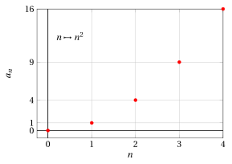
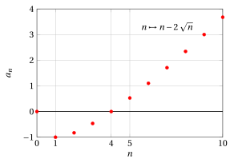
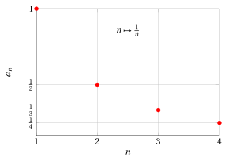
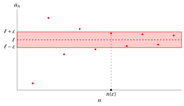
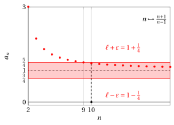
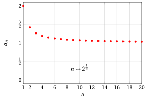
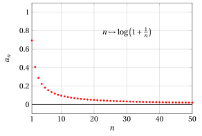
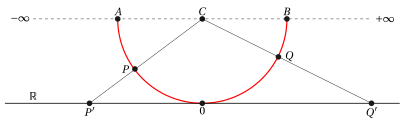
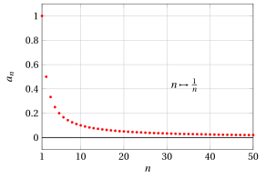
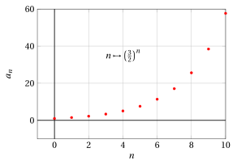

# Sequences and limits of sequences

**Part 3 · Limits of sequences · Chapter 1** · lecture notes by Fabio Furini · [:material-file-pdf-box: Lecture notes, volume (PDF)](../pdf/lecture-notes-3-limits.pdf)

## 1. Definition of sequence and properties

- Consider the set $\mathbb{N}$ of non-negative integers, ordered according to the natural order

    $$
    \mathbb{N}: 0,1,2,3,\dots,n,\dots
    $$

!!! definizione "Definition 1: Sequence"

    A <strong>sequence</strong> is a relation that associates with each natural number $n \in \mathbb{N}$ (or from a certain natural number $n_0$ onward) a real number $a_n \in \R$.

- A sequence is therefore a <strong>function</strong>:

    $$
    f: \mathbb{N} \rightarrow \mathbb{R}
    $$

    $$
    f: n \mapsto a_n
    $$

    or possibly

    $$
    f: \{n \in \mathbb{N}: n \ge n_0\} \rightarrow \mathbb{R}
    $$

    for some fixed integer $n_0 \in \N$.

    !!! chiave ""

        The sequence associates with the <strong>input variable</strong> $n$ the <strong>output value</strong> $a_n$.

- The fact that the domain of the function $f$ is the set of natural numbers makes it possible to write the sequence by <strong>listing its values</strong>, in the order in which they follow one another as $n$ increases:

    $$
    a_0,~~a_1,~~a_2,~~ \dots,~~ a_n,~~ \dots
    $$

- The dots after $a_n$ indicate that we are not considering only the first $n$ terms of the sequence (i.e., a <strong>finite set</strong> of numbers), but the whole sequence of <em>infinitely many terms</em> (i.e., an <strong>infinite set</strong> of numbers).

!!! esempio "Example 1: Sequences"

    \begin{align*}
    & n \in \N & n &\mapsto n^2 && 0,1,4,9,16, \dots \\[2ex]
    & n \in \N & n &\mapsto (-1)^n && 1,-1,1,-1,1, \dots \\[2ex]
    & n \in \N & n &\mapsto a \in \R && a,a,a,a,a, \dots
    \end{align*}

    The last sequence is called a <strong>constant sequence</strong>.

!!! esempio "Example 2: Sequences"

    \begin{align*}
    & n\in \N,n \ge 1 & n &\mapsto \frac{1}{n} && 1,\frac{1}{2},\frac{1}{3}, \frac{1}{4},\frac{1}{5}, \dots \\[2ex]
    & n\in \N,n \ge 2 & n &\mapsto \frac{n+1}{n-1} && 3,2,\frac{5}{3},\frac{6}{4},\frac{7}{5}, \dots
    \end{align*}

!!! chiave ""

    We can represent sequences graphically by the <strong>points</strong> of the Cartesian plane with coordinates $(n, a_n)$.

!!! esempio "Example 3: Graph of a sequence"

    The graph of the sequence $n \mapsto n^2$ with $n\in\{0,1,2,3,4\}$ is:

    { .fig .ovale loading=lazy style="width:75%" }

!!! chiave ""

    To denote a sequence we will use the notation:

    $$
    \{a_n\}  {\rm~~~~or~~~~} n \mapsto a_n
    $$

    possibly specifying the set in which the input variable $n$ varies (the whole set $\mathbb{N}$ or from a certain value $n_0 \in \N$ onward).

!!! chiave ""

    A sequence $\{a_n\}$ is <strong>bounded</strong> if there exist two numbers $m \in \R$ and $M \in \R$ such that:

    $$
    m \le a_n \le M,  ~~~\forall n  \in \N
    $$

    It is <strong>bounded below</strong> if $m$ exists. It is <strong>bounded above</strong> if $M$ exists.

!!! esempio "Example 4: Bounded sequences"

    - the sequence $\left\{ (-1)^n \right\}$ is bounded

    - the sequence $\left\{ n^2 \right\}$ is only bounded below

    - the sequence $\left\{( -2)^n \right\}$ is not bounded (neither below nor above).

!!! definizione "Definition 2: Property that holds eventually"

    We say that a sequence $\{a_n\}$ has (or acquires) a certain property <strong>eventually</strong> if there exists $\tilde{n} \in \mathbb{N}$ such that $a_n$ satisfies that property for every $n \ge \tilde{n}$.

!!! esempio "Example 5: Properties that hold eventually"

    Consider the sequence $\left\{ n - 2 \: \sqrt{n} \right\}$. The graph of the sequence with $n\in\{0,1,2,\dots,10\}$ is:

    { .fig .ovale loading=lazy style="width:75%" }

    This sequence is eventually positive. With $n=4$ we have $a_n=0$, hence taking $\tilde{n}=5$, we have $a_n > 0$ for $n \ge \tilde{n}$.

!!! esempio "Example 6: Properties that hold eventually"

    Now consider the sequence $\left \{ \frac{1}{n} \right \}$. The graph of the sequence with $n\in\{1,2,\dots,4\}$ is:

    { .fig .ovale loading=lazy style="width:75%" }

    This sequence is eventually less than $10^{-100}$.  With $n=10^{100}$ we have $a_n =10^{-100}$, hence taking for example $\tilde{n} = 10^{100} +1$ we have $a_n < 10^{-100}$ for $n \ge \tilde{n}$.

### 1.1 Convergent sequences and definition of the limit of a sequence

!!! definizione "Definition 3: Convergent sequence"

    A sequence $\{ a_n\}$ is called <strong>convergent</strong> if there exists a number $\ell \in  \mathbb{R}$ such that:

    \begin{equation}
    |a_n - \ell| < \varepsilon, \qquad {\rm eventually}
    \label{limite_successione}
    \end{equation}

    for every $\varepsilon > 0$.

!!! chiave ""

    A sequence $\{ a_n\}$ is therefore called <strong>convergent</strong> if for every $\varepsilon > 0$ (as small as we like) there exists a number $n(\varepsilon) \in \N$ such that:

    $$
    |a_n - \ell| < \varepsilon {\rm~~~~for~every~~~~} n \ge n(\varepsilon)
    $$

    The number $n(\varepsilon)$ depends (in general) on the value of $\varepsilon$. If the sequence $\{a_n\}$ is convergent, then the number $\ell \in \R$ is associated with it.

!!! definizione "Definition 4: Limit of a sequence"

    The number $\ell \in \R$ appearing in inequality \(\eqref{limite_successione}\) is called the <strong>limit of the sequence</strong> $\{a_n\}$, and we write:

    $$
    \lim_{n \rightarrow +\infty} a_n = \ell {\rm ~~~~~~or,~equivalently~~~~~~} a_n \rightarrow \ell {\rm~~~for~~~} n \rightarrow +\infty
    $$

- read, respectively:

    - **** the limit of $a_n$, as $n$ tends to infinity, is $\ell$

    - **** $a_n$ tends to $\ell$ as $n$ tends to infinity

!!! chiave ""

    Inequality \(\eqref{limite_successione}\) corresponds to the following two:

    \begin{equation}
    \ell - \varepsilon ~<~ a_n ~<~ \ell + \varepsilon \label{limite_successione_bi}
    \end{equation}

- Representing the points of a sequence graphically, we have:

    { .fig .ovale loading=lazy style="width:85%" }

    The convergence condition means that, having fixed a horizontal strip “as narrow as we like”:

    $$
    [\ell - \varepsilon,  \ell + \varepsilon]
    $$

    from a certain value of $n$ onward, called $n(\varepsilon)$, the points $a_n$ of the sequence no longer leave this strip.  In the previous graph, having fixed the width of the strip, the values $a_n$ lie inside the strip for $n \ge n(\varepsilon)$.

!!! teorema "Theorem 1: Uniqueness of the limit of a sequence"

    If a sequence $\{a_n\}$ converges to the limit $\ell \in \R$, then this limit is unique.

??? dimostrazione "Proof"

    Suppose, by contradiction, that there exist two different limits, $\ell_1$ and $\ell_2$, associated with the same sequence $\{a_n\}$. Then, eventually, for every $\varepsilon >0$ we would have:

    \begin{equation}
    |\ell_1 - \ell_2| ~~=~~ |\ell_1 - a_n + a_n - \ell_2| ~~\le~~ \underbrace{|\ell_1 - a_n|}_{=|a_n -\ell_1|<\varepsilon} + \underbrace{|a_n -\ell_2|}_{<\varepsilon} ~~<~~ 2\: \varepsilon
    \label{MMM}
    \end{equation}

    We used the triangle inequality. Since $\varepsilon >0$ can be chosen arbitrarily small, \(\eqref{MMM}\) can be satisfied if and only if:

    $$
    \ell_1 = \ell_2
    $$

    Hence two different values $\ell_1$ and $\ell_2$ cannot exist and consequently the limit (if it exists) is unique. □

!!! esempio "Example 7: Verifying the limit of a sequence"

    The graph of the sequence $n \mapsto \frac{(-1)^n}{n}$, for example starting from $n=9$, lies within the horizontal strip:

    $$
    \left[-\frac{1}{8}, \frac{1}{8}\right]
    $$

    given by $\ell=0$ and $\varepsilon = \frac{1}{8}$.   With $n=8$ we have $a_n=\frac{1}{8}$, with $n=9$ we have $a_n=-\frac{1}{9}$, hence

    $$
    |a_n | <  \frac{1}{8} {\rm~~~~for~every~~~~} n \ge 9
    $$

    { .fig .ovale loading=lazy style="width:72%" }

    To prove that:

    $$
    a_n \rr 0 {\rm ~~~for~~~} n \rr \ip
    $$

    we must verify that for every $\varepsilon>0$ there exists $n(\varepsilon) \in \N$ such that

    $$
    n>n(\varepsilon) \Rightarrow |a_{n}|< \varepsilon
    $$

    The inequality is equivalent to

    $$
    \left| \frac{(-1)^n}{n} \right| < \varepsilon
    {\rm ~~~which~is~satisfied~for~~} n> \frac{1}{\varepsilon}
    $$

    Having fixed $\varepsilon > 0$, it will suffice to choose the first integer

    $$
    n(\varepsilon) >\frac{1}{\varepsilon}
    $$

    to satisfy the condition required by the definition of limit.

!!! chiave ""

    Convergent sequences are (eventually) bounded.

!!! esempio "Example 8: Verifying the limit of a sequence"

    Consider the sequence:

    $$
    n \mapsto  \frac{n+1}{n-1} \qquad \left(\frac{n+1}{n-1} = \frac{n-1+1+1}{n-1}=1 +\frac{2}{n-1} \right)
    $$

    This is the graph of the sequence with $n\in\{2,3,\dots,20\}$:

    { .fig .ovale loading=lazy style="width:75%" }

    We see that the values $a_n$ get closer to $1$, hence we try to prove, using the definition of limit, that:

    $$
    \lim_{n \rightarrow +\infty}  \frac{n+1}{n-1} =1
    $$

    We must verify that for every $\varepsilon>0$ there exists $n(\varepsilon) \in \N$ such that:

    $$
    n>n(\varepsilon) \Rightarrow 1 -\varepsilon < \frac{n+1}{n-1} < 1 + \varepsilon
    $$

    The left inequality is always satisfied (the numerator of the fraction is always larger than the denominator). We take the right one:

    $$
    \frac{n+1}{n-1} -  1  < \varepsilon, \qquad \frac{ n+1 - (n-1) }{n-1} < \varepsilon, \qquad  \frac{ 2}{n-1} < \varepsilon, \qquad   n-1 > \frac{2}{\varepsilon}
    $$

    $$
    {\rm ~~hence~it~is~satisfied~if~~~}\qquad n > \frac{2 + \varepsilon}{\varepsilon}
    $$

    Having fixed $\varepsilon > 0$, it will suffice to choose the first integer

    $$
    n(\varepsilon) > \frac{2 + \varepsilon}{\varepsilon}
    $$

    to satisfy the condition required by the definition of limit.

!!! esempio "Example 9: Verifying the limit of a sequence"

    For the previous example, we proved that the limit equals $1$. Let us now check what happens when we fix $\varepsilon=\frac{1}{2}$.  In this case $n\left(\frac{1}{2}\right)> \frac{2+1/2}{1/2}=5$.

    { .fig .ovale loading=lazy style="width:80%" }

    If instead we fix $\varepsilon=\frac{1}{4}$, in this case we have $n\left(\frac{1}{4}\right)> \frac{2+1/4}{1/4}=9$.

    { .fig .ovale loading=lazy style="width:80%" }

!!! esempio "Example 10: Verifying the limit of a sequence"

    Consider the sequence:

    $$
    n \mapsto 2^{\frac{1}{n}}
    $$

    This is the graph of the sequence with $n\in\{1,2,\dots,20\}$:

    { .fig .ovale loading=lazy style="width:80%" }

    We see that the values $a_n$ get closer to $1$, hence we try to prove, using the definition of limit, that:

    $$
    \lim_{n \rightarrow +\infty} 2^{\frac{1}{n}} =1
    $$

    We must verify that for every $\varepsilon>0$ there exists $n(\varepsilon) \in \N$ such that:

    $$
    n>n(\varepsilon) \Rightarrow 1 -\varepsilon < 2^{\frac{1}{n}} < 1 + \varepsilon.
    $$

    The left inequality is always satisfied (2 raised to a positive rational number), while for the right one, taking the logarithm to base $2$, we obtain:

    $$
    \frac{1}{n} < \log_2 (1 + \varepsilon)
    $$

    Hence it is satisfied if:

    $$
    n > \frac{1}{\log_2 (1 + \varepsilon)}
    $$

    Having fixed $\varepsilon > 0$, it suffices to choose the first integer

    $$
    n(\varepsilon) > \frac{1}{\log_2 (1 + \varepsilon)}
    $$

    to satisfy the condition required by the definition of limit.

!!! esempio "Example 11: Limit of sequences"

    Consider the sequence:

    $$
    n \mapsto \log \left( 1 + \frac{1}{n} \right).
    $$

    This is the graph of the sequence with $n\in\{1,2,\dots,50\}$:

    { .fig .ovale loading=lazy style="width:85%" }

    We see that the values $a_n$ get closer to $0$, hence we try to prove, using the definition of limit, that:

    $$
    \lim_{n \rightarrow +\infty}  \log \left(1 +\frac{1}{n} \right) =0
    $$

    We must verify that for every $\varepsilon>0$ there exists $n(\varepsilon) \in \N$ such that:

    $$
    n>n(\varepsilon) \Rightarrow -\varepsilon < \log \left( 1 + \frac{1}{n} \right) <  \varepsilon
    $$

    The left inequality is always satisfied (the logarithm to base $e$ of a number greater than 1), while for the right one, exponentiating, we obtain:

    $$
    \frac{1}{n}+1 < e^{\varepsilon} \qquad {\rm ~~hence~it~is~satisfied~if~~~~~} n > \frac{1}{e^{\varepsilon}-1} \qquad  (e^{\varepsilon}-1 > 0 {\rm~~with~~} \varepsilon>0)
    $$

    Having fixed $\varepsilon > 0$, it suffices to choose the first integer

    $$
    n(\varepsilon) > \frac{1}{e^{\varepsilon}-1}
    $$

    to satisfy the condition required by the definition of limit.

<strong>Try it</strong> — the interactive graph below shows what you have just read: move the sliders.

### 1.2 Divergent sequences and irregular sequences

!!! definizione "Definition 5: Sequence divergent to $+\infty$"

    A sequence $\{ a_n\}$ is called <strong>divergent</strong> to $+\infty$ if for every $M>0$ there exists a number $n(M) \in \N$ such that:

    $$
    a_n  > M {\rm~~for~every~~} n \ge n(M)
    $$

!!! definizione "Definition 6: Sequence divergent to $-\infty$"

    A sequence $\{ a_n\}$ is called <strong>divergent</strong> to $-\infty$ if for every $M>0$ there exists a number $n(M) \in \N$ such that:

    $$
    a_n  < -M {\rm~~for~every~~} n \ge n(M)
    $$

!!! chiave ""

    The number $n(M)$ depends (in general) on the value of $M$.

- In the two cases we will say, respectively, that $+\infty$ and $-\infty$ are the limits of the sequence and we will write, respectively:

    $$
    \lim_{n \rightarrow +\infty} a_n = +\infty {\rm ~~~~~or~~~~~} \lim_{n \rightarrow +\infty} a_n = -\infty
    $$

    The values of a sequence divergent to $\ip$ eventually exceed any fixed real number. The values of a sequence divergent to $\im$ eventually fall below any fixed real number.

!!! chiave ""

    <strong>The symbols</strong> $+\infty$ and $-\infty$ <strong>are not numbers</strong>.

- If we represent the real numbers on the <strong>Euclidean line</strong>, each number corresponds to a point and each point to a number.

- With the symbols $+\infty$ and $-\infty$ we agree to denote two “points”:

    1. $+\infty$ lies to the <em>right</em> of every point of $\mathbb{R}$

    2. $-\infty$ lies to the <em>left</em> of every point of $\mathbb{R}$

    however, no number corresponds to these two points.

- On the symbols $+\infty$ and $-\infty$ the operations of sum and product with the properties stated in $R_1$ and $R_2$ are not defined, even though we will be able to perform these operations “partially” (as we will see later).

!!! definizione "Definition 7: The set $\mathbb{R}^*$"

    The set of real numbers $\mathbb{R}$ with the addition of the two elements $+\infty$ and $-\infty$ will be denoted by:

    $$
    \mathbb{R}^* =\mathbb{R} \cup \{+\infty\} \cup \{-\infty\}
    $$

- We can represent the set $\mathbb{R}^*$ “visually” by putting the points of the <strong>line</strong> in one-to-one correspondence with those of a <strong>semicircle</strong> (projecting them from the center of the semicircle onto the line $\mathbb{R}$):

{ .fig .ovale loading=lazy style="width:100%" }

- No point on $\mathbb{R}$ corresponds to the points $A$ and $B$; we will say that $-\infty$ is the “counterpart” of the point $A$ and $+\infty$ the “counterpart” of $B$.

- The limit operation becomes <em>fully meaningful</em> if set in $\mathbb{R}^*$ instead of $\mathbb{R}$, i.e., the limit of a sequence can be a real number $\ell$ or $+\infty$ or $-\infty$.

!!! chiave ""

    Sequences whose limit is a real number are <strong>convergent</strong>; those whose limit is $+\infty$ or $-\infty$ are <strong>divergent</strong>.

!!! esempio "Example 12: Convergent and divergent sequences"

    - the canonical sequence $\{ n \}$ is divergent to $+\infty$;

    - the sequence $\{ 2^n \}$ is divergent to $+\infty$;

    - the sequence $\{ -2^n \}$ is divergent to $-\infty$;

    - the sequence $\{ 2^{\frac{1}{n}} \}$ is convergent to $1$.

!!! osservazione "Remark 1"

    $$
    \lim_{n \rightarrow +\infty} n^{\alpha} =
    \begin{cases}
    +\infty & {\rm if~} \alpha >0\\
    1 & {\rm if~} \alpha = 0\\
    0 & {\rm if~} \alpha < 0
    \end{cases}
    $$

??? dimostrazione "Proof"

    If $\alpha>0$, we must prove that the sequence diverges to $\ip$.  We must therefore verify that for every $M>0$ there exists $n(M) \in \N$ such that

    $$
    n>n(M)\Rightarrow a_{n}>M
    $$

    The inequality

    $$
    n^{\alpha}>M
    {\rm ~~~is~satisfied~for~~}
    n>{M^{\frac{1}{\alpha}}}
    $$

    Hence, having fixed $M > 0$, it will suffice to choose the first integer

    $$
    n(M) > {M^{\frac{1}{\alpha}}}
    $$

    to satisfy the required divergence condition.

    Hence there is no $M>0$ such that $n^{\alpha} \le M$ for $n \in \N$, and the sequence is not bounded. Hence $n^{\alpha} \rr \ip$ for $n \rr \ip$.

    If $\alpha<0$,  we must verify that for every $\varepsilon>0$ there exists $n(\varepsilon) \in \N$ such that

    $$
    n>n(\varepsilon) \Rightarrow -\varepsilon < n^{\alpha} <   \varepsilon
    $$

    The left inequality is always satisfied. For the right inequality, since $n^{\alpha}=\frac{1}{n^{|\alpha|}}$, we obtain

    $$
    \frac{1}{n^{|\alpha|}} < \varepsilon
    $$

    which is satisfied if

    $$
    n^{|\alpha|} > \frac{1}{\varepsilon} {\rm ~~~i.e.,~for~~~} n > \frac{1}{\varepsilon^{1/|\alpha|}}
    $$

    Having fixed $\varepsilon > 0$, it will suffice to choose the first integer

    $$
    n(\varepsilon) > \frac{1}{\varepsilon^{1/|\alpha|}}
    $$

    to satisfy the condition required by the definition of limit. □

- Finally, we observe that there are sequences that are neither convergent nor divergent

!!! definizione "Definition 8: Irregular (indeterminate) sequence"

    A sequence that is neither convergent nor divergent is called <strong>irregular</strong> (oscillating) or <strong>indeterminate</strong>.

!!! esempio "Example 13: Irregular sequences"

    - the sequence  $\{ (-1)^n \}$ is neither convergent nor divergent (but it is bounded)

    - the sequence  $\{ (-2)^n \}$ is neither convergent nor divergent (and not even bounded).

- For <strong>irregular</strong> sequences, the limit operation is not defined, i.e., their <strong>limit does not exist</strong>.

!!! chiave ""

    Summarizing, the operation of computing the limit allows us to answer rigorously the question: <strong>how do the numbers $a_n$ behave as $n$ becomes larger and larger?</strong>

## 2. Unbounded sets and their suprema/infima

- It is convenient to adopt the convention introduced for limits also for the $\sup$ and the $\inf$, extending the definition of these quantities as follows

!!! definizione "Definition 9: Supremum and infimum $\sup$ and $\inf$ (unbounded sets)"

    If a set $E \subseteq \mathbb{R}$ is not bounded above (below), we will say that

    $$
    \sup E = + \infty ~~~(\inf E = - \infty)
    $$

- In this way, property $R_4$ of the real numbers can be stated as follows:

    !!! chiave ""

        - **$R_4 \rightarrow$** every non-empty set $E \subseteq \mathbb{R}$ has a supremum and an infimum; $\sup E$ ($\inf E$) is a number if $E$ is bounded above (below), otherwise it is $+\infty$ ($-\infty$).

## 3. Infinitesimal and infinite sequences

!!! definizione "Definition 10: Infinitesimal sequence"

    A sequence $\{a_n\}$ tending to zero is called <strong>infinitesimal</strong>

!!! esempio "Example 14: Infinitesimal sequences"

    - the sequence $\left\{ \frac{1}{n} \right\}$ is infinitesimal

    - the sequence $\left\{ \frac{1}{n^2} \right\}$ is infinitesimal

- The concept of <em>infinitesimal</em> plays a central role and is also fundamental for having a correct and effective <strong>intuitive picture</strong> of the concepts of <em>infinitesimal calculus</em>.

!!! chiave ""

    an “<strong>infinitesimal</strong>” is not an “infinitely small number” (a meaningless concept) but a <strong>variable quantity</strong> (a sequence or, as we will see, a function) that <strong>becomes indefinitely small</strong>.

!!! definizione "Definition 11: Infinite sequence"

    A sequence $\{a_n\}$ tending to $\pm \infty$ is called <strong>infinite</strong> (an infinity)

!!! esempio "Example 15: Infinite sequences"

    - the sequence $\left\{ n^2 \right\}$ is infinite

    - the sequence $\left\{ n! \right\}$ is infinite

- Sometimes it is possible to specify whether a convergent sequence <strong>approaches its limit from above or from below</strong>

!!! definizione "Definition 12: Limit from above"

    We say that the sequence $\{a_n\}$ tends to $\ell \in \mathbb{R}$ <strong>from above</strong> and we write

    $$
    \lim_{n \rightarrow +\infty} a_n = \ell^+
    $$

    if for every $\varepsilon > 0$ we have that

    $$
    0 \le a_n - \ell < \varepsilon, {\rm ~~~~eventually}.
    $$

!!! definizione "Definition 13: Limit from below"

    We say that the sequence $\{a_n\}$ tends to $\ell \in \mathbb{R}$ <strong>from below</strong> and we write

    $$
    \lim_{n \rightarrow +\infty} a_n = \ell^-
    $$

    if for every $\varepsilon > 0$ we have that

    $$
    0 \le \ell - a_n  < \varepsilon, {\rm ~~~~eventually}.
    $$

- Saying that $a_n \rightarrow \ell^+$ for $n \rr \ip$ means stating that $a_n \rightarrow \ell$ and moreover $a_n \ge \ell$ eventually; hence $a_n$ approaches $\ell$ <em>from above</em>, i.e., it approximates $\ell$ from above.

- Saying that $a_n \rightarrow \ell^-$ for $n \rr \ip$ means stating that $a_n \rightarrow \ell$ and moreover $a_n \le \ell$ eventually; hence $a_n$ approaches $\ell$ <em>from below</em>, i.e., it approximates $\ell$ from below.

!!! esempio "Example 16: Sequence with limit from above"

    $$
    \lim_{n \rightarrow +\infty} \frac{1}{n} = 0^+
    $$

    { .fig .ovale loading=lazy style="width:75%" }

!!! esempio "Example 17: Sequence with limit from below"

    $$
    \lim_{n \rightarrow +\infty} \frac{n}{n+1} = 1^- \qquad  \left( \frac{n}{n+1} = \frac{n+1-1}{n+1}= 1 - \frac{1}{n+1} \right)
    $$

    { .fig .ovale loading=lazy style="width:75%" }

!!! esempio "Example 18: Sequence with a limit, but neither from below nor from above"

    $$
    \lim_{n \rightarrow +\infty} \frac{(-1)^n}{n} = 0
    $$

    { .fig .ovale loading=lazy style="width:75%" }

    In this case we can state neither that $a_n \rightarrow 0^+$ nor that $a_n \rightarrow 0^-$ for $n \rr \ip$.

## 4. Monotone sequences

!!! definizione "Definition 14: Monotone sequences"

    A sequence $\{a_n\}$ is called <strong>monotone increasing</strong> if:

    $$
    ~a_n \le a_{n+1},~ \forall n
    $$

    A sequence $\{a_n\}$ is called <strong>strictly monotone increasing</strong> if:

    $$
    ~a_n < a_{n+1},~ \forall n
    $$

    A sequence $\{a_n\}$ is called <strong>monotone decreasing</strong> if:

    $$
    ~a_n \ge a_{n+1},~ \forall n
    $$

    A sequence $\{a_n\}$ is called <strong>strictly monotone decreasing</strong> if:

    $$
    ~a_n > a_{n+1},~ \forall n
    $$

!!! esempio "Example 19: Monotone increasing/decreasing sequences"

    - The sequence $\{ n^2\}$ is strictly monotone increasing

    - The sequence $\left\{ \frac{1}{n} \right\}$ is strictly monotone decreasing

    - The sequence $\left\{ (-1)^n \right\}$ is not monotone

    - every constant sequence is monotone (increasing or decreasing, not strictly)

- With regard to the limit operation, these sequences are of particular importance; indeed, they are <strong>never irregular</strong>, but are <strong>convergent or divergent</strong> depending on whether they are <strong>bounded or not</strong>.

!!! teorema "Theorem 2: Monotone sequence theorem"

    - Let $\{a_n\}$ be a <strong>monotone increasing sequence that is bounded above</strong>. Then $\{a_n\}$ is convergent, and its limit equals

        $$
        \sup \{a_n: n \in \N\}.
        $$

    - Let $\{a_n\}$ be a <strong>monotone decreasing sequence that is bounded below</strong>. Then $\{a_n\}$ is convergent, and its limit equals

        $$
        \inf \{a_n: n \in \N\}.
        $$

??? dimostrazione "Proof"

    We consider the case of monotone increasing sequences that are bounded above.

    Since the sequence is bounded above, the set of values taken by the sequence $\{a_n : n \in  \N\}$ is bounded above. 

    By the <em>supremum property</em> enjoyed by $\R$, there therefore exists a finite supremum, which we denote by $\ell$:

    $$
    \ell = \sup \{ a_n : n \in  \N \} {\rm ~~~~and~~~~}  \ell \in \R.
    $$

    We now need to prove that

    $$
    \lim_{n \rightarrow +\infty} a_n= \ell
    $$

    and hence that for every $\varepsilon > 0$ we have

    $$
    \ell -\varepsilon < a_n <  \ell +\varepsilon, ~~~{\rm eventually}.
    $$

    The second inequality is obvious. For every $n \in \N$ we have

    $$
    a_n \le  \ell ~~~~({\rm and~hence~~} a_n < \ell + \varepsilon)
    $$

    since $\ell$ is the supremum of $\{a_n : n \in  \N\}$ and hence an upper bound.

    By definition of supremum, $\ell$ is the least of the upper bounds of the set $\{ a_n: n \in \N\}$. Therefore, since

    $$
    \ell - \varepsilon < \ell,
    $$

    certainly $\ell - \varepsilon$ is not an upper bound of the set $\{ a_n: n \in \N\}$. This means that there exists an $n(\varepsilon) \in \N$ for which

    $$
    a_{n(\varepsilon)} > \ell - \varepsilon.
    $$

    On the other hand, the sequence is monotone increasing, therefore for every $n \ge n(\varepsilon)$ we have $a_n \ge a_{n(\varepsilon)}$. We have thus proved that

    $$
    a_n \ge a_{n(\varepsilon)} > \ell - \varepsilon {\rm ~~for~every~~} n \ge n(\varepsilon)
    $$

    Consequently, we have the claim:

    $$
    \lim_{n \rightarrow +\infty} a_n = \ell
    $$

    The case of monotone decreasing sequences that are bounded below is proved analogously. □

- The idea of the proof is conveyed by the following figure:

    { .fig .ovale loading=lazy style="width:90%" }

- To express symbolically as well that the limit is the $\sup$ (or the $\inf$) of an increasing (or decreasing) sequence, we use the notation

    $$
    a_n \uparrow \ell {\rm ~~~or~~~} a_n \downarrow \ell
    $$

    This in particular implies that $a_n \rightarrow \ell^-$ (respectively, $\ell^+$), but it contains a further piece of information: the monotonicity of the sequence.

- This theorem is a consequence of the completeness axiom (axiom of continuity) $R_4$ of the real numbers and therefore holds if the setting we consider is $\R$. For example, it is not true that an increasing and bounded sequence of rational numbers always has a rational limit, i.e., in $\Q$.

    

    !!! esempio "Example 20: Increasing and bounded sequence in $\Q$"

        Let $\{a_n\}$ be the sequence defined as follows:

        $$
        a_0 = 0, a_1 = 0,1, a_2= 0,1011, a_3= 0,10110111, a_4= 0,1011011101111 \dots
        $$

        At step $n$ we append to the decimal number obtained at the previous step a digit zero followed by $n$ digits equal to $1$. The sequence $\{a_n\}$ is evidently increasing, and bounded above (for example, $a_n \le 1$).

        - In $\R$ the sequence converges to the number $\sup \{a_n : n \in \N\}$, which after the decimal point has an infinite, non-periodic decimal expansion (one digit 1, one digit 0, two digits 1, one digit 0, three digits 1, one digit 0, and so on forever)

        - Hence the limit of the sequence is an irrational number. This example shows that in the set $\Q$ the monotone sequence theorem is false.

- The monotone sequence theorem can be completed with the next corollary, which considers bounded or unbounded sequences.

!!! teorema "Corollary 1:  Of the monotone sequence theorem"

    Let $\{a_n\}$ be a monotone increasing sequence. Then there exists

    $$
    \lim_{n \rightarrow +\infty} a_n = \sup\{a_n: n \in \N\}.
    $$

??? dimostrazione "Proof"

    If $\{a_n\}$ is bounded above, the statement is contained in Theorem [Theorem 2](#box-theoSUCC_MONOTONE-36) (monotone sequence theorem).

    If instead $\{a_n\}$ is unbounded above, this means that, having fixed $M > 0$, there exists an $n(M) \in \N$ such that

    $$
    a_{n(M)} > M
    $$

    On the other hand, the sequence is increasing, therefore for every $n \ge n(M)$ we have

    $$
    a_n \ge a_{n(M)} > M
    $$

    We have thus proved that for every $M>0$ we have $a_n > M$, eventually. This means that $a_n \rightarrow +\infty$ for $n \rr \ip$. □

Summarizing, we have:

- if $\{a_n\}$ is bounded above, then it converges (and its limit equals the supremum of its values, which in this case is a real number)

- if instead $\{a_n\}$ is unbounded above, then $a_n$ tends to $+\infty$ (which in this case equals the supremum of its values).

!!! chiave ""

    A monotone sequence either converges or diverges (it cannot be irregular).

## 5. Limits of geometric progressions

- Consider the <strong>geometric progression</strong> with common ratio $a \in \R$:

    $$
    1,~~a,~~a^2,~~a^3,~~ \dots,~~ a^n,~~ \dots
    $$

    it is equivalent to the sequence $\{a^n\}$:

    $$
    n \mapsto a^n
    $$

- If $a > 1$, the sequence is monotone increasing and unbounded above.

- If $a = 1$, the sequence is constant.

- If $0 < a < 1$, the sequence is monotone decreasing and tends to zero.

- If $a$ is negative, the sequence is not monotone.

!!! osservazione "Remark 2"

    $$
    \lim_{n \rightarrow +\infty} a^n =
    \begin{cases}
    +\infty & {\rm if~} a >1\\
    1 & {\rm if~} a = 1\\
    0 & {\rm if~} |a| < 1\\
    {\rm does~not~exist~} & {\rm if~} a \le -1\\
    \end{cases}
    $$

??? dimostrazione "Proof"

    If $|a| <1$, we must verify that for every $\varepsilon>0$ there exists $n(\varepsilon) \in \N$ such that

    $$
    n>n(\varepsilon) \Rightarrow -\varepsilon<a_{n}<+\varepsilon
    $$

    Hence we must verify that

    $$
    n>n(\varepsilon)\Rightarrow -\varepsilon<|a|^n<\varepsilon
    $$

    The first inequality is always true, while the second is satisfied if

    $$
    n > \log_{|a|} \varepsilon
    $$

    Having fixed $\varepsilon > 0$, it will suffice to choose the first integer

    $$
    n(\varepsilon) > \log_{|a|} \varepsilon
    $$

    to satisfy the condition required by the definition of limit.

    If $a > 1$, we must verify that for every $M>0$ there exists $n(M) \in \N$ such that

    $$
    n> n(M)  \Rightarrow a_{n}>M
    $$

    The inequality

    $$
    a^n>M
    {\rm ~~~is~satisfied~for~~}
    n>\log_a{M}
    $$

    Hence, having fixed $M > 0$, it will suffice to choose the first integer

    $$
    n(M) > \log_a{M}
    $$

    to satisfy the required divergence condition. □

!!! esempio "Example 21: Infinitesimal and monotone decreasing geometric progression"

    { .fig loading=lazy style="width:75%" }

!!! esempio "Example 22: Infinitesimal (but not monotone) geometric progression"

    { .fig loading=lazy style="width:75%" }

!!! esempio "Example 23: Divergent geometric progression"

    { .fig loading=lazy style="width:75%" }

!!! esempio "Example 24: Geometric progression that is neither convergent nor divergent"

    { .fig loading=lazy style="width:75%" }
