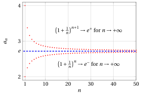
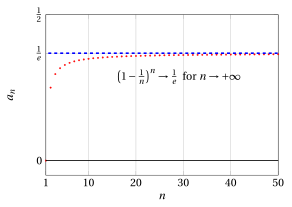
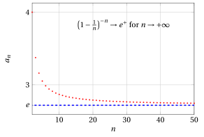
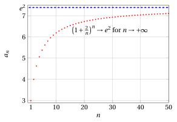

# Euler's number

**Part 3 · Limits of sequences · Chapter 3** · lecture notes by Fabio Furini · [:material-file-pdf-box: Lecture notes, volume (PDF)](../pdf/lecture-notes-3-limits.pdf) · [:material-presentation: Slides (PDF)](../pdf/slides-sequences-03-euler-number.pdf)

## 1. Euler's number $e$ (Napier's constant)

!!! teorema "Theorem 1"

    The sequence

    $$
    a_n = \left( 1 + \frac{1}{n}\right)^n {\rm ~~~with~~~} n \ge 1
    $$

    is convergent.

??? dimostrazione "Proof"

    We will prove that the sequence $\{a_n\}$ is non-decreasing ($a_n \ge a_{n-1}, \forall n \in \N, n\ge 2$) and bounded ($m \le a_n \le M, \forall n \in \N, n \ge 1$); hence it is convergent by the monotone sequence theorem. The proof is split into three parts: (1) the monotonicity of $\{a_n\}$ and its lower bound; (2) the monotonicity and the upper bound of an auxiliary sequence $\{b_n\}$; (3) the synthesis of the two results.

    <strong>Part (1).</strong> To prove that $\{a_n\}$ is non-decreasing, we study, for $n \ge 2$, the ratio:

    \begin{align*}
    \frac{a_n}{a_{n-1}} & = \frac{\left(1 + \frac{1}{n}\right)^n}{\left(1 + \frac{1}{n-1}\right)^{n-1}} = \frac{\left( \frac{n+1}{n} \right)^n}{\left( \frac{n}{n-1} \right)^{n-1}}\\[2ex]
    & = \left( \frac{\frac{n+1}{n} }{\frac{n}{n-1} } \right)^n \: \frac{1}{\left( \frac{n}{n-1}\right)^{-1}} =  \left( \frac{n^2-1}{n^2}  \right)^n \: \frac{1}{\left( \frac{n-1}{n}\right)}\\[2ex]
    & = \frac{\left( 1 - \frac{1}{n^2}\right)^n}{1 - \frac{1}{n}} \ge \frac{1 - n \cdot \frac{1}{n^2}}{1 - \frac{1}{n}} = 1
    \end{align*}

    where for the “$\ge$” we applied Bernoulli's inequality:

    $$
    (1 + x)^n \ge 1 + n \: x {\rm ~~with~~} x= -\frac{1}{n^2} \ge -1 {\rm ~~and~~} n \ge 2
    $$

    Hence we have

    $$
    \frac{a_n}{a_{n-1}} \ge 1
    $$

    i.e., $a_{n} \ge a_{n-1}$ and the sequence is non-decreasing. 

    To prove that $\{a_n\}$ is bounded <em>from below</em>, we observe that, since $a_1 = 2$ and the sequence is non-decreasing, it follows that $a_n \ge 2, \forall n \ge 1$. □

??? dimostrazione "Proof"

    <strong>Part (2).</strong> Consider the auxiliary sequence

    $$
    b_n = \left( 1 + \frac{1}{n}\right)^{n+1} {\rm ~~with~~} n \ge 1
    $$

    To prove that $\{b_n\}$ is decreasing, we study, for $n \ge 2$, the ratio:

    \begin{align*}
    \frac{b_n}{b_{n-1}} &
    = \frac{\left(1 + \frac{1}{n}\right)^{n+1}}{\left(1 + \frac{1}{n-1}\right)^{n}}
    = \frac{\left( \frac{n+1}{n} \right)^{n+1}}{\left( \frac{n}{n-1} \right)^{n}}\\[2ex]
    &
    = \left( \frac{\frac{n+1}{n} }{\frac{n}{n-1} } \right)^{n} \: {\left( \frac{n+1}{n}\right)}
    = \frac{1}{\left( \frac{n^2}{n^2-1}  \right)^{n}} \: {\left( \frac{n+1}{n}\right)}\\[2ex]
    &
    =\frac{1}{\left( 1 + \frac{1}{n^2 -1}  \right)^{n}} \: {\left( \frac{n+1}{n}\right)}\le
    \frac{1}{\left( 1 + \frac{n}{n^2 -1}  \right)} \: {\left( \frac{n+1}{n}\right)}\\[2ex]
    &
    <
    \frac{1}{\left( 1 + \frac{1}{n}  \right)} \: \left( 1 + \frac{1}{n}  \right)=1
    \end{align*}

    where for the “$\le$” we applied Bernoulli's inequality:

    $$
    (1 + x)^{n} \ge 1 + n \: x {\rm ~~with~~} x= \frac{1}{n^2-1} \ge -1 {\rm ~~and~~} n \ge 2
    $$

    and for the “$<$” we applied the inequality

    $$
    \frac n{n^2-1}>\frac 1n {\rm ~~~~since ~~~~} n^2 > n^2 -1 {\rm ~~for~~} n \ge 2
    $$

    Hence we have proved that

    $$
    \frac{b_n}{b_{n-1}} < 1 {\rm ~~hence~~ } b_n < b_{n-1}
    $$

    and the sequence $\{b_n\}$ is decreasing.

    Since $b_1=4$ and the sequence is decreasing, we therefore obtain

    $$
    b_n \le b_1  =4, ~\forall n \ge 1
    $$

    that is, $\{b_n\}$ is bounded from above. □

??? dimostrazione "Proof"

    <strong>Part (3).</strong> The two sequences are related by

    $$
    b_n = a_n \: \underbrace{\left( 1 + \frac{1}{n}\right)}_{>1,~ \forall n \ge 1} 
    {\rm ~~therefore~~} b_n > a_n, \forall n \in \N, n \ge 1
    $$

    and consequently

    $$
    2 \le a_n < b_n \le 4, ~\forall n \ge 1
    $$

    The sequence $\{a_n\}$ is therefore non-decreasing and bounded and, by the monotone sequence theorem, it is convergent. □

!!! esempio "Example 1: Graphs of the sequences $\{a_n\}$ and $\{b_n\}$"

    { .fig .ovale loading=lazy style="width:85%" }

- The limit of the sequence $a_n$ just studied is an <strong>irrational</strong> number that is very important in mathematics. This limit is denoted by the letter $e$ (<strong>Euler's number</strong>, or Napier's constant) and its decimal representation begins as follows:

    $$
    2. 7182818284 \dots
    $$

    !!! chiave ""

        By definition, we have:

        \begin{equation}
        e= \lim_{n \rr \ip } \left( 1 + \frac{1}{n}\right)^n \label{nepero}
        \end{equation}

- This number is very often used as the base of logarithms, which, when this base is used, are called natural or Napierian logarithms (after the mathematician <strong>John Napier</strong>) and are denoted simply by the symbol $\log$ (or $\ln$) without indicating the base.

- Consequently, we have:

    \begin{equation*}
    \lim_{n \rr \ip } n \: \log \left( 1 + \frac{1}{n}\right)  = \lim_{n \rr \ip }  \log \left( 1 + \frac{1}{n}\right)^n  = \log e =1
    \end{equation*}

!!! esempio "Example 2: Computing limits with the sequence tending to $e$"

    \begin{align*}
    \lim_{n \rr \ip }  \left( 1 - \frac{1}{n}\right)^n = \frac{1}{e}
    \end{align*}

    Since:

    $$
    \left( \frac{n-1}{n}\right)^n = \frac{1}{\left( \frac{n}{n-1}\right)^n} = \frac{1}{\left( 1+ \frac{1}{n-1}\right)^n} = \frac{1}{\underbrace{\left( 1+ \frac{1}{n-1}\right)^{n-1}}_{\rr e}} \cdot \frac{1}{\underbrace{\left( 1+ \frac{1}{n-1}\right)}_{\rr 1}}
    $$

    { .fig .ovale loading=lazy style="width:85%" }

!!! teorema "Theorem 2"

    Let $\{c_n\}$ be any divergent sequence (to $\ip$ or $\im$); then

    \begin{equation}
    \lim_{n \rr \ip } \left( 1 + \frac{1}{c_n}\right)^{c_n} = e, \qquad  \lim_{n \rr \ip } \left( 1 - \frac{1}{c_n}\right)^{c_n} = \frac{1}{e}  \label{nepero_tris}
    \end{equation}

??? dimostrazione "Proof"

    Recall that, given $x \in \R$, its integer part, denoted by $\lfloor x \rfloor$, is the largest integer not exceeding $x$.

    If $c_n \rr \ip$, since $\lfloor c_n \rfloor > c_n -1$, by comparison we also have $\lfloor c_n \rfloor \rr \ip$. Hence, by \(\eqref{nepero}\) and by the definition of limit we have

    $$
    \lim_{n \rr \ip } \left( 1 + \frac{1}{\lfloor c_n \rfloor + 1}\right)^{\lfloor c_n \rfloor + 1} = \lim_{n \rr \ip } \left( 1 + \frac{1}{\lfloor c_n \rfloor }\right)^{\lfloor c_n \rfloor } = e
    $$

    Using:

    $$
    \lfloor c_n \rfloor \le c_n < \lfloor c_n \rfloor + 1
    $$

    we obtain

    $$
    \left( 1 + \frac{1}{ c_n  }\right)^{ c_n  } < \left( 1 + \frac{1}{\lfloor c_n \rfloor }\right)^{\lfloor c_n \rfloor + 1} = \underbrace{\left( 1 + \frac{1}{\lfloor c_n \rfloor }\right)^{\lfloor c_n \rfloor }}_{\rr e} \cdot \underbrace{\left( 1 + \frac{1}{ \lfloor c_n \rfloor  }\right)}_{\rr 1}
    $$

    and also

    $$
    \left( 1 + \frac{1}{ c_n  }\right)^{ c_n  } > \left( 1 + \frac{1}{\lfloor c_n \rfloor +1 }\right)^{\lfloor c_n \rfloor } = \underbrace{\left( 1 + \frac{1}{\lfloor c_n \rfloor +1}\right)^{\lfloor c_n \rfloor +1}}_{\rr e} \cdot \underbrace{\left( 1 + \frac{1}{ \lfloor c_n \rfloor +1  }\right)^{-1}}_{\rr 1}
    $$

    hence the first limit of the theorem follows from the comparison theorem.

    If instead $c_n \rr \im$, then the sequence $d_n = -c_n \rr \ip$, and we have

    $$
    \left( 1 + \frac{1}{ c_n  }\right)^{ c_n  } = \left( 1 - \frac{1}{ d_n  }\right)^{ -d_n  } =  \left( \frac{d_n}{d_n-1}\right)^{ d_n  } =  \left( 1 + \frac{1}{d_n-1}\right)^{ d_n  -1} \cdot \left( 1 + \frac{1}{d_n-1}\right)
    $$

    Since $d_n-1 \rr \ip$, the claim follows from the previous case.

    The second limit of the theorem is proved analogously. □

!!! chiave ""

    This theorem is useful for computing limits involving the indeterminate form $1^{\infty}$

!!! esempio "Example 3: Computing limits with the sequence tending to $e$"

    We compute

    $$
    \lim_{n \rr \ip} \left( \frac{n}{3 +n}\right)^{5 \: n+1} = [1^{\infty}]
    $$

    since:

    $$
    \lim_{n \rr \ip} \frac{n}{3+n} = \lim_{n \rr \ip} 1 - \frac{3}{3+n} = 1, \qquad\lim_{n \rr \ip} 5\:n +1 =\ip
    $$

    We rewrite the sequence as follows:

    \begin{align*}
    \left( \frac{n}{3 +n}\right)^{5 \: n +1} &= \left( \frac{3 +n}{n}\right)^{-(5 \: n +1)} = \frac{1}{\left(1 + \frac{3}{n}  \right)^{5 \: n +1}} \\[2ex]
     &= \frac{1}{\left( \left( 1 + \frac{3}{n} \right)^{\frac{n}{3}} \right)^{\frac{3\:(5\:n+1)}{n}}} = \frac{1}{\left( \left( 1 + \frac{1}{\frac{n}{3}} \right)^{\frac{n}{3}} \right)^{\frac{3\:(5\:n+1)}{n}}}
    \end{align*}

    and we consider the denominator

    $$
    \left( \underbrace{\left( 1 + \frac{1}{\frac{n}{3}} \right)^{\frac{n}{3}} }_{\rr e}\right)^{\overbrace{\frac{3\:(5\:n+1)}{n}}^{\rr 15}}
    \rr e^{15}
    \qquad{\rm ~~~since~~~}
     \frac{n}{3} \rr \ip  {\rm ~for~} n \rr \ip
    $$

    Summarizing, we have:

    $$
    \lim_{n \rr \ip} \left( \frac{n}{3 +n}\right)^{5 \: n+1} = \frac{1}{e^{15}}
    $$

    <u>Alternative method</u>:

    $$
    \lim_{n \rr \ip} \left( \frac{n}{3 +n}\right)^{5 \: n+1} = \lim_{n \rr \ip} \left( 1- \frac{3}{3 +n}\right)^{5 \: n +1} = \lim_{n \rr \ip} \left( \underbrace{\left( 1- \frac{1}{\frac{3 +n}{3}}\right)^{\frac{3+n}{3}}}_{\rr \frac{1}{e}} \right)^{ \overbrace{\frac{3\:(5\:n+1)}{3+n}}^{\rr 15}} = \frac{1}{e^{15}}
    $$

    since

    $$
    \frac{3+n}{3} \rr \ip {\rm ~for~} n \rr \ip
    $$

!!! esempio "Example 4: Computing limits with the sequence tending to $e$"

    \begin{align*}
    \lim_{n \rr \ip }  \left( 1 - \frac{1}{n}\right)^{-n} = e
    \end{align*}

    Since:

    $$
    \left( \frac{n-1}{n}\right)^{-n} = \left( \frac{n}{n-1}\right)^{n} = \left( 1+ \frac{1}{n-1}\right)^{n} = \underbrace{\left( 1+ \frac{1}{n-1}\right)^{n-1}}_{\rr e} \cdot \underbrace{\left( 1+ \frac{1}{n-1}\right)}_{\rr 1}
    $$

    { .fig .ovale loading=lazy style="width:85%" }

!!! esempio "Example 5: Computing limits with the sequence tending to $e$"

    \begin{align*}
    \lim_{n \rr \ip }  \left( 1 + \frac{\alpha}{n}\right)^n = e^\alpha {\rm ~~~with~~~} \alpha \in \R
    \end{align*}

    If $\alpha = 0$ the result is immediate, since the sequence is constant:

    $$
    \left( 1 + \frac{0}{n}\right)^n = 1^n = 1 = e^0
    $$

    If instead $\alpha \neq 0$ (so that we can divide by $\alpha$), we have:

    $$
    \left( 1 + \frac{\alpha}{n}\right)^n = \left(
    1 + \frac{1}{\frac{n}{\alpha}}\right)^n = \left( \underbrace{\left( 1 + \frac{1}{\frac{n}{\alpha}}\right)^{\frac{n}{\alpha}}}_{\rr e} \right)^\alpha
    $$

    where we used the previous theorem with $c_n = \frac{n}{\alpha}$, a sequence divergent to $\ip$ if $\alpha>0$ and to $\im$ if $\alpha<0$.

    For example, with $\alpha=2$ we have:

    \begin{align*}
    \lim_{n \rr \ip }  \left( 1 + \frac{2}{n}\right)^n = e^2
    \end{align*}

    { .fig .ovale loading=lazy style="width:85%" }

<strong>Try it</strong> — the interactive graph below shows what you have just read: move the sliders.

## 2. Euler's number in finance

- Suppose we own a capital of unit value and an annual interest rate $t$. If the interest is paid annually, after one year the capital owned will be

    $$
    1 + t \cdot 1 = 1 + t
    $$

- If instead the interest is paid monthly, we will have

    - after the first month, a capital equal to

        $$
        1+ \frac{t}{12} \cdot 1= \underbrace{1 + \frac{t}{12}}_{\alpha}
        $$

    - after the second month, a capital equal to

        $$
        \underbrace{1 + \frac{t}{12}}_{\alpha} + \frac{t}{12} \underbrace{\left( 1 + \frac{t}{12} \right)}_{\alpha} = \underbrace{\left(1 + \frac{t}{12}\right)^2}_{\beta}
        $$

    - after the third month, a capital equal to

        $$
        \underbrace{\left(1 + \frac{t}{12}\right)^2}_{\beta} + \frac{t}{12} \: \underbrace{\left(1 + \frac{t}{12}\right)^2}_{\beta} = \left(1 + \frac{t}{12}\right)^3
        $$

    - at the end of the year we will have a capital equal to

        $$
        \left(1 + \frac{t}{12}\right)^{12}
        $$

- If the interest is computed every $n$-th of a year, at the end we will have a capital equal to

    $$
    \left(1 + \frac{t}{n}\right)^{n}
    $$

- For $t = 1$ (a 100% return) we obtain exactly the sequence that defines $e$

    !!! chiave ""

        Hence, even if the interest is paid an infinite number of times per year, the capital does not grow to infinity but tends to $e$, since:

        $$
        \lim_{n \rr \ip } \left( 1 + \frac{1}{n}\right)^n= e
        $$
