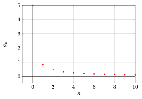
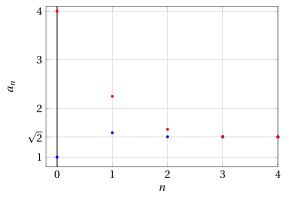
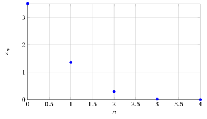
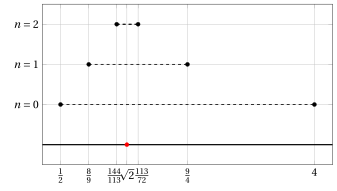

# Recursively defined sequences

**Part 3 · Limits of sequences · Chapter 6** · lecture notes by Fabio Furini · [:material-file-pdf-box: Lecture notes, volume (PDF)](../pdf/lecture-notes-3-limits.pdf)

## 1. Recursively defined sequences

- We begin with the following problem:

    !!! chiave ""

        The bank lends us $a_0$ euros, with a management fee of $b$ euros per year, at a fixed annual interest rate $r$ ($r \in (0,1)$). How much will we have to pay back after $n$ years?

- After one year, the amount to be paid back will be

    $$
    a_1 = a_0 + r \; a_0 + b = \left(1+ r\right) a_0 +b
    $$

    after two years

    $$
    a_2 = a_1  + r \; a_1 + b = \left(1+ r\right) a_1 +b
    $$

    after three years

    $$
    a_3 = a_2  + r \; a_2 + b = \left(1+ r\right) a_2 +b
    $$

    and so on… Each year the amount is computed using the amount of the previous year. We therefore have the sequence:

    $$
    \underbrace{a_0 {\rm ~~~given}}_{{\rm given~value}}, \qquad \underbrace{a_{n+1} = \left(1+ r\right) \; a_n + b}_{{\rm recursive~relation}} {\rm ~~with~~} n \in \N
    $$

    This is a very simple case of a <strong>recursively defined sequence</strong>, in which each term is defined starting from the previous one (or the previous ones).

- In this case it is easy to convince ourselves that the sequence can be rewritten in <strong>closed form</strong> (i.e., explicitly). 

    After one year:

    $$
    a_1  = \left(1+ r\right) \; a_0 + b
    $$

    after two years:

    \begin{align*}
    a_2 &= \left(1+ r\right) \; a_1 + b = \left(1+ r\right) \: \big(\left(1+ r\right) \; a_0 + b \big) + b\\[2ex]
    &= \left(1+ r\right)^2 \; a_0 + b \; \big(1+ \left(1+ r\right) \big)
    \end{align*}

    after three years:

    \begin{align*}
    a_3 &= \left(1+ r\right) \; a_2 + b = \left(1+ r\right) \: \bigg(\left(1+ r\right)^2 \; a_0 + b \;\big(1+ \left(1+ r\right) \big)\bigg) + b \\[2ex]
    &= \left(1+ r\right)^3 \; a_0 + b \;\big(1+ \left(1+ r\right) + \left(1+ r\right)^2 \big)
    \end{align*}

    and so on … hence

    $$
    a_n = s^n \: a_0 + b \: \big(1 + s + s^2 + \dots +s^{n-1}\big), {\rm ~~where~~} s = \left(1+ r\right)>1
    $$

    We can therefore easily compute the limit as follows:

    $$
    \lim_{n \rr \ip} a_n = \lim_{n \rr \ip} s^n \: a_0 + b \: \big(1 + s + s^2 + \dots +s^{n-1}\big) = \ip
    $$

    !!! chiave ""

        However, it is not always possible to make explicit a sequence given in iterative form. In that case, we are left with the <strong>problem of understanding its behavior and its limit</strong>.

!!! esempio "Example 1: Behavior of a recursively defined sequence"

    Given $b > 0$, we determine the behavior of the sequence defined by

    $$
    a_0 =b, \qquad  a_{n+1} = \frac{a_n}{1+a_n} {\rm ~~with~~} n \in \N
    $$

    All the terms of the sequence are positive, hence the denominator of the fraction appearing in the definition never vanishes.

    To verify this we proceed by induction:

    $$
    a_0 = b > 0, {\rm ~~and~if~~} a_n > 0 {\rm ~~then~~}
     a_{n+1} = \frac{a_n}{1+a_n} > 0 {\rm ~~~~(quotient~of~two~positive~numbers)}
    $$

    Consequently, all the terms of the sequence after the initial one are less than $1$, since $a_n < 1 + a_n$.

    For example, with $b=5$, we have:

    $$
    a_0=5,~~~a_1=\frac{5}{6},~~~a_2=\frac{\frac{5}{6}}{1+\frac{5}{6}}=\frac{5}{11},~~~a_3=\frac{\frac{5}{11}}{1+\frac{5}{11}}=\frac{5}{16} \dots
    $$

    { .fig .ovale loading=lazy style="width:65%" }

!!! esempio "Example 2: Behavior of a recursively defined sequence"

    Let us try to understand whether or not the sequence is monotone. We know that $a_n >0, \forall n \in \N$; then the inequality $a_n \le a_{n +1}$ becomes

    $$
    a_n \le a_{n +1}  \Longleftrightarrow a_n \le \frac{a_n}{1+a_n} \Longleftrightarrow 1+ a_n \le 1 \Longleftrightarrow a_n \le 0
    $$

    which we know to be false; hence the opposite inequality holds, i.e., the sequence is strictly decreasing ($a_n > a_{n +1}, \forall n \in \N$).

    Since it is also bounded below (by zero), $a_n$ converges to a finite non-negative limit, which we call $\ell \ge 0$.

    We pass to the limit in the recursive relation.

    $$
    \underbrace{\lim_{n \rr \ip } a_{n+1}}_{= \ell} = \underbrace{\lim_{n \rr \ip } \frac{a_n}{1+a_n} }_{= \frac{\ell}{1+\ell}} {\rm ~~~~hence~~~~~} \ell = \frac{\ell}{1+\ell} {\rm ~~~~and~consequently~~~~} \ell = 0
    $$

    since

    $$
    \ell - \frac{\ell}{1+\ell} =0,\qquad \frac{\ell (1+\ell) - \ell}{1+\ell}=0,\qquad \frac{\ell^2}{1+\ell}=0 ~~~\Longleftrightarrow~~~ \ell =0
    $$

!!! esempio "Example 3: Closed formula of the recurrence"

    Given $b > 0$, we look for the closed formula of the sequence:

    $$
    a_0 =b, \qquad  a_{n+1} = \frac{a_n}{1+a_n} {\rm ~~for~~} n \in \N
    $$

    With $n=1$, we have

    $$
    a_1  = \frac{a_0}{1+a_0}
    $$

    With $n=2$, we have

    $$
    a_2  = \frac{a_1}{1+a_1} = \frac{\frac{a_0}{1+a_0}}{1+\frac{a_0}{1+a_0}} = \frac{\frac{a_0}{1+a_0}}{\frac{1+2\:a_0}{1+a_0}} = \frac{a_0}{1+a_0} \; \frac{1+a_0}{1+2\:a_0} = \frac{a_0}{1+2\;a_0}
    $$

    With $n=3$, we have

    \begin{align*}
    a_3  &= \frac{a_2}{1+a_2} = \frac{\frac{a_0}{1+2\;a_0}}{1+\frac{a_0}{1+2\;a_0}} = \frac{\frac{a_0}{1+2\;a_0}}{\frac{1+3\;a_0}{1+2\;a_0}}= \frac{a_0}{1+2\;a_0} \; \frac{1+2\;a_0}{1+3\;a_0} =  \frac{a_0}{1+3\;a_0}
    \end{align*}

    and so on … hence

    $$
    a_n = \frac{a_0}{1+n \; a_0} {\rm ~~with~~} n \in \N {\rm ~~~~~~and~we~have~~} \lim_{n \rr \ip } \frac{a_0}{1+n \; a_0} = 0
    $$

!!! chiave ""

    The previous example illustrates a good two-step strategy for studying the behavior of recursively defined sequences:

    1. we try to understand whether the sequence satisfies some monotonicity property;

    2. if so, we examine the possible limits, taking into account the recursive relation.

## 2. Heron's algorithm

- Given $b > 0$ and $c >0$, we study the following recursively defined sequence:

    $$
    a_0 =b, \qquad  a_{n+1} = \frac{1}{2} \left( a_n + \frac{c}{a_n} \right) {\rm ~~with~~} n \in \N
    $$

    It is evident that the sequence consists of positive numbers. To verify this we proceed by induction:

    $$
    a_0 = b > 0, {\rm ~~and~if~~} a_n > 0 {\rm ~~then~~}
     a_{n+1} = \frac{1}{2} \left( a_n + \frac{c}{a_n} \right)= \frac{1}{2} \left(  \frac{a_n^2 + c}{a_n} \right) > 0
    $$

    since we have the quotient of two positive numbers.

    Let us try to understand whether or not the sequence is monotone. We know that $a_n >0, \forall n \in \N$; the inequality $a_{n +1} < a_{n}$ becomes

    $$
    a_{n +1} < a_{n} \Longleftrightarrow \frac{1}{2} \left( a_n + \frac{c}{a_n} \right) < a_n \Longleftrightarrow   c < a_n^2 \Longleftrightarrow a_n > \sqrt{c}
    $$

    since

    $$
    \frac{1}{2} \left( a_n + \frac{c}{a_n} \right) < a_n, ~~~~~~  \frac{a_n^2 + c}{a_n}  < 2\:a_n, ~~~~~~ a_n^2 + c < 2\: a_n^2 , ~~~~~~   c < a_n^2
    $$

    hence the sequence is strictly decreasing if and only if:

    $$
    a_n > \sqrt{c}
    $$

    We now need to understand whether or not this condition is true. We have

    $$
    a_{n +1} = \frac{1}{2} \left( a_n + \frac{c}{a_n} \right) > \sqrt{c}  \Longleftrightarrow \left( a_n - \sqrt{c}\right)^2 >0 \Longleftrightarrow a_n \neq \sqrt{c}
    $$

    since

    $$
    \frac{1}{2} \left( a_n + \frac{c}{a_n} \right) -  \sqrt{c} > 0,~~~~~  \frac{a_n^2 + c}{2\:a_n} - \sqrt{c} > 0,~~~~~ \frac{a_n^2 + c - 2\: a_n\:\sqrt{c}}{2\:a_n}  > 0,~~~~~ \frac{(a_n - \sqrt{c})^2}{2\:a_n}  > 0
    $$

    hence $a_n > \sqrt{c}$ for every $n \ge 1$ if $\underbrace{ b }_{= a_0} \neq \sqrt{c}$.  And hence we always have $a_1 > \sqrt{c},  \forall b >0$. 

    1. If $b >\sqrt{c}$ the sequence is strictly decreasing, therefore it has a limit (finite and positive), which we denote by $\ell \ge 0$.

        To identify it, we pass to the limit in the recursive relation, obtaining

        $$
        \underbrace{\lim_{n \rr \ip } a_{n+1}}_{= \ell} = \underbrace{\lim_{n \rr \ip }  \frac{1}{2} \left( a_n + \frac{c}{a_n} \right) }_{= \frac{1}{2} \left( \ell + \frac{c}{\ell} \right)} {\rm ~~hence~~~}  \ell = \frac{1}{2} \left( \ell + \frac{c}{\ell} \right) {\rm ~~and~consequently~~} \ell = \sqrt{c}
        $$

        since

        $$
        \ell - \frac{1}{2} \left( \ell + \frac{c}{\ell} \right) = 0,~~~~~~\ell - \frac{1}{2} \left(   \frac{\ell^2+c}{\ell} \right) = 0,~~~~~~ \left(   \frac{2\: \ell^2 -\ell^2-c}{2\:\ell} \right) = 0,~~~~~~ \left(   \frac{\ell^2 -c}{2\:\ell} \right) = 0
        $$

        Therefore, if $b >\sqrt{c}$, the whole sequence converges to $\sqrt{c}$ while decreasing.

    2. If instead $0 <b <\sqrt{c}$, then by what we have seen before we will have $a_1 > \sqrt{c}$, and from that point on the sequence will start decreasing, again tending to $\sqrt{c}$.

    3. Finally, if $b = \sqrt{c}$, the sequence remains constant, since

        $$
        a_1 = \frac{1}{2} \left(\sqrt{c} + \frac{c}{\sqrt{c}} \right) = \frac{1}{2} \frac{\sqrt{c}\sqrt{c}+c}{\sqrt{c}}= \frac{1}{2} \frac{2 c}{\sqrt{c}}=\frac{\sqrt{c}\sqrt{c}}{\sqrt{c}}=\sqrt{c}
        $$

        and all the other terms $a_n$, with $n >1$, will consequently have the same value $\sqrt{c}$.

- Moreover, $\forall b >0$ and $n \ge 1$ we have:

    $$
    \frac{c}{a_n} < \sqrt{c}  {\rm ~~~~since~~~} a_n > \sqrt{c},  \qquad
     c = \sqrt{c} \cdot \underbrace{\sqrt{c}}_{<a_n} {\rm ~~~~~and~~~~~} c < \sqrt{c} \cdot a_n
    $$

    Summarizing, $\forall b >0$ and $n \ge 1$ we have:

    $$
    \frac{c}{a_n} < \sqrt{c} < a_n, \qquad   a_n \rr \sqrt{c}
      {\rm ~~~~~and~also~~~~} \frac{c}{a_n} \rr \sqrt{c}  {\rm ~~since~~} c =\sqrt{c} \sqrt{c}
    $$

!!! chiave ""

    For every choice of $b >0$ the sequence $a_n$ tends to $\sqrt{c}$ and can therefore be used to approximate the square root.

!!! esempio "Example 4: Behavior of the sequence"

    For example, with $c=2$ and $b=4 > \sqrt{2}$ (red points) or $b=1 < \sqrt{2}$ (blue points), we have:

    { .fig .ovale loading=lazy style="width:95%" }

    { .fig .ovale loading=lazy style="width:95%" }

!!! chiave ""

    The recursive computation of the values of the sequence just seen is called Heron's <strong>algorithm</strong>, originally proposed to compute <strong>the side of a square of area</strong> $c$.

- The steps of the algorithm are:

    1. Having fixed the base equal to $a_0$ (the initial value $b$), we construct the associated rectangle of area $c$. Its height will be $\frac{c}{a_0}$, since the area of the rectangle is fixed equal to that of the square, that is:

        $$
        c = \left( a_0 \cdot \frac{c}{a_0} \right)
        $$

    2. Since the side of the square we are looking for lies between $a_0$ and $\frac{c}{a_0}$, we take as the new approximation $a_1$ the average of $a_0$ and $\frac{c}{a_0}$:

        $$
        a_1 = \frac{1}{2} \left( a_0 + \frac{c}{a_0}\right)
        $$

        which becomes the new base of the rectangle. Then we take $a_1$ in place of $a_0$ and repeat, and so on.

    !!! chiave ""

        For example, let us try to compute the side of a square of area $c=2$; in other words, we try to estimate the value $\sqrt{2}$.

    At the <strong>first iteration</strong> (with n=0) we consider, for example, a rectangle with base $a_0=b=4$ (the first upper <strong>approximation</strong> of $\sqrt{2}$); consequently, the height is $\frac{c}{a_0}=\frac{1}{2}$ (the first lower approx. of $\sqrt{2}$). Hence: $\frac{1}{2} < \sqrt{2} <4$.

    We compute the value $a_1$:

    $$
    a_1 = \frac{1}{2} \left( 4 + \frac{1}{2}\right) = \frac{9}{4}
    $$

    At the <strong>second iteration</strong> (with n=1) we have a rectangle with base $a_1=\frac{9}{4}$ (the second upper approx. of $\sqrt{2}$); consequently, the height is $\frac{c}{a_1}=\frac{2}{9/4}=\frac{8}{9}$ (the second lower approx. of $\sqrt{2}$). Hence: $\frac{8}{9} < \sqrt{2} <\frac{9}{4}$. 

    We compute the value $a_2$:

    $$
    a_2 = \frac{1}{2} \left( \frac{9}{4} + \frac{8}{9}\right) = \frac{113}{72}
    $$

    At the <strong>third iteration</strong> (with n=2) we have a rectangle with base $a_2=\frac{113}{72}$ (the third upper approx. of $\sqrt{2}$); consequently, the height is $\frac{c}{a_2}=\frac{2}{113/72}=\frac{144}{113}$ (the third lower approx. of $\sqrt{2}$). Hence: $\frac{144}{113} < \sqrt{2} <\frac{113}{72}$. 

    { .fig .ovale loading=lazy style="width:90%" }

    We compute the value $a_3$:

    $$
    a_3 = \frac{1}{2} \left( \frac{113}{72} + \frac{144}{113}\right) =  \frac{23,137}{16,272}
    $$

    At the <strong>fourth iteration</strong> (with n=3) we have a rectangle with base $a_3=\frac{23,137}{16,272}$ (the fourth upper approx. of $\sqrt{2}$); consequently, the height is $\frac{c}{a_3}=\frac{2}{23,137/16,272}=\frac{32,544}{23,137}$ (the fourth lower approx. of $\sqrt{2}$). Hence: $\frac{32,544}{23,137} < \sqrt{2} <\frac{23,137}{16,272}$. 

    Already at the fourth iteration we have a fairly good estimate of $\sqrt{2}$:

    $$
    \frac{23137}{16272} = \red{1.4}21890363\dots {\rm ~~~~and~~~} \sqrt{2}=1.414213562\dots
    $$

    that is, an estimate that is correct up to the first decimal digit. 

    Finally, we compute the value $a_4$:

    $$
    a_4 = \frac{1}{2} \left(\frac{23,137}{16,272} + \frac{32,544}{23,137}\right) =  \frac{1,064,876,737}{752,970,528}
    $$

    With the new estimate we have:

    $$
    \frac{1,064,876,737}{752,970,528} = \red{1.4142}34285\dots {\rm ~~~~and~~~} \sqrt{2}=1.414213562\dots
    $$

    which is correct up to the fourth decimal digit, i.e., with just one additional iteration we have fixed 3 more decimal digits.

### 2.1 Error estimates for Heron's algorithm

- The <strong>relative error</strong> $\tilde{\varepsilon}_n$ at iteration $n$ is:

    $$
    \tilde{\varepsilon}_n = \frac{|a_n - \sqrt{c}|}{\sqrt{c}}
    $$

    we have $\sqrt{c} < a_n, \forall b >0$ and $n \ge 1$, hence we can simply consider:

    $$
    \tilde{\varepsilon}_n = \frac{a_n - \sqrt{c}}{\sqrt{c}}
    $$

    !!! chiave ""

        The value of $\sqrt{c}$ is unknown, hence we need a way to analyze the values of the relative errors that is independent of $\sqrt{c}$.

    We first consider the <strong>absolute error</strong>:

    $$
    \varepsilon_n = a_n - \sqrt{c}
    $$

    we know that

    $$
    \frac{c}{a_n} < \sqrt{c} < a_n,~~~~ \forall b >0, n \ge 1
    $$

    hence we can obtain an estimate of the absolute error $\varepsilon_n$ made at iteration $n$ as follows:

    $$
    \varepsilon_n = a_n - \sqrt{c} < a_n - \frac{c}{a_n} {\rm ~~~~and~~~~} \varepsilon_n \rr 0 {\rm ~~for~~} n \rr \ip {\rm ~~since~~} a_n \rr \sqrt{c}
    $$

    

    !!! esempio "Example 5: Error estimates for Heron's algorithm ($\sqrt{2}=1.414213562\dots$)"

        We go back to the previous example with $c=2$ and $b=4$, and we have:

        
<table>
        <tr>
        <td>iter.</td>
        <td>\(\frac{2}{a_n}\)</td>
        <td>\(a_n\)</td>
        <td>estimate of \(\sqrt{2}\)</td>
        <td>\(\varepsilon_n\)</td>
        </tr>
        <tr>
        <td>\(n=0\)</td>
        <td>\(\frac{1}{2}\)</td>
        <td>\(4\)</td>
        <td>4</td>
        <td>\(<\frac{7}{2}=\)</td>
        <td>3.5</td>
        </tr>
        <tr>
        <td>\(n=1\)</td>
        <td>\(\frac{8}{9}\)</td>
        <td>\(\frac{9}{4}\)</td>
        <td>2.25</td>
        <td>\(<\frac{49}{36}=\)</td>
        <td>1.361…</td>
        </tr>
        <tr>
        <td>\(n=2\)</td>
        <td>\(\frac{144}{113}\)</td>
        <td>\(\frac{113}{72}\)</td>
        <td>1.569444444…</td>
        <td>\(<\frac{2,401}{8,136}=\)</td>
        <td>0.295…</td>
        </tr>
        <tr>
        <td>\(n=3\)</td>
        <td>\(\frac{32,544}{23,137}\)</td>
        <td>\(\frac{23,137}{16,272}\)</td>
        <td>1.421890363…</td>
        <td>\(< \frac{5,764,801}{376,485,264}\)=</td>
        <td>0.0153…</td>
        </tr>
        <tr>
        <td>\(n=4\)</td>
        <td>\(\frac{1,505,941,056}{1,064,876,737}\)</td>
        <td>\(\frac{1,064,876,737}{752,970,528}\)</td>
        <td>1.414234285…</td>
        <td>\(< \frac{33,232,930,569,601}{801,820,798,913,807,136}\)</td>
        <td>0.000041…</td>
        </tr>
        </table>

    

    !!! esempio "Example 6: Errors and intervals considered by Heron's algorithm"

        { .fig .ovale loading=lazy style="width:85%" }

        { .fig .ovale loading=lazy style="width:85%" }

    !!! chiave ""

        We now want to understand how “fast” the error decreases by comparing the relative errors of two consecutive iterations. This estimate gives us information about the quality of the algorithm, i.e., we want to determine the <strong>“rate of convergence”</strong> of the algorithm.

    We begin by observing that the value $\sqrt{c}$ can be written as follows:

    $$
    \sqrt{c} = \frac{1}{2} \left(\sqrt{c} + \frac{c}{\sqrt{c}} \right) {\rm ~~since~~}  \frac{1}{2} \left(\sqrt{c} + \frac{c}{\sqrt{c}} \right) = \frac{1}{2} \frac{\sqrt{c}\sqrt{c}+c}{\sqrt{c}}= \frac{1}{2} \frac{2 c}{\sqrt{c}}=\frac{\sqrt{c}\sqrt{c}}{\sqrt{c}}=\sqrt{c}
    $$

    We now establish the relation between $\varepsilon_{n+1}$ and $\varepsilon_{n}$; we have:

    \begin{align*}
    \varepsilon_{n+1} & = a_{n+1} - \sqrt{c} = \frac{1}{2} \left( a_n + \frac{c}{a_n} \right) - \frac{1}{2} \left(\sqrt{c} + \frac{c}{\sqrt{c}} \right) \\[2ex]
    & = \frac{1}{2} \left( {a_n - \sqrt{c}} +\frac{c}{a_n} - \frac{c}{\sqrt{c}} \right) = \frac{1}{2} \left( \varepsilon_n +\frac{c}{a_n} - \frac{c}{\sqrt{c}} \right) \\[2ex]
    & = \frac{1}{2} \left( \varepsilon_n + \frac{c \: \left(\sqrt{c}  - a_n\right)}{\sqrt{c} \; a_n }\right) =   \frac{1}{2} \left( \varepsilon_n - \frac{c \: \varepsilon_n}{\sqrt{c} \; a_n }\right) =   \frac{1}{2} \left( \varepsilon_n - \frac{\sqrt{c} \: \varepsilon_n}{ \; a_n }\right)\\[2ex]
    &= \frac{1}{2} \: \varepsilon_n  \; \left( 1 - \frac{\sqrt{c}}{ \; a_n }\right)=  \frac{1}{2} \: \varepsilon_n  \; \left(  \frac{a_n-\sqrt{c}}{ \; a_n }\right) \\[2ex]
    &=  \frac{1}{2} \: \frac{\varepsilon_n^2}{a_n}
    \end{align*}

    We now look for the relation between $\tilde{\varepsilon}_{n+1}$ and $\tilde{\varepsilon}_{n}$, and we substitute $\varepsilon_n = \sqrt{c} \; \tilde{\varepsilon}_n$ into the previous formula:

    $$
    \sqrt{c} \; \tilde{\varepsilon}_{n+1} = \frac{1}{2} \: \frac{\left(\sqrt{c} \; \tilde{\varepsilon}_n\right)^2}{a_n} =\frac{1}{2} \: \frac{\sqrt{c}\; \sqrt{c} \; \tilde{\varepsilon}^2_n}{a_n} {\rm ~~~hence~~~} \tilde{\varepsilon}_{n+1} =\frac{1}{2} \: \frac{ \sqrt{c} \; \tilde{\varepsilon}^2_n}{a_n}
    $$

    We have:

    $$
    \tilde{\varepsilon}_n = \frac{\varepsilon_n}{\sqrt{c}} = \frac{a_n - \sqrt{c}}{\sqrt{c}}= \frac{a_n}{\sqrt{c}} -1 {\rm ~~~~hence~~~~} \frac{\sqrt{c}}{a_n}= \frac{1}{\tilde{\varepsilon}_n+1}
    $$

    and hence we obtain:

    $$
    \tilde{\varepsilon}_{n+1} = \frac{1}{2} \: \frac{\sqrt{c} \; \tilde{\varepsilon}_n^2}{a_n}   = \frac{1}{2} \;  \frac{\tilde{\varepsilon}_n^2}{1+\tilde{\varepsilon}_n}
    $$

    !!! chiave ""

        We have obtained the relation between $\tilde{\varepsilon}_{n+1}$ and $\tilde{\varepsilon}_{n}$, independent of both $a_n$ and $\sqrt{c}$.

    From the formula just obtained we can deduce the following simplified and more intuitive one:

    $$
    0 \le \tilde{\varepsilon}_{n+1} < \frac{1}{2} \min \big\{\tilde{\varepsilon}_n,\tilde{\varepsilon}_n^2 \big\}
    $$

    Hence:

    $$
    {\rm ~~if~~~} \tilde{\varepsilon}_n < 1, {\rm ~~~we~have~~~} \tilde{\varepsilon}_{n+1} < \frac{1}{2} \: \tilde{\varepsilon}_n^2
    $$

    For example, if the relative error at a certain iteration equals $10^{-3}$, at the next step it will be less than $5 \cdot 10^{-7}$. In other words, the number of zeros after the decimal point (which equals the number of correctly estimated digits after the decimal point) doubles at each iteration.

    !!! chiave ""

        The relative error of Heron's algorithm at each step is proportional to the square of the relative error at the previous step.  <strong> The rate of convergence is quadratic.</strong>

<strong>Try it</strong> — the interactive graph below shows what you have just read: move the sliders.

