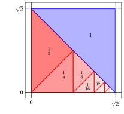
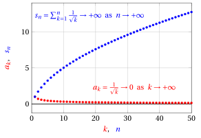
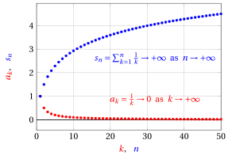
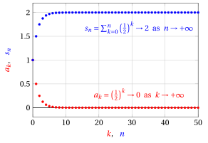
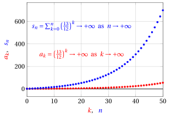
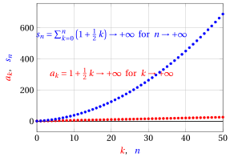

# Numerical series

**Part 5 · Series · Chapter 1** · lecture notes by Fabio Furini · [:material-file-pdf-box: Lecture notes, volume (PDF)](../pdf/lecture-notes-5-series.pdf)

## 1. Numerical series

- We now introduce numerical series, which extend the operation of addition to an infinite number of terms.

!!! chiave ""

    The sum of infinitely many terms, even if they are all positive, can give a finite result.

- Imagine measuring a square of area 2 using the following procedure: we divide the square in half along the diagonal and measure the first right triangle: we obtain 1; then we divide the second right triangle in half and measure the first of the two resulting right triangles: we obtain $\frac{1}{2}$; the remaining right triangle is again divided in half... and so on indefinitely. We obtain the infinite sum:

    $$
    1 + \frac{1}{2} + \frac{1}{4} + \frac{1}{8} + \frac{1}{16} + \frac{1}{32} + {\rm \dots} +  \frac{1}{2^k} + {\rm \dots} = \sum_{k=0}^{\infty} \frac{1}{2^k}
    $$

    which, by the way it was constructed, must give 2 as its result.

{ .fig .ovale loading=lazy style="width:55%" }

!!! definizione "Definition 1: of numerical series"

    Given a sequence $\{a_k\}_{k \in \N}$, we call <strong>numerical series</strong> of the terms $a_k$ the expression:

    $$
    \sum_{k=0}^{\infty} a_k
    $$

- It is read “series (or also sum) for $k$ from 0 to $\ip$ of $a_k$”. The values $a_k$ are called the <strong>general terms of the series</strong>.

!!! definizione "Definition 2: of sequence of partial sums"

    The numbers

    $$
    s_n = \sum_{k=0}^{n} a_k = a_0 + a_1 +  {\rm \dots} + a_n,~~~~ \forall n \in \N
    $$

    are called the <strong>$n$-th partial sums</strong> of the series and they define <strong>the sequence $\{s_n\}$ of partial sums</strong>.

!!! chiave ""

    The <strong>behavior (character) of the series</strong> is determined by the limit of the sequence $\{ s_n\}$ as $n$ tends to infinity. We say that a series is <strong>convergent</strong>, <strong>divergent</strong>, <strong>irregular</strong>, if the <strong>sequence</strong> $\{s_n\}$ of partial sums is <strong>convergent</strong>, <strong>divergent</strong> or <strong>irregular</strong>, respectively.

!!! definizione "Definition 3: of sum of the series"

    If the sequence $\{s_n\}$ of partial sums is <strong>convergent</strong>, that is, if

    $$
    s_n \rr  s \in \R {\rm ~~~~as~~~~}n \rr \ip
    $$

    we say that $s$ is <strong>the sum of the series</strong>, and we write $\sum_{k=0}^{\infty} a_k = s$.

!!! chiave ""

    Hence, if the sequence $\{s_n\}$ is <strong>convergent</strong>, we have:

    $$
    \sum_{k=0}^{\infty} a_k = \lim_{n \rr \ip} \sum_{k=0}^{n} a_k =  \lim_{n \rr \ip} s_n = s
    $$

    The series makes precise the idea of a sum of infinitely many terms, that is, we compute the limit as $n \rr \ip$ of the finite sum of the first $n$ terms.

- If, instead of summing starting from $0$, we start from an index $n_0 >0$, we write $\sum_{k=n_0}^{\infty} a_k$

- To denote a generic numerical series without specifying the starting index $n_0$ we will use the symbol $\sum a_k$

!!! chiave ""

    A generic numerical series $\sum a_k$ always involves <strong>two different sequences</strong>: 

    1. the sequence $\{a_k\}$ of the <strong>terms of the series</strong>

    2. the sequence $\{ s_n\}$ of <strong>partial sums</strong>

!!! esempio "Example 1: behavior of a series"

    Let us determine the behavior of the series:

    $$
    \sum_{k=1}^{\infty} \frac{1}{\sqrt{k}}
    $$

    We have:

    $$
    s_n = \sum_{k=1}^{n} \frac{1}{\sqrt{k}} = \underbrace{1 + \frac{1}{\sqrt{2}}+{\dots}+\frac{1}{\sqrt{n}}}_{n {\rm ~terms,~each~} \ge \frac{1}{\sqrt{n}} } \ge n \cdot \frac{1}{\sqrt{n}} = \sqrt{n} \rr \ip {\rm ~~~as~~~} n \rr \ip
    $$

    Hence the sequence of partial sums $\{s_n\}$ is divergent by the comparison theorem for sequences and, consequently, the series is divergent.

    { .fig .ovale loading=lazy style="width:65%" }

### 1.1 Main properties of numerical series

!!! osservazione "Remark 1"

    If a sequence $\{a_k\}$ has non-negative terms, that is, $a_k \ge 0,\forall k$, then the sequence of partial sums $\{s_n\}$ is increasing and regular.

??? dimostrazione "Proof"

    Given a sequence $\{a_k\}$ with non-negative terms, the sequence of partial sums $\{s_n\}$ is increasing since:

    $$
    s_{n+1}= s_{n} + \underbrace{a_{n+1}}_{\ge 0} \ge s_{n}, ~~~\forall n, {\rm ~~~~hence~~} \lim_{n \rr \ip} s_n = \sup_{n \in \N} \{s_n\}
    $$

    by the monotonicity theorem for sequences. Consequently the sequence $\{s_n\}$ cannot be irregular. It is therefore regular, that is, it either converges or diverges. □

!!! chiave ""

    Given a sequence $\{a_k\}$ with non-negative terms:

    - If $\{s_n\}$ is <strong>increasing and bounded</strong>, then it has a finite limit and $\sum a_k$ converges.

    - If $\{s_n\}$ is <strong>increasing and unbounded</strong>, then $\sum a_k$ diverges to $\ip$.

- This remark also holds for sequences with eventually non-negative terms, positive terms, or eventually positive terms.

!!! teorema "Theorem 1"

    If a series $\sum a_k$ is convergent, then $\lim_{k \rr \ip} a_k=0$

??? dimostrazione "Proof"

    By definition of convergent series, the sequence of partial sums $\{s_n\}$ converges to a real number $s$, i.e., $s_n \rr s \in \R$ as $n \rr \ip$. Without loss of generality we consider $n_0=0$.

    We observe that the sequence $\{s_n\}$ can be defined recursively:

    $$
    s_0= a_0,~~~~  s_n = s_{n-1} + a_n,~~ \forall n \ge 1
    $$

    Consequently we have:

    $$
    a_n = s_n - s_{n-1} {\rm ~~~~and~hence~~~} \lim_{n \rr \ip} a_n =  \lim_{n \rr \ip} \big( s_n -s_{n-1} \big)= s -s =0
    $$

    
□

!!! chiave ""

    The convergence of a series therefore implies that $a_k \rr 0$ as $k \rr \ip$, that is:

    \begin{equation}
    \sum a_k {\rm ~~convergent~~} ~~\Rightarrow~~ \lim_{k \rr \ip} a_k=0 \label{BBB}
    \end{equation}

    but the converse is not true (Example 1 is a counterexample):

    \begin{equation}
    \lim_{k \rr \ip} a_k=0  ~~\nRightarrow~~ \sum a_k {\rm ~~convergent~~} 
     \label{CCC}
    \end{equation}

    Hence the fact that $a_k \rr 0$ as $k \rr \ip$ is a necessary but not sufficient condition for the convergence of a series.

- From the contrapositive of \(\eqref{BBB}\) we have:

    $$
    \lim_{k \rr \ip} a_k \neq 0  ~~\Rightarrow~~ \sum a_k {\rm ~is~divergent~or ~irregular~~}
    $$

    that is, if the limit is not equal to zero, then the series is not convergent.

### 1.2 Tails of series

!!! chiave ""

    If we modify a finite number of terms of a series, the value of the sum may change, but the behavior of the series remains unchanged.

- If we modify the value of one term, for example $a_{n_0}$, for $n  \ge n_0$ the sequences of partial sums, the original and the modified one, differ only by that term: hence both converge, both diverge, or both are irregular. The same holds if we modify a finite number of terms.

!!! chiave ""

    The results on the behavior of series therefore also hold if the hypotheses are satisfied “eventually”, i.e., from a certain index $n_0$ onward.

!!! definizione "Definition 4: of tail of a series"

    Given a series $\sum_{k=0}^{\infty} a_k$ and a value $m \in \N$, the series  $\sum_{k=m+1}^{\infty} a_k$ is called a <strong>tail of the series</strong>.

- Given a series $\sum_{k=0}^{\infty} a_k$ and $m \in \N$ we have:

    \begin{equation}
    \sum_{k=m+1}^{n} a_k = \left(\sum_{k=0}^{n} a_k\right) - \left(\sum_{k=0}^{m} a_k\right) = s_n -s_m, \qquad \forall n > m \label{MMMMM}
    \end{equation}

    hence for every tail (that is, for every $m$) the associated sequence of partial sums is equal to that of the original series minus a constant. Consequently we have the following remark:

!!! chiave ""

    Every tail of a series has the same behavior as the original series.

- Given a convergent series, taking the limit as $n \rr \ip$ in \(\eqref{MMMMM}\) we obtain the relation:

    \begin{equation}
    \sum_{k=m+1}^{\infty} a_k = \left(\sum_{k=0}^{\infty} a_k\right) -  \left(\sum_{k=0}^{m} a_k\right) = s -s_m~~~  {\rm ~~as~~} n \rr \ip \label{NNNNN}
    \end{equation}

    Consequently we have the following remark:

!!! chiave ""

    Given $m \in \N$, every tail $\sum_{k=m+1}^{\infty} a_k$ of a convergent series can be interpreted as the <strong>error</strong> that we make when approximating the sum $s$ with the partial sum $s_m$.

!!! teorema "Theorem 2"

    If a series $\sum a_k$ is convergent, then

    $$
    \underbrace{s-s_m}_{\displaystyle=\sum_{k=m+1}^{\infty} a_k} \rr  0 {\rm ~~~as~~~} m \rr \ip
    $$

??? dimostrazione "Proof"

    For every $n > m$, the $n$-th partial sum of the series is:

    $$
    s_n = s_{m} + \sum_{k=m+1}^{n} a_k
    $$

    Taking the limit as $n \rr \ip$, we have:

    $$
    s = s_{m} + \underbrace{\lim_{n \rr \ip}\sum_{k=m+1}^{n} a_k }_{\displaystyle =\sum_{k=m+1}^{\infty} a_k}
    $$

    Now taking the limit as $m \rr \ip$, we have:

    $$
    s =  s + \lim_{m \rr \ip} \sum_{k=m+1}^{\infty} a_k ~~~\Rightarrow~~~ \lim_{m \rr \ip} \sum_{k=m+1}^{\infty} a_k = 0
    $$

    that is, the claim of the theorem. □

!!! chiave ""

    This theorem tells us that, if a series is convergent, then the value $s - s_m$, that is, the error that we make when approximating the sum $s$ with the partial sum $s_m$, tends to zero as $m \rr \ip$. In other words, the tail of a convergent series tends to zero as $m$ tends to infinity.

### 1.3 Harmonic series

!!! definizione "Definition 5: of harmonic series"

    The <strong>harmonic series</strong> is the series $\sum_{k=1}^{\infty} \frac{1}{k}$

!!! teorema "Theorem 3: behavior of the harmonic series"

    The harmonic series diverges to $\ip$

- Graphically we have:

{ .fig .ovale loading=lazy style="width:65%" }

!!! chiave ""

    The harmonic series $\sum_{k=1}^{\infty}   \frac{1}{k}$ is a counterexample that proves \(\eqref{CCC}\), since:

    $$
    \lim_{k \rr \ip} \frac{1}{k} = 0 {\rm ~~~~~~~and~~~~~~~} \sum_{k=1}^{\infty} \frac{1}{k}{\rm ~~~~~diverges~to} \ip
    $$

- Before proving the theorem, we observe that for certain values of $n$ the partial sums are:

    $$
    \underbrace{s_1}_{\displaystyle =s_{2^{\red 0}}}=1+\frac{\red 0}{2},~~~~\underbrace{s_2}_{\displaystyle =s_{2^{\red 1}}}= s_1 +\frac{1}{2}=1+\frac{0}{2}+\frac{1}{2} = 1+\frac{\red 1}{2},~~~~\underbrace{s_4}_{\displaystyle  =s_{2^{\red 2}}}=s_2 + \underbrace{\left(\frac{1}{3}+\frac{1}{4}\right)}_{\ge \frac{1}{4}+\frac{1}{4}=\frac{1}{2}}\ge 1+\frac{1}{2} + \frac{1}{2}=1 + \frac{\red 2}{2}
    $$

    $$
    \underbrace{s_8}_{\displaystyle =s_{2^{\red 3}}}=s_4 + \underbrace{\left(\frac{1}{5}+\frac{1}{6}+\frac{1}{7}+\frac{1}{8}\right)}_{\ge \frac{1}{8}+\frac{1}{8}+\frac{1}{8}+\frac{1}{8}=\frac{1}{2}} \ge 1 + \frac{2}{2} + \frac{1}{2} = 1 + \frac{\red 3}{2}
    $$

    $$
    \underbrace{s_{16}}_{\displaystyle =s_{2^{\red 4}}}=s_8 + \underbrace{\left(\frac{1}{9}+\frac{1}{10}+\frac{1}{11}+\frac{1}{12}+ \frac{1}{13}+\frac{1}{14}+\frac{1}{15}+\frac{1}{16} \right)}_{\ge \frac{1}{16}+\frac{1}{16}+\frac{1}{16}+\frac{1}{16}+\frac{1}{16}+\frac{1}{16}+\frac{1}{16}+\frac{1}{16}=\frac{1}{2}} \ge 1 + \frac{3}{2} + \frac{1}{2} = 1 + \frac{\red 4}{2}
    $$

??? dimostrazione "Proof"

    We prove by induction on $2^n$ that

    $$
    s_{2^n} \ge 1 + \frac{n}{2},~~~ \forall n \in \N
    $$

    <strong>Base case.</strong>  Let $n = 0$. Then the statement becomes $s_{2^0} \ge 1+\frac{0}{2}$, i.e., $1 \ge 1$, which is clearly true.

    <strong>Inductive step.</strong> Assume that it is true for $2^{n-1}$ and let us prove it for $2^{n}$. By the inductive hypothesis, we have:

    $$
    s_{2^{n-1}} \ge 1 + \frac{n-1}{2}
    $$

    Moreover, we have:

    $$
    s_{2^{n}} = s_{2^{n-1}} + \underbrace{\sum_{k=2^{n-1}+1}^{2^n} \left( \frac{1}{k} \right)}_{\displaystyle \ge 2^{n-1} \cdot \frac{1}{2^n}=\frac{1}{2}}
    {\rm ~~~~hence~~~~~} 
     s_{2^{n}} \ge  1 + \frac{n-1}{2} + \frac{1}{2} = 1 +\frac{n}{2}
    $$

    which is exactly the desired statement for $2^{n}$.

    We therefore have:

    $$
    s_{2^n} \ge 1 + \frac{n}{2}\rr \ip {\rm ~~~as~~~} n \rr \ip
    $$

    and $\{s_n\}$ is unbounded above and also monotonically increasing, since $a_k=1/k>0, \forall k >1$. Consequently $\{s_n\}$ diverges to $\ip$ by the monotonicity theorem for sequences, and the harmonic series diverges to $\ip$. □

!!! chiave ""

    The sequence $a_k=1/k, \forall k \ge 1$, of the harmonic series has positive terms, hence the sequence of partial sums $\{s_n\}$ is increasing, and it is divergent since it is unbounded.

### 1.4 Geometric series

!!! definizione "Definition 6: of geometric series"

    Given $q \in \R$, the <strong>geometric series</strong> with <strong>ratio</strong> $q$ is the series $\sum_{k=0}^{\infty} q^k$

!!! teorema "Theorem 4: behavior and sum of the geometric series"

    Given the ratio $q \in \R$,

    $$
    {\rm the~geometric~series~} \sum_{k=0}^{\infty} q^k  {\rm ~~~~is~~~~} 
    \begin{cases}
    {\rm convergent~} & {\rm if~} |q| < 1\\[1ex]
    {\rm divergent~to~} \ip & {\rm if~} q \ge 1\\[1ex]
    {\rm irregular~} & {\rm if~} q \le -1
    \end{cases}
    $$

    If the geometric series is convergent, its sum $s$ is $\frac{1}{1-q}$

??? dimostrazione "Proof"

    Given $q \in \R$ and $n \in \N$, the $n$-th partial sum of the geometric series is:

    $$
    \sum_{k=0}^n q^k = 
    \begin{cases}
    \displaystyle \frac{1-q^{n+1}}{1-q} & {\rm if~} q \neq 1\\[3ex]
    n+1 & {\rm if~} q = 1
    \end{cases}
    $$

    since it equals the sum of the first $n+1$ terms of the geometric progression. Moreover, we have:

    $$
    \lim_{n \rightarrow +\infty} q^n = 
    \begin{cases}
    +\infty & {\rm if~} q >1\\[2ex]
    1 & {\rm if~} q = 1\\[2ex]
    0 & {\rm if~} |q| < 1\\[2ex]
    {\rm does~not~exist~} & {\rm if~} q \le -1
    \end{cases}
    $$

    Hence, if $q \neq 1$:

    $$
    \lim_{n \rightarrow +\infty} s_n =  \lim_{n \rightarrow +\infty} \frac{1-q^{n+1}}{1-q} = \frac{1}{1-q} \; \lim_{n \rightarrow +\infty} \big(1-q^{n+1}\big) = 
    \begin{cases}
    \displaystyle \frac{1}{1-q} & {\rm if~} |q| < 1\\[2ex]
    +\infty & {\rm if~} q > 1\\[2ex]
    {\rm does~not~exist~} & {\rm if~} q \le -1
    \end{cases}
    $$

    and if $q=1$ we have:

    $$
    \lim_{n \rightarrow +\infty} s_n = \lim_{n \rightarrow +\infty} (n+1)= +\infty
    $$

    
□

!!! esempio "Example 2: geometric series"

    Let us determine the behavior of the series:

    $$
    \sum_{k=0}^{\infty} \frac{1}{2^k} = \sum_{k=0}^{\infty} \left(\frac{1}{2}\right)^k
    $$

    It is a geometric series with ratio $q=1/2$, hence it is convergent and its sum $s$ is $1/(1-1/2) =2$.

    { .fig .ovale loading=lazy style="width:70%" }

    Let us determine the behavior of the series:

    $$
    \sum_{k=0}^{\infty} \left(\frac{13}{12}\right)^k
    $$

    It is a geometric series with ratio $q=13/12$, hence it is divergent.

    { .fig .ovale loading=lazy style="width:70%" }

<strong>Try it</strong> — the interactive graph below shows what you have just read: move the sliders.

### 1.5 Telescoping series

!!! definizione "Definition 7: of telescoping series"

    A <strong>telescoping series</strong> is a series of the form:

    $$
    \sum_{k=n_0}^{\infty} (b_k-b_{k+1}) {\rm ~~~~~where~~} \{b_k\} {\rm~is~a ~sequence}
    $$

!!! teorema "Theorem 5: behavior and sum of the telescoping series"

    A telescoping series converges, diverges or is irregular according to whether the sequence $\{b_k\}$ converges, diverges or is irregular, respectively.

    $$
    {\rm ~~If~~} \lim_{k \rr \ip} b_k = \ell \in \R^* {\rm ~~~~then~~~~} \sum_{k=n_0}^{\infty} (b_k-b_{k+1})= b_{n_0} - \underbrace{\lim_{k \rr \ip} b_k}_{=\ell \in \R^*}
    $$

    Moreover, if $\ell \in \R$, then the telescoping series is convergent and its sum $s$ is $b_{n_0} - \ell$

??? dimostrazione "Proof"

    We have

    \begin{align*}
    s_n &= \sum_{k=n_0}^{n_0+n} \big(b_k - b_{k+1}\big)\\[2ex]
    & = (b_{n_0} - b_{n_0+1}) + (b_{n_0+1} - b_{n_0+2}) + {\rm \dots} + (b_{n_0+n} - b_{n_0+n+1})\\[2ex] 
    &= b_{n_0} - b_{n_0+n+1}
    \end{align*}

    hence:

    $$
    \sum_{k=n_0}^{\infty} (b_k-b_{k+1})=\lim_{n \rightarrow +\infty} s_n = \lim_{n \rightarrow +\infty} (b_{n_0} - b_{n_0+n+1}) = b_{n_0} -\lim_{n \rr \ip} b_n
    $$

    
□

!!! osservazione "Remark 2"

    The series $\sum_{k=1}^{\infty} \frac{1}{k \; (k+1)}$, called <strong>Mengoli's series</strong>, is convergent and its sum $s$ is equal to $1$.

??? dimostrazione "Proof"

    We have:

    $$
    \sum_{k=1}^{\infty} \frac{1}{k \; (k+1)} = \sum_{k=1}^{\infty} \frac{(k+1) - k }{k \; (k+1)} =  \sum_{k=1}^{\infty} \underbrace{\frac{1}{k}}_{=b_k} - \underbrace{\frac{1}{k+1}}_{=b_{k+1}}
    $$

    Mengoli's series therefore has the form:

    $$
    b_k - b_{k+1} {\rm ~~~with~~~} b_k = \frac{1}{k} 
    {\rm ~~~~~and~moreover~~}
    \lim_{k \rr \ip} b_k = \lim_{k \rr \ip} \frac{1}{k} = 0
    $$

    hence it is a convergent telescoping series ($n_0=1$) and moreover $s= b_1 = 1$. □

- Graphically we have:

{ .fig .ovale loading=lazy style="width:65%" }

??? dimostrazione "Proof"

    <strong>Alternative proof</strong>

    For every $n\ge 1$, the value of the partial sum of Mengoli's series is:

    $$
    s_n = \sum_{k=1}^{n} \frac{1}{k \; (k+1)}= \sum_{k=1}^n \left( \frac{1}{k} - \frac{1}{k+1} \right)= \left(1 -\frac{1}{2} \right) + \left(\frac{1}{2} -\frac{1}{3} \right) + {\rm \dots} + \left(\frac{1}{n} -\frac{1}{n+1} \right)= 1 - \frac{1}{n+1}
    $$

    Hence we have

    $$
    \sum_{k=1}^{\infty} a_k =  \lim_{n \rr \ip} s_n =   \lim_{n \rr \ip} 1 - \frac{1}{n+1} = 1
    $$

    Consequently Mengoli's series is convergent and its sum $s$ is 1. □

!!! esempio "Example 3: telescoping series"

    Let us determine the behavior of the series:

    $$
    \sum_{k=1}^{\infty} \frac{1}{(3\;k+2)\;(3\;k+5)}
    $$

    We have:

    $$
    \frac{1}{(3\;k+2)\;(3\;k+5)} = \frac{\alpha}{3\;k+2}-\frac{\beta}{3\;k+5} = \frac{\alpha\:(3\;k+5)-\beta\;(3\;k+2)}{(3\;k+2)\;(3\;k+5)} = \frac{3\;(\alpha-\beta)\;k +5\;\alpha -2\;\beta}{(3\;k+2)\;(3\;k+5)}
    $$

    $$
    \Rightarrow  
    \begin{cases}
    3\;(\alpha-\beta) =0\\
    5\;\alpha -2\;\beta =1
    \end{cases}
    \Rightarrow  \alpha=\beta,~~~ 3\;\alpha=1 {\rm ~~hence~~} \alpha=\beta=\frac{1}{3}
    $$

    consequently:

    $$
    \frac{1}{(3\;k+2)\;(3\;k+5)} = \frac{1}{3} \left(\frac{1}{3\;k+2} - \frac{1}{3\;k+5} \right) = \frac{1}{3}  \left( \underbrace{\frac{1}{3\;k+2}}_{=b_k} - \underbrace{\frac{1}{3\;(k+1)+2}}_{=b_{k+1}} \right)
    $$

    The series therefore has the form:

    $$
    b_k - b_{k+1} {\rm ~~~with~~~} b_k = \frac{1}{3\;k+2} 
    {\rm ~~~~~and~moreover~~}
    \lim_{k \rr \ip} b_k = \lim_{k \rr \ip} \frac{1}{3\;k+2} = 0
    $$

    that is, a telescoping series ($n_0=1$), and we have:

    \begin{align*}
    \sum_{k=1}^{\infty} \frac{1}{(3\;k+2)\;(3\;k+5)} 
     = \frac{1}{3}  \left( b_1 - \underbrace{ \lim_{k \rr \ip}  b_{k}}_{\rr 0}\right) =  \frac{1}{3} \; b_1 = \frac{1}{15}
    \end{align*}

    Hence it is a convergent telescoping series and its sum $s$ is $\frac{1}{15}$.
