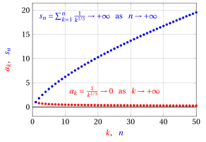
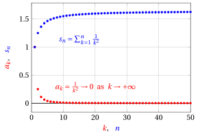
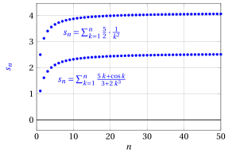

# Series with non-negative terms

**Part 5 · Series · Chapter 2** · lecture notes by Fabio Furini · [:material-file-pdf-box: Lecture notes, volume (PDF)](../pdf/lecture-notes-5-series.pdf) · [:material-presentation: Slides (PDF)](../pdf/slides-series-02-nonnegative-terms.pdf)

## 1. Series with non-negative terms

!!! chiave ""

    A <strong>series</strong> $\sum a_k$ <strong>with non-negative terms</strong> (or positive terms) is <strong>regular</strong>, that is, it is either convergent or divergent to $\ip$ (it cannot be irregular, as we have proved). Such a series converges if and only if the sequence of its partial sums is bounded.

### 1.1 Comparison test

!!! teorema "Theorem 1: Comparison test"

    Let $\{a_k\}$ and $\{b_k\}$ be two sequences with non-negative terms such that $a_k \le b_k$ eventually; then:

    $$
    i)~~~~ \sum b_k {\rm ~~~convergent~} ~~\Rightarrow~~ \sum a_k {\rm ~~~convergent~}
    $$

    $$
    ii)~~~~ \sum a_k {\rm ~~~divergent~} ~~\Rightarrow~~ \sum b_k {\rm ~~~divergent~}
    $$

- The series $\sum b_k$ is called the <strong>dominating series</strong> (majorant), while the series $\sum a_k$ is called the <strong>dominated series</strong> (minorant).

??? dimostrazione "Proof"

    Since $a_k \le b_k$ eventually, there exists $m \in \N$ such that:

    $$
    a_k \le b_k,~~~ \forall k \ge m
    $$

    Let us now consider the $n$-th partial sums of the tails of the two sequences $\{a_k\}$ and $\{b_k\}$, with $n >m$:

    $$
    s_n^a=\sum_{k=m+1}^n a_k {\rm ~~~~~and~~~~~~}s^b_n=\sum_{k=m+1}^n b_k
    $$

    Since $0\le a_k \le b_k$, $\forall k \ge m$, we have

    \begin{equation}
    0~~ \le~~ s^a_n~~ \le~~ s^b_n,~~~ \forall n \ge m \label{JJJJ}
    \end{equation}

    The sequences $\{s^a_n\}$ and $\{s^b_n\}$ are regular, since $\{a_k\}$ and $\{b_k\}$ have non-negative terms. Hence the claims $i)$ and $ii)$ are logically equivalent, so it suffices to prove the second one.

    Saying that $\sum a_n$ is divergent means, by the definition of divergent series, that $s_n \rr \ip$ as $n \rr \ip$. Moreover, since every tail has the same behavior as the original series, we have $s^a_n \rr \ip$ as $n \rr \ip$.

    From \(\eqref{JJJJ}\), by the comparison theorem for sequences, also ${s}^b_n \rr \ip$ as $n \rr \ip$. Hence the tail of $\{b_k\}$ is divergent and consequently $\sum b_n$ is divergent. □

!!! osservazione "Remark 1"

    Given $\alpha \le1$, the series $\sum_{k=1}^{\infty} \frac{1}{k^{\alpha}}$ is divergent to $\ip$.

??? dimostrazione "Proof"

    With $\alpha= 1$ we have the harmonic series, which diverges to $\ip$. With $\alpha <1$, the series dominates the harmonic series, since:

    $$
    \frac{1}{k}  \le \frac{1}{k^{\alpha}},~~~~~~~~~\forall k \in \N, k \ge 1 {\rm~~~and~~~} \alpha <1
    $$

    hence $\sum_{k=1}^{\infty} \frac{1}{k^{\alpha}}$ is divergent by the comparison test. □

- Graphically, for example with $\alpha= \frac{1}{3}$, we have:

{ .fig .ovale loading=lazy style="width:65%" }

### 1.2 Limit comparison test

!!! teorema "Theorem 2: Limit comparison test"

    Let $\{a_k\}$ and $\{b_k\}$ be two sequences with positive terms. If the sequences are asymptotically equivalent, that is, if:

    $$
    a_k \sim b_k {\rm ~~~as~~~} k \rr \ip
    $$

    then the corresponding series $\sum a_k$ and $\sum b_k$ are regular and have the same behavior, i.e., either they are both convergent or they are both divergent.

??? dimostrazione "Proof"

    The series $\sum a_k$ and $\sum b_k$ are regular because the sequences $\{a_k\}$ and $\{b_k\}$ have positive terms. Since $a_k \sim b_k$ as $k \rr \ip$, we have:

    $$
    \frac{a_k}{b_k} \rr 1 {\rm ~~as~~} k \rr \ip
    $$

    Hence, for every $\varepsilon >0$, there exists $m \in \N$ such that $\forall k \ge m$ we have:

    $$
    1- \varepsilon < \frac{a_k}{b_k} < 1 +\varepsilon
    {\rm ~~~~and~hence~~~~}  
    (1- \varepsilon)\; b_k < a_k < (1 +\varepsilon)\; b_k {\rm ~~~~since~}  b_k >0, \forall k
    $$

    We have thus proved that $(1- \varepsilon)\; b_k < a_k  < (1 +\varepsilon)\; b_k$ eventually. Hence, by the comparison test, the series $\sum a_k$ and $\sum b_k$ have the same behavior.

    The first of the two inequalities implies that if $\sum a_k$ is convergent then $\sum b_k$ is also convergent, while the second one implies that if $\sum a_k$ is divergent then $\sum b_k$ is also divergent. □

!!! osservazione "Remark 2"

    Given $\alpha \ge 2$, the series $\sum_{k=1}^{\infty} \frac{1}{k^{\alpha}}$ is convergent.

??? dimostrazione "Proof"

    With $\alpha= 2$ we have:

    $$
    \frac{1}{k^2} \sim \frac{1}{k \; (k+1)} {\rm ~~~as~~~} k \rr \ip
    $$

    and the series $\sum_{k=1}^{\infty} \frac{1}{k \; (k+1)}$ converges (Mengoli's series). Hence, by the limit comparison test, $\sum_{k=1}^{\infty} \frac{1}{k^2}$ also converges.

    With $\alpha>  2$, the series is dominated by the series $\sum_{k=1}^{\infty} \frac{1}{k^2}$, since:

    $$
    \frac{1}{k^{\alpha}} \le \frac{1}{k^2},~~~~~~~~~\forall k \in \N, k \ge 1 {\rm~~~and~~~} \alpha >2
    $$

    hence $\sum_{k=1}^{\infty} \frac{1}{k^{\alpha}}$ is convergent by the comparison test. □

- Graphically, for example with $\alpha= 2$, we have:

{ .fig .ovale loading=lazy style="width:65%" }

!!! esempio "Example 1: limit comparison test"

    Let us determine the behavior of the series:

    $$
    \sum_{k=1}^{\infty} \frac{5\;k + \cos k}{3 + 2\; k^3}
    $$

    We have:

    $$
    \frac{5\;k + \cos k}{3 + 2\; k^3} \sim \frac{5}{2} \cdot \frac{1}{k^2} {\rm ~~~as~~~} k \rr \ip {\rm ~~~~~and~~~~~}  \sum_{k=1}^{\infty} \frac{5}{2} \cdot \frac{1}{k^{2}} {\rm ~~~converges~~~}
    $$

    hence the series is convergent by the limit comparison test.

    { .fig .ovale loading=lazy style="width:65%" }

!!! chiave ""

    However, even if the sequences are asymptotically equivalent, the corresponding series may not have the same sum.

### 1.3 Condensation test

!!! teorema "Theorem 3: Condensation test"

    If $\{a_k\}$ is an eventually decreasing sequence with non-negative terms, then the series $\sum_{k=1}^{\infty} a_k$ and $\sum_{k=0}^{\infty} 2^k\; a_{2^k}$ are regular and have the same behavior, i.e., either they are both convergent or they are both divergent.

- Before proving the theorem, let us consider the sequence $\{\tilde{s}_n\}$ of the partial sums of the sequence $\{2^k \; a_{2^k}\}$, that is, the sequence:

    $$
    \tilde{s}_n = \sum_{k=0}^n 2^k \; a_{2^k}\qquad \forall n \ge 0
    $$

    and let us derive two important relations with the sequence $\{s_n\}$ of the partial sums of the sequence $\{a_{k}\}$, that is, the sequence:

    $$
    {s}_n = \sum_{k=1}^n a_{k}\qquad \forall n \ge 1
    $$

- We observe that, for certain values of $n$, the partial sums $s_n$ are:

    \begin{align*}
    \underbrace{s_1}_{\displaystyle =s_{2^1-1}}&=a_1,\qquad
    \underbrace{s_3}_{\displaystyle =s_{2^2-1}}=s_1 + a_2+\underbrace{a_3}_{\le a_2} \le a_1 + 2\;a_2\\[1ex]
    \underbrace{s_7}_{\displaystyle =s_{2^3-1}}&=s_3 + a_4 + \underbrace{a_5}_{\le a_4}+ \underbrace{a_6}_{\le a_4}+ \underbrace{a_7}_{\le a_4} \le a_1 + 2\;a_2 + 4\;a_4\\[1ex]
    \underbrace{s_{15}}_{\displaystyle =s_{2^4-1}}&=s_7 + a_8 + \underbrace{a_9}_{\le a_8} + \underbrace{a_{10}}_{\le a_8}+ \underbrace{a_{11}}_{\le a_8}+ \underbrace{a_{12}}_{\le a_8}+ \underbrace{a_{13}}_{\le a_8}+ \underbrace{a_{14}}_{\le a_8}+ \underbrace{a_{15}}_{\le a_8} \le a_1 + 2\;a_2 + 4\;a_4 + 8\;a_8
    \end{align*}

!!! osservazione "Remark 3"

    Given an eventually decreasing sequence $\{a_k\}$ with non-negative terms, we have:

    \begin{equation}
    s_{2^n-1} ~~\le~~  \underbrace{\sum_{k=0}^{n-1} 2^k \; a_{2^k}}_{=\tilde{s}_{n-1}}\qquad \forall n \ge 1 \label{P1}
    \end{equation}

??? dimostrazione "Proof"

    We prove by induction on $2^n$ that

    $$
    s_{2^n-1} ~~\le~~ \sum_{k=0}^{n-1} 2^k \; a_{2^k}\qquad \forall n \ge 1
    $$

    <strong>Base case.</strong>  Let $n = 1$. Then the claim becomes $s_{2^1-1} \le 2^0 \; a_1$, i.e., $a_1 \le a_1$, which is clearly true.

    <strong>Inductive step.</strong> Assume that it is true for $2^{n-1}$ and let us prove it for $2^n$. By the inductive hypothesis, we have $s_{2^{n-1}-1} ~\le~ \sum_{k=0}^{n-2} 2^k \; a_{2^k}$. Moreover, we have:

    $$
    s_{2^{n}-1} = s_{2^{n-1}-1} + \underbrace{\sum_{i=2^{n-1}}^{2^{n}-1} a_i}_{\le~ 2^{n-1} \; a_{2^{n-1}}}
    {\rm ~~~hence~~~~~} 
     s_{2^{n}-1} ~\le~  \sum_{k=0}^{n-2} 2^k \; a_{2^k} + 2^{n-1} \; a_{2^{n-1}} = \sum_{k=0}^{n-1} 2^k \; a_{2^k}
    $$

    which is exactly the desired claim for $2^n$. □

- We now observe that the values of $\tilde{s}_n$ are:

    \begin{align*}
    \tilde{s}_0&=a_1 \le 2 \; a_1 = 2\;\underbrace{s_1}_{\displaystyle =s_{2^0}},\qquad
    \tilde{s}_1=\tilde{s}_0 + 2\;a_2 \le 2\;s_1 + 2 \; a_2 = 2\;\underbrace{s_2}_{\displaystyle =s_{2^1}}\\[2ex]
    \tilde{s}_2&=\tilde{s}_1 + 4\;a_4 \le 2\;s_2 + 2 \; a_3 + 2 \; a_4 = 2\;\underbrace{s_4}_{\displaystyle =s_{2^2}} ~~~ ({\rm since~} a_4 \le a_3 )\\[2ex]
    \tilde{s}_3&=\tilde{s}_2 + 8\;a_8 \le 2\;s_4 + 2 \; a_5 + 2 \; a_6 + 2 \; a_7 + 2 \; a_8 = 2\;\underbrace{s_8}_{\displaystyle =s_{2^3}}~~~ ({\rm since~} a_8 \le a_7 \le a_6 \le a_5 )
    \end{align*}

!!! osservazione "Remark 4"

    Given an eventually decreasing sequence $\{a_k\}$ with non-negative terms, we have:

    \begin{equation}
    \underbrace{\sum_{k=0}^{n} 2^k \; a_{2^k}}_{=\tilde{s}_{n}} ~~\le~~ 2\; s_{2^n} \qquad \forall n \ge 0 \label{P2}
    \end{equation}

??? dimostrazione "Proof"

    We prove by induction on $2^n$ that

    $$
    \tilde{s}_{n} ~~\le~~ 2\; s_{2^n}\qquad \forall n \ge 0
    $$

    <strong>Base case.</strong>  Let $n = 0$. Then the claim becomes $\tilde{s}_{0} \le 2 \; s_{2^0} = 2 s_1$, i.e., $a_1 \le 2\;a_1$, which is clearly true.

    <strong>Inductive step.</strong> Assume that it is true for $n-1$ and let us prove it for $n$. By the inductive hypothesis, we have  $\tilde{s}_{n-1}  ~\le~ 2 \; s_{2^{n-1}}$. Moreover, we have:

    $$
    \tilde{s}_{n} = \tilde{s}_{n-1} + \underbrace{ 2^{n} \; a_{2^{n}}}_{\displaystyle \le \sum_{i=2^{n-1}+1}^{2^{n}} 2\; a_i}
    {\rm ~~~hence~~~~~} 
     \tilde{s}_{n} ~\le~  2 \; s_{2^{n-1}} +\sum_{i=2^{n-1}+1}^{2^{n}} 2\; a_i  = 2 \; s_{2^{n}}
    $$

    which is exactly the desired claim for $n$. □

- We are now able to prove the theorem.

??? dimostrazione "Proof"

    From relation \(\eqref{P1}\) we have:

    $$
    s_{2^n-1} \le \tilde{s}_{n-1} ,~~~ \forall n \ge 1
    $$

    Hence, if $\{\tilde{s}_n\}$ is convergent, that is, if $\sum_{k=0}^{\infty} 2^k\; a_{2^k}$ is convergent, the subsequence $\{s_{2^{n}-1}\}$ is bounded.  Since $\{s_n\}$ is monotone, the whole sequence $\{s_n\}$ is bounded and convergent by the monotone sequence theorem. Consequently, if $\sum_{k=0}^{\infty} 2^k\; a_{2^k}$ is convergent, then $\sum_{k=1}^{\infty}  a_{k}$ is also convergent.

    From relation \(\eqref{P2}\) we have:

    $$
    \tilde{s}_{n}  \le 2\;s_{2^n},~~~ \forall n \ge 0
    $$

    Hence, if $\{{s}_n\}$ is convergent, that is, if $\sum_{k=1}^{\infty} a_{k}$ is convergent, then the subsequence $\{s_{2^n}\}$ is convergent (since $\{{s}_n\}$ is monotone). Consequently, by comparison, $\{\tilde{s}_{n}\}$ is also convergent, that is, $\sum_{k=0}^{\infty} 2^k\; a_{2^k}$ converges.

    Moreover, since $\{a_k\}$ has non-negative terms, the series cannot be irregular; consequently, we also have:

    \begin{equation*}
    \sum_{k=1}^{\infty} a_k {\rm ~~divergent~~} ~~\Longleftrightarrow~~ \sum_{k=0}^{\infty} 2^k\; a_{2^k} {\rm ~~divergent~~}
    \end{equation*}

    which completes the proof of the theorem. □

!!! chiave ""

    Given an eventually decreasing sequence $\{a_k\}$ with non-negative terms, we have proved that:

    \begin{equation*}
    \sum_{k=1}^{\infty} a_k {\rm ~~convergent/divergent~~} ~~\Longleftrightarrow~~ \sum_{k=0}^{\infty} 2^k\; a_{2^k} {\rm ~~convergent/divergent~~}
    \end{equation*}

    Hence the convergence/divergence of $\sum_{k=0}^{\infty} 2^k\; a_{2^k}$ is a necessary and sufficient condition for the convergence/divergence of $\sum_{k=1}^{\infty}  a_{k}$.

### 1.4 Generalized harmonic series

!!! definizione "Definition 1: Generalized harmonic series"

    Given $\alpha \in \R$, the series $\sum_{k=1}^{\infty} \frac{1}{k^{\alpha}}$ is called the <strong>generalized harmonic series</strong>

!!! teorema "Theorem 4: Behavior of the generalized harmonic series"

    Given $\alpha \in \R$,

    $$
    {\rm the~generalized~harmonic~series~} \sum_{k=1}^{\infty} \frac{1}{k^{\alpha}}  {\rm ~~~~is~~~~} 
    \begin{cases}
    {\rm divergent~to~} \ip & {\rm if~} \alpha \le 1\\[2ex]
    {\rm convergent~} & {\rm if~} \alpha > 1
    \end{cases}
    $$

??? dimostrazione "Proof"

    We have already established that it diverges for $\alpha \le 1$. For $\alpha >1$, the sequence $\left\{\frac{1}{k^{\alpha}}\right\}$ is a decreasing sequence with positive terms. We have:

    $$
    \sum_{k=0}^{\infty} 2^k a_{2^k} = \sum_{k=0}^{\infty} 2^k \frac{1}{(2^k)^{\alpha}} = \sum_{k=0}^{\infty} \left( 2^{1-\alpha} \right)^k
    $$

    that is, a geometric series with ratio $2^{1-\alpha}$, which converges if and only if $2^{1-\alpha}<1$, that is, if $1 -\alpha < 0$. Hence, for $\alpha >1$, by the condensation test, the series converges. □

<strong>Try it</strong> — the interactive graph below shows what you have just read: move the sliders.

### 1.5 Passing from the discrete to the continuous

- The tools used to establish asymptotic estimates of functions can also be used to obtain asymptotic estimates of sequences (<strong>passing from the discrete to the continuous</strong>), and they provide useful tools for studying the behavior of a series with positive terms.

!!! esempio "Example 2: passing from the discrete to the continuous"

    Let us determine the behavior of the series:

    $$
    \sum_{k=1}^{\infty} \frac{e^{1/k}-1}{k}
    $$

    From the asymptotic equivalence

    $$
    e^{\varepsilon(x)} - 1 \sim \varepsilon(x) {\rm ~~~~as~~~~}   \varepsilon(x) \rr 0
    $$

    we have

    $$
    \frac{e^{1/k}-1}{k} \sim \frac{1}{k^2} {\rm ~~~~as~~~~}   k \rr \ip
    $$

    Therefore the series, which has positive terms, converges by limit comparison with the series of $1/k^2$.

!!! esempio "Example 3: passing from the discrete to the continuous"

    Let us determine the behavior of the series:

    $$
    \sum_{k=1}^{\infty} \log \left( \frac{k+3}{k+2} \right)
    $$

    We have

    $$
    \frac{k+3}{k+2} = 1 + \frac{1}{k+2}= 1 + \frac{1}{k+2}
    $$

    From the asymptotic equivalence

    $$
    \log (1 + \varepsilon(x)) \sim \varepsilon(x) {\rm ~~~~as~~~~}   \varepsilon(x) \rr 0
    $$

    we have

    $$
    \log \left( 1 + \frac{1}{k+2} \right) \sim \frac{1}{k+2} \sim \frac{1}{k} {\rm ~~~~as~~~~}   k \rr \ip
    $$

    Thus it is a series with positive terms whose general term is asymptotically equivalent to $1/k$. By comparison with the harmonic series, this series diverges to $\ip$.

!!! esempio "Example 4: passing from the discrete to the continuous"

    Let us determine the behavior of the series:

    $$
    \sum_{k=1}^{\infty} \left( \frac{1}{k} -\sin \frac{1}{k} \right)
    $$

    From the third-order Maclaurin expansion

    $$
    \sin \big(\varepsilon(x) \big) = \varepsilon(x) - \frac{\big(\varepsilon(x) \big)^3}{3!} + o\bigg(\big(\varepsilon(x) \big)^{3}\bigg) {\rm ~~~~as~~~~}   \varepsilon(x) \rr 0
    $$

    we have

    $$
    \frac{1}{k} -\sin \frac{1}{k} = \frac{1}{k} - \left( \frac{1}{k} - \frac{1}{6\;k^3} + o\left(\frac{1}{k^3}\right) \right) \sim \frac{1}{6\;k^3}  {\rm ~~~~as~~~~}   k \rr \ip
    $$

    Therefore the series, which has positive terms, converges by limit comparison with the series of $1/(6\:k^3)$.

### 1.6 Root test

!!! teorema "Theorem 5: Root test"

    Let $\{a_k\}$ be a sequence with non-negative terms. If the following limit exists:

    $$
    \lim_{k \rr \ip} \sqrt[k]{a_k} = \ell \in \R^*
    {\rm~~then~the~series~} \sum a_k  {\rm ~~~~is~~~~} 
    \begin{cases}
    {\rm convergent~} & {\rm if~} \ell < 1 {\rm ~~or~~} \ell = \im\\[2ex]
    {\rm divergent~to~} \ip & {\rm if~} \ell > 1 {\rm ~~or~~} \ell = \ip
    \end{cases}
    $$

??? dimostrazione "Proof"

    Suppose that $\lim_{k \rr \ip} \sqrt[k]{a_k} = \ell < 1$. Since $\sqrt[k]{a_k} \rr \ell \in \R$, for every $\varepsilon >0$ there exists $m \in \N$ such that $\forall k \ge m$:

    $$
    \sqrt[k]{a_k} ~\le~ \ell + \frac{\varepsilon}{2}
    $$

    Moreover, since $\ell < 1$, we have $\ell < 1 - \varepsilon$ for a suitable $\varepsilon > 0$. For this $\varepsilon$ we therefore have, eventually:

    $$
    \sqrt[k]{a_k} ~\le~ \ell + \frac{\varepsilon}{2} < (1 - \varepsilon) + \frac{\varepsilon}{2} = 1 - \frac{\varepsilon}{2} {\rm ~~~~hence~~~~} a_k < \left(1 - \frac{\varepsilon}{2} \right)^k,~~ \forall k \ge m
    $$

    We have thus proved that $a_k < \left(1 - \frac{\varepsilon}{2} \right)^k$ eventually. The geometric series:

    $$
    \sum_{k=0}^{\infty} \left(1 - \frac{\varepsilon}{2}\right)^k {\rm ~~~is ~convergent~since~~} 1 - \frac{\varepsilon}{2} <1
    $$

    Hence, by the comparison test, the original series converges.

    Suppose that $\lim_{k \rr \ip} \sqrt[k]{a_k} = \ell > 1$. Since $\sqrt[k]{a_k} \rr \ell \in \R$, for every $\varepsilon >0$ there exists $m \in \N$ such that $\forall k \ge m$:

    $$
    \sqrt[k]{a_k} ~\ge~ \ell - \frac{\varepsilon}{2}
    $$

    Moreover, since $\ell > 1$, we have $\ell > 1 + \varepsilon$ for a suitable $\varepsilon > 0$. For this $\varepsilon$ we therefore have, eventually:

    $$
    \sqrt[k]{a_k} ~\ge~ \ell - \frac{\varepsilon}{2} > (1 + \varepsilon) - \frac{\varepsilon}{2} = 1 + \frac{\varepsilon}{2} {\rm ~~~~hence~~~~} a_k > \left(1 + \frac{\varepsilon}{2} \right)^k,~~ \forall k \ge m
    $$

    We have thus proved that $a_k > \left(1 + \frac{\varepsilon}{2} \right)^k$ eventually. The geometric series:

    $$
    \sum_{k=0}^{\infty} \left(1 + \frac{\varepsilon}{2} \right)^k {\rm ~~~is ~divergent~since~~} 1 + \frac{\varepsilon}{2} >1
    $$

    Hence, by the comparison test, the original series diverges. □

!!! chiave ""

    Clearly, these arguments remain valid also if $\ell = \im$ or $\ip$, respectively.

!!! osservazione "Remark 5"

    $$
    {\rm The~series~~~~} \sum_{k=1}^{\infty} k^\beta  \cdot b^k {\rm ~~with~~~} \beta \in \R,b \ge 0 {\rm ~~~~is~~~~~~} 
    \begin{cases}
    {\rm convergent~} & {\rm if~} b < 1\\[2ex]
    {\rm divergent} & {\rm if~} b > 1 \\[2ex]
    {\rm convergent}  & {\rm if~} b = 1 {\rm ~~and~~} \beta < -1 \\[2ex]
    {\rm divergent}  & {\rm if~} b = 1 {\rm ~~and~~} \beta \ge  -1 
    \end{cases}
    $$

??? dimostrazione "Proof"

    It is a series with non-negative terms, and we have:

    $$
    \sqrt[k]{k^\beta \cdot b^k} = b \cdot k^{\beta/k} {\rm ~~~~~and~~~~}
     \lim_{k \rr \ip} k^{\beta/k} = \lim_{k \rr \ip} \exp \left( \underbrace{\frac{\beta}{k} \cdot \log k}_{\rr 0} \right) = 1
    $$

    hence, by the root test, it converges for $b < 1$ and diverges for $b > 1$. If $b=1$, the series becomes:

    $$
    \sum_{k=1}^{\infty} k^\beta =  \sum_{k=1}^{\infty} \frac{1}{k^{-\beta}}
    $$

    that is, a generalized harmonic series; it is convergent for $\beta < -1$, while it is divergent for $\beta \ge -1$. □

!!! osservazione "Remark 6"

    The series $\sum_{k=1}^{\infty} b^k / k^k$ with $b \ge 0$ is convergent

??? dimostrazione "Proof"

    It is a series with non-negative terms, and we have:

    $$
    \sqrt[k]{\frac{b^k}{k^k}} = \frac{b}{k} \rr 0 {\rm ~~~as~~~} k \rr \ip
    $$

    hence the series converges by the root test. □

### 1.7 Ratio test

!!! teorema "Theorem 6: Ratio test"

    Let $\{a_k\}$ be a sequence with positive terms. If the following limit exists:

    $$
    \lim_{k \rr \ip} \frac{a_{k+1}}{a_k} = \ell \in \R^*
    {\rm~~then~the~series~}  \sum a_k  {\rm ~~~~is~~~~} 
    \begin{cases}
    {\rm convergent~} & {\rm if~} \ell < 1 {\rm ~~or~~} \ell = \im\\[2ex]
    {\rm divergent~to~} \ip & {\rm if~} \ell > 1 {\rm ~~or~~} \ell = \ip
    \end{cases}
    $$

??? dimostrazione "Proof"

    Suppose that $\lim_{k \rr \ip} a_{k+1}/ a_k = \ell<1$. Reasoning as in the proof of the root test, there exists $m \in \N$ such that $\forall k \ge m$:

    $$
    \frac{a_{k+1}}{a_k} < \left(1 - \frac{\varepsilon}{2} \right)
    $$

    for a suitable $\varepsilon >0$. Reasoning iteratively, this implies that:

    $$
    a_{k+1} < \left(1 - \frac{\varepsilon}{2} \right) \; a_k < \left(1 - \frac{\varepsilon}{2} \right) \; \left(1 - \frac{\varepsilon}{2} \right) \; a_{k-1} < {\rm \dots} < \left(1 - \frac{\varepsilon}{2} \right)^{k-m+1}  a_m
    $$

    We have thus proved that $a_k < \left(1 - \frac{\varepsilon}{2} \right)^{k-m} \; a_m$ eventually. The geometric series:

    $$
    \sum_{k=m}^{\infty} \left(1 - \frac{\varepsilon}{2}\right)^{k-m}\; a_m {\rm ~~~is ~convergent~since~~} 1 - \frac{\varepsilon}{2} <1
    $$

    Hence, by the comparison test, the original series converges.

    Suppose that  $\lim_{k \rr \ip} a_{k+1}/a_k = \ell>1$. Reasoning as in the proof of the root test, there exists $m \in \N$ such that $\forall k \ge m$:

    $$
    \frac{a_{k+1}}{a_k} > \left(1 + \frac{\varepsilon}{2} \right)
    $$

    for a suitable $\varepsilon >0$. Reasoning iteratively, this implies that:

    $$
    a_{k+1} > \left(1 + \frac{\varepsilon}{2} \right) \; a_k > \left(1 + \frac{\varepsilon}{2} \right) \; \left(1 + \frac{\varepsilon}{2} \right) \; a_{k-1} > {\rm \dots} > \left(1 + \frac{\varepsilon}{2} \right)^{k-m+1}  a_m
    $$

    We have thus proved that $a_k > \left(1 + \frac{\varepsilon}{2} \right)^{k-m} \; a_m$ eventually. The geometric series:

    $$
    \sum_{k=m}^{\infty} \left(1 + \frac{\varepsilon}{2}\right)^{k-m}\; a_m {\rm ~~~is ~divergent~since~~} 1 + \frac{\varepsilon}{2} >1
    $$

    Hence, by the comparison test, the original series diverges. □

!!! chiave ""

    Clearly, these arguments remain valid also if $\ell = \im$ or $\ip$, respectively.

!!! osservazione "Remark 7"

    $$
    \sum_{k=0}^{\infty} \frac{1}{k!} = e
    $$

??? dimostrazione "Proof"

    We have

    $$
    \frac{1/(k+1)!}{1/k!} = \frac{1}{k+1} \rr 0 {\rm ~~~as~~~} k \rr \ip
    $$

    Therefore the series, which has non-negative terms, converges by the ratio test. The proof that the sum of the series is equal to $e$ will be given later using series of functions. □

### 1.8 Series with non-positive terms

- We know that the behavior of a series does not change if we alter a finite number of its terms. Consequently, the tests for series with non-negative terms also apply to series whose terms are eventually non-negative.

- Moreover, by factoring a minus sign out of the whole series, we see that these tests can also be applied to series with non-positive terms, and hence to series whose terms are eventually non-positive.

!!! chiave ""

    In summary, therefore, the tests we have seen apply to series all of whose terms (except for a finite number) have the same sign.
