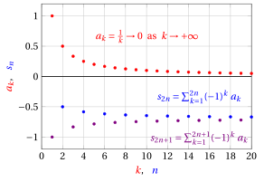

# Series with terms of variable sign

**Part 5 · Series · Chapter 3** · lecture notes by Fabio Furini · [:material-file-pdf-box: Lecture notes, volume (PDF)](../pdf/lecture-notes-5-series.pdf) · [:material-presentation: Slides (PDF)](../pdf/slides-series-03-alternating-series.pdf)

## 1. Series with terms of variable sign

!!! definizione "Definition 1: absolutely convergent series"

    A series $\sum a_k$ is absolutely convergent if the series $\sum |a_k|$ converges.

!!! teorema "Theorem 1"

    If a series $\sum a_k$ converges absolutely, then it converges.

??? dimostrazione "Proof"

    Without loss of generality, let $n_0=0$ and consider the following series:

    $$
    \sum_{k=0}^{\infty} \big(|a_k|-a_k \big)
    $$

    It is a series with nonnegative terms since, for every $k\in\mathbb N$, we have:

    $$
    \begin{cases}
    |a_k|-a_k=-2a_k \ge 0 & {\rm if~~} a_k<0\\[2ex]
    |a_k|-a_k=0  & {\rm if~~} a_k \ge 0
    \end{cases}
    $$

    Moreover, by the triangle inequality, for every $k\in\mathbb N$, we have:

    $$
    \underbrace{|a_k|-a_k}_{\ge 0}=\big||a_k|-a_k \big|\le |a_k|+|a_k|=2|a_k|
    $$

    Hence, by the comparison test for series with nonnegative terms, we have

    $$
    \sum_{k=0}^\infty |a_k| {\rm~~convergent~} \Longrightarrow \sum_{k=0}^\infty \big(|a_k|-a_k \big){\rm~~convergent~~}
    $$

    Since for every $k\in\mathbb N$ we have $a_k=|a_k|-\big(|a_k|-a_k\big)$ and the   series $\sum_{k=0}^\infty |a_k|$ and $\sum_{k=0}^\infty (|a_k|-a_k)$ converge,  we have:

    $$
    \sum_{k=0}^\infty a_k=\sum_{k=0}^\infty |a_k|-\sum_{k=0}^\infty \big(|a_k|-a_k\big)
    $$

    that is, the series is the difference of two convergent series. Consequently, the series $\sum_{k=0}^\infty a_k$ is convergent as well. □

- The following is an alternative proof.

??? dimostrazione "Proof"

    Without loss of generality, let $n_0=0$ and split the sequence $\{s_n\}$ of partial sums into two sequences, the first containing only the positive terms and the second only the negative terms:

    \begin{align*}
    s_n^+ = \sum_{\substack{k \in \{0,1,\dots,n\}:~ a_k> 0}} a_k {\rm ~~~~~and~~~~~} 
    s_n^- = \sum_{k\in \{0,1,\dots,n\}:~ a_k< 0} -a_k  
    {\rm ~~~~~hence~~~~~} s_n =  s_n^+ - s_n^-
    \end{align*}

    Consequently, it is enough to show that the sequences $\{s_n^+\}$ and $\{s_n^-\}$ are convergent to conclude that $\{s_n\}$ converges, and hence that the series $\sum a_k$ converges.

    We observe that $\{s_n^+\}$ and $\{s_n^-\}$ are monotone non-decreasing sequences and moreover, by the triangle inequality, we have:

    \begin{align*}
    s_n^+ \le \sum_{k=0}^{n} |a_k| {\rm ~~~~~and~~~~~} 
    s_n^- \le \sum_{k=0}^{n} |a_k|
    \end{align*}

    On the other hand, by hypothesis the series $\sum a_k$ converges absolutely, i.e., $\sum |a_k|$ converges, and hence the quantity $\sum_{k=0}^n |a_k|$ is bounded; therefore the sequences $\{s_n^+\}$ and $\{s_n^-\}$ are bounded above and non-decreasing, and hence they converge, by the monotone sequence theorem. □

!!! esempio "Example 1: absolute convergence"

    Let us determine the behavior of the series:

    $$
    \sum_{k=1}^{\infty} \frac{(-1)^k}{k^{\alpha}} ~~~~~~ {\rm with~~~} \alpha > 1
    $$

    We have:

    $$
    \left| \frac{(-1)^k}{k^{\alpha}} \right| = \frac{1}{k^{\alpha}}, ~\forall k \in \N, k>1 {\rm ~~~~~~and~~~~~~} \sum_{k=1}^{\infty} \frac{1}{k^{\alpha}} {\rm ~~~is~convergent~for~~~}   \alpha > 1
    $$

    Therefore the series converges absolutely and hence it converges.

!!! chiave ""

    Absolute convergence implies ordinary convergence, also called simple convergence:

    \begin{equation}
    \label{BBBB}
    \sum |a_k| {\rm ~convergent~~} ~~\Rightarrow~~ \sum a_k {\rm ~convergent~~}
    \end{equation}

    but the converse is not true (we will give a counterexample later):

    \begin{equation}
    \label{LLLL}
    \sum a_k {\rm ~convergent~~} ~~\nRightarrow~~ \sum |a_k| {\rm ~convergent~~}
    \end{equation}

    Hence absolute convergence is a sufficient but not necessary condition for ordinary convergence.

### 1.1 Alternating series and the Leibniz test

- Among series with terms of variable sign, a particularly simple case is given by alternating series, for which the following convergence test holds.

!!! teorema "Theorem 2: Leibniz (alternating series) test"

    Consider the series

    $$
    \sum_{k=n_0}^{\infty} (-1)^k \; a_k {\rm ~~~with~~~}  a_k\ge 0, \forall k
    $$

    If the sequence $\{a_k\}$ is decreasing and  $a_k \rr 0$ as $k \rr \ip$, then the series is convergent. Moreover:

    $$
    s_{2n} = \sum_{k=n_0}^{2n} (-1)^k \; a_k \; \downarrow \; s {\rm ~~~~~~and~~~~~~} s_{2n+1} = \sum_{k=n_0}^{2n+1} (-1)^k \; a_k \; \uparrow \; s {\rm ~~~~~as~~} n \rr \ip
    $$

- The partial sums with even index approximate the sum $s$ from above and those with odd index from below.

- The Leibniz test can clearly be applied also if the terms eventually have alternating signs and the sequence $\{a_k\}$ is eventually decreasing.

!!! esempio "Example 2: Leibniz test"

    Let us determine the behavior of the series:

    $$
    \sum_{k=1}^{\infty} (-1)^k \; \frac{1}{k}
    $$

    The sequence $a_k = \frac{1}{k}$ is decreasing and non-negative. Moreover $\frac{1}{k}\rr 0$ as $k \rr \ip$, hence it satisfies the two conditions of the Leibniz test theorem. Consequently, the series is convergent.

    { .fig .ovale loading=lazy style="width:65%" }

!!! chiave ""

    The series $\sum_{k=1}^{\infty}   \frac{(-1)^k}{k}$ converges and is a counterexample to \(\eqref{LLLL}\), that is, a series that converges but does not converge absolutely, since:

    $$
    \sum_{k=1}^{\infty} \left| \frac{(-1)^k}{k} \right| = \sum_{k=1}^{\infty}  \frac{1}{k}  {\rm ~~~~~and~~~~~} \sum_{k=1}^{\infty}  \frac{1}{k} {\rm ~~diverges~(harmonic~series)}
    $$

??? dimostrazione "Proof"

    Consider the sequence of partial sums $\{s_n\}$ with $n_0=0$ and the two subsequences extracted from it, $\{ s_{2n}\}$ and $\{s_{2n+1}\}$.

    For $\{ s_{2n}\}$ we have:

    $$
    s_0=a_0,~~~ s_2= s_0 - a_1 + \underbrace{a_2}_{\le a_1} \le s_0,~~~s_4= s_2 - a_3 + \underbrace{a_4}_{\le a_3} \le s_2, ~~~\dots
    $$

    hence the sequence $\{ s_{2n}\}$ is monotone decreasing.

    For $\{ s_{2n+1}\}$ we have:

    $$
    s_1=a_0-a_1,~~~ s_3= s_1 + a_2 - \underbrace{a_3}_{\le a_2} \ge s_1,~~~s_5= s_3 + a_4 - \underbrace{a_5}_{\le a_4} \ge s_3, ~~~\dots
    $$

    hence  the sequence $\{s_{2n+1}\}$ is monotone increasing.

    Moreover, we have:

    $$
    s_1\le s_{2n+1} = s_{2n} - a_{2n+1} \le s_{2n} \le s_0
    $$

    therefore $\{s_{2n+1}\}$ is bounded above and $\{ s_{2n}\}$ is bounded below. The two sequences are hence convergent, by the monotone sequence theorem.

    The two sequences converge to the same limit, because

    $$
    0 \le s_{2n} - s_{2n+1} \le a_{2n+1} \rr 0 {\rm ~~~as~~~} n \rr \ip
    $$

    Calling $s$ this limit, since  $\{ s_{2n}\}$ is monotone decreasing and $\{ s_{2n+1}\}$ is monotone increasing, we have:

    $$
    s_{2n} = \sum_{k=n_0}^{2n} (-1)^k \; a_k \; \downarrow \; s {\rm ~~~~~~and~~~~~~} s_{2n+1} = \sum_{k=n_0}^{2n+1} (-1)^k \; a_k \; \uparrow \; s {\rm ~~~~~as~~} n \rr \ip
    $$

    Hence the series is convergent since $s_{2n+1} \rr s~$ and  $s_{2n} \rr  s~$ as $n \rr \ip$, and consequently  we have:

    $$
    s_n \rr s {\rm ~~~as~~~} n \rr \ip
    $$

    
□

!!! teorema "Corollary 1: of the Leibniz test theorem"

    Given a series satisfying the hypotheses of the Leibniz test theorem, we have:

    $$
    \underbrace{ |s-s_{m}|}_{=\left| \sum_{k=m+1}^{\infty} (-1)^k \; a_k \right|} \le a_{m+1}, ~~~\forall m \in \N
    $$

- For every $m$, the error made by approximating $s$ with $s_m$ is, in absolute value, bounded above by the value of the first omitted term. In other words, the tail of the series tends to a value  less than or equal to $a_{m+1}$.

??? dimostrazione "Proof"

    Since

    $$
    s_{2n+1} \; \uparrow \; s  {\rm ~~~~~~and~~~~~~} s_{2n} \; \downarrow \; s {\rm ~~~as~~} n \rr \ip
    $$

    we therefore have, for every $n \in \N$:

    $$
    s_{2n-1} \le s \le s_{2n} {\rm ~~~~~~and~~~~~~} s_{2n+1} \le s \le s_{2n}
    $$

    from which we deduce

    $$
    0 \le s - s_{2n-1} \le s_{2n} - s_{2n-1} = a_{2n} {\rm ~~~~~~and~~~~~~} 0 \le s_{2n} - s \le s_{2n} - s_{2n+1} = a_{2n+1}
    $$

    Therefore, for every $m$, whether even or odd, we have:

    $$
    |s-s_{m}|=\left| \sum_{k=m+1}^{\infty} (-1)^k \; a_k \right| \le a_{m+1}
    $$

    
□

!!! esempio "Example 3: Leibniz test"

    Let us determine the behavior of the series:

    $$
    \sum_{k=1}^{\infty}  (-1)^k \; \frac{k-1 }{k^2+k}
    $$

    We have:

    $$
    a_k=\frac{k-1 }{k^2+k} = \frac{k-1 }{k\;(k+1)} \ge 0, \forall k \in \N, k \ge 1 \qquad{\rm and}\qquad  \frac{k-1 }{k\;(k+1)} \sim \frac{1}{k} \rr 0 {\rm ~~as~~} k \rr \ip
    $$

    hence the series does not converge absolutely. However, the series is decreasing for $k \ge 2$ since:

    $$
    \underbrace{\frac{k}{(k+1)(k+2)}}_{= a_{k+1}} \le \underbrace{\frac{k-1 }{k\;(k+1)}}_{= a_k} \Longleftrightarrow k^2 \le k^2 + k -2 \Longleftrightarrow k \ge 2
    $$

    hence the series converges by the Leibniz test, since it is eventually decreasing.

!!! esempio "Example 4: Leibniz test"

    Let us determine the behavior of the series:

    $$
    \sum_{k=2}^{\infty}  (-1)^k \; \frac{\log k}{k}
    $$

    We have:

    $$
    a_k= \frac{\log k}{k} \ge 0, \forall k \ge 2 {\rm ~~~~~and~~~~~}  \frac{\log k}{k} \rr 0 {\rm ~~as~~} k \rr \ip
    $$

    moreover

    $$
    \frac{\log k}{k} > \frac{1}{k} {\rm ~~~for~~} k \ge 3 {\rm ~~~~~and~~~~~} \sum_{k=1}^{\infty} \frac{1}{k} {\rm ~~~~diverges}
    $$

    hence the series does not converge absolutely. Proving algebraically that the sequence $\{a_k\}$ is decreasing is complicated; instead, we pass from the discrete to the continuous setting. We have, for $x \in \R$ and $x \ge 2$:

    $$
    f(x) = \frac{\log x}{x}  {\rm ~~~~and~~~~} f'(x) = \frac{1-\log x}{x^2} \le 0 {\rm ~~~for~~~} x \ge e
    $$

    It follows that $f$ is decreasing for $x \ge e$; consequently the sequence $a_k = f ( k)$ is decreasing for $k \ge 3$ (the first integer $>  e$). Hence the series converges by the Leibniz test.

!!! chiave ""

    $$
    {\rm if~~} \sum a_k {\rm ~converges~~~and~~~~} \sum b_k {\rm ~converges~~~~~then~~} \sum (a_k+b_k) {\rm ~converges}
    $$

    $$
    {\rm if~~} \sum a_k {\rm ~converges~~~and~~~~} \sum b_k {\rm ~diverges~~~~~then~~} \sum (a_k+b_k) {\rm ~diverges}
    $$

    This can be checked by viewing the series as the limit of the sequence of partial sums and applying the theorem on the limit of a sum.

!!! esempio "Example 5: Leibniz test"

    Let us determine the behavior of the series:

    $$
    \sum_{k=1}^{\infty}   \frac{k+1 +(-1)^k \; k^2}{k^3}
    $$

    We split it into the sum of two series:

    $$
    \sum_{k=1}^{\infty}   \frac{k+1 +(-1)^k \; k^2}{k^3} = \sum_{k=1}^{\infty} \frac{k+1 }{k^3} + \sum_{k=1}^{\infty} \frac{(-1)^k}{k}
    $$

    For the first series we have:

    $$
    \frac{k+1 }{k^3} \ge 0, \forall k \ge 1 \qquad{\rm and}\qquad  \frac{k+1 }{k^3}\rr 0 {\rm ~~as~~} k \rr \ip
    $$

    hence it converges by the limit comparison test, since:

    $$
    \frac{k+1 }{k^3}  \sim \frac{1}{k^2} {\rm ~~~~~and~~~~~} \sum_{k=1}^{\infty} \frac{1}{k^2} {\rm ~~~~converges}
    $$

    The second series converges by the Leibniz test; hence the original series converges.

!!! esempio "Example 6: Leibniz test"

    Let us determine the behavior of the series:

    $$
    \sum_{k=1}^{\infty}  (-1)^k \left( \frac{\sqrt{k}+(-1)^k}{k}\right)
    $$

    We split it into the sum of two series:

    $$
    \sum_{k=1}^{\infty}  (-1)^k \left( \frac{\sqrt{k}+(-1)^k}{k}\right) = \sum_{k=1}^{\infty} \frac{(-1)^k}{\sqrt{k}} + \sum_{k=1}^{\infty} \frac{1}{k}
    $$

    The first series converges by the Leibniz test; the second diverges (harmonic series); hence the original series diverges.

!!! esempio "Example 7: Leibniz test"

    Let us determine the behavior of the series:

    $$
    \sum_{k=1}^{\infty}  \frac{(-1)^{k+1} }{k}
    $$

    We have:

    $$
    \frac{(-1)^{k+1} }{k} = -\frac{(-1)^{k} }{k}, ~\forall k\in \N, k>1
    $$

    moreover, the sequence $a_k = \frac{1}{k}$ is decreasing and $\frac{1}{k}\rr 0$ as $k \rr \ip$, hence it satisfies the two conditions of the theorem. Consequently, the series $\sum_{k=1}^{\infty}   \frac{(-1)^{k+1}}{k}$ converges.

<strong>Try it</strong> — the interactive graph below shows what you have just read: move the sliders.

